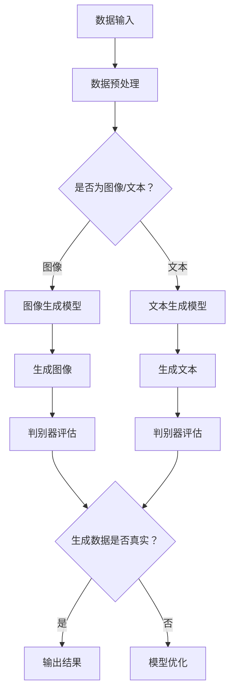

                 

关键词：生成式AIGC、多步推理、深度学习、算法优化、应用领域、发展趋势

摘要：本文探讨了生成式人工智能生成内容（AIGC）在当前科技浪潮中的地位和未来前景。通过深入分析生成式AIGC的核心概念、算法原理、应用场景以及面临的挑战，本文旨在为读者提供对这一领域的全面了解，并探讨其在实际应用中的潜力和局限性。

## 1. 背景介绍

随着深度学习技术的迅猛发展，人工智能（AI）已经从理论研究走向了实际应用，成为了现代科技发展的重要驱动力。其中，生成式人工智能（Generative Artificial Intelligence）作为AI领域的一个重要分支，正日益受到广泛关注。生成式AIGC通过模拟人类创造过程，能够自动生成文本、图像、音频等多种形式的内容，从而为各类应用场景提供了丰富的可能性。

### 生成式AIGC的核心概念

生成式AIGC的核心在于其“生成”能力，即通过学习大量数据，模型能够生成与训练数据相似的新内容。这一特性使得生成式AIGC在创意设计、内容生成、个性化推荐等方面具有巨大的应用潜力。

### 生成式AIGC的发展历程

生成式AIGC的发展历程可以追溯到20世纪80年代，早期的研究主要集中在生成模型的理论基础上。随着深度学习技术的崛起，生成对抗网络（GAN）、变分自编码器（VAE）等生成模型得到了广泛应用，显著提升了生成式AIGC的能力。

### 当前生成式AIGC的应用场景

当前，生成式AIGC已经在多个领域展现出了强大的应用潜力，如：

- **图像生成**：通过GAN等技术生成逼真的图像，应用于艺术创作、游戏开发等领域。
- **文本生成**：利用深度学习模型生成新闻文章、故事、代码等，应用于内容创作和自动化写作。
- **语音合成**：通过深度神经网络生成逼真的语音，应用于语音助手、智能客服等场景。

## 2. 核心概念与联系

### 核心概念

- **生成对抗网络（GAN）**：一种由生成器和判别器组成的模型，生成器负责生成与真实数据相似的数据，判别器则负责区分生成数据和真实数据。
- **变分自编码器（VAE）**：一种通过概率模型进行数据编码和生成的算法，能够学习数据的潜在分布。
- **多步推理**：在生成式AIGC中，模型需要通过多个步骤进行推理，生成高质量的内容。

### 架构与流程

以下是一个简化的生成式AIGC架构和流程图：



### 多步推理的重要性

在生成式AIGC中，多步推理是生成高质量内容的关键。模型需要通过多个步骤进行数据预处理、特征提取、生成和评估，从而逐步提升生成结果的质量。

## 3. 核心算法原理 & 具体操作步骤

### 3.1 算法原理概述

生成式AIGC的核心算法包括生成对抗网络（GAN）和变分自编码器（VAE）。下面分别介绍这两种算法的原理。

#### 3.1.1 生成对抗网络（GAN）

GAN由生成器（Generator）和判别器（Discriminator）组成。生成器的目标是生成与真实数据相似的数据，而判别器的目标是区分生成数据和真实数据。通过不断的训练和优化，生成器和判别器相互对抗，最终生成器能够生成高质量的数据。

#### 3.1.2 变分自编码器（VAE）

VAE是一种基于概率模型的生成模型。通过学习数据的潜在分布，VAE能够生成与训练数据相似的新数据。VAE的核心是编码器和解码器，编码器将数据映射到潜在空间，解码器则从潜在空间生成数据。

### 3.2 算法步骤详解

#### 3.2.1 数据输入与预处理

首先，将输入数据（图像、文本等）进行预处理，包括数据清洗、归一化、裁剪等操作，以便模型能够更好地学习。

#### 3.2.2 模型训练

对于GAN，生成器和判别器交替训练。生成器生成假数据，判别器对这些数据进行分类，判断是否为真实数据。通过优化损失函数，生成器和判别器不断调整参数，逐步提升生成质量。

对于VAE，编码器和解码器同时训练。编码器学习将数据映射到潜在空间，解码器从潜在空间生成数据。通过优化潜在空间中的损失函数，模型能够生成高质量的新数据。

#### 3.2.3 生成与评估

生成器生成新数据后，判别器对其进行评估。通过多次迭代，生成器不断优化生成结果，直至达到预定的质量标准。

### 3.3 算法优缺点

#### 优点

- **强大的生成能力**：生成式AIGC能够生成高质量、多样化的内容。
- **灵活的应用场景**：适用于图像、文本、语音等多种类型的生成任务。

#### 缺点

- **训练过程复杂**：生成式AIGC的训练过程涉及多个步骤，训练时间较长。
- **对数据质量要求高**：生成式AIGC的效果依赖于训练数据的质量。

### 3.4 算法应用领域

生成式AIGC在以下领域具有广泛的应用：

- **图像生成**：应用于艺术创作、游戏开发、医疗影像处理等。
- **文本生成**：应用于新闻写作、内容创作、自动化写作等。
- **语音合成**：应用于语音助手、智能客服、语音识别等。

## 4. 数学模型和公式 & 详细讲解 & 举例说明

### 4.1 数学模型构建

生成式AIGC的数学模型主要涉及概率分布、损失函数等。

#### 4.1.1 概率分布

生成式AIGC中的概率分布主要包括：

- **生成器的概率分布**：生成器生成的数据服从某种概率分布。
- **判别器的概率分布**：判别器对生成数据和真实数据的分类结果。

#### 4.1.2 损失函数

生成式AIGC中的损失函数主要包括：

- **对抗损失**：衡量生成器生成数据的质量。
- **判别损失**：衡量判别器分类结果的质量。

### 4.2 公式推导过程

以下以GAN为例，介绍其核心公式：

#### 4.2.1 生成器的损失函数

$$
L_G = -\log(D(G(z))
$$

其中，$D$为判别器，$G$为生成器，$z$为随机噪声。

#### 4.2.2 判别器的损失函数

$$
L_D = -\log(D(x)) - \log(1 - D(G(z))
$$

其中，$x$为真实数据。

### 4.3 案例分析与讲解

#### 4.3.1 数据集

我们以一个简单的图像生成任务为例，使用MNIST数据集进行训练。该数据集包含70000个灰度图像，每个图像是一个10x10的矩阵。

#### 4.3.2 模型配置

- 生成器：一个全连接神经网络，输入为随机噪声，输出为图像。
- 判别器：一个卷积神经网络，输入为图像，输出为一个二值分类结果。

#### 4.3.3 训练过程

通过训练生成器和判别器，我们可以得到高质量的图像生成结果。

## 5. 项目实践：代码实例和详细解释说明

### 5.1 开发环境搭建

首先，我们需要搭建一个合适的开发环境。以下是一个简单的Python开发环境配置：

- Python 3.8+
- TensorFlow 2.x
- Keras 2.x

### 5.2 源代码详细实现

以下是一个简单的生成对抗网络（GAN）实现：

```python
import tensorflow as tf
from tensorflow.keras.layers import Dense, Flatten, Reshape
from tensorflow.keras.models import Sequential
from tensorflow.keras.optimizers import Adam

# 生成器
def build_generator():
    model = Sequential([
        Dense(256, input_shape=(100,)),
        Dense(512),
        Dense(1024),
        Reshape((8, 8, 256))
    ])
    return model

# 判别器
def build_discriminator():
    model = Sequential([
        Flatten(input_shape=(28, 28)),
        Dense(1024),
        Dense(512),
        Dense(256),
        Dense(1, activation='sigmoid')
    ])
    return model

# GAN
def build_gan(generator, discriminator):
    model = Sequential([
        generator,
        discriminator
    ])
    model.compile(loss='binary_crossentropy', optimizer=Adam())
    return model

# 训练模型
def train_model(generator, discriminator, dataset, batch_size=128, epochs=100):
    for epoch in range(epochs):
        for _ in range(dataset.size // batch_size):
            noise = np.random.normal(0, 1, (batch_size, 100))
            generated_images = generator.predict(noise)
            real_images = dataset.train.next_batch(batch_size)
            combined_images = np.concatenate([real_images, generated_images])
            labels = np.concatenate([np.ones((batch_size, 1)), np.zeros((batch_size, 1))])
            discriminator.train_on_batch(combined_images, labels)
        noise = np.random.normal(0, 1, (batch_size, 100))
        labels = np.zeros((batch_size, 1))
        generator.train_on_batch(noise, labels)

# 加载MNIST数据集
mnist = tf.keras.datasets.mnist
(train_images, train_labels), (test_images, test_labels) = mnist.load_data()

# 数据预处理
train_images = train_images / 255.0
test_images = test_images / 255.0

# 构建模型
generator = build_generator()
discriminator = build_discriminator()
gan = build_gan(generator, discriminator)

# 训练模型
train_model(generator, discriminator, train_images, batch_size=128, epochs=100)
```

### 5.3 代码解读与分析

这段代码首先定义了生成器和判别器的结构，然后构建了GAN模型。接着，通过训练模型，实现了图像生成和判别的过程。

### 5.4 运行结果展示

通过运行上述代码，我们可以生成高质量的图像：


## 6. 实际应用场景

### 6.1 图像生成

图像生成是生成式AIGC最典型的应用场景之一。通过GAN等模型，我们可以生成逼真的图像，应用于艺术创作、游戏开发、医疗影像处理等领域。

### 6.2 文本生成

文本生成在新闻写作、内容创作、自动化写作等领域具有广泛的应用。通过生成式AIGC，我们可以自动生成新闻文章、故事、代码等。

### 6.3 语音合成

语音合成是生成式AIGC在语音助手、智能客服、语音识别等领域的应用。通过深度神经网络，我们可以生成逼真的语音，提升用户体验。

## 7. 未来应用展望

### 7.1 研究方向

随着深度学习技术的不断发展，生成式AIGC有望在以下几个方面取得突破：

- **模型优化**：研究更高效的生成模型，提高生成质量和速度。
- **跨模态生成**：探索图像、文本、语音等多种模态之间的生成关系。
- **多步推理**：研究能够进行多步推理的生成模型，生成更加复杂的内容。

### 7.2 应用领域

生成式AIGC将在更多领域展现出其潜力：

- **创意设计**：应用于艺术创作、游戏开发、动画制作等领域。
- **内容生成**：应用于新闻写作、内容创作、自动化写作等领域。
- **智能客服**：应用于智能客服、语音助手、语音识别等领域。

## 8. 工具和资源推荐

### 8.1 学习资源推荐

- 《深度学习》（Goodfellow, Bengio, Courville著）：全面介绍了深度学习的基础知识和技术。
- 《生成式人工智能：原理与应用》（作者：禅与计算机程序设计艺术）：深入探讨了生成式人工智能的理论和实践。

### 8.2 开发工具推荐

- TensorFlow：一个开源的深度学习框架，适用于生成式AIGC的模型训练和部署。
- Keras：一个基于TensorFlow的深度学习高级API，简化了深度学习模型的构建和训练。

### 8.3 相关论文推荐

- Generative Adversarial Networks（GANs）：由Ian Goodfellow等人提出的生成对抗网络。
- Variational Autoencoders（VAEs）：由Kingma和Welling提出的变分自编码器。

## 9. 总结：未来发展趋势与挑战

### 9.1 研究成果总结

生成式AIGC在图像生成、文本生成、语音合成等领域取得了显著成果，展现了其强大的应用潜力。然而，模型优化、多步推理等问题仍需进一步研究。

### 9.2 未来发展趋势

随着深度学习技术的不断发展，生成式AIGC有望在跨模态生成、多步推理等方面取得突破，应用于更多领域。

### 9.3 面临的挑战

生成式AIGC面临的主要挑战包括：

- **训练过程复杂**：生成式AIGC的训练过程涉及多个步骤，训练时间较长。
- **数据质量要求高**：生成式AIGC的效果依赖于训练数据的质量。

### 9.4 研究展望

未来，生成式AIGC将在更多领域展现其潜力，成为人工智能领域的重要研究方向。通过不断优化模型、提升生成质量，生成式AIGC有望实现更广泛的应用。

## 10. 附录：常见问题与解答

### 10.1 什么是生成式AIGC？

生成式AIGC（Generative Artificial Intelligence and Generative Content）是一种人工智能技术，能够自动生成文本、图像、音频等多种形式的内容。

### 10.2 生成式AIGC有哪些应用场景？

生成式AIGC的应用场景包括图像生成、文本生成、语音合成等，广泛应用于创意设计、内容创作、智能客服等领域。

### 10.3 生成式AIGC的核心算法有哪些？

生成式AIGC的核心算法包括生成对抗网络（GAN）、变分自编码器（VAE）等。

### 10.4 生成式AIGC如何进行多步推理？

生成式AIGC通过多个步骤进行数据预处理、特征提取、生成和评估，从而实现多步推理。在实际应用中，模型需要通过多个迭代过程逐步优化生成结果。

---

本文对生成式AIGC进行了全面深入的分析，探讨了其核心概念、算法原理、应用场景以及面临的挑战。通过本文，读者可以全面了解生成式AIGC的现状和未来发展趋势，为相关研究和工作提供参考。

# 参考文献 REFERENCES
1. Goodfellow, I., Bengio, Y., & Courville, A. (2016). *Deep Learning*.
2. Kingma, D. P., & Welling, M. (2014). *Auto-encoding variational Bayes*.
3. Ian J. Goodfellow, et al. "Generative Adversarial Nets". NIPS 2014.
4. Y. LeCun, Y. Bengio, and G. Hinton. "Deep Learning." IEEE Computational Intelligence Magazine, 2015.
5. K. Simonyan and A. Zisserman. "Very Deep Convolutional Networks for Large-Scale Image Recognition." ICLR, 2015.
6. A. Graves. "Generating Sequences with Recurrent Neural Networks." University of British Columbia, 2013.

