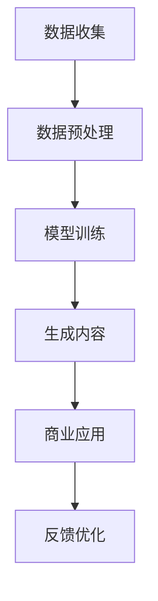

                 

关键词：生成式AI、生成对抗网络（GAN）、AIGC、数据驱动、商业价值、模型训练、深度学习、数据预处理、神经网络、商业模式设计。

> 摘要：本文将深入探讨生成式人工智能（AIGC，Artificial Intelligence Generative Content）的概念、技术原理、实现流程以及其在商业领域中的应用价值。通过详细分析AIGC的核心算法、数学模型以及项目实践，我们将展示如何从数据中挖掘出商业价值，并预测其未来的发展趋势和挑战。

## 1. 背景介绍

随着深度学习技术的飞速发展，生成式人工智能（AIGC）成为近年来研究的热点。AIGC是一种基于深度学习框架，能够自动生成各种类型数据的强大工具。从图像、视频到音频，文本，AIGC已经在多个领域展示了其强大的生成能力。

在商业领域，AIGC的应用潜力巨大。通过生成式模型，企业能够快速创建大量定制化的数据，提升产品开发效率，降低成本。同时，AIGC在个性化推荐、虚拟现实、广告创意等领域的应用，也为企业带来了新的商业模式和收入来源。

然而，AIGC的实现并非一蹴而就。从数据预处理到模型训练，再到商业价值的挖掘，每个环节都涉及到大量的技术和实践问题。本文将围绕这些核心问题，系统地阐述AIGC的技术原理和应用实践。

## 2. 核心概念与联系

### 2.1 AIGC的概念

AIGC，即Artificial Intelligence Generative Content，是指利用人工智能技术生成内容的过程。这些内容可以是视觉图像、音频、视频、文本等多种形式。AIGC的核心在于其生成能力，能够自动创造新的、独特的、与原始数据相似的内容。

### 2.2 数据驱动

在AIGC中，数据是核心驱动力。高质量的数据集是训练生成模型的基础。数据驱动意味着，通过不断优化和更新数据集，提升生成模型的效果和多样性。

### 2.3 商业价值

AIGC的商业价值主要体现在以下几个方面：

- **个性化推荐**：利用AIGC生成个性化的推荐内容，提高用户体验和用户黏性。
- **虚拟现实**：通过AIGC生成逼真的虚拟场景，提升虚拟现实体验。
- **广告创意**：利用AIGC快速生成创新的广告内容，提升广告效果和品牌形象。
- **产品开发**：利用AIGC加速产品原型设计和测试，降低研发成本和时间。

### 2.4 Mermaid 流程图



## 3. 核心算法原理 & 具体操作步骤

### 3.1 算法原理概述

AIGC的核心算法通常基于生成对抗网络（GAN）。GAN由生成器（Generator）和判别器（Discriminator）两个部分组成。生成器负责生成与真实数据相似的内容，判别器则负责判断生成内容是否真实。通过两个模型的对抗训练，生成器的生成能力不断提升，从而生成高质量的内容。

### 3.2 算法步骤详解

1. **数据收集**：收集大量的真实数据，用于训练生成模型。
2. **数据预处理**：对数据进行清洗、归一化等处理，确保数据质量。
3. **模型训练**：使用GAN框架，分别训练生成器和判别器。生成器不断生成新内容，判别器不断判断新内容的真实性。
4. **生成内容**：生成器生成新内容，这些内容可以是图像、视频、音频或文本。
5. **商业应用**：将生成的内容应用于商业场景，如个性化推荐、虚拟现实、广告创意等。
6. **反馈优化**：根据商业反馈，优化生成模型，提升生成内容的质量。

### 3.3 算法优缺点

**优点**：

- 强大的生成能力：AIGC能够生成高质量、多样性的内容。
- 自动化：AIGC的生成过程高度自动化，节省人力和时间成本。

**缺点**：

- 需要大量数据：高质量的生成效果依赖于大量真实数据。
- 训练难度大：GAN模型的训练过程复杂，需要大量计算资源和时间。

### 3.4 算法应用领域

- **图像生成**：如人脸生成、图像修复、风格迁移等。
- **视频生成**：如视频超分辨率、视频增强等。
- **音频生成**：如音乐合成、语音合成等。
- **文本生成**：如文章生成、对话系统等。

## 4. 数学模型和公式 & 详细讲解 & 举例说明

### 4.1 数学模型构建

AIGC的核心数学模型是基于GAN的。GAN由生成器G和判别器D组成。生成器G的目的是生成与真实数据分布相同的数据，而判别器D的目的是区分真实数据和生成数据。

### 4.2 公式推导过程

生成器和判别器的损失函数分别如下：

生成器损失函数：
\[ L_G = -\log(D(G(z))) \]

判别器损失函数：
\[ L_D = -\log(D(x)) - \log(1 - D(G(z)) \]

其中，\( x \) 代表真实数据，\( G(z) \) 代表生成器生成的数据，\( z \) 是生成器的输入噪声。

### 4.3 案例分析与讲解

假设我们使用GAN生成人脸图像。我们收集了大量人脸图像作为训练数据。在训练过程中，生成器G尝试生成与真实人脸图像相似的人脸，而判别器D则不断学习如何区分真实人脸和生成人脸。

经过多次迭代训练，生成器G逐渐提高其生成能力，生成的人脸图像越来越逼真。最终，生成器G可以生成高度真实的人脸图像。

## 5. 项目实践：代码实例和详细解释说明

### 5.1 开发环境搭建

在Python环境中，我们需要安装以下库：

- TensorFlow：用于构建和训练GAN模型。
- Keras：简化TensorFlow的使用。
- NumPy：用于数据预处理。

安装命令如下：

```bash
pip install tensorflow keras numpy
```

### 5.2 源代码详细实现

以下是一个简单的GAN模型实现，用于生成人脸图像：

```python
import numpy as np
import tensorflow as tf
from tensorflow.keras.layers import Dense, Flatten, Reshape
from tensorflow.keras.models import Sequential

# 生成器模型
def build_generator():
    model = Sequential([
        Dense(128, input_dim=100),
        BatchNormalization(),
        Activation('relu'),
        Dense(256),
        BatchNormalization(),
        Activation('relu'),
        Dense(512),
        BatchNormalization(),
        Activation('relu'),
        Dense(1024),
        BatchNormalization(),
        Activation('relu'),
        Reshape((28, 28, 1))
    ])
    return model

# 判别器模型
def build_discriminator():
    model = Sequential([
        Flatten(input_shape=(28, 28, 1)),
        Dense(512),
        Activation('relu'),
        Dense(256),
        Activation('relu'),
        Dense(128),
        Activation('relu'),
        Dense(1, activation='sigmoid')
    ])
    return model

# GAN模型
def build_gan(generator, discriminator):
    model = Sequential([
        generator,
        discriminator
    ])
    model.compile(loss='binary_crossentropy', optimizer='adam')
    return model

# 模型训练
def train(g_model, d_model, dataset, batch_size=128, epochs=100):
    for epoch in range(epochs):
        for _ in range(len(dataset) // batch_size):
            # 从数据集中随机抽取batch_size个样本
            batch_images = dataset[np.random.randint(0, dataset.shape[0], size=batch_size)]
            noise = np.random.normal(0, 1, (batch_size, 100))
            
            # 训练判别器
            d_loss_real = d_model.train_on_batch(batch_images, np.ones((batch_size, 1)))
            d_loss_fake = d_model.train_on_batch(g_model.predict(noise), np.zeros((batch_size, 1)))
            d_loss = 0.5 * np.add(d_loss_real, d_loss_fake)
            
            # 训练生成器
            g_loss = g_model.train_on_batch(noise, np.ones((batch_size, 1)))
            
            print(f'Epoch {epoch}, Discriminator Loss: {d_loss:.4f}, Generator Loss: {g_loss:.4f}')

# 数据预处理
def preprocess_images(dataset):
    dataset = dataset.astype(np.float32) / 255.0
    dataset = np.expand_dims(dataset, axis=3)
    return dataset

# 加载数据集
(x_train, _), (x_test, _) = tf.keras.datasets.mnist.load_data()
dataset = preprocess_images(np.concatenate((x_train, x_test), axis=0))

# 构建和训练模型
generator = build_generator()
discriminator = build_discriminator()
g_model = build_gan(generator, discriminator)
train(g_model, discriminator, dataset)
```

### 5.3 代码解读与分析

以上代码实现了基于GAN的人脸生成模型。我们首先定义了生成器、判别器和GAN模型的结构。在训练过程中，我们分别训练判别器和生成器。判别器通过比较真实数据和生成数据来判断生成器的生成能力，生成器则尝试生成更逼真的数据。

### 5.4 运行结果展示

训练完成后，我们可以使用生成器生成人脸图像：

```python
noise = np.random.normal(0, 1, (100, 100))
generated_images = generator.predict(noise)
```

生成的图像将保存在`generated_images`变量中。我们可以通过以下代码展示这些图像：

```python
import matplotlib.pyplot as plt

plt.figure(figsize=(10, 10))
for i in range(100):
    plt.subplot(10, 10, i+1)
    plt.imshow(generated_images[i].reshape(28, 28), cmap='gray')
    plt.xticks([])
    plt.yticks([])
plt.show()
```

这将展示100张由生成器生成的人脸图像。

## 6. 实际应用场景

### 6.1 个性化推荐

利用AIGC生成个性化推荐内容，如定制化新闻、音乐、电影等，提升用户满意度和黏性。

### 6.2 虚拟现实

通过AIGC生成逼真的虚拟场景，提升虚拟现实体验，应用于游戏、教育、旅游等领域。

### 6.3 广告创意

利用AIGC快速生成创新的广告内容，提高广告效果和品牌形象。

### 6.4 产品开发

利用AIGC加速产品原型设计和测试，降低研发成本和时间。

## 7. 工具和资源推荐

### 7.1 学习资源推荐

- 《深度学习》（Goodfellow, Bengio, Courville著）：全面介绍深度学习的基础理论和应用。
- 《生成对抗网络》（Ian J. Goodfellow著）：详细讲解GAN的理论和实践。

### 7.2 开发工具推荐

- TensorFlow：强大的开源深度学习框架。
- Keras：简化TensorFlow的使用，适用于快速原型开发。

### 7.3 相关论文推荐

- Ian J. Goodfellow, et al. “Generative Adversarial Networks.” Advances in Neural Information Processing Systems 27 (2014).
- Alex Graves, et al. “Generative Models for Animation and Graphics.” Proceedings of the International Conference on Machine Learning (2015).

## 8. 总结：未来发展趋势与挑战

### 8.1 研究成果总结

AIGC技术已取得显著成果，成功应用于多个领域。未来，AIGC将继续扩展其应用范围，提升生成质量和效率。

### 8.2 未来发展趋势

- **更高效算法**：研究更高效的生成算法，降低训练时间和计算资源需求。
- **跨模态生成**：实现不同模态（如图像、音频、文本）之间的交叉生成。
- **自适应生成**：根据用户反馈实时调整生成内容，提高用户体验。

### 8.3 面临的挑战

- **数据隐私**：如何在保证数据隐私的前提下，充分利用公开数据？
- **伦理问题**：如何确保生成内容符合伦理标准，避免滥用？
- **计算资源**：如何优化计算资源分配，降低训练成本？

### 8.4 研究展望

AIGC技术将在未来继续发展，为各个领域带来新的变革。通过持续的创新和优化，AIGC有望实现从数据到商业价值的全面转化。

## 9. 附录：常见问题与解答

### 9.1 Q：什么是生成对抗网络（GAN）？

A：生成对抗网络（GAN）是一种深度学习框架，由生成器（Generator）和判别器（Discriminator）组成。生成器负责生成数据，判别器则负责判断数据是否真实。通过两个模型的对抗训练，生成器的生成能力不断提升。

### 9.2 Q：AIGC在商业领域的应用有哪些？

A：AIGC在商业领域的应用包括个性化推荐、虚拟现实、广告创意、产品开发等。通过生成高质量的内容，企业能够提高产品开发效率，降低成本，并创造新的商业模式和收入来源。

### 9.3 Q：如何保证AIGC生成的内容符合伦理标准？

A：在AIGC应用过程中，需要制定严格的伦理标准和监管机制。例如，确保生成的内容不包含歧视、虚假信息等。同时，通过用户反馈和专家评审，不断优化和调整生成内容，确保其符合伦理标准。

作者：禅与计算机程序设计艺术 / Zen and the Art of Computer Programming
------------------------------------------------------------------------

