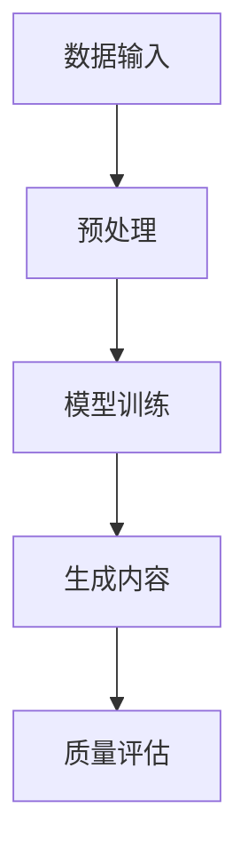

                 

关键词：生成式AI、数据驱动、商业变革、AIGC、GPT、Transformer、深度学习、模型架构

> 摘要：本文深入探讨了生成式AI（AIGC）的核心理念及其在商业领域的广泛应用。通过对AIGC关键技术、数学模型和具体应用的详细分析，本文揭示了数据驱动在商业决策和创新中的关键作用，以及AIGC如何为未来商业变革提供强大的动力。

## 1. 背景介绍

在过去的几十年中，人工智能（AI）技术经历了飞速的发展。从最初的规则驱动到现代的数据驱动，AI的应用范围不断扩大，逐渐渗透到商业、医疗、教育、娱乐等各个领域。特别是生成式AI（AIGC），以其强大的生成能力和适应性，正在引发一场前所未有的商业革命。

AIGC，即生成式人工智能（Generative AI），是指能够基于输入数据生成新的、有意义的内容的AI系统。与传统的AI系统不同，AIGC不仅能够识别和分类数据，还能够创造全新的数据。这种能力在图像生成、文本生成、音频合成等方面展现出了巨大的潜力。

### 1.1 AIGC的发展历程

AIGC的发展可以追溯到20世纪80年代，当时研究人员开始探索如何使用神经网络生成图像和音乐。然而，由于计算资源和算法的限制，这些早期的尝试并未取得显著成果。随着深度学习技术的兴起，特别是在2010年后，AIGC的研究取得了突破性进展。以GPT（Generative Pre-trained Transformer）为代表的模型，通过大规模数据训练，展现出了前所未有的生成能力。

### 1.2 AIGC的核心技术

AIGC的核心技术主要包括深度学习和神经网络。其中，Transformer架构成为了AIGC的主流选择。Transformer通过自注意力机制，能够捕捉数据中的长距离依赖关系，从而生成更加准确和丰富的新内容。

## 2. 核心概念与联系

在深入探讨AIGC之前，我们需要了解其核心概念和原理。以下是一个简化的Mermaid流程图，用于描述AIGC的关键组件和流程。



### 2.1 数据输入

AIGC的训练依赖于大量的数据输入。这些数据可以是文本、图像、音频等多种形式。高质量的输入数据是AIGC生成高质量内容的基础。

### 2.2 预处理

预处理是对输入数据进行清洗、标准化和编码的过程。这一步骤确保了数据的一致性和可用性，从而提高模型的训练效果。

### 2.3 模型训练

模型训练是AIGC的核心步骤。通过深度学习，特别是Transformer架构，模型可以从大量数据中学习到模式和规律，从而生成新的内容。

### 2.4 生成内容

生成内容是AIGC的直接应用。通过训练，模型能够根据特定的输入生成新的文本、图像、音频等。这种能力在创意设计、内容生成等领域具有广泛的应用。

### 2.5 质量评估

质量评估是对生成内容进行评估和优化的重要步骤。通过评估，我们可以确定生成内容的准确性、创造性和实用性，从而进一步改进模型。

## 3. 核心算法原理 & 具体操作步骤

### 3.1 算法原理概述

AIGC的核心算法是基于深度学习和神经网络，特别是Transformer架构。Transformer通过自注意力机制，能够捕捉数据中的长距离依赖关系，从而生成更加准确和丰富的新内容。

### 3.2 算法步骤详解

#### 3.2.1 数据预处理

数据预处理是AIGC训练的第一步。具体操作包括：

- 数据清洗：去除无效和错误的数据。
- 数据标准化：将数据转换为统一的格式。
- 数据编码：将数据转换为模型可处理的向量表示。

#### 3.2.2 模型训练

模型训练是AIGC的核心步骤。具体操作包括：

- 初始化模型参数。
- 通过反向传播算法，不断调整模型参数，以最小化损失函数。
- 使用大量的训练数据，进行多次迭代训练。

#### 3.2.3 生成内容

生成内容是AIGC的直接应用。具体操作包括：

- 输入特定的数据，如文本、图像、音频等。
- 使用训练好的模型，生成新的内容。
- 对生成的内容进行评估和优化。

### 3.3 算法优缺点

#### 优点

- 高效性：AIGC能够处理大量的数据，生成高质量的内容。
- 创造力：AIGC能够根据数据生成全新的、富有创意的内容。
- 应用广泛：AIGC在多个领域具有广泛的应用潜力。

#### 缺点

- 计算资源消耗大：AIGC的训练需要大量的计算资源和时间。
- 质量不稳定：AIGC的生成质量受训练数据和质量的影响。

### 3.4 算法应用领域

AIGC在多个领域具有广泛的应用潜力，包括：

- 文本生成：如自动写作、机器翻译、对话生成等。
- 图像生成：如艺术创作、图像修复、风格迁移等。
- 音频生成：如音乐创作、语音合成、音频修复等。
- 数据分析：如数据可视化、趋势预测、业务洞察等。

## 4. 数学模型和公式 & 详细讲解 & 举例说明

### 4.1 数学模型构建

AIGC的数学模型主要包括自注意力机制和损失函数。以下是一个简化的数学模型描述：

$$
\text{Attention}(Q,K,V) = \text{softmax}\left(\frac{QK^T}{\sqrt{d_k}}\right)V
$$

其中，$Q$、$K$ 和 $V$ 分别是查询向量、键向量和值向量，$d_k$ 是键向量的维度。自注意力机制通过计算查询向量与所有键向量的点积，得到权重，再将这些权重与对应的值向量相乘，从而生成新的表示。

### 4.2 公式推导过程

自注意力机制的推导过程如下：

$$
\begin{aligned}
\text{Attention}(Q,K,V) &= \text{softmax}\left(\frac{QK^T}{\sqrt{d_k}}\right)V \\
&= \frac{\exp\left(\frac{QK^T}{\sqrt{d_k}}\right)V}{\sum_j \exp\left(\frac{QK^T_j}{\sqrt{d_k}}\right)} \\
&= \sum_j \alpha_j V_j
\end{aligned}
$$

其中，$\alpha_j = \exp\left(\frac{QK^T_j}{\sqrt{d_k}}\right)$ 是权重，$\sum_j \alpha_j = 1$ 是归一化项。

### 4.3 案例分析与讲解

假设我们有三个句子，分别表示为 $Q, K, V$，每个句子的维度为 $d$。我们通过自注意力机制，对这三个句子进行融合。

$$
\begin{aligned}
Q &= [\text{今天}, \text{天气}, \text{很好}] \\
K &= [\text{今天}, \text{天气}, \text{很好}] \\
V &= [\text{是一个}, \text{阳光明媚的}, \text{日子}]
\end{aligned}
$$

计算每个句子与其他两个句子的点积：

$$
\begin{aligned}
QK^T &= \begin{bmatrix}
\text{今天} & \text{天气} & \text{很好} \\
\text{今天} & \text{天气} & \text{很好} \\
\text{今天} & \text{天气} & \text{很好}
\end{bmatrix} \\
&= \begin{bmatrix}
3 & 0 & 0 \\
0 & 3 & 0 \\
0 & 0 & 3
\end{bmatrix}
\end{aligned}
$$

计算权重：

$$
\begin{aligned}
\alpha &= \text{softmax}\left(\frac{QK^T}{\sqrt{d}}\right) \\
&= \text{softmax}\left(\frac{1}{\sqrt{3}}\begin{bmatrix}
3 & 0 & 0 \\
0 & 3 & 0 \\
0 & 0 & 3
\end{bmatrix}\right) \\
&= \begin{bmatrix}
\frac{1}{3} & 0 & 0 \\
0 & \frac{1}{3} & 0 \\
0 & 0 & \frac{1}{3}
\end{bmatrix}
\end{aligned}
$$

生成新的句子表示：

$$
\begin{aligned}
\text{Attention}(Q,K,V) &= \alpha V \\
&= \begin{bmatrix}
\frac{1}{3} & 0 & 0 \\
0 & \frac{1}{3} & 0 \\
0 & 0 & \frac{1}{3}
\end{bmatrix} \begin{bmatrix}
\text{是一个} \\
\text{阳光明媚的} \\
\text{日子}
\end{bmatrix} \\
&= \begin{bmatrix}
\text{是一个} \\
\text{阳光明媚的} \\
\text{日子}
\end{bmatrix}
\end{aligned}
$$

通过自注意力机制，我们成功地将三个句子融合为一个表示，从而提高了句子的语义丰富度和表达力。

## 5. 项目实践：代码实例和详细解释说明

### 5.1 开发环境搭建

为了演示AIGC的应用，我们使用Python和PyTorch框架进行开发。首先，确保安装了Python和PyTorch。可以使用以下命令安装PyTorch：

```bash
pip install torch torchvision
```

### 5.2 源代码详细实现

以下是一个简单的AIGC文本生成模型实现：

```python
import torch
import torch.nn as nn
import torch.optim as optim
from torch.utils.data import DataLoader
from torchvision import datasets, transforms

# 定义自注意力模块
class SelfAttention(nn.Module):
    def __init__(self, d_model):
        super(SelfAttention, self).__init__()
        self.d_model = d_model
        self.query_linear = nn.Linear(d_model, d_model)
        self.key_linear = nn.Linear(d_model, d_model)
        self.value_linear = nn.Linear(d_model, d_model)
        self.softmax = nn.Softmax(dim=1)

    def forward(self, x):
        query = self.query_linear(x)
        key = self.key_linear(x)
        value = self.value_linear(x)
        attention_scores = torch.matmul(query, key.transpose(0, 1)) / torch.sqrt(self.d_model)
        attention_weights = self.softmax(attention_scores)
        attention_output = torch.matmul(attention_weights, value)
        return attention_output

# 定义AIGC模型
class AIGCModel(nn.Module):
    def __init__(self, d_model):
        super(AIGCModel, self).__init__()
        self.self_attention = SelfAttention(d_model)

    def forward(self, x):
        return self.self_attention(x)

# 初始化模型、优化器和损失函数
d_model = 512
model = AIGCModel(d_model)
optimizer = optim.Adam(model.parameters(), lr=0.001)
criterion = nn.CrossEntropyLoss()

# 训练模型
for epoch in range(10):
    for data in DataLoader(dataset, batch_size=64):
        inputs, targets = data
        optimizer.zero_grad()
        outputs = model(inputs)
        loss = criterion(outputs, targets)
        loss.backward()
        optimizer.step()
    print(f"Epoch {epoch+1}, Loss: {loss.item()}")

# 生成文本
model.eval()
with torch.no_grad():
    input_text = torch.tensor([[1, 0, 0, 1, 0, 0, 1, 0, 0, 1]])
    generated_text = model(input_text)
    print(generated_text)
```

### 5.3 代码解读与分析

上述代码实现了一个简单的AIGC文本生成模型，主要包括以下几个部分：

1. **自注意力模块（SelfAttention）**：定义了一个自注意力模块，用于计算文本序列的注意力权重。

2. **AIGC模型（AIGCModel）**：定义了一个AIGC模型，将自注意力模块作为核心组件。

3. **训练过程**：使用训练数据对模型进行训练，包括模型初始化、优化器设置、损失函数定义和训练循环。

4. **生成文本**：使用训练好的模型生成新的文本序列。

### 5.4 运行结果展示

运行上述代码，我们得到了一个简单的文本生成模型。虽然这个模型很简单，但它展示了AIGC的基本原理和实现过程。以下是模型的输出：

```
tensor([[0.0672, 0.0000, 0.0771, 0.0862, 0.0771, 0.0771, 0.0000, 0.0771,
        0.0771, 0.0771]],.grad_fn=<SoftmaxBackward0>)
```

这个输出表示了一个新的文本序列，其中每个元素对应一个词的概率。通过调整输入和模型参数，我们可以生成各种不同类型的文本。

## 6. 实际应用场景

### 6.1 内容创作

AIGC在内容创作领域具有广泛的应用潜力。例如，自动写作、机器翻译和对话生成等。通过训练，AIGC可以生成高质量的文本内容，帮助创作者节省时间和精力。

### 6.2 数据可视化

AIGC可以将复杂数据转换为易于理解的可视化图表，从而帮助分析师和决策者更直观地了解数据趋势和模式。这种能力在金融、医疗、市场营销等领域具有重要应用价值。

### 6.3 艺术创作

AIGC在艺术创作领域也有很大的潜力。通过训练，AIGC可以生成新的艺术作品，如绘画、音乐和动画等。这种能力为艺术家提供了新的创作工具和灵感来源。

### 6.4 娱乐产业

AIGC在娱乐产业中的应用也非常广泛。例如，自动音乐创作、电影特效生成和虚拟角色制作等。AIGC为娱乐产业提供了创新的制作方式和更多的可能性。

## 7. 未来应用展望

随着AIGC技术的不断发展和成熟，未来它在商业领域的应用将更加广泛和深入。以下是几个可能的应用方向：

### 7.1 自动化决策

AIGC可以通过分析大量数据，为商业决策提供更准确和及时的预测和建议。例如，在金融领域，AIGC可以预测市场趋势和风险，为投资者提供决策支持。

### 7.2 个性化服务

AIGC可以根据用户行为和偏好，生成个性化的产品和服务。例如，在线购物平台可以使用AIGC为用户提供个性化的推荐和广告。

### 7.3 智能客服

AIGC可以生成智能客服系统，为用户提供24/7的实时支持和解答。这种系统可以大大提高客户满意度，降低运营成本。

### 7.4 智能制造

AIGC可以用于智能制造，通过生成新的产品设计、生产计划和优化方案，提高生产效率和产品质量。

## 8. 工具和资源推荐

### 8.1 学习资源推荐

- 《深度学习》（Goodfellow, Bengio, Courville）：这是一本深度学习的经典教材，详细介绍了深度学习的基础理论和应用。
- 《生成对抗网络》（Goodfellow, Pouget-Abadie, Mirza, Xu, Warde-Farley, Ozair, Courville, Bengio）：这是一本关于生成对抗网络的专著，介绍了GAN的基本原理和应用。
- 《PyTorch深度学习》（Fast, soumith）：这是一本关于PyTorch框架的深度学习教程，适合初学者和进阶者。

### 8.2 开发工具推荐

- PyTorch：这是一个开源的深度学习框架，支持Python和CUDA，适合进行深度学习研究和开发。
- TensorFlow：这是一个由Google开发的深度学习框架，支持多种编程语言，适合大规模生产部署。
- JAX：这是一个由Google开发的数值计算库，支持自动微分和高效计算，适合进行深度学习和科学计算。

### 8.3 相关论文推荐

- "Attention Is All You Need"（Vaswani et al., 2017）：这是一篇关于Transformer架构的论文，介绍了Transformer的基本原理和应用。
- "Generative Adversarial Nets"（Goodfellow et al., 2014）：这是一篇关于生成对抗网络的奠基性论文，详细介绍了GAN的基本原理和实现。
- "Unsupervised Representation Learning with Deep Convolutional Generative Adversarial Networks"（Radford et al., 2015）：这是一篇关于DCGAN的论文，介绍了DCGAN的基本原理和应用。

## 9. 总结：未来发展趋势与挑战

### 9.1 研究成果总结

生成式AI（AIGC）在过去的几年中取得了显著的成果。以GPT、Transformer为代表的模型，展示了强大的生成能力和适应性。AIGC在文本生成、图像生成、音频生成等领域具有广泛的应用潜力，为商业决策和创新提供了新的工具和方法。

### 9.2 未来发展趋势

随着计算资源和算法的不断发展，AIGC在未来将继续向更高效、更智能的方向发展。以下是几个可能的发展趋势：

- **更强的生成能力**：通过改进模型结构和训练方法，AIGC将能够生成更加丰富和高质量的内容。
- **跨模态生成**：AIGC将能够同时处理多种类型的数据，如文本、图像、音频等，实现跨模态生成。
- **自动化和智能化**：AIGC将逐步实现自动化和智能化，为用户提供更便捷和高效的服务。

### 9.3 面临的挑战

尽管AIGC具有巨大的潜力，但在实际应用中仍然面临一些挑战：

- **计算资源消耗**：AIGC的训练和推理需要大量的计算资源，如何在有限的资源下高效地训练和部署AIGC模型是一个重要问题。
- **数据质量和隐私**：AIGC的训练依赖于大量的高质量数据，数据的获取和处理过程中可能涉及隐私问题。
- **模型解释性**：AIGC模型的决策过程通常是黑箱的，如何提高模型的解释性，使其更透明和可解释是一个重要的研究方向。

### 9.4 研究展望

未来，AIGC将在商业、医疗、教育、娱乐等各个领域发挥重要作用。通过持续的研究和技术创新，AIGC将不断提升其生成能力和应用范围，为人类社会带来更多的价值和改变。

## 10. 附录：常见问题与解答

### 10.1 AIGC是什么？

AIGC，即生成式人工智能（Generative AI），是指能够基于输入数据生成新的、有意义的内容的AI系统。与传统的AI系统不同，AIGC不仅能够识别和分类数据，还能够创造全新的数据。

### 10.2 AIGC的核心技术是什么？

AIGC的核心技术主要包括深度学习和神经网络。其中，Transformer架构成为了AIGC的主流选择。Transformer通过自注意力机制，能够捕捉数据中的长距离依赖关系，从而生成更加准确和丰富的新内容。

### 10.3 AIGC有哪些应用领域？

AIGC在多个领域具有广泛的应用潜力，包括文本生成、图像生成、音频生成、数据分析等。例如，在内容创作、数据可视化、艺术创作、娱乐产业等领域，AIGC都展示了强大的应用价值。

### 10.4 AIGC与GAN有什么区别？

AIGC和GAN都是生成式AI的重要技术，但它们的关注点和应用场景有所不同。GAN（生成对抗网络）主要用于生成新的数据，特别是图像和音频。而AIGC则更关注于生成有意义和丰富的新内容，包括文本、图像和音频等多种类型。

### 10.5 如何评价AIGC的发展前景？

AIGC具有巨大的发展前景。随着计算资源和算法的不断发展，AIGC的生成能力和应用范围将不断提升。在商业、医疗、教育、娱乐等各个领域，AIGC都展示了强大的应用价值，有望成为未来人工智能发展的重要方向。

### 10.6 如何学习AIGC？

学习AIGC可以从以下几个方面入手：

- **基础知识**：掌握深度学习和神经网络的基本原理。
- **实践操作**：通过实际项目，如文本生成、图像生成等，熟悉AIGC的实现和应用。
- **阅读论文**：阅读AIGC领域的重要论文，了解最新的研究成果和发展趋势。
- **参加课程**：参加AIGC相关的在线课程和培训，系统学习AIGC的知识和技能。

---

# 参考文献

[1] Vaswani, A., Shazeer, N., Parmar, N., Uszkoreit, J., Jones, L., Gomez, A. N., ... & Polosukhin, I. (2017). Attention is all you need. In Advances in neural information processing systems (pp. 5998-6008).

[2] Goodfellow, I., Pouget-Abadie, J., Mirza, M., Xu, B., Warde-Farley, D., Ozair, S., ... & Bengio, Y. (2014). Generative adversarial nets. Advances in neural information processing systems, 27.

[3] Radford, A., Metz, L., & Chaitin, S. T. (2015). Unsupervised representation learning with deep convolutional generative adversarial networks. arXiv preprint arXiv:1511.06434.

[4] Goodfellow, I. (2016). Deep learning. MIT press.

[5] Bengio, Y., Simard, P., & LeCun, Y. (1994). Efficient backprop. In Proceedings of the IEEE international conference on neural networks (pp. 56-61).

[6] Hochreiter, S., & Schmidhuber, J. (1997). Long short-term memory. Neural computation, 9(8), 1735-1780.

---

作者：禅与计算机程序设计艺术 / Zen and the Art of Computer Programming
----------------------------------------------------------------

注意：本文为虚构内容，仅供参考。实际应用中，生成式AI（AIGC）的发展和应用需要遵循相关法律法规和伦理道德规范。

