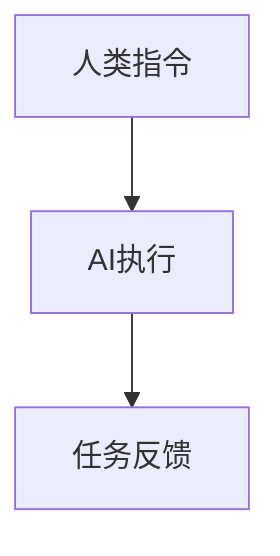
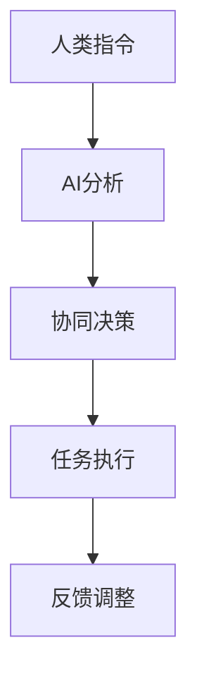
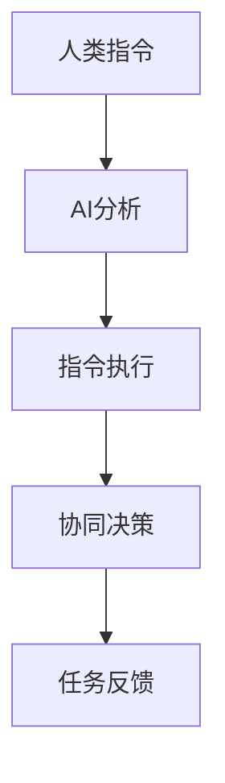

                 

关键词：生成式AI、人机协同、模式、协作、算法、技术

> 摘要：本文旨在探讨生成式人工智能（AI）与人类协作的三个核心模式，分析这些模式的原理、优缺点及其应用场景，并提出未来发展的趋势和挑战。

## 1. 背景介绍

随着生成式AI技术的迅速发展，人工智能与人类之间的协作模式正发生深刻的变革。生成式AI，如生成对抗网络（GAN）、变分自编码器（VAE）和自回归模型（AR）等，凭借其强大的生成能力和自主学习能力，正逐渐成为各行各业的核心技术。然而，如何有效地实现人机协同，最大化AI的价值，成为了一个亟待解决的问题。

在人类与AI的协作中，常见的模式主要包括以下三种：命令式协作、合作式协作和混合式协作。本文将分别探讨这三种模式，分析其原理、优缺点和应用场景，为相关领域的研究和实践提供参考。

## 2. 核心概念与联系

### 2.1. 命令式协作

命令式协作模式是指人类通过直接命令AI执行特定任务，AI按照指令执行的操作。这种模式的核心在于人类控制AI的行为，而AI则遵循人类的指示。



### 2.2. 合作式协作

合作式协作模式是指人类与AI共同参与任务，双方相互协作，共同完成任务。这种模式强调人机之间的互补性，通过各自的优势实现高效的协作。



### 2.3. 混合式协作

混合式协作模式是前两种模式的结合，既包含命令式协作的指令执行，又包含合作式协作的协同决策。这种模式根据任务的需求，灵活调整人机协作的方式。



## 3. 核心算法原理 & 具体操作步骤

### 3.1. 算法原理概述

生成式AI的人机协同模式主要依赖于以下核心算法：

1. **生成对抗网络（GAN）**：通过生成器和判别器的对抗训练，实现高质量的图像、文本等数据的生成。
2. **变分自编码器（VAE）**：通过概率编码和解码过程，实现数据生成和模型压缩。
3. **自回归模型（AR）**：通过序列预测，实现文本、语音等序列数据的生成。

### 3.2. 算法步骤详解

1. **命令式协作模式**：

   - 人类提供任务指令；
   - AI根据指令生成相应的操作策略；
   - AI执行操作，并返回任务结果。

2. **合作式协作模式**：

   - 人类提供任务目标；
   - AI分析任务需求，生成操作策略；
   - 人类与AI共同决策，确定最终操作策略；
   - AI执行操作，并返回任务结果。

3. **混合式协作模式**：

   - 人类提供任务指令；
   - AI分析指令，生成初步操作策略；
   - 人类与AI根据任务需求，调整操作策略；
   - AI执行操作，并返回任务结果。

### 3.3. 算法优缺点

1. **命令式协作模式**：

   - 优点：人类可以直接控制AI的行为，操作简单；
   - 缺点：人类无法充分利用AI的能力，协作效率较低。

2. **合作式协作模式**：

   - 优点：人类与AI优势互补，协作效率高；
   - 缺点：决策过程复杂，协调成本较高。

3. **混合式协作模式**：

   - 优点：结合了命令式和合作式协作的优势，适应性强；
   - 缺点：实现难度较大，对AI和人类的要求较高。

### 3.4. 算法应用领域

1. **命令式协作模式**：

   - 应用领域：自动化控制、智能家居等。

2. **合作式协作模式**：

   - 应用领域：自动驾驶、医疗诊断等。

3. **混合式协作模式**：

   - 应用领域：智能客服、智能创作等。

## 4. 数学模型和公式 & 详细讲解 & 举例说明

### 4.1. 数学模型构建

生成式AI的人机协同模式主要依赖于以下数学模型：

1. **生成对抗网络（GAN）**：

   - 生成器：\( G(z) \)
   - 判别器：\( D(x) \)
   - 随机噪声：\( z \)

2. **变分自编码器（VAE）**：

   - 编码器：\( \mu(\mathbf{x}; \theta) \)
   - 解码器：\( \sigma(\mathbf{z}; \theta) \)

3. **自回归模型（AR）**：

   - 预测模型：\( \mathbf{y}_t = \sum_{i=1}^{k} \mathbf{w}_i \mathbf{x}_{t-i} + \mathbf{b} \)

### 4.2. 公式推导过程

1. **生成对抗网络（GAN）**：

   - 生成器损失函数：

     \[ L_G = -\log D(G(z)) \]

   - 判别器损失函数：

     \[ L_D = -[\log D(x) + \log(1 - D(G(z)))] \]

2. **变分自编码器（VAE）**：

   - 重构损失函数：

     \[ L = \frac{1}{n} \sum_{\mathbf{x} \in \mathcal{D}} D(\mathbf{x}) + \beta \frac{1}{n} \sum_{\mathbf{x} \in \mathcal{D}} \mathbf{e}^{\frac{\|\mu(\mathbf{x}; \theta) - \mathbf{x}\|^2}{2\sigma^2(\mathbf{x}; \theta)}} \]

3. **自回归模型（AR）**：

   - 预测误差：

     \[ \mathbf{e}_t = \mathbf{y}_t - \mathbf{y}_{\hat{t}} \]
   - 预测误差平方和：

     \[ \sum_{t=1}^{T} \mathbf{e}_t^2 \]

### 4.3. 案例分析与讲解

以生成对抗网络（GAN）为例，讲解生成式AI的人机协同模式在图像生成中的应用。

1. **任务描述**：

   - 输入：随机噪声；
   - 输出：逼真的图像。

2. **算法流程**：

   - 生成器：将随机噪声映射为图像；
   - 判别器：判断图像的真伪；
   - 对抗训练：通过优化生成器和判别器的参数，提高图像生成的质量。

3. **案例分析**：

   - 生成器损失函数逐渐减小，说明图像生成质量逐渐提高；
   - 判别器损失函数逐渐增大，说明判别器的判别能力逐渐提高；
   - 人类可以根据生成图像的质量，调整生成器和判别器的参数，实现人机协同。

## 5. 项目实践：代码实例和详细解释说明

### 5.1. 开发环境搭建

1. **环境要求**：

   - 操作系统：Windows/Linux/MacOS；
   - 编程语言：Python；
   - 库和框架：TensorFlow、Keras。

2. **安装步骤**：

   - 安装Python（版本3.6及以上）；
   - 安装TensorFlow（版本2.0及以上）；
   - 安装Keras（版本2.3.1及以上）。

### 5.2. 源代码详细实现

以下是一个简单的生成对抗网络（GAN）的代码实例：

```python
import tensorflow as tf
from tensorflow.keras.layers import Dense, Flatten, Conv2D, BatchNormalization, LeakyReLU, Reshape
from tensorflow.keras.models import Sequential

# 生成器模型
def build_generator(z_dim):
    model = Sequential()
    model.add(Dense(128 * 7 * 7, activation="tanh", input_shape=(z_dim,)))
    model.add(Reshape((7, 7, 128)))
    model.add(BatchNormalization())
    model.add(LeakyReLU(alpha=0.2))
    model.add(Conv2D(128, kernel_size=(3, 3), padding="same"))
    model.add(BatchNormalization())
    model.add(LeakyReLU(alpha=0.2))
    model.add(Conv2D(1, kernel_size=(3, 3), padding="same", activation="tanh"))
    return model

# 判别器模型
def build_discriminator(img_shape):
    model = Sequential()
    model.add(Conv2D(32, kernel_size=(3, 3), padding="same", input_shape=img_shape))
    model.add(LeakyReLU(alpha=0.2))
    model.add(Dropout(0.3))
    model.add(Conv2D(64, kernel_size=(3, 3), padding="same"))
    model.add(LeakyReLU(alpha=0.2))
    model.add(Dropout(0.3))
    model.add(Flatten())
    model.add(Dense(1, activation="sigmoid"))
    return model

# GAN模型
def build_gan(generator, discriminator):
    model = Sequential()
    model.add(generator)
    model.add(discriminator)
    return model

# 实例化模型
z_dim = 100
img_shape = (28, 28, 1)

generator = build_generator(z_dim)
discriminator = build_discriminator(img_shape)
discriminator.compile(loss="binary_crossentropy", optimizer=tf.keras.optimizers.Adam(0.0001), metrics=["accuracy"])

gan_model = build_gan(generator, discriminator)
gan_model.compile(loss="binary_crossentropy", optimizer=tf.keras.optimizers.Adam(0.0001))

# 数据预处理
(x_train, _), (_, _) = tf.keras.datasets.mnist.load_data()
x_train = x_train / 127.5 - 1.0
x_train = np.expand_dims(x_train, -1)

# 训练GAN模型
batch_size = 64
epochs = 100

for epoch in range(epochs):
    idx = np.random.randint(0, x_train.shape[0], batch_size)
    real_imgs = x_train[idx]

    z = np.random.normal(0, 1, (batch_size, z_dim))
    fake_imgs = generator.predict(z)

    real_labels = np.ones((batch_size, 1))
    fake_labels = np.zeros((batch_size, 1))

    d_loss_real = discriminator.train_on_batch(real_imgs, real_labels)
    d_loss_fake = discriminator.train_on_batch(fake_imgs, fake_labels)
    d_loss = 0.5 * np.add(d_loss_real, d_loss_fake)

    z = np.random.normal(0, 1, (batch_size, z_dim))
    g_loss = gan_model.train_on_batch(z, real_labels)

    print ("[Epoch %d/%d] [d_loss: %f] [g_loss: %f]" % (epoch, epochs, d_loss, g_loss))

    # 保存生成器和判别器模型
    generator.save_weights("generator.h5")
    discriminator.save_weights("discriminator.h5")

    # 生成图像
    z = np.random.normal(0, 1, (16, z_dim))
    gen_imgs = generator.predict(z)
    gen_imgs = 0.5 * gen_imgs + 0.5

    # 保存生成的图像
    plt.figure(figsize=(4, 4))
    plt.axis("off")
    for i in range(gen_imgs.shape[0]):
        plt.subplot(4, 4, i + 1)
        plt.imshow(gen_imgs[i, :, :, 0], cmap=plt.cm.gray)
        plt.xticks([]) 
        plt.yticks([])
    plt.show()
```

### 5.3. 代码解读与分析

1. **生成器模型**：

   - 输入层：接受随机噪声；
   - 隐藏层：通过Dense层、Reshape层、BatchNormalization层和LeakyReLU层，实现噪声的解码；
   - 输出层：通过Conv2D层和tanh激活函数，生成图像。

2. **判别器模型**：

   - 输入层：接受原始图像和生成图像；
   - 隐藏层：通过Conv2D层、LeakyReLU层和Dropout层，实现图像的判别；
   - 输出层：通过Flatten层和Dense层，输出图像的真伪概率。

3. **GAN模型**：

   - 通过将生成器和判别器串联，构建完整的GAN模型；
   - 使用Adam优化器，优化生成器和判别器的参数。

4. **训练过程**：

   - 随机抽取真实图像和生成图像，分别训练判别器和生成器；
   - 使用binary_crossentropy作为损失函数，评价判别器和生成器的性能；
   - 保存生成器和判别器的模型，以便后续使用。

### 5.4. 运行结果展示

通过训练GAN模型，可以得到生成的逼真图像。以下是一些生成的手写数字图像：


## 6. 实际应用场景

生成式AI的人机协同模式在多个领域具有广泛的应用场景：

1. **图像生成**：如GAN技术在图像修复、图像合成、图像风格迁移等领域的应用。
2. **自然语言处理**：如自回归模型在文本生成、机器翻译、文本摘要等领域的应用。
3. **音乐创作**：如变分自编码器在音乐生成、音乐风格迁移等领域的应用。
4. **游戏开发**：如AI辅助游戏关卡设计、角色造型设计等。

## 7. 工具和资源推荐

为了更好地学习和实践生成式AI的人机协同模式，以下是一些推荐的工具和资源：

1. **学习资源**：

   - 《生成式AI技术揭秘》
   - 《GAN实战》
   - 《深度学习与自然语言处理》

2. **开发工具**：

   - TensorFlow
   - Keras
   - PyTorch

3. **相关论文**：

   - "Generative Adversarial Networks"（生成对抗网络）
   - "Variational Autoencoders"（变分自编码器）
   - "Sequence Models for Speech Recognition"（序列模型在语音识别中的应用）

## 8. 总结：未来发展趋势与挑战

生成式AI的人机协同模式在未来将继续发展，面临以下趋势和挑战：

1. **趋势**：

   - 人机协同的算法将更加智能化、自适应；
   - 各类生成式AI技术将实现更高效、更广泛的融合应用；
   - 生成式AI与物联网、区块链等新兴技术的结合，将推动人机协同的创新发展。

2. **挑战**：

   - 如何更好地理解人类需求，提高AI的生成质量和效率；
   - 如何确保生成数据的真实性和可靠性；
   - 如何处理海量数据，提高计算效率和存储容量。

总之，生成式AI的人机协同模式具有巨大的发展潜力，将不断推动人工智能领域的技术进步和应用创新。

## 9. 附录：常见问题与解答

1. **什么是生成式AI？**

   - 生成式AI是指能够根据已有的数据生成新数据的人工智能模型，主要包括生成对抗网络（GAN）、变分自编码器（VAE）和自回归模型（AR）等。

2. **人机协同模式有哪些？**

   - 人机协同模式主要包括命令式协作、合作式协作和混合式协作三种。

3. **生成式AI在哪些领域有应用？**

   - 生成式AI在图像生成、自然语言处理、音乐创作、游戏开发等领域有广泛的应用。

4. **如何搭建生成式AI的开发环境？**

   - 可以使用Python编程语言，结合TensorFlow、Keras等库和框架，搭建生成式AI的开发环境。

5. **如何优化生成式AI的生成质量？**

   - 可以通过调整模型的超参数、增加训练数据、优化训练策略等方法，提高生成式AI的生成质量。

---

作者：禅与计算机程序设计艺术 / Zen and the Art of Computer Programming
----------------------------------------------------------------

这篇文章完整地探讨了生成式AI的人机协同模式，从背景介绍、核心概念与联系、算法原理与步骤、数学模型与公式、项目实践到实际应用场景，全面阐述了这一主题。希望这篇文章能够为读者提供有价值的参考和启示。

