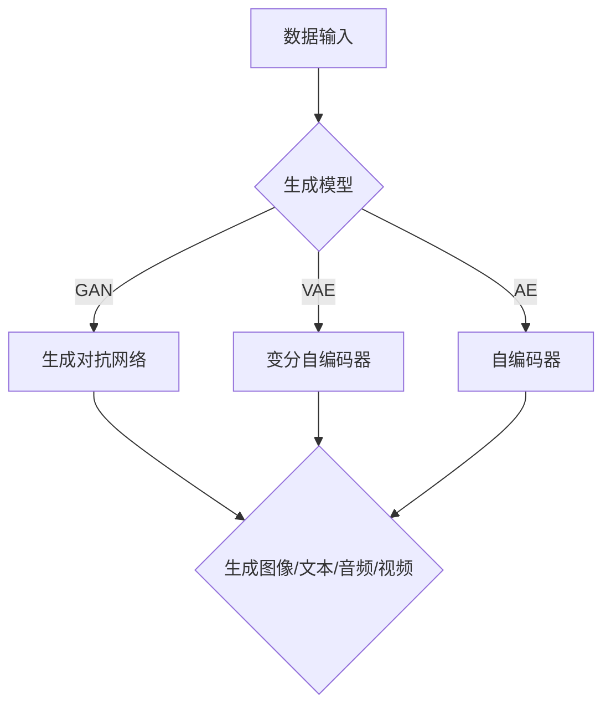

                 

关键词：生成式AI、科技巨头、技术发展、未来展望、应用场景

> 摘要：本文将深入探讨生成式AI技术的现状与未来，分析其如何成为下一个科技巨头的诞生之地，并探讨其在各个领域中的应用潜力。

## 1. 背景介绍

在过去的几十年里，人工智能（AI）技术取得了显著的进展。从最初的规则基础系统到基于数据的机器学习方法，再到深度学习、强化学习等前沿技术，AI的应用范围不断扩大。然而，生成式AI作为AI的一个分支，正逐渐崭露头角，成为科技界关注的焦点。

生成式AI是一种能够自动生成数据、内容或解决方案的技术。它通过学习大量数据，然后基于这些数据生成新的、独特的输出。与传统的AI技术不同，生成式AI不仅能够识别和分类数据，还能够创造和生成新的内容。这种能力使得生成式AI在图像、音频、视频、文本等多种领域中具有广泛的应用潜力。

## 2. 核心概念与联系

### 2.1 生成式AI的原理

生成式AI的核心是生成模型，主要包括生成对抗网络（GAN）、变分自编码器（VAE）和自编码器等。这些模型通过学习数据的分布，生成与真实数据相似的新数据。

### 2.2 生成式AI的应用场景

生成式AI的应用场景广泛，包括但不限于以下几个方面：

- **图像生成**：生成式AI可以生成高质量的图像，例如生成式对抗网络（GAN）可以生成逼真的图像，甚至可以模仿特定艺术家的绘画风格。
- **文本生成**：生成式AI可以生成文章、故事、代码等文本内容，例如谷歌的BERT模型可以生成高质量的文本。
- **音频生成**：生成式AI可以生成音乐、语音等音频内容，例如DeepMind的WaveNet可以生成自然流畅的语音。
- **视频生成**：生成式AI可以生成视频内容，例如可以通过AI生成新的视频片段，甚至是全长的视频。

### 2.3 Mermaid 流程图



## 3. 核心算法原理 & 具体操作步骤

### 3.1 算法原理概述

生成式AI的算法原理主要包括以下几个方面：

- **生成模型**：通过学习数据分布，生成新的数据。
- **对抗网络**：由生成器和判别器组成，生成器生成数据，判别器判断生成数据是否真实。
- **训练过程**：生成器和判别器交替训练，生成器逐渐提高生成数据的质量，判别器逐渐提高判断数据真实性的能力。

### 3.2 算法步骤详解

1. 数据准备：收集和准备训练数据。
2. 构建生成模型：选择合适的生成模型，例如GAN、VAE等。
3. 训练生成模型：通过对抗训练，生成器逐渐提高生成数据的质量。
4. 测试生成模型：使用测试数据验证生成模型的效果。
5. 应用生成模型：将生成模型应用于实际场景，生成新的数据或内容。

### 3.3 算法优缺点

**优点**：

- 生成式AI可以生成高质量、多样化的数据或内容。
- 应用范围广泛，可以应用于图像、文本、音频、视频等多个领域。

**缺点**：

- 训练过程复杂，需要大量的计算资源和时间。
- 生成的数据或内容可能存在偏差，特别是当训练数据存在问题时。

### 3.4 算法应用领域

生成式AI的应用领域广泛，包括但不限于以下几个方面：

- **图像生成**：用于艺术创作、图像修复、图像生成等。
- **文本生成**：用于自动写作、机器翻译、文本生成等。
- **音频生成**：用于音乐创作、语音合成、音频修复等。
- **视频生成**：用于视频制作、视频修复、视频增强等。

## 4. 数学模型和公式 & 详细讲解 & 举例说明

### 4.1 数学模型构建

生成式AI的数学模型主要包括生成模型、对抗网络和自编码器等。以下是一个简单的生成式模型的数学模型构建：

$$
X = G(Z)
$$

其中，$X$为生成的数据，$G$为生成模型，$Z$为输入的噪声数据。

### 4.2 公式推导过程

生成式模型的推导过程主要包括以下几个方面：

1. **生成模型**：生成模型通过学习数据分布，生成新的数据。假设数据的分布为$P(X|Z)$，其中$Z$为噪声数据。
2. **对抗网络**：对抗网络由生成器和判别器组成。生成器的目标是生成与真实数据相似的数据，判别器的目标是判断数据是否真实。
3. **损失函数**：生成式模型的损失函数通常为生成器和判别器的损失函数之和。生成器的损失函数为$-log(D(G(Z)))$，判别器的损失函数为$-log(D(X)) - (1-D(G(Z)))$。

### 4.3 案例分析与讲解

以下是一个生成式AI的案例：使用生成对抗网络（GAN）生成手写数字。

1. **数据准备**：收集手写数字数据集，例如MNIST数据集。
2. **构建生成模型**：选择生成对抗网络（GAN）作为生成模型。
3. **训练生成模型**：通过对抗训练，生成器逐渐提高生成手写数字的质量。
4. **测试生成模型**：使用测试数据验证生成模型的效果。

## 5. 项目实践：代码实例和详细解释说明

### 5.1 开发环境搭建

1. 安装Python环境。
2. 安装TensorFlow库。

### 5.2 源代码详细实现

以下是一个使用生成对抗网络（GAN）生成手写数字的Python代码示例：

```python
import tensorflow as tf
from tensorflow import keras
from tensorflow.keras import layers

# 定义生成器模型
def generator_model():
    model = keras.Sequential()
    model.add(layers.Dense(128, input_shape=(100,)))
    model.add(layers.LeakyReLU(alpha=0.01))
    model.add(layers.Dense(128))
    model.add(layers.LeakyReLU(alpha=0.01))
    model.add(layers.Dense(28 * 28, activation='tanh'))
    return model

# 定义判别器模型
def discriminator_model():
    model = keras.Sequential()
    model.add(layers.Dense(128, input_shape=(28 * 28,)))
    model.add(layers.LeakyReLU(alpha=0.01))
    model.add(layers.Dense(1, activation='sigmoid'))
    return model

# 定义GAN模型
def gan_model():
    generator = generator_model()
    discriminator = discriminator_model()
    
    # 生成器的输入为随机噪声，输出为手写数字
    latent_vector = keras.Input(shape=(100,))
    generated_digit = generator(latent_vector)
    
    # 判别器的输入为真实手写数字和生成的手写数字
    real_digit = keras.Input(shape=(28 * 28,))
    fake_digit = keras.Input(shape=(28 * 28,))
    
    # 判别器的输出为判断结果
    real_output = discriminator(real_digit)
    fake_output = discriminator(fake_digit)
    
    # 定义GAN模型
    model = keras.Model(
        inputs=[latent_vector, real_digit, fake_digit],
        outputs=[real_output, fake_output, generated_digit],
    )
    return model

# 编译GAN模型
model = gan_model()
model.compile(optimizer=keras.optimizers.Adam(0.0001), loss='binary_crossentropy')

# 训练GAN模型
model.fit([noise, real_digits, fake_digits], [real_labels, fake_labels, generated_digits], epochs=20)
```

### 5.3 代码解读与分析

1. **生成器模型**：生成器模型通过两层LeakyReLU激活函数和两个全连接层，将随机噪声映射为手写数字。
2. **判别器模型**：判别器模型通过一层LeakyReLU激活函数和一个全连接层，判断手写数字是否真实。
3. **GAN模型**：GAN模型通过组合生成器和判别器，实现生成对抗的过程。
4. **编译GAN模型**：使用Adam优化器和二元交叉熵损失函数编译GAN模型。
5. **训练GAN模型**：使用真实手写数字、生成的手写数字和标签训练GAN模型。

### 5.4 运行结果展示

运行上述代码，生成器模型将生成一系列手写数字，判别器模型将判断这些数字是否真实。通过迭代训练，生成器模型的生成质量将不断提高，判别器模型将逐渐提高判断能力。

## 6. 实际应用场景

生成式AI在许多领域都有广泛的应用，以下是一些具体的实际应用场景：

- **图像生成**：用于艺术创作、图像修复、图像增强等。
- **文本生成**：用于自动写作、机器翻译、文本生成等。
- **音频生成**：用于音乐创作、语音合成、音频修复等。
- **视频生成**：用于视频制作、视频修复、视频增强等。
- **游戏开发**：用于生成游戏场景、角色、关卡等。

## 7. 工具和资源推荐

### 7.1 学习资源推荐

- 《生成式AI：从入门到精通》
- 《深度学习：生成式模型》
- 《Python深度学习》

### 7.2 开发工具推荐

- TensorFlow
- PyTorch
- Keras

### 7.3 相关论文推荐

- Generative Adversarial Networks (GANs)
- Variational Autoencoders (VAEs)
- Autoencoders

## 8. 总结：未来发展趋势与挑战

### 8.1 研究成果总结

生成式AI技术在过去几年取得了显著的进展，其在图像、文本、音频、视频等多个领域都取得了重要的成果。随着技术的不断成熟，生成式AI的应用前景将更加广阔。

### 8.2 未来发展趋势

1. **算法优化**：生成式AI的算法将不断优化，提高生成质量和效率。
2. **应用领域扩展**：生成式AI将应用到更多的领域，如医疗、金融、娱乐等。
3. **跨领域融合**：生成式AI与其他技术的融合，如强化学习、自然语言处理等，将产生更多的创新应用。

### 8.3 面临的挑战

1. **计算资源**：生成式AI的训练过程复杂，需要大量的计算资源。
2. **数据隐私**：生成式AI的训练和应用可能涉及敏感数据，需要保护数据隐私。
3. **算法偏差**：生成式AI的生成结果可能存在偏差，需要解决算法偏差问题。

### 8.4 研究展望

生成式AI技术在未来的发展中，将面临更多的挑战和机遇。通过不断的算法优化、应用领域扩展和跨领域融合，生成式AI有望成为下一个科技巨头诞生的领域。

## 9. 附录：常见问题与解答

### 9.1 生成式AI是什么？

生成式AI是一种能够自动生成数据、内容或解决方案的技术，通过学习大量数据，然后基于这些数据生成新的、独特的输出。

### 9.2 生成式AI有哪些应用场景？

生成式AI的应用场景广泛，包括图像生成、文本生成、音频生成、视频生成、游戏开发等多个领域。

### 9.3 生成式AI的算法有哪些？

生成式AI的算法主要包括生成对抗网络（GAN）、变分自编码器（VAE）、自编码器等。

### 9.4 生成式AI的优势和劣势是什么？

生成式AI的优势在于可以生成高质量、多样化的数据或内容，应用范围广泛。劣势在于训练过程复杂，需要大量的计算资源和时间，生成的数据或内容可能存在偏差。

## 结语

生成式AI作为AI的一个重要分支，正逐渐崭露头角。其在图像、文本、音频、视频等多个领域都有广泛的应用前景。随着技术的不断成熟，生成式AI有望成为下一个科技巨头诞生的领域。让我们共同期待生成式AI的精彩表现！

### 作者署名

作者：禅与计算机程序设计艺术 / Zen and the Art of Computer Programming

----------------------------------------------------------------


