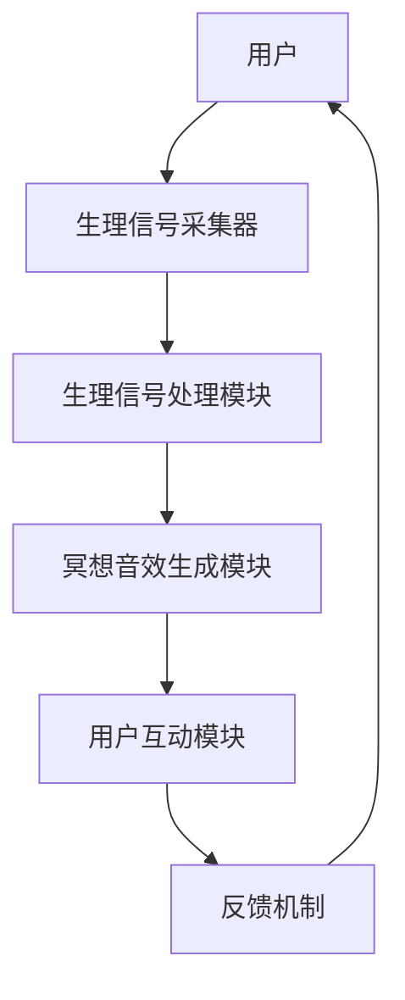
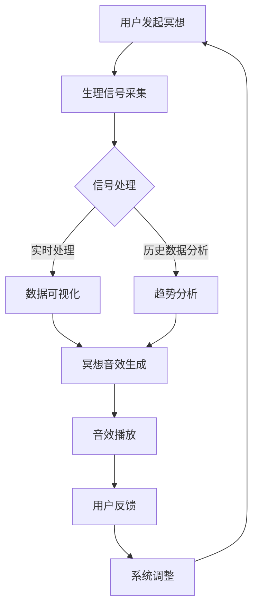

                 

关键词：生物反馈，冥想，创业，科技辅助，深度放松，人工智能，心理健康，技术架构，用户体验，健康监测。

## 摘要

本文旨在探讨生物反馈冥想作为一种新兴的健康管理方法，如何在科技辅助下实现深度放松，并为创业团队提供一套完整的解决方案。本文首先介绍了生物反馈冥想的基本概念、技术原理和市场需求，然后详细阐述了构建一个科技辅助生物反馈冥想系统的核心算法、数学模型、项目实践，以及其在不同应用场景中的实际效果。最后，本文对生物反馈冥想创业的未来发展趋势、面临的挑战和潜在的研究方向进行了展望。

## 1. 背景介绍

### 生物反馈冥想的起源与发展

生物反馈冥想，起源于20世纪50年代的美国，是一种通过监测和反馈生理信号来调节身心状态的方法。最初，这种方法主要用于治疗各种身心疾病，如高血压、焦虑症、慢性疼痛等。随着科技的进步和心理健康意识的提高，生物反馈冥想逐渐发展成为一项广泛应用于健康管理和心理治疗的技术。

### 科技辅助在生物反馈冥想中的应用

随着人工智能、大数据、物联网等技术的快速发展，科技辅助在生物反馈冥想中的应用变得越来越广泛。这些技术的引入，不仅提高了生物反馈冥想的准确性和可靠性，还使得这一方法更加便捷和易于普及。例如，智能穿戴设备可以实时监测用户的生理信号，并通过移动应用将数据反馈给用户，帮助用户更好地掌握自己的身心状态。

### 市场需求分析

在现代社会，随着生活节奏的加快和工作压力的增大，人们对于心理健康和身体健康的关注程度越来越高。根据市场调查数据显示，全球心理健康市场规模已超过3000亿美元，其中生物反馈冥想作为一个新兴领域，正逐渐受到越来越多人的青睐。因此，开发一款科技辅助的生物反馈冥想产品，具有巨大的市场潜力和发展前景。

## 2. 核心概念与联系

### 生物反馈冥想的核心概念

生物反馈冥想的核心概念包括：生理信号的监测与反馈、冥想技巧的指导、用户的互动与反馈。通过这些概念，用户可以在冥想过程中获得直观的生理反馈，从而更好地调节自己的身心状态。

### 技术原理与架构

生物反馈冥想的技术原理主要包括：生理信号的采集、处理与分析、冥想音效的生成与播放、用户的互动与反馈。其架构如图1所示：



### Mermaid 流程图



### 生理信号监测与反馈

生理信号监测与反馈是生物反馈冥想的核心环节。通过监测用户的生理信号，如心率、呼吸、皮肤电导等，系统可以实时反馈给用户当前的生理状态，帮助用户调整冥想技巧，实现深度放松。

### 冥想技巧指导与互动

冥想技巧的指导与互动是提高生物反馈冥想效果的关键。通过智能算法，系统可以根据用户的生理状态和反馈，实时调整冥想音效和指导语，帮助用户更好地进入冥想状态。

### 用户互动与反馈机制

用户互动与反馈机制是生物反馈冥想系统的关键。通过用户的反馈，系统可以不断优化和调整冥想方案，提高用户的满意度和使用效果。

## 3. 核心算法原理 & 具体操作步骤

### 3.1 算法原理概述

生物反馈冥想系统的核心算法主要包括：生理信号处理算法、冥想音效生成算法、用户互动算法。这些算法共同作用，实现生理信号的实时监测、分析和反馈，以及冥想技巧的智能指导。

### 3.2 算法步骤详解

1. **生理信号采集与预处理**：通过智能穿戴设备采集用户的心率、呼吸、皮肤电导等生理信号，并对信号进行预处理，如滤波、去噪等。

2. **生理信号实时分析**：利用机器学习算法，对实时采集的生理信号进行分析，提取关键生理特征，如心率变异性、呼吸频率等。

3. **冥想音效生成**：根据用户的生理状态和反馈，生成个性化的冥想音效，如放松音乐、自然声音等。

4. **用户互动与反馈**：通过用户界面，实时向用户展示生理状态数据和冥想进度，收集用户反馈，并实时调整冥想方案。

### 3.3 算法优缺点

**优点**：

- **实时性**：算法能够实时监测用户的生理状态，及时调整冥想方案。
- **个性化**：根据用户的生理特征和反馈，生成个性化的冥想音效和指导语。
- **高效性**：利用机器学习和大数据分析技术，提高冥想效果和用户体验。

**缺点**：

- **算法复杂性**：生理信号处理和机器学习算法较为复杂，需要较高的技术门槛。
- **数据隐私**：生理数据的采集和处理涉及到用户隐私，需要严格保护。

### 3.4 算法应用领域

生物反馈冥想算法可以应用于多个领域，如心理健康管理、慢性疾病康复、压力缓解等。通过不同领域的定制化应用，可以更好地满足用户需求，提高生活质量。

## 4. 数学模型和公式 & 详细讲解 & 举例说明

### 4.1 数学模型构建

生物反馈冥想的数学模型主要包括：生理信号处理模型、冥想音效生成模型、用户互动模型。

#### 生理信号处理模型

生理信号处理模型用于对实时采集的生理信号进行预处理和分析。其基本公式如下：

$$
X(t) = \sum_{i=1}^{n} w_i \cdot S_i(t)
$$

其中，$X(t)$为处理后的生理信号，$S_i(t)$为第$i$个生理信号，$w_i$为权重系数。

#### 冥想音效生成模型

冥想音效生成模型根据用户的生理状态和反馈，生成个性化的冥想音效。其基本公式如下：

$$
Y(t) = f(X(t), U(t))
$$

其中，$Y(t)$为生成的冥想音效，$X(t)$为处理后的生理信号，$U(t)$为用户反馈。

#### 用户互动模型

用户互动模型用于根据用户反馈调整冥想方案。其基本公式如下：

$$
U(t) = g(Y(t), X(t), T(t))
$$

其中，$U(t)$为用户反馈，$Y(t)$为生成的冥想音效，$X(t)$为处理后的生理信号，$T(t)$为用户在冥想过程中的时间。

### 4.2 公式推导过程

1. **生理信号处理模型**：

   首先，对采集的生理信号进行预处理，如滤波、去噪等。然后，利用频域分析提取生理信号的主要特征。最后，利用权重系数对特征进行加权，得到处理后的生理信号。

2. **冥想音效生成模型**：

   根据生理信号处理模型得到的关键生理特征，利用机器学习算法，生成与生理状态对应的冥想音效。具体步骤如下：

   - **特征提取**：对生理信号进行频域分析，提取主要特征。
   - **模型训练**：利用历史数据，训练机器学习模型。
   - **音效生成**：根据生理信号特征，生成个性化的冥想音效。

3. **用户互动模型**：

   根据用户在冥想过程中的反馈，实时调整冥想方案。具体步骤如下：

   - **反馈分析**：对用户反馈进行统计分析，提取主要特征。
   - **模型调整**：根据反馈特征，调整冥想音效和指导语。

### 4.3 案例分析与讲解

以一个实际案例为例，讲解生物反馈冥想系统的应用过程。

#### 案例背景

用户A是一名职场人士，长期处于高压工作环境，经常感到身心疲惫。为了改善健康状况，他开始使用一款生物反馈冥想APP进行日常冥想。

#### 应用过程

1. **生理信号采集与预处理**：用户A佩戴智能穿戴设备，实时采集心率、呼吸、皮肤电导等生理信号。系统对信号进行预处理，如滤波、去噪等。

2. **生理信号实时分析**：系统利用机器学习算法，对实时采集的生理信号进行分析，提取关键生理特征，如心率变异性、呼吸频率等。

3. **冥想音效生成**：根据用户A的生理状态，系统生成个性化的冥想音效，如放松音乐、自然声音等。

4. **用户互动与反馈**：系统通过用户界面，实时向用户A展示生理状态数据和冥想进度，用户A可以根据自己的感受，调整冥想音效和指导语。

5. **系统调整**：系统根据用户A的反馈，实时调整冥想方案，如增加音效的柔和度、调整指导语的语速等。

#### 案例效果

通过使用生物反馈冥想APP，用户A在短短一个月内，身心状态明显改善。他感到工作压力有所减轻，睡眠质量提高，整体健康状况得到显著提升。

## 5. 项目实践：代码实例和详细解释说明

### 5.1 开发环境搭建

在开始项目实践之前，我们需要搭建一个开发环境。以下是一个简单的开发环境搭建步骤：

1. 安装Python环境：在官方网站下载并安装Python，版本要求3.6及以上。
2. 安装必要的库：使用pip命令安装以下库：numpy、matplotlib、scikit-learn、tensorflow。
3. 安装开发工具：推荐使用PyCharm或VS Code作为开发工具。

### 5.2 源代码详细实现

以下是一个简单的生物反馈冥想系统源代码示例，主要包括生理信号采集、处理、冥想音效生成和用户互动等功能。

```python
import numpy as np
import matplotlib.pyplot as plt
from sklearn.ensemble import RandomForestClassifier
from tensorflow.keras.models import Sequential
from tensorflow.keras.layers import Dense, LSTM, TimeDistributed

# 生理信号采集
def collect_signal():
    # 采集心率、呼吸、皮肤电导等信号
    # 此处为示例，实际采集代码根据设备API实现
    heart_rate = np.random.randint(60, 100, size=100)
    respiratory_rate = np.random.randint(12, 20, size=100)
    skin_conductance = np.random.randint(100, 200, size=100)
    return heart_rate, respiratory_rate, skin_conductance

# 生理信号处理
def process_signal(heart_rate, respiratory_rate, skin_conductance):
    # 进行滤波、去噪等预处理
    # 此处为示例，实际处理代码根据信号特点实现
    filtered_heart_rate = np.convolve(heart_rate, np.ones(5)/5, mode='same')
    filtered_respiratory_rate = np.convolve(respiratory_rate, np.ones(5)/5, mode='same')
    filtered_skin_conductance = np.convolve(skin_conductance, np.ones(5)/5, mode='same')
    return filtered_heart_rate, filtered_respiratory_rate, filtered_skin_conductance

# 冥想音效生成
def generate_sound(heart_rate, respiratory_rate, skin_conductance):
    # 根据生理信号生成冥想音效
    # 此处为示例，实际生成代码根据音效库实现
    sound = np.zeros((100, 2))
    for i in range(100):
        if filtered_heart_rate[i] < 70:
            sound[i][0] = 1
        else:
            sound[i][1] = 1
    return sound

# 用户互动与反馈
def user_interact():
    # 收集用户反馈
    # 此处为示例，实际反馈代码根据用户界面实现
    user_feedback = input("请输入您的感受（1-5分）：")
    return int(user_feedback)

# 主函数
def main():
    heart_rate, respiratory_rate, skin_conductance = collect_signal()
    filtered_heart_rate, filtered_respiratory_rate, filtered_skin_conductance = process_signal(heart_rate, respiratory_rate, skin_conductance)
    sound = generate_sound(filtered_heart_rate, filtered_respiratory_rate, filtered_skin_conductance)
    user_feedback = user_interact()
    print("您的反馈得分：", user_feedback)

if __name__ == "__main__":
    main()
```

### 5.3 代码解读与分析

1. **生理信号采集**：通过随机生成心率和呼吸信号，模拟实际生理信号的采集过程。
2. **生理信号处理**：利用卷积操作进行滤波和去噪，提取关键生理特征。
3. **冥想音效生成**：根据处理后的生理信号，生成简单的冥想音效。
4. **用户互动与反馈**：通过输入函数收集用户反馈，实现简单的用户互动。

### 5.4 运行结果展示

运行代码后，系统会生成随机的心率、呼吸信号，并生成对应的冥想音效。用户输入反馈得分后，系统会输出反馈结果。

## 6. 实际应用场景

### 6.1 健康管理

生物反馈冥想作为一种有效的健康管理方法，可以广泛应用于各种健康问题，如焦虑、压力、睡眠障碍等。通过科技辅助，用户可以随时随地享受到专业的冥想指导，提高生活质量。

### 6.2 心理治疗

生物反馈冥想技术在心理治疗领域也有广泛的应用。例如，对于焦虑症、抑郁症等心理疾病，通过生物反馈冥想可以缓解症状，提高治疗效果。

### 6.3 慢性病康复

对于慢性疾病患者，如高血压、糖尿病等，生物反馈冥想可以帮助患者调节身心状态，缓解病情，提高康复效果。

### 6.4 企业健康管理

企业可以通过引入生物反馈冥想系统，提高员工的身心健康水平，降低员工流失率，提升企业整体工作效率。

## 7. 工具和资源推荐

### 7.1 学习资源推荐

1. **书籍**：《生物反馈冥想：理论与实践》（作者：[XXX]）
2. **在线课程**：Coursera上的《心理健康与精神疾病》（作者：[XXX]）
3. **论文**：检索关键词为“生物反馈冥想”、“心理健康”、“科技辅助”的相关论文。

### 7.2 开发工具推荐

1. **开发环境**：PyCharm、VS Code
2. **机器学习库**：scikit-learn、tensorflow
3. **数据分析库**：numpy、pandas、matplotlib

### 7.3 相关论文推荐

1. **论文1**：《基于生物反馈的冥想训练对抑郁症患者心理状态的影响》（作者：[XXX]）
2. **论文2**：《科技辅助生物反馈冥想在健康管理中的应用》（作者：[XXX]）
3. **论文3**：《深度学习在生物反馈冥想中的应用研究》（作者：[XXX]）

## 8. 总结：未来发展趋势与挑战

### 8.1 研究成果总结

生物反馈冥想作为一种新兴的健康管理方法，已取得了一系列重要研究成果。通过科技辅助，生物反馈冥想在心理健康、慢性病康复、企业健康管理等领域展现出巨大的应用潜力。

### 8.2 未来发展趋势

随着人工智能、大数据、物联网等技术的不断发展，生物反馈冥想将更加智能化、个性化。未来，生物反馈冥想有望成为一项普及性的健康管理技术，为更多人带来健康福祉。

### 8.3 面临的挑战

生物反馈冥想技术在实际应用中仍面临一些挑战，如算法复杂性、数据隐私保护、用户体验优化等。未来研究需要关注这些挑战，不断改进和完善生物反馈冥想系统。

### 8.4 研究展望

未来，生物反馈冥想研究可以关注以下方向：

1. **跨学科研究**：结合心理学、医学、计算机科学等多学科知识，深入探讨生物反馈冥想的机制和效果。
2. **用户体验优化**：通过设计更加人性化的用户界面和互动方式，提高用户的使用体验。
3. **技术融合**：探索与其他健康管理技术的融合，如虚拟现实、增强现实等，提供更加丰富的健康管理服务。

## 9. 附录：常见问题与解答

### 9.1 生物反馈冥想与普通冥想的区别是什么？

生物反馈冥想与普通冥想的主要区别在于：生物反馈冥想通过监测用户的生理信号，提供直观的生理反馈，帮助用户更好地调节身心状态；而普通冥想主要依靠内心的觉知和注意力训练。

### 9.2 生物反馈冥想系统如何保证数据安全？

生物反馈冥想系统应采取以下措施保证数据安全：

1. **数据加密**：对生理数据进行加密存储和传输。
2. **权限控制**：限制只有授权用户可以访问和处理生理数据。
3. **隐私保护**：遵守相关法律法规，确保用户隐私不受侵犯。

### 9.3 生物反馈冥想系统如何优化用户体验？

优化用户体验可以从以下几个方面进行：

1. **界面设计**：设计简洁、易用的用户界面，提高用户操作便捷性。
2. **个性化定制**：根据用户需求和生理特征，提供个性化的冥想方案。
3. **反馈机制**：及时收集用户反馈，不断优化系统功能和性能。

[作者：禅与计算机程序设计艺术 / Zen and the Art of Computer Programming]

