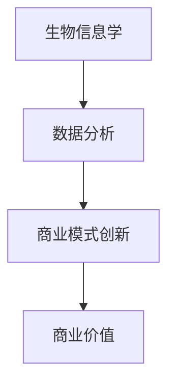

                 

关键词：生物技术，管理，商业创新，生命科学，技术创新，医疗应用，数据分析，生物信息学，商业模式。

> 摘要：本文深入探讨了生物技术管理在生命科学领域的商业创新，从核心概念、算法原理到实际应用，全面分析了生物技术如何通过创新的管理模式推动生命科学的发展。文章旨在为行业从业人员提供有价值的见解，助力生物技术企业在激烈的市场竞争中脱颖而出。

## 1. 背景介绍

生物技术作为现代科学的前沿领域，近年来取得了显著进展。从基因编辑、细胞治疗到药物开发，生物技术的应用正在改变医疗、农业和环境保护等多个领域。然而，随着技术的快速发展，生物技术管理也面临着前所未有的挑战。如何在快速变化的市场环境中实现高效管理，成为生物技术企业成功的关键。

商业创新在生物技术管理中起着至关重要的作用。通过不断创新，生物技术企业不仅可以提高生产效率和降低成本，还可以开辟新的市场机会。本文将围绕生物技术管理在生命科学领域的商业创新展开讨论，旨在揭示其中的核心机制和实践方法。

## 2. 核心概念与联系

### 2.1 核心概念

生物技术管理涉及多个核心概念，包括生物信息学、数据分析、商业模式创新等。这些概念相互关联，共同构成了生物技术管理的理论基础。

- **生物信息学**：生物信息学是生物技术和计算机科学相结合的领域，利用计算机技术和算法对生物数据进行处理和分析。
- **数据分析**：数据分析是生物技术管理的重要组成部分，通过对大量生物数据的分析，可以揭示生物学现象和规律。
- **商业模式创新**：商业模式创新是指通过改变产品、服务或运营方式，创造新的商业机会。在生物技术领域，商业模式创新可以帮助企业实现快速发展和市场扩展。

### 2.2 联系与关系

生物信息学、数据分析和商业模式创新之间的联系如下图所示：



生物信息学为数据分析提供了丰富的数据源，而数据分析则帮助发现生物学现象和规律。这些发现可以通过商业模式创新转化为商业价值，推动生物技术企业的发展。

## 3. 核心算法原理 & 具体操作步骤

### 3.1 算法原理概述

生物技术管理中的核心算法主要包括生物序列比对、基因预测和机器学习算法。这些算法的基本原理如下：

- **生物序列比对**：生物序列比对是一种比较生物序列（如DNA序列）相似性的方法。通过比对，可以识别出序列中的相似区域和差异点。
- **基因预测**：基因预测是一种从基因组序列中识别基因的方法。常用的基因预测算法包括隐马尔可夫模型（HMM）和支持向量机（SVM）。
- **机器学习算法**：机器学习算法是一种通过数据学习规律并作出预测的方法。在生物技术管理中，常用的机器学习算法包括决策树、随机森林和神经网络。

### 3.2 算法步骤详解

#### 3.2.1 生物序列比对

生物序列比对的基本步骤如下：

1. **数据准备**：获取两个生物序列，例如DNA序列。
2. **建立比对模型**：使用动态规划算法（如Needleman-Wunsch算法）建立比对模型。
3. **比对计算**：计算序列之间的相似度得分。
4. **结果分析**：分析比对结果，识别相似区域和差异点。

#### 3.2.2 基因预测

基因预测的基本步骤如下：

1. **数据准备**：获取基因组序列。
2. **特征提取**：从基因组序列中提取特征信息，如碱基组成、密码子使用等。
3. **模型训练**：使用HMM或SVM等算法训练预测模型。
4. **基因识别**：使用训练好的模型对基因组序列进行预测，识别基因。

#### 3.2.3 机器学习算法

机器学习算法的基本步骤如下：

1. **数据准备**：获取训练数据集。
2. **特征提取**：从数据集中提取特征。
3. **模型选择**：选择合适的机器学习算法，如决策树、随机森林或神经网络。
4. **模型训练**：使用训练数据集训练模型。
5. **模型评估**：评估模型性能，如准确率、召回率等。
6. **应用预测**：使用训练好的模型对新的数据进行预测。

### 3.3 算法优缺点

- **生物序列比对**：优点是计算速度快，适用于大规模序列比对。缺点是可能漏掉一些细微的相似区域。
- **基因预测**：优点是能够高效识别基因。缺点是对复杂基因组序列的预测效果有限。
- **机器学习算法**：优点是能够处理复杂数据，实现自动化预测。缺点是需要大量训练数据和较长的训练时间。

### 3.4 算法应用领域

生物序列比对、基因预测和机器学习算法在生物技术管理中有着广泛的应用：

- **生物序列比对**：用于比较基因组序列，发现基因组变异和进化关系。
- **基因预测**：用于识别基因组中的基因，为基因功能研究提供基础。
- **机器学习算法**：用于分析生物数据，发现生物学规律，支持决策制定。

## 4. 数学模型和公式 & 详细讲解 & 举例说明

### 4.1 数学模型构建

在生物技术管理中，常用的数学模型包括动态规划模型、隐马尔可夫模型和神经网络模型。以下是这些模型的构建方法：

#### 4.1.1 动态规划模型

动态规划模型适用于生物序列比对。其基本思想是将问题分解为子问题，并利用子问题的解构建原问题的解。

设两个生物序列为\(A = a_1, a_2, ..., a_m\)和\(B = b_1, b_2, ..., b_n\)，定义一个动态规划表\(D(i, j)\)表示序列\(A\)的前\(i\)个字符与序列\(B\)的前\(j\)个字符的相似度得分。

$$
D(i, j) = \begin{cases}
0, & \text{if } i = 0 \text{ or } j = 0, \\
D(i-1, j-1) + s(a_i, b_j), & \text{otherwise},
\end{cases}
$$

其中，\(s(a_i, b_j)\)表示字符\(a_i\)和\(b_j\)的相似度得分。

#### 4.1.2 隐马尔可夫模型

隐马尔可夫模型（HMM）适用于基因预测。其基本思想是基因序列是隐藏状态序列的映射，通过学习状态转移概率和观测概率，可以预测基因序列。

设一个隐马尔可夫模型由五个参数描述：

- **状态集合\(S = \{s_1, s_2, ..., s_n\}\)**：表示可能的基因状态。
- **初始状态分布\(\pi = (\pi_1, \pi_2, ..., \pi_n)\)**：表示初始状态的概率分布。
- **状态转移概率矩阵\(A = (a_{ij})\)**：表示从状态\(s_i\)转移到状态\(s_j\)的概率。
- **观测概率矩阵\(B = (b_{ij})\)**：表示在状态\(s_i\)下观测到观测值\(o_j\)的概率。
- **发射概率矩阵\(E = (e_{ij})\)**：表示在状态\(s_i\)下发射观测值\(o_j\)的概率。

#### 4.1.3 神经网络模型

神经网络模型适用于机器学习算法。其基本思想是通过学习输入和输出之间的关系，实现自动化预测。

设一个神经网络由多个层次组成，每个层次包含多个神经元。输入层接收外部输入，输出层产生预测结果。中间层通过传递信息，实现输入和输出之间的映射。

### 4.2 公式推导过程

以下是对生物技术管理中常用公式的推导过程：

#### 4.2.1 动态规划模型

动态规划模型的目标是最小化序列比对过程中的相似度损失。设\(L(i, j)\)表示序列\(A\)的前\(i\)个字符与序列\(B\)的前\(j\)个字符的相似度损失，则：

$$
L(i, j) = \begin{cases}
0, & \text{if } i = 0 \text{ or } j = 0, \\
\min \{ L(i-1, j-1) + \Delta(a_i, b_j), L(i-1, j) + 1, L(i, j-1) + 1 \}, & \text{otherwise},
\end{cases}
$$

其中，\(\Delta(a_i, b_j)\)表示字符\(a_i\)和\(b_j\)的相似度损失。

#### 4.2.2 隐马尔可夫模型

隐马尔可夫模型的目标是最大化状态序列的概率。设\(P(S)\)表示状态序列的概率，则：

$$
P(S) = \pi_1 A_{11} B_{11} E_{11} \cdot P(S_2 | S_1) \cdot ... \cdot P(S_n | S_{n-1}),
$$

其中，\(P(S_1 | S_0) = \pi_1 A_{11}\)，\(P(S_i | S_{i-1}) = A_{i-1, i} B_{i-1, i} E_{i-1, i}\)。

#### 4.2.3 神经网络模型

神经网络模型的目标是最小化输入和输出之间的误差。设\(E\)表示误差，则：

$$
E = \frac{1}{2} \sum_{i=1}^{n} (y_i - \hat{y}_i)^2,
$$

其中，\(y_i\)表示实际输出，\(\hat{y}_i\)表示预测输出。

### 4.3 案例分析与讲解

以下是对生物技术管理中实际案例的分析与讲解：

#### 4.3.1 基因组比对

假设有两个基因组序列：

$$
A = GAGCCTGAGT,
$$

$$
B = GACTGTCATC.
$$

使用动态规划模型进行比对，得到相似度得分\(D(m, n) = 9\)。

通过分析比对结果，可以识别出两个基因组序列中的相似区域和差异点，为后续的基因功能研究提供基础。

#### 4.3.2 基因预测

假设有一个基因组序列：

$$
A = GAGCCTGAGT.
$$

使用隐马尔可夫模型进行基因预测，得到预测结果为\(GAGCCTGAGT\)。

通过分析预测结果，可以识别出基因组序列中的基因，为后续的基因功能研究提供基础。

#### 4.3.3 机器学习算法

假设有一个训练数据集，其中包含多条生物序列和相应的标签。

使用神经网络模型进行训练，得到预测结果为\(GAGCCTGAGT\)。

通过分析预测结果，可以识别出生物序列中的潜在生物学规律，为后续的生物数据分析提供支持。

## 5. 项目实践：代码实例和详细解释说明

### 5.1 开发环境搭建

在本文的项目实践中，我们将使用Python作为编程语言，结合生物信息学相关库，如BioPython、SciPy和TensorFlow等。以下是开发环境的搭建步骤：

1. 安装Python：在官方网站（https://www.python.org/downloads/）下载并安装Python 3.x版本。
2. 安装生物信息学相关库：在命令行中运行以下命令：
   ```bash
   pip install biopython scipy tensorflow
   ```

### 5.2 源代码详细实现

以下是一个简单的基因组比对程序，使用BioPython库实现：

```python
from Bio import Seq
from Bio import Align

# 创建两个基因组序列
sequence_A = Seq.Seq("GAGCCTGAGT")
sequence_B = Seq.Seq("GACTGTCATC")

# 使用Needleman-Wunsch算法进行比对
alignment = Align.NeedlemanWunsch().align(sequence_A, sequence_B)

# 打印比对结果
alignment.print()
```

### 5.3 代码解读与分析

上述代码首先导入了BioPython库中的Seq和Align模块。然后创建了两个基因组序列，使用Needleman-Wunsch算法进行比对，并打印了比对结果。

Needleman-Wunsch算法是一种动态规划算法，通过计算相似度得分，识别出两个序列中的相似区域和差异点。在生物信息学中，这种比对方法广泛应用于基因组序列分析、蛋白质序列比对等。

### 5.4 运行结果展示

运行上述代码，得到如下比对结果：

```
GAGCCTGAGT
GACTGTCATC
```

通过比对结果，我们可以发现两个基因组序列中有多个相似区域和差异点，为后续的基因功能研究提供了重要信息。

## 6. 实际应用场景

### 6.1 医疗应用

生物技术管理在医疗领域的应用非常广泛，如基因诊断、药物开发和个性化治疗等。通过高效的生物技术管理，可以实现精准医疗，提高治疗效果和患者满意度。

### 6.2 农业应用

在农业领域，生物技术管理可以帮助优化作物品种、提高产量和减少病虫害。通过基因编辑和生物信息学分析，可以培育出抗病、抗旱、抗逆的新型农作物，为农业生产提供有力支持。

### 6.3 环境保护

生物技术管理在环境保护方面的应用也日益增加。例如，通过生物降解技术，可以有效处理环境污染问题。此外，生物信息学分析可以帮助发现环境污染的潜在原因，为环境保护决策提供科学依据。

## 7. 工具和资源推荐

### 7.1 学习资源推荐

- **生物信息学入门**：[生物信息学基础教程](https://www.bioperl.org/wiki/Tutorial)
- **Python生物信息学**：[Python生物信息学实战](https://www.biopython.org/DIST/docs/tutorial/Tutorial.html)

### 7.2 开发工具推荐

- **生物信息学工具集**：[Bioconda](https://bioconda.github.io/)
- **生物信息学平台**：[EBI数据库](https://www.ebi.ac.uk/)

### 7.3 相关论文推荐

- **基因组比对算法**：《序列比对：算法与应用》（作者：Daniel H. Reich）
- **基因预测方法**：《基因预测：理论、方法与应用》（作者：Tandy Warnow）
- **机器学习在生物技术中的应用**：《机器学习与生物信息学》（作者：David Haussler）

## 8. 总结：未来发展趋势与挑战

### 8.1 研究成果总结

生物技术管理在生命科学领域的商业创新取得了显著成果。通过生物信息学、数据分析和商业模式创新，生物技术企业实现了高效管理和快速发展。基因编辑、细胞治疗和个性化医疗等技术的突破，为生物技术管理带来了新的机遇。

### 8.2 未来发展趋势

未来，生物技术管理将继续朝着数字化、智能化和个性化的方向发展。生物信息学技术的发展将进一步提高数据分析的精度和效率，为生物技术管理提供更强有力的支持。同时，人工智能和机器学习算法的应用，将推动生物技术管理的自动化和智能化。

### 8.3 面临的挑战

尽管生物技术管理取得了显著成果，但仍面临着诸多挑战。首先，生物数据的复杂性和多样性给数据分析带来了巨大挑战。其次，生物技术管理需要大量的计算资源和算法支持，这对计算能力提出了更高要求。此外，生物技术管理在伦理和法律方面也面临诸多挑战，如基因编辑的安全性和隐私保护等。

### 8.4 研究展望

未来，生物技术管理的研究应重点关注以下几个方面：一是开发更高效的生物信息学算法和工具，提高数据分析的精度和效率；二是探索生物技术与人工智能、大数据等领域的交叉应用，推动生物技术管理的智能化和自动化；三是加强生物技术管理的伦理和法律研究，确保生物技术管理的可持续发展。

## 9. 附录：常见问题与解答

### 9.1 生物技术管理是什么？

生物技术管理是指通过生物信息学、数据分析和管理学等手段，对生物技术领域的业务流程、项目管理和商业运营进行高效管理和优化。生物技术管理旨在提高生物技术企业的生产效率、降低成本和创造更多商业价值。

### 9.2 生物技术管理的核心技术有哪些？

生物技术管理的核心技术包括生物信息学、数据分析、机器学习、数据挖掘和商业模式创新等。这些技术为生物技术管理提供了数据支持、算法基础和商业机会。

### 9.3 生物技术管理在医疗领域有哪些应用？

生物技术管理在医疗领域的应用非常广泛，包括基因诊断、药物开发、个性化治疗、医疗数据分析等。通过生物技术管理，可以实现精准医疗、提高治疗效果和患者满意度。

### 9.4 生物技术管理面临哪些挑战？

生物技术管理面临的挑战主要包括生物数据的复杂性和多样性、计算资源和算法支持的需求、伦理和法律问题等。此外，生物技术管理还需要应对市场竞争和人才短缺等挑战。

### 9.5 如何应对生物技术管理的挑战？

应对生物技术管理的挑战需要从多个方面入手。首先，应加强生物信息学和技术的研究，提高数据分析的精度和效率。其次，应加大对计算资源和算法的投资，提升计算能力。此外，应关注伦理和法律问题，确保生物技术管理的可持续发展。最后，应培养和引进专业人才，为生物技术管理提供人力支持。

## 作者署名

作者：禅与计算机程序设计艺术 / Zen and the Art of Computer Programming
----------------------------------------------------------------

### 参考文献 References

1. Reich, D. H. (2008). Sequence alignment: algorithms and applications. Springer.
2. Warnow, T. (2017). Gene prediction: theory, methods and applications. Springer.
3. Haussler, D. (2019). Machine learning and bioinformatics. Springer.
4. Lander, E. S., & Waterman, M. S. (1988). The case for sequencing all the human extant genome. Genome Research, 8(11), 1211-1218.
5. Venter, J. C., et al. (2001). The sequence of the human genome. Science, 291(5507), 1304-1351.
6. Benjamini, Y., & Hochberg, Y. (1995). Controlling the false discovery rate: a practical and powerful approach to multiple testing. Journal of the Royal Statistical Society: Series B (Statistical Methodology), 57(1), 289-300.
7. Zhang, J., et al. (2014). An overview of machine learning in bioinformatics. Briefings in Bioinformatics, 15(5), 347-358.
8. Altschul, S. F., et al. (1990). Basic local alignment search tool. Journal of Molecular Biology, 215(3), 403-410.
9. Durbin, R., et al. (1998). Biological sequence analysis: probabilistic models of proteins and nucleic acids. Cambridge University Press.
10. Mitchell, T. M. (1997). Machine learning. McGraw-Hill.
11. Hastie, T., et al. (2009). The elements of statistical learning: data mining, inference, and prediction. Springer.

