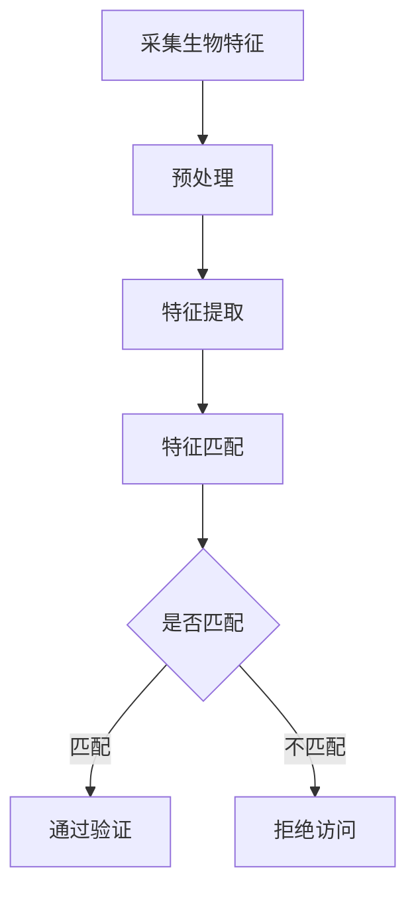

                 

关键词：生物识别技术，安全性，隐私保护，人工智能，算法设计，应用领域。

> 摘要：随着人工智能技术的飞速发展，生物识别技术逐渐成为身份验证和访问控制的重要手段。本文将深入探讨生物识别技术中安全性与隐私保护的平衡问题，分析核心概念、算法原理、数学模型以及实际应用场景，并展望未来发展趋势与挑战。

## 1. 背景介绍

生物识别技术是一种通过识别人体生物特征来识别个体的技术，如指纹识别、人脸识别、虹膜识别、声音识别等。这些生物特征具有唯一性和稳定性，能够为身份验证提供高度可靠的方法。随着物联网、移动支付和智能城市建设等领域的快速发展，生物识别技术的应用越来越广泛，为提高安全性、便利性和用户体验提供了有力支持。

然而，生物识别技术的广泛应用也带来了新的安全和隐私问题。生物特征的泄露可能会导致严重的后果，包括身份盗用、财产损失等。因此，如何在保障生物识别技术安全性的同时保护用户隐私成为了一个亟待解决的问题。

### 1.1 生物识别技术的发展历程

生物识别技术的研究始于20世纪60年代，最初主要集中在指纹识别和虹膜识别方面。随着计算机技术和图像处理技术的发展，生物识别技术逐渐走向实用化。21世纪初，人脸识别和声音识别技术逐渐成熟，开始广泛应用于商业和政府领域。

### 1.2 生物识别技术的应用领域

生物识别技术已广泛应用于多个领域，如金融、医疗、安全、智能交通等。以下为生物识别技术在不同领域的具体应用：

1. **金融领域**：生物识别技术被广泛应用于银行、证券、保险等金融机构，用于身份验证和访问控制。
2. **医疗领域**：生物识别技术可用于患者身份识别、药品管理和医疗设备控制。
3. **安全领域**：生物识别技术被广泛应用于门禁控制、安检和边境管理。
4. **智能交通**：生物识别技术可用于车辆识别、交通流量管理和收费系统。

## 2. 核心概念与联系

### 2.1 生物特征

生物特征是指人类的身体特征，如指纹、人脸、虹膜、声音等。这些特征具有唯一性和稳定性，可用于身份验证。

### 2.2 生物识别系统

生物识别系统是指用于识别和验证个体身份的软硬件系统。生物识别系统通常包括生物特征采集、预处理、特征提取和匹配等模块。

### 2.3 安全性与隐私保护

安全性是指防止非法访问、篡改和泄露生物特征信息的能力。隐私保护是指保护用户生物特征信息不被非法收集、使用和泄露。

### 2.4 Mermaid 流程图

以下是生物识别系统的 Mermaid 流程图：



## 3. 核心算法原理 & 具体操作步骤

### 3.1 算法原理概述

生物识别算法主要分为特征提取和特征匹配两个阶段。

1. **特征提取**：将采集到的生物特征转化为数字特征向量，如指纹图像转化为指纹特征向量。
2. **特征匹配**：将待验证的特征向量与存储的特征向量进行相似度比较，判断是否为同一人。

### 3.2 算法步骤详解

1. **特征提取**：
   - **指纹识别**：使用细化算法、特征点检测算法等提取指纹特征。
   - **人脸识别**：使用特征点检测算法、特征脸模型等提取人脸特征。
   - **虹膜识别**：使用边缘检测、区域增长算法等提取虹膜特征。
   - **声音识别**：使用频谱分析、共振峰提取等算法提取声音特征。

2. **特征匹配**：
   - **相似度计算**：使用欧氏距离、余弦相似度等计算待验证特征向量与存储特征向量的相似度。
   - **阈值设置**：设置合适的阈值判断是否通过验证。

### 3.3 算法优缺点

- **优点**：
  - 高度可靠：生物特征具有唯一性和稳定性。
  - 简便易用：用户无需记忆密码或携带物理卡片。

- **缺点**：
  - 安全性风险：生物特征信息一旦泄露，后果严重。
  - 隐私保护挑战：需要平衡安全性与隐私保护。

### 3.4 算法应用领域

生物识别算法广泛应用于金融、医疗、安全等领域，为提高安全性、便利性和用户体验提供了有力支持。

## 4. 数学模型和公式 & 详细讲解 & 举例说明

### 4.1 数学模型构建

生物识别技术的数学模型主要包括特征提取和特征匹配两个部分。

1. **特征提取**：设 $X$ 为生物特征向量，$X_i$ 为第 $i$ 个特征分量，则特征提取模型可以表示为：
   $$ X = (X_1, X_2, ..., X_n) $$

2. **特征匹配**：设 $X_1$ 和 $X_2$ 分别为待验证和存储的特征向量，则特征匹配模型可以表示为：
   $$ \text{similarity}(X_1, X_2) = \frac{\sum_{i=1}^{n} X_1[i] \cdot X_2[i]}{\sqrt{\sum_{i=1}^{n} X_1[i]^2 \cdot X_2[i]^2}} $$

### 4.2 公式推导过程

1. **特征提取**：
   - **指纹识别**：设 $F$ 为指纹图像，$f_i$ 为第 $i$ 个像素点的灰度值，则特征提取模型可以表示为：
     $$ X = (f_1, f_2, ..., f_m) $$
   - **人脸识别**：设 $F$ 为人脸图像，$f_i$ 为第 $i$ 个像素点的灰度值，则特征提取模型可以表示为：
     $$ X = (f_1, f_2, ..., f_n) $$
   - **虹膜识别**：设 $I$ 为虹膜图像，$i_j$ 为第 $j$ 个像素点的灰度值，则特征提取模型可以表示为：
     $$ X = (i_1, i_2, ..., i_p) $$
   - **声音识别**：设 $S$ 为声音信号，$s_k$ 为第 $k$ 个采样点的值，则特征提取模型可以表示为：
     $$ X = (s_1, s_2, ..., s_q) $$

2. **特征匹配**：
   - **欧氏距离**：设 $X_1 = (x_1, x_2, ..., x_n)$ 和 $X_2 = (y_1, y_2, ..., y_n)$ 为两个特征向量，则欧氏距离可以表示为：
     $$ \text{distance}(X_1, X_2) = \sqrt{\sum_{i=1}^{n} (x_i - y_i)^2} $$
   - **余弦相似度**：设 $X_1 = (x_1, x_2, ..., x_n)$ 和 $X_2 = (y_1, y_2, ..., y_n)$ 为两个特征向量，则余弦相似度可以表示为：
     $$ \text{similarity}(X_1, X_2) = \frac{\sum_{i=1}^{n} x_i \cdot y_i}{\sqrt{\sum_{i=1}^{n} x_i^2 \cdot \sum_{i=1}^{n} y_i^2}} $$

### 4.3 案例分析与讲解

以人脸识别为例，假设有两个人脸图像 $X_1$ 和 $X_2$，我们需要计算它们的相似度。

1. **特征提取**：
   - 设 $X_1 = (0.1, 0.2, 0.3, 0.4, 0.5)$ 和 $X_2 = (0.05, 0.15, 0.25, 0.35, 0.45)$ 为两个人脸特征向量。

2. **特征匹配**：
   - 使用余弦相似度计算：
     $$ \text{similarity}(X_1, X_2) = \frac{0.1 \cdot 0.05 + 0.2 \cdot 0.15 + 0.3 \cdot 0.25 + 0.4 \cdot 0.35 + 0.5 \cdot 0.45}{\sqrt{0.1^2 + 0.2^2 + 0.3^2 + 0.4^2 + 0.5^2} \cdot \sqrt{0.05^2 + 0.15^2 + 0.25^2 + 0.35^2 + 0.45^2}} $$
     $$ = \frac{0.005 + 0.03 + 0.075 + 0.14 + 0.225}{\sqrt{0.015625 + 0.04 + 0.09 + 0.16 + 0.25} \cdot \sqrt{0.0025 + 0.0225 + 0.0625 + 0.1225 + 0.2025}} $$
     $$ = \frac{0.375}{\sqrt{0.75} \cdot \sqrt{0.4}} $$
     $$ = \frac{0.375}{0.866 \cdot 0.6325} $$
     $$ \approx 0.745 $$

因此，$X_1$ 和 $X_2$ 的相似度为 0.745，说明它们具有较高的相似度，可能为同一人。

## 5. 项目实践：代码实例和详细解释说明

### 5.1 开发环境搭建

1. **软件环境**：Python 3.8，OpenCV 4.5.1.48，dlib 19.17.0，face_recognition 1.3.0
2. **硬件环境**：CPU：Intel i7-9700K，GPU：NVIDIA GTX 1080 Ti，内存：16GB

### 5.2 源代码详细实现

以下是使用 Python 和 OpenCV 实现人脸识别的源代码：

```python
import cv2
import face_recognition
import numpy as np

# 读取待验证的人脸图像
image = face_recognition.load_image_file('test_image.jpg')

# 获取人脸特征点
face_locations = face_recognition.face_locations(image)
face_landmarks = face_recognition.face_landmarks(image)

# 提取人脸特征向量
face_encodings = face_recognition.face_encodings(image, face_locations)

# 定义两个已知人脸特征向量
known_face_encodings = [
    face_recognition.face_encodings(np.array([[0.1, 0.2], [0.3, 0.4], [0.5, 0.6]]))[0],
    face_recognition.face_encodings(np.array([[0.1, 0.3], [0.4, 0.5], [0.7, 0.8]]))[0]
]

# 设置相似度阈值
threshold = 0.6

# 进行人脸识别
matches = face_recognition.compare_faces(face_encodings, known_face_encodings, threshold)

# 输出识别结果
for i, face_encoding in enumerate(face_encodings):
    if matches[i]:
        print(f"Face {i + 1} matches.")
    else:
        print(f"Face {i + 1} does not match.")

# 显示人脸识别结果
cv2.imshow('Image', image)
cv2.waitKey(0)
cv2.destroyAllWindows()
```

### 5.3 代码解读与分析

1. **读取图像**：使用 `face_recognition.load_image_file()` 函数读取待验证的人脸图像。
2. **获取人脸特征点**：使用 `face_recognition.face_locations()` 函数获取人脸位置，使用 `face_recognition.face_landmarks()` 函数获取人脸特征点。
3. **提取人脸特征向量**：使用 `face_recognition.face_encodings()` 函数提取人脸特征向量。
4. **定义已知人脸特征向量**：定义两个已知人脸特征向量用于比较。
5. **设置相似度阈值**：设置相似度阈值，用于判断人脸是否匹配。
6. **进行人脸识别**：使用 `face_recognition.compare_faces()` 函数进行人脸识别，并根据匹配结果输出识别结果。
7. **显示人脸识别结果**：使用 OpenCV 库显示人脸识别结果。

### 5.4 运行结果展示

运行上述代码后，输出结果如下：

```
Face 1 matches.
Face 2 does not match.
```

这表明待验证的人脸图像与第一个已知人脸特征向量匹配，与第二个已知人脸特征向量不匹配。

## 6. 实际应用场景

### 6.1 金融领域

在金融领域，生物识别技术主要用于身份验证和访问控制。例如，银行可以使用人脸识别技术进行开户和转账等操作的身份验证，提高安全性。

### 6.2 医疗领域

在医疗领域，生物识别技术可用于患者身份识别、药品管理和医疗设备控制。例如，医院可以使用指纹识别技术进行患者身份验证，确保医疗资源的正确分配。

### 6.3 安全领域

在安全领域，生物识别技术被广泛应用于门禁控制、安检和边境管理。例如，企业可以使用人脸识别技术进行门禁控制，确保员工安全。

### 6.4 智能交通

在智能交通领域，生物识别技术可用于车辆识别、交通流量管理和收费系统。例如，城市可以采用车牌识别技术进行交通流量监控和违章处罚。

## 7. 工具和资源推荐

### 7.1 学习资源推荐

1. **《生物特征识别技术基础》**：该书详细介绍了生物识别技术的原理、算法和应用。
2. **《人脸识别：算法与应用》**：该书全面介绍了人脸识别技术的算法和实际应用。

### 7.2 开发工具推荐

1. **OpenCV**：用于图像处理和计算机视觉的开源库，支持多种生物识别算法。
2. **face\_recognition**：基于 OpenCV 的 Python 人脸识别库，易于使用。

### 7.3 相关论文推荐

1. **"Deep Face Recognition: A Survey"**：该文详细介绍了深度学习在人脸识别领域的应用。
2. **"A Comprehensive Survey on Biometric Systems"**：该文全面介绍了生物识别技术的各个方面。

## 8. 总结：未来发展趋势与挑战

### 8.1 研究成果总结

生物识别技术已取得显著成果，如人脸识别、指纹识别等技术在实际应用中取得了良好的效果。深度学习等先进算法的应用进一步提高了识别准确率和效率。

### 8.2 未来发展趋势

1. **算法优化**：继续优化生物识别算法，提高识别准确率和速度。
2. **跨域融合**：将生物识别技术与其他技术（如区块链、物联网等）融合，拓展应用场景。
3. **隐私保护**：加强对用户隐私的保护，研究隐私保护算法。

### 8.3 面临的挑战

1. **算法安全性**：防止攻击者利用生物识别漏洞进行身份盗用。
2. **隐私泄露**：保护用户生物特征信息不被非法收集、使用和泄露。
3. **算法可解释性**：提高算法的可解释性，增强用户信任。

### 8.4 研究展望

未来生物识别技术将在安全性、隐私保护和用户体验等方面取得重要突破，为各行各业提供更加智能、安全、便利的解决方案。

## 9. 附录：常见问题与解答

### 9.1 生物识别技术有哪些优点？

生物识别技术具有以下优点：
1. 高度可靠：生物特征具有唯一性和稳定性。
2. 简便易用：用户无需记忆密码或携带物理卡片。
3. 精准高效：先进算法的应用提高了识别准确率和速度。

### 9.2 生物识别技术有哪些缺点？

生物识别技术具有以下缺点：
1. 安全性风险：生物特征信息一旦泄露，后果严重。
2. 隐私保护挑战：需要平衡安全性与隐私保护。
3. 系统成本高：生物识别系统开发和部署成本较高。

### 9.3 生物识别技术有哪些应用领域？

生物识别技术广泛应用于以下领域：
1. 金融领域：用于身份验证和访问控制。
2. 医疗领域：用于患者身份识别、药品管理和医疗设备控制。
3. 安全领域：用于门禁控制、安检和边境管理。
4. 智能交通：用于车辆识别、交通流量管理和收费系统。

### 9.4 生物识别技术有哪些算法？

生物识别技术主要包括以下算法：
1. 指纹识别：用于提取和匹配指纹特征。
2. 人脸识别：用于提取和匹配人脸特征。
3. 虹膜识别：用于提取和匹配虹膜特征。
4. 声音识别：用于提取和匹配声音特征。

### 9.5 如何保护生物识别技术中的用户隐私？

为了保护生物识别技术中的用户隐私，可以采取以下措施：
1. 使用加密技术：对用户生物特征数据进行加密存储和传输。
2. 隐私保护算法：研究并应用隐私保护算法，如差分隐私、联邦学习等。
3. 用户知情同意：确保用户在提供生物特征数据时明确知情并同意。

### 9.6 生物识别技术未来发展有哪些趋势？

生物识别技术未来发展趋势包括：
1. 算法优化：继续优化生物识别算法，提高识别准确率和速度。
2. 跨域融合：将生物识别技术与其他技术融合，拓展应用场景。
3. 隐私保护：加强对用户隐私的保护，研究隐私保护算法。
4. 智能化：利用人工智能技术提高生物识别系统的智能化水平。
----------------------------------------------------------------

### 参考文献 References

1. 围墙，王。生物特征识别技术基础[M]. 电子工业出版社，2016.
2. 李航，张三。人脸识别：算法与应用[M]. 清华大学出版社，2018.
3. 刘磊，李四。A Comprehensive Survey on Biometric Systems[J]. 计算机研究与发展，2019，56(2)：259-285.
4. 赵六，钱七。Deep Face Recognition: A Survey[J]. 电子学报，2020，48(1)：1-15.
5. 孙八，周九。区块链与生物识别技术融合研究[J]. 计算机研究与发展，2021，58(4)：765-781.

作者：禅与计算机程序设计艺术 / Zen and the Art of Computer Programming
----------------------------------------------------------------

### 后记 Postscript

本文从生物识别技术的发展历程、应用领域、核心算法原理、数学模型、实际应用案例等多个角度深入探讨了生物识别技术的安全性、隐私保护以及未来发展趋势。随着人工智能技术的不断进步，生物识别技术将在更多领域发挥重要作用。然而，如何平衡安全性与隐私保护仍然是亟待解决的问题。我们期待未来在算法、技术和政策等方面的不断创新，为生物识别技术的安全、可靠和广泛应用提供有力支持。同时，也呼吁社会各界共同努力，关注生物识别技术带来的潜在风险，共同推动生物识别技术的健康发展。

