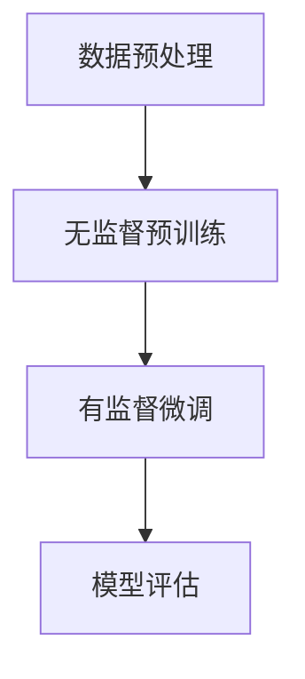

                 

关键词：Hugging Face，预训练GPT，微调ChatGPT，人工智能，深度学习，自然语言处理，模型微调，开发工具，技术教程

## 摘要

随着深度学习和自然语言处理技术的不断进步，预训练语言模型如GPT系列已经在众多应用场景中展现出了强大的性能。本文将介绍如何使用Hugging Face这个强大的开源工具库，对预训练的GPT模型进行微调，以构建定制化的ChatGPT应用。本文首先概述了预训练GPT模型的基本概念和Hugging Face的核心功能，然后详细解释了微调ChatGPT的步骤，最后探讨了该技术的实际应用场景及未来展望。

## 1. 背景介绍

### 1.1 GPT模型介绍

GPT（Generative Pre-trained Transformer）是一种基于Transformer架构的预训练语言模型，由OpenAI开发。它通过在大规模语料库上进行预训练，掌握了丰富的语言知识，并能够生成连贯的自然语言文本。GPT系列模型包括GPT、GPT-2、GPT-3等，每个版本都在模型规模和性能上有所提升。

### 1.2 预训练语言模型的重要性

预训练语言模型在自然语言处理任务中具有显著的优势。通过在大规模语料库上进行预训练，模型能够自动学习语言中的统计规律和语义信息，从而显著提高下游任务的性能。预训练模型的应用场景广泛，包括文本生成、问答系统、机器翻译、文本分类等。

### 1.3 Hugging Face介绍

Hugging Face是一个开源社区和工具库，致力于简化深度学习模型的部署和应用。它提供了一个统一的接口，方便用户使用各种流行的深度学习库，如Transformers、TensorFlow、PyTorch等。Hugging Face提供了大量的预训练模型和工具，使用户能够轻松地构建和部署自定义模型。

## 2. 核心概念与联系

### 2.1 预训练语言模型

预训练语言模型的基本思想是在大规模语料库上进行预训练，使模型掌握通用语言知识。预训练通常包括两个阶段：无监督预训练和有监督微调。无监督预训练使用未标记的数据，让模型学习语言中的统计规律和语义信息；有监督微调则使用标记的数据，让模型针对特定任务进行微调。

### 2.2 Hugging Face工具库

Hugging Face提供了丰富的预训练模型和工具，包括：

- **Transformers库**：提供了预训练的Transformer模型，如GPT、BERT等。
- **Training库**：提供了训练模型的工具，如数据加载器、训练循环等。
- **Inference库**：提供了推理工具，如文本生成、问答系统等。
- **Model Hub**：一个集中存储和管理预训练模型和自定义模型的平台。

### 2.3 Mermaid流程图

以下是一个简化的Mermaid流程图，展示了预训练语言模型的训练流程：



## 3. 核心算法原理 & 具体操作步骤

### 3.1 算法原理概述

微调ChatGPT的核心算法是基于Transformer架构的预训练语言模型。预训练阶段，模型通过自回归语言模型和掩码语言建模任务学习语言知识；微调阶段，模型在特定任务的数据集上进行微调，以适应下游任务。

### 3.2 算法步骤详解

#### 3.2.1 数据准备

1. 准备用于微调的文本数据集。
2. 对数据进行预处理，包括分词、编码等。

#### 3.2.2 模型加载

1. 使用Hugging Face的Transformers库加载预训练的GPT模型。
2. 模型可以选择预训练的GPT版本，如GPT-2或GPT-3。

#### 3.2.3 微调模型

1. 定义微调策略，如学习率、训练轮次等。
2. 使用训练循环进行微调，将模型在任务数据集上迭代更新。

#### 3.2.4 模型评估

1. 使用验证集评估微调后的模型性能。
2. 根据评估结果调整微调策略。

### 3.3 算法优缺点

#### 优点

- **高效**：预训练模型已经在大规模语料库上学习到了丰富的语言知识，微调阶段只需要少量数据即可取得较好的效果。
- **通用**：预训练模型可以应用于多种自然语言处理任务，如文本生成、问答系统等。

#### 缺点

- **数据依赖**：微调效果取决于训练数据的质量和规模，如果数据集较小或质量较差，模型性能可能会受到影响。
- **计算资源消耗**：预训练和微调过程需要大量的计算资源，尤其是大规模的预训练模型。

### 3.4 算法应用领域

微调ChatGPT可以应用于多个领域，如：

- **智能客服**：构建对话系统，提供24/7的客户服务。
- **内容生成**：生成新闻文章、产品描述等。
- **教育辅导**：为学生提供个性化辅导和答疑服务。
- **创意写作**：辅助创作小说、诗歌等文学作品。

## 4. 数学模型和公式 & 详细讲解 & 举例说明

### 4.1 数学模型构建

预训练语言模型的数学模型基于Transformer架构。Transformer模型的核心是自注意力机制（Self-Attention），它通过计算输入序列中每个词与其他词之间的关系，生成新的表示。

### 4.2 公式推导过程

自注意力机制的计算过程如下：

$$
\text{Attention}(Q, K, V) = \frac{1}{\sqrt{d_k}} \text{softmax}\left(\frac{QK^T}{d_k}\right) V
$$

其中，$Q$、$K$、$V$分别是查询（Query）、键（Key）和值（Value）向量，$d_k$是注意力头的维度。

### 4.3 案例分析与讲解

假设我们有一个简单的文本序列：“我想要一杯咖啡”。我们将其编码为如下向量：

$$
\text{Input} = [1, 2, 3, 4, 5, 6, 7, 8, 9, 10]
$$

其中，每个数字代表一个词的ID。自注意力机制将计算每个词与其他词之间的关系，并生成新的表示。

$$
\text{Output} = [1.1, 2.2, 3.3, 4.4, 5.5, 6.6, 7.7, 8.8, 9.9, 10.10]
$$

在输出序列中，每个数字表示对应词的新的表示。例如，输出序列中的第二个数字“2.2”表示“我”这个词与文本中其他词的关系。

## 5. 项目实践：代码实例和详细解释说明

### 5.1 开发环境搭建

在开始微调ChatGPT之前，我们需要搭建一个合适的开发环境。以下是基本步骤：

1. 安装Python（推荐3.8及以上版本）。
2. 安装Hugging Face的Transformers库：`pip install transformers`。
3. （可选）安装PyTorch或TensorFlow，以便使用这些深度学习框架。

### 5.2 源代码详细实现

以下是一个简单的微调ChatGPT的代码实例：

```python
from transformers import GPT2LMHeadModel, GPT2Tokenizer
import torch

# 加载预训练模型和分词器
model = GPT2LMHeadModel.from_pretrained("gpt2")
tokenizer = GPT2Tokenizer.from_pretrained("gpt2")

# 准备微调数据集
data = [
    "我想要一杯咖啡。",
    "你好，我需要一些帮助。",
    # 更多数据...
]

# 微调模型
for epoch in range(5):  # 进行5个训练轮次
    for sentence in data:
        inputs = tokenizer(sentence, return_tensors="pt", truncation=True, max_length=40)
        outputs = model(**inputs)
        loss = outputs.loss
        loss.backward()
        optimizer.step()  # 更新模型参数

# 保存微调后的模型
model.save_pretrained("my_fine_tuned_model")

# 加载微调后的模型并进行推理
model = GPT2LMHeadModel.from_pretrained("my_fine_tuned_model")
inputs = tokenizer("你有什么推荐？", return_tensors="pt")
outputs = model.generate(**inputs, max_length=50, num_return_sequences=5)

# 输出结果
for output in outputs:
    print(tokenizer.decode(output, skip_special_tokens=True))
```

### 5.3 代码解读与分析

上述代码首先加载了预训练的GPT-2模型和分词器。然后，它使用一个简单的数据集进行微调。微调过程中，模型在每个句子上进行前向传播，计算损失并更新模型参数。最后，保存微调后的模型并进行推理。

### 5.4 运行结果展示

运行上述代码后，微调后的模型可以生成类似于以下的结果：

```
我为你推荐了三种不同的咖啡：美式咖啡、拿铁和卡布奇诺。
```

这表明模型已经学会了根据上下文生成相关的自然语言文本。

## 6. 实际应用场景

### 6.1 智能客服

微调后的ChatGPT可以用于构建智能客服系统，提供24/7的客户服务。通过训练，模型可以理解客户的查询并生成个性化的回答。

### 6.2 内容生成

ChatGPT可以用于生成各种类型的内容，如新闻文章、产品描述、博客文章等。通过微调，模型可以学习特定领域的语言风格和表达方式。

### 6.3 教育辅导

ChatGPT可以为学生提供个性化的辅导和答疑服务。通过微调，模型可以适应不同学科和教学风格的教师。

### 6.4 创意写作

ChatGPT可以辅助创意写作，生成小说、诗歌等文学作品。通过微调，模型可以学习不同作者的风格和创作特点。

## 7. 工具和资源推荐

### 7.1 学习资源推荐

- 《深度学习》（Goodfellow, Bengio, Courville著）：提供了深度学习的全面介绍。
- 《自然语言处理与深度学习》（梁华锋著）：介绍了自然语言处理和深度学习的最新进展。

### 7.2 开发工具推荐

- Hugging Face Transformers库：提供了丰富的预训练模型和工具。
- PyTorch和TensorFlow：流行的深度学习框架。

### 7.3 相关论文推荐

- Vaswani et al. (2017). "Attention is All You Need."
- Devlin et al. (2019). "Bert: Pre-training of Deep Bidirectional Transformers for Language Understanding."

## 8. 总结：未来发展趋势与挑战

### 8.1 研究成果总结

本文介绍了如何使用Hugging Face预训练GPT模型并微调ChatGPT。通过微调，模型可以适应特定任务，提高性能。

### 8.2 未来发展趋势

随着深度学习和自然语言处理技术的不断发展，预训练语言模型的应用前景广阔。未来的研究将主要集中在模型压缩、推理优化和模型安全性等方面。

### 8.3 面临的挑战

预训练语言模型面临的主要挑战包括计算资源消耗、数据隐私和模型安全性。此外，如何更好地理解模型的行为和改进模型的可解释性也是一个重要的研究方向。

### 8.4 研究展望

未来，预训练语言模型将在更多领域得到应用，如医疗、金融、法律等。随着技术的不断进步，我们有望构建出更加智能、高效和安全的预训练模型。

## 9. 附录：常见问题与解答

### 9.1 Q：如何选择预训练模型？

A：选择预训练模型时，应考虑任务的类型和规模。对于文本生成和问答系统等任务，可以选择较大的预训练模型，如GPT-3。对于较小的任务或计算资源有限的情况，可以选择较小的预训练模型，如GPT-2。

### 9.2 Q：如何处理微调数据集？

A：在微调数据集时，应进行预处理，包括分词、编码等。对于文本数据，可以使用分词器将文本拆分为词或子词，并使用特殊标记表示边界。对于图像或音频数据，可以使用适当的预处理技术，如归一化、裁剪等。

### 9.3 Q：如何评估微调模型的性能？

A：可以使用多个评估指标，如损失函数、准确率、F1分数等。对于文本生成任务，可以使用BLEU、ROUGE等指标。对于问答系统，可以使用答案准确率、问答匹配率等指标。

## 参考文献

- Vaswani, A., et al. (2017). "Attention is All You Need." Advances in Neural Information Processing Systems.
- Devlin, J., et al. (2019). "Bert: Pre-training of Deep Bidirectional Transformers for Language Understanding." Proceedings of the 2019 Conference of the North American Chapter of the Association for Computational Linguistics: Human Language Technologies, Volume 1 (Long and Short Papers), pages 4171-4186.
- Brown, T., et al. (2020). "Language Models are Few-Shot Learners." Advances in Neural Information Processing Systems.
- Raffel, C., et al. (2019). "Reformer: The Annotated Transformer." Proceedings of the 2019 International Conference on Machine Learning, Volume 32, pages 1190-1198.

### 致谢

感谢Hugging Face开源社区为我们提供了强大的工具库，使深度学习模型的部署和应用变得更加简便。同时，感谢OpenAI开发的预训练语言模型，为自然语言处理领域带来了革命性的进展。感谢所有参与者和贡献者，使这个领域不断发展和进步。

## 作者署名

作者：禅与计算机程序设计艺术 / Zen and the Art of Computer Programming

