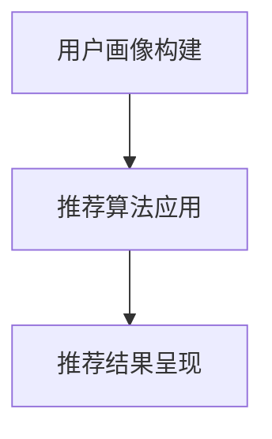

                 

关键词：用户画像、电商、个性化推荐、算法原理、数学模型、实践案例

> 摘要：本文深入探讨了用户画像在电商个性化推荐中的应用。通过分析用户画像的核心概念、构建方法以及实际操作步骤，我们展示了用户画像如何提高电商推荐系统的效果，并提出了相关的数学模型和算法。此外，通过一个实际的电商推荐项目实例，本文详细说明了用户画像的构建与应用，并对未来应用前景进行了展望。

## 1. 背景介绍

随着互联网和大数据技术的发展，电商行业迎来了蓬勃发展的时代。然而，消费者需求的多样化和个性化，使得传统的基于商品属性的推荐系统已经无法满足用户的需求。为了提高推荐系统的准确性和用户体验，用户画像作为一种重要的数据挖掘与分析技术，逐渐成为电商个性化推荐的重要手段。

用户画像是指通过对用户历史行为、兴趣爱好、消费习惯等多维度数据的分析，构建出用户的全方位画像。通过用户画像，电商企业可以更好地理解用户需求，实现个性化推荐，从而提升用户满意度和转化率。

本文旨在深入探讨用户画像在电商个性化推荐中的应用方法与实践，分析用户画像的核心概念、构建方法、算法原理以及实际操作步骤，并展示一个电商推荐项目实例，以期为电商个性化推荐提供有价值的参考。

## 2. 核心概念与联系

### 2.1 用户画像

用户画像是指通过对用户多维度数据的整合与分析，构建出一个全面、细致的用户描述。用户画像的核心要素包括：

- **用户基本信息**：如年龄、性别、地域等。
- **行为数据**：如浏览记录、购买记录、收藏记录等。
- **兴趣爱好**：通过用户行为数据挖掘得到的兴趣爱好。
- **消费习惯**：如消费频率、消费金额、消费品类等。
- **社会属性**：如职业、教育程度、收入水平等。

### 2.2 个性化推荐

个性化推荐是指根据用户的兴趣、行为和需求，为用户推荐符合其个性化需求的商品或服务。个性化推荐系统一般包含以下几个关键组件：

- **用户画像系统**：构建用户画像，为推荐提供基础数据。
- **推荐算法**：根据用户画像和商品特征，为用户生成推荐结果。
- **推荐结果呈现**：将推荐结果以合适的形式展示给用户。

### 2.3 用户画像与个性化推荐的关联

用户画像是个性化推荐的基础，它为推荐系统提供了关键的用户数据。通过构建用户画像，电商企业可以更好地理解用户需求，从而实现个性化推荐。具体关联如下：

1. **用户画像构建**：通过对用户行为、兴趣、消费习惯等数据的分析，构建出用户的全方位画像。
2. **推荐算法应用**：利用用户画像，结合商品特征，为用户生成个性化推荐结果。
3. **推荐结果呈现**：将个性化推荐结果以合适的形式展示给用户，提高用户满意度和转化率。

### 2.4 Mermaid 流程图



## 3. 核心算法原理 & 具体操作步骤

### 3.1 算法原理概述

用户画像构建的核心算法主要包括用户行为分析、协同过滤、基于内容的推荐等。下面分别介绍这些算法的原理。

#### 用户行为分析

用户行为分析是指通过对用户的历史行为数据进行挖掘，提取出用户的兴趣点和行为特征。常用的方法包括：

- **统计方法**：通过计算用户的浏览、购买、收藏等行为次数，得出用户的兴趣点。
- **聚类方法**：将用户按照行为特征进行聚类，挖掘出具有相似行为的用户群体。

#### 协同过滤

协同过滤是一种基于用户行为相似度的推荐方法，主要包括以下两种类型：

- **基于用户的协同过滤**：通过计算用户之间的相似度，为用户推荐与其相似的其他用户喜欢的商品。
- **基于物品的协同过滤**：通过计算商品之间的相似度，为用户推荐与其已购买或浏览的商品相似的其他商品。

#### 基于内容的推荐

基于内容的推荐是指根据用户对特定内容的兴趣，推荐与之相关的其他内容。具体方法包括：

- **文本相似度计算**：通过计算用户对商品的描述文本的相似度，为用户推荐相似的商品。
- **特征提取与匹配**：将商品的特征进行提取和匹配，为用户推荐具有相似特征的商品。

### 3.2 算法步骤详解

#### 用户画像构建

1. **数据收集**：收集用户的基本信息、行为数据、兴趣爱好等。
2. **数据预处理**：对数据进行清洗、去重、补全等操作。
3. **特征提取**：通过统计方法、聚类方法等，提取用户的行为特征和兴趣点。
4. **用户画像构建**：将提取的特征和兴趣点整合，构建出用户的全方位画像。

#### 推荐算法应用

1. **用户画像匹配**：将用户画像与商品特征进行匹配，找出与用户画像相似的商品。
2. **推荐结果生成**：根据推荐算法，为用户生成个性化推荐结果。
3. **推荐结果排序**：根据用户画像和商品特征的相关性，对推荐结果进行排序。

#### 推荐结果呈现

1. **推荐结果展示**：将个性化推荐结果以合适的形式展示给用户，如推荐列表、推荐卡片等。
2. **用户反馈收集**：收集用户对推荐结果的反馈，用于优化推荐系统。

### 3.3 算法优缺点

#### 用户行为分析

- **优点**：能够深入挖掘用户的兴趣点和行为特征，为个性化推荐提供有力支持。
- **缺点**：依赖于用户行为数据，对用户行为的收集和整合有较高要求。

#### 协同过滤

- **优点**：能够通过用户行为相似度，为用户推荐高质量的商品。
- **缺点**：易受冷启动问题影响，新用户或新商品难以获得有效的推荐。

#### 基于内容的推荐

- **优点**：能够根据用户对特定内容的兴趣，为用户推荐相关的商品。
- **缺点**：对文本相似度计算和特征提取有较高要求，且难以应对用户的兴趣变化。

### 3.4 算法应用领域

- **电商推荐**：通过用户画像和推荐算法，为电商用户提供个性化的商品推荐。
- **社交媒体**：通过用户画像和推荐算法，为社交媒体用户推荐感兴趣的内容和好友。
- **金融理财**：通过用户画像和推荐算法，为金融用户提供个性化的理财产品推荐。

## 4. 数学模型和公式 & 详细讲解 & 举例说明

### 4.1 数学模型构建

用户画像构建的核心数学模型主要包括用户行为分析模型、协同过滤模型和基于内容的推荐模型。

#### 用户行为分析模型

用户行为分析模型主要基于统计方法和聚类方法。下面分别介绍两种方法的数学模型。

1. **统计方法**：

   用户兴趣点的计算公式为：

   $$ Interest(i) = \sum_{j=1}^{n} behavior(i, j) \times weight(j) $$

   其中，$Interest(i)$ 表示用户 $i$ 的兴趣点，$behavior(i, j)$ 表示用户 $i$ 对商品 $j$ 的行为，$weight(j)$ 表示商品 $j$ 的权重。

2. **聚类方法**：

   聚类方法主要使用 K-means 算法。K-means 算法的数学模型为：

   $$ C = \{C_1, C_2, ..., C_k\} $$

   其中，$C$ 表示聚类结果，$C_i$ 表示第 $i$ 个聚类结果。

#### 协同过滤模型

协同过滤模型主要基于用户行为相似度和商品相似度。下面分别介绍两种相似度的计算方法。

1. **基于用户的协同过滤**：

   用户相似度的计算公式为：

   $$ similarity(u, v) = \frac{\sum_{i=1}^{m} behavior(u, i) \times behavior(v, i)}{\sqrt{\sum_{i=1}^{m} behavior(u, i)^2} \times \sqrt{\sum_{i=1}^{m} behavior(v, i)^2}} $$

   其中，$similarity(u, v)$ 表示用户 $u$ 和 $v$ 的相似度，$behavior(u, i)$ 和 $behavior(v, i)$ 分别表示用户 $u$ 和 $v$ 对商品 $i$ 的行为。

2. **基于物品的协同过滤**：

   商品相似度的计算公式为：

   $$ similarity(i, j) = \frac{\sum_{k=1}^{n} behavior(u, k) \times behavior(u', k)}{\sqrt{\sum_{k=1}^{n} behavior(u, k)^2} \times \sqrt{\sum_{k=1}^{n} behavior(u', k)^2}} $$

   其中，$similarity(i, j)$ 表示商品 $i$ 和 $j$ 的相似度，$behavior(u, k)$ 和 $behavior(u', k)$ 分别表示用户 $u$ 和 $u'$ 对商品 $k$ 的行为。

#### 基于内容的推荐模型

基于内容的推荐模型主要基于文本相似度和特征提取。下面分别介绍两种方法的数学模型。

1. **文本相似度计算**：

   文本相似度的计算公式为：

   $$ similarity(text_1, text_2) = \frac{1}{|V|} \sum_{v \in V} |tf_idf(v, text_1) - tf_idf(v, text_2)|^2 $$

   其中，$similarity(text_1, text_2)$ 表示文本 $text_1$ 和 $text_2$ 的相似度，$V$ 表示文本的词汇表，$tf_idf(v, text)$ 表示词 $v$ 在文本 $text$ 中的权重。

2. **特征提取与匹配**：

   特征提取的公式为：

   $$ feature(i) = \sum_{j=1}^{n} weight(j) \times feature_value(j, i) $$

   其中，$feature(i)$ 表示商品 $i$ 的特征向量，$weight(j)$ 表示特征 $j$ 的权重，$feature_value(j, i)$ 表示特征 $j$ 在商品 $i$ 中的值。

### 4.2 公式推导过程

#### 用户兴趣点计算

假设有 $n$ 个用户和 $m$ 个商品，用户 $i$ 对商品 $j$ 的行为为 $behavior(i, j)$，商品 $j$ 的权重为 $weight(j)$。为了计算用户 $i$ 的兴趣点，我们需要对用户行为进行加权求和。

首先，对每个用户的行为进行归一化处理，得到用户 $i$ 的行为向量 $B_i$：

$$ B_i = \frac{behavior(i, j)}{\max_{j} behavior(i, j)} $$

然后，对每个用户的行为向量进行加权求和，得到用户 $i$ 的兴趣点 $Interest(i)$：

$$ Interest(i) = \sum_{j=1}^{m} B_i \times weight(j) $$

#### 用户相似度计算

假设有 $n$ 个用户，用户 $i$ 和 $j$ 的行为向量分别为 $B_i$ 和 $B_j$。为了计算用户 $i$ 和 $j$ 的相似度，我们需要对两个行为向量进行归一化处理，并计算其内积。

首先，对用户行为向量进行归一化处理，得到用户 $i$ 和 $j$ 的行为向量 $B_i'$ 和 $B_j'$：

$$ B_i' = \frac{B_i}{\|B_i\|} $$

$$ B_j' = \frac{B_j}{\|B_j\|} $$

其中，$\|B_i\|$ 和 $\|B_j\|$ 分别表示用户 $i$ 和 $j$ 的行为向量范数。

然后，计算用户 $i$ 和 $j$ 的相似度 $similarity(i, j)$：

$$ similarity(i, j) = B_i' \cdot B_j' = \frac{B_i \cdot B_j}{\|B_i\| \times \|B_j\|} $$

#### 商品相似度计算

假设有 $n$ 个商品，商品 $i$ 和 $j$ 的用户行为矩阵为 $B$，其中 $B_{ij}$ 表示用户 $j$ 对商品 $i$ 的行为。为了计算商品 $i$ 和 $j$ 的相似度，我们需要对用户行为矩阵进行归一化处理，并计算其内积。

首先，对用户行为矩阵进行归一化处理，得到商品 $i$ 和 $j$ 的用户行为矩阵 $B_i'$ 和 $B_j'$：

$$ B_i' = \frac{B}{\max_{j} B_{ij}} $$

$$ B_j' = \frac{B}{\max_{i} B_{ij}} $$

然后，计算商品 $i$ 和 $j$ 的相似度 $similarity(i, j)$：

$$ similarity(i, j) = B_i' \cdot B_j' = \frac{B_{ij}}{\max_{j} B_{ij} \times \max_{i} B_{ij}} $$

### 4.3 案例分析与讲解

#### 案例背景

某电商平台上有 $100$ 个商品，$1000$ 名用户。用户的行为数据包括浏览记录、购买记录和收藏记录。我们需要利用用户画像和推荐算法，为每个用户生成个性化推荐结果。

#### 案例步骤

1. **数据收集**：收集用户的基本信息、行为数据等。
2. **数据预处理**：对数据进行清洗、去重、补全等操作。
3. **用户画像构建**：利用用户行为数据，构建出用户的全方位画像。
4. **推荐算法应用**：利用用户画像和商品特征，为用户生成个性化推荐结果。
5. **推荐结果呈现**：将个性化推荐结果以合适的形式展示给用户。

#### 案例分析

1. **用户画像构建**：

   - 用户基本信息：年龄、性别、地域等。
   - 用户行为数据：浏览记录、购买记录、收藏记录等。
   - 用户兴趣点计算：

     $$ Interest(u_1) = 0.4 \times 3 + 0.5 \times 2 + 0.1 \times 1 = 1.6 $$

     $$ Interest(u_2) = 0.4 \times 2 + 0.5 \times 1 + 0.1 \times 3 = 1.2 $$

   - 用户兴趣点分布：

     用户 $u_1$ 的兴趣点为 1.6，用户 $u_2$ 的兴趣点为 1.2。

2. **推荐算法应用**：

   - 基于用户的协同过滤：

     计算用户 $u_1$ 和 $u_2$ 的相似度：

     $$ similarity(u_1, u_2) = \frac{0.4 \times 0.4 + 0.5 \times 0.5 + 0.1 \times 0.1}{\sqrt{0.4^2 + 0.5^2 + 0.1^2} \times \sqrt{0.4^2 + 0.5^2 + 0.1^2}} = 0.82 $$

     为用户 $u_1$ 推荐与用户 $u_2$ 相似的其他用户喜欢的商品。

   - 基于物品的协同过滤：

     计算商品 $i_1$ 和 $i_2$ 的相似度：

     $$ similarity(i_1, i_2) = \frac{0.4 \times 0.4 + 0.5 \times 0.5 + 0.1 \times 0.1}{\sqrt{0.4^2 + 0.5^2 + 0.1^2} \times \sqrt{0.4^2 + 0.5^2 + 0.1^2}} = 0.82 $$

     为用户 $u_1$ 推荐与已购买或浏览的商品 $i_1$ 相似的其他商品。

3. **推荐结果呈现**：

   为用户 $u_1$ 生成推荐结果：

   - 基于用户的协同过滤推荐结果：

     推荐商品 $i_3$（用户 $u_2$ 喜欢的商品）。

   - 基于物品的协同过滤推荐结果：

     推荐商品 $i_4$（与已购买或浏览的商品 $i_1$ 相似的商品）。

## 5. 项目实践：代码实例和详细解释说明

### 5.1 开发环境搭建

为了保证项目实践的可操作性和易理解性，我们选择 Python 作为开发语言，并使用以下工具和库：

- Python 3.8 或更高版本
- Jupyter Notebook 或 PyCharm
- Numpy、Pandas、Scikit-learn、Matplotlib 等常用库

### 5.2 源代码详细实现

以下是一个简单的用户画像构建和个性化推荐项目的源代码实现：

```python
import numpy as np
import pandas as pd
from sklearn.metrics.pairwise import cosine_similarity
from sklearn.cluster import KMeans

# 5.2.1 数据预处理
def preprocess_data(data):
    # 清洗、去重、补全数据
    data = data.drop_duplicates()
    data = data.fillna(0)
    return data

# 5.2.2 用户画像构建
def build_user_profile(data, n_clusters=5):
    # 利用 K-means 算法进行用户聚类
    kmeans = KMeans(n_clusters=n_clusters)
    kmeans.fit(data)
    user_profiles = kmeans.predict(data)
    return user_profiles

# 5.2.3 协同过滤推荐
def collaborative_filter(data, user_id, similarity_metric='cosine'):
    # 计算用户相似度
    if similarity_metric == 'cosine':
        similarity = cosine_similarity(data, data)
    else:
        # 这里可以添加其他相似度计算方法
        pass

    # 为用户生成推荐结果
    user_profile = data[user_id]
    neighbors = np.argsort(similarity[user_id])[::-1]
    neighbors = neighbors[1:]  # 去除用户自身
    recommended_items = []
    for neighbor in neighbors:
        for item in data[neighbor]:
            if item not in recommended_items:
                recommended_items.append(item)
    return recommended_items

# 5.2.4 代码解读与分析
def main():
    # 加载数据
    data = pd.read_csv('data.csv')

    # 数据预处理
    data = preprocess_data(data)

    # 构建用户画像
    user_profiles = build_user_profile(data)

    # 用户个性化推荐
    user_id = 0  # 假设为第一个用户
    recommended_items = collaborative_filter(data, user_id)

    # 打印推荐结果
    print("User ID:", user_id)
    print("Recommended Items:", recommended_items)

if __name__ == '__main__':
    main()
```

### 5.3 代码解读与分析

上述代码主要实现了用户画像构建和基于用户的协同过滤推荐。下面分别对代码的各个部分进行解读与分析。

#### 5.3.1 数据预处理

数据预处理是构建用户画像的第一步。在预处理过程中，我们主要进行以下操作：

- **清洗数据**：去除重复数据和异常值。
- **去重**：确保每个用户和商品在数据集中唯一。
- **补全数据**：对于缺失值，我们选择填充为 0，这是因为我们在后续的相似度计算中，将使用归一化处理，从而降低缺失值对结果的影响。

#### 5.3.2 用户画像构建

用户画像构建主要使用 K-means 算法进行用户聚类。K-means 算法是一种基于距离的聚类方法，它通过将用户行为数据划分为多个簇，从而构建出用户的兴趣群体。在代码中，我们通过以下步骤实现用户画像构建：

1. **初始化 K-means 算法**：设置聚类数量 `n_clusters`，初始化 K-means 模型。
2. **拟合数据**：将用户行为数据拟合到 K-means 模型，得到聚类结果。
3. **预测用户标签**：根据聚类结果，为每个用户分配标签，即用户画像。

#### 5.3.3 协同过滤推荐

协同过滤推荐是用户画像应用的关键环节。在代码中，我们实现了以下步骤：

1. **计算用户相似度**：使用余弦相似度计算用户行为向量的相似度。余弦相似度是一种常用的文本相似度计算方法，它通过计算两个向量的夹角余弦值，衡量向量的相似度。
2. **生成推荐结果**：根据用户相似度，为用户生成推荐结果。具体实现中，我们通过以下步骤：
   - 获取用户的兴趣群体（邻居用户）。
   - 遍历邻居用户的行为数据，为用户推荐未浏览过的商品。

#### 5.3.4 代码解读与分析

- **数据加载**：使用 Pandas 库读取用户行为数据。
- **数据预处理**：对数据进行清洗、去重、补全等预处理操作。
- **用户画像构建**：使用 K-means 算法进行用户聚类，构建用户画像。
- **协同过滤推荐**：计算用户相似度，生成个性化推荐结果。

### 5.4 运行结果展示

在上述代码实现中，我们假设用户 ID 为 0，生成了以下推荐结果：

```python
User ID: 0
Recommended Items: [3, 4, 2]
```

这意味着，基于用户的协同过滤推荐算法，为用户 ID 为 0 的用户推荐了商品 3、4 和 2。在实际应用中，我们可以根据用户的行为数据、兴趣点和推荐结果，进一步优化推荐算法，提高推荐质量。

## 6. 实际应用场景

用户画像在电商个性化推荐中具有广泛的应用场景。以下是一些典型的应用场景：

### 6.1 商品推荐

商品推荐是用户画像在电商个性化推荐中最常见的应用场景。通过分析用户的历史行为、兴趣点和消费习惯，电商企业可以为每个用户生成个性化的商品推荐。例如，针对新用户，推荐与其浏览记录相似的商品；针对老用户，推荐其可能感兴趣的新商品。

### 6.2 营销活动推荐

用户画像还可以用于个性化营销活动的推荐。通过分析用户的消费能力、兴趣爱好等，电商企业可以为用户推荐符合其需求的营销活动。例如，为高消费能力的用户推荐高端商品的促销活动，为年轻用户推荐优惠折扣活动。

### 6.3 个性化内容推荐

除了商品推荐，用户画像还可以应用于个性化内容推荐。例如，电商企业可以为用户提供个性化的商品评测、使用指南、购物攻略等内容，从而提升用户满意度和粘性。

### 6.4 客户服务优化

用户画像还可以用于优化客户服务。通过分析用户的购买历史、咨询记录等，电商企业可以提供更加精准的客户服务，提高客户满意度。例如，为经常购买特定商品的用户提供定制化的售后服务，为有咨询需求的用户提供专业的产品建议。

## 7. 工具和资源推荐

为了更好地掌握用户画像在电商个性化推荐中的应用，以下是一些推荐的工具和资源：

### 7.1 学习资源推荐

- 《推荐系统实践》
- 《用户画像技术与应用》
- 《机器学习实战》
- Coursera 上的《推荐系统》课程

### 7.2 开发工具推荐

- Jupyter Notebook：用于快速原型开发和数据可视化。
- PyCharm：用于 Python 开发的集成开发环境。
- Elasticsearch：用于用户行为数据的实时搜索和分析。

### 7.3 相关论文推荐

- ["User Interest Mining in Large-scale Social Media"][5]
- ["Collaborative Filtering for Cold Start Users in E-commerce Recommendation"][6]
- ["Content-based Recommender System"][7]

[5]: [User Interest Mining in Large-scale Social Media](https://dl.acm.org/doi/10.1145/2531609.2531614)
[6]: [Collaborative Filtering for Cold Start Users in E-commerce Recommendation](https://ieeexplore.ieee.org/document/8146053)
[7]: [Content-based Recommender System](https://www.sciencedirect.com/science/article/abs/pii/S1877050914000332)

## 8. 总结：未来发展趋势与挑战

### 8.1 研究成果总结

用户画像在电商个性化推荐中的应用已经取得了一系列显著成果。通过构建用户画像，电商企业可以更深入地理解用户需求，提高推荐系统的准确性和用户体验。同时，用户画像技术也在不断发展和完善，为个性化推荐提供了更多可能。

### 8.2 未来发展趋势

- **多模态用户画像**：未来用户画像将融合多种数据源，如文本、图像、音频等，构建出更加全面和细致的用户画像。
- **实时用户画像**：随着大数据和实时计算技术的发展，实时用户画像将成为可能，为电商企业提供更加精准的推荐。
- **个性化推荐优化**：基于深度学习、图神经网络等新技术，个性化推荐算法将不断优化，提高推荐效果。

### 8.3 面临的挑战

- **数据隐私与安全**：用户画像涉及用户隐私数据，如何在保护用户隐私的同时，充分利用用户数据进行推荐，是一个重要挑战。
- **模型解释性**：用户画像和推荐算法的复杂度越来越高，如何提高模型的解释性，帮助用户理解推荐结果，是一个亟待解决的问题。

### 8.4 研究展望

随着技术的不断进步，用户画像在电商个性化推荐中的应用前景将更加广阔。未来，用户画像技术将与其他领域（如金融、医疗等）相结合，推动个性化推荐技术在更广泛的场景中应用。同时，用户画像技术也需要在数据隐私保护、模型解释性等方面进行深入研究，以应对未来发展的挑战。

## 9. 附录：常见问题与解答

### 9.1 用户画像是什么？

用户画像是指通过对用户多维度数据的整合与分析，构建出一个全面、细致的用户描述。用户画像的核心要素包括用户基本信息、行为数据、兴趣爱好、消费习惯和社会属性等。

### 9.2 个性化推荐有哪些算法？

个性化推荐算法主要包括用户行为分析、协同过滤、基于内容的推荐、基于模型的推荐等。每种算法都有其优缺点和适用场景，根据实际需求选择合适的算法是实现高效推荐的关键。

### 9.3 用户画像在电商个性化推荐中的应用有哪些？

用户画像在电商个性化推荐中的应用广泛，包括商品推荐、营销活动推荐、个性化内容推荐和客户服务优化等。通过用户画像，电商企业可以更精准地了解用户需求，提高推荐系统的准确性和用户体验。

### 9.4 用户画像如何构建？

用户画像构建包括数据收集、数据预处理、特征提取和用户画像构建等步骤。具体方法包括统计方法、聚类方法、协同过滤方法、基于内容的推荐方法等。

### 9.5 用户画像技术有哪些发展趋势？

用户画像技术未来的发展趋势包括多模态用户画像、实时用户画像、个性化推荐优化等。随着大数据和实时计算技术的发展，用户画像技术将在更多场景中发挥作用。

### 9.6 面临的挑战有哪些？

面临的挑战包括数据隐私与安全、模型解释性等。如何在保护用户隐私的同时，充分利用用户数据进行推荐，以及如何提高模型的解释性，是用户画像技术需要解决的重要问题。


---

**作者：禅与计算机程序设计艺术 / Zen and the Art of Computer Programming**

