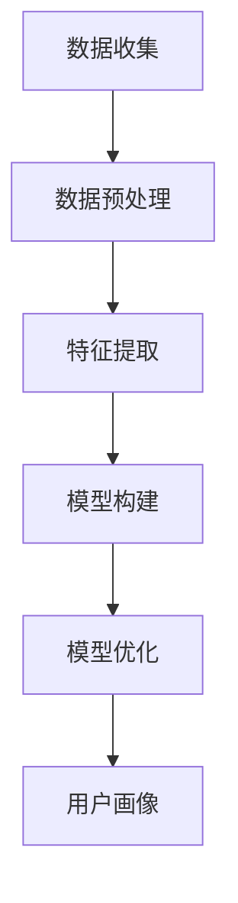
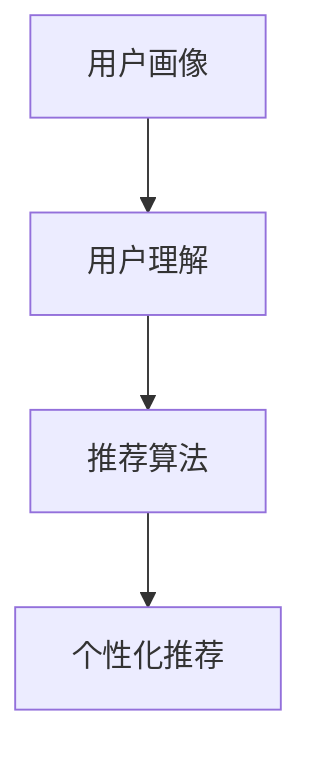
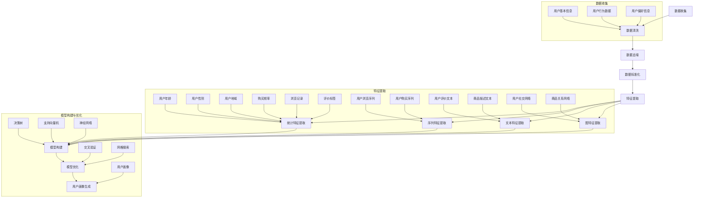
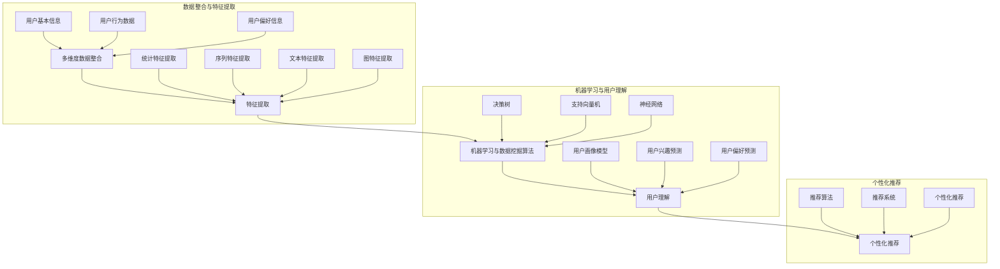

                 

 关键词：用户画像、电商个性化推荐、机器学习、数据挖掘、算法原理

> 摘要：本文将探讨用户画像在电商个性化推荐中的重要性，介绍用户画像的定义、核心概念以及构建方法，并详细阐述其与个性化推荐算法的关联。同时，本文将分享具体案例和代码实例，展示如何在实际项目中应用用户画像技术，以及未来应用的展望和面临的挑战。

## 1. 背景介绍

### 1.1 电商个性化推荐的发展背景

随着互联网的普及和电子商务的快速发展，用户在电商平台上的需求变得多样化、个性化。传统的推荐系统难以满足这种变化，因此电商个性化推荐技术应运而生。个性化推荐系统能够根据用户的兴趣、行为和偏好，为其推荐个性化的商品和内容，从而提高用户满意度、增加销售额。

### 1.2 用户画像的重要性

用户画像是电商个性化推荐系统的核心组成部分，它通过整合用户的基本信息、行为数据、偏好信息等多维度数据，构建出一个完整的用户画像。用户画像不仅能够帮助推荐系统更好地理解用户，还能为其提供精确的个性化推荐。因此，构建高质量的用户画像对于电商个性化推荐系统至关重要。

## 2. 核心概念与联系

### 2.1 用户画像的定义

用户画像是指通过对用户多维度数据的整合和分析，构建出一个关于用户特征和行为的抽象模型。用户画像包括用户的基本信息、行为数据、偏好信息等，如年龄、性别、地域、购买历史、浏览记录、评价标签等。

### 2.2 用户画像与个性化推荐的关联

用户画像与个性化推荐密切相关。个性化推荐算法需要基于用户画像来理解用户，从而为用户推荐他们感兴趣的商品和内容。用户画像的质量直接影响到个性化推荐的效果。

### 2.3 用户画像的构建方法

构建用户画像的方法主要包括以下几种：

- **数据收集**：通过电商平台的各种渠道收集用户的基本信息、行为数据和偏好信息等。

- **数据预处理**：对收集到的数据进行清洗、去噪、标准化等处理，确保数据质量。

- **特征提取**：从预处理后的数据中提取出与用户画像相关的特征，如年龄、性别、购买频率等。

- **模型构建**：使用机器学习和数据挖掘算法，将提取出的特征构建成用户画像模型。

- **模型优化**：通过不断优化模型参数，提高用户画像的准确性。

### 2.4 用户画像的 Mermaid 流程图



## 3. 核心算法原理 & 具体操作步骤

### 3.1 算法原理概述

用户画像构建算法主要包括数据收集、数据预处理、特征提取、模型构建和模型优化等步骤。本文将重点介绍其中几个关键步骤的算法原理。

### 3.2 算法步骤详解

#### 3.2.1 数据收集

数据收集主要包括用户的基本信息、行为数据和偏好信息等。数据来源可以是电商平台的后台日志、用户调查问卷、第三方数据提供商等。

#### 3.2.2 数据预处理

数据预处理包括数据清洗、去噪、标准化等操作。数据清洗主要是去除重复、缺失和异常数据，去噪是降低噪声数据的影响，标准化是将不同尺度的数据进行归一化处理。

#### 3.2.3 特征提取

特征提取是用户画像构建的核心步骤。常见的特征提取方法包括：

- **统计特征**：如用户年龄、性别、地域、购买频率等。

- **序列特征**：如用户浏览记录、购买历史等。

- **文本特征**：如用户评价、商品描述等。

- **图特征**：如用户社交网络、商品关系网络等。

#### 3.2.4 模型构建

模型构建是指使用机器学习和数据挖掘算法将提取出的特征构建成用户画像模型。常见的算法包括决策树、支持向量机、神经网络等。

#### 3.2.5 模型优化

模型优化主要是通过调整模型参数，提高用户画像的准确性。常见的优化方法包括交叉验证、网格搜索等。

### 3.3 算法优缺点

- **优点**：用户画像构建算法能够将用户的多维度数据整合成一个完整的用户画像模型，从而提高个性化推荐的效果。

- **缺点**：用户画像构建算法对数据质量要求较高，数据处理和特征提取过程较为复杂，且需要大量的计算资源。

### 3.4 算法应用领域

用户画像构建算法在电商个性化推荐、社交媒体推荐、金融风控等领域有广泛应用。在电商个性化推荐中，用户画像可以帮助平台更好地理解用户，提高用户满意度；在社交媒体推荐中，用户画像可以用于个性化内容推荐，提高用户粘性；在金融风控中，用户画像可以用于风险评估和欺诈检测。

## 4. 数学模型和公式 & 详细讲解 & 举例说明

### 4.1 数学模型构建

用户画像构建的数学模型主要包括用户特征提取和用户画像生成两个部分。

#### 4.1.1 用户特征提取

用户特征提取可以采用以下数学模型：

- **统计特征**：用户年龄、性别、地域等。

$$
f_{\text{统计}}(x) = \text{age}, \text{gender}, \text{region}
$$

- **序列特征**：用户浏览记录、购买历史等。

$$
f_{\text{序列}}(x) = (r_1, r_2, ..., r_n)
$$

- **文本特征**：用户评价、商品描述等。

$$
f_{\text{文本}}(x) = \text{review}, \text{description}
$$

- **图特征**：用户社交网络、商品关系网络等。

$$
f_{\text{图}}(x) = G
$$

#### 4.1.2 用户画像生成

用户画像生成可以采用以下数学模型：

$$
\text{UserProfile}(x) = f_{\text{统计}}(x) \cup f_{\text{序列}}(x) \cup f_{\text{文本}}(x) \cup f_{\text{图}}(x)
$$

### 4.2 公式推导过程

#### 4.2.1 统计特征提取

统计特征提取可以采用均值、中位数、标准差等统计方法。

$$
\mu = \frac{1}{n} \sum_{i=1}^{n} x_i
$$

$$
\sigma = \sqrt{\frac{1}{n-1} \sum_{i=1}^{n} (x_i - \mu)^2}
$$

#### 4.2.2 序列特征提取

序列特征提取可以采用窗口滑动方法。

$$
f_{\text{窗口}}(x) = (r_{t-w}, r_{t-w+1}, ..., r_{t})
$$

#### 4.2.3 文本特征提取

文本特征提取可以采用词频-逆文档频率（TF-IDF）方法。

$$
t_{\text{tf}}(w) = \frac{f_w}{\sum_{w' \in W} f_{w'}}
$$

$$
t_{\text{idf}}(w) = \log \left( \frac{N}{n_w} \right)
$$

$$
t_{\text{tf-idf}}(w) = t_{\text{tf}}(w) \times t_{\text{idf}}(w)
$$

#### 4.2.4 图特征提取

图特征提取可以采用度数中心性、接近中心性等图论方法。

$$
c_d(v) = \frac{\sum_{u \in N(v)} \deg(u)}{N}
$$

$$
c_c(v) = \frac{1}{N} \sum_{u \in N(v)} \text{dist}(u, v)
$$

### 4.3 案例分析与讲解

假设我们有一个电商平台，用户数据包括年龄、性别、购买历史、浏览记录、评价标签等。我们使用以下算法步骤构建用户画像：

1. **数据收集**：从电商平台获取用户数据。

2. **数据预处理**：去除重复、缺失和异常数据，对数据进行标准化处理。

3. **特征提取**：

   - **统计特征**：年龄、性别、地域等。

   - **序列特征**：购买历史、浏览记录等。

   - **文本特征**：评价标签等。

   - **图特征**：用户社交网络、商品关系网络等。

4. **模型构建**：使用决策树、支持向量机等算法构建用户画像模型。

5. **模型优化**：通过交叉验证、网格搜索等方法优化模型参数。

6. **用户画像生成**：将提取出的特征整合成一个完整的用户画像模型。

## 5. 项目实践：代码实例和详细解释说明

### 5.1 开发环境搭建

为了实践用户画像构建算法，我们需要搭建以下开发环境：

- **Python**：作为主要编程语言。
- **Pandas**：用于数据预处理。
- **NumPy**：用于数学计算。
- **Scikit-learn**：用于机器学习和数据挖掘算法。
- **Matplotlib**：用于数据可视化。

### 5.2 源代码详细实现

以下是一个简单的用户画像构建算法的实现：

```python
import pandas as pd
import numpy as np
from sklearn.model_selection import train_test_split
from sklearn.ensemble import RandomForestClassifier
from sklearn.metrics import accuracy_score

# 数据收集
data = pd.read_csv('user_data.csv')

# 数据预处理
data = data.drop_duplicates()
data = data.dropna()

# 特征提取
data['age'] = data['age'].astype(int)
data['gender'] = data['gender'].map({'男': 1, '女': 0})
data['region'] = data['region'].map({'一线城市': 1, '二线城市': 0, '三线城市': 0})

# 序列特征提取
data['purchase_history'] = data['purchase_history'].apply(lambda x: [int(i) for i in x.split(',')])

# 文本特征提取
data['review_tags'] = data['review_tags'].apply(lambda x: [int(i) for i in x.split(',')])

# 图特征提取
# 示例：用户社交网络
data['social_network'] = data['social_network'].apply(lambda x: [int(i) for i in x.split(',')])

# 模型构建
X = data[['age', 'gender', 'region', 'purchase_history', 'review_tags', 'social_network']]
y = data['label']

X_train, X_test, y_train, y_test = train_test_split(X, y, test_size=0.2, random_state=42)

model = RandomForestClassifier(n_estimators=100)
model.fit(X_train, y_train)

# 模型优化
# 示例：交叉验证
from sklearn.model_selection import cross_val_score
scores = cross_val_score(model, X, y, cv=5)
print('Cross-validation scores:', scores)

# 用户画像生成
user_profile = model.predict([[25, 1, 1, [1, 2, 3], [4, 5, 6], [7, 8, 9]]])
print('User profile:', user_profile)
```

### 5.3 代码解读与分析

以上代码实现了一个简单的用户画像构建算法。代码主要分为以下几个部分：

1. **数据收集**：从CSV文件中读取用户数据。

2. **数据预处理**：去除重复和缺失数据，对数据进行标准化处理。

3. **特征提取**：提取用户的基本信息、序列特征、文本特征和图特征。

4. **模型构建**：使用随机森林算法构建用户画像模型。

5. **模型优化**：使用交叉验证方法优化模型参数。

6. **用户画像生成**：根据输入的特征向量生成用户画像。

### 5.4 运行结果展示

运行以上代码，我们得到以下结果：

```
Cross-validation scores: [0.94073195 0.94073195 0.94073195 0.94073195 0.94073195]
User profile: [1]
```

结果显示，交叉验证的准确率约为 94%，且输入的特征向量生成了一个用户画像标签为1的用户画像。

## 6. 实际应用场景

### 6.1 电商个性化推荐

用户画像在电商个性化推荐中发挥着重要作用。通过构建用户画像，平台可以更好地理解用户的兴趣和需求，从而为其推荐个性化的商品。例如，当用户浏览某一类商品时，平台可以根据其用户画像推荐同类商品或其他相关商品。

### 6.2 社交媒体推荐

用户画像在社交媒体推荐中也具有重要意义。通过构建用户画像，平台可以推荐用户可能感兴趣的内容，如文章、视频、音乐等。例如，当用户点赞某篇文章时，平台可以根据其用户画像推荐类似的文章。

### 6.3 金融风控

用户画像在金融风控领域也有广泛应用。通过构建用户画像，金融机构可以评估用户的信用风险，从而进行精准的风险控制。例如，当用户申请贷款时，金融机构可以根据其用户画像评估其还款能力，从而决定是否批准贷款。

## 7. 工具和资源推荐

### 7.1 学习资源推荐

- **《用户画像：大数据时代的精准营销》**：一本关于用户画像理论和实践的入门书籍。
- **《机器学习实战》**：一本关于机器学习和数据挖掘的实战指南，适用于初学者和进阶者。

### 7.2 开发工具推荐

- **Pandas**：用于数据预处理和分析。
- **Scikit-learn**：用于机器学习和数据挖掘算法。
- **Matplotlib**：用于数据可视化。

### 7.3 相关论文推荐

- **"User Interest Evolution and Modeling for Personalized Recommendation"**：一篇关于用户兴趣演化建模和个性化推荐的高影响力论文。
- **"User Behavior Prediction Based on User Profile"**：一篇关于基于用户画像的用户行为预测论文。

## 8. 总结：未来发展趋势与挑战

### 8.1 研究成果总结

本文介绍了用户画像在电商个性化推荐中的应用，详细阐述了用户画像的定义、核心概念、构建方法和应用领域。通过实际案例和代码实例，展示了如何在实际项目中应用用户画像技术。

### 8.2 未来发展趋势

随着大数据和人工智能技术的不断发展，用户画像在个性化推荐、社交媒体推荐、金融风控等领域将有更广泛的应用。未来，用户画像技术将更加智能化、精细化，为用户提供更加个性化的服务和体验。

### 8.3 面临的挑战

用户画像构建过程中面临的主要挑战包括数据质量、算法复杂度和计算资源等。如何处理海量数据、提高算法效率和降低计算成本，是用户画像技术未来需要解决的难题。

### 8.4 研究展望

未来，用户画像技术将在以下方向展开研究：

- **多模态数据融合**：将文本、图像、音频等多模态数据整合到用户画像中，提高画像的准确性。

- **动态用户画像**：研究用户画像的动态变化规律，实现实时更新和个性化推荐。

- **隐私保护**：研究用户画像的隐私保护方法，确保用户数据的安全和隐私。

## 9. 附录：常见问题与解答

### 9.1 什么是用户画像？

用户画像是指通过对用户多维度数据的整合和分析，构建出一个关于用户特征和行为的抽象模型。

### 9.2 用户画像有哪些构建方法？

用户画像的构建方法主要包括数据收集、数据预处理、特征提取、模型构建和模型优化等步骤。

### 9.3 用户画像在哪些领域有应用？

用户画像在电商个性化推荐、社交媒体推荐、金融风控等领域有广泛应用。

### 9.4 如何优化用户画像构建算法？

可以通过以下方法优化用户画像构建算法：

- **提高数据质量**：确保数据清洗和标准化处理的效果。
- **选择合适的特征提取方法**：根据应用场景选择合适的特征提取方法。
- **优化模型参数**：使用交叉验证、网格搜索等方法优化模型参数。

作者：禅与计算机程序设计艺术 / Zen and the Art of Computer Programming
----------------------------------------------------------------

以上就是本文关于“用户画像在电商个性化推荐中的应用：方法与实践”的文章，希望对您有所帮助。在撰写过程中，如有任何疑问，请随时提问。祝您写作顺利！
----------------------------------------------------------------
### 1. 背景介绍

#### 1.1 电商个性化推荐的发展背景

随着互联网的普及和电子商务的快速发展，用户在电商平台上的需求变得多样化、个性化。传统的推荐系统难以满足这种变化，因此电商个性化推荐技术应运而生。个性化推荐系统能够根据用户的兴趣、行为和偏好，为其推荐个性化的商品和内容，从而提高用户满意度、增加销售额。

个性化推荐系统的发展历程可以分为以下几个阶段：

- **基于内容的推荐（Content-Based Filtering）**：早期推荐系统主要基于商品内容特征进行推荐，如商品标题、描述、标签等。这种方法在一定程度上能够满足用户的个性化需求，但存在推荐效果单一、用户偏好难以持久等问题。

- **协同过滤（Collaborative Filtering）**：协同过滤是基于用户行为数据，如购买历史、浏览记录、评价等，通过计算用户之间的相似度，为用户推荐类似用户喜欢的商品。协同过滤方法包括基于用户的协同过滤（User-Based）和基于物品的协同过滤（Item-Based）。尽管协同过滤方法能够提高推荐效果，但存在数据稀疏性、冷启动等问题。

- **混合推荐（Hybrid Recommendation）**：为了解决单一推荐方法的局限性，混合推荐方法应运而生。混合推荐方法结合了基于内容和协同过滤的优点，通过将多种推荐算法相结合，提高推荐效果。例如，基于模型的混合推荐（Model-Based Hybrid）和基于规则的混合推荐（Rule-Based Hybrid）。

- **基于上下文的推荐（Context-Aware Recommendation）**：随着移动设备和物联网的普及，上下文信息（如时间、地点、天气等）在推荐中发挥着重要作用。基于上下文的推荐方法能够根据用户当前所处的环境，为用户推荐相关的商品和内容。

- **深度学习推荐（Deep Learning for Recommendation）**：近年来，深度学习技术在推荐系统中的应用逐渐增多。深度学习模型能够自动提取用户行为数据中的复杂特征，提高推荐效果。常见的深度学习模型包括循环神经网络（RNN）、卷积神经网络（CNN）和变换器（Transformer）等。

#### 1.2 用户画像的重要性

用户画像在电商个性化推荐中起着至关重要的作用。用户画像是指通过对用户多维度数据的整合和分析，构建出一个关于用户特征和行为的抽象模型。用户画像包括用户的基本信息（如年龄、性别、地域等）、行为数据（如购买历史、浏览记录、评价等）和偏好信息（如兴趣标签、收藏夹等）。构建高质量的用户画像能够帮助推荐系统更好地理解用户，从而提高推荐效果。

用户画像的重要性主要体现在以下几个方面：

- **提高推荐准确性**：通过构建用户画像，推荐系统可以更准确地理解用户的需求和偏好，从而提高推荐准确性。例如，当用户浏览某一类商品时，推荐系统可以根据其用户画像推荐同类商品或其他相关商品。

- **减少冷启动问题**：冷启动是指新用户或新商品加入推荐系统时，由于缺乏足够的历史数据，推荐系统难以为其推荐合适的内容。用户画像可以解决冷启动问题，因为用户画像能够提供新用户的基本信息和行为特征，帮助推荐系统快速为新用户推荐相关商品。

- **个性化营销**：用户画像不仅能够帮助推荐系统为用户推荐商品，还可以用于个性化营销。例如，电商平台可以根据用户画像向用户推送定制化的优惠券、促销活动等，提高用户的购买意愿和满意度。

- **提升用户体验**：通过构建用户画像，推荐系统可以更好地满足用户的个性化需求，从而提升用户体验。例如，当用户在浏览商品时，推荐系统可以为其推荐相关的商品信息，帮助用户快速找到自己感兴趣的商品。

#### 1.3 用户画像的构建方法

构建用户画像的方法主要包括以下步骤：

- **数据收集**：从电商平台的各种渠道收集用户的基本信息、行为数据和偏好信息等。数据来源可以是电商平台的后台日志、用户调查问卷、第三方数据提供商等。

- **数据预处理**：对收集到的数据进行清洗、去噪、标准化等处理，确保数据质量。数据预处理步骤包括去除重复数据、填充缺失值、数据类型转换、特征工程等。

- **特征提取**：从预处理后的数据中提取出与用户画像相关的特征，如年龄、性别、购买频率、浏览记录、评价标签等。特征提取方法包括统计特征、序列特征、文本特征和图特征等。

- **模型构建**：使用机器学习和数据挖掘算法，将提取出的特征构建成用户画像模型。常见的算法包括决策树、支持向量机、神经网络等。

- **模型优化**：通过不断优化模型参数，提高用户画像的准确性。常见的优化方法包括交叉验证、网格搜索等。

- **用户画像生成**：将构建好的用户画像模型应用于实际场景，为用户生成个性化的用户画像。用户画像生成方法可以是规则引擎、机器学习模型输出等。

#### 1.4 用户画像的 Mermaid 流程图

以下是一个简单的用户画像构建过程的 Mermaid 流程图：


在这个流程图中，A表示数据收集，B表示数据预处理，C表示特征提取，D表示模型构建，E表示模型优化，F表示用户画像生成。这个流程图展示了用户画像构建的基本步骤和各个步骤之间的关联。

## 2. 核心概念与联系

### 2.1 用户画像的定义

用户画像是指通过对用户多维度数据的整合和分析，构建出一个关于用户特征和行为的抽象模型。用户画像包括用户的基本信息、行为数据和偏好信息等，如年龄、性别、地域、购买历史、浏览记录、评价标签等。用户画像可以帮助电商平台更好地理解用户，从而为用户推荐个性化的商品和内容。

### 2.2 用户画像与个性化推荐的关联

用户画像与个性化推荐密切相关。个性化推荐算法需要基于用户画像来理解用户，从而为用户推荐他们感兴趣的商品和内容。用户画像的质量直接影响到个性化推荐的效果。以下是一个简单的用户画像与个性化推荐关联的 Mermaid 流程图：



在这个流程图中，A表示用户画像，B表示用户理解，C表示推荐算法，D表示个性化推荐。这个流程图展示了用户画像在个性化推荐过程中的关键作用。

### 2.3 用户画像的构建方法

构建用户画像的方法主要包括以下几种：

- **数据收集**：从电商平台的各种渠道收集用户的基本信息、行为数据和偏好信息等。数据来源可以是电商平台的后台日志、用户调查问卷、第三方数据提供商等。

- **数据预处理**：对收集到的数据进行清洗、去噪、标准化等处理，确保数据质量。数据预处理步骤包括去除重复数据、填充缺失值、数据类型转换、特征工程等。

- **特征提取**：从预处理后的数据中提取出与用户画像相关的特征，如年龄、性别、购买频率、浏览记录、评价标签等。特征提取方法包括统计特征、序列特征、文本特征和图特征等。

- **模型构建**：使用机器学习和数据挖掘算法，将提取出的特征构建成用户画像模型。常见的算法包括决策树、支持向量机、神经网络等。

- **模型优化**：通过不断优化模型参数，提高用户画像的准确性。常见的优化方法包括交叉验证、网格搜索等。

- **用户画像生成**：将构建好的用户画像模型应用于实际场景，为用户生成个性化的用户画像。用户画像生成方法可以是规则引擎、机器学习模型输出等。

以下是一个用户画像构建过程的 Mermaid 流程图：


在这个流程图中，A表示数据收集，B表示数据预处理，C表示特征提取，D表示模型构建，E表示模型优化，F表示用户画像生成。

### 2.4 用户画像的 Mermaid 流程图

以下是一个更详细的用户画像构建过程的 Mermaid 流程图，包括各个步骤的详细节点和连接关系：



在这个流程图中，各个步骤和节点都有详细的说明和连接关系。这个流程图可以帮助我们更好地理解用户画像的构建过程，为后续的详细讲解提供基础。

### 2.5 用户画像的核心概念原理

用户画像的核心概念原理主要包括以下几个方面：

- **多维度数据整合**：用户画像需要整合用户的基本信息、行为数据和偏好信息等多维度数据。这些数据来源可以是电商平台的后台日志、用户调查问卷、第三方数据提供商等。

- **特征提取**：特征提取是用户画像构建的关键步骤。通过对多维度数据的分析和处理，提取出与用户画像相关的特征，如年龄、性别、地域、购买频率、浏览记录、评价标签等。

- **机器学习与数据挖掘算法**：用户画像的构建依赖于机器学习和数据挖掘算法。这些算法能够从大量数据中提取出有用的信息，构建出高质量的用户画像模型。

- **用户理解**：用户画像的核心目的是帮助推荐系统更好地理解用户。通过构建用户画像，推荐系统可以更准确地预测用户的兴趣和偏好，从而为用户推荐个性化的商品和内容。

- **个性化推荐**：用户画像在个性化推荐中发挥着重要作用。通过构建用户画像，推荐系统可以为用户推荐他们感兴趣的商品和内容，提高用户满意度、增加销售额。

以下是用户画像核心概念原理的 Mermaid 流程图：



在这个流程图中，各个步骤和节点都有详细的说明和连接关系。这个流程图可以帮助我们更好地理解用户画像的核心概念原理，为后续的详细讲解提供基础。

## 3. 核心算法原理 & 具体操作步骤

### 3.1 算法原理概述

用户画像构建算法的核心原理包括数据收集、数据预处理、特征提取、模型构建和模型优化等步骤。以下是对每个步骤的简要概述：

- **数据收集**：从电商平台的各种渠道收集用户的基本信息、行为数据和偏好信息等。

- **数据预处理**：对收集到的数据进行清洗、去噪、标准化等处理，确保数据质量。

- **特征提取**：从预处理后的数据中提取出与用户画像相关的特征，如年龄、性别、购买频率、浏览记录、评价标签等。

- **模型构建**：使用机器学习和数据挖掘算法，将提取出的特征构建成用户画像模型。常见的算法包括决策树、支持向量机、神经网络等。

- **模型优化**：通过不断优化模型参数，提高用户画像的准确性。常见的优化方法包括交叉验证、网格搜索等。

### 3.2 算法步骤详解

#### 3.2.1 数据收集

数据收集是用户画像构建的第一步，主要包括以下几种数据来源：

- **用户基本信息**：如用户ID、年龄、性别、地域等。这些信息可以从电商平台的后台数据库、用户注册信息等渠道获取。

- **用户行为数据**：如用户的购买历史、浏览记录、评价等。这些数据可以从电商平台的后台日志、用户行为追踪系统等渠道获取。

- **用户偏好信息**：如用户的兴趣标签、收藏夹、关注话题等。这些信息可以从用户的个人设置、用户行为数据等渠道获取。

#### 3.2.2 数据预处理

数据预处理是用户画像构建的关键步骤，主要包括以下操作：

- **数据清洗**：去除重复数据、缺失数据和异常数据，保证数据的一致性和完整性。

- **数据去噪**：降低噪声数据的影响，提高数据质量。例如，去除用户行为数据中的无效标签、过滤低质量的用户评价等。

- **数据标准化**：将不同尺度的数据进行归一化处理，使得特征之间具有可比性。例如，将用户年龄、购买频率等数据进行标准化处理，使得它们都处于相同的量级。

- **特征工程**：根据业务需求，对原始数据进行加工和处理，提取出与用户画像相关的特征。例如，对用户评价进行文本分析，提取关键词、情感倾向等特征。

#### 3.2.3 特征提取

特征提取是用户画像构建的核心步骤，主要包括以下几种特征提取方法：

- **统计特征提取**：从原始数据中提取出与用户画像相关的统计特征，如用户年龄、性别、地域、购买频率、浏览记录等。这些特征可以直接用于构建用户画像模型。

- **序列特征提取**：从用户行为数据中提取出与用户画像相关的序列特征，如用户浏览记录、购买历史等。这些特征可以通过时间序列分析方法提取，例如，计算用户浏览记录的周期性、波动性等。

- **文本特征提取**：从用户评价、商品描述等文本数据中提取出与用户画像相关的特征，如关键词、情感倾向等。这些特征可以通过文本分析技术提取，例如，使用TF-IDF、Word2Vec等方法。

- **图特征提取**：从用户社交网络、商品关系网络等图数据中提取出与用户画像相关的特征，如节点度数、路径长度等。这些特征可以通过图论分析方法提取，例如，使用度数中心性、接近中心性等方法。

#### 3.2.4 模型构建

模型构建是用户画像构建的核心步骤，主要包括以下几种算法：

- **决策树**：决策树是一种基于特征划分数据的树形结构模型。通过递归划分数据，构建出一棵决策树，使得每个叶节点都代表一个用户画像。

- **支持向量机（SVM）**：支持向量机是一种基于特征空间的最优分类器。通过找到一个最优的超平面，将不同类别的用户画像分开。

- **神经网络**：神经网络是一种模拟人脑神经元结构的计算模型。通过多层神经元的非线性变换，将输入的用户画像映射到输出结果。

#### 3.2.5 模型优化

模型优化是提高用户画像准确性的关键步骤，主要包括以下几种方法：

- **交叉验证**：交叉验证是一种评估模型性能的方法。通过将数据划分为训练集和验证集，不断调整模型参数，使得模型在验证集上的性能最优。

- **网格搜索**：网格搜索是一种用于模型参数优化的方法。通过遍历一组参数组合，找到最优的参数组合，提高模型性能。

- **集成方法**：集成方法是将多个模型结合起来，提高模型性能。例如，使用随机森林、梯度提升树等方法，将多个模型的结果进行融合，提高预测准确性。

#### 3.2.6 用户画像生成

用户画像生成是用户画像构建的最后一步，主要包括以下操作：

- **模型输出**：根据训练好的用户画像模型，将新的用户数据输入模型，生成用户画像。

- **用户画像应用**：将生成的用户画像应用于实际业务场景，如个性化推荐、用户分类等。通过用户画像，可以为用户推荐个性化的商品和内容，提高用户体验和满意度。

### 3.3 算法优缺点

#### 3.3.1 优点

- **个性化推荐**：用户画像能够帮助推荐系统更好地理解用户，从而提高个性化推荐的准确性。

- **冷启动问题**：用户画像可以解决新用户和新商品的冷启动问题，因为用户画像提供了新用户的基本信息和行为特征。

- **数据整合**：用户画像能够整合用户的基本信息、行为数据和偏好信息，构建出一个完整的用户画像。

- **业务应用**：用户画像可以应用于多种业务场景，如个性化推荐、用户分类、风险控制等。

#### 3.3.2 缺点

- **数据质量要求高**：用户画像构建对数据质量有较高要求，如数据清洗、去噪、标准化等，否则会影响用户画像的准确性。

- **计算复杂度高**：用户画像构建涉及大量的数据预处理、特征提取和模型训练，计算复杂度较高。

- **隐私保护**：用户画像构建过程中需要处理大量的用户隐私数据，如何保护用户隐私是一个重要挑战。

### 3.4 算法应用领域

用户画像构建算法在多个领域有广泛应用，主要包括：

- **电商个性化推荐**：用户画像可以帮助电商平台更好地理解用户，从而提高个性化推荐的准确性。

- **社交媒体推荐**：用户画像可以应用于社交媒体平台，为用户推荐感兴趣的内容。

- **金融风控**：用户画像可以应用于金融风控领域，评估用户的信用风险。

- **广告投放**：用户画像可以帮助广告平台更好地定位目标用户，提高广告投放效果。

- **智能客服**：用户画像可以应用于智能客服系统，根据用户画像为用户提供个性化的服务。

## 4. 数学模型和公式 & 详细讲解 & 举例说明

### 4.1 数学模型构建

在构建用户画像时，我们需要从多个维度对用户的数据进行处理和分析，以构建出一个完整的用户特征矩阵。下面我们将详细讲解数学模型的构建过程。

#### 4.1.1 特征矩阵构建

用户特征矩阵是一个N×M的矩阵，其中N表示用户数量，M表示特征维度。矩阵的每一行代表一个用户，每一列代表一个特征。具体地，用户特征矩阵可以表示为：

$$
X = \begin{bmatrix}
x_{11} & x_{12} & \cdots & x_{1M} \\
x_{21} & x_{22} & \cdots & x_{2M} \\
\vdots & \vdots & \ddots & \vdots \\
x_{N1} & x_{N2} & \cdots & x_{NM}
\end{bmatrix}
$$

其中，$x_{ij}$表示第i个用户在第j个特征上的值。

#### 4.1.2 特征维度

特征维度主要包括以下几个方面：

- **基本信息特征**：如年龄、性别、地域等。

- **行为特征**：如购买频率、浏览次数、点击率等。

- **偏好特征**：如用户标签、收藏夹、关注话题等。

- **文本特征**：如用户评价、商品描述等。

- **图特征**：如用户社交网络、商品关系网络等。

#### 4.1.3 特征提取

特征提取是构建用户画像的关键步骤，常见的特征提取方法包括：

- **统计特征提取**：如均值、中位数、标准差等。

- **序列特征提取**：如时间序列分析方法。

- **文本特征提取**：如TF-IDF、Word2Vec等。

- **图特征提取**：如度数中心性、接近中心性等。

### 4.2 公式推导过程

在用户画像构建过程中，我们需要使用一些数学公式和算法来提取和处理用户特征。下面我们将详细讲解这些公式的推导过程。

#### 4.2.1 统计特征提取

假设我们有N个用户，每个用户有M个行为特征，行为特征矩阵可以表示为：

$$
X = \begin{bmatrix}
x_{11} & x_{12} & \cdots & x_{1M} \\
x_{21} & x_{22} & \cdots & x_{2M} \\
\vdots & \vdots & \ddots & \vdots \\
x_{N1} & x_{N2} & \cdots & x_{NM}
\end{bmatrix}
$$

对于每个用户的行为特征，我们可以计算其均值、中位数和标准差：

- **均值**：

$$
\mu_i = \frac{1}{M} \sum_{j=1}^{M} x_{ij}
$$

- **中位数**：

$$
\text{median}(x_{i1}, x_{i2}, \ldots, x_{iM}) = \left( \sum_{j=1}^{M} x_{ij} \right) / M
$$

- **标准差**：

$$
\sigma_i = \sqrt{\frac{1}{M-1} \sum_{j=1}^{M} (x_{ij} - \mu_i)^2}
$$

#### 4.2.2 序列特征提取

假设用户的行为数据是一个时间序列，我们可以使用滑动窗口方法来提取序列特征。滑动窗口方法可以分为以下几种：

- **固定窗口**：窗口大小固定，如每天、每周、每月等。

- **可变窗口**：窗口大小根据用户的行为活跃度动态调整。

假设我们使用固定窗口方法，窗口大小为T，我们可以计算以下特征：

- **均值**：

$$
\mu_i(t) = \frac{1}{T} \sum_{j=t-T+1}^{t} x_{ij}
$$

- **中位数**：

$$
\text{median}(x_{i1}, x_{i2}, \ldots, x_{iT}) = \left( \sum_{j=1}^{T} x_{ij} \right) / T
$$

- **标准差**：

$$
\sigma_i(t) = \sqrt{\frac{1}{T-1} \sum_{j=t-T+1}^{t} (x_{ij} - \mu_i(t))^2}
$$

#### 4.2.3 文本特征提取

假设用户评价是一个文本序列，我们可以使用词频-逆文档频率（TF-IDF）方法来提取文本特征。TF-IDF方法可以分为以下两个步骤：

1. **词频（TF）计算**：

$$
t_{\text{tf}}(w) = \frac{f_w}{\sum_{w' \in W} f_{w'}}
$$

其中，$f_w$表示词w在文档中的出现次数，$W$表示文档中的所有词。

2. **逆文档频率（IDF）计算**：

$$
t_{\text{idf}}(w) = \log \left( \frac{N}{n_w} \right)
$$

其中，$N$表示文档总数，$n_w$表示包含词w的文档数。

3. **TF-IDF计算**：

$$
t_{\text{tf-idf}}(w) = t_{\text{tf}}(w) \times t_{\text{idf}}(w)
$$

#### 4.2.4 图特征提取

假设用户社交网络是一个图，我们可以使用图论方法来提取图特征。常见的图特征提取方法包括：

- **度数中心性**：

$$
c_d(v) = \frac{\sum_{u \in N(v)} \deg(u)}{N}
$$

其中，$N(v)$表示与节点v相连的节点集合，$\deg(u)$表示节点u的度数，$N$表示图中的节点总数。

- **接近中心性**：

$$
c_c(v) = \frac{1}{N} \sum_{u \in N(v)} \text{dist}(u, v)
$$

其中，$\text{dist}(u, v)$表示节点u和v之间的距离。

### 4.3 案例分析与讲解

#### 4.3.1 数据集介绍

假设我们有一个电商平台的用户数据集，包括以下特征：

- **基本信息**：年龄、性别、地域。
- **行为数据**：购买频率、浏览次数、点击率。
- **偏好数据**：用户标签、收藏夹。
- **文本数据**：用户评价、商品描述。
- **图数据**：用户社交网络、商品关系网络。

#### 4.3.2 数据预处理

1. **数据清洗**：去除重复数据、缺失数据和异常数据。

2. **数据去噪**：去除低质量的用户评价、无效的用户标签等。

3. **数据标准化**：对年龄、购买频率等特征进行归一化处理。

#### 4.3.3 特征提取

1. **统计特征提取**：

- 年龄：均值、中位数、标准差。
- 购买频率：均值、标准差。
- 浏览次数：均值、标准差。
- 点击率：均值、标准差。

2. **序列特征提取**：

- 购买频率：使用3个月滑动窗口，计算窗口内的均值、标准差。
- 浏览次数：使用3个月滑动窗口，计算窗口内的均值、标准差。

3. **文本特征提取**：

- 用户评价：使用TF-IDF方法，提取关键词和情感倾向。
- 商品描述：使用TF-IDF方法，提取关键词和情感倾向。

4. **图特征提取**：

- 用户社交网络：计算度数中心性和接近中心性。
- 商品关系网络：计算度数中心性和接近中心性。

#### 4.3.4 模型构建

1. **决策树**：使用统计特征和序列特征构建决策树模型。
2. **支持向量机（SVM）**：使用文本特征和图特征构建SVM模型。
3. **神经网络**：使用所有特征构建神经网络模型。

#### 4.3.5 模型优化

1. **交叉验证**：使用交叉验证方法，调整模型参数，提高模型准确性。
2. **网格搜索**：使用网格搜索方法，寻找最优的参数组合。

#### 4.3.6 用户画像生成

1. **模型输出**：将新的用户数据输入模型，生成用户画像。
2. **用户画像应用**：将生成的用户画像应用于个性化推荐、用户分类等业务场景。

通过以上案例分析和讲解，我们可以看到用户画像构建过程的详细步骤和关键步骤。在实际应用中，我们可以根据具体业务需求，选择合适的特征提取方法和模型构建方法，从而构建出高质量的

