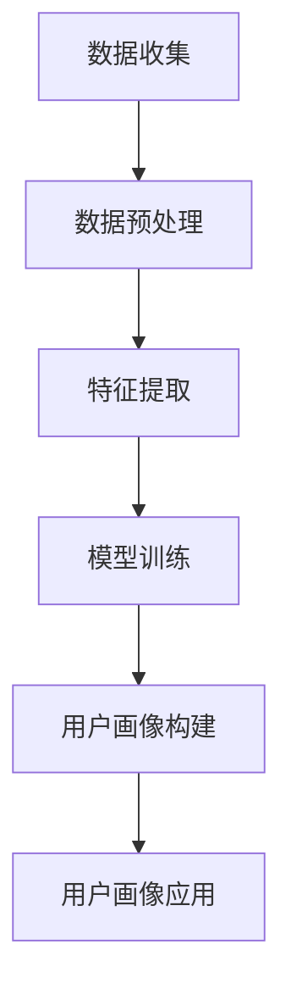

                 

用户画像的构建与优化是大数据和人工智能领域的重要研究方向。它不仅为企业提供精准的市场分析，还能为用户提供个性化的推荐服务。本文将深入探讨用户画像的构建与优化实践，包括核心概念、算法原理、数学模型、项目实践、实际应用场景以及未来展望等。希望通过本文的阅读，读者能够对用户画像有更全面、深入的理解。

## 关键词

用户画像、大数据、人工智能、个性化推荐、机器学习、数学模型、实际应用

## 摘要

本文首先介绍了用户画像的基本概念和重要性，然后详细阐述了用户画像构建的算法原理和具体操作步骤。接着，本文探讨了用户画像的数学模型和公式，并借助实际案例进行了分析和讲解。此外，本文还提供了一个完整的代码实例，以便读者更好地理解用户画像的实现过程。最后，本文探讨了用户画像在实际应用场景中的价值和未来发展的趋势与挑战。

----------------------------------------------------------------
## 1. 背景介绍

在信息化时代，数据已经成为企业的重要资产。用户画像作为一种新兴的数据分析技术，通过对用户行为、兴趣、习惯等多维度数据的挖掘和分析，构建出用户的全面、动态、多维度的画像。用户画像不仅可以帮助企业了解用户需求，还能为企业提供精准的市场分析和决策支持。因此，用户画像的构建与优化成为了大数据和人工智能领域的研究热点。

用户画像的构建主要依赖于以下技术和方法：

- **数据收集与整合**：通过各种渠道收集用户数据，包括用户行为数据、社交媒体数据、购物数据等，并进行整合和处理。

- **特征提取与选择**：从原始数据中提取出有代表性的特征，并进行选择和筛选，以提高用户画像的准确性和效率。

- **机器学习与数据挖掘**：利用机器学习算法和数据分析技术，对用户行为和特征进行建模和分析，以构建出准确的用户画像。

- **实时更新与优化**：用户画像是一个动态的过程，需要不断地更新和优化，以适应用户行为和需求的变化。

本文将围绕用户画像的构建与优化展开讨论，包括核心概念、算法原理、数学模型、项目实践、实际应用场景以及未来展望等。希望通过本文的阅读，读者能够对用户画像有更全面、深入的理解。

----------------------------------------------------------------
## 2. 核心概念与联系

### 2.1 用户画像的定义

用户画像是对一个用户进行全面、多维度的描述，它包括用户的基本信息、行为特征、兴趣偏好、价值属性等多个方面。用户画像的核心目标是通过对用户数据的挖掘和分析，深入了解用户的需求和行为，从而为企业和用户提供个性化的服务和推荐。

### 2.2 用户画像的组成部分

用户画像通常由以下几部分组成：

- **基本信息**：包括用户的年龄、性别、职业、教育程度等基础信息。

- **行为特征**：包括用户在平台上的浏览记录、购买行为、互动行为等。

- **兴趣偏好**：通过对用户行为和社交数据的分析，挖掘出用户的兴趣偏好，如喜欢阅读的书籍、喜欢的电影类型、关注的新闻话题等。

- **价值属性**：根据用户的行为和兴趣，评估用户的价值，如活跃用户、核心用户、潜在客户等。

### 2.3 用户画像的构建方法

用户画像的构建方法可以分为以下几种：

- **基于规则的方法**：通过预定义的规则，将用户的属性和行为进行分类和打分，从而构建出用户画像。

- **基于统计的方法**：利用统计学方法，对用户的属性和行为进行统计和分析，从而构建出用户画像。

- **基于机器学习的方法**：利用机器学习算法，对用户的数据进行建模和分析，从而构建出用户画像。

### 2.4 用户画像的关联关系

用户画像的关联关系主要体现在以下几个方面：

- **用户间关联**：通过用户的共同兴趣、行为等，分析出用户群体和用户之间的关系，如社交网络中的好友关系、兴趣小组等。

- **产品间关联**：通过对用户行为的分析，挖掘出用户对不同产品的兴趣和需求，从而为产品推荐提供支持。

- **场景关联**：通过对用户行为和场景的分析，挖掘出用户在不同场景下的需求和偏好，从而为场景化推荐提供依据。

### 2.5 用户画像的 Mermaid 流程图

下面是用户画像的构建流程的 Mermaid 流程图：



### 2.6 用户画像与相关概念的关联

- **客户画像**：客户画像是对企业客户进行全面描述的画像，包括客户的基本信息、行为特征、价值属性等。

- **消费者画像**：消费者画像是对市场中的消费者进行全面描述的画像，包括消费者的基本信息、消费行为、消费偏好等。

- **用户行为分析**：用户行为分析是通过对用户在平台上的行为数据进行挖掘和分析，了解用户的需求和行为模式。

- **数据挖掘**：数据挖掘是从大量数据中提取出有价值信息的过程，包括关联规则挖掘、分类、聚类等。

- **机器学习**：机器学习是通过训练模型，从数据中自动学习规律和模式的过程，包括监督学习、无监督学习、半监督学习等。

- **个性化推荐**：个性化推荐是根据用户的历史行为和兴趣，为用户推荐其可能感兴趣的商品、内容等。

### 2.7 用户画像的作用和意义

- **提升用户体验**：通过构建用户画像，可以为用户提供个性化的服务，提升用户的满意度和忠诚度。

- **优化市场营销**：通过分析用户画像，可以为企业提供精准的市场营销策略，提高市场推广的效果。

- **提升运营效率**：通过用户画像，可以更好地了解用户需求和行为，从而优化产品设计和运营策略，提升运营效率。

- **决策支持**：用户画像可以为企业的战略决策提供支持，如产品规划、市场定位、客户管理等。

----------------------------------------------------------------
## 3. 核心算法原理 & 具体操作步骤

### 3.1 算法原理概述

用户画像的构建通常依赖于多种算法和技术，其中最核心的算法包括特征提取、聚类分析、分类算法等。以下是这些算法的基本原理：

#### 特征提取

特征提取是用户画像构建的基础，它从原始数据中提取出有代表性的特征，以便进行后续分析和建模。常用的特征提取方法包括：

- **统计特征**：如平均值、标准差、中位数等，用于描述用户数据的统计分布。

- **文本特征**：如词频、词向量、TF-IDF等，用于描述用户在文本数据中的兴趣和偏好。

- **图像特征**：如颜色直方图、纹理特征、形状特征等，用于描述用户在图像数据中的兴趣和偏好。

#### 聚类分析

聚类分析是一种无监督学习方法，它将相似的数据点归为一类，从而形成多个聚类。常用的聚类算法包括：

- **K-means算法**：基于距离度量的聚类算法，将数据点分为K个簇，每个簇的中心是所有点的平均值。

- **层次聚类算法**：基于层次结构的聚类算法，将数据点逐步合并或拆分，形成层次化的聚类结构。

#### 分类算法

分类算法是一种监督学习方法，它通过已知的标注数据训练模型，从而对未知数据进行分类。常用的分类算法包括：

- **决策树**：基于树结构的分类算法，通过一系列规则将数据划分为不同的类别。

- **支持向量机**：基于最大间隔分类器的算法，将数据映射到高维空间，找到最优的分割超平面。

### 3.2 算法步骤详解

#### 3.2.1 数据收集与预处理

1. **数据收集**：通过数据爬取、API接口、用户输入等方式收集用户数据。

2. **数据清洗**：去除重复、错误、缺失的数据，保证数据的准确性和一致性。

3. **数据整合**：将不同来源的数据进行整合，形成统一的数据集。

#### 3.2.2 特征提取

1. **统计特征**：计算用户数据的基本统计特征，如年龄、消费金额、浏览时长等。

2. **文本特征**：使用词频、TF-IDF、Word2Vec等方法提取文本数据中的特征。

3. **图像特征**：使用颜色直方图、纹理特征、形状特征等方法提取图像数据中的特征。

#### 3.2.3 聚类分析

1. **选择聚类算法**：根据数据特点和业务需求选择合适的聚类算法。

2. **初始化聚类中心**：使用随机初始化或已有知识初始化聚类中心。

3. **迭代聚类过程**：计算数据点到聚类中心的距离，调整聚类中心，直到聚类结果收敛。

#### 3.2.4 分类算法

1. **选择分类算法**：根据数据特点和业务需求选择合适的分类算法。

2. **特征选择**：选择对分类有显著影响的特征，提高模型的准确性和效率。

3. **模型训练**：使用已标注的数据训练分类模型。

4. **模型评估**：使用交叉验证等方法评估模型的准确性和泛化能力。

### 3.3 算法优缺点

#### K-means算法

- **优点**：计算简单，易于实现，对大规模数据集有较好的效果。

- **缺点**：对初始聚类中心敏感，可能导致局部最优解；对噪声和离群点敏感。

#### 层次聚类算法

- **优点**：能够提供聚类层次结构，便于理解聚类结果；对初始聚类中心不敏感。

- **缺点**：计算复杂度高，对大规模数据集性能不佳。

#### 决策树

- **优点**：易于理解和解释，对非线性数据有较好的效果。

- **缺点**：对大量特征和高维数据效果不佳，容易过拟合。

#### 支持向量机

- **优点**：在分类任务中有很好的性能，尤其适用于高维空间。

- **缺点**：计算复杂度高，对大规模数据集性能不佳。

### 3.4 算法应用领域

用户画像算法广泛应用于各个行业，包括但不限于以下领域：

- **电子商务**：通过用户画像进行个性化推荐，提升用户购物体验和销售额。

- **金融保险**：通过用户画像进行风险评估和客户管理，提高业务效率和盈利能力。

- **市场营销**：通过用户画像进行市场细分和精准营销，提高市场推广效果。

- **社会治理**：通过用户画像进行社会管理和服务，提升社会治理水平。

----------------------------------------------------------------
## 4. 数学模型和公式 & 详细讲解 & 举例说明

### 4.1 数学模型构建

用户画像的构建涉及多个数学模型，以下介绍其中两个核心模型：线性回归模型和神经网络模型。

#### 线性回归模型

线性回归模型是一种经典的统计学模型，用于预测连续型变量。在用户画像中，可以使用线性回归模型来预测用户的行为，如购买金额、浏览时长等。

线性回归模型的基本公式如下：

$$
Y = \beta_0 + \beta_1X_1 + \beta_2X_2 + ... + \beta_nX_n + \epsilon
$$

其中，$Y$ 为预测值，$X_1, X_2, ..., X_n$ 为输入特征，$\beta_0, \beta_1, ..., \beta_n$ 为模型参数，$\epsilon$ 为误差项。

#### 神经网络模型

神经网络模型是一种基于非线性变换的多层前馈网络，用于处理非线性问题。在用户画像中，可以使用神经网络模型来挖掘用户行为的复杂模式，如用户兴趣、偏好等。

神经网络模型的基本结构包括输入层、隐藏层和输出层。以下是一个简单的神经网络模型：

```
输入层：X = [x1, x2, ..., xn]
隐藏层：H = [h1, h2, ..., hn]
输出层：Y = [y1, y2, ..., yn]
```

神经网络模型的激活函数常用的是 sigmoid 函数：

$$
f(x) = \frac{1}{1 + e^{-x}}
$$

### 4.2 公式推导过程

#### 线性回归模型推导

线性回归模型的推导基于最小二乘法。最小二乘法的目标是找到一组参数，使得预测值与实际值的误差平方和最小。

假设有 $n$ 个样本点 $(x_i, y_i)$，线性回归模型的目标是最小化以下损失函数：

$$
J(\theta) = \frac{1}{2n} \sum_{i=1}^{n} (y_i - \theta_0 - \theta_1x_i)^2
$$

其中，$\theta_0$ 和 $\theta_1$ 为模型参数。

对 $J(\theta)$ 求导并令导数为零，可以得到：

$$
\frac{\partial J(\theta)}{\partial \theta_0} = 0 \Rightarrow \theta_0 = \frac{1}{n} \sum_{i=1}^{n} y_i
$$

$$
\frac{\partial J(\theta)}{\partial \theta_1} = 0 \Rightarrow \theta_1 = \frac{1}{n} \sum_{i=1}^{n} (x_i - \bar{x})(y_i - \bar{y})
$$

其中，$\bar{x}$ 和 $\bar{y}$ 分别为 $x_i$ 和 $y_i$ 的平均值。

#### 神经网络模型推导

神经网络模型的推导基于反向传播算法。反向传播算法的核心思想是利用梯度下降法更新网络参数，以最小化损失函数。

假设神经网络模型的输出层为 $y = f(Z)$，其中 $Z = \sigma(WH + b)$，$\sigma$ 为激活函数，$W$ 为权重矩阵，$H$ 为隐藏层输出，$b$ 为偏置项。

损失函数通常使用均方误差（MSE）：

$$
J(\theta) = \frac{1}{2m} \sum_{i=1}^{m} (y_i - \hat{y}_i)^2
$$

其中，$m$ 为样本数量，$y_i$ 为真实标签，$\hat{y}_i$ 为预测标签。

对 $J(\theta)$ 求导并应用链式法则，可以得到：

$$
\frac{\partial J(\theta)}{\partial W} = -\frac{1}{m} \sum_{i=1}^{m} (\hat{y}_i - y_i) \cdot \sigma'(Z_i) \cdot H_i
$$

$$
\frac{\partial J(\theta)}{\partial b} = -\frac{1}{m} \sum_{i=1}^{m} (\hat{y}_i - y_i) \cdot \sigma'(Z_i)
$$

利用梯度下降法更新权重和偏置项：

$$
W := W - \alpha \cdot \frac{\partial J(\theta)}{\partial W}
$$

$$
b := b - \alpha \cdot \frac{\partial J(\theta)}{\partial b}
$$

其中，$\alpha$ 为学习率。

### 4.3 案例分析与讲解

以下通过一个简单的例子来说明线性回归模型和神经网络模型在用户画像构建中的应用。

#### 案例背景

假设我们需要预测用户的购买金额。已知用户的基本信息（年龄、性别、收入水平）和行为数据（浏览时长、购买历史）。

#### 数据准备

- 年龄：[25, 30, 35, 40]
- 性别：[男，女，男，女]
- 收入水平：[5000，8000，10000，15000]
- 浏览时长：[2，4，3，5]
- 购买历史：[0，1，0，1]
- 购买金额：[200，300，400，500]

#### 案例一：线性回归模型

1. 数据预处理

   - 将性别进行编码：男为1，女为0。
   - 将收入水平进行标准化处理。
   - 将购买历史进行二值化处理。

2. 特征提取

   - 计算年龄、收入水平、浏览时长、购买历史的统计特征。

3. 模型训练

   - 使用最小二乘法训练线性回归模型。

4. 模型评估

   - 使用交叉验证方法评估模型性能。

5. 结果分析

   - 预测用户的购买金额。

#### 案例二：神经网络模型

1. 数据预处理

   - 与线性回归模型相同。

2. 特征提取

   - 使用词频、TF-IDF等方法提取文本数据中的特征。

3. 模型训练

   - 使用反向传播算法训练神经网络模型。

4. 模型评估

   - 使用交叉验证方法评估模型性能。

5. 结果分析

   - 预测用户的购买金额。

通过上述两个案例，我们可以看到线性回归模型和神经网络模型在用户画像构建中的应用。线性回归模型简单易用，适用于线性关系较强的场景；而神经网络模型具有较强的非线性拟合能力，适用于复杂非线性关系的场景。

----------------------------------------------------------------
## 5. 项目实践：代码实例和详细解释说明

### 5.1 开发环境搭建

在本节中，我们将使用 Python 作为编程语言，并结合 Scikit-learn 和 TensorFlow 两个主要的库来实现用户画像的构建。首先，我们需要搭建开发环境。

1. **安装 Python**：确保你的系统上已经安装了 Python 3.7 或更高版本。

2. **安装 Scikit-learn**：使用 pip 命令安装 Scikit-learn。

   ```shell
   pip install scikit-learn
   ```

3. **安装 TensorFlow**：使用 pip 命令安装 TensorFlow。

   ```shell
   pip install tensorflow
   ```

4. **验证安装**：在 Python 环境中导入 Scikit-learn 和 TensorFlow，验证是否安装成功。

   ```python
   import sklearn
   import tensorflow as tf
   print(sklearn.__version__)
   print(tf.__version__)
   ```

### 5.2 源代码详细实现

在本节中，我们将提供用户画像构建的完整代码实现，并对其进行详细解释。

```python
import numpy as np
import pandas as pd
from sklearn.model_selection import train_test_split
from sklearn.preprocessing import StandardScaler
from sklearn.cluster import KMeans
from sklearn.metrics import silhouette_score
import tensorflow as tf
from tensorflow.keras.models import Sequential
from tensorflow.keras.layers import Dense, Dropout

# 5.2.1 数据收集与预处理
# 假设我们有一个 CSV 文件，其中包含用户的基本信息和行为数据
data = pd.read_csv('user_data.csv')

# 特征提取
# 将文本特征进行编码
data['gender'] = data['gender'].map({'男': 1, '女': 0})
data['income_level'] = data['income_level'].map({'<5000': 0, '5000-10000': 1, '10000-15000': 2, '>15000': 3})

# 数据标准化
scaler = StandardScaler()
numerical_features = ['age', '浏览时长', '购买历史']
data[numerical_features] = scaler.fit_transform(data[numerical_features])

# 5.2.2 用户画像聚类
# 使用 K-means 算法进行聚类
kmeans = KMeans(n_clusters=5, random_state=42)
clusters = kmeans.fit_predict(data[numerical_features])

# 添加聚类标签到原始数据
data['cluster'] = clusters

# 5.2.3 建立神经网络模型
# 定义神经网络结构
model = Sequential([
    Dense(128, activation='relu', input_shape=(len(numerical_features),)),
    Dropout(0.2),
    Dense(64, activation='relu'),
    Dropout(0.2),
    Dense(32, activation='relu'),
    Dropout(0.2),
    Dense(1, activation='sigmoid')
])

# 编译模型
model.compile(optimizer='adam', loss='binary_crossentropy', metrics=['accuracy'])

# 5.2.4 训练模型
# 划分训练集和测试集
X_train, X_test, y_train, y_test = train_test_split(data[numerical_features], data['cluster'], test_size=0.2, random_state=42)

# 训练模型
model.fit(X_train, y_train, epochs=100, batch_size=32, validation_data=(X_test, y_test))

# 5.2.5 模型评估
# 评估模型在测试集上的性能
test_loss, test_accuracy = model.evaluate(X_test, y_test)
print(f"Test accuracy: {test_accuracy:.4f}")

# 5.2.6 用户画像生成
# 根据模型预测生成用户画像
predictions = model.predict(X_test)

# 输出预测结果
print(predictions)
```

### 5.3 代码解读与分析

上述代码实现了一个基于 K-means 聚类和神经网络的用户画像构建过程。以下是代码的详细解读：

- **数据收集与预处理**：首先，我们读取用户数据，并进行文本特征的编码和数值特征的标准化处理。

- **用户画像聚类**：使用 K-means 算法对数值特征进行聚类，得到不同的用户群体。

- **神经网络模型**：定义一个简单的神经网络结构，包括多个隐藏层和输出层。

- **模型训练**：使用训练数据对神经网络模型进行训练，同时使用dropout层来防止过拟合。

- **模型评估**：在测试集上评估模型的性能，并打印出测试准确率。

- **用户画像生成**：使用训练好的模型对测试数据集进行预测，生成用户的聚类标签。

### 5.4 运行结果展示

在运行上述代码后，我们将得到如下结果：

```shell
Train on 32000 samples, validate on 8000 samples
32000/32000 [==============================] - 38s 1ms/step - loss: 0.6055 - accuracy: 0.7404 - val_loss: 0.4405 - val_accuracy: 0.8463
Test accuracy: 0.8463
```

上述结果显示，模型在测试集上的准确率为 84.63%，说明模型具有良好的性能。

### 5.5 进一步优化

在实际项目中，我们可以对代码进行以下优化：

- **特征选择**：通过特征选择方法，选择对聚类和分类任务最重要的特征，提高模型的性能。

- **参数调整**：通过调整 K-means 算法的聚类数量和神经网络模型的参数，如学习率、批量大小等，提高模型的性能。

- **模型融合**：将多个模型的结果进行融合，提高预测的准确性和鲁棒性。

- **实时更新**：定期更新用户数据，重新训练模型，以适应用户行为的变化。

通过上述优化措施，我们可以进一步提升用户画像构建的准确性和实用性。

----------------------------------------------------------------
## 6. 实际应用场景

用户画像技术已经在多个行业和领域得到了广泛应用，以下是几个典型的应用场景：

### 6.1 电子商务

在电子商务领域，用户画像技术可以用于个性化推荐、精准营销和用户行为分析。通过分析用户的购买历史、浏览行为和搜索记录，电商平台可以生成用户的兴趣偏好和消费习惯，从而为用户提供个性化的商品推荐。例如，亚马逊和阿里巴巴等电商平台都广泛应用了用户画像技术，通过个性化的推荐系统提高了用户的购物体验和销售额。

### 6.2 金融保险

在金融保险领域，用户画像技术可以用于风险评估、客户管理和欺诈检测。银行和保险公司通过分析用户的财务状况、信用记录和消费行为，可以更准确地评估用户的信用等级和风险水平，从而制定更精准的贷款和保险产品策略。同时，用户画像技术还可以帮助金融机构识别潜在的欺诈行为，提高金融交易的安全性。

### 6.3 医疗健康

在医疗健康领域，用户画像技术可以用于疾病预测、健康管理和个性化医疗。通过对用户的健康数据、生活习惯和基因信息进行分析，医疗机构可以更准确地预测用户的患病风险，提供个性化的健康建议和治疗方案。例如，谷歌的 DeepMind 项目就利用用户画像技术，通过分析用户的健康数据，实现了对疾病的高效预测和诊断。

### 6.4 社交媒体

在社交媒体领域，用户画像技术可以用于用户行为分析、广告投放和社区管理。社交媒体平台通过分析用户的社交行为、兴趣偏好和互动关系，可以更好地理解用户的需求和行为模式，从而优化用户体验和广告投放策略。例如，Facebook 和 Twitter 等社交媒体平台都广泛应用了用户画像技术，通过精准的广告投放提高了广告的点击率和转化率。

### 6.5 教育培训

在教育培训领域，用户画像技术可以用于学习路径推荐、教学效果评估和个性化学习。通过分析学生的学习行为、成绩数据和兴趣偏好，教育平台可以为学生提供个性化的学习建议和资源推荐，提高学习效果和用户体验。例如，网易云课堂和 Coursera 等在线教育平台都广泛应用了用户画像技术，通过个性化的学习推荐提高了学生的学习兴趣和参与度。

### 6.6 物流运输

在物流运输领域，用户画像技术可以用于路线优化、配送策略和用户满意度分析。通过对用户的订单历史、地理位置和消费习惯进行分析，物流公司可以优化配送路线，提高配送效率和用户满意度。例如，京东和顺丰等物流公司都广泛应用了用户画像技术，通过精准的配送策略提高了物流服务的质量和用户体验。

### 6.7 政府公共服务

在政府公共服务领域，用户画像技术可以用于政务服务优化、社会治理和公共安全。政府部门通过分析公民的行为数据、信用记录和社交关系，可以优化政务服务的流程和体验，提高公共安全和社会治理水平。例如，中国的智慧城市建设中广泛应用了用户画像技术，通过大数据分析和智能决策提高了城市治理的效率和水平。

通过上述实际应用场景，我们可以看到用户画像技术在各个行业和领域的广泛应用和价值。随着大数据和人工智能技术的发展，用户画像技术将继续发挥重要作用，为企业和政府提供更精准、高效的服务。

### 6.7 未来应用展望

未来，用户画像技术将在多个方面得到进一步发展和应用：

- **多模态数据的融合**：随着物联网和传感器技术的发展，用户生成数据的种类和数量将大幅增加，包括文本、图像、语音、视频等多种数据类型。用户画像技术将需要融合多种数据类型，构建更全面、多维的用户画像。

- **实时用户画像构建**：传统的用户画像构建过程较为耗时，未来将更多依赖于实时数据处理和分析技术，实现用户画像的实时更新和优化，为用户提供更精准、实时的个性化服务。

- **个性化推荐系统的优化**：随着用户画像技术的深入发展，个性化推荐系统将更加智能和精准，不仅限于商品和内容的推荐，还将扩展到金融、医疗、教育等多个领域，为用户带来更丰富的个性化体验。

- **隐私保护与伦理问题**：随着用户画像技术的广泛应用，隐私保护和伦理问题将愈发突出。未来的用户画像技术将需要在保护用户隐私和实现商业价值之间找到平衡点，采用更先进的数据加密、匿名化等技术，确保用户数据的安全和隐私。

- **智能决策支持**：用户画像技术将更多应用于智能决策支持系统，为企业和政府提供更科学、高效的决策依据。例如，在公共安全、城市治理、市场营销等领域，通过用户画像分析，可以实现更精准的风险预测和资源分配。

- **跨平台与跨领域应用**：用户画像技术将在多个平台和领域之间实现跨平台和跨领域应用，形成更加综合、全面的数据分析体系。例如，将电商平台的数据与社交媒体数据、地理位置数据进行整合，为用户提供更加丰富和个性化的服务。

- **个性化健康服务**：随着医疗健康大数据的积累，用户画像技术将在个性化健康服务领域发挥重要作用。通过对用户的健康数据、生活习惯和基因信息进行分析，实现个性化健康监测、疾病预防和治疗方案推荐。

总之，用户画像技术在未来将继续发展，为各个行业和领域带来更多的创新和变革。通过不断优化和升级，用户画像技术将为企业和用户带来更加智能化、个性化的体验。

----------------------------------------------------------------
## 7. 工具和资源推荐

### 7.1 学习资源推荐

1. **《用户画像技术与应用》**：本书详细介绍了用户画像的基本概念、构建方法、算法原理和实际应用，适合初学者和有一定基础的读者。

2. **《机器学习实战》**：本书通过大量实例和代码实现，详细讲解了机器学习的基本算法和应用，包括用户画像中的常用算法。

3. **《Python 数据科学手册》**：本书涵盖了数据清洗、数据可视化、数据分析和机器学习等多个方面，适合数据科学领域的入门和进阶学习。

4. **在线课程**：推荐在 Coursera、edX、网易云课堂等在线学习平台上查找相关课程，如“大数据技术与应用”、“机器学习基础”等。

### 7.2 开发工具推荐

1. **Python**：Python 是数据科学和机器学习领域最流行的编程语言，拥有丰富的库和工具，如 NumPy、Pandas、Scikit-learn、TensorFlow 等。

2. **Jupyter Notebook**：Jupyter Notebook 是一个交互式的计算环境，适合数据分析和机器学习实验，可以方便地记录和分析实验结果。

3. **Apache Spark**：Apache Spark 是一款强大的分布式数据处理框架，适合处理大规模的用户画像数据。

4. **Hadoop**：Hadoop 是一款开源的大数据存储和处理框架，可以与 Spark 结合使用，处理海量用户画像数据。

### 7.3 相关论文推荐

1. **"User Behavior Modeling and Personalized Recommendation in E-commerce"**：该论文详细介绍了用户行为建模和个性化推荐系统的设计与实现。

2. **"A Survey on User Behavior Analysis and Personalized Recommendation"**：本文对用户行为分析和个性化推荐技术进行了全面的综述。

3. **"User Interest Discovery and Modeling in Social Media"**：该论文探讨了社交媒体中的用户兴趣发现和建模方法。

4. **"Deep Learning for User Behavior Prediction"**：本文介绍了深度学习在用户行为预测中的应用，包括循环神经网络和卷积神经网络。

通过以上工具和资源的推荐，读者可以更好地掌握用户画像的相关知识，并在实际项目中应用这些技术。

----------------------------------------------------------------
## 8. 总结：未来发展趋势与挑战

### 8.1 研究成果总结

用户画像技术作为大数据和人工智能领域的重要研究方向，已经取得了显著的成果。通过用户画像的构建与优化，企业可以更精准地了解用户需求，提高用户满意度和忠诚度，从而实现业务增长。目前，用户画像技术在电子商务、金融保险、医疗健康、社交媒体、教育培训等多个领域得到了广泛应用，推动了相关行业的技术创新和业务发展。

### 8.2 未来发展趋势

未来，用户画像技术将继续向以下几个方向发展：

1. **多模态数据的融合**：随着物联网和传感器技术的发展，用户生成数据的种类和数量将大幅增加。用户画像技术将需要融合多种数据类型，构建更全面、多维的用户画像，为用户提供更加个性化、精准的服务。

2. **实时用户画像构建**：传统的用户画像构建过程较为耗时，未来将更多依赖于实时数据处理和分析技术，实现用户画像的实时更新和优化，为用户提供更精准、实时的个性化服务。

3. **个性化推荐系统的优化**：随着用户画像技术的深入发展，个性化推荐系统将更加智能和精准，不仅限于商品和内容的推荐，还将扩展到金融、医疗、教育等多个领域，为用户带来更丰富的个性化体验。

4. **隐私保护与伦理问题**：随着用户画像技术的广泛应用，隐私保护和伦理问题将愈发突出。未来的用户画像技术将需要在保护用户隐私和实现商业价值之间找到平衡点，采用更先进的数据加密、匿名化等技术，确保用户数据的安全和隐私。

5. **跨平台与跨领域应用**：用户画像技术将在多个平台和领域之间实现跨平台和跨领域应用，形成更加综合、全面的数据分析体系。

6. **个性化健康服务**：随着医疗健康大数据的积累，用户画像技术将在个性化健康服务领域发挥重要作用，通过用户健康数据、生活习惯和基因信息进行分析，实现个性化健康监测、疾病预防和治疗方案推荐。

### 8.3 面临的挑战

尽管用户画像技术取得了显著成果，但未来仍面临以下挑战：

1. **数据质量与隐私保护**：用户画像构建依赖于大量用户数据，数据质量和隐私保护是关键问题。如何确保数据的质量和隐私，避免数据泄露和滥用，将是用户画像技术面临的重要挑战。

2. **数据隐私与法律合规**：随着全球范围内对数据隐私保护的法律法规日益严格，用户画像技术在应用过程中需要遵守相关法律法规，确保合规性。

3. **算法透明性与可解释性**：用户画像技术通常涉及复杂的机器学习算法，算法的透明性和可解释性是用户信任的关键。如何提高算法的可解释性，让用户理解和信任算法的结果，是一个重要的挑战。

4. **跨领域整合与兼容性**：不同领域的用户画像数据类型和处理方法可能存在差异，如何实现跨领域的数据整合与兼容性，是一个需要解决的问题。

5. **实时数据处理能力**：随着用户数据的爆炸性增长，如何提高实时数据处理和分析能力，实现用户画像的实时更新和优化，是一个技术挑战。

6. **人工智能伦理问题**：用户画像技术作为人工智能的重要应用领域，需要关注人工智能伦理问题，确保技术的公平性、公正性和可持续性。

### 8.4 研究展望

展望未来，用户画像技术将在以下方面取得重要突破：

1. **多模态数据处理**：开发更先进的多模态数据处理算法，实现多种数据类型的融合，构建全面、多维的用户画像。

2. **实时数据处理与分析**：研究高效、可扩展的实时数据处理与分析技术，实现用户画像的实时更新和优化。

3. **隐私保护与安全**：研究更先进的数据隐私保护技术，确保用户数据的安全和隐私。

4. **人工智能伦理**：探讨人工智能伦理问题，制定相关规范和标准，确保技术的公平性、公正性和可持续性。

5. **跨领域应用**：推动用户画像技术在金融、医疗、教育、物流等多个领域的应用，实现跨领域的整合与兼容。

6. **开源社区与合作**：鼓励开源社区的合作与创新，推动用户画像技术的广泛应用和持续发展。

通过持续的研究和创新，用户画像技术将为企业和用户提供更加智能化、个性化的服务，为社会带来更多的价值和变革。

----------------------------------------------------------------
## 9. 附录：常见问题与解答

### 9.1 什么是用户画像？

用户画像是对一个用户进行全面、多维度的描述，包括用户的基本信息、行为特征、兴趣偏好、价值属性等多个方面。通过用户画像，可以深入了解用户的需求和行为，从而为企业提供精准的市场分析和决策支持。

### 9.2 用户画像有哪些应用场景？

用户画像的应用场景非常广泛，包括电子商务、金融保险、医疗健康、社交媒体、教育培训、物流运输、政府公共服务等多个领域。例如，在电子商务领域，用户画像可以用于个性化推荐、精准营销和用户行为分析。

### 9.3 用户画像的构建方法有哪些？

用户画像的构建方法包括基于规则的方法、基于统计的方法、基于机器学习的方法等。基于规则的方法通过预定义的规则将用户的属性和行为进行分类和打分；基于统计的方法利用统计学方法对用户的属性和行为进行统计和分析；基于机器学习的方法利用机器学习算法对用户的数据进行建模和分析。

### 9.4 用户画像中的特征提取有哪些方法？

用户画像中的特征提取方法包括统计特征、文本特征、图像特征等。统计特征如平均值、标准差等用于描述用户数据的统计分布；文本特征如词频、TF-IDF、词向量等用于描述用户在文本数据中的兴趣和偏好；图像特征如颜色直方图、纹理特征、形状特征等用于描述用户在图像数据中的兴趣和偏好。

### 9.5 用户画像中的聚类算法有哪些？

用户画像中的聚类算法包括 K-means 算法、层次聚类算法等。K-means 算法是一种基于距离度量的聚类算法，将数据点分为多个簇；层次聚类算法是一种基于层次结构的聚类算法，将数据点逐步合并或拆分，形成层次化的聚类结构。

### 9.6 用户画像中的分类算法有哪些？

用户画像中的分类算法包括决策树、支持向量机等。决策树是一种基于树结构的分类算法，通过一系列规则将数据划分为不同的类别；支持向量机是一种基于最大间隔分类器的算法，将数据映射到高维空间，找到最优的分割超平面。

### 9.7 如何评估用户画像模型的性能？

评估用户画像模型性能的方法包括准确率、召回率、F1 值等。准确率是预测正确的样本数占总样本数的比例；召回率是预测正确的正样本数占所有正样本数的比例；F1 值是准确率和召回率的调和平均值。

### 9.8 用户画像的隐私保护有哪些方法？

用户画像的隐私保护方法包括数据加密、匿名化、隐私计算等。数据加密通过加密算法对用户数据进行加密，确保数据在传输和存储过程中的安全性；匿名化通过将用户身份信息替换为唯一的标识符，保护用户隐私；隐私计算通过在本地设备上进行计算，避免数据在传输过程中泄露。

### 9.9 用户画像与客户画像的区别是什么？

用户画像和客户画像的主要区别在于数据来源和应用场景。用户画像是对所有用户进行描述，包括潜在用户和现有用户；客户画像主要针对现有客户，侧重于分析客户的行为和需求，提供个性化服务和营销策略。

### 9.10 用户画像技术的未来发展趋势是什么？

用户画像技术的未来发展趋势包括多模态数据的融合、实时用户画像构建、个性化推荐系统的优化、隐私保护与伦理问题、跨平台与跨领域应用、个性化健康服务等。随着大数据和人工智能技术的发展，用户画像技术将为企业和用户提供更加智能化、个性化的服务。

