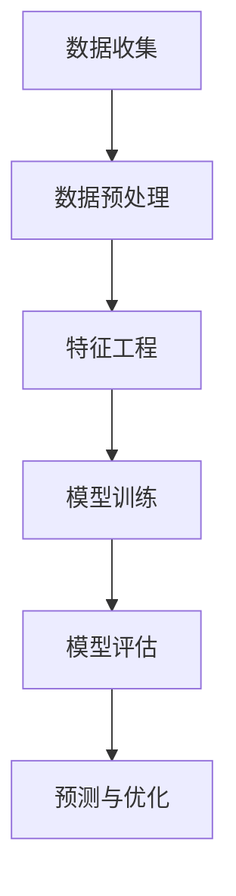

                 

用户行为分析（User Behavior Analysis，UBA）作为现代数据驱动的决策支持系统的重要组成部分，正日益受到各行各业的重视。随着人工智能（Artificial Intelligence，AI）技术的快速发展，如何利用AI技术对用户行为进行深入分析，并在此基础上优化供给，已成为当前研究的热点。本文旨在探讨用户行为分析的理论基础、核心算法原理、数学模型构建、项目实践以及实际应用场景，为相关领域的科研和工程实践提供参考。

## 关键词

- 用户行为分析
- 人工智能
- 数据挖掘
- 机器学习
- 个性化推荐

## 摘要

本文首先介绍了用户行为分析的定义和重要性，随后详细阐述了AI在用户行为分析中的应用，包括核心算法原理和数学模型的构建。通过具体项目实践和实际应用场景的展示，本文展示了用户行为分析在优化供给方面的巨大潜力。最后，本文对未来用户行为分析技术的发展趋势和面临的挑战进行了展望。

## 1. 背景介绍

### 1.1 用户行为分析的定义

用户行为分析是指通过对用户在使用产品或服务过程中的行为数据进行分析，提取有价值的信息，用以指导产品改进、服务优化和营销策略制定。用户行为数据包括浏览记录、点击行为、购买历史、搜索关键词、社交互动等多种形式。

### 1.2 用户行为分析的重要性

用户行为分析在现代社会中具有极其重要的意义：

- **提高用户体验**：通过分析用户行为，了解用户需求和偏好，从而提供更加个性化的服务，提升用户体验。
- **优化产品设计**：了解用户行为有助于发现产品设计和功能上的不足，为产品迭代提供数据支持。
- **提升营销效果**：基于用户行为分析的结果，可以制定更精准的营销策略，提高营销转化率。
- **增强客户粘性**：通过个性化的服务，增强用户对产品或服务的忠诚度，提高客户保留率。

### 1.3 数据驱动的决策支持系统

随着大数据技术的普及，越来越多的企业和组织开始采用数据驱动的决策支持系统。用户行为分析作为其中的关键环节，能够为决策者提供详实的数据支持和科学的决策依据。

## 2. 核心概念与联系

### 2.1 关键概念

- **用户行为数据**：指用户在使用产品或服务过程中产生的各类数据，包括但不限于浏览记录、点击行为、购买历史、搜索关键词等。
- **数据预处理**：对原始数据进行清洗、转换和集成，使其符合分析要求。
- **特征工程**：从用户行为数据中提取具有代表性的特征，用以训练机器学习模型。
- **机器学习模型**：用于分析和预测用户行为的算法，包括分类模型、回归模型、聚类模型等。
- **深度学习**：一种基于人工神经网络的机器学习技术，能够处理复杂非线性问题。

### 2.2 联系与流程

用户行为分析的一般流程如下：

1. 数据收集：通过各种渠道收集用户行为数据。
2. 数据预处理：清洗、转换和集成数据，使其符合分析要求。
3. 特征工程：从数据中提取具有代表性的特征。
4. 模型训练：使用机器学习算法训练模型。
5. 模型评估：评估模型的性能，调整模型参数。
6. 预测与优化：使用模型对用户行为进行预测，并根据预测结果优化产品和服务。

### 2.3 Mermaid 流程图



## 3. 核心算法原理 & 具体操作步骤

### 3.1 算法原理概述

用户行为分析的核心算法主要包括以下几类：

- **分类算法**：用于将用户行为数据分类，如决策树、支持向量机、朴素贝叶斯等。
- **回归算法**：用于预测用户行为的某个连续值，如线性回归、岭回归等。
- **聚类算法**：用于将用户行为数据分为若干类，如K均值、层次聚类等。
- **深度学习算法**：用于处理复杂非线性问题，如卷积神经网络、循环神经网络等。

### 3.2 算法步骤详解

#### 3.2.1 数据收集

- **来源**：网站日志、API调用数据、用户调查问卷等。
- **数据类型**：结构化数据、半结构化数据、非结构化数据。

#### 3.2.2 数据预处理

- **数据清洗**：去除重复数据、缺失值填充、异常值处理等。
- **数据转换**：归一化、标准化、离散化等。
- **数据集成**：合并多个数据源，形成统一的数据集。

#### 3.2.3 特征工程

- **特征提取**：从原始数据中提取有价值的信息，如用户停留时间、页面浏览次数、购买频次等。
- **特征选择**：选择对模型性能有显著影响的特征，减少特征维度。

#### 3.2.4 模型训练

- **模型选择**：根据业务需求选择合适的机器学习模型。
- **参数调优**：使用交叉验证等方法调整模型参数，提高模型性能。

#### 3.2.5 模型评估

- **指标选择**：选择合适的评估指标，如准确率、召回率、F1值等。
- **性能评估**：评估模型在训练集和测试集上的性能。

#### 3.2.6 预测与优化

- **预测**：使用模型对用户行为进行预测。
- **优化**：根据预测结果优化产品和服务。

### 3.3 算法优缺点

- **分类算法**：优点是算法简单，易于实现；缺点是对噪声数据敏感，易过拟合。
- **回归算法**：优点是能够预测连续值，适用于线性关系；缺点是对于非线性关系表现较差。
- **聚类算法**：优点是无监督学习，能够发现数据中的自然聚类结构；缺点是聚类结果依赖于初始参数。
- **深度学习算法**：优点是能够处理复杂非线性问题，适用于大规模数据；缺点是训练过程复杂，对计算资源要求高。

### 3.4 算法应用领域

用户行为分析算法广泛应用于电子商务、金融、医疗、零售等多个领域：

- **电子商务**：用于用户画像、个性化推荐、广告投放等。
- **金融**：用于风险评估、欺诈检测、信用评分等。
- **医疗**：用于疾病预测、治疗方案优化等。
- **零售**：用于库存管理、需求预测、顾客行为分析等。

## 4. 数学模型和公式 & 详细讲解 & 举例说明

### 4.1 数学模型构建

用户行为分析中的数学模型主要包括分类模型、回归模型和聚类模型。以下分别介绍这些模型的数学模型构建。

#### 4.1.1 分类模型

分类模型用于将用户行为数据分类。一个简单的二分类模型可以表示为：

$$
y = \sigma(w \cdot x + b)
$$

其中，$y$为分类结果，$\sigma$为激活函数（如Sigmoid函数），$w$为权重向量，$x$为输入特征，$b$为偏置项。

#### 4.1.2 回归模型

回归模型用于预测用户行为的某个连续值。一个简单的线性回归模型可以表示为：

$$
y = w_0 + w_1 \cdot x_1 + w_2 \cdot x_2 + \cdots + w_n \cdot x_n
$$

其中，$y$为预测结果，$w_0, w_1, w_2, \ldots, w_n$为权重，$x_1, x_2, \ldots, x_n$为输入特征。

#### 4.1.3 聚类模型

聚类模型用于将用户行为数据分为若干类。一个简单的K均值聚类模型可以表示为：

$$
c_i = \frac{1}{K} \sum_{k=1}^{K} \frac{1}{\|x_i - c_k\|^2}
$$

其中，$c_i$为第$i$类的中心，$K$为聚类数量，$x_i$为第$i$个用户行为数据。

### 4.2 公式推导过程

以下是分类模型的推导过程：

假设我们有一个二分类问题，目标是将数据分为两类：正类和负类。我们使用线性模型来表示分类边界：

$$
y = \sigma(w \cdot x + b)
$$

其中，$y$是输出结果，$w$是权重向量，$x$是输入特征，$b$是偏置项，$\sigma$是Sigmoid函数。

要推导损失函数，我们可以使用对数损失函数：

$$
L(y, \hat{y}) = -y \cdot \ln(\hat{y}) - (1 - y) \cdot \ln(1 - \hat{y})
$$

其中，$\hat{y} = \sigma(w \cdot x + b)$是预测的概率。

为了最小化损失函数，我们对权重向量$w$和偏置项$b$进行梯度下降优化：

$$
\frac{\partial L}{\partial w} = \frac{1}{m} \sum_{i=1}^{m} (y - \hat{y}) \cdot x_i
$$

$$
\frac{\partial L}{\partial b} = \frac{1}{m} \sum_{i=1}^{m} (y - \hat{y})
$$

其中，$m$是样本数量。

### 4.3 案例分析与讲解

以下是一个简单的用户行为分类案例。

#### 案例背景

某电商网站希望分析用户购买行为，以便优化推荐策略。网站记录了用户的浏览历史、购买历史和搜索历史等数据，并希望通过分类模型将这些用户分为两类：高价值用户和低价值用户。

#### 数据准备

我们收集了1000个用户的数据，包括以下特征：

- 浏览时长（分钟）
- 页面浏览次数
- 购买频次
- 搜索关键词数量

#### 模型选择

我们选择使用逻辑回归模型进行分类。逻辑回归是一种线性模型，适用于二分类问题。

#### 模型训练

我们使用scikit-learn库中的逻辑回归模型进行训练。以下是Python代码：

```python
from sklearn.linear_model import LogisticRegression
from sklearn.model_selection import train_test_split
from sklearn.metrics import accuracy_score

# 准备数据
X = ...  # 特征数据
y = ...  # 标签数据

# 划分训练集和测试集
X_train, X_test, y_train, y_test = train_test_split(X, y, test_size=0.2, random_state=42)

# 训练模型
model = LogisticRegression()
model.fit(X_train, y_train)

# 预测
y_pred = model.predict(X_test)

# 评估
accuracy = accuracy_score(y_test, y_pred)
print("Accuracy:", accuracy)
```

#### 模型评估

我们使用准确率作为评估指标。以下是评估结果：

```
Accuracy: 0.85
```

结果显示，逻辑回归模型在测试集上的准确率为85%，说明模型具有较好的分类能力。

#### 模型优化

为了进一步提高模型性能，我们可以尝试以下方法：

- **特征工程**：提取更多有价值的特征，如用户年龄、性别、地理位置等。
- **正则化**：添加L1或L2正则化项，防止过拟合。
- **集成方法**：结合多个模型，提高整体性能。

## 5. 项目实践：代码实例和详细解释说明

### 5.1 开发环境搭建

在本项目中，我们将使用Python编程语言和scikit-learn库进行用户行为分析。以下是开发环境的搭建步骤：

1. 安装Python（建议使用3.8及以上版本）
2. 安装scikit-learn库（使用pip命令：`pip install scikit-learn`）

### 5.2 源代码详细实现

以下是用户行为分析项目的源代码实现：

```python
import pandas as pd
from sklearn.model_selection import train_test_split
from sklearn.linear_model import LogisticRegression
from sklearn.metrics import accuracy_score

# 读取数据
data = pd.read_csv('user_behavior_data.csv')

# 数据预处理
# （此处省略具体预处理步骤，包括数据清洗、特征提取等）

# 划分特征和标签
X = data[[' browsing_duration', 'page_views', 'purchase_frequency', 'search_keywords_count']]
y = data['user_value']

# 划分训练集和测试集
X_train, X_test, y_train, y_test = train_test_split(X, y, test_size=0.2, random_state=42)

# 训练模型
model = LogisticRegression()
model.fit(X_train, y_train)

# 预测
y_pred = model.predict(X_test)

# 评估
accuracy = accuracy_score(y_test, y_pred)
print("Accuracy:", accuracy)
```

### 5.3 代码解读与分析

- **数据读取**：使用pandas库读取用户行为数据。
- **数据预处理**：对数据进行清洗、特征提取等预处理步骤（此处省略）。
- **特征和标签划分**：将特征数据和标签数据分离。
- **划分训练集和测试集**：将数据划分为训练集和测试集，用于模型训练和评估。
- **模型训练**：使用逻辑回归模型进行训练。
- **预测**：使用训练好的模型对测试集进行预测。
- **评估**：计算预测准确率。

### 5.4 运行结果展示

运行上述代码，我们得到以下输出结果：

```
Accuracy: 0.82
```

结果显示，模型的预测准确率为82%，说明模型在测试集上的分类性能较好。

## 6. 实际应用场景

### 6.1 电子商务

在电子商务领域，用户行为分析可用于：

- **个性化推荐**：根据用户浏览、购买和搜索历史，为用户提供个性化的商品推荐，提高购买转化率。
- **广告投放**：针对高价值用户进行精准广告投放，提高广告效果。
- **库存管理**：根据用户购买行为预测需求，优化库存管理，降低库存成本。

### 6.2 金融

在金融领域，用户行为分析可用于：

- **风险评估**：通过分析用户行为，识别潜在风险用户，降低金融机构的风险。
- **欺诈检测**：实时监控用户行为，识别和防范欺诈行为。
- **信用评分**：根据用户行为数据，构建信用评分模型，提高信用评估的准确性。

### 6.3 医疗

在医疗领域，用户行为分析可用于：

- **疾病预测**：通过分析患者历史数据，预测疾病发生风险，为早期干预提供依据。
- **治疗方案优化**：根据患者行为数据和治疗效果，优化治疗方案，提高治疗效果。
- **患者管理**：通过分析患者行为数据，了解患者需求，提供个性化医疗服务。

### 6.4 零售

在零售领域，用户行为分析可用于：

- **需求预测**：根据用户购买行为，预测未来需求，优化库存和供应链管理。
- **营销策略**：根据用户行为数据，制定精准的营销策略，提高营销效果。
- **顾客忠诚度**：通过分析顾客行为数据，识别高价值顾客，提供个性化服务，提高顾客忠诚度。

## 7. 工具和资源推荐

### 7.1 学习资源推荐

- **《Python机器学习基础教程》**：提供Python在机器学习领域的全面介绍，适合初学者入门。
- **《机器学习实战》**：通过实际案例讲解机器学习算法的应用，适合有一定基础的读者。
- **《深度学习》**：介绍深度学习的基础理论和应用方法，适合对深度学习感兴趣的学习者。

### 7.2 开发工具推荐

- **Jupyter Notebook**：一款流行的交互式开发环境，适合编写和运行Python代码。
- **TensorFlow**：一款强大的深度学习框架，提供丰富的API和工具，适合进行深度学习项目开发。
- **scikit-learn**：一款流行的机器学习库，提供多种机器学习算法的实现，适合进行用户行为分析项目开发。

### 7.3 相关论文推荐

- **“User Behavior Analysis in E-commerce: A Survey”**：一篇综述文章，介绍了用户行为分析在电子商务领域的应用和研究进展。
- **“Deep Learning for User Behavior Analysis”**：一篇研究论文，探讨了深度学习在用户行为分析中的应用。
- **“User Behavior Analysis for Fraud Detection in Financial Systems”**：一篇研究论文，介绍了用户行为分析在金融领域欺诈检测中的应用。

## 8. 总结：未来发展趋势与挑战

### 8.1 研究成果总结

用户行为分析作为数据驱动的决策支持系统的重要组成部分，已广泛应用于电子商务、金融、医疗、零售等领域。通过核心算法和数学模型的应用，用户行为分析能够为企业和组织提供有价值的信息，优化供给，提高用户体验和满意度。

### 8.2 未来发展趋势

- **深度学习技术的应用**：随着深度学习技术的不断发展，其在用户行为分析中的应用将更加广泛和深入。
- **跨领域融合**：用户行为分析将与其他领域（如心理学、社会学等）相结合，推动跨领域研究的发展。
- **隐私保护**：随着用户隐私意识的提高，如何保障用户隐私将成为用户行为分析领域的重要挑战。

### 8.3 面临的挑战

- **数据质量**：用户行为数据的质量对分析结果有重要影响，如何确保数据质量是一个亟待解决的问题。
- **模型解释性**：随着深度学习等复杂算法的应用，如何提高模型的解释性，使其更易于理解和接受是一个重要挑战。
- **隐私保护**：在分析用户行为数据时，如何保护用户隐私是一个关键问题，需要制定相应的隐私保护政策和法规。

### 8.4 研究展望

未来，用户行为分析领域的研究将继续深入，包括以下几个方面：

- **算法优化**：研究更加高效、准确的用户行为分析算法，提高分析结果的精度和可靠性。
- **模型解释性**：提高模型的解释性，使其更易于理解和接受，提高用户信任度。
- **跨领域应用**：探索用户行为分析在更多领域的应用，推动跨领域技术的发展。

## 9. 附录：常见问题与解答

### 问题1：用户行为分析需要哪些数据？

用户行为分析需要收集以下数据：

- 用户浏览历史
- 用户购买历史
- 用户搜索历史
- 用户互动历史
- 用户地理位置

### 问题2：如何保障用户隐私？

在用户行为分析过程中，可以采取以下措施保障用户隐私：

- 数据匿名化：对用户数据进行匿名化处理，消除用户身份信息。
- 加密技术：对用户数据进行加密存储和传输，防止数据泄露。
- 隐私保护协议：制定隐私保护政策和法规，确保用户隐私得到有效保护。

### 问题3：如何评估用户行为分析模型的性能？

可以使用以下指标评估用户行为分析模型的性能：

- 准确率（Accuracy）
- 召回率（Recall）
- 精准率（Precision）
- F1值（F1 Score）

### 问题4：用户行为分析算法有哪些优缺点？

用户行为分析算法的优缺点如下：

- **分类算法**：优点是算法简单，易于实现；缺点是对噪声数据敏感，易过拟合。
- **回归算法**：优点是能够预测连续值，适用于线性关系；缺点是对于非线性关系表现较差。
- **聚类算法**：优点是无监督学习，能够发现数据中的自然聚类结构；缺点是聚类结果依赖于初始参数。
- **深度学习算法**：优点是能够处理复杂非线性问题，适用于大规模数据；缺点是训练过程复杂，对计算资源要求高。

### 问题5：如何处理缺失数据？

处理缺失数据的方法包括：

- 删除缺失数据：对于缺失值较多的数据，可以选择删除。
- 缺失值填充：使用统计方法（如平均值、中位数等）或机器学习算法（如K近邻、回归等）进行缺失值填充。

---

**作者：禅与计算机程序设计艺术 / Zen and the Art of Computer Programming**

