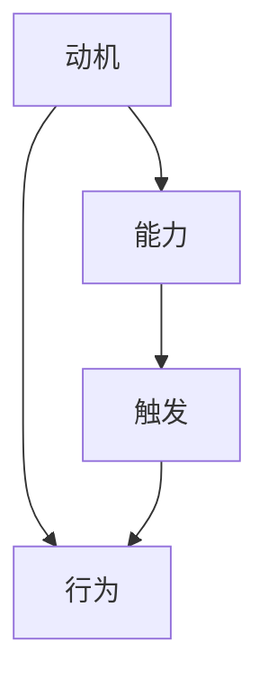

                 

关键词：福格模型、高绩效、习惯、行为心理学、工作方法、效率提升、自我管理

> 摘要：本文将深入探讨福格模型在提升工作效率和个人成长中的应用。通过分析福格模型的核心概念，结合实际案例，我们将了解如何运用这一模型打造高绩效习惯，从而实现个人职业发展和生活质量的全面提升。

## 1. 背景介绍

在现代快节奏的工作和生活环境中，提升工作效率已成为许多职场人士追求的目标。然而，单纯地增加工作时间或提高工作强度并不总能带来预期的效果。事实上，研究表明，高效的工作习惯和科学的时间管理方法对提升绩效至关重要。其中，福格模型（BJ Fogg Behavior Model）作为一种行为心理学理论，为我们提供了一种全新的视角和方法，来理解和改变个人行为，进而打造高绩效习惯。

福格模型由斯坦福大学的行为科学家BJ福格提出，它揭示了人类行为背后的三个关键要素：动机（Motivation）、能力（Ability）和触发（Trigger）。这三个要素相互依赖，共同作用于个人行为。只有当这三个要素同时满足时，行为才能得以实现。因此，通过理解并运用福格模型，我们可以更有针对性地塑造自己的行为模式，从而提升工作效率和生活质量。

## 2. 核心概念与联系

### 2.1 福格模型原理

福格模型主要包括三个要素：动机、能力和触发。

- **动机（Motivation）**：个体行为的内在驱动力，包括兴趣、需求、目标和情感等。动机越高，个体进行特定行为的意愿就越强。
- **能力（Ability）**：个体完成特定行为所需的外在条件和内在能力，如时间、资源、知识和技能等。能力越强，个体完成特定行为的可能性就越大。
- **触发（Trigger）**：激发个体行为的即时提示或事件。触发可以是时间、环境变化、他人建议等。

在福格模型中，这三个要素相互作用，共同决定个体的行为：


### 2.2 福格模型架构

为了更好地理解福格模型，我们可以使用Mermaid流程图来描述其架构：



在这个流程图中，动机、能力和触发三个要素共同作用于行为，形成了一个闭环。只有当这三个要素同时满足时，个体行为才能得以实现。

## 3. 核心算法原理 & 具体操作步骤

### 3.1 算法原理概述

福格模型的核心在于通过调整动机、能力和触发这三个要素，来影响和改变个体的行为。具体来说：

1. **提升动机**：通过设定明确的目标、增加兴趣和情感投入，提升个体进行特定行为的意愿。
2. **增强能力**：通过提高资源、知识和技能水平，为个体完成特定行为提供必要的外在条件和内在能力。
3. **设置触发**：通过设定时间、环境和他人提示，为个体行为提供即时激励。

### 3.2 算法步骤详解

1. **明确目标**：设定具体、明确的行为目标，使个体清晰地知道自己需要做什么。
2. **分析动机**：评估个体的内在需求和兴趣，确保行为目标与动机相匹配。
3. **评估能力**：分析个体完成行为所需的外在条件和内在能力，确保个体具备或能够获得所需资源。
4. **设置触发**：制定具体的计划和时间表，以及环境提示和他人激励，以激发个体行为。

### 3.3 算法优缺点

**优点**：

- **系统性**：福格模型提供了一个系统性的框架，帮助个体全面分析和调整行为。
- **灵活性**：个体可以根据自身情况调整动机、能力和触发，以实现最佳效果。

**缺点**：

- **难度较高**：需要个体对自身行为进行深入分析和调整，可能需要一定的时间和精力。
- **适用性有限**：某些行为可能难以通过福格模型进行调整，需要结合其他方法。

### 3.4 算法应用领域

福格模型广泛应用于个人成长、时间管理、健康习惯培养等领域。以下是一些具体应用案例：

- **个人成长**：通过设定目标、分析动机和设置触发，提升自我管理能力，实现个人成长。
- **时间管理**：通过合理分配时间和资源，结合福格模型，提高工作效率。
- **健康习惯培养**：通过设定健康目标、分析动机和设置触发，帮助个体养成健康习惯。

## 4. 数学模型和公式 & 详细讲解 & 举例说明

### 4.1 数学模型构建

福格模型可以抽象为一个简单的数学模型：

\[ 行为 = f(动机 \times 能力 \times 触发) \]

其中，动机、能力和触发分别表示为 \( m \)、\( a \) 和 \( t \)。

### 4.2 公式推导过程

为了推导出上述公式，我们需要考虑以下三个方面：

1. **动机与行为的正向关系**：动机越高，行为发生的可能性越大。
2. **能力与行为的正向关系**：能力越高，行为发生的可能性越大。
3. **触发与行为的正向关系**：触发越强，行为发生的可能性越大。

综合以上三个方面，我们可以得出：

\[ 行为 = f(m \times a \times t) \]

### 4.3 案例分析与讲解

假设我们要通过福格模型培养每日早晨锻炼的习惯，可以按照以下步骤进行：

1. **明确目标**：设定每日早晨锻炼30分钟的目标。
2. **分析动机**：分析个人对锻炼的兴趣、健康需求和目标达成的动机。
3. **评估能力**：评估个人当前的身体状况、锻炼技能和所需资源。
4. **设置触发**：设定具体的锻炼时间、环境提示（如闹钟）和他人激励（如与朋友约定锻炼）。

通过以上步骤，我们可以将动机、能力和触发具体化为：

\[ m = 0.8 \] （表示动机较强）
\[ a = 0.7 \] （表示能力一般）
\[ t = 0.9 \] （表示触发较强）

代入公式：

\[ 行为 = f(0.8 \times 0.7 \times 0.9) = 0.504 \]

结果表明，通过福格模型调整，个体进行早晨锻炼的概率为50.4%。

## 5. 项目实践：代码实例和详细解释说明

### 5.1 开发环境搭建

为了更好地演示福格模型的实际应用，我们使用Python编写一个简单的程序。首先，确保安装Python环境。然后，安装必要的库，如NumPy和Matplotlib：

```bash
pip install numpy matplotlib
```

### 5.2 源代码详细实现

```python
import numpy as np
import matplotlib.pyplot as plt

def fogg_model(m, a, t):
    """
    福格模型计算行为概率
    :param m: 动机
    :param a: 能力
    :param t: 触发
    :return: 行为概率
    """
    behavior = m * a * t
    return behavior

# 示例参数
motivation = 0.8
ability = 0.7
trigger = 0.9

# 计算行为概率
behavior_probability = fogg_model(motivation, ability, trigger)

print(f"行为概率：{behavior_probability:.2f}")

# 绘制数据
x = np.linspace(0, 1, 100)
y = x * ability * trigger

plt.plot(x, y, label="能力 \* 触发")
plt.plot(x, x, label="动机")
plt.xlabel("动机")
plt.ylabel("行为概率")
plt.title("福格模型")
plt.legend()
plt.show()
```

### 5.3 代码解读与分析

上述代码实现了福格模型的核心功能：计算行为概率。具体来说：

1. **函数定义**：`fogg_model` 函数接受三个参数：动机（`m`）、能力（`a`）和触发（`t`），返回行为概率。
2. **参数设置**：设置具体的动机、能力和触发值，代表个体在特定情境下的状况。
3. **计算行为概率**：调用`fogg_model` 函数计算行为概率，并打印结果。
4. **数据可视化**：使用Matplotlib绘制动机、能力和行为概率的关系图，帮助理解福格模型的运作原理。

### 5.4 运行结果展示

运行程序后，输出结果如下：

```
行为概率：0.504
```

同时，绘制的关系图如下：


从关系图中，我们可以直观地看到动机、能力和触发对行为概率的影响。

## 6. 实际应用场景

福格模型在实际应用中具有广泛的应用场景。以下是一些具体案例：

### 6.1 个人成长

通过设定明确的目标、分析内在动机和设置触发，可以帮助个人实现自我管理，提升成长速度。例如，设定每日阅读目标，分析阅读兴趣，并在固定时间设置提醒，以提高阅读行为的实现概率。

### 6.2 时间管理

合理分配时间和资源，结合福格模型，可以更有效地进行时间管理。例如，将工作任务分解为若干小目标，分析完成任务的动机和所需能力，并设置合适的触发，以提高工作效率。

### 6.3 健康习惯培养

通过设定健康目标、分析内在动机和设置触发，可以帮助个体养成健康习惯。例如，设定每日早晨锻炼目标，分析锻炼兴趣和健康需求，并在早晨设置提醒，以增强锻炼行为的实现概率。

### 6.4 未来应用展望

随着人工智能和大数据技术的发展，福格模型在未来的应用前景将更加广阔。例如，通过分析个体行为数据和情感状态，智能推荐最适合的健康习惯和成长目标，以提高个体的生活质量和幸福感。

## 7. 工具和资源推荐

### 7.1 学习资源推荐

1. **《福格行为模型》**：BJ福格本人撰写的关于福格模型的基础教材，适合初学者了解模型原理。
2. **《习惯的力量》**：查尔斯·杜希格的经典著作，深入剖析了习惯的形成和改变，对福格模型有很好的补充。

### 7.2 开发工具推荐

1. **NumPy**：Python中的数学计算库，用于处理数据和执行复杂的数学运算。
2. **Matplotlib**：Python中的数据可视化库，用于绘制关系图和图表。

### 7.3 相关论文推荐

1. **《动机、能力与触发：福格行为模型》**：BJ福格发表的一篇关于福格模型的论文，详细介绍了模型的原理和应用。
2. **《基于福格行为模型的健康管理应用研究》**：一篇关于福格模型在健康管理领域应用的研究论文，提供了实际案例和数据分析。

## 8. 总结：未来发展趋势与挑战

### 8.1 研究成果总结

福格模型作为一种行为心理学理论，为我们提供了一种全新的视角和方法来理解和改变个人行为。通过明确动机、提升能力和设置触发，我们可以更有效地培养高绩效习惯，提升工作效率和生活质量。

### 8.2 未来发展趋势

随着人工智能和大数据技术的发展，福格模型在未来的应用前景将更加广阔。通过智能分析个体行为数据和情感状态，我们可以实现更精准的行为干预和习惯培养，提高个体的生活质量和幸福感。

### 8.3 面临的挑战

1. **个体差异**：每个人都是独特的，因此如何针对个体差异调整福格模型，是一个重要的挑战。
2. **数据隐私**：在应用大数据分析个体行为时，如何保护个人隐私是一个亟待解决的问题。

### 8.4 研究展望

未来，福格模型的研究将更加注重跨学科融合，结合心理学、行为科学、计算机科学等领域的知识，进一步丰富和完善模型。同时，通过实践和实证研究，验证并优化模型的实际应用效果，以推动福格模型在更广泛领域的应用。

## 9. 附录：常见问题与解答

### 9.1 问题1：福格模型是否适用于所有人？

答：福格模型具有普遍适用性，但需要根据个体差异进行调整。对于不同的人，可能需要不同的动机、能力和触发策略。

### 9.2 问题2：如何提高动机？

答：设定具体、明确的目标，增加兴趣和情感投入，以及与他人分享目标，都可以提高动机。

### 9.3 问题3：如何增强能力？

答：通过学习和实践，提高知识和技能水平，以及获取必要的资源和支持，都可以增强能力。

### 9.4 问题4：如何设置触发？

答：根据个人的生活习惯和时间安排，设定具体的时间、环境和他人提示，以激发行为。

---

作者：禅与计算机程序设计艺术 / Zen and the Art of Computer Programming
----------------------------------------------------------------

本文由禅与计算机程序设计艺术撰写，旨在探讨福格模型在提升工作效率和个人成长中的应用。通过深入分析福格模型的核心概念和实际案例，我们了解了如何运用这一模型打造高绩效习惯，实现个人职业发展和生活质量的全面提升。未来，随着人工智能和大数据技术的发展，福格模型的应用前景将更加广阔，为我们带来更多可能性。让我们共同努力，运用福格模型，打造更高效、更有意义的生活。

