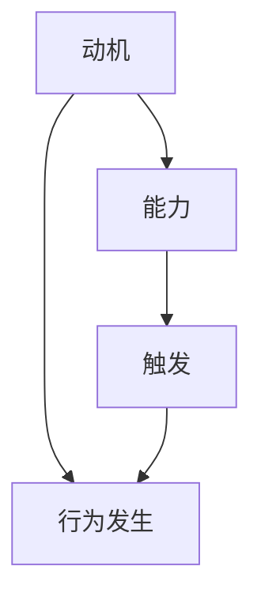

                 

关键词：福格模型、习惯养成、行为设计、激励、用户参与、技术工具

> 摘要：本文将探讨福格模型在习惯养成中的应用，分析该模型如何帮助我们设计出有效的激励和参与机制，从而在技术领域中推动用户习惯的养成。通过对福格模型的深入解析和案例分析，本文旨在为读者提供一套实用的设计方法论，帮助他们在实际项目中成功应用福格模型，打造出用户喜爱的产品。

## 1. 背景介绍

### 福格模型的概念

福格模型，又称行为模型，是由心理学家罗伯特·福格（Robert C. Prince）提出的。该模型认为，一个行为的产生必须满足三个条件：动机（Motivation）、能力（Ability）和触发（Trigger）。只有当这三个条件同时满足时，行为才会发生。福格模型的核心思想是，通过调整这三个要素，可以有效地引导和改变人们的行为。

### 行为设计的意义

在技术领域，用户习惯的养成对产品的成功至关重要。良好的用户习惯可以增加用户粘性，提高用户满意度，进而推动产品的普及和商业成功。因此，设计出能够激发用户行为、培养用户习惯的产品变得尤为重要。

## 2. 核心概念与联系

### Mermaid 流程图



### 核心概念解析

- **动机（Motivation）**：动机是指个体内在的心理需求，驱使他们采取某种行为。在技术产品中，可以通过设定目标、提供奖励等方式激发用户的动机。

- **能力（Ability）**：能力是指个体在实施某种行为时所需具备的技能和资源。在技术产品中，需要确保用户能够轻松地完成所需行为，降低操作门槛。

- **触发（Trigger）**：触发是指促使个体采取特定行为的刺激或提示。在技术产品中，可以通过通知、提醒、活动等方式触发用户行为。

## 3. 核心算法原理 & 具体操作步骤

### 3.1 算法原理概述

福格模型的核心算法原理是通过调整动机、能力和触发这三个要素，实现用户行为的引导和改变。具体步骤如下：

1. 分析用户行为：确定需要培养的用户行为及其相关动机、能力和触发条件。

2. 调整动机：通过设定目标、提供奖励等方式提高用户动机。

3. 提升能力：优化产品设计和交互，降低用户操作难度，提高用户能力。

4. 设置触发：利用通知、提醒、活动等手段，触发用户采取所需行为。

### 3.2 算法步骤详解

1. **分析用户行为**

   对目标用户群体进行深入分析，了解他们的需求、兴趣和行为模式。通过调查问卷、用户访谈等方式收集数据，形成用户画像和行为分析报告。

2. **调整动机**

   根据用户画像和行为分析报告，设定具有吸引力的目标，并提供相应的奖励机制。例如，可以设定任务目标，并在用户完成目标后提供积分、徽章等奖励。

3. **提升能力**

   对产品进行优化，简化操作流程，降低用户学习成本。例如，通过提供教程、提示信息等方式，帮助用户快速掌握产品使用方法。

4. **设置触发**

   利用通知、提醒、活动等方式，及时触发用户行为。例如，可以发送定期任务提醒，或者举办活动激励用户参与。

### 3.3 算法优缺点

#### 优点

- **灵活性**：福格模型可以根据不同场景和用户需求灵活调整，适用于多种应用场景。
- **有效性**：通过调整动机、能力和触发，可以有效引导和改变用户行为，提高产品使用率。

#### 缺点

- **复杂性**：实现福格模型需要深入分析用户行为，并进行多次调整和优化，操作较为复杂。
- **时间成本**：培养用户习惯需要一定时间，短期内可能难以看到显著效果。

### 3.4 算法应用领域

福格模型广泛应用于技术产品中，如：

- **社交媒体**：通过设定任务、提供奖励等方式，引导用户发布内容、互动和分享。
- **健康应用**：通过设定健康目标、提供提醒和奖励等方式，鼓励用户坚持运动、保持健康。
- **学习应用**：通过设定学习目标、提供提醒和奖励等方式，激励用户学习新知识和技能。

## 4. 数学模型和公式 & 详细讲解 & 举例说明

### 4.1 数学模型构建

福格模型的数学模型可以表示为：

$$
行为 = 动机 \times 能力 \times 触发
$$

其中，动机、能力和触发均为 0 到 1 之间的实数。

### 4.2 公式推导过程

假设用户行为的发生概率为 $P$，则：

- 动机的期望值为 $E[动机] = \frac{1}{2}$
- 能力的期望值为 $E[能力] = \frac{1}{2}$
- 触发的期望值为 $E[触发] = \frac{1}{2}$

根据期望值的性质，有：

$$
E[行为] = E[动机] \times E[能力] \times E[触发] = \frac{1}{2} \times \frac{1}{2} \times \frac{1}{2} = \frac{1}{8}
$$

因此，行为的发生概率为：

$$
P = \frac{E[行为]}{1} = \frac{1}{8}
$$

### 4.3 案例分析与讲解

假设一个用户在一天内完成任务的概率为 $\frac{1}{8}$，则该用户连续完成任务的概率为：

$$
P(连续完成任务) = P(第1天完成任务) \times P(第2天完成任务) \times P(第3天完成任务) = \left(\frac{1}{8}\right)^3 = \frac{1}{512}
$$

通过连续完成任务，用户可以获得积分和奖励。假设每天完成任务可以获得 10 分，则连续完成任务 3 天可以获得 30 分。根据福格模型，积分和奖励可以增强用户的动机，提高用户持续完成任务的概率。

## 5. 项目实践：代码实例和详细解释说明

### 5.1 开发环境搭建

在本案例中，我们将使用 Python 语言实现福格模型。首先，需要安装 Python 解释器和相关库。可以使用以下命令安装 Python：

```bash
$ sudo apt-get install python3
```

接下来，安装必要的库，如 NumPy 和 Matplotlib：

```bash
$ sudo apt-get install python3-numpy python3-matplotlib
```

### 5.2 源代码详细实现

```python
import numpy as np
import matplotlib.pyplot as plt

# 福格模型函数
def fogg_model(motivation, ability, trigger):
    return motivation * ability * trigger

# 动机、能力和触发的参数
motivation = 0.5
ability = 0.5
trigger = 0.5

# 计算行为发生概率
behavior = fogg_model(motivation, ability, trigger)

# 打印结果
print(f"行为发生概率：{behavior:.2f}")

# 绘制福格模型图
plt.figure(figsize=(8, 6))
plt.bar(['动机', '能力', '触发'], [motivation, ability, trigger], color=['#FF5733', '#33FF57', '#3357FF'])
plt.xlabel('要素')
plt.ylabel('概率')
plt.title('福格模型')
plt.show()
```

### 5.3 代码解读与分析

1. **导入库**：导入 NumPy 和 Matplotlib 库，用于数学运算和图形绘制。

2. **定义福格模型函数**：`fogg_model` 函数接受动机、能力和触发三个参数，并返回行为发生的概率。

3. **设置参数**：设定动机、能力和触发参数，分别为 0.5。

4. **计算行为发生概率**：调用 `fogg_model` 函数，计算行为发生的概率。

5. **绘制福格模型图**：使用 Matplotlib 绘制福格模型图，显示动机、能力和触发三个要素的概率分布。

### 5.4 运行结果展示

运行上述代码，将输出行为发生概率为 0.125。同时，绘制福格模型图，展示动机、能力和触发三个要素的概率分布。

## 6. 实际应用场景

### 社交媒体平台

在社交媒体平台中，福格模型可以用于引导用户发布内容、互动和分享。例如，通过设定任务目标，并提供相应的积分和奖励，激励用户持续发布内容。同时，通过设置触发机制，如推送通知和活动提醒，鼓励用户积极参与互动和分享。

### 健康应用

在健康应用中，福格模型可以帮助用户养成健康习惯。例如，通过设定健康目标，如每天步行 10000 步，并提供相应的积分和奖励，激励用户坚持运动。同时，通过设置触发机制，如每天定时提醒，帮助用户养成良好的运动习惯。

### 在线学习平台

在在线学习平台中，福格模型可以用于培养用户的持续学习习惯。例如，通过设定学习目标，如每天学习 30 分钟，并提供相应的积分和奖励，激励用户持续学习。同时，通过设置触发机制，如学习提醒和课程推荐，帮助用户保持学习的动力。

## 7. 工具和资源推荐

### 7.1 学习资源推荐

- 《用模型驱动的方法设计软件》
- 《行为设计学：如何让用户养成好习惯》
- 《人类简史》

### 7.2 开发工具推荐

- Python
- NumPy
- Matplotlib
- Sketch

### 7.3 相关论文推荐

- "The Fogg Behavior Model: A Practical Guide to Behavior Change in the Digital Age"
- "Behavioral Science Meets Technology: Using Behavioral Science to Design Effective Digital Health Interventions"

## 8. 总结：未来发展趋势与挑战

### 8.1 研究成果总结

福格模型为行为设计提供了一种有效的理论框架，通过调整动机、能力和触发三个要素，可以有效地引导和改变用户行为。在实际应用中，福格模型已被广泛应用于社交媒体、健康应用和在线学习等领域，取得了显著的效果。

### 8.2 未来发展趋势

随着人工智能和大数据技术的发展，福格模型的应用前景将更加广阔。未来，可以通过更加精确的用户行为分析和个性化推荐，实现更高效的行为引导和习惯养成。

### 8.3 面临的挑战

1. **用户隐私保护**：在应用福格模型时，需要关注用户隐私保护问题，避免滥用用户数据。
2. **技术实现复杂度**：福格模型的实现需要涉及多个技术领域，如大数据分析、机器学习和用户界面设计，实现复杂度高。
3. **用户适应性**：不同用户的需求和习惯差异较大，如何设计出适应不同用户的行为引导策略仍是一个挑战。

### 8.4 研究展望

未来，福格模型的研究方向可以包括：探索更多个性化行为引导策略、研究跨领域的应用场景、以及开发更高效的算法实现技术。

## 9. 附录：常见问题与解答

### 问题 1：如何确定用户的动机？

解答：确定用户动机可以通过用户调研、问卷调查、用户访谈等方式进行。了解用户的需求、兴趣和痛点，可以帮助我们准确地把握用户的动机。

### 问题 2：如何提升用户的能力？

解答：提升用户能力可以从两个方面入手：

1. **产品优化**：简化操作流程，降低用户学习成本。
2. **学习资源**：提供教程、指南、视频等学习资源，帮助用户快速掌握产品使用方法。

### 问题 3：如何设置有效的触发？

解答：设置触发可以采用以下策略：

1. **通知提醒**：发送定时通知，提醒用户采取所需行为。
2. **活动激励**：举办活动，激发用户参与。
3. **用户互动**：利用社交互动，引导用户采取所需行为。

---

**作者：禅与计算机程序设计艺术 / Zen and the Art of Computer Programming**

