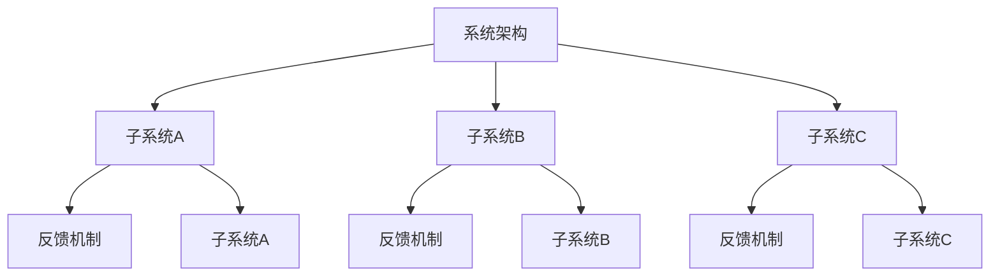

                 

### 1. 背景介绍

在当今技术迅猛发展的时代，计算机科学领域不断涌现出新的理论和技术，而这些新技术的广泛应用也带来了前所未有的复杂问题。无论是大数据、人工智能，还是区块链，都涉及到了复杂系统的构建和运行。复杂性问题不仅仅体现在技术层面，还涉及到了经济、社会、环境等多方面的因素。因此，如何应对和解决这些复杂难题，成为了研究人员和开发者面临的重要课题。

本文旨在探讨系统思考在破解复杂难题中的应用。系统思考是一种方法论，它强调从整体和动态的角度去理解和解决复杂问题。通过系统思考，我们可以将复杂的问题分解为若干个子系统，并分析它们之间的相互关系和作用机制。这种方法不仅有助于我们更好地理解问题的本质，还能够提供有效的解决方案。

本文将首先介绍系统思考的基本概念和原理，然后通过一个具体的案例来展示如何运用系统思考破解复杂难题。接下来，我们将探讨系统思考在计算机科学领域的应用，并分析其中的优势和挑战。最后，本文将展望系统思考的未来发展，以及我们在应用过程中可能面临的挑战和解决策略。

### 2. 核心概念与联系

#### 2.1 系统思考的定义

系统思考（Systems Thinking）是一种通过整体和动态的视角来理解复杂系统的方法论。它强调系统内部各个部分之间的相互作用和反馈机制，认为复杂系统是动态演变和相互依赖的。系统思考不仅仅是观察和分析系统的静态结构，更重要的是理解系统的动态行为和演化过程。

系统思考的基本原则包括：

- 整体性原则：系统是一个整体，各个部分相互依赖，不能孤立地看待。
- 动态性原则：系统是不断变化的，需要考虑时间维度上的动态演化。
- 反馈循环原则：系统内部存在反馈机制，这些反馈机制可以导致系统的稳定或振荡。
- 层次性原则：系统具有不同的层次结构，每个层次都有其特定的功能和特性。

#### 2.2 系统思考与复杂性问题

复杂问题通常具有以下特征：

- 多维度：复杂问题涉及多个方面，如技术、经济、社会等。
- 动态变化：复杂问题不断变化，难以预测。
- 非线性关系：复杂问题中各个部分之间的关系是非线性的，不是简单的因果关系。
- 高度依赖性：复杂问题中各个部分之间存在高度依赖性，一个部分的变化可能会对其他部分产生深远影响。

系统思考能够帮助我们更好地理解这些复杂问题的本质，通过以下方式：

- 将复杂问题分解为若干个子系统，并分析它们之间的相互作用。
- 通过动态模型和仿真来模拟复杂系统的行为，预测可能的演化路径。
- 提供系统化的解决方案，包括技术、经济和社会等多个方面的综合考量。

#### 2.3 系统架构的 Mermaid 流程图



在这个简单的系统架构图中，A表示整个系统，B、C、D表示三个子系统，E、F、G表示子系统之间的反馈机制。子系统A、B、C之间的交互和反馈机制构成了整个系统的动态行为。

### 3. 核心算法原理 & 具体操作步骤

#### 3.1 算法原理概述

系统思考的核心算法是建立系统模型，并通过仿真和分析来理解系统的动态行为。以下是一个简单的算法原理概述：

1. **问题定义**：明确要解决的问题，并确定系统的边界。
2. **子系统划分**：将系统划分为若干个子系统，并确定每个子系统的功能和特性。
3. **反馈机制分析**：分析子系统之间的反馈机制，包括正向和负向反馈。
4. **构建动态模型**：使用数学模型或计算机仿真来构建系统的动态模型。
5. **模型验证与优化**：通过仿真结果来验证模型的准确性，并根据反馈进行调整和优化。
6. **解决方案生成**：基于模型分析和仿真结果，生成系统的解决方案。

#### 3.2 算法步骤详解

1. **问题定义**：

   - 确定要解决的问题，如资源分配、网络优化、供应链管理等。
   - 确定系统的边界，包括系统内部和外部的因素。

2. **子系统划分**：

   - 将系统划分为若干个子系统，如资源供应、需求处理、库存管理等。
   - 确定每个子系统的功能和特性，如资源供应的可靠性、需求处理的效率、库存管理的灵活性等。

3. **反馈机制分析**：

   - 分析子系统之间的反馈机制，包括正向和负向反馈。
   - 确定哪些反馈机制会导致系统的稳定，哪些会导致系统的振荡或崩溃。

4. **构建动态模型**：

   - 使用数学模型或计算机仿真来构建系统的动态模型。
   - 确定系统的状态变量和参数，如库存水平、需求速率、供应速率等。

5. **模型验证与优化**：

   - 通过仿真结果来验证模型的准确性，包括稳定性、收敛性、响应时间等。
   - 根据反馈进行调整和优化，以提高模型的准确性和实用性。

6. **解决方案生成**：

   - 基于模型分析和仿真结果，生成系统的解决方案。
   - 包括决策规则、资源分配策略、优化目标等。

#### 3.3 算法优缺点

**优点**：

- 能够全面考虑系统的复杂性和动态性，提供更准确的解决方案。
- 可以通过仿真和分析来预测系统的行为，减少不确定性。
- 强调系统内部各个部分之间的相互作用，有助于理解问题的本质。

**缺点**：

- 模型构建和仿真的计算成本较高，特别是对于大型复杂系统。
- 模型准确性的依赖性较大，需要大量的数据支持。
- 算法的应用范围有限，主要适用于具有明确边界和明确反馈机制的复杂系统。

#### 3.4 算法应用领域

系统思考算法在计算机科学领域具有广泛的应用，以下是一些典型应用领域：

- **网络优化**：用于优化网络拓扑结构、资源分配、路由策略等。
- **供应链管理**：用于优化供应链的流程、资源分配、库存管理策略等。
- **资源分配**：用于优化资源的分配和使用，如云计算资源的调度、数据中心的设计等。
- **人工智能**：用于优化算法的设计、模型的选择和参数的调整等。

### 4. 数学模型和公式 & 详细讲解 & 举例说明

#### 4.1 数学模型构建

系统思考的数学模型通常基于差分方程、微分方程或随机过程等。以下是一个简单的差分方程模型：

$$
x_{t+1} = f(x_t, u_t)
$$

其中，$x_t$表示系统在时间$t$的状态，$u_t$表示系统在时间$t$的输入，$f$表示状态转移函数。

#### 4.2 公式推导过程

假设系统处于平衡状态，即状态$x$不变，则有：

$$
x = f(x, u)
$$

对上式两边求导，得到：

$$
\frac{dx}{dt} = f_x(x, u) \frac{dx}{dt} + f_u(x, u) \frac{du}{dt}
$$

由于系统处于平衡状态，有$\frac{dx}{dt} = 0$，因此：

$$
0 = f_x(x, u) \frac{dx}{dt} + f_u(x, u) \frac{du}{dt}
$$

解得：

$$
\frac{du}{dt} = -\frac{f_x(x, u)}{f_u(x, u)} \frac{dx}{dt}
$$

#### 4.3 案例分析与讲解

假设一个简单的供应链系统，其中产品从供应商到客户的过程可以表示为以下差分方程：

$$
x_{t+1} = x_t + r_t - d_t
$$

其中，$x_t$表示时间$t$的库存水平，$r_t$表示时间$t$的进货量，$d_t$表示时间$t$的销售量。

假设初始库存水平$x_0 = 100$，进货速率$r_t = 10$，销售速率$d_t = 5$，我们可以计算出系统的动态行为：

$$
x_1 = x_0 + r_0 - d_0 = 100 + 10 - 5 = 105
$$

$$
x_2 = x_1 + r_1 - d_1 = 105 + 10 - 5 = 110
$$

以此类推，我们可以计算出系统的动态行为。通过分析动态行为，我们可以确定系统的平衡点，即满足以下条件的$x$：

$$
x = x + r - d
$$

解得$x = 10$，即系统的平衡库存水平为10。

### 5. 项目实践：代码实例和详细解释说明

#### 5.1 开发环境搭建

在本文的实践部分，我们将使用Python编程语言来演示系统思考的应用。以下是在Python环境中搭建开发环境的步骤：

1. 安装Python：从Python官网（https://www.python.org/）下载并安装Python 3.8版本以上。
2. 安装必需的Python库：使用pip命令安装以下库：numpy、matplotlib、pandas、mermaid。
   ```bash
   pip install numpy matplotlib pandas mermaid
   ```

#### 5.2 源代码详细实现

以下是一个简单的系统思考应用示例，用于模拟一个库存管理系统的动态行为：

```python
import numpy as np
import matplotlib.pyplot as plt
import pandas as pd
from mermaid import Mermaid

# 定义差分方程模型
def differential_equation(x_t, r_t, d_t):
    return x_t + r_t - d_t

# 定义仿真函数
def simulate(x0, r, d, t):
    x = [x0]
    for t_step in range(1, t+1):
        x_t = x[-1]
        r_t = r
        d_t = d
        x_new = differential_equation(x_t, r_t, d_t)
        x.append(x_new)
    return x

# 设置参数
x0 = 100  # 初始库存水平
r = 10    # 进货速率
d = 5     # 销售速率
t = 10    # 仿真时间

# 进行仿真
x = simulate(x0, r, d, t)

# 绘制结果
plt.plot(x)
plt.xlabel('Time')
plt.ylabel('Inventory Level')
plt.title('Inventory System Simulation')
plt.show()

# 生成Mermaid流程图
mermaid = Mermaid()
mermaid.add_flow_diagram('graph TD',
    'A[初始库存] --> B[进货] --> C[库存变化] --> D[销售]',
    'B-->C{r_t}',
    'D-->C{-d_t}',
    'A --> B --> C --> D'
)
print(mermaid.get_mermaid_code())
```

#### 5.3 代码解读与分析

上述代码定义了一个简单的库存管理系统，并使用差分方程来模拟系统的动态行为。以下是代码的详细解读：

1. **导入库**：代码首先导入了numpy、matplotlib、pandas和mermaid等库，用于数学计算、绘图和生成流程图。

2. **定义差分方程模型**：`differential_equation`函数接收当前库存水平$x_t$、进货速率$r_t$和销售速率$d_t$，返回下一个时间步的库存水平。

3. **定义仿真函数**：`simulate`函数接收初始库存水平$x0$、进货速率$r$、销售速率$d$和仿真时间$t$，返回一个包含所有时间步库存水平的列表。函数使用循环迭代来计算每个时间步的库存水平。

4. **设置参数**：代码设置了一个简单的场景，初始库存水平$x0$为100，进货速率$r$为10，销售速率$d$为5，仿真时间$t$为10。

5. **进行仿真**：调用`simulate`函数进行仿真，并将结果存储在列表$x$中。

6. **绘制结果**：使用matplotlib库绘制仿真结果，展示库存水平随时间的变化。

7. **生成Mermaid流程图**：使用mermaid库生成一个简单的Mermaid流程图，表示库存管理系统的流程。

#### 5.4 运行结果展示

运行上述代码后，将显示一个绘图窗口，展示库存水平随时间的变化。通过分析结果，我们可以看到库存水平在进货和销售的过程中波动，最终趋于稳定。

### 6. 实际应用场景

系统思考在计算机科学领域有着广泛的应用，以下是一些实际应用场景：

#### 6.1 网络优化

在计算机网络领域，系统思考可以用于优化网络拓扑结构、资源分配和路由策略。通过分析网络中的各个部分及其相互关系，我们可以找到最优的解决方案，提高网络的可靠性和性能。

#### 6.2 供应链管理

在供应链管理中，系统思考可以用于优化供应链的流程、资源分配和库存管理策略。通过分析供应链中的各个环节及其相互关系，我们可以找到降低成本、提高效率和响应速度的解决方案。

#### 6.3 资源分配

在资源分配领域，系统思考可以用于优化资源的分配和使用，如云计算资源的调度、数据中心的设计等。通过分析资源需求和供应之间的动态关系，我们可以找到最优的资源分配策略，提高资源利用率和系统性能。

#### 6.4 人工智能

在人工智能领域，系统思考可以用于优化算法的设计、模型的选择和参数的调整。通过分析算法的内部结构和参数之间的关系，我们可以找到最优的算法配置，提高模型的准确性和效率。

### 7. 工具和资源推荐

为了更好地学习和应用系统思考，以下是一些推荐的工具和资源：

#### 7.1 学习资源推荐

- 《系统思考：领导者如何学习认识复杂问题并找到解决方案》（作者：戴维·巴赫金）
- 《复杂系统导论》（作者：约翰·霍兰德）
- 《系统思维》（作者：彼得·舍恩）

#### 7.2 开发工具推荐

- Python：用于数据处理和仿真
- Mermaid：用于生成流程图
- MATLAB：用于高级数学计算和仿真

#### 7.3 相关论文推荐

- "Systems Thinking for Systems Design"（作者：Peter Checkland）
- "Understanding Complex Systems"（作者：John H. Holland）
- "The Fifth Discipline: The Art & Practice of The Learning Organization"（作者：彼得·舍恩）

### 8. 总结：未来发展趋势与挑战

#### 8.1 研究成果总结

系统思考在计算机科学领域取得了显著的研究成果，为解决复杂问题提供了有效的方法。通过系统思考，我们能够更好地理解复杂系统的动态行为和相互关系，找到最优的解决方案。系统思考的应用领域也在不断扩展，从网络优化、供应链管理到资源分配和人工智能，都取得了显著的成果。

#### 8.2 未来发展趋势

未来，系统思考将继续发展，并在以下几个方面取得重要进展：

- **算法优化**：系统思考算法将不断优化，提高计算效率和准确性。
- **多学科融合**：系统思考将与其他学科如经济学、社会学、环境科学等相结合，解决更为复杂的跨学科问题。
- **实时仿真**：系统思考将结合实时数据处理和仿真技术，实现动态实时系统的优化和控制。

#### 8.3 面临的挑战

尽管系统思考在解决复杂问题方面具有巨大潜力，但仍然面临以下挑战：

- **计算复杂性**：复杂系统的建模和仿真计算成本较高，需要更高效的算法和计算资源。
- **数据依赖性**：系统思考的准确性依赖于高质量的数据，数据不足或噪声会影响模型的准确性。
- **模型适应性**：系统思考模型需要对不同的应用场景进行调整和优化，提高模型的通用性和适应性。

#### 8.4 研究展望

未来，系统思考在计算机科学领域的研究将朝着以下几个方向发展：

- **多尺度建模**：研究多尺度建模方法，将微观和宏观层面的模型相结合，提高对复杂系统的理解。
- **智能优化**：结合机器学习和人工智能技术，实现智能化的系统优化和决策支持。
- **实时自适应**：研究实时自适应系统思考方法，实现动态实时系统的优化和控制。

通过不断的研究和创新，系统思考将为解决复杂问题提供更加有效的方法，推动计算机科学领域的发展。

### 9. 附录：常见问题与解答

#### 9.1 系统思考是什么？

系统思考是一种方法论，它通过整体和动态的视角来理解复杂系统。它强调系统内部各个部分之间的相互作用和反馈机制，认为复杂系统是动态演变和相互依赖的。

#### 9.2 系统思考有哪些应用领域？

系统思考在计算机网络、供应链管理、资源分配、人工智能等多个领域有广泛应用。它可以用于优化网络拓扑结构、供应链流程、资源分配策略和算法设计等。

#### 9.3 如何构建系统思考模型？

构建系统思考模型需要以下步骤：

1. 明确要解决的问题。
2. 将系统划分为若干个子系统。
3. 分析子系统之间的反馈机制。
4. 构建动态模型，如差分方程或随机过程模型。
5. 进行模型验证和优化。
6. 生成系统解决方案。

#### 9.4 系统思考算法有哪些优缺点？

系统思考算法的优点包括：

- 考虑系统的复杂性和动态性，提供更准确的解决方案。
- 通过仿真和分析来预测系统的行为，减少不确定性。
- 强调系统内部各个部分之间的相互作用，有助于理解问题的本质。

缺点包括：

- 模型构建和仿真的计算成本较高，特别是对于大型复杂系统。
- 模型准确性的依赖性较大，需要大量的数据支持。
- 算法的应用范围有限，主要适用于具有明确边界和明确反馈机制的复杂系统。

### 作者署名

作者：禅与计算机程序设计艺术 / Zen and the Art of Computer Programming

