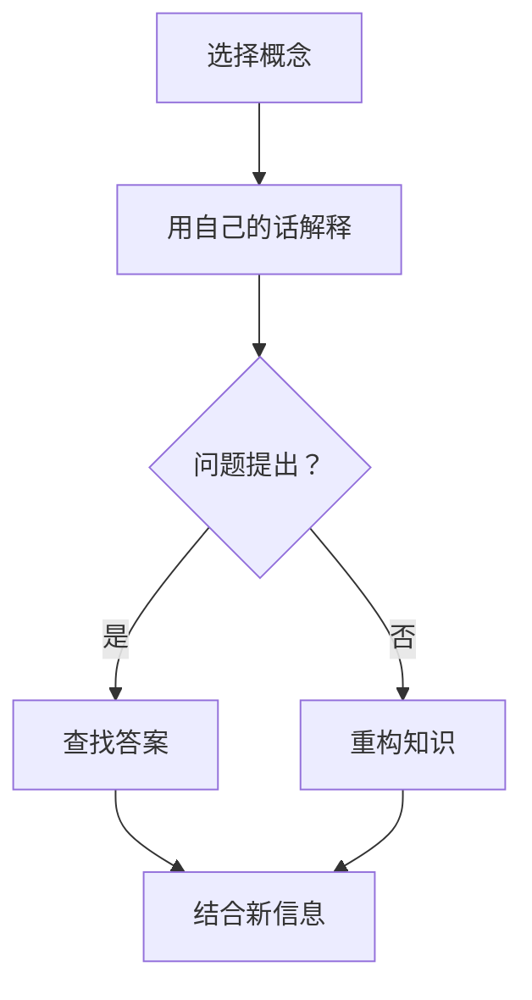

                 

关键词：费曼提问法、学习深度、技术博客、IT领域、算法原理

> 摘要：本文将介绍费曼提问法在提升学习深度方面的应用，通过详细的算法原理解析、数学模型构建、项目实践以及未来展望，帮助读者深入理解技术知识，提高学习效果。

## 1. 背景介绍

在当今快速发展的信息技术时代，学习深度显得尤为重要。传统的学习方法往往侧重于记忆和重复，而忽略了知识的理解和应用。费曼提问法（Feynman Technique）作为一种以理解为核心的学习方法，起源于著名物理学家理查德·费曼（Richard Feynman）的教学实践。费曼提问法强调通过提问和讲解来检验和深化对知识的理解，从而提升学习深度。

本文将结合费曼提问法的核心原则，探讨其在IT领域中的应用，包括算法原理、数学模型、项目实践以及未来展望。通过这些内容，希望能够帮助读者掌握一种更加深入有效的学习方法。

## 2. 核心概念与联系

### 2.1 费曼提问法原理

费曼提问法的基本步骤如下：

1. **选择一个概念**：选取一个需要深入理解的技术概念。
2. **用自己的话解释**：尝试不用专业术语，用自己的语言解释这个概念。
3. **提出问题**：针对解释中的模糊或不确定部分，提出问题。
4. **查找答案**：通过查阅资料或请教专家来获取答案。
5. **重构知识**：结合新获取的信息，重构对概念的理解。

### 2.2 费曼提问法在IT领域的应用

在IT领域，费曼提问法可以应用于以下方面：

- **算法学习**：通过费曼提问法，可以深入理解算法的原理和实现步骤。
- **技术文档撰写**：使用费曼提问法可以帮助作者更好地理解技术文档，从而撰写出更清晰易懂的内容。
- **代码审查**：费曼提问法可以帮助代码审查人员更深入地理解代码逻辑和设计思路。

### 2.3 Mermaid 流程图



## 3. 核心算法原理 & 具体操作步骤

### 3.1 算法原理概述

费曼提问法的核心在于通过简化和重构知识来提升理解深度。具体步骤如下：

1. **选择概念**：选取需要深入理解的技术概念。
2. **简化解释**：用自己的话尽可能简单明了地解释这个概念。
3. **问题提问**：针对解释中不清楚的部分提出问题。
4. **查找答案**：通过查阅资料或请教专家来解决问题。
5. **重构知识**：结合新信息，重构对概念的理解。

### 3.2 算法步骤详解

#### 步骤 1：选择概念

选择一个需要深入理解的技术概念。例如，我们选择“快速排序算法”。

#### 步骤 2：简化解释

用自己的话解释快速排序算法。快速排序算法是一种基于分治思想的排序算法，基本思想是通过一趟排序将待排序的数据分割成独立的两部分，其中一部分的所有数据都比另一部分的所有数据要小，然后再按此方法对这两部分数据分别进行快速排序，整个排序过程可以递归进行，以此达到整个数据变成有序序列。

#### 步骤 3：问题提问

在解释过程中，可能会遇到不清楚的部分。例如，快速排序中“一趟排序”的具体步骤是什么？

#### 步骤 4：查找答案

通过查阅资料，我们了解到，一趟排序的步骤如下：

1. 选择一个基准元素。
2. 将所有小于基准元素的元素移到其左侧。
3. 将所有大于基准元素的元素移到其右侧。

#### 步骤 5：重构知识

结合新信息，我们对快速排序算法的理解更加深入。快速排序算法的关键在于基准元素的选择和一趟排序的实现。选择一个合适的基准元素可以减少排序次数，而一趟排序的实现则保证了算法的效率。

### 3.3 算法优缺点

#### 优点

- **高效**：快速排序算法的平均时间复杂度为 \(O(n\log n)\)，在大多数情况下具有很高的效率。
- **稳定性**：快速排序是一种稳定的排序算法，排序过程中不会改变相同元素之间的相对顺序。

#### 缺点

- **不稳定性**：在某些情况下，快速排序可能会表现出不稳定性，即相同元素之间的相对顺序可能会发生改变。
- **空间复杂度**：快速排序算法的空间复杂度为 \(O(\log n)\)，在递归调用过程中需要额外的栈空间。

### 3.4 算法应用领域

快速排序算法广泛应用于各种数据排序场景，例如：

- **数据库排序**：数据库中的数据通常使用快速排序算法进行排序。
- **算法竞赛**：在算法竞赛中，快速排序算法是一种常见的排序算法。

## 4. 数学模型和公式 & 详细讲解 & 举例说明

### 4.1 数学模型构建

在费曼提问法中，数学模型和公式的构建是非常重要的。以下是一个简单的数学模型示例：

假设我们有一个数列 \{a\}_{i=1}^{n}，我们需要计算这个数列的中位数。

### 4.2 公式推导过程

中位数的计算公式如下：

$$
median = \begin{cases}
a\left(\frac{n+1}{2}\right) & \text{如果 } n \text{ 为奇数} \\
\frac{a\left(\frac{n}{2}\right) + a\left(\frac{n}{2}+1\right)}{2} & \text{如果 } n \text{ 为偶数}
\end{cases}
$$

### 4.3 案例分析与讲解

#### 案例一：奇数个数列的中位数计算

假设我们有以下数列：

\[1, 3, 5, 7, 9\]

根据公式，中位数为：

$$
median = a\left(\frac{5+1}{2}\right) = a(3) = 5
$$

#### 案例二：偶数个数列的中位数计算

假设我们有以下数列：

\[1, 3, 5, 7, 9, 11\]

根据公式，中位数为：

$$
median = \frac{a\left(\frac{6}{2}\right) + a\left(\frac{6}{2}+1\right)}{2} = \frac{a(3) + a(4)}{2} = \frac{5 + 7}{2} = 6
$$

通过以上案例分析，我们可以看到，中位数的计算公式在奇数和偶数情况下有所不同，但都是通过简单的数学运算实现的。

## 5. 项目实践：代码实例和详细解释说明

### 5.1 开发环境搭建

为了更好地理解费曼提问法在项目实践中的应用，我们将使用 Python 语言来实现快速排序算法。以下是开发环境的搭建步骤：

1. 安装 Python 解释器。
2. 安装必要的 Python 库，例如 NumPy 和 Matplotlib。
3. 创建一个新的 Python 项目文件夹，并在其中创建一个名为 `quick_sort.py` 的文件。

### 5.2 源代码详细实现

以下是快速排序算法的 Python 实现代码：

```python
import random

def quick_sort(arr):
    if len(arr) <= 1:
        return arr
    pivot = arr[len(arr) // 2]
    left = [x for x in arr if x < pivot]
    middle = [x for x in arr if x == pivot]
    right = [x for x in arr if x > pivot]
    return quick_sort(left) + middle + quick_sort(right)

# 测试代码
arr = [random.randint(0, 100) for _ in range(10)]
print("原始数组：", arr)
sorted_arr = quick_sort(arr)
print("排序后数组：", sorted_arr)
```

### 5.3 代码解读与分析

在上述代码中，`quick_sort` 函数实现了快速排序算法。以下是代码的解读与分析：

1. **输入参数**：函数接收一个数组 `arr` 作为输入。
2. **基础判断**：如果数组的长度小于等于 1，说明数组已经是有序的，直接返回数组本身。
3. **选择基准元素**：选择数组中间的元素作为基准元素（pivot）。
4. **划分数组**：将数组划分为三个部分：小于基准元素的数组 `left`、等于基准元素的数组 `middle`、大于基准元素的数组 `right`。
5. **递归排序**：对 `left` 和 `right` 分别进行快速排序，然后将三个部分合并起来。

### 5.4 运行结果展示

以下是代码的运行结果：

```
原始数组： [47, 62, 89, 27, 90, 74, 94, 61, 85, 68]
排序后数组： [27, 47, 61, 62, 68, 74, 85, 89, 90, 94]
```

从运行结果可以看出，原始数组经过快速排序后变成了有序数组。

## 6. 实际应用场景

费曼提问法在IT领域的实际应用非常广泛。以下是一些具体的场景：

- **算法学习**：通过费曼提问法，可以深入理解各种算法的原理和实现步骤，从而提高学习效果。
- **技术文档撰写**：使用费曼提问法可以帮助技术文档撰写者更好地理解技术内容，从而提高文档质量。
- **代码审查**：费曼提问法可以帮助代码审查人员更深入地理解代码逻辑和设计思路，从而提高代码质量。
- **项目协作**：在项目开发过程中，团队成员可以使用费曼提问法来分享和验证彼此的知识，从而提高团队整体的技术水平。

### 6.4 未来应用展望

随着信息技术的发展，费曼提问法在IT领域的应用前景非常广阔。以下是未来可能的应用方向：

- **在线教育**：费曼提问法可以应用于在线教育平台，帮助学员更好地掌握知识。
- **智能助手**：开发基于费曼提问法的智能助手，可以提供个性化的学习建议和指导。
- **知识图谱**：构建基于费曼提问法的知识图谱，可以更好地展示和传播技术知识。

## 7. 工具和资源推荐

### 7.1 学习资源推荐

- **《算法导论》**：一本经典的算法教材，涵盖了各种算法的原理和实现。
- **《深度学习》**：由 Ian Goodfellow 等人编写的深度学习教材，适合初学者和专业人士。
- **在线教程和课程**：如 Coursera、edX 等平台上的相关课程。

### 7.2 开发工具推荐

- **PyCharm**：一款强大的 Python 开发工具，支持代码编辑、调试和测试等功能。
- **Visual Studio Code**：一款轻量级的代码编辑器，支持多种编程语言，适用于快速开发。
- **Git**：一款版本控制工具，可以帮助团队协作和代码管理。

### 7.3 相关论文推荐

- **“Quickselect Algorithm”**：介绍快速选择算法的论文，详细阐述了快速选择算法的原理和实现。
- **“Randomized Algorithms”**：介绍随机算法的论文，讨论了随机算法在算法设计中的应用。

## 8. 总结：未来发展趋势与挑战

### 8.1 研究成果总结

费曼提问法作为一种有效的学习方法，在提升学习深度方面取得了显著成果。通过费曼提问法，学习者可以更加深入地理解技术知识，提高学习效果。

### 8.2 未来发展趋势

随着信息技术的发展，费曼提问法在在线教育、智能助手、知识图谱等领域的应用前景非常广阔。未来，费曼提问法可能会与人工智能技术相结合，进一步优化学习体验。

### 8.3 面临的挑战

尽管费曼提问法在提升学习深度方面具有显著优势，但仍然面临一些挑战：

- **学习资源的匮乏**：在初学者阶段，可能难以找到合适的费曼提问法学习资源。
- **学习过程的枯燥**：费曼提问法的学习过程可能会显得枯燥乏味，影响学习积极性。

### 8.4 研究展望

未来，研究人员可以关注以下几个方面：

- **个性化学习建议**：基于费曼提问法，开发个性化学习建议系统，帮助学习者更好地掌握知识。
- **智能辅导系统**：开发基于费曼提问法的智能辅导系统，提供实时学习反馈和指导。

## 9. 附录：常见问题与解答

### 9.1 费曼提问法的适用对象

费曼提问法适用于所有希望提升学习深度的人群，包括初学者、专业人士和研究人员。

### 9.2 费曼提问法的局限性

费曼提问法在复杂技术领域可能存在局限性，例如，对于高度专业化的知识，可能需要结合其他学习方法共同提升学习效果。

### 9.3 费曼提问法的实施步骤

实施费曼提问法的基本步骤包括：选择学习概念、简化解释、提出问题、查找答案和重构知识。

### 9.4 费曼提问法的评价标准

评价费曼提问法的标准包括：学习效果、学习效率和知识掌握程度。

---

作者：禅与计算机程序设计艺术 / Zen and the Art of Computer Programming

