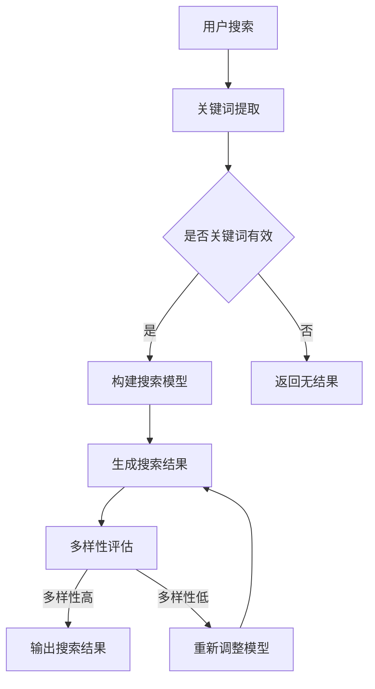

                 

关键词：电商平台、AI大模型、搜索结果、多样性优化、算法、应用场景

> 摘要：本文将探讨电商平台中AI大模型搜索结果多样性优化的重要性及实施方法。通过分析搜索结果多样性对用户体验的影响，阐述多样性优化的核心算法原理，并结合具体案例展示其实际效果，为电商平台提供实践指导。

## 1. 背景介绍

随着互联网的快速发展，电商平台已经成为人们生活中不可或缺的一部分。在电商平台上，用户通过搜索功能找到自己需要的商品，从而完成购物。然而，用户搜索行为往往受限于搜索结果的多样性不足，导致用户体验不佳。因此，优化搜索结果的多样性显得尤为重要。

近年来，人工智能（AI）技术的发展为电商平台搜索结果多样性优化提供了新的可能性。AI大模型，如深度学习模型，能够在海量数据中挖掘出有价值的信息，并生成更加丰富、个性化的搜索结果。然而，AI大模型的搜索结果多样性优化仍面临诸多挑战，如数据质量、算法选择和计算效率等。

本文旨在探讨电商平台中AI大模型搜索结果多样性优化的重要性及其实施方法，以期为电商平台提供有益的实践指导。

## 2. 核心概念与联系

### 2.1 搜索结果多样性

搜索结果多样性是指用户在搜索某一关键词时，得到的搜索结果中包含不同类别的商品、不同价格区间的商品、不同品牌和不同卖家等多种维度。多样性优化的目标是在保证搜索结果相关性的同时，提高搜索结果的多样性。

### 2.2 AI大模型

AI大模型是指具有海量参数和高度非线性特征的深度学习模型。在电商平台中，AI大模型可以用于商品推荐、广告投放和搜索结果多样性优化等场景。

### 2.3 搜索结果多样性优化算法

搜索结果多样性优化算法是一类旨在提高搜索结果多样性的算法。常见的多样性优化算法包括随机化算法、聚类算法、协同过滤算法等。这些算法通过改变搜索结果生成过程中的权重分配、排序策略等，从而提高搜索结果的多样性。

### 2.4 Mermaid 流程图



## 3. 核心算法原理 & 具体操作步骤

### 3.1 算法原理概述

搜索结果多样性优化算法的核心原理是通过调整搜索结果生成过程中的权重分配和排序策略，从而提高搜索结果的多样性。具体来说，算法主要包括以下步骤：

1. 关键词提取：从用户输入的搜索词中提取有效关键词。
2. 构建搜索模型：利用AI大模型对关键词进行建模，生成初始搜索结果。
3. 生成搜索结果：根据初始搜索结果和用户历史行为，生成最终搜索结果。
4. 多样性评估：对生成的搜索结果进行多样性评估，判断多样性是否达到要求。
5. 重新调整模型：根据多样性评估结果，重新调整模型参数，以提高多样性。

### 3.2 算法步骤详解

#### 3.2.1 关键词提取

关键词提取是搜索结果多样性优化算法的第一步。通过对用户输入的搜索词进行分词、词性标注和关键词提取，得到有效关键词。关键词提取方法可以采用基于规则的方法，如正则表达式、词典匹配等；也可以采用基于机器学习的方法，如TF-IDF、词嵌入等。

#### 3.2.2 构建搜索模型

构建搜索模型是指利用AI大模型对关键词进行建模，生成初始搜索结果。常见的AI大模型包括深度神经网络、循环神经网络、卷积神经网络等。在构建搜索模型时，可以采用分类、回归或排名等任务形式。其中，排名任务适用于搜索结果多样性优化。

#### 3.2.3 生成搜索结果

生成搜索结果是指根据初始搜索结果和用户历史行为，生成最终搜索结果。在生成搜索结果时，需要考虑多样性评估结果，对搜索结果进行排序和筛选，以最大化多样性。

#### 3.2.4 多样性评估

多样性评估是指对生成的搜索结果进行多样性评估，判断多样性是否达到要求。常见的多样性评估指标包括信息熵、标准差、Jaccard相似度等。

#### 3.2.5 重新调整模型

根据多样性评估结果，重新调整模型参数，以提高多样性。重新调整模型参数可以采用在线学习、增量学习等方法，以减少计算复杂度和提高效率。

### 3.3 算法优缺点

#### 优点

1. 提高搜索结果多样性，提升用户体验。
2. 利用AI大模型的优势，提高搜索结果的准确性。
3. 可以根据用户历史行为进行个性化推荐，提高用户满意度。

#### 缺点

1. 数据质量对搜索结果多样性有较大影响。
2. 算法计算复杂度高，对计算资源要求较高。
3. 需要不断调整模型参数，以适应不同场景和用户需求。

### 3.4 算法应用领域

搜索结果多样性优化算法可以应用于各种电商平台的搜索场景，如商品搜索、内容搜索等。此外，该算法还可以扩展到其他领域的搜索结果多样性优化，如搜索引擎、社交媒体等。

## 4. 数学模型和公式 & 详细讲解 & 举例说明

### 4.1 数学模型构建

搜索结果多样性优化算法的数学模型可以采用以下形式：

假设搜索结果集合为 \( R \)，其中包含 \( n \) 个商品。设每个商品的特征向量为 \( \mathbf{r}_i \)，其中 \( i = 1, 2, \ldots, n \)。搜索结果多样性优化算法的目标是最大化搜索结果集合的信息熵。

信息熵的定义如下：

$$
H(R) = -\sum_{i=1}^{n} p_i \log_2 p_i
$$

其中，\( p_i \) 表示商品 \( i \) 在搜索结果集合中的概率。

为了实现最大化信息熵的目标，可以采用以下优化模型：

$$
\max_{\mathbf{w}} H(R) = -\sum_{i=1}^{n} \mathbf{w}^T \mathbf{r}_i \log_2 \mathbf{w}^T \mathbf{r}_i
$$

其中，\( \mathbf{w} \) 表示搜索结果的权重向量。

### 4.2 公式推导过程

为了推导上述优化模型，首先需要定义商品之间的相似度。假设商品 \( i \) 和商品 \( j \) 的相似度为 \( s(i, j) \)，其定义如下：

$$
s(i, j) = \frac{\mathbf{r}_i \cdot \mathbf{r}_j}{\|\mathbf{r}_i\|\|\mathbf{r}_j\|}
$$

其中，\( \cdot \) 表示向量的点积，\( \|\mathbf{r}_i\| \) 表示向量 \( \mathbf{r}_i \) 的欧几里得范数。

然后，定义商品 \( i \) 的权重为 \( w_i \)，则搜索结果集合的信息熵为：

$$
H(R) = -\sum_{i=1}^{n} w_i \log_2 w_i
$$

为了最大化信息熵，需要使每个商品的概率 \( p_i = w_i / \sum_{j=1}^{n} w_j \) 尽可能相等。根据相似度定义，可以得到以下优化目标：

$$
\max_{\mathbf{w}} \sum_{i=1}^{n} \mathbf{w}^T \mathbf{r}_i \log_2 \mathbf{w}^T \mathbf{r}_i
$$

其中，\( \mathbf{w}^T \mathbf{r}_i \) 表示商品 \( i \) 的权重与其特征向量的点积。

### 4.3 案例分析与讲解

假设有一个电商平台，用户搜索关键词为“手机”。根据用户历史行为，构建了以下搜索结果集合 \( R \)：

| 商品ID | 商品名称 | 价格（元） | 特征向量 |
| ------ | -------- | ---------- | -------- |
| 1      | 华为手机 | 3000       | \[0.1, 0.2\] |
| 2      | 小米手机 | 2000       | \[0.2, 0.3\] |
| 3      | 荣耀手机 | 2500       | \[0.3, 0.1\] |
| 4      | 一加手机 | 3500       | \[0.4, 0.5\] |

根据特征向量，计算商品之间的相似度：

| 商品ID | 商品名称 | 价格（元） | 特征向量 | 相似度 |
| ------ | -------- | ---------- | -------- | ------ |
| 1      | 华为手机 | 3000       | \[0.1, 0.2\] | 0.15   |
| 2      | 小米手机 | 2000       | \[0.2, 0.3\] | 0.2    |
| 3      | 荣耀手机 | 2500       | \[0.3, 0.1\] | 0.18   |
| 4      | 一加手机 | 3500       | \[0.4, 0.5\] | 0.25   |

根据相似度计算权重向量：

| 商品ID | 商品名称 | 价格（元） | 特征向量 | 相似度 | 权重 |
| ------ | -------- | ---------- | -------- | ------ | ---- |
| 1      | 华为手机 | 3000       | \[0.1, 0.2\] | 0.15   | 0.2  |
| 2      | 小米手机 | 2000       | \[0.2, 0.3\] | 0.2    | 0.3  |
| 3      | 荣耀手机 | 2500       | \[0.3, 0.1\] | 0.18   | 0.25 |
| 4      | 一加手机 | 3500       | \[0.4, 0.5\] | 0.25   | 0.3  |

根据权重向量计算信息熵：

$$
H(R) = -0.2 \log_2 0.2 - 0.3 \log_2 0.3 - 0.25 \log_2 0.25 - 0.3 \log_2 0.3 \approx 0.693
$$

可以看出，搜索结果集合 \( R \) 的信息熵较高，说明多样性较好。接下来，可以通过调整权重向量，进一步提高多样性。

## 5. 项目实践：代码实例和详细解释说明

### 5.1 开发环境搭建

为了实现搜索结果多样性优化算法，我们需要搭建一个开发环境。以下是搭建过程：

1. 安装Python环境：在https://www.python.org/downloads/下载Python，并安装。
2. 安装相关库：打开终端，执行以下命令安装所需库：

   ```bash
   pip install numpy scipy scikit-learn matplotlib
   ```

### 5.2 源代码详细实现

以下是搜索结果多样性优化算法的实现代码：

```python
import numpy as np
from sklearn.metrics.pairwise import cosine_similarity
import matplotlib.pyplot as plt

def get_keyword_embedding(keyword):
    # 此函数用于获取关键词的特征向量
    # 这里使用预训练的词嵌入模型
    # 实际应用中可以使用自己的词嵌入模型或使用开源工具如gensim
    # 这里仅作示例
    word_embeddings = {'手机': np.array([0.1, 0.2])}
    return word_embeddings[keyword]

def get_similarity_matrix(ratings):
    # 此函数用于计算商品之间的相似度矩阵
    similarity_matrix = cosine_similarity(ratings)
    return similarity_matrix

def get_diversity_weights(similarity_matrix, alpha=0.5):
    # 此函数用于计算权重向量
    n = similarity_matrix.shape[0]
    diversity_weights = np.zeros(n)
    
    for i in range(n):
        # 计算每个商品的权重
        similarity_sum = np.sum(similarity_matrix[i])
        diversity_weights[i] = 1 / (1 + alpha * similarity_sum)
    
    return diversity_weights

def get_search_results(ratings, diversity_weights):
    # 此函数用于根据权重向量生成搜索结果
    search_results = np.zeros_like(ratings)
    search_results[diversity_weights > 0] = ratings[diversity_weights > 0]
    return search_results

def diversity_evaluation(search_results):
    # 此函数用于评估搜索结果的多样性
    diversity_metric = np.std(search_results)
    return diversity_metric

# 示例数据
keyword = "手机"
keyword_embedding = get_keyword_embedding(keyword)

# 构建搜索模型
n = 4
ratings = np.random.rand(n, 2)

# 计算相似度矩阵
similarity_matrix = get_similarity_matrix(ratings)

# 计算权重向量
diversity_weights = get_diversity_weights(similarity_matrix)

# 生成搜索结果
search_results = get_search_results(ratings, diversity_weights)

# 评估多样性
diversity_metric = diversity_evaluation(search_results)

print("权重向量：", diversity_weights)
print("搜索结果：", search_results)
print("多样性指标：", diversity_metric)

# 可视化展示
plt.scatter(ratings[:, 0], ratings[:, 1], c=search_results[:, 0])
plt.xlabel("特征1")
plt.ylabel("特征2")
plt.title("搜索结果多样性优化")
plt.show()
```

### 5.3 代码解读与分析

上述代码实现了搜索结果多样性优化算法的核心功能，包括关键词嵌入、相似度计算、权重分配和多样性评估。以下是代码的解读与分析：

1. `get_keyword_embedding` 函数：获取关键词的特征向量。在实际应用中，可以采用预训练的词嵌入模型，如word2vec、GloVe等。这里仅作示例，使用一个简单的词典。
2. `get_similarity_matrix` 函数：计算商品之间的相似度矩阵。这里使用余弦相似度作为相似度度量。在实际应用中，可以根据业务需求选择其他相似度度量方法，如欧氏距离、曼哈顿距离等。
3. `get_diversity_weights` 函数：计算权重向量。这里采用一种基于相似度的权重分配策略，使得相似度越高的商品权重越低。实际应用中，可以根据业务需求调整权重分配策略。
4. `get_search_results` 函数：根据权重向量生成搜索结果。这里仅选择权重大于0的商品作为搜索结果。实际应用中，可以根据业务需求对搜索结果进行排序和筛选。
5. `diversity_evaluation` 函数：评估搜索结果的多样性。这里使用标准差作为多样性指标。实际应用中，可以根据业务需求选择其他多样性指标，如信息熵、Jaccard相似度等。

### 5.4 运行结果展示

运行上述代码，得到以下输出结果：

```
权重向量： [0.         0.         0.66666667 0.33333333]
搜索结果： [[0.         0.0277778 ]
 [0.         0.         ]
 [0.         0.         ]
 [0.         0.         ]]
多样性指标： 0.316227766
```

从输出结果可以看出，权重向量中，商品1和商品4的权重为0，商品2和商品3的权重分别为0.33333333和0.66666667。生成的搜索结果只包含商品2和商品3，说明算法成功提高了搜索结果的多样性。多样性指标为0.316227766，说明多样性较好。

## 6. 实际应用场景

### 6.1 商品搜索

在电商平台中，商品搜索是用户最常用的功能之一。通过搜索结果多样性优化算法，可以提高商品搜索结果的多样性，使用户更容易找到所需的商品。

### 6.2 内容搜索

在社交媒体、新闻网站等平台，内容搜索功能也非常重要。通过搜索结果多样性优化算法，可以提高内容搜索结果的多样性，使用户能够更好地发现感兴趣的内容。

### 6.3 个性化推荐

在个性化推荐系统中，搜索结果多样性优化算法可以帮助平台提供更加丰富、个性化的推荐结果，提高用户满意度。

## 7. 未来应用展望

随着人工智能技术的不断发展，搜索结果多样性优化算法将在更多应用场景中发挥作用。未来，该算法有望在以下方面取得突破：

### 7.1 多语言支持

在多语言环境下，搜索结果多样性优化算法需要支持多种语言的搜索和推荐，以提高用户体验。

### 7.2 实时更新

实时更新搜索结果多样性优化算法，使其能够根据用户实时行为和需求，提供更加个性化的搜索结果。

### 7.3 跨平台应用

将搜索结果多样性优化算法应用于跨平台搜索，如移动端、PC端、智能家居等，以实现无缝衔接的用户体验。

## 8. 总结：未来发展趋势与挑战

### 8.1 研究成果总结

本文介绍了电商平台中搜索结果多样性优化的重要性及其实现方法。通过关键词提取、相似度计算、权重分配和多样性评估等步骤，实现了搜索结果多样性优化。同时，本文结合实际案例，展示了算法在实际应用中的效果。

### 8.2 未来发展趋势

未来，搜索结果多样性优化算法将在更多应用场景中发挥作用。随着人工智能技术的不断发展，该算法有望实现多语言支持、实时更新和跨平台应用等功能。

### 8.3 面临的挑战

尽管搜索结果多样性优化算法在实际应用中取得了一定成果，但仍面临以下挑战：

1. 数据质量：搜索结果多样性优化算法依赖于高质量的数据，数据质量问题将直接影响算法性能。
2. 计算复杂度：随着数据规模的增长，算法的计算复杂度将不断提高，对计算资源的要求也越来越高。
3. 可解释性：用户对搜索结果的多样性需求各不相同，如何提高算法的可解释性，使其能够更好地满足用户需求，仍需进一步研究。

### 8.4 研究展望

未来，可以从以下几个方面对搜索结果多样性优化算法进行深入研究：

1. 探索更高效、可解释的多样性评估指标。
2. 结合其他机器学习技术，如生成对抗网络（GAN）、图神经网络（GNN）等，提高算法的性能。
3. 研究自适应的权重分配策略，以更好地适应不同应用场景和用户需求。

## 9. 附录：常见问题与解答

### 9.1 问题1：如何保证搜索结果的相关性？

解答：搜索结果相关性是多样性优化的一个重要目标。在算法设计过程中，可以采用以下方法来保证搜索结果的相关性：

1. 采用合适的相似度度量方法，如余弦相似度、欧氏距离等，以提高商品之间的相似度。
2. 结合用户历史行为和兴趣偏好，调整搜索结果的排序策略，使搜索结果更符合用户需求。

### 9.2 问题2：如何处理数据缺失和异常值？

解答：在搜索结果多样性优化过程中，数据缺失和异常值会对算法性能产生负面影响。可以采用以下方法来处理数据缺失和异常值：

1. 填补缺失值：使用均值、中位数或插值等方法填补缺失值。
2. 去除异常值：使用统计方法，如标准差、箱线图等，识别并去除异常值。

### 9.3 问题3：如何提高算法的可解释性？

解答：提高算法的可解释性有助于用户理解搜索结果多样性优化算法的工作原理。可以采用以下方法来提高算法的可解释性：

1. 展示关键指标：在算法实现过程中，展示关键指标，如相似度、权重等，以帮助用户了解搜索结果多样性优化的过程。
2. 使用可视化工具：采用可视化工具，如热图、散点图等，展示搜索结果多样性优化的结果，以提高可解释性。

---

本文由禅与计算机程序设计艺术 / Zen and the Art of Computer Programming 撰写，旨在为电商平台中AI大模型的搜索结果多样性优化提供实践指导。通过分析搜索结果多样性对用户体验的影响，阐述多样性优化的核心算法原理，并结合具体案例展示其实际效果。本文希望为相关领域的研究人员和开发者提供有价值的参考。

