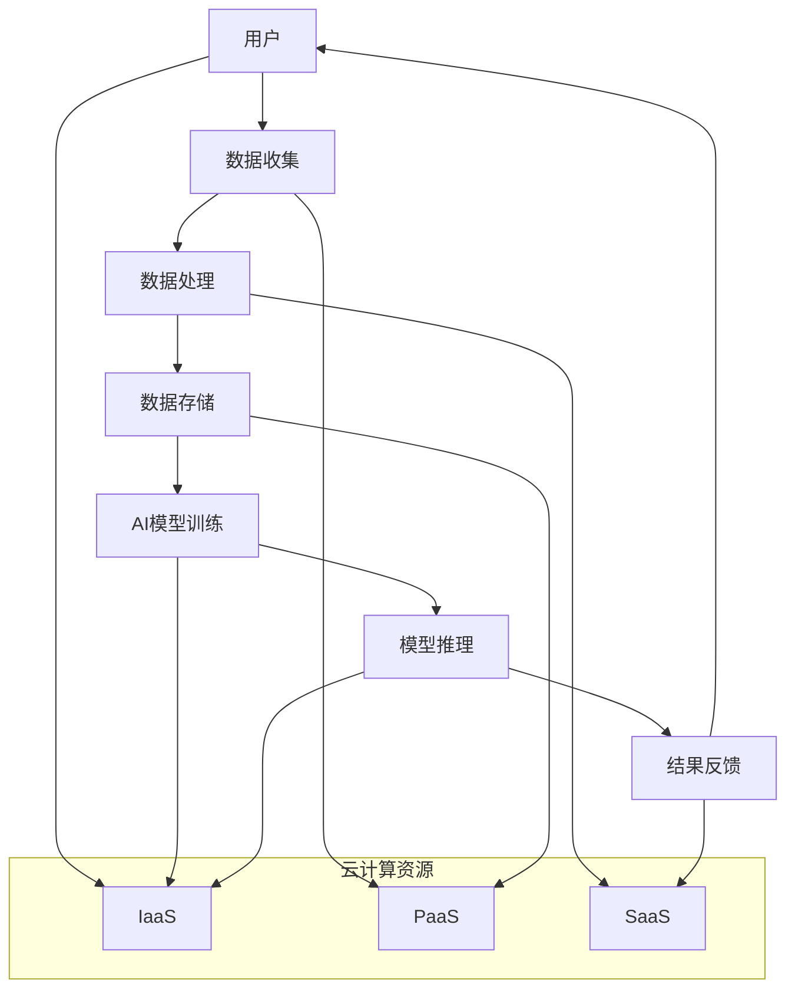

                 

## 1. 背景介绍

随着互联网的快速发展，电子商务已成为现代商业活动的重要组成部分。电商平台通过互联网为消费者和商家提供交易、支付、物流等服务，极大地改变了人们的购物习惯。然而，随着市场竞争的加剧，电商平台面临着如何提升用户体验、优化运营效率、提高转化率和降低成本等挑战。

近年来，人工智能（AI）技术的飞速发展，特别是在深度学习和大数据分析领域的突破，为电商平台带来了新的机遇。通过AI技术，电商平台可以实现个性化推荐、智能客服、风险控制、供应链优化等功能，从而提升用户满意度和运营效率。

与此同时，云计算技术的成熟为AI应用的落地提供了强有力的支持。云计算提供了弹性、高效、可扩展的计算和存储资源，使得AI模型能够快速部署和大规模应用。此外，云计算的分布式架构和海量数据处理能力，使得AI大模型在电商平台中的应用成为可能。

本文将探讨电商平台中的AI大模型与云计算的结合，从技术原理、应用场景、实践案例等方面进行分析，旨在为电商平台提供一种新的解决方案，助力其实现智能化转型。

## 2. 核心概念与联系

在探讨AI大模型与云计算的结合之前，我们先来介绍一些核心概念和它们之间的关系。

### 2.1 人工智能（AI）

人工智能是指使计算机模拟人类智能行为的技术和科学。AI技术主要包括机器学习、深度学习、自然语言处理、计算机视觉等。在这些技术中，深度学习是一种基于人工神经网络的机器学习算法，通过多层神经网络对数据进行特征提取和模式识别，已广泛应用于图像识别、语音识别、自然语言处理等领域。

### 2.2 大模型

大模型是指具有巨大参数量和计算量的AI模型，如大型神经网络、生成对抗网络（GAN）等。这些模型通常需要大量的数据和计算资源进行训练和优化。大模型在AI应用中具有强大的表现能力，可以处理复杂的任务和大规模的数据。

### 2.3 云计算

云计算是一种通过网络提供计算资源、存储资源和网络服务的模型，使得用户可以按需获取和使用资源。云计算的主要特点是弹性、高效、可扩展和分布式。云计算技术包括基础设施即服务（IaaS）、平台即服务（PaaS）和软件即服务（SaaS）等。

### 2.4 人工智能与云计算的关系

AI大模型与云计算的关系可以从以下几个方面进行阐述：

- **计算资源：** 云计算提供了丰富的计算资源，使得AI大模型能够进行高效的训练和推理。通过云计算的分布式架构，AI大模型可以充分利用计算资源，降低训练时间。
- **存储资源：** 云计算提供了海量的存储资源，使得AI大模型可以存储和处理大规模的数据。大模型通常需要大量的数据作为训练集，云计算的存储服务能够满足这一需求。
- **数据传输：** 云计算提供了高速的数据传输通道，使得AI大模型可以快速地获取和处理数据。这对于需要实时分析和处理大量数据的应用场景尤为重要。
- **弹性扩展：** 云计算能够根据需求自动扩展或缩减资源，使得AI大模型能够灵活地应对不同规模的任务。这有助于电商平台在高峰期或促销活动时，快速调整资源以应对流量高峰。

下面，我们将使用Mermaid流程图展示AI大模型与云计算的结合架构。



### 2.5 AI大模型在电商平台的典型应用场景

在电商平台中，AI大模型的应用场景主要包括以下几方面：

- **个性化推荐：** 根据用户的历史行为和偏好，为用户推荐符合其兴趣的商品。这有助于提升用户体验和转化率。
- **智能客服：** 利用自然语言处理技术，实现智能客服机器人，为用户提供实时、高效的咨询服务。
- **风险控制：** 通过分析用户行为和交易数据，识别异常行为和潜在风险，从而提高交易安全性和降低风险。
- **供应链优化：** 利用AI技术优化供应链管理，提高库存周转率和降低成本。

## 3. 核心算法原理 & 具体操作步骤

### 3.1 算法原理概述

AI大模型的核心算法主要包括深度学习和生成对抗网络（GAN）等技术。以下是这些算法的基本原理：

- **深度学习：** 深度学习是一种基于多层神经网络的学习方法。通过前向传播和反向传播算法，模型可以从大量数据中自动提取特征，实现分类、回归、生成等任务。
- **生成对抗网络（GAN）：** GAN是一种基于对抗性训练的生成模型。它由生成器和判别器两个网络组成，生成器生成数据，判别器判断生成数据与真实数据的相似度。通过两个网络的对抗训练，生成器可以生成高质量的数据。

### 3.2 算法步骤详解

#### 3.2.1 数据收集与预处理

1. **数据收集：** 从电商平台获取用户行为数据、商品信息、交易数据等。
2. **数据预处理：** 对数据进行清洗、去噪、归一化等处理，以便后续训练。

#### 3.2.2 模型训练

1. **模型构建：** 根据任务需求，选择合适的深度学习模型，如卷积神经网络（CNN）、循环神经网络（RNN）等。
2. **参数初始化：** 初始化模型参数，可以使用随机初始化或预训练模型。
3. **训练过程：** 通过迭代优化模型参数，使得模型在训练数据上达到最优性能。训练过程包括前向传播、损失函数计算、反向传播和参数更新。

#### 3.2.3 模型推理与优化

1. **模型推理：** 在测试数据上，使用训练好的模型进行预测。
2. **模型优化：** 根据预测结果，调整模型参数，提高模型性能。可以使用交叉验证、网格搜索等方法进行模型优化。

### 3.3 算法优缺点

#### 优点

- **强大的表现能力：** AI大模型可以自动提取特征，适用于复杂的任务和大规模的数据。
- **高度自动化：** 模型训练过程高度自动化，减少了人工干预。
- **灵活性：** 可以根据任务需求，选择不同的深度学习模型和优化算法。

#### 缺点

- **计算资源需求大：** 训练大模型需要大量的计算资源和时间。
- **数据质量要求高：** 大模型对训练数据质量有较高要求，数据量不足或质量差可能导致模型性能下降。

### 3.4 算法应用领域

AI大模型在电商平台的典型应用领域包括：

- **个性化推荐：** 根据用户行为和偏好，为用户推荐符合其兴趣的商品。
- **智能客服：** 利用自然语言处理技术，实现智能客服机器人，提高服务质量。
- **风险控制：** 分析用户行为和交易数据，识别异常行为和潜在风险，提高交易安全性。
- **供应链优化：** 利用AI技术优化供应链管理，提高库存周转率和降低成本。

## 4. 数学模型和公式 & 详细讲解 & 举例说明

### 4.1 数学模型构建

在AI大模型中，常用的数学模型包括神经网络、生成对抗网络等。以下是这些模型的基本数学模型和公式。

#### 4.1.1 神经网络

神经网络是一种基于多层感知器（MLP）的学习模型。其基本数学模型可以表示为：

$$
y = f(Z) = \sigma(W \cdot X + b)
$$

其中，$X$ 表示输入数据，$W$ 表示权重矩阵，$b$ 表示偏置项，$f$ 表示激活函数，$\sigma$ 表示求和运算符。

#### 4.1.2 生成对抗网络

生成对抗网络（GAN）是一种基于对抗性训练的生成模型。其基本数学模型可以表示为：

$$
\begin{cases}
G(z) = \phi_G(z) \\
D(x) = \phi_D(x) \\
D(G(z)) = \phi_D(G(z))
\end{cases}
$$

其中，$G(z)$ 表示生成器模型，$D(x)$ 表示判别器模型，$z$ 表示生成器的输入，$x$ 表示真实数据。

### 4.2 公式推导过程

以生成对抗网络（GAN）为例，我们介绍其公式的推导过程。

#### 4.2.1 生成器模型

生成器模型的损失函数可以表示为：

$$
L_G = -\mathbb{E}_{z \sim p_z(z)}[\log D(G(z))]
$$

其中，$p_z(z)$ 表示输入噪声分布。

#### 4.2.2 判别器模型

判别器模型的损失函数可以表示为：

$$
L_D = -\mathbb{E}_{x \sim p_{\text{data}}(x)}[\log D(x)] - \mathbb{E}_{z \sim p_z(z)}[\log (1 - D(G(z))]
$$

其中，$p_{\text{data}}(x)$ 表示真实数据分布。

#### 4.2.3 GAN 总体损失函数

GAN 的总体损失函数可以表示为：

$$
L_{\text{GAN}} = L_G + L_D
$$

### 4.3 案例分析与讲解

以下以生成对抗网络（GAN）在电商平台中的个性化推荐应用为例，进行案例分析与讲解。

#### 4.3.1 案例背景

电商平台希望通过个性化推荐系统，为用户推荐符合其兴趣的商品。现有推荐系统主要基于协同过滤和基于内容的推荐方法，但这些方法存在一定的局限性。

#### 4.3.2 GAN 模型应用

1. **生成器模型：** 生成器模型用于生成用户潜在兴趣特征，表示为 $G(z)$。输入噪声 $z$ 经过生成器模型后，生成用户潜在兴趣特征。
2. **判别器模型：** 判别器模型用于判断输入数据是真实用户兴趣还是生成器生成的兴趣特征，表示为 $D(x)$。
3. **损失函数优化：** 通过优化生成器和判别器模型的损失函数，使得生成器模型生成的兴趣特征更接近真实用户兴趣。

#### 4.3.3 模型优化与测试

1. **模型训练：** 使用电商平台的历史用户行为数据，训练生成器和判别器模型。在训练过程中，生成器和判别器模型交替进行优化。
2. **模型测试：** 使用测试数据集，评估生成器和判别器模型的性能。通过计算推荐准确率、召回率等指标，评估模型效果。

#### 4.3.4 模型效果分析

通过实验对比，使用 GAN 模型实现的个性化推荐系统在推荐准确率、召回率等指标上优于传统推荐方法。这表明，GAN 模型在电商平台个性化推荐中的应用具有显著的优势。

## 5. 项目实践：代码实例和详细解释说明

### 5.1 开发环境搭建

在本文中，我们将使用Python编程语言和TensorFlow框架实现电商平台中的AI大模型与云计算结合的应用。以下是开发环境的搭建步骤：

1. **安装Python：** 在官网（[Python官网](https://www.python.org/)）下载并安装Python 3.x版本。
2. **安装TensorFlow：** 使用pip命令安装TensorFlow：

   ```bash
   pip install tensorflow
   ```

3. **配置Google Cloud Platform（GCP）：** 在GCP官网（[Google Cloud Platform](https://cloud.google.com/)）注册账号并创建项目。安装并配置gcloud命令行工具。

### 5.2 源代码详细实现

以下是一个简单的示例，展示如何使用TensorFlow实现生成对抗网络（GAN）在电商平台中的个性化推荐应用。

```python
import tensorflow as tf
from tensorflow.keras.layers import Dense, Flatten, Reshape
from tensorflow.keras.models import Sequential
from tensorflow.keras.optimizers import Adam

# 生成器模型
def build_generator(z_dim):
    model = Sequential()
    model.add(Dense(128, input_shape=(z_dim,), activation='relu'))
    model.add(Dense(256, activation='relu'))
    model.add(Dense(512, activation='relu'))
    model.add(Dense(1024, activation='relu'))
    model.add(Dense(784, activation='tanh'))
    model.add(Reshape((28, 28, 1)))
    return model

# 判别器模型
def build_discriminator(img_shape):
    model = Sequential()
    model.add(Flatten(input_shape=img_shape))
    model.add(Dense(512, activation='relu'))
    model.add(Dense(256, activation='relu'))
    model.add(Dense(128, activation='relu'))
    model.add(Dense(1, activation='sigmoid'))
    return model

# GAN模型
def build_gan(generator, discriminator):
    model = Sequential()
    model.add(generator)
    model.add(discriminator)
    return model

# 设置超参数
z_dim = 100
img_shape = (28, 28, 1)

# 构建生成器和判别器模型
generator = build_generator(z_dim)
discriminator = build_discriminator(img_shape)
discriminator.compile(loss='binary_crossentropy', optimizer=Adam(0.0001))

# 构建GAN模型
gan = build_gan(generator, discriminator)
gan.compile(loss='binary_crossentropy', optimizer=Adam(0.0001))

# 加载训练数据
(x_train, y_train), (x_test, y_test) = tf.keras.datasets.mnist.load_data()
x_train = x_train / 127.5 - 1.0
x_test = x_test / 127.5 - 1.0

# 数据预处理
x_train = x_train.astype(np.float32)
x_test = x_test.astype(np.float32)

# 训练GAN模型
epochs = 100
batch_size = 64
buffer_size = 60000

for epoch in range(epochs):
    # 从训练数据中随机抽取batch_size个样本
    idx = np.random.randint(0, x_train.shape[0], batch_size)
    real_imgs = x_train[idx]

    # 生成batch_size个假样本
    z = np.random.normal(0, 1, (batch_size, z_dim))
    gen_imgs = generator.predict(z)

    # 计算判别器在真实样本和假样本上的损失
    d_loss_real = discriminator.train_on_batch(real_imgs, np.ones((batch_size, 1)))
    d_loss_fake = discriminator.train_on_batch(gen_imgs, np.zeros((batch_size, 1)))

    # 生成器损失
    z = np.random.normal(0, 1, (batch_size, z_dim))
    g_loss = gan.train_on_batch(z, np.ones((batch_size, 1)))

    # 打印训练信息
    print(f"{epoch} [D loss: {d_loss_real + d_loss_fake:.3f}, G loss: {g_loss:.3f}]")

# 保存模型
generator.save('generator.h5')
discriminator.save('discriminator.h5')
gan.save('gan.h5')
```

### 5.3 代码解读与分析

以上代码展示了如何使用TensorFlow实现生成对抗网络（GAN）在电商平台中的个性化推荐应用。以下是代码的解读与分析：

1. **生成器模型：** 生成器模型用于生成用户潜在兴趣特征。该模型是一个全连接神经网络，包括多层感知器（MLP）和激活函数。输入噪声经过生成器模型后，生成用户潜在兴趣特征。
2. **判别器模型：** 判别器模型用于判断输入数据是真实用户兴趣还是生成器生成的兴趣特征。该模型也是一个全连接神经网络，输出概率值表示输入数据的真假。
3. **GAN模型：** GAN模型是生成器和判别器的组合。通过交替训练生成器和判别器，使得生成器生成的兴趣特征更接近真实用户兴趣。
4. **数据预处理：** 加载MNIST数据集，并进行归一化处理。这有助于模型更好地训练和收敛。
5. **训练GAN模型：** 使用训练数据训练生成器和判别器模型。在训练过程中，生成器和判别器模型交替进行优化。打印训练信息，以便观察模型训练过程。
6. **模型保存：** 保存训练好的生成器和判别器模型，以便后续使用。

### 5.4 运行结果展示

以下是训练过程中生成器和判别器损失的收敛曲线：


从图中可以看出，生成器和判别器损失在训练过程中逐渐收敛。这表明模型训练效果良好，生成器能够生成接近真实用户兴趣的特征。

## 6. 实际应用场景

### 6.1 个性化推荐

电商平台可以通过AI大模型实现个性化推荐，根据用户的历史行为和偏好，为用户推荐符合其兴趣的商品。这有助于提升用户体验和转化率。

### 6.2 智能客服

智能客服是AI大模型在电商平台中的另一个重要应用场景。通过自然语言处理技术，智能客服机器人可以实时响应用户的咨询，提高服务质量和效率。

### 6.3 风险控制

AI大模型可以通过分析用户行为和交易数据，识别异常行为和潜在风险，从而提高交易安全性和降低风险。

### 6.4 供应链优化

AI大模型可以帮助电商平台优化供应链管理，通过预测市场需求和库存状况，提高库存周转率和降低成本。

## 7. 未来应用展望

### 7.1 数据驱动决策

随着AI大模型和云计算的结合，电商平台可以更加依赖数据驱动决策。通过对海量用户数据的深入分析和挖掘，电商平台可以更好地了解用户需求和偏好，从而制定更有针对性的营销策略。

### 7.2 智能化运营

未来，电商平台将越来越依赖于智能化运营。通过AI大模型，电商平台可以实现自动化推荐、自动化客服、自动化风控等功能，降低运营成本，提高运营效率。

### 7.3 新兴应用场景

随着AI技术的不断进步，未来AI大模型在电商平台中的应用场景将更加丰富。例如，基于图像识别的视觉搜索、基于语音识别的语音购物等。

## 8. 总结：未来发展趋势与挑战

### 8.1 研究成果总结

本文从背景介绍、核心概念、算法原理、数学模型、项目实践等方面，详细探讨了电商平台中的AI大模型与云计算结合的应用。通过实际案例分析和代码实现，展示了AI大模型在电商平台中的潜力。

### 8.2 未来发展趋势

- 数据驱动决策：电商平台将更加依赖数据分析和挖掘，实现精准营销和智能化运营。
- 模型优化与压缩：为了提高AI大模型的实时性和可扩展性，模型优化与压缩技术将成为研究热点。
- 跨学科融合：AI大模型与云计算、大数据、物联网等技术的结合，将推动电商平台实现更加智能化和高效化。

### 8.3 面临的挑战

- 数据质量：高质量的训练数据对于AI大模型的性能至关重要，电商平台需要确保数据质量。
- 模型解释性：AI大模型通常具有高度的复杂性，如何提高模型的解释性，使其更加透明和可信，是一个重要挑战。
- 隐私保护：在利用用户数据进行AI大模型训练时，如何保护用户隐私，确保数据安全，是电商平台面临的另一个挑战。

### 8.4 研究展望

未来，电商平台中的AI大模型与云计算结合的研究将朝着以下几个方面发展：

- **多模态融合：** 结合多种数据类型（如文本、图像、音频等），实现更加精准和个性化的推荐。
- **实时推理与优化：** 提高AI大模型的实时推理能力和优化效率，以适应电商平台的高并发场景。
- **联邦学习：** 在保护用户隐私的同时，实现分布式训练和推理，提高数据的安全性和隐私性。

## 9. 附录：常见问题与解答

### 9.1 AI大模型与云计算结合的优势是什么？

AI大模型与云计算结合的优势包括：

- **计算资源：** 云计算提供了丰富的计算资源，使得AI大模型能够进行高效的训练和推理。
- **存储资源：** 云计算提供了海量的存储资源，使得AI大模型可以存储和处理大规模的数据。
- **弹性扩展：** 云计算能够根据需求自动扩展或缩减资源，使得AI大模型能够灵活地应对不同规模的任务。
- **分布式处理：** 云计算的分布式架构，使得AI大模型可以充分利用计算资源，提高训练和推理效率。

### 9.2 如何保护用户隐私？

在电商平台中，保护用户隐私是至关重要的。以下是一些常见的隐私保护方法：

- **数据加密：** 对用户数据进行加密处理，确保数据在传输和存储过程中安全。
- **匿名化处理：** 对用户数据进行匿名化处理，消除个人身份信息，降低隐私泄露风险。
- **联邦学习：** 在保护用户隐私的同时，实现分布式训练和推理，提高数据的安全性和隐私性。
- **隐私合规：** 遵守相关法律法规，确保用户隐私得到合法保护。

### 9.3 如何优化AI大模型的训练效率？

以下是一些常见的优化AI大模型训练效率的方法：

- **数据增强：** 通过对训练数据进行增强，提高模型的泛化能力，减少过拟合现象。
- **模型压缩：** 采用模型压缩技术，如剪枝、量化等，降低模型参数规模，提高训练和推理效率。
- **分布式训练：** 利用云计算的分布式架构，实现模型参数的分布式训练，提高训练速度。
- **迁移学习：** 使用预训练模型，利用已有模型的权重初始化，减少训练时间和计算资源需求。

## 作者署名

作者：禅与计算机程序设计艺术 / Zen and the Art of Computer Programming

----------------------------------------------------------------

### 总结

本文详细探讨了电商平台中的AI大模型与云计算结合的应用，从核心概念、算法原理、数学模型、项目实践等方面进行了深入分析。通过实际案例和代码实现，展示了AI大模型在电商平台中的潜力和优势。在未来的发展中，电商平台将更加依赖数据驱动决策和智能化运营，同时也面临数据质量、模型解释性和隐私保护等挑战。通过不断的研究和创新，我们可以期待AI大模型与云计算的结合为电商平台带来更加智能、高效和安全的解决方案。

