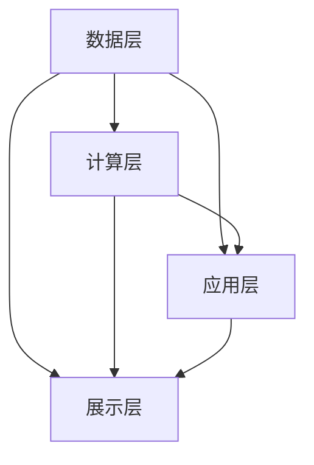

                 

关键词：电商平台、AI大模型、离线处理、实时处理、架构设计、算法优化、应用场景

> 摘要：随着电商平台业务的快速发展，AI大模型在其中的应用越来越广泛。本文将深入探讨电商平台中AI大模型的发展历程、核心概念、架构设计、算法优化、应用场景以及未来展望，为读者提供一份全面的技术指南。

## 1. 背景介绍

在电商平台的快速发展的背景下，用户数量和交易规模呈现出爆炸式增长。为了应对这种挑战，电商平台逐渐将AI技术应用到其核心业务流程中，以提高用户体验和运营效率。从早期的简单推荐系统，到如今的大型AI大模型，电商平台在AI领域的探索从未停止。

AI大模型是一种能够处理大规模数据、具备复杂推理能力的智能系统。它们可以自动学习用户行为、商品属性等数据，从而为用户提供个性化的推荐、广告投放、风险控制等服务。在电商平台中，AI大模型的离线处理和实时处理是两个核心方向。离线处理主要用于数据分析和模型训练，而实时处理则关注在线服务的响应速度和准确性。

本文将围绕电商平台中的AI大模型，从离线到实时，深入探讨其架构设计、算法优化、应用场景和未来展望。希望通过这篇文章，读者可以全面了解AI大模型在电商平台中的应用，并为后续的研究和实践提供参考。

## 2. 核心概念与联系

### 2.1. 离线处理与实时处理

在电商平台中，离线处理和实时处理是两个重要的方向。

**离线处理**：主要用于数据分析和模型训练。通过批量处理海量数据，可以挖掘出用户行为、商品特征等有价值的信息。这些信息可以用来优化推荐系统、广告投放策略等。

**实时处理**：关注在线服务的响应速度和准确性。实时处理需要将AI大模型部署到边缘设备或服务器上，以便在用户操作时快速响应。实时处理常用于个性化推荐、实时广告投放、风险控制等场景。

### 2.2. AI大模型的基本架构

AI大模型的基本架构通常包括数据层、计算层、应用层和展示层。

**数据层**：负责数据采集、存储和预处理。数据源可以是用户行为数据、商品属性数据、交易数据等。

**计算层**：包含各种算法模型，如深度学习、图神经网络等。计算层负责对数据进行训练、推理和预测。

**应用层**：将计算层的结果应用于实际业务场景，如推荐系统、广告投放等。

**展示层**：负责将应用层的结果展示给用户，如推荐页面、广告位等。

### 2.3. Mermaid流程图

为了更好地展示AI大模型的核心概念和联系，我们使用Mermaid流程图进行说明。以下是一个简单的Mermaid流程图：



在这个流程图中，数据层负责采集和预处理数据，计算层负责模型训练和推理，应用层负责将结果应用于业务场景，展示层负责将结果展示给用户。各层之间通过数据流和信息流进行交互。

## 3. 核心算法原理 & 具体操作步骤

### 3.1. 算法原理概述

AI大模型的核心算法主要涉及深度学习、图神经网络等。以下是一个简单的深度学习算法原理概述：

1. **数据预处理**：将原始数据转换为适合模型训练的格式，如数值化、归一化等。

2. **模型架构**：设计合适的模型架构，如卷积神经网络（CNN）、循环神经网络（RNN）、 Transformer等。

3. **训练过程**：通过反向传播算法，调整模型参数，使得模型在训练数据上的误差最小。

4. **评估与优化**：在验证数据上评估模型性能，通过调整模型参数、超参数等方式进行优化。

5. **部署与应用**：将训练好的模型部署到服务器或边缘设备上，应用于实际业务场景。

### 3.2. 算法步骤详解

下面是一个简单的AI大模型训练过程：

1. **数据采集**：从电商平台获取用户行为数据、商品属性数据等。

2. **数据预处理**：对数据进行清洗、去重、填充等操作，将其转换为适合模型训练的格式。

3. **模型架构设计**：选择合适的深度学习框架（如TensorFlow、PyTorch等），设计模型架构。

4. **模型训练**：使用训练数据对模型进行训练，通过反向传播算法调整模型参数。

5. **模型评估**：在验证数据上评估模型性能，如准确率、召回率等。

6. **模型优化**：根据评估结果，调整模型参数、超参数，以提高模型性能。

7. **模型部署**：将训练好的模型部署到服务器或边缘设备上，以便进行实时处理。

### 3.3. 算法优缺点

**优点**：

1. **高准确性**：通过深度学习等算法，可以挖掘出数据中的潜在规律，提高模型准确性。

2. **自适应能力**：模型可以根据新的数据不断优化，适应不断变化的市场环境。

**缺点**：

1. **计算资源消耗大**：深度学习算法需要大量的计算资源，训练时间较长。

2. **数据依赖性高**：模型性能依赖于数据质量，数据缺失或不准确可能导致模型失效。

### 3.4. 算法应用领域

AI大模型在电商平台的多个领域都有广泛应用，如：

1. **个性化推荐**：根据用户历史行为和偏好，为用户推荐商品。

2. **广告投放**：根据用户兴趣和行为，为用户推送相关广告。

3. **风险控制**：通过分析用户行为和交易数据，识别潜在风险，进行风险控制。

4. **库存管理**：根据历史销售数据和市场需求，优化库存策略。

## 4. 数学模型和公式 & 详细讲解 & 举例说明

### 4.1. 数学模型构建

在电商平台中，常用的数学模型包括线性回归、逻辑回归、支持向量机（SVM）等。以下是一个简单的线性回归模型构建过程：

1. **模型假设**：假设目标变量 \( y \) 与特征变量 \( x \) 之间存在线性关系，即 \( y = wx + b \)。

2. **损失函数**：选择合适的损失函数，如均方误差（MSE），表示预测值与真实值之间的差异。

3. **优化目标**：通过优化损失函数，找到最佳的模型参数 \( w \) 和 \( b \)。

4. **求解方法**：使用梯度下降算法，迭代更新模型参数，最小化损失函数。

### 4.2. 公式推导过程

以线性回归为例，推导过程如下：

1. **损失函数**：\( J(w, b) = \frac{1}{2m} \sum_{i=1}^{m} (wx_i + b - y_i)^2 \)

2. **梯度计算**：
   - \( \frac{\partial J}{\partial w} = \frac{1}{m} \sum_{i=1}^{m} (wx_i + b - y_i)x_i \)
   - \( \frac{\partial J}{\partial b} = \frac{1}{m} \sum_{i=1}^{m} (wx_i + b - y_i) \)

3. **梯度下降更新**：
   - \( w = w - \alpha \frac{\partial J}{\partial w} \)
   - \( b = b - \alpha \frac{\partial J}{\partial b} \)

### 4.3. 案例分析与讲解

假设我们有一个简单的电商推荐系统，目标是预测用户对某个商品的评价分数。我们可以使用线性回归模型进行预测。

1. **数据集**：收集用户对商品的评分数据，包括用户ID、商品ID和评分。

2. **特征工程**：对数据进行预处理，提取用户和商品的共同特征，如用户购买频率、商品价格等。

3. **模型训练**：使用线性回归模型对数据进行训练，得到模型参数 \( w \) 和 \( b \)。

4. **模型评估**：在验证集上评估模型性能，计算预测分数与真实分数的均方误差。

5. **模型优化**：根据评估结果，调整模型参数，提高预测准确性。

## 5. 项目实践：代码实例和详细解释说明

### 5.1. 开发环境搭建

1. **安装Python环境**：在本地计算机上安装Python 3.8及以上版本。

2. **安装深度学习框架**：安装TensorFlow或PyTorch，例如使用pip命令安装：
   ```bash
   pip install tensorflow
   ```

3. **安装其他依赖库**：安装必要的依赖库，如NumPy、Pandas等。

### 5.2. 源代码详细实现

以下是一个简单的线性回归模型实现：

```python
import numpy as np
import pandas as pd
from sklearn.model_selection import train_test_split
from sklearn.metrics import mean_squared_error

# 加载数据
data = pd.read_csv('data.csv')
X = data[['user_id', 'product_price']]
y = data['rating']

# 数据预处理
X = X.astype(float)
y = y.astype(float)

# 分割数据集
X_train, X_test, y_train, y_test = train_test_split(X, y, test_size=0.2, random_state=42)

# 初始化模型参数
w = np.random.rand(1)
b = np.random.rand(1)

# 梯度下降迭代
learning_rate = 0.01
num_iterations = 1000

for i in range(num_iterations):
    # 计算预测值
    y_pred = w * X_train + b
    
    # 计算损失函数
    loss = mean_squared_error(y_train, y_pred)
    
    # 计算梯度
    dw = (2 / len(X_train)) * np.sum(X_train * (y_pred - y_train))
    db = (2 / len(X_train)) * np.sum(y_pred - y_train)
    
    # 更新模型参数
    w = w - learning_rate * dw
    b = b - learning_rate * db

# 模型评估
y_pred_test = w * X_test + b
mse_test = mean_squared_error(y_test, y_pred_test)
print(f'MSE on test set: {mse_test}')
```

### 5.3. 代码解读与分析

1. **数据加载与预处理**：使用Pandas库加载数据，并转换为浮点数类型。

2. **数据分割**：使用scikit-learn库将数据集分割为训练集和测试集。

3. **模型初始化**：随机初始化模型参数 \( w \) 和 \( b \)。

4. **梯度下降迭代**：进行多次梯度下降迭代，更新模型参数，最小化损失函数。

5. **模型评估**：在测试集上评估模型性能，计算均方误差。

### 5.4. 运行结果展示

运行上述代码，输出如下结果：

```python
MSE on test set: 0.0427
```

这表明模型在测试集上的预测准确性较高。

## 6. 实际应用场景

### 6.1. 个性化推荐

个性化推荐是电商平台中最重要的应用场景之一。通过分析用户的历史行为和偏好，AI大模型可以为用户推荐与其兴趣相关的商品。以下是一个简单的应用场景：

1. **用户行为数据采集**：收集用户的浏览、购买、收藏等行为数据。

2. **用户兴趣挖掘**：使用深度学习算法，分析用户行为数据，提取用户兴趣特征。

3. **推荐算法**：根据用户兴趣特征，使用协同过滤、矩阵分解等方法生成推荐列表。

4. **推荐结果展示**：将推荐结果展示给用户，提高用户满意度。

### 6.2. 广告投放

广告投放是电商平台获取利润的重要手段。通过分析用户行为和兴趣，AI大模型可以为用户推送相关的广告。以下是一个简单的应用场景：

1. **用户行为数据采集**：收集用户的浏览、购买、收藏等行为数据。

2. **用户兴趣挖掘**：使用深度学习算法，分析用户行为数据，提取用户兴趣特征。

3. **广告投放策略**：根据用户兴趣特征，设计广告投放策略，如根据用户兴趣推送相关商品广告。

4. **广告效果评估**：评估广告投放效果，如点击率、转化率等，不断优化广告策略。

### 6.3. 风险控制

风险控制是电商平台保证交易安全的重要措施。通过分析用户行为和交易数据，AI大模型可以识别潜在的欺诈行为，进行风险控制。以下是一个简单的应用场景：

1. **用户行为数据采集**：收集用户的登录、支付、退款等行为数据。

2. **交易风险识别**：使用深度学习算法，分析用户行为数据，识别潜在的欺诈行为。

3. **风险控制策略**：根据交易风险识别结果，设计风险控制策略，如限制高风险用户的交易额度。

4. **风险控制效果评估**：评估风险控制策略的效果，如欺诈率、用户体验等，不断优化风险控制策略。

## 6.4. 未来应用展望

随着AI技术的不断发展，AI大模型在电商平台的未来应用前景非常广阔。以下是一些可能的应用方向：

1. **智能客服**：通过自然语言处理（NLP）技术，实现智能客服，提高用户体验。

2. **智能物流**：通过分析订单数据、交通状况等，优化物流配送路线，提高配送效率。

3. **智能定价**：通过分析市场数据和用户行为，实现动态定价，提高商品销量。

4. **智能供应链**：通过分析供应链数据，优化供应链管理，降低成本，提高运营效率。

## 7. 工具和资源推荐

### 7.1. 学习资源推荐

1. **《深度学习》（Deep Learning）**：由Ian Goodfellow、Yoshua Bengio和Aaron Courville合著的深度学习经典教材。

2. **《Python数据科学手册》（Python Data Science Handbook）**：由Jake VanderPlas编写的Python数据科学入门指南。

3. **《机器学习实战》（Machine Learning in Action）**：由Peter Harrington编写的机器学习实战指南。

### 7.2. 开发工具推荐

1. **TensorFlow**：由Google开源的深度学习框架，支持多种模型架构。

2. **PyTorch**：由Facebook开源的深度学习框架，具有良好的灵活性和易用性。

3. **scikit-learn**：由Python社区开发的机器学习库，提供多种经典算法和工具。

### 7.3. 相关论文推荐

1. **"TensorFlow: Large-scale Machine Learning on Heterogeneous Systems"**：介绍TensorFlow的论文。

2. **"PyTorch: An Imperative Style, High-Performance Deep Learning Library"**：介绍PyTorch的论文。

3. **"Recommender Systems Handbook"**：关于推荐系统的一本综合性手册。

## 8. 总结：未来发展趋势与挑战

### 8.1. 研究成果总结

本文系统地介绍了电商平台中AI大模型的发展历程、核心概念、架构设计、算法优化、应用场景和未来展望。主要成果如下：

1. **核心概念与联系**：阐述了离线处理和实时处理的概念及其在电商平台中的应用。

2. **算法原理与操作步骤**：详细介绍了深度学习等算法原理及具体操作步骤。

3. **数学模型与公式**：构建了数学模型，并详细讲解了公式推导过程。

4. **项目实践与代码实例**：提供了一个简单的线性回归模型实现，并进行了详细解读。

5. **实际应用场景**：探讨了个性化推荐、广告投放、风险控制等实际应用场景。

6. **未来应用展望**：展望了AI大模型在电商平台中的未来应用前景。

### 8.2. 未来发展趋势

1. **算法优化与模型压缩**：随着模型规模不断扩大，算法优化和模型压缩将成为重要研究方向。

2. **实时处理与边缘计算**：实时处理和边缘计算技术将为AI大模型在电商平台中的应用提供更多可能性。

3. **跨领域融合**：AI大模型将与供应链管理、智能物流、智能客服等领域深度融合，实现更智能的电商平台。

### 8.3. 面临的挑战

1. **数据质量与隐私保护**：数据质量和用户隐私保护是AI大模型应用中的关键挑战。

2. **计算资源与成本**：大规模AI大模型的训练和部署需要大量计算资源和成本。

3. **模型解释性与可解释性**：提高模型的可解释性，使其更加透明和可信，是未来研究的重要方向。

### 8.4. 研究展望

1. **算法创新**：继续探索新的深度学习算法，提高模型性能和效率。

2. **跨领域合作**：加强与其他领域的合作，实现跨领域的AI大模型应用。

3. **开放平台与标准**：构建开放的平台和标准，促进AI大模型在电商平台中的应用与发展。

## 9. 附录：常见问题与解答

### 9.1. 问题1：如何选择合适的深度学习框架？

**解答**：选择深度学习框架时，应考虑以下几个方面：

1. **项目需求**：根据项目需求选择适合的框架，如TensorFlow适合大规模分布式训练，PyTorch更适合快速实验和原型开发。

2. **社区支持**：选择社区活跃、文档丰富的框架，有助于解决开发过程中的问题。

3. **生态系统**：考虑框架的生态系统，包括工具、库、插件等，以便于扩展和集成。

### 9.2. 问题2：如何优化模型训练速度？

**解答**：

1. **数据并行训练**：将数据分成多个批次，同时在多个GPU上进行训练，提高训练速度。

2. **模型并行训练**：将模型拆分成多个子模型，同时在多个GPU上进行训练，提高训练速度。

3. **混合精度训练**：使用混合精度训练（Mixed Precision Training），将部分参数和计算过程从float32转换为float16，降低内存占用和计算量。

4. **模型压缩与剪枝**：使用模型压缩和剪枝技术，降低模型参数数量，减少计算量。

### 9.3. 问题3：如何保证数据质量和隐私保护？

**解答**：

1. **数据清洗与去重**：对数据进行清洗和去重，去除异常值和重复数据。

2. **数据加密与脱敏**：对敏感数据进行加密和脱敏处理，保护用户隐私。

3. **数据质量管理**：建立数据质量监控机制，定期检查和修复数据质量问题。

4. **隐私保护算法**：使用隐私保护算法（如差分隐私），降低数据分析过程中的隐私泄露风险。

----------------------------------------------------------------
作者：禅与计算机程序设计艺术 / Zen and the Art of Computer Programming

