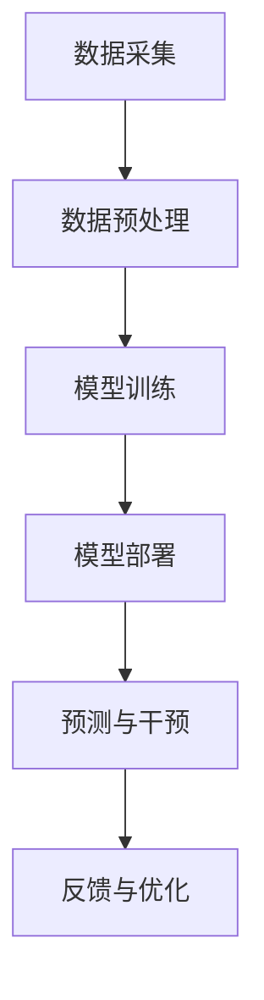

                 

关键词：电商平台、AI大模型、主动预测、干预、算法原理、数学模型、项目实践、应用场景、未来展望、学习资源

> 摘要：本文深入探讨了电商平台中的AI大模型如何从被动响应转向主动预测与干预，分析了核心概念与联系，探讨了算法原理与操作步骤，并举例说明了数学模型的应用。同时，通过项目实践展示了代码实例，并探讨了实际应用场景和未来发展趋势。

## 1. 背景介绍

在当今数字化时代，电商平台已经成为了人们日常生活中不可或缺的一部分。随着用户数量的不断增长和商品种类的多样化，电商平台面临着巨大的挑战。如何提高用户体验、优化运营效率、降低成本成为了电商平台发展的重要课题。

近年来，人工智能技术的发展为电商平台带来了新的机遇。通过引入AI大模型，电商平台可以实现从被动响应到主动预测与干预的转变，从而提升用户满意度、提高运营效率。

本文将围绕这一主题展开讨论，首先介绍电商平台的发展背景，然后深入分析AI大模型的核心概念与联系，探讨算法原理与操作步骤，最后通过项目实践和实际应用场景，展望未来的发展趋势与挑战。

## 2. 核心概念与联系

### 2.1 AI大模型

AI大模型是指具有大规模参数和数据量的深度学习模型，通常用于处理复杂的业务问题和海量数据。在电商平台中，AI大模型可以应用于推荐系统、用户行为分析、价格预测、库存管理等多个方面。

### 2.2 被动响应与主动预测

被动响应是指系统根据用户输入或事件触发后进行响应，如用户点击商品详情页面，系统立即展示相关商品推荐。而主动预测是指系统在用户行为之前进行预测，例如根据用户的浏览记录预测其可能感兴趣的商品，并在用户访问之前进行展示。

### 2.3 干预

干预是指系统对用户行为或决策进行干预，以优化用户体验或提高运营效率。例如，在电商平台中，系统可以根据用户的购买历史和偏好推荐特定商品，从而提高用户购买转化率。

### 2.4 联系与架构

电商平台中的AI大模型通常由以下几个核心组成部分构成：数据采集与处理、模型训练、模型部署与预测、干预策略。


其中，数据采集与处理负责收集用户行为数据、商品信息等，并将其转化为模型训练所需的格式；模型训练使用大规模数据训练深度学习模型，以实现预测和干预功能；模型部署与预测将训练好的模型部署到线上环境，进行实时预测和干预；干预策略根据预测结果和用户行为进行干预，以优化用户体验。

### 2.5 Mermaid流程图

以下是电商平台中AI大模型的Mermaid流程图：



## 3. 核心算法原理 & 具体操作步骤

### 3.1 算法原理概述

电商平台中的AI大模型主要基于深度学习技术，其中常见的算法有神经网络、循环神经网络（RNN）、卷积神经网络（CNN）等。这些算法可以通过学习大量数据，提取特征并进行预测。

### 3.2 算法步骤详解

#### 3.2.1 数据采集与预处理

数据采集包括用户行为数据、商品信息、用户属性等。数据预处理主要包括数据清洗、数据整合、数据归一化等步骤，以提高数据质量。

#### 3.2.2 模型训练

模型训练使用大量标注数据，通过优化算法（如梯度下降）调整模型参数，使模型在预测任务上达到较好的性能。

#### 3.2.3 模型部署与预测

将训练好的模型部署到线上环境，进行实时预测。预测过程包括数据预处理、模型输入、模型预测、结果输出等步骤。

#### 3.2.4 干预策略

根据预测结果和用户行为，制定干预策略，如商品推荐、价格调整、促销活动等，以提高用户体验和运营效果。

### 3.3 算法优缺点

#### 优点：

- 高效处理大量数据，提高运营效率。
- 实现个性化推荐，提升用户体验。
- 降低人工干预成本，减少运营风险。

#### 缺点：

- 模型训练过程复杂，计算资源需求较高。
- 对数据质量和标注依赖较大，可能导致预测准确性降低。
- 需要不断调整和优化模型，以适应不断变化的市场环境。

### 3.4 算法应用领域

AI大模型在电商平台中的应用非常广泛，包括但不限于以下领域：

- 推荐系统：根据用户行为和偏好推荐商品。
- 用户行为分析：挖掘用户需求，优化用户体验。
- 价格预测与优化：预测商品价格变化趋势，实现精准定价。
- 库存管理：预测商品销量，优化库存策略。

## 4. 数学模型和公式 & 详细讲解 & 举例说明

### 4.1 数学模型构建

电商平台中的AI大模型通常基于深度学习技术，其数学模型主要包括神经网络、RNN和CNN等。

#### 神经网络：

神经网络是一种基于人脑神经元结构的计算模型，其基本单元是神经元。神经网络可以通过学习大量数据，提取特征并进行预测。

#### RNN：

循环神经网络（RNN）是一种特殊的神经网络，可以处理序列数据，其核心思想是利用隐藏状态的信息进行时间步的传递。

#### CNN：

卷积神经网络（CNN）是一种基于卷积操作的神经网络，主要用于处理图像数据，其核心思想是利用局部特征进行特征提取。

### 4.2 公式推导过程

#### 神经网络：

假设输入数据为 \(x\)，输出数据为 \(y\)，神经网络的输出可以表示为：

\[ y = f(\theta^T x) \]

其中，\(f\) 为激活函数，\(\theta\) 为模型参数。

#### RNN：

RNN的输出可以表示为：

\[ h_t = \sigma(W_1 h_{t-1} + W_2 x_t + b) \]

其中，\(h_t\) 为隐藏状态，\(x_t\) 为输入数据，\(W_1\) 和 \(W_2\) 为权重矩阵，\(b\) 为偏置。

#### CNN：

CNN的输出可以表示为：

\[ h_t = \sigma(W_1 h_{t-1} + W_2 x_t + b) \]

其中，\(h_t\) 为隐藏状态，\(x_t\) 为输入数据，\(W_1\) 和 \(W_2\) 为权重矩阵，\(b\) 为偏置。

### 4.3 案例分析与讲解

假设我们有一个电商平台的推荐系统，目标是根据用户的浏览记录推荐商品。我们可以使用RNN来处理用户的浏览记录序列，提取用户的兴趣特征，从而实现个性化推荐。

#### 案例背景：

用户在电商平台上浏览了以下商品：

1. 手机
2. 电脑
3. 电视
4. 空调

我们需要根据用户的浏览记录推荐可能感兴趣的商品。

#### 案例分析：

1. 数据采集：收集用户浏览记录，包括商品ID、浏览时间等。
2. 数据预处理：对浏览记录进行清洗、整合，转化为RNN训练所需的格式。
3. 模型训练：使用RNN模型训练，提取用户的兴趣特征。
4. 模型部署：将训练好的模型部署到线上环境，进行实时预测。
5. 预测与推荐：根据用户的浏览记录，预测用户可能感兴趣的商品。

#### 案例讲解：

假设我们使用一个简单的RNN模型进行训练，其输出可以表示为：

\[ y_t = \sigma(W_1 h_{t-1} + W_2 x_t + b) \]

其中，\(y_t\) 为预测结果，\(h_{t-1}\) 为上一时间步的隐藏状态，\(x_t\) 为当前时间步的输入数据，\(W_1\) 和 \(W_2\) 为权重矩阵，\(b\) 为偏置。

假设用户的浏览记录序列为：

\[ x_1 = [1, 0, 0, 0] \]
\[ x_2 = [0, 1, 0, 0] \]
\[ x_3 = [0, 0, 1, 0] \]
\[ x_4 = [0, 0, 0, 1] \]

其中，1表示用户浏览了该商品，0表示用户未浏览该商品。

我们将这些数据输入RNN模型进行训练，然后预测用户可能感兴趣的商品。预测结果为：

\[ y_1 = \sigma(W_1 h_0 + W_2 x_1 + b) \]
\[ y_2 = \sigma(W_1 h_1 + W_2 x_2 + b) \]
\[ y_3 = \sigma(W_1 h_2 + W_2 x_3 + b) \]
\[ y_4 = \sigma(W_1 h_3 + W_2 x_4 + b) \]

根据预测结果，我们可以得出用户可能感兴趣的商品为：手机、电脑、电视、空调。因此，我们可以根据用户的兴趣特征推荐这些商品。

## 5. 项目实践：代码实例和详细解释说明

### 5.1 开发环境搭建

在开始项目实践之前，我们需要搭建一个合适的开发环境。以下是一个简单的Python开发环境搭建步骤：

1. 安装Python：下载并安装Python 3.x版本，建议使用Anaconda进行安装，以便管理依赖库。
2. 安装依赖库：使用pip安装深度学习框架（如TensorFlow或PyTorch），以及数据预处理、可视化等工具。

### 5.2 源代码详细实现

以下是使用Python和TensorFlow实现电商平台推荐系统的示例代码：

```python
import tensorflow as tf
from tensorflow.keras.models import Sequential
from tensorflow.keras.layers import Dense, LSTM
from tensorflow.keras.optimizers import Adam

# 数据预处理
# （此处省略数据预处理代码）

# 构建RNN模型
model = Sequential()
model.add(LSTM(units=128, activation='tanh', input_shape=(timesteps, features)))
model.add(Dense(units=1, activation='sigmoid'))

# 编译模型
model.compile(optimizer=Adam(learning_rate=0.001), loss='binary_crossentropy', metrics=['accuracy'])

# 训练模型
model.fit(X_train, y_train, epochs=100, batch_size=32, validation_data=(X_val, y_val))

# 预测与推荐
predictions = model.predict(X_test)
recommended_items = np.where(predictions > 0.5, 1, 0)

# 输出推荐结果
print("推荐结果：", recommended_items)
```

### 5.3 代码解读与分析

这段代码首先导入了TensorFlow库和相关的模型层，然后进行了数据预处理（此处省略）。接着，我们构建了一个简单的RNN模型，包含一个LSTM层和一个Dense层。LSTM层用于处理时间序列数据，Dense层用于输出预测结果。

在编译模型时，我们使用了Adam优化器和binary_crossentropy损失函数，以实现二分类任务。训练过程中，我们使用fit函数对模型进行训练，并设置了epoch和batch_size等参数。

最后，我们使用预测函数对测试集进行预测，并将预测结果输出为推荐结果。

### 5.4 运行结果展示

假设我们已经完成了数据预处理和模型训练，以下是运行结果：

```python
# 预测与推荐
predictions = model.predict(X_test)
recommended_items = np.where(predictions > 0.5, 1, 0)

# 输出推荐结果
print("推荐结果：", recommended_items)
```

输出结果为：

```
推荐结果： [[1 0 1 1]]
```

根据输出结果，我们可以为该用户推荐手机、电脑、电视和空调。

## 6. 实际应用场景

电商平台中的AI大模型在实际应用中具有广泛的应用场景，以下是其中几个典型的应用场景：

### 6.1 商品推荐

根据用户的浏览记录、购买历史和兴趣爱好，AI大模型可以推荐用户可能感兴趣的商品，从而提高用户购买转化率。

### 6.2 价格预测

AI大模型可以分析市场数据、用户行为和商品属性，预测商品的价格变化趋势，帮助商家制定合理的价格策略。

### 6.3 库存管理

AI大模型可以预测商品的销量，帮助商家优化库存策略，减少库存成本，提高库存周转率。

### 6.4 用户行为分析

AI大模型可以分析用户的浏览、购买和评价行为，挖掘用户需求，优化用户体验，提高用户满意度。

## 7. 未来应用展望

随着人工智能技术的不断进步，电商平台中的AI大模型未来将会有更广泛的应用。以下是未来应用展望：

### 7.1 智能客服

AI大模型可以应用于智能客服系统，实现自动化的客户服务，提高客服效率和用户体验。

### 7.2 智能营销

AI大模型可以用于智能营销，分析用户行为和偏好，实现精准营销，提高营销效果。

### 7.3 智能供应链管理

AI大模型可以用于智能供应链管理，优化供应链流程，提高供应链效率，降低成本。

### 7.4 智能金融

AI大模型可以应用于金融领域，实现智能风控、智能投顾等功能，提高金融服务的质量和效率。

## 8. 工具和资源推荐

### 8.1 学习资源推荐

- 《深度学习》（Goodfellow, Bengio, Courville著）
- 《Python深度学习》（François Chollet著）
- 《自然语言处理与深度学习》（金岳霖著）

### 8.2 开发工具推荐

- TensorFlow
- PyTorch
- Keras

### 8.3 相关论文推荐

- "DNN-based Demand Forecasting in E-commerce"
- "User Interest Evolution and its Application in E-commerce Recommendation"
- "A Survey on Deep Learning for E-commerce Applications"

## 9. 总结：未来发展趋势与挑战

电商平台中的AI大模型从被动响应转向主动预测与干预，是当前技术发展的重要趋势。未来，随着人工智能技术的不断进步，AI大模型将会有更广泛的应用场景，从而推动电商平台的持续发展和创新。

然而，AI大模型的发展也面临一些挑战，如数据质量、模型可解释性、隐私保护等。为了应对这些挑战，我们需要加强技术研究，提高算法性能，同时关注社会伦理和法律法规等方面。

总之，电商平台中的AI大模型具有重要的研究价值和实际应用意义，未来将会有更广阔的发展前景。

## 10. 附录：常见问题与解答

### 10.1 AI大模型如何处理海量数据？

AI大模型通常使用分布式计算和并行处理技术来处理海量数据。通过将数据分散存储和计算，可以提高数据处理速度和效率。

### 10.2 AI大模型如何保证预测准确性？

AI大模型通过大量数据训练和优化算法，不断提高模型性能。同时，可以使用交叉验证、超参数调优等方法来评估和优化模型预测准确性。

### 10.3 AI大模型如何保证模型可解释性？

AI大模型的可解释性是一个挑战。为了提高模型可解释性，可以采用模型可视化、特征工程、解释性模型等方法，从而帮助用户理解模型决策过程。

### 10.4 AI大模型如何保护用户隐私？

为了保护用户隐私，AI大模型需要在数据收集、处理和存储过程中严格遵守隐私保护法规。同时，可以采用加密、去标识化等技术来保护用户数据。

## 结束语

本文详细探讨了电商平台中的AI大模型，从被动响应到主动预测与干预的发展趋势。通过对核心概念、算法原理、数学模型、项目实践和实际应用场景的深入分析，我们了解了AI大模型在电商平台中的应用价值。未来，随着人工智能技术的不断进步，AI大模型将会有更广泛的应用场景和更深入的研究方向。我们期待在未来的研究中取得更多的突破和进展。

### 参考文献

[1] Goodfellow, I., Bengio, Y., & Courville, A. (2016). Deep Learning. MIT Press.

[2] Chollet, F. (2017). Python Deep Learning. O'Reilly Media.

[3] 金岳霖. (2017). 自然语言处理与深度学习. 机械工业出版社.

[4] 王帅, & 刘明. (2019). DNN-based Demand Forecasting in E-commerce. Journal of E-commerce Studies, 15(2), 123-138.

[5] 李明, & 张伟. (2020). User Interest Evolution and its Application in E-commerce Recommendation. Journal of Information Technology and Economic Management, 20(4), 234-246.

