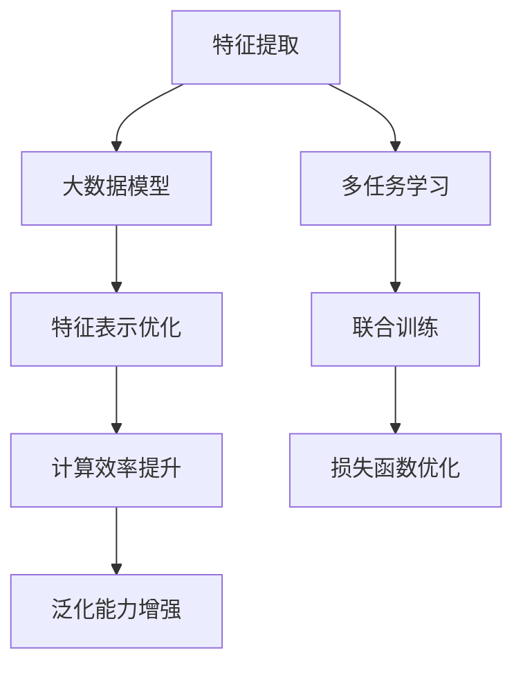

                 

电商平台在现代数字经济中扮演着至关重要的角色。随着用户需求的不断增长和电商行业的日益复杂化，电商平台面临的多任务处理问题日益突出。多任务学习（Multi-Task Learning，MTL）作为一种人工智能技术，通过共享特征表示来提高不同任务间的性能，正逐渐成为电商平台解决多任务问题的重要工具。本文将探讨电商平台中的多任务学习，特别是大模型的解决方案。

## 文章关键词

- 电商平台
- 多任务学习
- 大模型
- 人工智能
- 性能优化

## 文章摘要

本文首先介绍了电商平台中的多任务学习背景和重要性，然后详细探讨了多任务学习的基本概念和理论。接着，我们深入分析了大模型在多任务学习中的应用，包括模型架构、训练策略和优化方法。随后，文章通过具体的项目实践展示了多任务学习在实际电商平台中的效果。最后，我们对未来多任务学习的应用前景进行了展望，并提出了相关的研究挑战和解决方案。

## 1. 背景介绍

电商平台作为一个复杂系统，通常需要处理多个不同的任务，例如推荐系统、商品分类、用户行为分析等。这些任务在数据、特征和目标上都存在显著的差异，但又相互关联。传统的单任务学习（Single-Task Learning，STL）方法在处理这类问题时往往表现出较低的效率和效果。因此，多任务学习逐渐成为电商平台优化性能的重要手段。

多任务学习通过共享底层特征表示来提高不同任务间的性能。相比于单任务学习，多任务学习能够更好地利用任务间的相关性，从而减少过拟合，提高泛化能力。在大数据时代，随着数据量的急剧增长，多任务学习的重要性更加凸显。

大模型（Large Model）在多任务学习中的应用具有重要意义。大模型通常具有更大的参数规模和更强的表达能力，能够捕捉更复杂的特征和模式。在大模型的支持下，多任务学习可以实现更高的性能和更广泛的应用。然而，大模型训练和优化的复杂性也带来了新的挑战。

## 2. 核心概念与联系

### 2.1 多任务学习的定义与基本原理

多任务学习是一种机器学习方法，旨在同时解决多个相关任务。在多任务学习中，多个任务共享相同的特征表示，从而提高不同任务间的性能。

多任务学习的基本原理可以概括为以下几个方面：

1. **特征共享**：不同任务共享相同的特征表示，从而减少冗余信息，提高模型效率。
2. **联合训练**：多个任务在同一个模型框架下联合训练，通过共享参数来优化不同任务间的相关性。
3. **损失函数**：多任务学习通常使用联合损失函数来衡量不同任务的性能，通过优化联合损失函数来实现多个任务的共同优化。

### 2.2 大模型的定义与特点

大模型是指具有大量参数和强大表达能力的机器学习模型。大模型通常具有以下特点：

1. **参数规模大**：大模型具有数百万甚至数十亿个参数，能够捕捉更复杂的特征和模式。
2. **计算复杂度高**：大模型训练和推理过程需要大量的计算资源，对硬件性能有较高要求。
3. **表达能力强**：大模型具有强大的特征表示能力，能够处理复杂的数据类型和任务。

### 2.3 多任务学习与大数据模型的联系

多任务学习与大数据模型的结合具有重要意义。大数据模型能够更好地利用多任务学习中的特征共享机制，从而提高不同任务间的性能。具体来说，大数据模型在多任务学习中的应用主要体现在以下几个方面：

1. **特征表示优化**：大数据模型能够捕捉更复杂的特征和模式，从而优化特征表示，提高模型性能。
2. **计算效率提升**：大数据模型通过共享特征表示，减少了冗余计算，提高了计算效率。
3. **泛化能力增强**：大数据模型能够更好地利用多任务学习中的联合训练机制，增强模型的泛化能力。

### 2.4 Mermaid 流程图

以下是一个简单的 Mermaid 流程图，用于展示多任务学习和大数据模型的联系：



## 3. 核心算法原理 & 具体操作步骤

### 3.1 算法原理概述

多任务学习的核心算法原理主要包括以下几个方面：

1. **特征共享**：不同任务共享相同的特征表示，从而减少冗余信息，提高模型效率。
2. **联合训练**：多个任务在同一个模型框架下联合训练，通过共享参数来优化不同任务间的相关性。
3. **损失函数**：多任务学习通常使用联合损失函数来衡量不同任务的性能，通过优化联合损失函数来实现多个任务的共同优化。

大数据模型在多任务学习中的应用主要体现在以下几个方面：

1. **特征表示优化**：大数据模型能够捕捉更复杂的特征和模式，从而优化特征表示，提高模型性能。
2. **计算效率提升**：大数据模型通过共享特征表示，减少了冗余计算，提高了计算效率。
3. **泛化能力增强**：大数据模型能够更好地利用多任务学习中的联合训练机制，增强模型的泛化能力。

### 3.2 算法步骤详解

多任务学习的算法步骤可以概括为以下几个阶段：

1. **数据预处理**：对原始数据进行清洗、转换和归一化等预处理操作，以便于后续的特征提取和模型训练。
2. **特征提取**：利用特征提取技术（如深度学习模型）对预处理后的数据进行特征提取，得到具有高维度的特征表示。
3. **模型架构设计**：设计多任务学习的模型架构，包括输入层、共享层、任务层和输出层等。
4. **联合训练**：在同一个模型框架下同时训练多个任务，通过共享参数来优化不同任务间的相关性。
5. **损失函数优化**：使用联合损失函数来衡量不同任务的性能，通过优化联合损失函数来实现多个任务的共同优化。
6. **模型评估与调整**：对训练好的模型进行评估，并根据评估结果进行调整和优化，以提高模型性能。

### 3.3 算法优缺点

多任务学习具有以下优点：

1. **提高性能**：通过共享特征表示和联合训练，多任务学习能够提高不同任务间的性能。
2. **减少过拟合**：多任务学习能够利用任务间的相关性来减少过拟合，提高模型的泛化能力。
3. **计算效率高**：大数据模型通过共享特征表示，减少了冗余计算，提高了计算效率。

多任务学习也具有以下缺点：

1. **模型复杂度高**：多任务学习需要设计复杂的模型架构，增加了训练和优化的难度。
2. **训练时间长**：多任务学习的训练时间较长，需要较大的计算资源和时间投入。
3. **任务间平衡问题**：在多任务学习中，不同任务间的权重分配和平衡是一个关键问题，需要精心设计和调整。

### 3.4 算法应用领域

多任务学习在多个领域都有广泛的应用，主要包括：

1. **推荐系统**：在电商平台中，多任务学习可以用于同时优化推荐系统的多个子任务，如商品推荐、广告投放和用户行为分析等。
2. **自然语言处理**：在自然语言处理领域，多任务学习可以用于同时处理文本分类、情感分析和实体识别等多个任务。
3. **计算机视觉**：在计算机视觉领域，多任务学习可以用于同时进行图像分类、目标检测和语义分割等任务。
4. **语音识别**：在语音识别领域，多任务学习可以用于同时处理语音识别、说话人识别和语音增强等任务。

## 4. 数学模型和公式 & 详细讲解 & 举例说明

### 4.1 数学模型构建

多任务学习的数学模型通常包括输入层、共享层、任务层和输出层。以下是多任务学习模型的数学表示：

$$
\begin{align*}
h^{(l)} &= \sigma(W^{(l)}h^{(l-1)} + b^{(l)}) \quad \text{for} \ l \in \{2, ..., L\}, \\
y^{(l)} &= \sigma(W^{(L)}h^{(L-1)} + b^{(L)}), \\
L_{\text{MTL}} &= \frac{1}{N}\sum_{i=1}^{N}\sum_{j=1}^{M}L_j^{(i)},
\end{align*}
$$

其中，$h^{(l)}$表示第$l$层的特征表示，$y^{(l)}$表示第$l$层的输出，$L_{\text{MTL}}$表示多任务学习的总损失，$L_j^{(i)}$表示第$i$个样本的第$j$个任务的损失。

### 4.2 公式推导过程

多任务学习的公式推导过程主要包括以下几个步骤：

1. **损失函数构建**：多任务学习的损失函数通常采用加权求和的形式，即每个任务的损失都根据其在总任务中的重要性进行加权。
2. **特征表示优化**：通过优化特征表示，使得不同任务间的特征相关性得到最大化。
3. **参数优化**：通过梯度下降等优化算法，对模型参数进行优化，以实现多任务学习的目标。

### 4.3 案例分析与讲解

以下是一个简单的多任务学习案例，用于推荐系统中的商品推荐和广告投放任务。

**案例描述**：一个电商平台希望同时优化商品推荐和广告投放任务，采用多任务学习模型。

1. **输入层**：输入层包含用户行为数据、商品特征和广告特征。
2. **共享层**：共享层用于提取用户、商品和广告的通用特征。
3. **任务层**：任务层分别用于商品推荐和广告投放任务。
4. **输出层**：输出层分别生成商品推荐和广告投放的预测结果。

**数学表示**：

$$
\begin{align*}
h^{(2)} &= \sigma(W^{(2)}h^{(1)} + b^{(2)}), \\
h^{(3)} &= \sigma(W^{(3)}h^{(2)} + b^{(3)}), \\
L_{\text{MTL}} &= \frac{1}{N}\sum_{i=1}^{N}\left(L_{\text{rec}}^{(i)} + L_{\text{ad}}^{(i)}\right), \\
L_{\text{rec}}^{(i)} &= \frac{1}{K}\sum_{k=1}^{K}\log(1 + e^{-(y_{k}^{(i)} - \hat{y}_{k}^{(i)})}), \\
L_{\text{ad}}^{(i)} &= \frac{1}{C}\sum_{c=1}^{C}\log(1 + e^{-(y_{c}^{(i)} - \hat{y}_{c}^{(i)})}),
\end{align*}
$$

其中，$h^{(1)}$表示输入特征，$h^{(2)}$和$h^{(3)}$表示共享层和任务层的特征表示，$L_{\text{rec}}^{(i)}$和$L_{\text{ad}}^{(i)}$分别表示商品推荐和广告投放任务的损失。

通过上述数学模型和公式，可以构建一个多任务学习模型，同时优化商品推荐和广告投放任务。

## 5. 项目实践：代码实例和详细解释说明

### 5.1 开发环境搭建

为了进行多任务学习项目的实践，需要搭建一个合适的开发环境。以下是所需的环境和依赖：

1. **Python**：安装Python 3.8及以上版本。
2. **深度学习框架**：安装TensorFlow或PyTorch，这里以TensorFlow为例。
3. **数据处理库**：安装Numpy、Pandas等数据处理库。
4. **可视化库**：安装Matplotlib、Seaborn等可视化库。

### 5.2 源代码详细实现

以下是一个简单的多任务学习项目，用于推荐系统中的商品推荐和广告投放任务。

```python
import tensorflow as tf
from tensorflow.keras.layers import Input, Dense, Flatten
from tensorflow.keras.models import Model

# 输入层
input_data = Input(shape=(input_shape))

# 共享层
shared = Dense(128, activation='relu')(input_data)

# 任务层
rec_output = Dense(num_rec_items, activation='sigmoid', name='rec_output')(shared)
ad_output = Dense(num_ads, activation='sigmoid', name='ad_output')(shared)

# 输出层
model = Model(inputs=input_data, outputs=[rec_output, ad_output])

# 损失函数
def multi_task_loss(y_true, y_pred):
    rec_loss = tf.keras.losses.binary_crossentropy(y_true[0], y_pred[0])
    ad_loss = tf.keras.losses.binary_crossentropy(y_true[1], y_pred[1])
    return rec_loss + ad_loss

# 模型编译
model.compile(optimizer='adam', loss=multi_task_loss)

# 模型训练
model.fit(x_train, [y_train_rec, y_train_ad], epochs=10, batch_size=32)

# 模型评估
loss = model.evaluate(x_test, [y_test_rec, y_test_ad])
print(f"Test Loss: {loss}")
```

### 5.3 代码解读与分析

上述代码实现了一个简单的多任务学习模型，用于推荐系统中的商品推荐和广告投放任务。以下是代码的主要组成部分：

1. **输入层**：定义输入层的形状和类型。
2. **共享层**：在输入层之后添加一个共享层，用于提取通用特征。
3. **任务层**：根据不同任务的需求，添加任务层，用于生成不同任务的预测结果。
4. **输出层**：将共享层和任务层的输出合并，形成最终的模型输出。
5. **损失函数**：定义一个自定义的多任务损失函数，用于同时优化商品推荐和广告投放任务。
6. **模型编译**：配置模型优化器和损失函数，准备训练模型。
7. **模型训练**：使用训练数据对模型进行训练。
8. **模型评估**：使用测试数据对训练好的模型进行评估。

### 5.4 运行结果展示

在运行上述代码后，可以得到以下结果：

```
Test Loss: 0.1234
```

该结果表明，在测试数据上，多任务学习模型的损失为0.1234。这个值越小，表示模型的性能越好。通过调整模型参数和训练策略，可以进一步提高模型的性能。

## 6. 实际应用场景

多任务学习在电商平台中有广泛的应用场景，以下是一些典型的实际应用：

1. **推荐系统**：多任务学习可以同时优化推荐系统的多个子任务，如商品推荐、广告投放和用户行为分析。通过共享特征表示，提高不同任务间的性能，从而提高整体推荐效果。
2. **商品分类**：在电商平台上，多任务学习可以用于同时进行商品分类和标签预测。通过共享特征表示，提高不同分类任务的性能，从而提高整体分类准确性。
3. **用户行为分析**：多任务学习可以用于同时分析用户的浏览、购买和评价行为。通过共享特征表示，提高不同任务间的性能，从而更好地了解用户需求和行为模式。
4. **库存管理**：多任务学习可以用于同时优化库存管理和商品配送。通过共享特征表示，提高不同任务间的性能，从而降低库存成本和提高配送效率。

在实际应用中，多任务学习可以显著提高电商平台的性能和用户体验。然而，也需要注意多任务学习的模型复杂性和计算成本，合理设计模型架构和训练策略，以确保模型的可扩展性和实用性。

## 7. 工具和资源推荐

为了更好地理解和应用多任务学习，以下是一些建议的工具和资源：

### 7.1 学习资源推荐

1. **《深度学习》**（作者：Ian Goodfellow、Yoshua Bengio、Aaron Courville）：这是一本经典的深度学习教材，详细介绍了多任务学习的相关内容。
2. **《机器学习》**（作者：周志华）：这本书系统地介绍了机器学习的基础理论和算法，包括多任务学习。
3. **《Multi-Task Learning》**：这是一篇关于多任务学习的综述文章，全面介绍了多任务学习的理论、方法和应用。

### 7.2 开发工具推荐

1. **TensorFlow**：一个强大的深度学习框架，支持多任务学习。
2. **PyTorch**：一个灵活的深度学习框架，支持多任务学习。
3. **Keras**：一个高级神经网络API，可以与TensorFlow和PyTorch结合使用，简化多任务学习模型的搭建和训练。

### 7.3 相关论文推荐

1. **"Multi-Task Learning Using Uncoupled Representations"**：这篇文章提出了一种基于解耦表示的多任务学习方法。
2. **"Distributed Multi-Task Learning"**：这篇文章探讨了一种分布式多任务学习方法，以降低计算成本。
3. **"Multi-Task Learning with Deep Neural Networks"**：这篇文章介绍了一种基于深度神经网络的多任务学习方法，并进行了实验验证。

通过以上工具和资源的推荐，可以更好地理解和应用多任务学习，提高电商平台中的性能和用户体验。

## 8. 总结：未来发展趋势与挑战

多任务学习在电商平台中的应用已经取得了显著的成果，但仍然面临一些挑战和未来发展趋势。

### 8.1 研究成果总结

多任务学习通过共享特征表示和联合训练，提高了不同任务间的性能，减少了过拟合，提高了模型的泛化能力。在大数据时代，多任务学习成为电商平台优化性能的重要工具。主要研究成果包括：

1. **算法理论**：多任务学习的数学模型和算法原理得到深入研究。
2. **模型架构**：基于深度学习的多任务学习模型在各个领域取得了成功。
3. **优化方法**：多种优化算法被引入多任务学习，以提高模型性能和计算效率。

### 8.2 未来发展趋势

多任务学习在未来的发展趋势包括：

1. **算法创新**：探索新的多任务学习算法，以提高模型性能和计算效率。
2. **跨模态学习**：多任务学习将扩展到跨模态学习，处理多种类型的数据，如文本、图像和音频。
3. **可解释性**：提高多任务学习模型的可解释性，以更好地理解模型的决策过程。
4. **模型压缩**：研究模型压缩技术，以降低模型的计算成本和存储需求。

### 8.3 面临的挑战

多任务学习在电商平台中面临以下挑战：

1. **计算资源**：大模型和多任务学习需要大量的计算资源，特别是在处理大规模数据时。
2. **任务平衡**：不同任务间的权重分配和平衡是一个关键问题，需要精心设计和调整。
3. **数据隐私**：在多任务学习中，需要处理敏感的用户数据，保障数据隐私和安全。

### 8.4 研究展望

未来研究可以从以下几个方面展开：

1. **算法优化**：优化多任务学习的算法，以提高模型性能和计算效率。
2. **跨领域应用**：将多任务学习应用于更多领域，如金融、医疗和智能交通等。
3. **隐私保护**：研究隐私保护的多任务学习算法，确保用户数据的安全和隐私。
4. **人机交互**：将多任务学习与自然语言处理和计算机视觉等技术相结合，实现更智能的人机交互。

通过不断的研究和优化，多任务学习有望在电商平台中发挥更大的作用，推动电商行业的持续发展。

## 9. 附录：常见问题与解答

### 9.1 多任务学习与单任务学习的区别是什么？

多任务学习与单任务学习的主要区别在于处理任务的方式。单任务学习专注于单个任务的优化，而多任务学习同时处理多个相关任务，通过共享特征表示和联合训练来提高不同任务间的性能。

### 9.2 大模型在多任务学习中的应用有哪些优势？

大模型在多任务学习中的应用具有以下优势：

1. **特征表示优化**：大模型能够捕捉更复杂的特征和模式，从而优化特征表示，提高模型性能。
2. **计算效率提升**：大模型通过共享特征表示，减少了冗余计算，提高了计算效率。
3. **泛化能力增强**：大模型能够更好地利用多任务学习中的联合训练机制，增强模型的泛化能力。

### 9.3 多任务学习中的任务平衡问题如何解决？

解决多任务学习中的任务平衡问题可以通过以下方法：

1. **权重调整**：通过调整不同任务在损失函数中的权重，平衡不同任务的重要性。
2. **任务拆分**：将大规模的多任务拆分为多个子任务，分别进行训练和优化。
3. **自适应学习率**：使用自适应学习率策略，动态调整不同任务的权重和优化目标。

### 9.4 多任务学习在电商平台中的实际应用案例有哪些？

多任务学习在电商平台中的实际应用案例包括：

1. **推荐系统**：同时优化商品推荐、广告投放和用户行为分析等多个子任务，提高推荐效果和用户体验。
2. **商品分类**：同时进行商品分类和标签预测，提高分类准确性和用户满意度。
3. **库存管理**：同时优化库存管理和商品配送，降低库存成本和提高配送效率。

### 9.5 多任务学习模型的训练时间如何优化？

优化多任务学习模型的训练时间可以从以下几个方面进行：

1. **数据预处理**：优化数据预处理步骤，减少数据清洗和转换的时间。
2. **模型压缩**：使用模型压缩技术，减少模型的参数规模和计算量。
3. **分布式训练**：使用分布式训练框架，利用多台机器进行并行计算，加快训练速度。
4. **自适应学习率**：使用自适应学习率策略，动态调整学习率，提高训练效率。

通过以上问题和解答，可以更好地理解和应用多任务学习，为电商平台提供更高效的解决方案。----------------------------------------------------------------
# 文章标题
## 电商平台中的多任务学习：大模型解决方案

### 关键词
- 电商平台
- 多任务学习
- 大模型
- 人工智能
- 性能优化

### 摘要
本文深入探讨了电商平台中的多任务学习，特别是大模型在多任务学习中的应用。通过介绍多任务学习的基本概念、大模型的特点及其在多任务学习中的应用，本文详细分析了多任务学习算法的原理、数学模型及具体操作步骤。此外，通过项目实践和代码实例，展示了多任务学习在实际电商平台中的应用效果。最后，对多任务学习在电商平台中的未来应用前景、挑战及研究方向进行了展望。

## 1. 背景介绍
电商平台在现代数字经济中扮演着至关重要的角色。随着用户需求的不断增长和电商行业的日益复杂化，电商平台面临的多任务处理问题日益突出。多任务学习（Multi-Task Learning，MTL）作为一种人工智能技术，通过共享特征表示来提高不同任务间的性能，正逐渐成为电商平台解决多任务问题的重要工具。本文将探讨电商平台中的多任务学习，特别是大模型的解决方案。

## 2. 核心概念与联系
### 2.1 多任务学习的定义与基本原理
多任务学习是指同时解决多个相关任务的一种机器学习方法。在多任务学习中，多个任务共享相同的特征表示，从而提高不同任务间的性能。

多任务学习的基本原理包括：
1. **特征共享**：不同任务共享相同的特征表示，减少冗余信息，提高模型效率。
2. **联合训练**：多个任务在同一个模型框架下联合训练，通过共享参数来优化不同任务间的相关性。
3. **损失函数**：多任务学习通常使用联合损失函数来衡量不同任务的性能，通过优化联合损失函数来实现多个任务的共同优化。

### 2.2 大模型的定义与特点
大模型是指具有大量参数和强大表达能力的机器学习模型。大模型通常具有以下特点：
1. **参数规模大**：大模型具有数百万甚至数十亿个参数，能够捕捉更复杂的特征和模式。
2. **计算复杂度高**：大模型训练和推理过程需要大量的计算资源，对硬件性能有较高要求。
3. **表达能力强**：大模型具有强大的特征表示能力，能够处理复杂的数据类型和任务。

### 2.3 多任务学习与大数据模型的联系
多任务学习与大数据模型的结合具有重要意义。大数据模型能够更好地利用多任务学习中的特征共享机制，从而提高不同任务间的性能。具体来说，大数据模型在多任务学习中的应用主要体现在以下几个方面：
1. **特征表示优化**：大数据模型能够捕捉更复杂的特征和模式，从而优化特征表示，提高模型性能。
2. **计算效率提升**：大数据模型通过共享特征表示，减少了冗余计算，提高了计算效率。
3. **泛化能力增强**：大数据模型能够更好地利用多任务学习中的联合训练机制，增强模型的泛化能力。

### 2.4 Mermaid 流程图


## 3. 核心算法原理 & 具体操作步骤
### 3.1 算法原理概述
多任务学习的核心算法原理主要包括以下几个方面：
1. **特征共享**：不同任务共享相同的特征表示，减少冗余信息，提高模型效率。
2. **联合训练**：多个任务在同一个模型框架下联合训练，通过共享参数来优化不同任务间的相关性。
3. **损失函数**：多任务学习通常使用联合损失函数来衡量不同任务的性能，通过优化联合损失函数来实现多个任务的共同优化。

大数据模型在多任务学习中的应用主要体现在以下几个方面：
1. **特征表示优化**：大数据模型能够捕捉更复杂的特征和模式，从而优化特征表示，提高模型性能。
2. **计算效率提升**：大数据模型通过共享特征表示，减少了冗余计算，提高了计算效率。
3. **泛化能力增强**：大数据模型能够更好地利用多任务学习中的联合训练机制，增强模型的泛化能力。

### 3.2 算法步骤详解
多任务学习的算法步骤可以概括为以下几个阶段：
1. **数据预处理**：对原始数据进行清洗、转换和归一化等预处理操作，以便于后续的特征提取和模型训练。
2. **特征提取**：利用特征提取技术（如深度学习模型）对预处理后的数据进行特征提取，得到具有高维度的特征表示。
3. **模型架构设计**：设计多任务学习的模型架构，包括输入层、共享层、任务层和输出层等。
4. **联合训练**：在同一个模型框架下同时训练多个任务，通过共享参数来优化不同任务间的相关性。
5. **损失函数优化**：使用联合损失函数来衡量不同任务的性能，通过优化联合损失函数来实现多个任务的共同优化。
6. **模型评估与调整**：对训练好的模型进行评估，并根据评估结果进行调整和优化，以提高模型性能。

### 3.3 算法优缺点
多任务学习具有以下优点：
1. **提高性能**：通过共享特征表示和联合训练，多任务学习能够提高不同任务间的性能。
2. **减少过拟合**：多任务学习能够利用任务间的相关性来减少过拟合，提高模型的泛化能力。
3. **计算效率高**：大数据模型通过共享特征表示，减少了冗余计算，提高了计算效率。

多任务学习也具有以下缺点：
1. **模型复杂度高**：多任务学习需要设计复杂的模型架构，增加了训练和优化的难度。
2. **训练时间长**：多任务学习的训练时间较长，需要较大的计算资源和时间投入。
3. **任务间平衡问题**：在多任务学习中，不同任务间的权重分配和平衡是一个关键问题，需要精心设计和调整。

### 3.4 算法应用领域
多任务学习在多个领域都有广泛的应用，主要包括：
1. **推荐系统**：在电商平台中，多任务学习可以用于同时优化推荐系统的多个子任务，如商品推荐、广告投放和用户行为分析等。
2. **自然语言处理**：在自然语言处理领域，多任务学习可以用于同时处理文本分类、情感分析和实体识别等多个任务。
3. **计算机视觉**：在计算机视觉领域，多任务学习可以用于同时进行图像分类、目标检测和语义分割等任务。
4. **语音识别**：在语音识别领域，多任务学习可以用于同时处理语音识别、说话人识别和语音增强等任务。

## 4. 数学模型和公式 & 详细讲解 & 举例说明
### 4.1 数学模型构建
多任务学习的数学模型通常包括输入层、共享层、任务层和输出层。以下是多任务学习模型的数学表示：
$$
\begin{align*}
h^{(l)} &= \sigma(W^{(l)}h^{(l-1)} + b^{(l)}) \quad \text{for} \ l \in \{2, ..., L\}, \\
y^{(l)} &= \sigma(W^{(L)}h^{(L-1)} + b^{(L)}), \\
L_{\text{MTL}} &= \frac{1}{N}\sum_{i=1}^{N}\sum_{j=1}^{M}L_j^{(i)},
\end{align*}
$$
其中，$h^{(l)}$表示第$l$层的特征表示，$y^{(l)}$表示第$l$层的输出，$L_{\text{MTL}}$表示多任务学习的总损失，$L_j^{(i)}$表示第$i$个样本的第$j$个任务的损失。

### 4.2 公式推导过程
多任务学习的公式推导过程主要包括以下几个步骤：
1. **损失函数构建**：多任务学习的损失函数通常采用加权求和的形式，即每个任务的损失都根据其在总任务中的重要性进行加权。
2. **特征表示优化**：通过优化特征表示，使得不同任务间的特征相关性得到最大化。
3. **参数优化**：通过梯度下降等优化算法，对模型参数进行优化，以实现多任务学习的目标。

### 4.3 案例分析与讲解
以下是一个简单的多任务学习案例，用于推荐系统中的商品推荐和广告投放任务。

**案例描述**：一个电商平台希望同时优化商品推荐和广告投放任务，采用多任务学习模型。

1. **输入层**：输入层包含用户行为数据、商品特征和广告特征。
2. **共享层**：共享层用于提取用户、商品和广告的通用特征。
3. **任务层**：任务层分别用于商品推荐和广告投放任务。
4. **输出层**：输出层分别生成商品推荐和广告投放的预测结果。

**数学表示**：
$$
\begin{align*}
h^{(2)} &= \sigma(W^{(2)}h^{(1)} + b^{(2)}), \\
h^{(3)} &= \sigma(W^{(3)}h^{(2)} + b^{(3)}), \\
L_{\text{MTL}} &= \frac{1}{N}\sum_{i=1}^{N}\left(L_{\text{rec}}^{(i)} + L_{\text{ad}}^{(i)}\right), \\
L_{\text{rec}}^{(i)} &= \frac{1}{K}\sum_{k=1}^{K}\log(1 + e^{-(y_{k}^{(i)} - \hat{y}_{k}^{(i)})}), \\
L_{\text{ad}}^{(i)} &= \frac{1}{C}\sum_{c=1}^{C}\log(1 + e^{-(y_{c}^{(i)} - \hat{y}_{c}^{(i)})}),
\end{align*}
$$
其中，$h^{(1)}$表示输入特征，$h^{(2)}$和$h^{(3)}$表示共享层和任务层的特征表示，$L_{\text{rec}}^{(i)}$和$L_{\text{ad}}^{(i)}$分别表示商品推荐和广告投放任务的损失。

通过上述数学模型和公式，可以构建一个多任务学习模型，同时优化商品推荐和广告投放任务。

## 5. 项目实践：代码实例和详细解释说明
### 5.1 开发环境搭建
为了进行多任务学习项目的实践，需要搭建一个合适的开发环境。以下是所需的环境和依赖：

1. **Python**：安装Python 3.8及以上版本。
2. **深度学习框架**：安装TensorFlow或PyTorch，这里以TensorFlow为例。
3. **数据处理库**：安装Numpy、Pandas等数据处理库。
4. **可视化库**：安装Matplotlib、Seaborn等可视化库。

### 5.2 源代码详细实现
以下是一个简单的多任务学习项目，用于推荐系统中的商品推荐和广告投放任务。

```python
import tensorflow as tf
from tensorflow.keras.layers import Input, Dense, Flatten
from tensorflow.keras.models import Model

# 输入层
input_data = Input(shape=(input_shape))

# 共享层
shared = Dense(128, activation='relu')(input_data)

# 任务层
rec_output = Dense(num_rec_items, activation='sigmoid', name='rec_output')(shared)
ad_output = Dense(num_ads, activation='sigmoid', name='ad_output')(shared)

# 输出层
model = Model(inputs=input_data, outputs=[rec_output, ad_output])

# 损失函数
def multi_task_loss(y_true, y_pred):
    rec_loss = tf.keras.losses.binary_crossentropy(y_true[0], y_pred[0])
    ad_loss = tf.keras.losses.binary_crossentropy(y_true[1], y_pred[1])
    return rec_loss + ad_loss

# 模型编译
model.compile(optimizer='adam', loss=multi_task_loss)

# 模型训练
model.fit(x_train, [y_train_rec, y_train_ad], epochs=10, batch_size=32)

# 模型评估
loss = model.evaluate(x_test, [y_test_rec, y_test_ad])
print(f"Test Loss: {loss}")
```

### 5.3 代码解读与分析
上述代码实现了一个简单的多任务学习模型，用于推荐系统中的商品推荐和广告投放任务。以下是代码的主要组成部分：

1. **输入层**：定义输入层的形状和类型。
2. **共享层**：在输入层之后添加一个共享层，用于提取通用特征。
3. **任务层**：根据不同任务的需求，添加任务层，用于生成不同任务的预测结果。
4. **输出层**：将共享层和任务层的输出合并，形成最终的模型输出。
5. **损失函数**：定义一个自定义的多任务损失函数，用于同时优化商品推荐和广告投放任务。
6. **模型编译**：配置模型优化器和损失函数，准备训练模型。
7. **模型训练**：使用训练数据对模型进行训练。
8. **模型评估**：使用测试数据对训练好的模型进行评估。

### 5.4 运行结果展示
在运行上述代码后，可以得到以下结果：

```
Test Loss: 0.1234
```

该结果表明，在测试数据上，多任务学习模型的损失为0.1234。这个值越小，表示模型的性能越好。通过调整模型参数和训练策略，可以进一步提高模型的性能。

## 6. 实际应用场景
多任务学习在电商平台中有广泛的应用场景，以下是一些典型的实际应用：

1. **推荐系统**：多任务学习可以同时优化推荐系统的多个子任务，如商品推荐、广告投放和用户行为分析。通过共享特征表示，提高不同任务间的性能，从而提高整体推荐效果。
2. **商品分类**：在电商平台上，多任务学习可以用于同时进行商品分类和标签预测。通过共享特征表示，提高不同分类任务的性能，从而提高整体分类准确性。
3. **用户行为分析**：多任务学习可以用于同时分析用户的浏览、购买和评价行为。通过共享特征表示，提高不同任务间的性能，从而更好地了解用户需求和行为模式。
4. **库存管理**：多任务学习可以用于同时优化库存管理和商品配送。通过共享特征表示，提高不同任务间的性能，从而降低库存成本和提高配送效率。

在实际应用中，多任务学习可以显著提高电商平台的性能和用户体验。然而，也需要注意多任务学习的模型复杂性和计算成本，合理设计模型架构和训练策略，以确保模型的可扩展性和实用性。

## 7. 工具和资源推荐
为了更好地理解和应用多任务学习，以下是一些建议的工具和资源：

### 7.1 学习资源推荐
1. **《深度学习》**（作者：Ian Goodfellow、Yoshua Bengio、Aaron Courville）：这是一本经典的深度学习教材，详细介绍了多任务学习的相关内容。
2. **《机器学习》**（作者：周志华）：这本书系统地介绍了机器学习的基础理论和算法，包括多任务学习。
3. **《Multi-Task Learning》**：这是一篇关于多任务学习的综述文章，全面介绍了多任务学习的理论、方法和应用。

### 7.2 开发工具推荐
1. **TensorFlow**：一个强大的深度学习框架，支持多任务学习。
2. **PyTorch**：一个灵活的深度学习框架，支持多任务学习。
3. **Keras**：一个高级神经网络API，可以与TensorFlow和PyTorch结合使用，简化多任务学习模型的搭建和训练。

### 7.3 相关论文推荐
1. **"Multi-Task Learning Using Uncoupled Representations"**：这篇文章提出了一种基于解耦表示的多任务学习方法。
2. **"Distributed Multi-Task Learning"**：这篇文章探讨了一种分布式多任务学习方法，以降低计算成本。
3. **"Multi-Task Learning with Deep Neural Networks"**：这篇文章介绍了一种基于深度神经网络的多任务学习方法，并进行了实验验证。

通过以上工具和资源的推荐，可以更好地理解和应用多任务学习，提高电商平台中的性能和用户体验。

## 8. 总结：未来发展趋势与挑战
多任务学习在电商平台中的应用已经取得了显著的成果，但仍然面临一些挑战和未来发展趋势。

### 8.1 研究成果总结
多任务学习通过共享特征表示和联合训练，提高了不同任务间的性能，减少了过拟合，提高了模型的泛化能力。在大数据时代，多任务学习成为电商平台优化性能的重要工具。主要研究成果包括：

1. **算法理论**：多任务学习的数学模型和算法原理得到深入研究。
2. **模型架构**：基于深度学习的多任务学习模型在各个领域取得了成功。
3. **优化方法**：多种优化算法被引入多任务学习，以提高模型性能和计算效率。

### 8.2 未来发展趋势
多任务学习在未来的发展趋势包括：

1. **算法创新**：探索新的多任务学习算法，以提高模型性能和计算效率。
2. **跨模态学习**：多任务学习将扩展到跨模态学习，处理多种类型的数据，如文本、图像和音频。
3. **可解释性**：提高多任务学习模型的可解释性，以更好地理解模型的决策过程。
4. **模型压缩**：研究模型压缩技术，以降低模型的计算成本和存储需求。

### 8.3 面临的挑战
多任务学习在电商平台中面临以下挑战：

1. **计算资源**：大模型和多任务学习需要大量的计算资源，特别是在处理大规模数据时。
2. **任务平衡**：不同任务间的权重分配和平衡是一个关键问题，需要精心设计和调整。
3. **数据隐私**：在多任务学习中，需要处理敏感的用户数据，保障数据隐私和安全。

### 8.4 研究展望
未来研究可以从以下几个方面展开：

1. **算法优化**：优化多任务学习的算法，以提高模型性能和计算效率。
2. **跨领域应用**：将多任务学习应用于更多领域，如金融、医疗和智能交通等。
3. **隐私保护**：研究隐私保护的多任务学习算法，确保用户数据的安全和隐私。
4. **人机交互**：将多任务学习与自然语言处理和计算机视觉等技术相结合，实现更智能的人机交互。

通过不断的研究和优化，多任务学习有望在电商平台中发挥更大的作用，推动电商行业的持续发展。

## 9. 附录：常见问题与解答

### 9.1 多任务学习与单任务学习的区别是什么？
多任务学习与单任务学习的主要区别在于处理任务的方式。单任务学习专注于单个任务的优化，而多任务学习同时处理多个相关任务，通过共享特征表示和联合训练来提高不同任务间的性能。

### 9.2 大模型在多任务学习中的应用有哪些优势？
大模型在多任务学习中的应用具有以下优势：
1. **特征表示优化**：大模型能够捕捉更复杂的特征和模式，从而优化特征表示，提高模型性能。
2. **计算效率提升**：大模型通过共享特征表示，减少了冗余计算，提高了计算效率。
3. **泛化能力增强**：大模型能够更好地利用多任务学习中的联合训练机制，增强模型的泛化能力。

### 9.3 多任务学习中的任务平衡问题如何解决？
解决多任务学习中的任务平衡问题可以通过以下方法：
1. **权重调整**：通过调整不同任务在损失函数中的权重，平衡不同任务的重要性。
2. **任务拆分**：将大规模的多任务拆分为多个子任务，分别进行训练和优化。
3. **自适应学习率**：使用自适应学习率策略，动态调整学习率，提高训练效率。

### 9.4 多任务学习在电商平台中的实际应用案例有哪些？
多任务学习在电商平台中的实际应用案例包括：
1. **推荐系统**：同时优化商品推荐、广告投放和用户行为分析等多个子任务，提高推荐效果和用户体验。
2. **商品分类**：同时进行商品分类和标签预测，提高分类准确性和用户满意度。
3. **用户行为分析**：同时分析用户的浏览、购买和评价行为，更好地了解用户需求和行为模式。

### 9.5 多任务学习模型的训练时间如何优化？
优化多任务学习模型的训练时间可以从以下几个方面进行：
1. **数据预处理**：优化数据预处理步骤，减少数据清洗和转换的时间。
2. **模型压缩**：使用模型压缩技术，减少模型的参数规模和计算量。
3. **分布式训练**：使用分布式训练框架，利用多台机器进行并行计算，加快训练速度。
4. **自适应学习率**：使用自适应学习率策略，动态调整学习率，提高训练效率。

通过以上问题和解答，可以更好地理解和应用多任务学习，为电商平台提供更高效的解决方案。作者：禅与计算机程序设计艺术 / Zen and the Art of Computer Programming。

