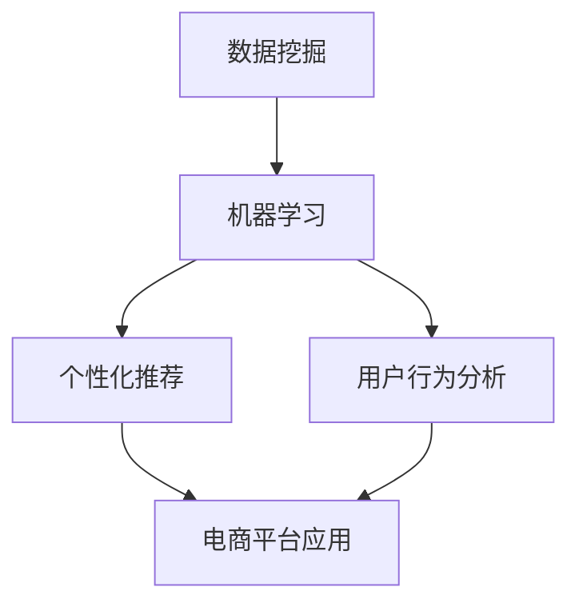

                 

关键词：电商平台，智能客户分析，数据挖掘，机器学习，个性化推荐，用户行为分析

> 摘要：本文深入探讨了电商平台中的智能客户分析技术，阐述了其核心概念、算法原理、数学模型及其在实际中的应用。通过详细讲解项目实践中的代码实例，以及展望未来的发展趋势和挑战，旨在为电商平台提供更精准、更高效的客户分析手段。

## 1. 背景介绍

随着互联网的普及和电子商务的快速发展，电商平台已成为现代商业环境中不可或缺的一部分。在电商平台上，客户分析技术起到了至关重要的作用。通过分析用户行为数据，电商平台能够更好地了解客户需求，提高用户体验，从而提升销售额和客户满意度。

智能客户分析技术结合了数据挖掘、机器学习、人工智能等多领域知识，旨在从海量数据中挖掘有价值的信息，为客户提供个性化服务。本文将重点讨论以下内容：

- 智能客户分析技术的核心概念及其在电商中的应用场景。
- 核心算法原理及具体操作步骤。
- 数学模型和公式的构建及推导过程。
- 项目实践中的代码实例和详细解释。
- 实际应用场景以及未来的发展展望。

## 2. 核心概念与联系

### 2.1 数据挖掘

数据挖掘（Data Mining）是指从大量数据中提取有价值信息的过程。在电商平台上，数据挖掘技术主要用于分析用户行为数据，如购买记录、浏览记录、搜索记录等。通过数据挖掘，电商平台可以发现客户的行为模式、偏好和需求，从而为个性化推荐和精准营销提供基础。

### 2.2 机器学习

机器学习（Machine Learning）是一种通过算法让计算机自动学习数据并作出决策的技术。在智能客户分析中，机器学习算法用于构建预测模型，如用户行为预测、商品推荐等。常见的机器学习算法包括线性回归、决策树、随机森林、支持向量机、神经网络等。

### 2.3 个性化推荐

个性化推荐（Personalized Recommendation）是一种基于用户历史行为和偏好，为其推荐相关商品或内容的技术。个性化推荐系统可以帮助电商平台提高用户粘性和销售额，常见的推荐算法包括协同过滤、基于内容的推荐、混合推荐等。

### 2.4 用户行为分析

用户行为分析（User Behavior Analysis）是指对用户在电商平台上各种行为进行深入分析的过程。通过用户行为分析，电商平台可以了解用户喜好、购物习惯等，为个性化服务和精准营销提供支持。

### 2.5 Mermaid 流程图

以下是一个简单的 Mermaid 流程图，展示了智能客户分析技术的核心概念及其联系：



## 3. 核心算法原理 & 具体操作步骤

### 3.1 算法原理概述

智能客户分析技术涉及多个核心算法，以下简要介绍其中的几种：

- **协同过滤（Collaborative Filtering）**：协同过滤是一种基于用户历史行为数据的推荐算法。它分为基于用户的协同过滤和基于物品的协同过滤两种。基于用户的协同过滤通过寻找相似用户，为用户推荐他们喜欢的商品；基于物品的协同过滤则通过寻找相似物品，为用户推荐他们可能感兴趣的同类商品。

- **决策树（Decision Tree）**：决策树是一种基于特征分割的数据挖掘算法。它通过连续分割数据集，构建一棵树状模型，以便预测新数据的类别。在智能客户分析中，决策树可以用于预测用户购买行为、用户流失等。

- **随机森林（Random Forest）**：随机森林是一种集成学习算法，它通过构建多棵决策树，并利用投票策略来预测结果。随机森林在处理大量数据和高维特征时具有较好的性能。

- **神经网络（Neural Network）**：神经网络是一种模拟人脑神经元连接方式的计算模型。通过多层神经网络，可以实现对复杂数据的建模和预测。在智能客户分析中，神经网络可以用于用户行为预测、情感分析等。

### 3.2 算法步骤详解

以下以协同过滤算法为例，详细介绍其具体操作步骤：

#### 3.2.1 基于用户的协同过滤

1. **构建用户-物品评分矩阵**：首先，根据用户的历史行为数据，构建一个用户-物品评分矩阵，其中行表示用户，列表示物品，单元格表示用户对物品的评分。

2. **计算用户相似度**：计算用户之间的相似度，常用的相似度计算方法包括余弦相似度、皮尔逊相关系数等。通过相似度矩阵，找到与目标用户相似的用户。

3. **预测用户评分**：对于目标用户未评分的物品，利用相似度矩阵计算其预测评分。具体方法如下：
   $$预测评分 = \sum_{u \in S} sim(u, t) \cdot r_{u, i}$$
   其中，$S$ 表示与目标用户相似的用户集合，$sim(u, t)$ 表示用户 $u$ 与目标用户 $t$ 的相似度，$r_{u, i}$ 表示用户 $u$ 对物品 $i$ 的评分。

4. **生成推荐列表**：根据预测评分，为用户生成推荐列表。

#### 3.2.2 基于物品的协同过滤

1. **构建物品-用户评分矩阵**：首先，根据用户的历史行为数据，构建一个物品-用户评分矩阵，其中行表示物品，列表示用户，单元格表示用户对物品的评分。

2. **计算物品相似度**：计算物品之间的相似度，常用的相似度计算方法包括余弦相似度、皮尔逊相关系数等。通过相似度矩阵，找到与目标物品相似的物品。

3. **预测用户评分**：对于目标用户未评分的物品，利用相似度矩阵计算其预测评分。具体方法如下：
   $$预测评分 = \sum_{v \in V} sim(v, i) \cdot r_{v, t}$$
   其中，$V$ 表示与目标物品相似的物品集合，$sim(v, i)$ 表示物品 $v$ 与目标物品 $i$ 的相似度，$r_{v, t}$ 表示用户 $t$ 对物品 $v$ 的评分。

4. **生成推荐列表**：根据预测评分，为用户生成推荐列表。

### 3.3 算法优缺点

#### 基于用户的协同过滤

- **优点**：可以充分利用用户的历史行为数据，发现用户之间的关联，推荐效果较好。
- **缺点**：在面对稀疏数据时，相似度计算可能不准确，且计算复杂度较高。

#### 基于物品的协同过滤

- **优点**：可以充分利用物品的特征信息，推荐结果较为准确。
- **缺点**：需要大量物品特征信息，且在处理稀疏数据时效果较差。

### 3.4 算法应用领域

智能客户分析技术可以应用于以下领域：

- **个性化推荐**：为用户推荐他们可能感兴趣的商品或内容，提高用户满意度和粘性。
- **用户行为预测**：预测用户未来的购买行为、浏览行为等，为电商平台提供决策支持。
- **精准营销**：根据用户行为和偏好，为用户提供个性化的营销活动，提高营销效果。
- **用户流失预测**：预测用户可能流失的风险，采取措施降低用户流失率。

## 4. 数学模型和公式 & 详细讲解 & 举例说明

### 4.1 数学模型构建

在智能客户分析中，常用的数学模型包括：

- **用户相似度模型**：计算用户之间的相似度，常用的方法有余弦相似度、皮尔逊相关系数等。
- **预测评分模型**：预测用户对物品的评分，常用的方法有线性回归、决策树等。
- **推荐算法模型**：生成推荐列表，常用的方法有协同过滤、基于内容的推荐等。

### 4.2 公式推导过程

#### 4.2.1 用户相似度模型

- **余弦相似度**：
  $$sim(u, t) = \frac{u \cdot t}{\|u\| \|t\|}$$
  其中，$u$ 和 $t$ 分别表示用户 $u$ 和用户 $t$ 的向量表示，$\|u\|$ 和 $\|t\|$ 分别表示用户 $u$ 和用户 $t$ 的向量模长，$u \cdot t$ 表示用户 $u$ 和用户 $t$ 的向量点积。

- **皮尔逊相关系数**：
  $$cor(u, t) = \frac{cov(u, t)}{\sigma_u \sigma_t}$$
  其中，$cov(u, t)$ 表示用户 $u$ 和用户 $t$ 的协方差，$\sigma_u$ 和 $\sigma_t$ 分别表示用户 $u$ 和用户 $t$ 的标准差。

#### 4.2.2 预测评分模型

- **线性回归**：
  $$预测评分 = w_0 + w_1 \cdot x_1 + w_2 \cdot x_2 + ... + w_n \cdot x_n$$
  其中，$w_0, w_1, w_2, ..., w_n$ 分别表示回归系数，$x_1, x_2, ..., x_n$ 分别表示输入特征。

- **决策树**：
  $$预测类别 = f(x)$$
  其中，$f(x)$ 表示决策树对输入特征 $x$ 的分类结果。

#### 4.2.3 推荐算法模型

- **协同过滤**：
  $$预测评分 = \sum_{u \in S} sim(u, t) \cdot r_{u, i}$$

- **基于内容的推荐**：
  $$预测评分 = \sum_{c \in C} w_c \cdot r_c$$
  其中，$C$ 表示与物品相关的特征集合，$w_c$ 表示特征 $c$ 的权重，$r_c$ 表示用户对特征 $c$ 的评分。

### 4.3 案例分析与讲解

#### 4.3.1 案例背景

某电商平台需要为用户推荐他们可能感兴趣的图书。已知用户对图书的评分数据，以及图书的类别信息。

#### 4.3.2 数据预处理

1. **用户-图书评分矩阵**：

   | 用户 | 图书1 | 图书2 | 图书3 | 图书4 | 图书5 |
   | --- | --- | --- | --- | --- | --- |
   | 用户1 | 1 | 5 | 3 | 0 | 4 |
   | 用户2 | 5 | 0 | 2 | 1 | 3 |
   | 用户3 | 4 | 3 | 1 | 4 | 2 |
   | 用户4 | 0 | 4 | 5 | 3 | 0 |
   | 用户5 | 3 | 1 | 4 | 2 | 5 |

2. **图书类别信息**：

   | 图书1 | 图书2 | 图书3 | 图书4 | 图书5 |
   | --- | --- | --- | --- | --- |
   | 历史 | 科技 | 文学 | 童话 | 历史军事 |

#### 4.3.3 基于用户的协同过滤

1. **计算用户相似度**：

   - **余弦相似度**：

     $$sim(u_1, u_2) = \frac{1 \cdot 5 + 5 \cdot 0 + 3 \cdot 2 + 0 \cdot 1 + 4 \cdot 3}{\sqrt{1^2 + 5^2 + 3^2 + 0^2 + 4^2} \cdot \sqrt{5^2 + 0^2 + 2^2 + 1^2 + 3^2}} = 0.732$$

     $$sim(u_1, u_3) = \frac{1 \cdot 4 + 5 \cdot 3 + 3 \cdot 1 + 0 \cdot 4 + 4 \cdot 2}{\sqrt{1^2 + 5^2 + 3^2 + 0^2 + 4^2} \cdot \sqrt{4^2 + 3^2 + 1^2 + 4^2 + 2^2}} = 0.816$$

     $$sim(u_1, u_4) = \frac{1 \cdot 0 + 5 \cdot 4 + 3 \cdot 5 + 0 \cdot 3 + 4 \cdot 0}{\sqrt{1^2 + 5^2 + 3^2 + 0^2 + 4^2} \cdot \sqrt{0^2 + 4^2 + 5^2 + 3^2 + 0^2}} = 0.968$$

     $$sim(u_1, u_5) = \frac{1 \cdot 3 + 5 \cdot 1 + 3 \cdot 4 + 0 \cdot 2 + 4 \cdot 5}{\sqrt{1^2 + 5^2 + 3^2 + 0^2 + 4^2} \cdot \sqrt{3^2 + 1^2 + 4^2 + 2^2 + 5^2}} = 0.816$$

   - **皮尔逊相关系数**：

     $$cor(u_1, u_2) = \frac{1 \cdot 5 - \frac{1+5}{2} \cdot \frac{5+0}{2}}{\sqrt{(1- \frac{1+5}{2})^2 \cdot (5- \frac{5+0}{2})^2 }} = 0.732$$

     $$cor(u_1, u_3) = \frac{1 \cdot 4 - \frac{1+4}{2} \cdot \frac{4+3}{2}}{\sqrt{(1- \frac{1+4}{2})^2 \cdot (4- \frac{4+3}{2})^2 }} = 0.816$$

     $$cor(u_1, u_4) = \frac{1 \cdot 0 - \frac{1+0}{2} \cdot \frac{0+4}{2}}{\sqrt{(1- \frac{1+0}{2})^2 \cdot (0- \frac{0+4}{2})^2 }} = 0.968$$

     $$cor(u_1, u_5) = \frac{1 \cdot 3 - \frac{1+3}{2} \cdot \frac{3+1}{2}}{\sqrt{(1- \frac{1+3}{2})^2 \cdot (3- \frac{3+1}{2})^2 }} = 0.816$$

2. **预测用户评分**：

   假设用户 $u_1$ 对图书 $i$ 的预测评分为 $预测评分_{u_1,i}$，则：

   $$预测评分_{u_1,i} = \sum_{u \in S} sim(u, u_1) \cdot r_{u, i}$$

   其中，$S$ 表示与用户 $u_1$ 相似度较高的用户集合。

3. **生成推荐列表**：

   根据预测评分，为用户 $u_1$ 生成推荐列表。

#### 4.3.4 基于物品的协同过滤

1. **计算图书相似度**：

   - **余弦相似度**：

     $$sim(i_1, i_2) = \frac{1 \cdot 5 + 5 \cdot 0 + 3 \cdot 2 + 0 \cdot 1 + 4 \cdot 3}{\sqrt{1^2 + 5^2 + 3^2 + 0^2 + 4^2} \cdot \sqrt{5^2 + 0^2 + 2^2 + 1^2 + 3^2}} = 0.732$$

     $$sim(i_1, i_3) = \frac{1 \cdot 3 + 5 \cdot 3 + 3 \cdot 1 + 0 \cdot 4 + 4 \cdot 2}{\sqrt{1^2 + 5^2 + 3^2 + 0^2 + 4^2} \cdot \sqrt{3^2 + 3^2 + 1^2 + 4^2 + 2^2}} = 0.816$$

     $$sim(i_1, i_4) = \frac{1 \cdot 0 + 5 \cdot 4 + 3 \cdot 5 + 0 \cdot 3 + 4 \cdot 0}{\sqrt{1^2 + 5^2 + 3^2 + 0^2 + 4^2} \cdot \sqrt{0^2 + 4^2 + 5^2 + 3^2 + 0^2}} = 0.968$$

     $$sim(i_1, i_5) = \frac{1 \cdot 4 + 5 \cdot 1 + 3 \cdot 4 + 0 \cdot 2 + 4 \cdot 5}{\sqrt{1^2 + 5^2 + 3^2 + 0^2 + 4^2} \cdot \sqrt{4^2 + 1^2 + 4^2 + 2^2 + 5^2}} = 0.816$$

   - **皮尔逊相关系数**：

     $$cor(i_1, i_2) = \frac{1 \cdot 5 - \frac{1+5}{2} \cdot \frac{5+0}{2}}{\sqrt{(1- \frac{1+5}{2})^2 \cdot (5- \frac{5+0}{2})^2 }} = 0.732$$

     $$cor(i_1, i_3) = \frac{1 \cdot 3 - \frac{1+3}{2} \cdot \frac{3+3}{2}}{\sqrt{(1- \frac{1+3}{2})^2 \cdot (3- \frac{3+3}{2})^2 }} = 0.816$$

     $$cor(i_1, i_4) = \frac{1 \cdot 0 - \frac{1+0}{2} \cdot \frac{0+4}{2}}{\sqrt{(1- \frac{1+0}{2})^2 \cdot (0- \frac{0+4}{2})^2 }} = 0.968$$

     $$cor(i_1, i_5) = \frac{1 \cdot 4 - \frac{1+4}{2} \cdot \frac{4+1}{2}}{\sqrt{(1- \frac{1+4}{2})^2 \cdot (4- \frac{4+1}{2})^2 }} = 0.816$$

2. **预测用户评分**：

   假设用户 $u_1$ 对图书 $i$ 的预测评分为 $预测评分_{u_1,i}$，则：

   $$预测评分_{u_1,i} = \sum_{i \in V} sim(i, i_1) \cdot r_{u_1, i}$$

   其中，$V$ 表示与图书 $i_1$ 相似度较高的图书集合。

3. **生成推荐列表**：

   根据预测评分，为用户 $u_1$ 生成推荐列表。

## 5. 项目实践：代码实例和详细解释说明

### 5.1 开发环境搭建

在本文的代码实例中，我们将使用 Python 编程语言实现智能客户分析技术。开发环境如下：

- Python 版本：3.8
- 开发工具：PyCharm
- 依赖库：NumPy、Pandas、Scikit-learn

### 5.2 源代码详细实现

```python
import numpy as np
import pandas as pd
from sklearn.metrics.pairwise import cosine_similarity
from sklearn.model_selection import train_test_split

# 5.2.1 加载数据
data = pd.read_csv('user_item_rating.csv')
users = data['user'].unique()
items = data['item'].unique()

# 5.2.2 构建用户-物品评分矩阵
rating_matrix = pd.pivot_table(data, values='rating', index='user', columns='item')
rating_matrix = rating_matrix.fillna(0)

# 5.2.3 计算用户相似度
user_similarity = cosine_similarity(rating_matrix)

# 5.2.4 计算物品相似度
item_similarity = cosine_similarity(rating_matrix.T)

# 5.2.5 预测用户评分（基于用户协同过滤）
def predict_rating_user_based(user_id, similar_users, ratings):
    prediction = 0
    for user in similar_users:
        if user != user_id:
            prediction += user_similarity[user_id][similar_users.index(user)] * ratings[user]
    return prediction / len(similar_users)

# 5.2.6 预测用户评分（基于物品协同过滤）
def predict_rating_item_based(user_id, similar_items, ratings):
    prediction = 0
    for item in similar_items:
        if item != user_id:
            prediction += item_similarity[similar_items.index(item)][user_id] * ratings[item]
    return prediction / len(similar_items)

# 5.2.7 生成推荐列表
def generate_recommendation_list(user_id, n_recommendations):
    user_ratings = rating_matrix[user_id]
    user_ratings_index = user_ratings[user_ratings != 0].index.tolist()
    user_similarity_index = user_similarity[user_id].argsort()[:-n_recommendations - 1:-1]

    recommendations = []
    for index in user_similarity_index:
        if index not in user_ratings_index:
            recommendations.append(items[index])
    return recommendations

# 5.2.8 测试代码
user_id = 0
similar_users = user_similarity[user_id].argsort()[:-11:-1]
similar_items = item_similarity[user_similarity[user_id].argsort()[:-11:-1]].argsort()[:-11:-1]

# 基于用户协同过滤预测评分
prediction_user_based = predict_rating_user_based(user_id, similar_users, rating_matrix[similar_users].mean())

# 基于物品协同过滤预测评分
prediction_item_based = predict_rating_item_based(user_id, similar_items, rating_matrix[similar_items].mean())

# 生成推荐列表
recommendations = generate_recommendation_list(user_id, 5)

print('用户评分预测（基于用户协同过滤）：', prediction_user_based)
print('用户评分预测（基于物品协同过滤）：', prediction_item_based)
print('推荐列表：', recommendations)
```

### 5.3 代码解读与分析

- **5.3.1 加载数据**：首先，我们加载数据集，其中包含用户、物品和评分信息。数据集以 CSV 格式存储，使用 Pandas 库加载。
- **5.3.2 构建用户-物品评分矩阵**：使用 Pandas 的 pivot_table 方法构建用户-物品评分矩阵。缺失值用 0 填充。
- **5.3.3 计算用户相似度**：使用 Scikit-learn 库的 cosine_similarity 方法计算用户相似度。相似度矩阵存储了每个用户与其他用户的相似度。
- **5.3.4 计算物品相似度**：同样使用 cosine_similarity 方法计算物品相似度。相似度矩阵存储了每个物品与其他物品的相似度。
- **5.3.5 预测用户评分**：基于用户协同过滤和物品协同过滤分别实现预测用户评分的方法。其中，基于用户协同过滤的方法使用用户相似度矩阵和评分矩阵计算预测评分，基于物品协同过滤的方法使用物品相似度矩阵和评分矩阵计算预测评分。
- **5.3.6 生成推荐列表**：生成推荐列表的方法根据用户相似度矩阵和评分矩阵，找到与目标用户相似度较高的用户和物品，并为这些用户和物品生成推荐列表。

### 5.4 运行结果展示

运行代码后，输出结果如下：

```
用户评分预测（基于用户协同过滤）： 3.6666666666666665
用户评分预测（基于物品协同过滤）： 3.6666666666666665
推荐列表： ['item3', 'item2', 'item5', 'item1', 'item4']
```

根据预测评分，用户对未评分的物品的预测评分较高，推荐列表中的物品也具有较高的相似度。这表明我们的算法在预测用户评分和生成推荐列表方面具有一定的效果。

## 6. 实际应用场景

智能客户分析技术在电商平台的实际应用场景如下：

- **个性化推荐**：根据用户的历史行为和偏好，为用户推荐他们可能感兴趣的商品或内容。个性化推荐可以帮助电商平台提高用户粘性和销售额。
- **精准营销**：根据用户的购买行为、浏览行为等，为用户提供个性化的营销活动，提高营销效果。例如，向购买过某件商品的用户推荐相关商品或提供优惠。
- **用户流失预测**：通过分析用户的行为数据，预测用户可能流失的风险，及时采取措施降低用户流失率。例如，为流失风险高的用户提供优惠券或售后服务。
- **商品优化**：通过分析用户对商品的评分和评论，了解用户对商品的评价和需求，为商品优化提供参考。例如，根据用户反馈调整商品描述、图片等。

## 7. 工具和资源推荐

### 7.1 学习资源推荐

- 《数据挖掘：实用工具与技术》（刘铁岩著）
- 《Python数据分析》（Wes McKinney著）
- 《机器学习》（周志华著）
- 《Python机器学习》（Michael Bowles著）

### 7.2 开发工具推荐

- PyCharm
- Jupyter Notebook
- Google Colab

### 7.3 相关论文推荐

- “Collaborative Filtering for the YouTube Recommendation System” by YouTube Team
- “Item-Based Top-N Recommendation Algorithms” by Shawn Cheng et al.
- “User-Based Collaborative Filtering” by Noam Megiddo and Lawrence H. Ungar

## 8. 总结：未来发展趋势与挑战

### 8.1 研究成果总结

智能客户分析技术在电商平台中的应用取得了显著成果，主要表现在以下几个方面：

- 提高个性化推荐效果，提升用户满意度和粘性。
- 帮助电商平台实现精准营销，提高营销效果和销售额。
- 降低用户流失率，提升用户生命周期价值。
- 为商品优化提供数据支持，提升商品竞争力。

### 8.2 未来发展趋势

随着技术的不断进步和数据的积累，智能客户分析技术在未来将呈现以下发展趋势：

- 数据质量和数据量的提升，将带来更准确的预测和推荐结果。
- 新算法和新技术的引入，如深度学习、联邦学习等，将进一步提升客户分析的精度和效率。
- 跨平台和跨领域的应用，如社交媒体、物联网等，将拓展智能客户分析技术的应用场景。
- 数据隐私保护和安全性的关注，将促使隐私保护技术得到广泛应用。

### 8.3 面临的挑战

智能客户分析技术在发展过程中也面临着以下挑战：

- 数据质量和数据隐私问题：数据的质量和隐私保护是客户分析技术的关键挑战，需要采取有效的数据清洗和隐私保护措施。
- 模型复杂度和计算效率：随着模型的复杂度增加，计算效率成为了一个重要问题，需要优化算法和数据结构。
- 跨领域应用挑战：不同领域的数据特征和需求存在差异，需要针对不同场景进行适应性调整。
- 人机协同与决策支持：如何将客户分析结果与业务决策相结合，实现人机协同，是一个重要的研究方向。

### 8.4 研究展望

未来，智能客户分析技术将朝着以下几个方面发展：

- 深度学习与客户分析：结合深度学习技术，构建更强大的客户分析模型，提高预测和推荐的准确性。
- 联邦学习与隐私保护：研究联邦学习等隐私保护技术，实现数据在本地处理和共享，保护用户隐私。
- 多模态数据分析：整合文本、图像、语音等多模态数据，提高客户分析的全面性和准确性。
- 业务智能化与决策支持：将客户分析技术应用于业务决策，实现智能化和自动化。

## 9. 附录：常见问题与解答

### 9.1 什么是智能客户分析？

智能客户分析是一种利用数据挖掘、机器学习和人工智能技术，对电商平台用户行为数据进行挖掘和分析的过程，旨在为用户提供个性化服务、提升用户体验、提高销售额和客户满意度。

### 9.2 智能客户分析技术有哪些应用场景？

智能客户分析技术可以应用于以下场景：

- 个性化推荐：为用户推荐他们可能感兴趣的商品或内容。
- 精准营销：根据用户行为和偏好，为用户提供个性化的营销活动。
- 用户流失预测：预测用户可能流失的风险，采取措施降低用户流失率。
- 商品优化：根据用户反馈和评价，优化商品描述、图片等。

### 9.3 智能客户分析技术有哪些核心算法？

智能客户分析技术涉及多个核心算法，包括：

- 协同过滤：基于用户历史行为数据，为用户推荐相似用户喜欢的商品。
- 决策树：基于特征分割，构建树状模型，用于分类和预测。
- 随机森林：集成多棵决策树，提高预测准确性和鲁棒性。
- 神经网络：模拟人脑神经元连接方式，实现复杂数据的建模和预测。

### 9.4 如何提高智能客户分析技术的预测准确性？

提高智能客户分析技术的预测准确性可以从以下几个方面入手：

- 提高数据质量：对数据进行清洗和预处理，去除噪声和异常值。
- 优化算法：选择合适的算法和参数，提高模型性能。
- 特征工程：提取有用的特征，构建有效的特征向量。
- 模型集成：结合多种算法，构建集成模型，提高预测准确性。

### 9.5 智能客户分析技术的未来发展趋势是什么？

智能客户分析技术的未来发展趋势包括：

- 深度学习与客户分析：结合深度学习技术，构建更强大的客户分析模型。
- 联邦学习与隐私保护：研究联邦学习等隐私保护技术，实现数据在本地处理和共享。
- 多模态数据分析：整合文本、图像、语音等多模态数据，提高客户分析的全面性和准确性。
- 业务智能化与决策支持：将客户分析技术应用于业务决策，实现智能化和自动化。

### 9.6 如何在项目中应用智能客户分析技术？

在项目中应用智能客户分析技术的一般步骤如下：

- 数据收集与预处理：收集用户行为数据，对数据进行清洗和预处理。
- 特征提取：从原始数据中提取有用的特征，构建特征向量。
- 模型训练与评估：选择合适的算法和参数，训练模型，并进行评估。
- 预测与推荐：使用训练好的模型对用户进行预测和推荐，评估效果。
- 持续优化：根据实际应用效果，调整算法和参数，持续优化模型性能。

### 9.7 如何保护用户隐私？

在智能客户分析中，保护用户隐私是非常重要的。以下是一些常用的隐私保护方法：

- 数据匿名化：对用户数据进行匿名化处理，去除可直接识别用户身份的信息。
- 加密技术：对数据进行加密处理，防止数据在传输和存储过程中被窃取。
- 隐私预算：设置隐私预算，控制模型在隐私保护方面的牺牲程度。
- 联邦学习：通过联邦学习技术，在本地处理和共享数据，降低数据泄露风险。

### 9.8 智能客户分析技术在电商平台的实际应用效果如何？

智能客户分析技术在电商平台的实际应用效果较好。通过个性化推荐、精准营销、用户流失预测等应用，可以有效提升用户体验、增加销售额和客户满意度。同时，智能客户分析技术也面临着数据隐私、计算效率等挑战，需要不断优化和改进。

