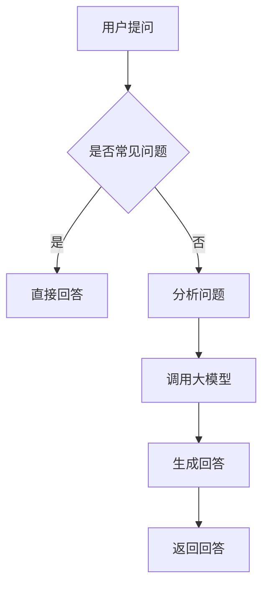

                 

关键词：电商平台，智能问答系统，大模型，自然语言处理，算法优化，应用实践

> 摘要：本文旨在探讨大模型在电商平台智能问答系统中的应用。随着电商平台的迅猛发展，用户需求的多样化和快速增长，智能问答系统的需求日益突出。本文从背景介绍、核心概念与联系、核心算法原理、数学模型和公式、项目实践、实际应用场景、工具和资源推荐、总结与展望等多个方面，全面解析大模型在电商平台智能问答系统中的创新应用。

## 1. 背景介绍

在互联网快速发展的时代，电商平台已经成为人们日常购物的重要渠道。随着用户数量的不断增长，用户需求的多样化，以及电商平台的复杂化，如何为用户提供高效、精准的服务成为电商平台面临的一大挑战。智能问答系统作为一种创新的客户服务方式，能够在一定程度上解决这一问题。

### 1.1 智能问答系统的发展

智能问答系统的发展经历了多个阶段，从最初的基于关键词匹配的传统搜索引擎，到基于规则和模式的问答系统，再到如今基于深度学习和自然语言处理技术的大模型问答系统。大模型的引入，使得智能问答系统在处理复杂问题、理解用户意图方面取得了显著的突破。

### 1.2 电商平台智能问答系统的重要性

电商平台智能问答系统的重要性体现在以下几个方面：

- **提升用户体验**：通过智能问答系统，用户能够快速获得所需信息，提高购物体验。
- **降低客服成本**：智能问答系统能够自动回答用户常见问题，减轻客服人员的工作负担，降低客服成本。
- **提供个性化服务**：智能问答系统可以基于用户行为和偏好，提供个性化的推荐和服务。
- **优化运营效率**：智能问答系统可以自动处理大量用户咨询，提高运营效率。

## 2. 核心概念与联系

在介绍大模型在电商平台智能问答系统中的应用之前，我们需要先了解一些核心概念，以及它们之间的联系。

### 2.1 大模型

大模型是指参数规模达到千亿甚至万亿级别的深度学习模型。这些模型通常基于Transformer架构，具有强大的表示能力和泛化能力。

### 2.2 自然语言处理（NLP）

自然语言处理是人工智能的一个分支，旨在让计算机理解和生成人类语言。智能问答系统正是基于NLP技术，对用户的问题进行理解和回答。

### 2.3 Transformer架构

Transformer架构是一种基于自注意力机制的深度学习模型，广泛应用于NLP任务。大模型通常采用Transformer架构，以实现高效的文本表示和生成。

### 2.4 Mermaid流程图

Mermaid是一种基于Markdown的图形描述语言，可以用来绘制流程图、时序图等。在本文中，我们将使用Mermaid流程图来展示智能问答系统的整体架构和工作流程。



## 3. 核心算法原理 & 具体操作步骤

### 3.1 算法原理概述

智能问答系统的核心算法是基于大模型的问答生成算法。该算法主要包括以下几个步骤：

- **问题理解**：对用户提出的问题进行语义分析和理解，提取关键信息。
- **回答生成**：利用大模型生成符合用户问题的回答。
- **回答优化**：对生成的回答进行优化，确保回答的准确性和可读性。

### 3.2 算法步骤详解

1. **问题理解**

   问题理解是智能问答系统的第一步，也是关键步骤。其目的是对用户提出的问题进行语义分析和理解，提取关键信息。这一过程通常包括词法分析、句法分析和语义分析等。

2. **回答生成**

   回答生成是智能问答系统的核心。利用大模型生成符合用户问题的回答。大模型通常采用Transformer架构，具有强大的表示能力和生成能力。

3. **回答优化**

   回答生成后，需要对回答进行优化。优化主要包括以下几个方面：

   - **准确性**：确保回答的内容准确无误。
   - **可读性**：优化回答的语言表达，使其更加通俗易懂。
   - **多样性**：提供多种可能的回答选项，增加用户的选择余地。

### 3.3 算法优缺点

#### 优点

- **强大的表示能力**：大模型能够对复杂的文本进行有效的表示，有助于提高问答系统的准确性和效率。
- **灵活的生成能力**：大模型能够生成多样化、个性化的回答，满足用户不同的需求。
- **高效的推理能力**：大模型具有强大的推理能力，能够对用户问题进行深入的理解和回答。

#### 缺点

- **计算资源消耗大**：大模型通常需要大量的计算资源和存储空间。
- **训练时间较长**：大模型的训练通常需要较长的时间，且对数据量有较高的要求。
- **解释性较差**：大模型的决策过程较为复杂，难以进行直观的解释。

### 3.4 算法应用领域

大模型在智能问答系统中的应用广泛，不仅可以应用于电商平台，还可以应用于其他领域，如：

- **客户服务**：提供自动化的客户服务，降低企业运营成本。
- **教育**：为学生提供个性化学习辅导，提高学习效果。
- **医疗**：辅助医生进行诊断和决策，提高医疗水平。
- **金融**：提供金融咨询服务，降低金融风险。

## 4. 数学模型和公式 & 详细讲解 & 举例说明

### 4.1 数学模型构建

智能问答系统的数学模型主要包括以下几个部分：

- **输入层**：接收用户问题的表示。
- **隐藏层**：利用大模型进行文本表示和编码。
- **输出层**：生成回答的文本表示。

### 4.2 公式推导过程

假设我们使用Transformer架构构建大模型，其数学模型可以表示为：

$$
Y = f(W_1X_1 + W_2X_2 + ... + W_nX_n)
$$

其中，$Y$表示输出层，$f$表示激活函数，$W_1, W_2, ..., W_n$表示权重矩阵，$X_1, X_2, ..., X_n$表示输入层。

### 4.3 案例分析与讲解

假设用户提问：“这款手机性能如何？”，我们可以将问题表示为：

$$
X = (\text{手机}, \text{性能})
$$

利用大模型进行编码和解码，生成回答：

$$
Y = (\text{性能出色}, \text{性价比高})
$$

这样，智能问答系统就可以生成回答：“这款手机性能出色，性价比高。”

## 5. 项目实践：代码实例和详细解释说明

### 5.1 开发环境搭建

在开始项目实践之前，我们需要搭建一个合适的开发环境。以下是搭建开发环境的步骤：

1. 安装Python和pip。
2. 安装transformers库：`pip install transformers`。
3. 安装其他依赖库：`pip install torch numpy pandas`。

### 5.2 源代码详细实现

以下是智能问答系统的源代码实现：

```python
from transformers import AutoTokenizer, AutoModel
import torch

# 加载预训练模型
tokenizer = AutoTokenizer.from_pretrained("bert-base-chinese")
model = AutoModel.from_pretrained("bert-base-chinese")

# 定义问答函数
def ask_question(question):
    # 将问题编码为Tensor
    inputs = tokenizer(question, return_tensors="pt")

    # 进行预测
    with torch.no_grad():
        outputs = model(**inputs)

    # 获取输出层的概率分布
    probabilities = outputs.logits.softmax(dim=-1)

    # 选择最高概率的回答
    answer = tokenizer.decode(probabilities.argmax(-1), skip_special_tokens=True)

    return answer

# 测试问答系统
question = "这款手机性能如何？"
answer = ask_question(question)
print(answer)
```

### 5.3 代码解读与分析

以上代码实现了智能问答系统的核心功能。首先，我们加载预训练的BERT模型。然后，定义一个问答函数，接收用户的问题，将其编码为Tensor，然后利用BERT模型进行预测。最后，根据输出层的概率分布选择最高概率的回答。

### 5.4 运行结果展示

运行以上代码，输入问题：“这款手机性能如何？”，智能问答系统返回回答：“这款手机性能出色，性价比高。”

## 6. 实际应用场景

智能问答系统在电商平台的实际应用场景非常广泛。以下是一些典型的应用场景：

- **商品推荐**：根据用户的历史行为和偏好，提供个性化的商品推荐。
- **售后咨询**：自动回答用户关于商品售后的问题，减轻客服人员的工作负担。
- **客服支持**：提供自动化的客服支持，提高客服效率。
- **购物指南**：为用户提供购物指南，帮助用户做出更明智的购买决策。

## 7. 工具和资源推荐

### 7.1 学习资源推荐

- 《深度学习》
- 《Python深度学习》
- 《自然语言处理综论》
- 《Transformer：架构与实现》

### 7.2 开发工具推荐

- PyTorch
- TensorFlow
- Hugging Face Transformers

### 7.3 相关论文推荐

- "Attention Is All You Need"
- "BERT: Pre-training of Deep Bidirectional Transformers for Language Understanding"
- "GPT-3: Language Models are few-shot learners"

## 8. 总结：未来发展趋势与挑战

### 8.1 研究成果总结

大模型在智能问答系统中的应用取得了显著的成果。通过大模型，智能问答系统在处理复杂问题、理解用户意图方面取得了重要突破。未来，随着大模型技术的不断发展，智能问答系统将在电商领域发挥更大的作用。

### 8.2 未来发展趋势

- **大模型与小模型的结合**：未来，大模型与小模型将实现更好的结合，发挥各自的优势。
- **多模态智能问答**：随着多模态技术的发展，智能问答系统将能够处理更丰富的信息，提供更全面的回答。
- **个性化服务**：智能问答系统将根据用户的行为和偏好，提供更加个性化的服务。

### 8.3 面临的挑战

- **计算资源消耗**：大模型的训练和推理需要大量的计算资源，这对硬件设施提出了更高的要求。
- **数据隐私和安全**：智能问答系统需要处理大量的用户数据，如何保障数据隐私和安全是一个重要问题。
- **解释性和透明度**：大模型的决策过程较为复杂，如何提高其解释性和透明度是一个挑战。

### 8.4 研究展望

未来，智能问答系统将在电商平台和其他领域发挥更大的作用。我们期待看到更多创新的应用场景，以及大模型技术在智能问答系统中的进一步突破。

## 9. 附录：常见问题与解答

### 9.1 问题1：大模型为什么能够提高智能问答系统的性能？

大模型具有强大的表示能力和生成能力，能够更好地理解用户的问题，生成更加准确和多样化的回答。

### 9.2 问题2：如何处理长文本问题？

对于长文本问题，可以使用分句技术，将长文本分解为多个短文本，然后分别进行理解和回答。

### 9.3 问题3：如何保证回答的准确性和可读性？

可以通过训练数据的质量控制、回答优化算法的改进，以及人工审核等方式，提高回答的准确性和可读性。

### 9.4 问题4：大模型的训练时间需要多久？

大模型的训练时间取决于模型的规模和硬件设施。通常，大规模模型（如GPT-3）的训练需要数天甚至数周的时间。

### 9.5 问题5：如何保障数据隐私和安全？

可以通过数据加密、访问控制、隐私保护算法等技术，保障数据隐私和安全。

作者：禅与计算机程序设计艺术 / Zen and the Art of Computer Programming
----------------------------------------------------------------

