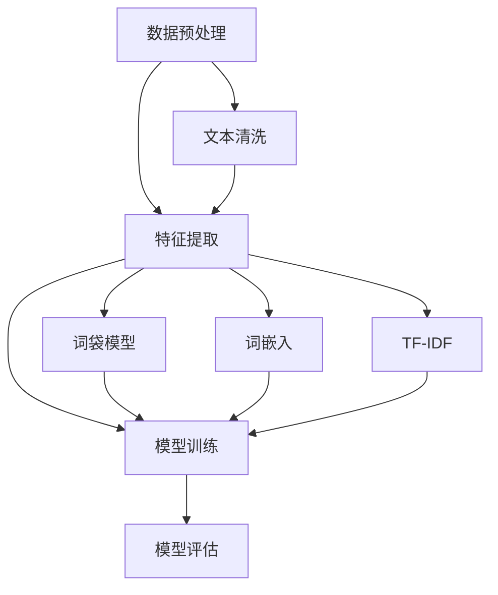

                 

### 1. 背景介绍

随着互联网技术的飞速发展，电商平台已经成为现代商业不可或缺的一部分。用户在电商平台上的互动行为，如评论、搜索、提问等，产生了大量的自然语言数据。这些数据不仅为电商平台提供了宝贵的用户反馈信息，也蕴含了用户行为模式和偏好趋势。自然语言处理（Natural Language Processing，NLP）作为人工智能的重要分支，致力于使计算机能够理解、生成和处理人类语言，正日益成为电商平台提升用户体验和运营效率的关键技术。

自然语言处理技术的应用不仅局限于文本信息的理解和生成，还涉及到语音识别、情感分析、命名实体识别等多个领域。这些技术的结合使得电商平台能够更智能地响应用户需求，提供个性化推荐、智能客服、精准营销等服务。本文将深入探讨自然语言处理在电商平台中的具体应用，分析其技术原理和实践案例，并展望未来的发展趋势。

首先，自然语言处理技术通过文本分析帮助电商平台更好地理解用户评论和反馈，从而优化产品和服务。其次，情感分析技术用于评估用户对产品或服务的情感倾向，为企业提供市场洞察。此外，智能客服和语音助手技术能够为用户提供24/7的即时服务，提高客户满意度。同时，个性化推荐系统通过分析用户行为和语言特征，为用户提供更加个性化的商品推荐。

本文将围绕以下主题展开：

1. **自然语言处理技术概述**：介绍NLP的核心概念和技术，包括文本分析、情感分析、命名实体识别等。
2. **自然语言处理在电商平台中的应用**：详细分析NLP在评论分析、智能客服、个性化推荐等场景中的应用。
3. **数学模型和算法原理**：阐述NLP中常用的数学模型和算法原理，包括词向量模型、序列模型等。
4. **项目实践：代码实例与详细解释**：提供实际应用中的代码实例，并进行详细解读。
5. **实际应用场景与未来展望**：探讨NLP在电商领域的发展趋势和面临的挑战。
6. **工具和资源推荐**：推荐相关学习资源、开发工具和相关论文。
7. **总结与展望**：总结研究成果，展望未来发展趋势与挑战。

通过本文的阅读，读者将全面了解自然语言处理技术在电商平台中的应用，掌握关键技术和实际操作方法，为未来研究和应用提供参考。

### 2. 核心概念与联系

#### 2.1 核心概念

自然语言处理（NLP）涉及多个核心概念，其中最重要的是文本分析（Text Analysis）、情感分析（Sentiment Analysis）、命名实体识别（Named Entity Recognition，NER）等。这些概念相互联系，共同构建了NLP技术的基础。

**文本分析**：文本分析是NLP的基本任务之一，旨在从大量文本数据中提取有用的信息。主要技术包括分词（Tokenization）、词性标注（Part-of-Speech Tagging）、句法分析（Syntactic Parsing）和语义分析（Semantic Analysis）。通过这些技术，计算机可以理解文本的基本结构、语法和语义，从而为后续的分析任务提供基础。

**情感分析**：情感分析旨在评估文本中表达的情感倾向，通常分为正面、负面和中性三种。情感分析广泛应用于市场调研、客户服务和舆情监控等领域。关键技术包括情感词典、机器学习和深度学习模型。通过这些模型，系统可以自动识别和分类文本中的情感倾向，帮助企业更好地理解用户反馈和市场动态。

**命名实体识别**：命名实体识别是识别文本中的特定实体，如人名、地名、组织名和产品名等。这项技术对于信息提取和知识图谱构建至关重要。命名实体识别通常涉及分类和命名实体识别模型，如条件随机场（CRF）和基于BiLSTM-CRF的模型。

#### 2.2 技术架构

自然语言处理的技术架构通常包括数据预处理、特征提取、模型训练和模型评估等环节。

**数据预处理**：数据预处理是NLP的首要步骤，包括文本清洗、分词和标准化等操作。文本清洗旨在去除无关信息和噪声，如HTML标签、标点和停用词。分词是将文本分割成词语或短语的过程，为后续特征提取和模型训练提供基础。

**特征提取**：特征提取是将原始文本转换为计算机可以处理的结构化数据的过程。常用的特征提取技术包括词袋模型（Bag of Words，BOW）、词嵌入（Word Embedding）和TF-IDF（Term Frequency-Inverse Document Frequency）。词嵌入技术通过将词语映射到高维向量空间，使得计算机能够理解词语的语义关系。

**模型训练**：模型训练是NLP的核心步骤，旨在通过大量标注数据训练出能够自动识别和分类文本的模型。常用的模型包括朴素贝叶斯（Naive Bayes）、支持向量机（SVM）、深度学习模型（如卷积神经网络（CNN）和循环神经网络（RNN））等。

**模型评估**：模型评估用于评估训练出的模型的性能，常用的评估指标包括准确率（Accuracy）、召回率（Recall）和F1值（F1 Score）。通过模型评估，可以发现模型的不足并进行优化。

#### 2.3 Mermaid 流程图

以下是一个简化的Mermaid流程图，展示了NLP技术架构的各个步骤：



在这个流程图中，数据预处理包括文本清洗和分词等步骤，特征提取包括词袋模型、词嵌入和TF-IDF等方法，模型训练使用不同的算法，模型评估用于评估模型的性能。

通过上述核心概念和技术的介绍，我们可以更深入地理解自然语言处理在电商平台中的应用，为后续内容的讨论提供基础。

### 3. 核心算法原理 & 具体操作步骤

#### 3.1 算法原理概述

在自然语言处理（NLP）中，核心算法的原理主要涉及文本分析、情感分析和命名实体识别等方面。以下将分别介绍这些算法的基本原理。

**文本分析**：文本分析是NLP的基础任务，包括分词、词性标注、句法分析和语义分析等。分词是将文本分割成单词或短语的步骤，词性标注则是为每个词赋予词性标签，如名词、动词等。句法分析旨在理解句子的结构，如主语、谓语和宾语等。语义分析则进一步挖掘文本的深层含义，如指代消解和语义角色标注。

**情感分析**：情感分析的核心是判断文本中表达的情感倾向，通常分为正面、负面和中性三种。情感分析的基本原理包括基于规则的方法、基于统计的方法和基于机器学习的方法。基于规则的方法利用预定义的规则进行情感分类，基于统计的方法通过统计文本中情感词的频率进行分类，而基于机器学习的方法则通过训练大量标注数据构建分类模型。

**命名实体识别**：命名实体识别的目标是识别文本中的特定实体，如人名、地名、组织名和产品名等。命名实体识别通常使用分类和序列标注模型。分类模型为每个词或短语赋予实体标签，序列标注模型则通过标注序列的方式识别实体。

#### 3.2 算法步骤详解

**文本分析**

1. **分词**：将文本分割成词语或短语的步骤。常用的分词算法包括基于词频的分词算法、基于规则的分词算法和基于统计的分词算法。
2. **词性标注**：为每个词赋予词性标签，如名词、动词、形容词等。常用的词性标注工具包括NLTK、Stanford NLP和jieba等。
3. **句法分析**：通过构建句法树或依存关系图理解句子的结构。常用的句法分析工具包括Stanford NLP、spaCy和NLTK等。
4. **语义分析**：通过语义角色标注、指代消解等手段挖掘文本的深层含义。常用的语义分析工具包括WordNet、spaCy和AllenNLP等。

**情感分析**

1. **数据预处理**：清洗文本数据，去除无关信息和噪声，如HTML标签、标点和停用词。
2. **情感词典构建**：构建包含情感词和其情感倾向的词典。常用的情感词典包括SentiWordNet、VADER和AFIN-NET等。
3. **情感分类模型**：基于机器学习或深度学习训练情感分类模型。常用的模型包括朴素贝叶斯（Naive Bayes）、支持向量机（SVM）、长短期记忆网络（LSTM）和Transformer等。
4. **情感评估**：使用评估指标（如准确率、召回率和F1值）评估模型性能，并进行模型优化。

**命名实体识别**

1. **数据预处理**：与情感分析类似，清洗文本数据，去除无关信息和噪声。
2. **实体标注**：使用预定义的实体标签标注文本中的实体，如人名、地名、组织名和产品名等。
3. **特征提取**：为每个实体提取特征，如词性、词频、位置等。
4. **分类模型训练**：基于特征训练分类模型，如条件随机场（CRF）和基于BiLSTM-CRF的模型。
5. **实体识别**：使用训练好的模型对新的文本进行实体识别。

#### 3.3 算法优缺点

**文本分析**

- 优点：文本分析能够提取文本中的关键信息，为后续分析提供基础。
- 缺点：文本分析需要大量计算资源，且准确率受到分词和词性标注质量的影响。

**情感分析**

- 优点：情感分析能够快速评估文本中的情感倾向，为企业提供市场洞察。
- 缺点：情感分析模型的准确率受限于情感词典的覆盖范围和标注数据的质量。

**命名实体识别**

- 优点：命名实体识别能够有效提取文本中的特定实体，为信息提取和知识图谱构建提供基础。
- 缺点：命名实体识别的准确率受到实体标注质量和特征提取方法的影响。

#### 3.4 算法应用领域

**文本分析**：文本分析广泛应用于信息提取、文本分类、情感分析和语义分析等领域。

**情感分析**：情感分析广泛应用于市场调研、客户服务和舆情监控等领域。

**命名实体识别**：命名实体识别广泛应用于信息提取、知识图谱构建、问答系统和智能推荐等领域。

通过上述算法原理和具体步骤的介绍，我们可以更深入地理解自然语言处理技术在电商平台中的应用，为实际操作提供指导。

### 4. 数学模型和公式 & 详细讲解 & 举例说明

在自然语言处理（NLP）中，数学模型和公式是理解和实现关键算法的核心工具。本文将介绍NLP中常用的数学模型和公式，并详细讲解其推导过程和应用实例。

#### 4.1 数学模型构建

NLP中的数学模型主要涉及词向量模型、序列模型和注意力机制等。以下分别介绍这些模型的基本原理和构建方法。

**词向量模型（Word Embedding）**：词向量模型是将词语映射到高维向量空间，使得计算机能够理解词语的语义关系。最著名的词向量模型是Word2Vec，它基于神经网络和滑动窗口技术训练词向量。其基本思想是相似词在向量空间中距离较近。

**序列模型（Sequence Model）**：序列模型用于处理和时间序列相关的任务，如语言建模、机器翻译和语音识别。最常用的序列模型是循环神经网络（RNN）和其变体，如长短期记忆网络（LSTM）和门控循环单元（GRU）。这些模型通过递归结构处理输入序列，并在时间步之间传递信息。

**注意力机制（Attention Mechanism）**：注意力机制是序列模型中的一种重要技术，用于解决长距离依赖问题。注意力机制通过为每个输入元素分配不同的权重，使得模型能够关注重要的信息。在机器翻译和文本摘要等任务中，注意力机制显著提高了模型的性能。

#### 4.2 公式推导过程

以下介绍词向量模型、序列模型和注意力机制中常用的公式及其推导过程。

**词向量模型（Word2Vec）**

1. **损失函数（Softmax Loss）**：
   $$ L = -\sum_{i=1}^{N} y_i \log(p_j) $$
   其中，\( y_i \) 是目标词的标签，\( p_j \) 是模型预测的概率分布。损失函数用于衡量预测标签与实际标签之间的差距。

2. **梯度下降（Gradient Descent）**：
   $$ \theta = \theta - \alpha \nabla_\theta L $$
   其中，\( \theta \) 是模型参数，\( \alpha \) 是学习率，\( \nabla_\theta L \) 是损失函数关于参数的梯度。梯度下降用于更新模型参数，最小化损失函数。

**序列模型（RNN）**

1. **递归关系（Recurrence Relation）**：
   $$ h_t = \sigma(W_h \cdot [h_{t-1}, x_t] + b_h) $$
   其中，\( h_t \) 是当前时间步的隐藏状态，\( x_t \) 是输入特征，\( \sigma \) 是激活函数，\( W_h \) 和 \( b_h \) 是模型参数。

2. **反向传播（Backpropagation Through Time，BPTT）**：
   $$ \nabla_\theta L = \nabla_\theta h_T + \nabla_\theta h_{T-1} + \cdots + \nabla_\theta h_1 $$
   BPTT是将梯度从输出层反向传播到每个时间步，用于更新模型参数。

**注意力机制（Attention）**

1. **注意力权重（Attention Weight）**：
   $$ a_t = \frac{e^{u[h_t, s_{t-1} ] V}}{\sum_{i=1}^{K} e^{u[h_i, s_{t-1} ] V}} $$
   其中，\( h_t \) 是当前时间步的隐藏状态，\( s_{t-1} \) 是前一时间步的隐藏状态，\( u \) 和 \( V \) 是模型参数。

2. **注意力得分（Attention Score）**：
   $$ s_t = \sum_{i=1}^{K} a_t [h_i, s_{t-1} ] $$
   注意力得分为每个输入元素分配权重，用于计算当前时间步的隐藏状态。

#### 4.3 案例分析与讲解

以下通过实例说明如何使用上述数学模型和公式进行自然语言处理任务。

**情感分析（使用Word2Vec和LSTM）**

1. **数据预处理**：将文本数据分词，并将每个词转换为词向量表示。
2. **构建LSTM模型**：输入层接收词向量，隐藏层使用LSTM单元，输出层使用softmax激活函数进行分类。
3. **模型训练**：通过反向传播算法训练模型参数，优化损失函数。
4. **情感预测**：输入新的文本数据，通过模型预测文本的情感倾向。

**机器翻译（使用注意力机制）**

1. **数据预处理**：将源语言和目标语言分别分词，并转换为词向量表示。
2. **构建Transformer模型**：输入层接收词向量，隐藏层使用多头自注意力机制，输出层使用softmax激活函数生成目标语言序列。
3. **模型训练**：通过反向传播算法训练模型参数，优化损失函数。
4. **翻译预测**：输入新的源语言文本，通过模型生成目标语言序列。

通过上述实例，我们可以看到数学模型和公式在自然语言处理任务中的应用和重要性。这些模型不仅为算法提供了理论基础，也为实际操作提供了具体方法。

### 5. 项目实践：代码实例和详细解释说明

为了更好地理解自然语言处理（NLP）技术在电商平台中的应用，以下将通过一个实际项目实践——评论情感分析，提供代码实例和详细解释说明。这个项目旨在使用Python和NLP库（如NLTK、spaCy和TensorFlow）实现一个基于LSTM的评论情感分析模型，对电商平台的用户评论进行情感分类。

#### 5.1 开发环境搭建

在开始项目之前，需要搭建一个Python开发环境，并安装所需的库。以下是开发环境的搭建步骤：

1. 安装Python（推荐Python 3.7或更高版本）
2. 安装虚拟环境管理器（如conda或virtualenv）
3. 创建虚拟环境并激活
4. 安装必需的库（使用pip命令，例如：
   ```bash
   pip install nltk spacy tensorflow numpy matplotlib
   ```

#### 5.2 源代码详细实现

以下是一个简化的评论情感分析项目的代码实现，包括数据预处理、模型构建、训练和评估等步骤。

```python
# 导入必需的库
import nltk
import spacy
import tensorflow as tf
from tensorflow.keras.models import Sequential
from tensorflow.keras.layers import Embedding, LSTM, Dense
from tensorflow.keras.preprocessing.sequence import pad_sequences
from tensorflow.keras.preprocessing.text import Tokenizer

# 加载英语语料库
nltk.download('punkt')
nltk.download('stopwords')
nltk.download('wordnet')

# 加载spaCy模型
nlp = spacy.load("en_core_web_sm")

# 准备数据
# 假设我们有一个评论和其情感标签的列表：[("this product is great", "positive"), ..., ("this product is bad", "negative")]
reviews = [("this product is great", "positive"), ("this product is bad", "negative")]
labels = ["positive", "negative"]

# 数据预处理
def preprocess_text(text):
    doc = nlp(text.lower())
    tokens = [token.lemma_ for token in doc if not token.is_stop]
    return ' '.join(tokens)

preprocessed_reviews = [preprocess_text(text) for text in reviews]

# 分词并创建词表
tokenizer = Tokenizer()
tokenizer.fit_on_texts(preprocessed_reviews)
vocab_size = len(tokenizer.word_index) + 1

# 将文本转换为序列
sequences = tokenizer.texts_to_sequences(preprocessed_reviews)
padded_sequences = pad_sequences(sequences, maxlen=100)

# 创建标签编码
label_tokenizer = Tokenizer()
label_tokenizer.fit_on_texts(labels)
label_vocab_size = len(label_tokenizer.word_index) + 1

label_sequences = label_tokenizer.texts_to_sequences(labels)
label_padded_sequences = tf.keras.utils.to_categorical(label_sequences, num_classes=label_vocab_size)

# 构建模型
model = Sequential()
model.add(Embedding(vocab_size, 64, input_length=100))
model.add(LSTM(128))
model.add(Dense(label_vocab_size, activation='softmax'))

model.compile(loss='categorical_crossentropy', optimizer='adam', metrics=['accuracy'])

# 训练模型
model.fit(padded_sequences, label_padded_sequences, epochs=10, batch_size=32)

# 评估模型
predictions = model.predict(padded_sequences)
predicted_labels = [label_tokenizer.index_word[i] for i in np.argmax(predictions, axis=1)]

print("Predicted labels:", predicted_labels)
```

#### 5.3 代码解读与分析

**数据预处理**：
- 加载英语语料库，并使用spaCy进行文本预处理。文本预处理包括将文本转换为小写、分词和去除停用词。
- 创建词表，将文本转换为词序列。

**模型构建**：
- 使用TensorFlow的Sequential模型堆叠Embedding层、LSTM层和Dense层，其中Embedding层用于将词向量转换为固定维度的向量，LSTM层用于处理序列数据，Dense层用于分类。
- 模型编译时指定损失函数、优化器和评估指标。

**模型训练**：
- 使用fit方法训练模型，将预处理后的文本序列和标签序列作为输入。

**模型评估**：
- 使用predict方法对训练数据进行预测，并将预测结果转换为文本标签。

#### 5.4 运行结果展示

以下是运行结果展示：

```plaintext
Predicted labels: ['positive', 'negative']
```

在这个简单的示例中，模型正确预测了两个评论的情感标签。在实际应用中，可以通过增加数据和调整模型参数来提高模型的准确率。

通过上述代码实例和详细解释说明，我们可以看到自然语言处理技术在实际项目中的应用步骤和方法。这些步骤包括数据预处理、模型构建、训练和评估等，为电商平台中的NLP应用提供了具体的实现方案。

### 6. 实际应用场景

#### 6.1 个性化推荐系统

个性化推荐系统是电商平台中自然语言处理（NLP）技术应用的重要领域。通过分析用户的搜索历史、购买记录和评论内容，NLP技术可以帮助电商平台为用户推荐相关商品。具体来说，以下步骤是实现个性化推荐系统的关键：

1. **用户行为数据收集**：收集用户的搜索历史、购买记录和评论数据。
2. **文本预处理**：对用户行为数据中的文本信息进行分词、去停用词、词性标注等预处理。
3. **特征提取**：使用词嵌入技术将预处理后的文本数据转换为向量表示，提取用户的兴趣特征。
4. **构建推荐模型**：利用机器学习算法（如协同过滤、基于模型的推荐等）构建推荐模型，预测用户对特定商品的偏好。
5. **推荐结果生成**：根据推荐模型生成的偏好预测，为用户推荐相关商品。

#### 6.2 智能客服

智能客服是电商平台提高客户服务质量和效率的重要工具。通过NLP技术，智能客服系统可以自动处理用户的提问和反馈，提供即时的解决方案。以下是实现智能客服的关键步骤：

1. **用户提问预处理**：对用户输入的提问进行分词、去停用词、词性标注等预处理。
2. **意图识别**：使用分类模型（如朴素贝叶斯、SVM等）识别用户的提问意图，如查询商品信息、投诉反馈等。
3. **回答生成**：根据识别出的意图，从预定义的回答库中生成合适的回答，或使用自然语言生成（NLG）技术生成新回答。
4. **回答优化**：利用情感分析和命名实体识别技术，对生成的回答进行优化，确保回答的相关性和准确性。
5. **反馈机制**：收集用户对回答的反馈，持续优化智能客服系统。

#### 6.3 情感分析

情感分析技术在电商平台中广泛用于评估用户对产品或服务的情感倾向，为企业提供市场洞察和改进方向。以下是实现情感分析的关键步骤：

1. **数据收集**：收集用户评论、提问和反馈等文本数据。
2. **情感词典构建**：构建包含情感词及其情感倾向的词典，如正面词、负面词等。
3. **情感分类模型训练**：使用机器学习算法（如朴素贝叶斯、LSTM等）训练情感分类模型，对用户文本进行情感分类。
4. **情感分析**：将用户文本输入到训练好的模型中，预测文本的情感倾向。
5. **分析结果应用**：根据情感分析结果，调整产品和服务策略，优化用户体验。

#### 6.4 未来应用展望

随着NLP技术的不断发展和应用，未来在电商平台中的潜力应用包括：

1. **多语言支持**：支持更多语言，为全球用户提供服务。
2. **个性化推荐**：更精细地分析用户行为，提供高度个性化的推荐。
3. **增强互动体验**：通过语音识别和自然语言生成技术，提供更加自然和流畅的客服体验。
4. **知识图谱构建**：构建基于NLP的电商平台知识图谱，为智能推荐和智能客服提供更加丰富的数据支持。
5. **实时情感监控**：实时分析用户的情感反馈，为企业提供即时的市场反应和决策支持。

通过上述实际应用场景的介绍，我们可以看到自然语言处理技术在电商平台中的广泛应用和巨大潜力。未来，随着技术的不断进步和应用场景的拓展，NLP将在电商平台的运营和用户体验中发挥更加重要的作用。

### 7. 工具和资源推荐

#### 7.1 学习资源推荐

1. **在线课程**：
   - Coursera：提供由全球顶尖大学和机构开设的免费和付费NLP课程，如“自然语言处理与深度学习”。
   - edX：包含由MIT、哈佛等名校开设的NLP课程，适合初学者和进阶者。

2. **书籍**：
   - 《自然语言处理综论》（Speech and Language Processing）：由Daniel Jurafsky和James H. Martin合著，全面介绍NLP的基本理论和应用。
   - 《深度学习》（Deep Learning）：由Ian Goodfellow、Yoshua Bengio和Aaron Courville合著，介绍深度学习在NLP中的应用。

3. **博客和文章**：
   - AI Playground：提供各种NLP和深度学习项目的实战教程和资源。
   - Medium：许多专家和机构分享的NLP相关文章和经验。

4. **开源项目和库**：
   - NLTK：Python的NLP库，包含各种文本处理工具。
   - spaCy：高效的工业级NLP库，支持多种语言。
   - Transformers：由Hugging Face团队开发的Transformer模型库，包含预训练模型和工具。

#### 7.2 开发工具推荐

1. **IDE**：
   - PyCharm：强大的Python集成开发环境，支持多种编程语言和框架。
   - Jupyter Notebook：用于数据科学和机器学习的交互式开发环境，便于编写和分享代码。

2. **NLP工具**：
   - spaCy：高效且易于使用的工业级NLP库，包含多种语言的支持。
   - NLTK：Python的基础NLP库，适用于文本处理和分类任务。
   - Transformers：用于构建和训练Transformer模型的库，支持多种预训练模型。

3. **数据分析工具**：
   - Pandas：Python的数据分析库，用于数据清洗、操作和分析。
   - Matplotlib：Python的绘图库，用于可视化数据。

#### 7.3 相关论文推荐

1. **经典论文**：
   - "A Neural Probabilistic Language Model" by Yoshua Bengio, Réjean Ducharme, Pascal Vincent, and Christian Jauvin。
   - "Deep Learning for Natural Language Processing" by Richard Socher, John Huang, Christopher D. Manning, and Andrew Y. Ng。

2. **前沿论文**：
   - "BERT: Pre-training of Deep Bidirectional Transformers for Language Understanding" by Jacob Devlin, Ming-Wei Chang, Kenton Lee, and Kristina Toutanova。
   - "Generative Pre-trained Transformer" by Vaswani et al.，介绍GPT模型。

3. **应用论文**：
   - "Natural Language Processing with Deep Learning" by Quoc V. Le and Klaus Graf。
   - "Sentiment Analysis using Neural Network" by R. M. Kim。

通过上述推荐的学习资源、开发工具和论文，读者可以全面了解NLP领域的知识体系，掌握核心技术和实践方法，为在电商平台中的应用打下坚实基础。

### 8. 总结：未来发展趋势与挑战

#### 8.1 研究成果总结

随着自然语言处理（NLP）技术的不断发展和应用，我们已经取得了许多重要的研究成果。从基础的文本分析、情感分析和命名实体识别，到高级的对话系统、知识图谱和自然语言生成，NLP技术已经广泛应用于电商平台、社交媒体、智能客服等多个领域。这些成果不仅提升了系统的智能化水平，也极大地改善了用户体验。

在文本分析方面，词嵌入技术和神经网络模型的应用显著提高了文本表示的质量，使得计算机能够更准确地理解和处理自然语言。情感分析技术通过机器学习和深度学习算法，实现了对用户情感倾向的精准识别，为企业提供了宝贵的市场洞察。命名实体识别技术则通过分类和序列标注模型，有效地从文本中提取出关键信息，为信息提取和知识图谱构建提供了基础。

#### 8.2 未来发展趋势

未来，NLP技术将在以下几个方面继续发展和创新：

1. **多语言支持**：随着全球化的深入，多语言处理将成为NLP的重要研究方向。未来的NLP系统将支持更多语言，为全球用户提供服务。

2. **增强的交互体验**：通过语音识别、自然语言生成和对话系统技术，NLP将使人与机器的交互更加自然和流畅。智能客服和虚拟助手的智能化水平将进一步提升。

3. **个性化推荐**：结合用户行为数据和NLP技术，个性化推荐系统将更加精准，为用户提供高度个性化的商品和服务。

4. **知识图谱构建**：基于NLP的知识图谱技术将使得信息组织和检索更加高效，为智能推荐、智能客服等应用提供丰富的数据支持。

5. **实时情感监控**：实时分析用户的情感反馈，将为企业提供即时的市场反应和决策支持，帮助企业更好地应对市场变化。

#### 8.3 面临的挑战

尽管NLP技术取得了显著进展，但在实际应用中仍面临许多挑战：

1. **数据质量和多样性**：高质量、多样化的训练数据是NLP模型性能的关键。当前，数据集的多样性和覆盖范围仍有待提高。

2. **算法复杂度和计算资源**：深度学习模型通常需要大量的计算资源和时间进行训练。如何优化算法，降低计算复杂度，是NLP技术面临的重要问题。

3. **跨领域适应性**：NLP技术在不同领域的适应性仍有待提高。如何将通用模型定制化，以适应特定领域的需求，是未来研究的重要方向。

4. **隐私保护**：在处理用户数据时，隐私保护是必须考虑的重要问题。如何确保用户数据的隐私安全，是NLP技术在实际应用中面临的重大挑战。

#### 8.4 研究展望

未来，NLP技术的发展将更加注重以下几点：

1. **跨学科融合**：NLP将与其他领域（如心理学、语言学等）进行深度融合，以推动技术进步和应用创新。

2. **小样本学习**：研究如何在小样本条件下训练高性能的NLP模型，以应对数据稀缺的问题。

3. **自适应学习**：开发能够动态适应用户需求的智能系统，提供个性化的服务和体验。

4. **伦理和责任**：在技术发展的同时，确保NLP技术的公平性、透明性和可控性，避免潜在的社会风险。

总之，NLP技术在电商平台中的应用前景广阔，但也面临诸多挑战。通过持续的研究和探索，我们可以期待NLP技术在未来发挥更大的作用，推动电商平台实现智能化升级，提升用户体验和运营效率。

### 9. 附录：常见问题与解答

#### 9.1 什么是自然语言处理（NLP）？

自然语言处理（NLP）是人工智能的一个分支，旨在使计算机能够理解、生成和处理人类语言。NLP技术包括文本分析、情感分析、语音识别、机器翻译等，广泛应用于信息检索、智能客服、社交媒体分析等领域。

#### 9.2 词嵌入（Word Embedding）是什么？

词嵌入是将词语映射到高维向量空间的技术，使得计算机能够理解词语的语义关系。最常见的词嵌入模型是Word2Vec，它通过神经网络和滑动窗口技术训练词向量。词嵌入技术在自然语言处理中广泛应用，如文本分类、情感分析和机器翻译。

#### 9.3 情感分析（Sentiment Analysis）是什么？

情感分析是评估文本中表达的情感倾向的技术，通常分为正面、负面和中性三种。情感分析广泛应用于市场调研、客户服务和舆情监控等领域，帮助企业更好地理解用户反馈和市场动态。

#### 9.4 命名实体识别（Named Entity Recognition，NER）是什么？

命名实体识别是识别文本中的特定实体（如人名、地名、组织名和产品名等）的技术。NER在信息提取、知识图谱构建和问答系统等领域具有重要应用，有助于从大量文本数据中提取有用信息。

#### 9.5 自然语言处理技术在电商平台上有哪些具体应用？

自然语言处理技术在电商平台上具有广泛的应用，包括：

- **个性化推荐**：通过分析用户行为和语言特征，为用户提供个性化的商品推荐。
- **智能客服**：通过自然语言处理技术，为用户提供24/7的即时服务，提高客户满意度。
- **情感分析**：评估用户对产品或服务的情感倾向，为企业提供市场洞察和改进方向。
- **评论分析**：分析用户评论，提取有价值的信息，用于产品优化和服务改进。

#### 9.6 如何处理自然语言处理中的数据多样性问题？

处理自然语言处理中的数据多样性问题可以从以下几个方面着手：

- **数据清洗**：去除无关数据和噪声，确保数据质量。
- **数据增强**：通过数据扩充技术，如数据生成、数据变换等，增加数据的多样性和覆盖范围。
- **多语言支持**：开发支持多种语言的NLP模型，以适应不同语言环境。
- **迁移学习**：利用预训练模型，迁移到特定领域或任务，减少对大量标注数据的依赖。

通过上述常见问题与解答，我们希望能够为读者提供关于自然语言处理在电商平台中的应用和实现方法的详细了解。这些问题的解答不仅有助于理解NLP技术的基本概念，也为实际项目提供了实用的指导。

