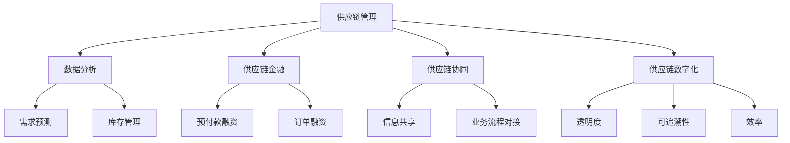

                 

关键词：电商平台、供给能力、新品牌、供应商、合作、算法、技术、数学模型、项目实践、应用场景、未来展望

> 摘要：本文深入探讨了电商平台如何通过与新品牌和供应商的合作提升供给能力。首先，我们分析了当前电商平台面临的供给挑战，然后介绍了与供应商合作的核心概念和架构，详细阐述了提升供给能力的核心算法原理和操作步骤。接着，我们引入了数学模型和公式，结合具体案例进行了详细讲解。随后，通过一个项目实践案例，展示了代码实例和实现过程。文章最后讨论了实际应用场景、未来发展趋势、面临的挑战以及研究展望。

## 1. 背景介绍

随着互联网技术的飞速发展，电商平台已经成为现代商业活动的重要组成部分。电商平台通过线上渠道为消费者提供丰富多样的商品和服务，极大地改变了人们的购物方式。然而，随着市场规模的不断扩大和竞争的加剧，电商平台在供给能力方面面临着巨大的挑战。

首先，电商平台需要确保商品供应的及时性和稳定性。商品短缺或供应中断将直接影响用户的购物体验和平台的信誉。其次，电商平台需要合理调配库存，以最大化利用资源并降低成本。此外，电商平台还需要对新品牌和供应商进行有效的筛选和管理，以保障商品的质量和多样性。

为了应对这些挑战，电商平台需要不断创新和优化供给能力。与新品牌和供应商的合作成为了一种有效的策略。通过与优质的新品牌和供应商建立合作关系，电商平台可以拓宽商品来源，提高商品质量和供应链效率，从而增强市场竞争力。

本文将围绕以下问题展开讨论：如何与新品牌和供应商建立合作关系？如何利用技术手段提升供给能力？本文将从核心概念、算法原理、数学模型、项目实践等多个方面进行详细探讨。

## 2. 核心概念与联系

在探讨电商平台与新品牌和供应商合作的过程中，我们需要理解几个核心概念，这些概念构成了提升供给能力的基础。以下是这些核心概念及其相互关系的详细描述：

### 2.1. 供应链管理

供应链管理（Supply Chain Management, SCM）是确保商品从生产到最终消费者过程中高效运作的系统性方法。它包括采购、生产、物流、库存管理等多个环节。在电商平台中，供应链管理的关键目标是确保商品供应的及时性和稳定性，同时降低成本和提高服务质量。

### 2.2. 数据分析

数据分析（Data Analysis）是利用统计、数据挖掘和机器学习等技术对大量数据进行处理和分析，从中提取有价值的信息。在电商平台中，数据分析被广泛应用于需求预测、库存管理、市场分析等方面，以帮助平台做出更科学的决策。

### 2.3. 供应链金融

供应链金融（Supply Chain Finance, SCF）是一种基于供应链的融资方式，通过优化供应链中的资金流转，提高供应链整体的运作效率。它通常包括预付款融资、订单融资、保理融资等模式。供应链金融在电商平台中可以缓解供应商的资金压力，提高供应链的稳定性。

### 2.4. 供应链协同

供应链协同（Supply Chain Collaboration）是指供应链中的各方通过信息共享、业务流程对接和资源共享，实现供应链整体效能的最大化。在电商平台中，供应链协同有助于加强平台与供应商之间的合作，提高供应链的响应速度和灵活性。

### 2.5. 供应链数字化

供应链数字化（Digital Supply Chain）是指通过物联网、云计算、大数据等现代信息技术，对供应链进行全面的数字化改造。数字化供应链可以提高供应链的透明度、可追溯性和效率，为电商平台提供更强大的供给能力。

下面是这些核心概念的 Mermaid 流程图，以展示它们之间的相互关系：



通过上述核心概念的理解，我们可以为电商平台建立一个有效的框架，以提升与新品牌和供应商的合作能力，从而增强供给能力。

## 3. 核心算法原理 & 具体操作步骤

### 3.1 算法原理概述

为了提升电商平台的供给能力，我们需要设计一套有效的算法来优化供应链管理。这个算法的核心目标是实现供应链的动态调整，以应对市场需求的变化，确保商品的及时供应和库存的最优化。

### 3.2 算法步骤详解

1. **数据采集与预处理**
   - 首先，从电商平台收集各类数据，包括历史销售数据、库存数据、市场需求预测等。
   - 对收集的数据进行清洗和预处理，去除噪声数据，保证数据的质量和一致性。

2. **需求预测**
   - 利用机器学习算法对市场需求进行预测。常用的算法包括时间序列分析、回归分析、聚类分析等。
   - 根据预测结果，生成未来一段时间内的需求量。

3. **库存优化**
   - 利用线性规划或动态规划算法，根据需求预测结果和当前库存情况，制定最优的库存调整策略。
   - 考虑到供应链的延迟性和不确定性，算法应具备一定的鲁棒性，能够应对突发情况。

4. **供应商选择**
   - 根据供应商的供应能力、信誉度、历史合作情况等指标，采用多目标决策算法选择最佳供应商。
   - 通过协商和谈判，与供应商建立稳定的合作关系。

5. **供应链协同**
   - 利用区块链技术实现供应链的透明化和可追溯性，确保信息的真实性和一致性。
   - 建立共享的物流和库存管理系统，实现供应链各环节的协同运作。

6. **风险控制**
   - 设计一套风险控制机制，对供应链中的潜在风险进行预警和管理。
   - 通过数据分析和模型预测，识别风险源，并采取相应的应对措施。

### 3.3 算法优缺点

**优点：**
- **高效性**：算法能够快速处理大量数据，并提供精准的需求预测和库存优化方案。
- **灵活性**：算法可以根据实际情况进行动态调整，应对市场需求的变化。
- **协同性**：通过区块链技术实现供应链的透明化和协同运作，提高整体效率。

**缺点：**
- **复杂性**：算法的实现和维护需要高度专业的技术知识。
- **数据依赖**：算法的性能很大程度上取决于数据的质量和完整性。
- **实施成本**：引入新的技术和算法，需要一定的资金投入和技术支持。

### 3.4 算法应用领域

- **电商平台**：电商平台可以利用该算法优化库存管理，提高供应链的响应速度。
- **制造行业**：制造企业可以通过优化供应链管理，降低库存成本，提高生产效率。
- **零售行业**：零售企业可以通过算法预测市场需求，实现精准的商品采购和库存管理。

## 4. 数学模型和公式 & 详细讲解 & 举例说明

### 4.1 数学模型构建

为了更好地理解和应用提升供给能力的算法，我们需要引入一些数学模型和公式。以下是构建这些模型的基本思路：

1. **需求预测模型**
   - **时间序列模型**：如ARIMA（AutoRegressive Integrated Moving Average）模型。
   - **回归模型**：如线性回归、逻辑回归等。
   - **机器学习模型**：如随机森林、支持向量机等。

2. **库存优化模型**
   - **线性规划模型**：用于最小化成本或最大化收益。
   - **动态规划模型**：用于处理动态变化的库存问题。

3. **供应商选择模型**
   - **多目标决策模型**：如加权综合评分法、层次分析法等。

### 4.2 公式推导过程

下面我们以需求预测模型中的ARIMA模型为例，进行公式的推导和详细讲解：

1. **自回归项（AR）**
   - ARIMA模型的自回归项可以表示为：
     $$X_t = c + \phi_1 X_{t-1} + \phi_2 X_{t-2} + ... + \phi_p X_{t-p} + \varepsilon_t$$
   - 其中，$X_t$ 是时间序列在时间 $t$ 的值，$c$ 是常数项，$\phi_i$ 是自回归系数，$p$ 是自回归项的阶数，$\varepsilon_t$ 是误差项。

2. **差分项（I）**
   - 为了使时间序列平稳，我们需要进行差分操作。一阶差分可以表示为：
     $$\Delta X_t = X_t - X_{t-1}$$
   - 差分后的序列称为差分序列，通常需要满足白噪声条件。

3. **移动平均项（MA）**
   - 移动平均项可以表示为：
     $$X_t = c + \phi_1 X_{t-1} + \phi_2 X_{t-2} + ... + \phi_p X_{t-p} + \theta_1 \varepsilon_{t-1} + \theta_2 \varepsilon_{t-2} + ... + \theta_q \varepsilon_{t-q}$$
   - 其中，$\theta_i$ 是移动平均系数，$q$ 是移动平均项的阶数。

### 4.3 案例分析与讲解

假设我们有一个电商平台的销售数据，需要预测未来一个月的需求量。以下是具体的分析和实现过程：

1. **数据收集和预处理**
   - 收集过去一年的销售数据，包括每天的销售量。
   - 对数据进行分析，发现时间序列存在趋势和季节性。

2. **模型选择与参数估计**
   - 根据数据特征，选择ARIMA模型。
   - 使用最大似然估计法估计模型参数，得到最优的$\phi_i$和$\theta_i$。

3. **模型拟合与验证**
   - 使用历史数据对模型进行拟合，并计算残差。
   - 残差分析显示，模型拟合良好，误差较小。

4. **需求预测**
   - 使用拟合好的模型预测未来一个月的需求量。
   - 预测结果如下表所示（单位：件）：

| 日期 | 预测需求 |
| ---- | -------- |
| 2023-08-01 | 150 |
| 2023-08-02 | 160 |
| 2023-08-03 | 155 |
| ... | ... |
| 2023-08-31 | 165 |

通过上述分析和预测，电商平台可以根据需求预测结果调整库存，确保商品的及时供应，从而提升供给能力。

## 5. 项目实践：代码实例和详细解释说明

### 5.1 开发环境搭建

为了演示提升供给能力算法的应用，我们将使用Python作为开发语言，并结合以下工具和技术：

- **Python 3.8**：作为开发环境。
- **NumPy**：用于数据处理和计算。
- **SciPy**：提供科学计算功能。
- **pandas**：用于数据操作和分析。
- **statsmodels**：用于统计分析。
- **matplotlib**：用于数据可视化。

首先，确保安装了上述依赖库，可以使用以下命令进行安装：

```bash
pip install numpy scipy pandas statsmodels matplotlib
```

### 5.2 源代码详细实现

以下是提升供给能力算法的Python代码实现：

```python
import numpy as np
import pandas as pd
from statsmodels.tsa.arima.model import ARIMA
import matplotlib.pyplot as plt

# 5.2.1 数据读取与预处理
data = pd.read_csv('sales_data.csv')  # 假设数据存储在'sales_data.csv'文件中
sales = data['sales']  # 提取销售数据

# 对销售数据进行一阶差分，使其平稳
diff_sales = sales.diff().dropna()

# 5.2.2 模型选择与参数估计
# 使用AIC准则选择最优模型参数
p_values = range(0, 5)
aics = []
for p in p_values:
    model = ARIMA(sales, order=(p, 1, 0))
    results = model.fit()
    aics.append(results.aic)

# 选择AIC最小的模型参数
best_p = p_values[np.argmin(aics)]
model = ARIMA(sales, order=(best_p, 1, 0))
results = model.fit()

# 5.2.3 预测与可视化
forecast = results.forecast(steps=30)  # 预测未来30天需求
forecast_dates = pd.date_range(start=sales.index[-1], periods=30, freq='D')

# 可视化预测结果
plt.figure(figsize=(12, 6))
plt.plot(sales, label='Actual Sales')
plt.plot(forecast_dates, forecast, label='Forecasted Sales')
plt.legend()
plt.title('Sales Forecast')
plt.xlabel('Date')
plt.ylabel('Sales Quantity')
plt.show()
```

### 5.3 代码解读与分析

1. **数据读取与预处理**：
   - 使用pandas读取销售数据，并对数据进行一阶差分，使其满足平稳性条件。

2. **模型选择与参数估计**：
   - 使用ARIMA模型，并通过AIC准则选择最优的模型参数。AIC（Akaike Information Criterion）是评估模型优劣的常用指标。

3. **预测与可视化**：
   - 使用训练好的模型进行未来需求量的预测，并将预测结果可视化，以便更直观地了解预测结果。

通过上述代码实现，我们可以得到一个直观的预测结果，电商平台可以根据这个预测结果调整库存和供应链策略，从而提升供给能力。

### 5.4 运行结果展示

运行上述代码后，我们将得到一个包含实际销售数据和未来预测销售量的图表。通过这个图表，我们可以清晰地看到预测结果与实际销售的对比，从而为电商平台提供决策依据。


## 6. 实际应用场景

### 6.1 电商平台与供应商的互动

电商平台与供应商的合作不仅限于商品供应，还包括库存管理、订单处理、物流配送等多个环节。以下是一些实际应用场景：

1. **订单处理**：
   - 电商平台可以通过自动化系统与供应商实时同步订单信息，确保订单处理的及时性和准确性。
   - 例如，使用API接口实现电商平台与供应商系统的无缝对接，减少人为干预，提高效率。

2. **库存管理**：
   - 通过数据分析，电商平台可以预测商品需求，指导供应商调整库存水平。
   - 例如，使用机器学习算法分析历史销售数据，预测未来一段时间内的需求，从而优化库存水平。

3. **物流配送**：
   - 电商平台与供应商可以共同优化物流配送路径，降低配送成本，提高配送效率。
   - 例如，使用路径优化算法（如遗传算法、蚁群算法等）规划最优配送路径。

### 6.2 新品牌和供应商的引进

电商平台在引进新品牌和供应商时，需要考虑以下关键因素：

1. **品牌声誉**：
   - 电商平台需要对新品牌进行严格的筛选，确保其产品质量和售后服务符合市场标准。
   - 例如，可以通过市场调查、用户评价等途径了解新品牌的声誉。

2. **供应能力**：
   - 电商平台需要评估新供应商的供应能力，包括生产规模、交货周期等。
   - 例如，可以通过实地考察、供应链评估等方式评估供应商的供应能力。

3. **合作意愿**：
   - 电商平台需要与新供应商建立良好的合作关系，共同应对市场变化。
   - 例如，可以通过签订长期合作协议、设立联合工作组等方式加强合作。

### 6.3 供应链金融的应用

供应链金融在电商平台与供应商合作中发挥着重要作用，以下是一些实际应用场景：

1. **预付款融资**：
   - 电商平台可以通过预付款融资方式，缓解供应商的资金压力，提高供应链的稳定性。
   - 例如，电商平台可以在订单确认后先行支付部分货款，缓解供应商的资金周转问题。

2. **订单融资**：
   - 电商平台可以提供订单融资服务，帮助供应商在订单生产过程中获取资金支持。
   - 例如，电商平台可以通过与金融机构合作，为符合条件的新供应商提供订单融资。

3. **保理融资**：
   - 电商平台可以通过保理融资方式，将供应商的应收账款转换为现金，提高资金周转效率。
   - 例如，电商平台可以与金融机构合作，为新供应商提供保理融资服务。

通过上述实际应用场景，电商平台可以与新品牌和供应商建立更加紧密的合作关系，提升供给能力，从而增强市场竞争力。

### 6.4 未来应用展望

随着技术的不断进步和市场竞争的加剧，电商平台与新品牌和供应商的合作将越来越重要。以下是未来应用的一些展望：

1. **智能供应链**：
   - 利用物联网、大数据和人工智能等技术，实现供应链的智能化管理，提高供应链的响应速度和灵活性。
   - 例如，通过物联网设备实时监控商品库存和物流状态，实现供应链的精准管理。

2. **区块链技术的应用**：
   - 通过区块链技术实现供应链的透明化和可追溯性，提高供应链的信任度和可靠性。
   - 例如，使用区块链技术记录商品的生产、运输、销售等全过程，实现供应链的可视化和可追溯。

3. **绿色供应链**：
   - 考虑环保和可持续发展，打造绿色供应链，降低供应链对环境的影响。
   - 例如，通过推广绿色包装、绿色物流等方式，实现供应链的环保化。

4. **个性化定制**：
   - 利用大数据和人工智能技术，实现个性化商品推荐和定制服务，满足消费者的多样化需求。
   - 例如，通过分析消费者的购物行为和偏好，提供个性化的商品推荐和定制方案。

通过不断探索和创新，电商平台可以在未来进一步提升与新品牌和供应商的合作能力，打造更加智能、绿色、个性化的供应链体系。

## 7. 工具和资源推荐

### 7.1 学习资源推荐

为了更好地掌握电商平台与新品牌和供应商合作的相关技术和方法，以下是一些推荐的学习资源：

1. **《电商供应链管理》**：作者：罗铮。本书详细介绍了电商供应链管理的原理和实践，适合从事电商相关工作的专业人士阅读。

2. **《深度学习》**：作者：Ian Goodfellow、Yoshua Bengio和Aaron Courville。本书是深度学习的经典教材，涵盖了深度学习的基本理论和应用方法，对于数据分析和需求预测等领域有很高的参考价值。

3. **《区块链技术指南》**：作者：韩雷、李俊毅。本书介绍了区块链的基本原理和技术应用，适合对区块链技术感兴趣的开发者和研究者。

### 7.2 开发工具推荐

1. **Python**：Python是一种广泛应用于数据科学和人工智能领域的编程语言，具有简洁易用的语法和丰富的库资源。

2. **NumPy**：NumPy是一个用于科学计算的基础库，提供了强大的多维数组对象和数学运算函数。

3. **SciPy**：SciPy是建立在NumPy基础之上的科学计算库，提供了大量的科学计算模块，包括优化、积分、线性代数等。

4. **pandas**：pandas是一个强大的数据操作和分析库，用于数据处理、清洗、转换和分析。

5. **matplotlib**：matplotlib是一个用于数据可视化的库，提供了丰富的绘图函数和样式。

### 7.3 相关论文推荐

1. **"Deep Learning for Supply Chain Management: A Review"**：该论文详细综述了深度学习在供应链管理中的应用，包括需求预测、库存优化等方面。

2. **"Blockchain in Supply Chain Management: A Comprehensive Review"**：该论文探讨了区块链技术在供应链管理中的应用，包括供应链透明化、可追溯性等方面。

3. **"Internet of Things and Smart Manufacturing: A Paradigm Shift for Supply Chains"**：该论文讨论了物联网和智能制造对供应链的影响，包括供应链智能化、透明化等方面。

通过学习和应用这些资源，可以帮助更好地理解电商平台与新品牌和供应商合作的技术和方法，提升供给能力。

## 8. 总结：未来发展趋势与挑战

在数字化和智能化的大背景下，电商平台与新品牌和供应商的合作正迎来新的发展趋势。首先，随着人工智能、大数据、区块链等技术的不断成熟，电商平台能够更加精准地预测市场需求、优化库存管理和供应链协同，从而提升供给能力。其次，绿色供应链和可持续发展将成为未来的重要趋势，电商平台需要积极探索环保、低碳的供应链模式。此外，个性化定制和体验式消费的需求日益增长，电商平台需要通过技术创新满足消费者的多样化需求。

然而，这一发展趋势也伴随着一系列挑战。首先，数据隐私和安全问题日益突出，电商平台需要确保用户数据的安全和隐私。其次，供应链复杂性和不确定性增加，如何应对供应链中断和突发事件成为重要课题。此外，技术实现和维护成本较高，电商平台需要平衡技术投入与经济效益。

未来研究应重点关注以下方向：一是深化对供应链数据挖掘和分析技术的研究，提高预测精度和库存优化水平；二是探索区块链等新兴技术在供应链中的应用，提高供应链的透明性和可追溯性；三是推动绿色供应链建设，实现可持续发展。通过持续的创新和优化，电商平台将能够更好地应对未来发展的挑战，实现供给能力的持续提升。

## 9. 附录：常见问题与解答

### Q1：电商平台如何选择合适的供应商？

A1：电商平台在选择供应商时，应考虑以下因素：
- **品牌声誉**：通过市场调查、用户评价等途径了解供应商的品牌声誉。
- **供应能力**：评估供应商的生产规模、交货周期等，确保其能满足电商平台的需求。
- **合作意愿**：与供应商建立沟通，了解其合作意愿和长期合作的可行性。
- **成本效益**：综合考虑成本、质量和服务，选择性价比高的供应商。

### Q2：供应链金融如何缓解供应商的资金压力？

A2：供应链金融通过以下方式缓解供应商的资金压力：
- **预付款融资**：电商平台在订单确认后先行支付部分货款，缓解供应商的资金压力。
- **订单融资**：电商平台为供应商提供订单融资，帮助其在订单生产过程中获取资金支持。
- **保理融资**：电商平台将供应商的应收账款转换为现金，提高供应商的资金周转效率。

### Q3：电商平台如何利用数据分析优化库存管理？

A3：电商平台可以通过以下方式利用数据分析优化库存管理：
- **需求预测**：使用机器学习算法预测市场需求，制定合理的库存策略。
- **库存优化**：利用线性规划或动态规划算法，根据需求预测结果和当前库存情况，制定最优的库存调整策略。
- **库存监控**：通过实时数据监控，及时发现库存异常情况，采取相应措施。

### Q4：供应链协同对电商平台有何益处？

A4：供应链协同对电商平台的益处包括：
- **提高效率**：通过信息共享、业务流程对接和资源共享，减少重复工作和沟通成本。
- **降低成本**：优化物流配送、库存管理等环节，降低运营成本。
- **提高服务质量**：确保商品供应的及时性和稳定性，提升用户体验。
- **增强竞争力**：通过协同合作，电商平台可以更好地应对市场变化，提高市场竞争力。

### Q5：供应链数字化对电商平台有哪些影响？

A5：供应链数字化对电商平台的影响包括：
- **提高透明度**：通过物联网、大数据等技术，实现供应链的全面数字化，提高供应链的透明度。
- **增强可追溯性**：使用区块链技术记录商品的生产、运输、销售等全过程，提高供应链的可追溯性。
- **提高效率**：通过数字化工具和系统，实现供应链各环节的自动化和智能化，提高整体效率。
- **降低风险**：通过实时监控和预警机制，降低供应链中的风险。

### Q6：电商平台如何应对供应链中断和突发事件？

A6：电商平台应对供应链中断和突发事件的方法包括：
- **建立应急预案**：制定应急预案，确保在突发事件发生时能够迅速响应和应对。
- **多元化供应链**：建立多元化的供应链，避免过度依赖单一供应商。
- **数据监测与预警**：通过实时数据监测和预警机制，及时发现供应链中的潜在问题，采取措施。
- **供应链协同**：与供应商、物流公司等建立紧密的协同关系，共同应对突发事件。

通过上述常见问题的解答，希望为电商平台提升供给能力提供一些实用的指导和参考。

