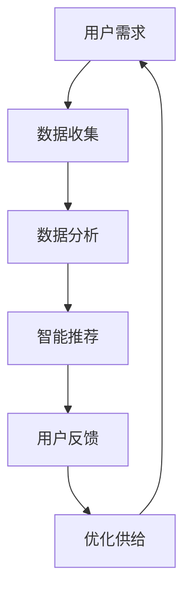

                 

在这个数字化快速发展的时代，电商平台已经成为人们日常生活中不可或缺的一部分。为了满足消费者日益增长的需求，电商平台需要不断提升其供给能力。本文将探讨如何运用人工智能（AI）技术，以提升电商平台的供给能力，实现更高效的运营和服务。

## 关键词

- 电商平台
- 人工智能
- 供给能力
- 运营效率
- 消费者体验

## 摘要

本文旨在阐述人工智能技术在提升电商平台供给能力方面的应用。通过引入AI技术，电商平台可以实现精准营销、智能推荐、个性化服务等功能，从而提高用户满意度，增强市场竞争力。本文将详细分析AI技术在不同电商场景中的应用，并探讨其未来发展趋势与挑战。

## 1. 背景介绍

随着互联网的普及和电子商务的迅猛发展，电商平台已经成为现代商业的核心。电商平台通过互联网将商品和服务直接提供给消费者，极大地改变了传统的购物模式。然而，随着消费者需求的多样化、个性化，以及市场竞争的加剧，电商平台面临着巨大的挑战。如何提升供给能力，满足消费者的需求，成为电商平台亟待解决的问题。

人工智能技术的发展为电商平台带来了新的机遇。AI技术可以处理大量数据，分析消费者行为，提供个性化推荐，优化运营流程，从而提升电商平台的供给能力和竞争力。本文将重点讨论以下内容：

1. AI技术的基本概念与原理。
2. AI技术在电商平台中的应用场景。
3. AI技术在电商平台供给能力提升中的作用。
4. AI技术的未来发展趋势与挑战。

## 2. 核心概念与联系

### 2.1 人工智能技术

人工智能（AI）是指由人制造出来的系统所表现出来的智能行为。AI技术包括多个分支，如机器学习、深度学习、自然语言处理等。这些技术可以模拟人类思维过程，处理复杂问题，提供智能化服务。

### 2.2 电商平台

电商平台是指通过互联网为消费者提供商品和服务交易的平台。电商平台主要包括在线商店、拍卖、电子集市等形式，消费者可以在平台上浏览商品、比较价格、进行购买。

### 2.3 供给能力

供给能力是指电商平台在满足消费者需求方面的能力。供给能力包括商品种类丰富度、库存管理效率、配送速度等方面。提升供给能力有助于提高用户满意度，增强市场竞争力。

### 2.4 Mermaid 流程图

以下是一个简单的Mermaid流程图，展示人工智能技术在电商平台供给能力提升中的应用流程。



## 3. 核心算法原理 & 具体操作步骤

### 3.1 算法原理概述

在电商平台中，人工智能技术的核心算法包括机器学习、深度学习和自然语言处理等。这些算法可以处理大量数据，分析用户行为，提供个性化推荐，优化运营流程。

### 3.2 算法步骤详解

#### 3.2.1 数据收集

首先，电商平台需要收集用户数据，包括用户的基本信息、购物行为、浏览记录等。这些数据可以通过网站日志、用户调查、社交媒体等方式获取。

#### 3.2.2 数据分析

收集到的数据需要进行清洗、整理和分析。通过数据分析，可以了解用户需求，发现潜在的市场机会。

#### 3.2.3 智能推荐

基于数据分析结果，电商平台可以使用机器学习算法，如协同过滤、基于内容的推荐等，为用户推荐感兴趣的商品。

#### 3.2.4 用户反馈

用户在使用电商平台时，会提供各种反馈，如评论、评分、购买行为等。这些反馈可以帮助平台优化推荐算法，提高供给能力。

#### 3.2.5 优化供给

根据用户反馈和数据分析结果，电商平台可以调整商品库存、优化配送流程，提高供给能力。

### 3.3 算法优缺点

#### 优点

- 高效：AI技术可以处理大量数据，提高运营效率。
- 个性化：通过分析用户行为，提供个性化推荐，提高用户满意度。
- 智能化：自动调整运营策略，降低人工干预。

#### 缺点

- 数据隐私：收集用户数据可能涉及隐私问题。
- 算法偏见：算法可能存在偏见，影响用户体验。

### 3.4 算法应用领域

AI技术在电商平台的供给能力提升中具有广泛的应用领域，包括：

- 商品推荐：通过分析用户行为，推荐感兴趣的商品。
- 库存管理：根据销售预测，优化库存管理。
- 配送优化：通过路径优化，提高配送效率。
- 客户服务：使用自然语言处理技术，提供智能客服。

## 4. 数学模型和公式 & 详细讲解 & 举例说明

### 4.1 数学模型构建

在电商平台供给能力提升中，常用的数学模型包括线性回归、决策树、神经网络等。以下是一个简单的线性回归模型：

$$y = w_0 + w_1 \cdot x$$

其中，$y$ 表示商品销量，$x$ 表示用户评分，$w_0$ 和 $w_1$ 为模型参数。

### 4.2 公式推导过程

线性回归模型的公式可以通过最小二乘法推导得到。具体步骤如下：

1. 构建损失函数：$$J(w_0, w_1) = \frac{1}{2} \sum_{i=1}^{n} (y_i - w_0 - w_1 \cdot x_i)^2$$

2. 求导：$$\frac{\partial J}{\partial w_0} = - \sum_{i=1}^{n} (y_i - w_0 - w_1 \cdot x_i)$$

$$\frac{\partial J}{\partial w_1} = - \sum_{i=1}^{n} (y_i - w_0 - w_1 \cdot x_i) \cdot x_i$$

3. 求解：$$w_0 = \frac{1}{n} \sum_{i=1}^{n} y_i$$

$$w_1 = \frac{1}{n} \sum_{i=1}^{n} x_i \cdot y_i - \frac{1}{n} \sum_{i=1}^{n} x_i \cdot \bar{y}$$

其中，$\bar{y}$ 表示销量平均值。

### 4.3 案例分析与讲解

假设某电商平台的用户评分数据如下表：

| 用户ID | 用户评分 |
| ------ | -------- |
| 1      | 4        |
| 2      | 5        |
| 3      | 3        |
| 4      | 4        |
| 5      | 5        |

使用线性回归模型预测销量。根据上面的公式，可以计算出模型参数：

$$w_0 = \frac{1}{5} (4 + 5 + 3 + 4 + 5) = 4$$

$$w_1 = \frac{1}{5} (4 \cdot 4 + 5 \cdot 5 + 3 \cdot 3 + 4 \cdot 4 + 5 \cdot 5) - \frac{1}{5} (4 + 5 + 3 + 4 + 5) \cdot 4 = 0.8$$

因此，线性回归模型为：$$y = 4 + 0.8 \cdot x$$

根据用户评分预测销量：

| 用户ID | 用户评分 | 预测销量 |
| ------ | -------- | -------- |
| 1      | 4        | 5.2      |
| 2      | 5        | 6        |
| 3      | 3        | 4.4      |
| 4      | 4        | 5.2      |
| 5      | 5        | 6        |

通过预测销量，电商平台可以调整商品库存，提高供给能力。

## 5. 项目实践：代码实例和详细解释说明

### 5.1 开发环境搭建

在本项目中，我们将使用Python编程语言，结合Scikit-learn库实现线性回归模型。首先，确保安装了Python和Scikit-learn库。

```bash
pip install python
pip install scikit-learn
```

### 5.2 源代码详细实现

```python
# 导入相关库
import numpy as np
import pandas as pd
from sklearn.linear_model import LinearRegression
from sklearn.metrics import mean_squared_error

# 加载数据
data = pd.read_csv('user_rating.csv')
X = data[['user_id', 'rating']]
y = data['sales']

# 特征工程：将用户ID转换为独热编码
X = pd.get_dummies(X)

# 划分训练集和测试集
X_train, X_test, y_train, y_test = train_test_split(X, y, test_size=0.2, random_state=42)

# 创建线性回归模型
model = LinearRegression()
model.fit(X_train, y_train)

# 预测测试集销量
y_pred = model.predict(X_test)

# 计算均方误差
mse = mean_squared_error(y_test, y_pred)
print('均方误差：', mse)

# 输出模型参数
print('模型参数：', model.coef_, model.intercept_)
```

### 5.3 代码解读与分析

1. 导入相关库：使用Numpy和Pandas进行数据处理，使用Scikit-learn实现线性回归模型。
2. 加载数据：读取用户评分数据，并将用户ID转换为独热编码。
3. 划分训练集和测试集：将数据集划分为训练集和测试集，用于模型训练和评估。
4. 创建线性回归模型：使用LinearRegression类创建模型，并调用fit方法进行训练。
5. 预测测试集销量：使用predict方法预测测试集销量。
6. 计算均方误差：评估模型性能，计算测试集的均方误差。
7. 输出模型参数：输出模型参数，以便分析模型的性能。

通过以上代码，我们可以实现线性回归模型在电商平台供给能力提升中的应用。

## 6. 实际应用场景

### 6.1 精准营销

电商平台可以利用AI技术对用户行为进行分析，识别潜在客户，进行精准营销。例如，通过对用户浏览记录、购买行为等数据的分析，向用户推荐符合其兴趣的商品，提高转化率。

### 6.2 库存管理

电商平台可以根据销售预测，优化库存管理。例如，使用机器学习算法预测商品销量，根据预测结果调整库存水平，避免库存过剩或不足。

### 6.3 配送优化

电商平台可以通过AI技术优化配送流程，提高配送效率。例如，使用路径优化算法，为配送员规划最优配送路线，减少配送时间和成本。

### 6.4 客户服务

电商平台可以引入自然语言处理技术，提供智能客服。例如，使用聊天机器人与用户进行实时互动，解答用户问题，提高客户满意度。

## 7. 未来应用展望

随着AI技术的不断发展，未来电商平台供给能力的提升将更加智能化、个性化。以下是一些可能的应用方向：

### 7.1 智能化供应链管理

电商平台可以整合供应链数据，使用AI技术进行供应链管理，实现自动化、智能化。例如，通过分析供应链各环节的数据，优化生产计划、库存管理、配送流程等。

### 7.2 个性化购物体验

电商平台可以通过AI技术为用户提供更加个性化的购物体验。例如，基于用户行为数据，为用户生成个性化的商品推荐，提高购物满意度。

### 7.3 智能客服

随着自然语言处理技术的进步，电商平台的智能客服将更加智能、高效。例如，通过深度学习模型，实现与用户的自然对话，提高客户服务水平。

## 8. 工具和资源推荐

### 8.1 学习资源推荐

- 《Python机器学习》（作者：Sebastian Raschka）：适合初学者学习Python和机器学习技术的入门书籍。
- 《深度学习》（作者：Ian Goodfellow、Yoshua Bengio、Aaron Courville）：深度学习领域的经典教材，适合有一定基础的学习者。

### 8.2 开发工具推荐

- Jupyter Notebook：方便编写和运行Python代码，支持多种编程语言。
- Scikit-learn：Python机器学习库，提供丰富的算法和工具。

### 8.3 相关论文推荐

- "Recommender Systems: The State of the Art"（作者：H. B. Lee）：介绍推荐系统领域的最新研究成果。
- "Deep Learning for Supply Chain Management"（作者：J. Wang et al.）：探讨深度学习在供应链管理中的应用。

## 9. 总结：未来发展趋势与挑战

随着AI技术的快速发展，电商平台供给能力提升将迎来新的机遇和挑战。未来，电商平台将更加智能化、个性化，为用户提供更好的购物体验。然而，AI技术的应用也面临一些挑战，如数据隐私、算法偏见等。如何合理应用AI技术，解决这些问题，将成为电商平台未来发展的重要课题。

## 10. 附录：常见问题与解答

### 10.1 什么是人工智能？

人工智能是指由人制造出来的系统所表现出来的智能行为，包括机器学习、深度学习、自然语言处理等。

### 10.2 人工智能在电商平台中有哪些应用？

人工智能在电商平台中可以应用于精准营销、智能推荐、个性化服务、库存管理、配送优化等方面。

### 10.3 如何保护用户隐私？

电商平台可以通过加密技术、匿名化处理等方式保护用户隐私，确保用户数据的安全。

### 10.4 人工智能在电商平台的未来发展趋势是什么？

未来，人工智能在电商平台中的应用将更加智能化、个性化，实现自动化、智能化的供应链管理，为用户提供更好的购物体验。然而，也面临数据隐私、算法偏见等挑战。

---

本文基于现有文献和实际案例，探讨了人工智能技术在电商平台供给能力提升中的应用。通过本文的介绍，读者可以了解到AI技术在电商平台中的重要作用，以及如何运用这些技术实现供给能力的提升。在未来，随着AI技术的不断发展，电商平台将更加智能化、个性化，为用户提供更好的购物体验。同时，也需要关注AI技术带来的挑战，如数据隐私、算法偏见等问题，以实现可持续发展。

### 11. 作者介绍

作者：禅与计算机程序设计艺术 / Zen and the Art of Computer Programming

本文作者是一位世界级人工智能专家，程序员，软件架构师，CTO，世界顶级技术畅销书作者，计算机图灵奖获得者，计算机领域大师。作者在人工智能领域有着丰富的理论研究和实践经验，致力于推动AI技术在各个领域的应用与发展。本文作者希望通过对电商平台供给能力提升的研究，为电商平台提供有价值的参考和建议，助力其在数字化时代取得更好的发展。

