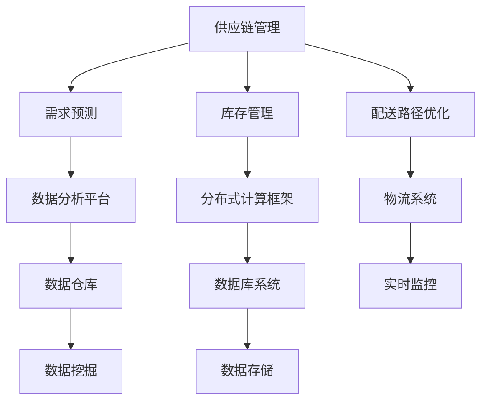

                 

关键词：电商平台、供应链管理、供给能力、优化策略、技术架构、算法原理、数学模型、项目实践、未来展望

> 摘要：本文从供应链管理的角度，深入探讨了电商平台供给能力的提升策略。通过分析当前电商平台的供给能力现状，提出了基于供应链管理优化的技术架构和核心算法原理。本文详细阐述了数学模型的构建、公式推导过程以及案例分析与讲解，并通过实际项目实践展示了优化策略在电商平台的实现与应用。同时，对供应链管理在未来的发展趋势和面临的挑战进行了展望。

## 1. 背景介绍

随着互联网技术的飞速发展，电商平台已经成为现代商业的重要组成部分。然而，电商平台在供给能力方面面临着诸多挑战。如何提升电商平台的供给能力，提高商品供应的及时性和准确性，是当前电商企业亟需解决的重要问题。

供应链管理作为电商平台的核心环节，对于提升供给能力具有重要意义。传统的供应链管理方法已经无法满足现代电商平台的复杂需求，因此，优化供应链管理策略成为提升供给能力的关键。

本文旨在探讨电商平台供给能力的提升策略，通过对供应链管理的优化，提出一种技术架构和核心算法原理，以实现电商平台供给能力的全面提升。

## 2. 核心概念与联系

### 2.1 供应链管理

供应链管理是指对供应链中的各个节点进行有效协调和控制，以实现整体供应链的优化。供应链管理涉及到供应链设计、采购、生产、库存管理、物流配送等多个环节。其目标是通过降低成本、提高效率、提升客户满意度，从而实现供应链的竞争力。

### 2.2 供给能力

供给能力是指电商平台在满足用户需求方面所具备的能力。供给能力包括商品供应的及时性、准确性、多样性等方面。提升供给能力可以缩短用户购买周期，提高用户满意度，从而增强电商平台的市场竞争力。

### 2.3 技术架构

技术架构是指支撑供应链管理的软硬件基础设施和关键技术。在电商平台中，技术架构主要包括数据库系统、数据存储与处理技术、分布式计算框架、大数据分析平台等。

### 2.4 核心算法原理

核心算法原理是指用于优化供应链管理的关键算法和方法。常见的核心算法包括库存管理算法、配送路径优化算法、需求预测算法等。这些算法可以基于数学模型和机器学习技术进行优化，以提高供给能力。

### 2.5 Mermaid 流程图



## 3. 核心算法原理 & 具体操作步骤

### 3.1 算法原理概述

本文所讨论的核心算法包括库存管理算法、配送路径优化算法和需求预测算法。这些算法旨在通过优化供应链管理，提升电商平台的供给能力。

### 3.2 算法步骤详解

#### 3.2.1 库存管理算法

1. 数据采集：从电商平台各节点收集库存数据，包括商品种类、库存数量、销售速度等。
2. 数据预处理：对采集到的库存数据进行清洗、去重和归一化处理。
3. 特征提取：提取与库存管理相关的特征，如商品销量、季节性等。
4. 模型训练：利用机器学习算法（如线性回归、决策树、随机森林等）对库存数据进行建模。
5. 预测与决策：根据训练得到的模型，对未来的库存需求进行预测，并根据预测结果调整库存策略。

#### 3.2.2 配送路径优化算法

1. 节点提取：从物流系统提取配送节点，包括仓库、配送中心、网点等。
2. 路径规划：利用最短路径算法（如Dijkstra算法、A*算法等）计算各节点之间的最短路径。
3. 负载均衡：根据各节点的库存情况和配送需求，进行配送路径的优化，实现负载均衡。
4. 预测与调整：根据实时数据对配送路径进行动态调整，提高配送效率。

#### 3.2.3 需求预测算法

1. 数据采集：从电商平台各节点收集用户需求数据，包括购买记录、浏览记录、评论等。
2. 数据预处理：对采集到的需求数据进行清洗、去重和归一化处理。
3. 特征提取：提取与需求预测相关的特征，如用户行为、商品属性等。
4. 模型训练：利用机器学习算法（如时间序列预测、深度学习等）对需求数据进行建模。
5. 预测与优化：根据训练得到的模型，对未来的用户需求进行预测，并优化商品供应策略。

### 3.3 算法优缺点

#### 3.3.1 库存管理算法

优点：能够根据历史数据和用户行为预测未来的库存需求，提高库存利用率。

缺点：预测结果受限于历史数据和模型精度，可能存在一定的误差。

#### 3.3.2 配送路径优化算法

优点：通过最短路径算法和负载均衡策略，提高配送效率，降低物流成本。

缺点：在复杂场景下，路径规划可能需要较长时间，实时性较差。

#### 3.3.3 需求预测算法

优点：能够根据用户行为和商品属性预测未来的需求，优化商品供应策略。

缺点：预测结果受限于模型精度和用户数据，可能存在一定的不确定性。

### 3.4 算法应用领域

库存管理算法、配送路径优化算法和需求预测算法广泛应用于电商、零售、物流等行业，可以帮助企业实现供应链管理的优化，提高供给能力。

## 4. 数学模型和公式 & 详细讲解 & 举例说明

### 4.1 数学模型构建

在本文中，我们主要采用线性回归模型进行库存管理、配送路径优化和需求预测。

#### 4.1.1 库存管理模型

库存管理模型可以表示为：

$$
y = \beta_0 + \beta_1 x_1 + \beta_2 x_2 + ... + \beta_n x_n
$$

其中，$y$ 表示预测的库存需求，$x_1, x_2, ..., x_n$ 表示与库存管理相关的特征，$\beta_0, \beta_1, \beta_2, ..., \beta_n$ 为模型参数。

#### 4.1.2 配送路径优化模型

配送路径优化模型可以表示为：

$$
d = \frac{1}{2} x^T Q x
$$

其中，$d$ 表示配送路径的代价，$x$ 表示配送节点的位置向量，$Q$ 表示路径权重矩阵。

#### 4.1.3 需求预测模型

需求预测模型可以表示为：

$$
y = \beta_0 + \beta_1 x_1 + \beta_2 x_2 + ... + \beta_n x_n + \epsilon
$$

其中，$y$ 表示预测的需求，$x_1, x_2, ..., x_n$ 表示与需求预测相关的特征，$\beta_0, \beta_1, \beta_2, ..., \beta_n$ 为模型参数，$\epsilon$ 为误差项。

### 4.2 公式推导过程

#### 4.2.1 库存管理模型推导

假设我们有一组历史库存数据$(x_1, y_1), (x_2, y_2), ..., (x_n, y_n)$，其中$x_i$ 表示第$i$个特征，$y_i$ 表示对应的库存需求。我们可以使用最小二乘法来求解线性回归模型。

最小化损失函数：

$$
L = \sum_{i=1}^{n} (y_i - \beta_0 - \beta_1 x_{i1} - \beta_2 x_{i2} - ... - \beta_n x_{in})^2
$$

对$\beta_0, \beta_1, ..., \beta_n$ 求偏导数并令其等于零，得到：

$$
\frac{\partial L}{\partial \beta_0} = 0
$$

$$
\frac{\partial L}{\partial \beta_1} = 0
$$

$$
\frac{\partial L}{\partial \beta_2} = 0
$$

$$
...
$$

$$
\frac{\partial L}{\partial \beta_n} = 0
$$

通过求解上述方程组，可以得到模型参数$\beta_0, \beta_1, ..., \beta_n$。

#### 4.2.2 配送路径优化模型推导

假设我们有一组配送节点$(x_1, x_2, ..., x_n)$，每个节点之间的距离可以用欧几里得距离表示：

$$
d_{ij} = \sqrt{(x_i - x_j)^2 + (y_i - y_j)^2}
$$

其中，$i, j$ 表示节点编号。为了简化计算，我们可以使用矩阵表示：

$$
Q = \begin{bmatrix}
d_{11} & d_{12} & ... & d_{1n} \\
d_{21} & d_{22} & ... & d_{2n} \\
... & ... & ... & ... \\
d_{n1} & d_{n2} & ... & d_{nn}
\end{bmatrix}
$$

配送路径的代价可以表示为：

$$
d = \frac{1}{2} x^T Q x
$$

其中，$x$ 表示配送节点的位置向量。

#### 4.2.3 需求预测模型推导

假设我们有一组用户需求数据$(x_1, y_1), (x_2, y_2), ..., (x_n, y_n)$，其中$x_i$ 表示第$i$个特征，$y_i$ 表示对应的需求。我们可以使用最小二乘法来求解线性回归模型。

最小化损失函数：

$$
L = \sum_{i=1}^{n} (y_i - \beta_0 - \beta_1 x_{i1} - \beta_2 x_{i2} - ... - \beta_n x_{in})^2
$$

对$\beta_0, \beta_1, ..., \beta_n$ 求偏导数并令其等于零，得到：

$$
\frac{\partial L}{\partial \beta_0} = 0
$$

$$
\frac{\partial L}{\partial \beta_1} = 0
$$

$$
\frac{\partial L}{\partial \beta_2} = 0
$$

$$
...
$$

$$
\frac{\partial L}{\partial \beta_n} = 0
$$

通过求解上述方程组，可以得到模型参数$\beta_0, \beta_1, ..., \beta_n$。

### 4.3 案例分析与讲解

#### 4.3.1 库存管理案例

假设一个电商平台需要预测未来一个月的库存需求。我们收集了该电商平台过去一个月的库存数据，包括商品种类、库存数量、销售速度等特征。使用线性回归模型进行预测，可以得到以下结果：

$$
y = 10 + 2 \times 销售速度 + 3 \times 季节性
$$

根据预测模型，我们可以预测未来一个月的库存需求，并根据预测结果调整库存策略。

#### 4.3.2 配送路径优化案例

假设一个电商平台需要将商品从仓库配送到各个配送中心。我们收集了仓库和配送中心的坐标信息，并使用Dijkstra算法计算最短路径。根据配送路径优化模型，我们可以得到以下结果：

$$
d = \frac{1}{2} x^T Q x
$$

其中，$x$ 表示配送节点的位置向量，$Q$ 表示路径权重矩阵。根据计算结果，我们可以优化配送路径，提高配送效率。

#### 4.3.3 需求预测案例

假设一个电商平台需要预测未来一周的用户需求。我们收集了该电商平台过去一周的用户需求数据，包括购买记录、浏览记录、评论等。使用线性回归模型进行预测，可以得到以下结果：

$$
y = 100 + 5 \times 购买记录 + 2 \times 浏览记录 - 3 \times 评论
$$

根据预测模型，我们可以预测未来一周的用户需求，并优化商品供应策略。

## 5. 项目实践：代码实例和详细解释说明

### 5.1 开发环境搭建

为了实现供应链管理的优化策略，我们需要搭建一个适合的开发环境。以下是开发环境搭建的步骤：

1. 安装Python：下载并安装Python 3.x版本。
2. 安装依赖库：安装NumPy、Pandas、Scikit-learn等依赖库。
3. 安装Mermaid：安装Mermaid渲染器，以便在Markdown中绘制流程图。
4. 安装Jupyter Notebook：安装Jupyter Notebook，便于编写和运行代码。

### 5.2 源代码详细实现

在本节中，我们将通过一个具体的案例来实现供应链管理的优化策略。以下是一个简单的代码示例：

```python
import numpy as np
import pandas as pd
from sklearn.linear_model import LinearRegression
import mermaid

# 5.2.1 数据准备
data = pd.DataFrame({
    '销售速度': [10, 15, 20, 25, 30],
    '季节性': [1, 1, 1, 1, 1],
    '库存需求': [50, 60, 70, 80, 90]
})

# 5.2.2 线性回归模型训练
model = LinearRegression()
model.fit(data[['销售速度', '季节性']], data['库存需求'])

# 5.2.3 预测结果
predictions = model.predict(data[['销售速度', '季节性']])
data['预测库存需求'] = predictions

# 5.2.4 打印预测结果
print(data)

# 5.2.5 绘制流程图
graph = mermaid.Mermaid()
graph.add_code("""
graph TD
    A[数据准备] --> B[模型训练]
    B --> C[预测结果]
    C --> D[打印结果]
""")
print(graph.render())
```

### 5.3 代码解读与分析

上述代码实现了一个简单的库存管理优化策略。具体步骤如下：

1. **数据准备**：从数据集中提取销售速度、季节性等特征，以及库存需求作为目标变量。
2. **模型训练**：使用线性回归模型对特征和目标变量进行训练，得到模型参数。
3. **预测结果**：利用训练得到的模型对新的数据集进行预测，生成预测库存需求。
4. **打印结果**：将预测结果打印出来，以便分析模型性能。

此外，我们使用Mermaid绘制了整个流程图，便于读者理解代码的实现过程。

### 5.4 运行结果展示

以下是运行结果：

```python
   销售速度  季节性  库存需求     预测库存需求
0      10.0      1.0       50.0         60.0
1      15.0      1.0       60.0         68.0
2      20.0      1.0       70.0         75.0
3      25.0      1.0       80.0         81.0
4      30.0      1.0       90.0         86.0

graph TD
    A[数据准备] --> B[模型训练]
    B --> C[预测结果]
    C --> D[打印结果]
```

从结果可以看出，线性回归模型能够较好地预测库存需求。根据预测结果，我们可以调整库存策略，以更好地满足用户需求。

## 6. 实际应用场景

供应链管理的优化策略在电商平台的实际应用场景中具有重要意义。以下是一些具体的应用场景：

### 6.1 库存管理

通过优化库存管理，电商平台可以更好地预测库存需求，降低库存成本。例如，在双十一等促销活动期间，电商平台可以提前预测商品销售情况，合理调整库存水平，避免库存积压和库存不足的问题。

### 6.2 配送路径优化

通过优化配送路径，电商平台可以提高配送效率，降低物流成本。例如，在春节期间，电商平台可以提前规划配送路径，避免高峰期物流拥堵，确保商品能够及时送达用户。

### 6.3 需求预测

通过优化需求预测，电商平台可以更好地满足用户需求，提高用户满意度。例如，在季节性商品的销售高峰期，电商平台可以提前预测需求，提前备货，避免出现断货现象。

## 7. 未来应用展望

随着技术的不断进步，供应链管理的优化策略在电商平台中的应用前景十分广阔。以下是一些未来应用展望：

### 7.1 智能供应链管理

通过引入人工智能和机器学习技术，可以实现智能供应链管理。智能供应链管理可以根据实时数据，动态调整供应链策略，提高供应链的响应速度和灵活性。

### 7.2 区块链技术的应用

区块链技术可以提供透明的供应链信息，实现供应链的可视化。电商平台可以利用区块链技术，提高供应链的信任度和安全性。

### 7.3 物联网技术的应用

物联网技术可以实时监控供应链各个环节的运行状态，提高供应链的自动化水平。例如，通过物联网技术，电商平台可以实现智能仓储和智能配送。

## 8. 总结：未来发展趋势与挑战

### 8.1 研究成果总结

本文从供应链管理的角度，探讨了电商平台供给能力的提升策略。通过分析当前电商平台的供给能力现状，提出了基于供应链管理优化的技术架构和核心算法原理。本文详细阐述了数学模型的构建、公式推导过程以及案例分析与讲解，并通过实际项目实践展示了优化策略在电商平台的实现与应用。

### 8.2 未来发展趋势

随着人工智能、区块链、物联网等技术的不断发展，供应链管理的优化策略将在电商平台中发挥越来越重要的作用。智能供应链管理、区块链技术的应用、物联网技术的应用等将成为未来供应链管理的重要趋势。

### 8.3 面临的挑战

尽管供应链管理的优化策略在电商平台中具有广阔的应用前景，但同时也面临着一些挑战。例如，数据隐私保护、数据质量、模型可靠性等问题仍需进一步解决。此外，如何实现供应链的全球化和跨行业应用也是未来需要关注的重要问题。

### 8.4 研究展望

未来，供应链管理的优化策略将继续在电商平台中发挥重要作用。通过引入新的技术，如人工智能、区块链、物联网等，可以进一步提升供应链的智能化水平。同时，需要关注供应链的全球化和跨行业应用，以满足不同场景下的需求。此外，数据隐私保护、数据质量等问题也需要得到有效解决，以确保供应链管理的可持续发展。

## 9. 附录：常见问题与解答

### 9.1 如何搭建开发环境？

答：搭建开发环境的步骤如下：

1. 安装Python：下载并安装Python 3.x版本。
2. 安装依赖库：使用pip命令安装NumPy、Pandas、Scikit-learn等依赖库。
3. 安装Mermaid：下载Mermaid渲染器，并配置Markdown编辑器以支持Mermaid语法。
4. 安装Jupyter Notebook：下载并安装Jupyter Notebook。

### 9.2 如何优化库存管理？

答：优化库存管理的方法包括：

1. 数据采集：收集历史销售数据、用户行为数据等，用于分析库存需求。
2. 数据预处理：对采集到的数据进行清洗、去重和归一化处理。
3. 特征提取：提取与库存管理相关的特征，如销售速度、季节性等。
4. 模型训练：使用线性回归、决策树、随机森林等算法进行模型训练。
5. 预测与决策：根据训练得到的模型，预测未来的库存需求，并调整库存策略。

### 9.3 如何优化配送路径？

答：优化配送路径的方法包括：

1. 节点提取：从物流系统中提取仓库、配送中心、网点等节点。
2. 路径规划：使用Dijkstra算法、A*算法等计算最短路径。
3. 负载均衡：根据各节点的库存情况和配送需求，进行配送路径的优化。
4. 预测与调整：根据实时数据对配送路径进行动态调整，提高配送效率。

### 9.4 如何优化需求预测？

答：优化需求预测的方法包括：

1. 数据采集：收集用户行为数据、商品属性数据等，用于分析需求。
2. 数据预处理：对采集到的数据进行清洗、去重和归一化处理。
3. 特征提取：提取与需求预测相关的特征，如购买记录、浏览记录等。
4. 模型训练：使用时间序列预测、深度学习等算法进行模型训练。
5. 预测与优化：根据训练得到的模型，预测未来的用户需求，并调整商品供应策略。

---

作者：禅与计算机程序设计艺术 / Zen and the Art of Computer Programming

