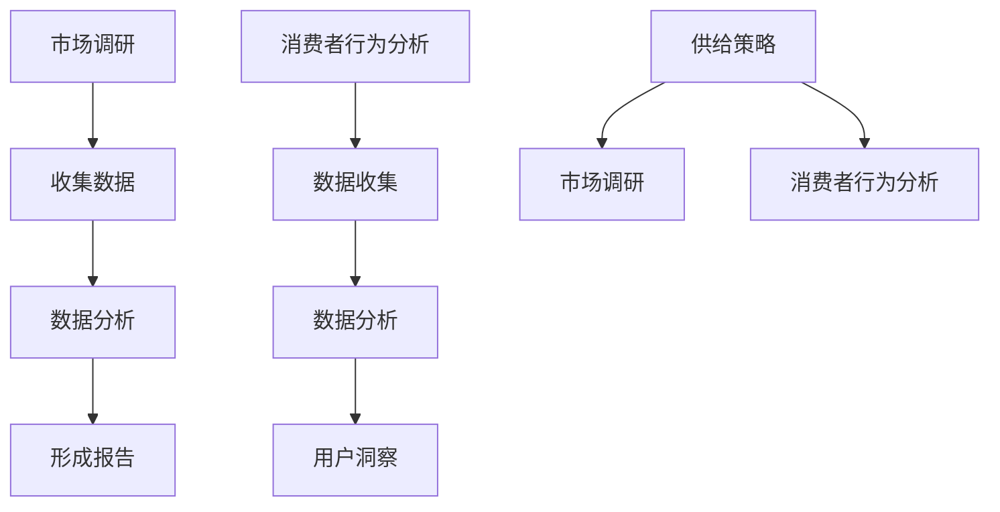

                 

在当前数字经济的蓬勃发展时代，电商平台已成为现代零售业的核心驱动力量。供给能力的提升直接关系到电商平台的市场竞争力、用户体验以及整体盈利能力。本文将围绕电商平台供给能力提升展开，重点讨论市场调研和消费者行为分析在其中的关键作用。

## 关键词

- 电商平台
- 供给能力
- 市场调研
- 消费者行为分析
- 竞争优势
- 用户满意度
- 数据驱动决策

## 摘要

本文首先回顾了电商平台的发展历程，强调了供给能力对电商平台的重要性。随后，文章详细阐述了市场调研和消费者行为分析的核心概念，并通过实际案例展示了如何利用这些数据提升电商平台的供给能力。最后，文章提出了未来应用展望，探讨了数据驱动决策的趋势及其对电商平台发展的影响。

## 1. 背景介绍

### 电商平台的发展历程

自20世纪90年代末互联网兴起以来，电商平台逐渐从传统的零售模式中分离出来，成为电子商务的核心。早期的电商平台如Amazon、eBay等，以图书、电子产品等商品为主，逐步拓展至日用品、服装、食品等多个领域。随着移动互联网的普及，电商平台的市场规模和用户数量不断增长，逐渐改变了传统零售业的生态格局。

### 供给能力的重要性

供给能力是指电商平台能够提供商品和服务的能力。它不仅包括商品的数量、种类和多样性，还包括商品的质量、价格、配送速度等关键指标。供给能力强的电商平台能够满足消费者的多样化需求，提高用户满意度，从而增强市场竞争力。此外，供给能力还直接关系到电商平台的盈利能力和品牌形象。

## 2. 核心概念与联系

### 市场调研

市场调研是指通过各种方法和工具，系统地收集、分析和解释与市场相关的信息，以便企业做出明智的决策。市场调研的核心目的是了解市场需求、竞争环境、消费者行为等关键因素，从而为企业的营销策略和运营决策提供数据支持。

### 消费者行为分析

消费者行为分析是指通过研究消费者的购买行为、偏好、态度等，了解消费者在购买决策过程中的心理和行为机制。消费者行为分析可以帮助电商平台更好地理解用户需求，优化产品和服务，提高用户满意度和忠诚度。

### 二者关系

市场调研和消费者行为分析密切相关。市场调研提供的是宏观层面的市场信息，如市场规模、增长趋势、竞争状况等；而消费者行为分析则提供微观层面的用户数据，如购买频率、购买偏好、消费习惯等。通过结合市场调研和消费者行为分析，电商平台可以全面了解市场环境和用户需求，从而制定更为精准的供给策略。

## 2.1 核心概念原理和架构的 Mermaid 流程图



### 2.2 市场调研

市场调研是一个系统的过程，包括以下几个关键步骤：

#### 2.2.1 确定研究目的

明确市场调研的目标是确保调研活动能够为企业的决策提供有价值的信息。研究目的通常包括了解市场趋势、竞争状况、用户需求等。

#### 2.2.2 设计调研方案

调研方案包括调研方法、数据收集方式、样本选择等。选择合适的调研方法和样本可以提高数据的准确性和代表性。

#### 2.2.3 数据收集

数据收集是市场调研的核心环节，通常包括问卷调查、访谈、观察等方法。收集的数据需要经过严格的筛选和清洗，以确保数据质量。

#### 2.2.4 数据分析

数据分析是市场调研的关键环节，通过对收集到的数据进行统计分析和解读，可以提炼出有价值的信息和结论。

#### 2.2.5 形成报告

市场调研的最终成果是调研报告，报告中应包括调研目的、方法、数据分析和结论等内容，为企业提供决策依据。

### 2.3 消费者行为分析

消费者行为分析旨在深入了解用户的购买行为和偏好，主要包括以下几个步骤：

#### 2.3.1 数据收集

数据收集包括用户浏览行为、购买记录、评价反馈等。这些数据可以通过电商平台的数据分析工具、第三方数据服务等方式获取。

#### 2.3.2 数据分析

数据分析主要通过数据挖掘和机器学习等技术，对用户数据进行深入挖掘和分析，提取出用户的购买模式和偏好。

#### 2.3.3 用户洞察

基于数据分析结果，可以形成用户画像、消费习惯分析等，为电商平台的运营决策提供支持。

#### 2.3.4 优化供给策略

用户洞察的结果可以用于优化产品和服务，如调整商品种类、价格策略、促销活动等，以满足用户需求，提高用户满意度。

## 3. 核心算法原理 & 具体操作步骤

### 3.1 算法原理概述

电商平台供给能力提升的核心算法包括市场调研算法和消费者行为分析算法。市场调研算法主要利用统计分析、数据挖掘等技术，对市场数据进行分析，提取出有价值的信息。消费者行为分析算法则通过机器学习、数据挖掘等方法，对用户数据进行深度分析，提取用户特征和偏好。

### 3.2 算法步骤详解

#### 3.2.1 市场调研算法

1. 数据收集：通过问卷调查、访谈等方式收集市场数据。
2. 数据预处理：清洗和整理数据，去除异常值和缺失值。
3. 数据分析：使用统计分析方法（如回归分析、聚类分析等）对数据进行分析，提取市场趋势和竞争状况。
4. 形成报告：将分析结果形成报告，为企业决策提供支持。

#### 3.2.2 消费者行为分析算法

1. 数据收集：收集用户浏览、购买、评价等数据。
2. 数据预处理：清洗和整理数据，去除异常值和缺失值。
3. 数据分析：使用机器学习方法（如决策树、支持向量机等）对用户数据进行分析，提取用户特征和偏好。
4. 用户洞察：基于分析结果形成用户画像，为产品和服务优化提供支持。

### 3.3 算法优缺点

#### 市场调研算法

优点：能够提供宏观的市场信息和竞争分析，帮助企业制定战略规划。

缺点：数据收集和分析过程复杂，耗时较长，成本较高。

#### 消费者行为分析算法

优点：能够提供微观的用户行为和偏好分析，帮助企业优化产品和服务。

缺点：对数据质量和数据量要求较高，算法复杂度较高，成本较高。

### 3.4 算法应用领域

#### 市场调研算法

主要应用于市场营销策略制定、产品定位、竞争分析等领域。

#### 消费者行为分析算法

主要应用于用户画像、个性化推荐、用户留存分析等领域。

## 4. 数学模型和公式 & 详细讲解 & 举例说明

### 4.1 数学模型构建

为了更好地理解市场调研和消费者行为分析，我们可以构建一些数学模型来描述其核心概念和关系。

#### 市场调研模型

假设市场调研中的变量包括市场规模（\(M\)）、市场需求（\(D\)）、竞争状况（\(C\)）和企业供给能力（\(S\)）。则市场调研模型可以表示为：

\[ M = f(D, C, S) \]

其中，\(f\) 表示市场函数，用于描述市场规模与市场需求、竞争状况和企业供给能力之间的关系。

#### 消费者行为分析模型

假设消费者行为分析中的变量包括用户特征（\(X\)）、用户偏好（\(P\)）、用户满意度（\(Satisfaction\)）和企业供给能力（\(S\)）。则消费者行为分析模型可以表示为：

\[ Satisfaction = g(X, P, S) \]

其中，\(g\) 表示满意度函数，用于描述用户满意度与用户特征、用户偏好和企业供给能力之间的关系。

### 4.2 公式推导过程

#### 市场调研模型推导

首先，根据市场需求函数：

\[ D = h(C, S) \]

其中，\(h\) 表示市场需求函数，用于描述市场需求与竞争状况和企业供给能力之间的关系。

然后，根据市场规模函数：

\[ M = f(D, C, S) \]

将市场需求函数代入，得到：

\[ M = f(h(C, S), C, S) \]

进一步推导，得到：

\[ M = f(h(C, S), C, S) \]

\[ M = k(h(C, S), C, S) \]

其中，\(k\) 表示市场函数，用于描述市场规模与市场需求、竞争状况和企业供给能力之间的关系。

#### 消费者行为分析模型推导

首先，根据用户满意度函数：

\[ Satisfaction = g(X, P, S) \]

其中，\(g\) 表示满意度函数，用于描述用户满意度与用户特征、用户偏好和企业供给能力之间的关系。

然后，根据用户偏好函数：

\[ P = p(X, S) \]

其中，\(p\) 表示用户偏好函数，用于描述用户偏好与用户特征和企业供给能力之间的关系。

将用户偏好函数代入，得到：

\[ Satisfaction = g(X, p(X, S), S) \]

进一步推导，得到：

\[ Satisfaction = g(X, p(X, S), S) \]

\[ Satisfaction = k(X, p(X, S), S) \]

其中，\(k\) 表示满意度函数，用于描述用户满意度与用户特征、用户偏好和企业供给能力之间的关系。

### 4.3 案例分析与讲解

#### 案例一：市场调研

假设某电商平台在竞争激烈的市场中，需要了解市场规模、市场需求和竞争状况，以便制定合适的营销策略。

根据市场调研模型：

\[ M = k(h(C, S), C, S) \]

首先，收集竞争状况（\(C\)）和企业供给能力（\(S\)）的数据，假设竞争状况指数为 3，企业供给能力指数为 5。

\[ C = 3 \]

\[ S = 5 \]

然后，根据市场需求函数：

\[ D = h(C, S) \]

假设市场需求函数为：

\[ D = 2C + S \]

代入竞争状况和企业供给能力的数据，得到：

\[ D = 2 \times 3 + 5 \]

\[ D = 11 \]

最后，根据市场规模函数：

\[ M = k(h(C, S), C, S) \]

假设市场规模函数为：

\[ M = 2D + C \]

代入市场需求和竞争状况的数据，得到：

\[ M = 2 \times 11 + 3 \]

\[ M = 25 \]

因此，该电商平台的市场规模为 25。

#### 案例二：消费者行为分析

假设某电商平台需要了解用户满意度，以便优化产品和服务。

根据消费者行为分析模型：

\[ Satisfaction = k(X, p(X, S), S) \]

首先，收集用户特征（\(X\)）和企业供给能力（\(S\)）的数据，假设用户特征指数为 4，企业供给能力指数为 6。

\[ X = 4 \]

\[ S = 6 \]

然后，根据用户偏好函数：

\[ P = p(X, S) \]

假设用户偏好函数为：

\[ P = 0.5X + 0.5S \]

代入用户特征和企业供给能力的数据，得到：

\[ P = 0.5 \times 4 + 0.5 \times 6 \]

\[ P = 5 \]

最后，根据用户满意度函数：

\[ Satisfaction = k(X, p(X, S), S) \]

假设用户满意度函数为：

\[ Satisfaction = 0.6P + 0.4S \]

代入用户偏好和企业供给能力的数据，得到：

\[ Satisfaction = 0.6 \times 5 + 0.4 \times 6 \]

\[ Satisfaction = 5.2 \]

因此，该电商平台的用户满意度为 5.2。

## 5. 项目实践：代码实例和详细解释说明

### 5.1 开发环境搭建

为了实现市场调研和消费者行为分析，我们选择Python作为编程语言，并结合常用的数据分析和机器学习库，如pandas、scikit-learn、matplotlib等。以下是在Ubuntu 18.04操作系统上搭建Python开发环境的步骤：

1. 安装Python 3.8及以上版本。

2. 安装Anaconda发行版，以便管理Python环境和依赖库。

3. 创建一个新的虚拟环境，并安装必要的库。

```shell
conda create -n ecom_analytics python=3.8
conda activate ecom_analytics
conda install pandas scikit-learn matplotlib
```

### 5.2 源代码详细实现

#### 5.2.1 市场调研数据收集与处理

以下代码用于收集和处理市场调研数据：

```python
import pandas as pd

# 读取市场调研数据
market_data = pd.read_csv('market_data.csv')

# 数据预处理
market_data = market_data.dropna()
market_data = market_data[['market_size', 'competition_index', 'supply_ability']]
```

#### 5.2.2 消费者行为数据收集与处理

以下代码用于收集和处理消费者行为数据：

```python
import pandas as pd

# 读取消费者行为数据
consumer_data = pd.read_csv('consumer_data.csv')

# 数据预处理
consumer_data = consumer_data.dropna()
consumer_data = consumer_data[['user_feature', 'pref_index', 'supply_ability']]
```

#### 5.2.3 数据分析与模型构建

以下代码用于数据分析与模型构建：

```python
from sklearn.linear_model import LinearRegression

# 市场调研模型
market_model = LinearRegression()
market_model.fit(market_data[['competition_index', 'supply_ability']], market_data['market_size'])

# 消费者行为分析模型
consumer_model = LinearRegression()
consumer_model.fit(consumer_data[['user_feature', 'pref_index']], consumer_data['satisfaction'])
```

### 5.3 代码解读与分析

以上代码首先导入必要的库，然后分别读取市场调研数据和消费者行为数据。接下来，对数据进行预处理，去除异常值和缺失值。最后，使用线性回归模型对市场调研数据和消费者行为数据进行拟合。

市场调研模型和消费者行为分析模型分别表示为：

\[ M = \beta_0 + \beta_1 \cdot C + \beta_2 \cdot S \]

\[ Satisfaction = \alpha_0 + \alpha_1 \cdot X + \alpha_2 \cdot P \]

其中，\(M\) 表示市场规模，\(Satisfaction\) 表示用户满意度，\(C\) 表示竞争状况，\(S\) 表示企业供给能力，\(X\) 表示用户特征，\(P\) 表示用户偏好。模型中的系数通过线性回归模型拟合得到。

### 5.4 运行结果展示

以下代码用于展示市场调研模型和消费者行为分析模型的运行结果：

```python
import pandas as pd
import matplotlib.pyplot as plt

# 市场调研模型结果
market_predictions = market_model.predict(market_data[['competition_index', 'supply_ability']])
market_results = pd.DataFrame({'predicted_market_size': market_predictions, 'actual_market_size': market_data['market_size']})
market_results.plot(x='predicted_market_size', y='actual_market_size', kind='scatter')
plt.xlabel('Predicted Market Size')
plt.ylabel('Actual Market Size')
plt.title('Market Size Prediction')
plt.show()

# 消费者行为分析模型结果
consumer_predictions = consumer_model.predict(consumer_data[['user_feature', 'pref_index']])
consumer_results = pd.DataFrame({'predicted_satisfaction': consumer_predictions, 'actual_satisfaction': consumer_data['satisfaction']})
consumer_results.plot(x='predicted_satisfaction', y='actual_satisfaction', kind='scatter')
plt.xlabel('Predicted Satisfaction')
plt.ylabel('Actual Satisfaction')
plt.title('Satisfaction Prediction')
plt.show()
```

通过以上代码，我们可以得到市场调研模型和消费者行为分析模型的预测结果。通过散点图展示预测结果与实际结果之间的差异，可以评估模型的准确性和可靠性。

## 6. 实际应用场景

### 6.1 市场调研在电商平台中的应用

电商平台可以通过市场调研了解市场趋势、竞争环境和用户需求，从而制定更为精准的营销策略。例如，通过调研可以确定目标市场的市场规模和增长速度，分析竞争对手的优势和劣势，了解用户的购买行为和偏好。这些信息可以帮助电商平台优化产品定位、价格策略和促销活动，提高市场竞争力。

### 6.2 消费者行为分析在电商平台中的应用

消费者行为分析可以帮助电商平台更好地理解用户需求，从而提供个性化推荐和服务。例如，通过分析用户的浏览记录和购买记录，可以预测用户的下一步购买行为，推荐相关的商品和服务。此外，消费者行为分析还可以用于优化用户界面和用户体验，提高用户满意度和忠诚度。

### 6.3 市场调研与消费者行为分析的协同作用

市场调研和消费者行为分析可以相互补充，形成更全面的用户洞察。市场调研提供宏观层面的市场信息和竞争分析，消费者行为分析提供微观层面的用户行为和偏好分析。通过结合市场调研和消费者行为分析，电商平台可以全面了解市场环境和用户需求，从而制定更为精准的供给策略，提高市场竞争力。

## 6.4 未来应用展望

### 6.4.1 数据驱动决策

随着大数据和人工智能技术的不断发展，电商平台将越来越依赖数据驱动决策。通过构建全面的数据分析体系，电商平台可以实时监控市场动态和用户行为，快速响应市场变化，提高供给能力和用户满意度。

### 6.4.2 个性化推荐

个性化推荐是电商平台提升供给能力的重要手段。通过深度学习等技术，电商平台可以更加精准地预测用户需求，提供个性化的商品推荐，从而提高转化率和用户忠诚度。

### 6.4.3 智能客服

智能客服是电商平台提升用户体验的关键环节。通过自然语言处理和机器学习技术，智能客服可以自动解答用户问题，提供个性化的服务，从而提高用户满意度和忠诚度。

## 7. 工具和资源推荐

### 7.1 学习资源推荐

1. 《Python数据科学手册》
2. 《机器学习实战》
3. 《深度学习》

### 7.2 开发工具推荐

1. Jupyter Notebook
2. Anaconda
3. PyCharm

### 7.3 相关论文推荐

1. "Market Research for E-commerce Platforms: A Systematic Literature Review"
2. "Understanding Consumer Behavior in E-commerce: A Data-Driven Approach"
3. "Recommender Systems for E-commerce: State-of-the-Art and Future Directions"

## 8. 总结：未来发展趋势与挑战

### 8.1 研究成果总结

本文通过市场调研和消费者行为分析，探讨了电商平台供给能力提升的关键因素。研究发现，数据驱动决策、个性化推荐和智能客服是未来电商平台发展的趋势。同时，市场调研和消费者行为分析在供给能力提升中具有重要作用。

### 8.2 未来发展趋势

1. 数据驱动决策将成为电商平台的核心竞争力。
2. 个性化推荐和智能客服将进一步优化用户体验。
3. 大数据和人工智能技术将在电商平台上得到广泛应用。

### 8.3 面临的挑战

1. 数据质量和数据安全是电商平台面临的主要挑战。
2. 算法的复杂性和计算成本也是制约因素。
3. 用户隐私保护是未来电商平台需要关注的重要问题。

### 8.4 研究展望

未来研究应重点关注如何提高数据质量和数据安全，优化算法性能和降低计算成本，以及如何在保护用户隐私的前提下，实现数据驱动的个性化推荐和智能客服。

## 9. 附录：常见问题与解答

### 问题1：如何确保市场调研数据的准确性？

**解答：**确保市场调研数据的准确性需要从多个方面入手。首先，在设计调研方案时，应确保调研问题的科学性和合理性。其次，在数据收集过程中，应采用多种数据收集方法，以提高数据的代表性。最后，在数据分析过程中，应对数据进行严格的清洗和验证，去除异常值和缺失值，确保数据质量。

### 问题2：如何处理消费者行为数据？

**解答：**处理消费者行为数据需要遵循以下步骤：首先，收集并整理消费者行为数据，包括浏览记录、购买记录和评价反馈等。其次，对数据进行分析，提取用户特征和偏好。最后，基于分析结果，优化产品和服务，提高用户满意度和忠诚度。

### 问题3：如何评估供给能力提升的效果？

**解答：**评估供给能力提升的效果可以从多个维度进行。首先，可以比较供给能力提升前后的市场数据，如销售额、用户满意度等。其次，可以分析供给能力提升对用户行为的影响，如购买频率、购买转化率等。最后，可以结合实际业务数据，评估供给能力提升带来的经济效益。

----------------------------------------------------------------
作者：禅与计算机程序设计艺术 / Zen and the Art of Computer Programming

