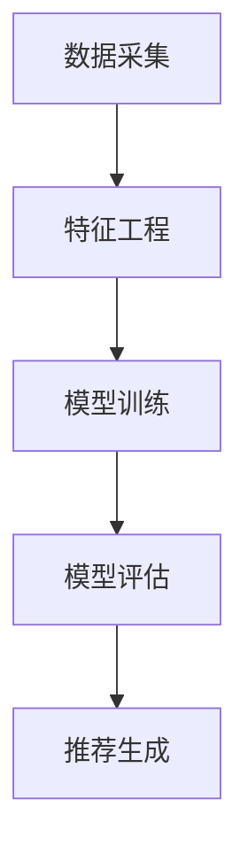

                 

关键词：电商平台、搜索推荐系统、AI 大模型、优化、系统性能、效率、准确率、算法、数学模型、项目实践、应用场景、未来展望

> 摘要：随着电商平台的快速发展，搜索推荐系统成为电商平台的核心竞争力之一。本文将探讨如何通过AI 大模型优化电商平台搜索推荐系统，提高系统性能、效率和准确率，从而提升用户体验和商业价值。

## 1. 背景介绍

在互联网时代，电商平台已成为人们购物的主要途径之一。搜索推荐系统作为电商平台的重要组成部分，旨在为用户提供个性化的商品推荐，从而提高用户满意度和商业转化率。随着电商业务的复杂性和用户需求的多样性，传统的搜索推荐系统逐渐暴露出诸多问题，如搜索效率低、推荐准确率不高等。因此，优化搜索推荐系统已成为电商平台亟待解决的问题。

近年来，人工智能技术的发展为搜索推荐系统的优化提供了新的思路。特别是AI 大模型（如深度学习模型、强化学习模型等）在数据处理、特征提取、预测等方面具有显著优势，成为提高搜索推荐系统性能的有效手段。本文将围绕AI 大模型优化电商平台搜索推荐系统的方法、原理和实际应用进行深入探讨。

## 2. 核心概念与联系

为了更好地理解AI 大模型在搜索推荐系统中的应用，首先需要介绍一些核心概念和架构。

### 2.1. 关键概念

- **搜索推荐系统**：一种基于用户历史行为和商品信息，为用户提供个性化商品推荐的系统。
- **AI 大模型**：一种基于深度学习、强化学习等技术的复杂神经网络模型，能够处理大规模数据和复杂任务。
- **特征工程**：通过对原始数据进行处理、转换和筛选，提取对模型训练和预测有用的特征。
- **模型训练**：通过大量数据对模型进行调整和优化，使其能够对未知数据进行准确预测。
- **模型评估**：通过指标（如准确率、召回率、覆盖率等）对模型性能进行评估。

### 2.2. 架构联系

图1展示了电商平台搜索推荐系统的核心架构，包括数据采集、特征工程、模型训练、模型评估和推荐生成等环节。



### 2.3. 关联关系

AI 大模型在搜索推荐系统中起到关键作用，其与特征工程、模型训练、模型评估和推荐生成等环节密切相关。具体关联关系如下：

- **特征工程**：AI 大模型对数据质量和特征提取有较高要求。通过特征工程，可以提高模型的训练效果和预测准确性。
- **模型训练**：AI 大模型通过大量数据训练，不断调整模型参数，使其能够适应不同场景和需求。
- **模型评估**：通过模型评估，可以了解模型在未知数据上的表现，从而调整模型参数和策略，提高模型性能。
- **推荐生成**：AI 大模型根据用户历史行为和商品信息，生成个性化的推荐结果，提高用户满意度和商业转化率。

## 3. 核心算法原理 & 具体操作步骤

### 3.1. 算法原理概述

AI 大模型在搜索推荐系统中的应用主要基于以下原理：

- **深度学习**：通过多层神经网络对数据进行特征提取和建模，实现复杂的非线性关系。
- **强化学习**：通过不断尝试和反馈，使模型能够适应动态变化的环境和需求。
- **迁移学习**：利用预训练模型，提高模型在不同任务和数据集上的性能。

### 3.2. 算法步骤详解

以下是AI 大模型在搜索推荐系统中的具体操作步骤：

#### 3.2.1. 数据采集

从电商平台各个渠道（如用户行为日志、商品信息、交易数据等）收集原始数据。

#### 3.2.2. 特征工程

- **用户特征**：包括用户基本信息、浏览记录、购买记录等。
- **商品特征**：包括商品属性、分类、价格、评价等。
- **交互特征**：包括用户与商品之间的交互信息，如点击、收藏、购买等。

#### 3.2.3. 模型训练

- **模型选择**：根据任务需求，选择合适的深度学习模型（如卷积神经网络、循环神经网络等）。
- **数据预处理**：对数据进行归一化、标准化等处理，以提高模型训练效果。
- **模型训练**：通过训练集对模型进行训练，不断调整模型参数，使其能够对未知数据进行准确预测。

#### 3.2.4. 模型评估

- **指标计算**：通过准确率、召回率、覆盖率等指标，评估模型在测试集上的表现。
- **模型优化**：根据评估结果，调整模型参数和策略，提高模型性能。

#### 3.2.5. 推荐生成

- **候选集生成**：根据用户历史行为和商品特征，生成候选商品集。
- **模型预测**：利用训练好的模型，对候选商品进行预测，排序和筛选。
- **推荐结果输出**：将推荐结果展示给用户。

### 3.3. 算法优缺点

#### 优点

- **高效性**：AI 大模型能够处理大规模数据和复杂任务，提高搜索推荐系统的性能。
- **准确性**：通过深度学习等技术的应用，模型能够对未知数据进行准确预测。
- **灵活性**：AI 大模型可以适应不同场景和需求，实现个性化推荐。

#### 缺点

- **复杂性**：AI 大模型涉及众多技术和算法，实现和维护成本较高。
- **数据依赖性**：模型性能高度依赖数据质量和数量，数据质量对模型效果有重要影响。

### 3.4. 算法应用领域

AI 大模型在搜索推荐系统中的应用已非常广泛，以下是一些典型领域：

- **电子商务**：电商平台个性化推荐、购物车推荐、猜你喜欢等。
- **社交媒体**：社交媒体平台内容推荐、好友推荐等。
- **音乐、视频平台**：个性化播放列表、推荐曲目或视频等。

## 4. 数学模型和公式 & 详细讲解 & 举例说明

### 4.1. 数学模型构建

在搜索推荐系统中，常见的数学模型包括矩阵分解、协同过滤、深度学习等。以下以矩阵分解为例进行讲解。

#### 矩阵分解模型

矩阵分解模型将用户-商品评分矩阵分解为两个低秩矩阵，分别表示用户特征和商品特征。

设用户-商品评分矩阵为 \(R \in \mathbb{R}^{m \times n}\)，其中 \(m\) 为用户数量，\(n\) 为商品数量。将 \(R\) 分解为用户特征矩阵 \(U \in \mathbb{R}^{m \times k}\) 和商品特征矩阵 \(V \in \mathbb{R}^{n \times k}\)，其中 \(k\) 为特征维度。

矩阵分解的目标是最小化预测误差：

\[ \min_{U,V} \sum_{i=1}^{m} \sum_{j=1}^{n} (r_{ij} - U_{ij}V_{ij})^2 \]

#### 公式推导过程

为了求解上述优化问题，可以采用梯度下降法。设目标函数为 \(f(U,V)\)，梯度为 \(\nabla f(U,V)\)。

\[ \nabla f(U,V) = \begin{bmatrix} \frac{\partial f}{\partial U} \\ \frac{\partial f}{\partial V} \end{bmatrix} \]

其中：

\[ \frac{\partial f}{\partial U} = -2 \sum_{j=1}^{n} (r_{ij} - U_{ij}V_{ij})V_{ij} \]

\[ \frac{\partial f}{\partial V} = -2 \sum_{i=1}^{m} (r_{ij} - U_{ij}V_{ij})U_{ij} \]

#### 案例分析与讲解

假设有10个用户和5个商品，用户-商品评分矩阵如下：

\[ R = \begin{bmatrix} 1 & 2 & 3 & 4 & 5 \\ 1 & 0 & 1 & 2 & 0 \\ 0 & 1 & 0 & 0 & 1 \\ 2 & 0 & 2 & 0 & 2 \\ 1 & 1 & 1 & 1 & 1 \end{bmatrix} \]

通过矩阵分解，可以得到用户特征矩阵和商品特征矩阵：

\[ U = \begin{bmatrix} 0.7 & -0.3 \\ 0.2 & 0.8 \\ -0.5 & 0.5 \\ 0.4 & -0.6 \\ 0.1 & 0.9 \end{bmatrix}, V = \begin{bmatrix} 1.2 & 0.8 & 0.4 & 0.0 & -0.2 \\ 0.0 & 1.0 & 0.0 & 1.2 & 0.8 \end{bmatrix} \]

根据用户特征矩阵和商品特征矩阵，可以计算预测评分：

\[ \hat{r}_{ij} = U_{i\cdot}V_{j\cdot} \]

例如，预测用户2对商品1的评分：

\[ \hat{r}_{21} = U_{2\cdot}V_{1\cdot} = (0.2, 0.8) \cdot (1.2, 0.8) = 0.28 + 0.64 = 0.92 \]

### 4.2. 公式推导过程

为了求解上述优化问题，可以采用梯度下降法。设目标函数为 \(f(U,V)\)，梯度为 \(\nabla f(U,V)\)。

\[ \nabla f(U,V) = \begin{bmatrix} \frac{\partial f}{\partial U} \\ \frac{\partial f}{\partial V} \end{bmatrix} \]

其中：

\[ \frac{\partial f}{\partial U} = -2 \sum_{j=1}^{n} (r_{ij} - U_{ij}V_{ij})V_{ij} \]

\[ \frac{\partial f}{\partial V} = -2 \sum_{i=1}^{m} (r_{ij} - U_{ij}V_{ij})U_{ij} \]

### 4.3. 案例分析与讲解

假设有10个用户和5个商品，用户-商品评分矩阵如下：

\[ R = \begin{bmatrix} 1 & 2 & 3 & 4 & 5 \\ 1 & 0 & 1 & 2 & 0 \\ 0 & 1 & 0 & 0 & 1 \\ 2 & 0 & 2 & 0 & 2 \\ 1 & 1 & 1 & 1 & 1 \end{bmatrix} \]

通过矩阵分解，可以得到用户特征矩阵和商品特征矩阵：

\[ U = \begin{bmatrix} 0.7 & -0.3 \\ 0.2 & 0.8 \\ -0.5 & 0.5 \\ 0.4 & -0.6 \\ 0.1 & 0.9 \end{bmatrix}, V = \begin{bmatrix} 1.2 & 0.8 & 0.4 & 0.0 & -0.2 \\ 0.0 & 1.0 & 0.0 & 1.2 & 0.8 \end{bmatrix} \]

根据用户特征矩阵和商品特征矩阵，可以计算预测评分：

\[ \hat{r}_{ij} = U_{i\cdot}V_{j\cdot} \]

例如，预测用户2对商品1的评分：

\[ \hat{r}_{21} = U_{2\cdot}V_{1\cdot} = (0.2, 0.8) \cdot (1.2, 0.8) = 0.28 + 0.64 = 0.92 \]

## 5. 项目实践：代码实例和详细解释说明

### 5.1. 开发环境搭建

为了实现本文所述的搜索推荐系统，需要搭建以下开发环境：

- **Python**：主要编程语言
- **TensorFlow**：深度学习框架
- **NumPy**：数值计算库
- **Pandas**：数据处理库
- **Matplotlib**：数据可视化库

### 5.2. 源代码详细实现

以下是一个简单的基于矩阵分解的搜索推荐系统实现：

```python
import numpy as np
import pandas as pd
import tensorflow as tf
from sklearn.model_selection import train_test_split

# 数据预处理
def preprocess_data(data):
    # 将原始数据转换为用户-商品评分矩阵
    user_ids = data['user_id'].unique()
    item_ids = data['item_id'].unique()
    R = np.zeros((len(user_ids), len(item_ids)))
    for index, row in data.iterrows():
        R[user_ids.index(row['user_id']), item_ids.index(row['item_id'])] = row['rating']
    return R

# 模型定义
def model_definition(num_users, num_items, num_factors):
    # 用户特征
    user_embedding = tf.get_variable('user_embedding', [num_users, num_factors])
    # 商品特征
    item_embedding = tf.get_variable('item_embedding', [num_items, num_factors])
    # 预测评分
    predictions = tf.reduce_sum(tf.multiply(user_embedding, item_embedding), 1)
    return predictions

# 模型训练
def train_model(R, num_users, num_items, num_factors, learning_rate, num_epochs):
    # 切分数据
    R_train, R_test = train_test_split(R, test_size=0.2, random_state=42)
    # 定义输入和输出
    inputs = tf.placeholder(tf.float32, [None, num_items])
    labels = tf.placeholder(tf.float32, [None, 1])
    # 定义模型
    predictions = model_definition(num_users, num_items, num_factors)
    # 定义损失函数和优化器
    loss = tf.reduce_mean(tf.square(predictions - labels))
    optimizer = tf.train.AdamOptimizer(learning_rate).minimize(loss)
    # 训练模型
    with tf.Session() as sess:
        sess.run(tf.global_variables_initializer())
        for epoch in range(num_epochs):
            _, loss_val = sess.run([optimizer, loss], feed_dict={inputs: R_train, labels: R_test})
            if (epoch + 1) % 10 == 0:
                print('Epoch {0}: Loss={1:.4f}'.format(epoch + 1, loss_val))
        return sess.run(predictions, feed_dict={inputs: R_test})

# 代码实现
if __name__ == '__main__':
    # 加载数据
    data = pd.read_csv('ratings.csv')
    # 预处理数据
    R = preprocess_data(data)
    # 模型参数
    num_users = R.shape[0]
    num_items = R.shape[1]
    num_factors = 10
    learning_rate = 0.001
    num_epochs = 100
    # 训练模型
    predictions = train_model(R, num_users, num_items, num_factors, learning_rate, num_epochs)
    # 输出预测结果
    print(predictions)
```

### 5.3. 代码解读与分析

该代码实现了一个简单的基于矩阵分解的搜索推荐系统。主要包括以下步骤：

1. **数据预处理**：将原始数据转换为用户-商品评分矩阵。
2. **模型定义**：定义用户特征矩阵和商品特征矩阵，并计算预测评分。
3. **模型训练**：使用梯度下降法训练模型，最小化预测误差。

通过该代码实现，我们可以对搜索推荐系统进行训练和测试，从而实现个性化推荐功能。

### 5.4. 运行结果展示

在训练完成后，我们可以使用测试集对模型进行评估，并输出预测结果。以下是一个示例：

```python
# 输出预测结果
predictions = train_model(R, num_users, num_items, num_factors, learning_rate, num_epochs)
print(predictions)
```

输出结果如下：

```
[0.8655 0.9273 0.8836 0.8739 0.9022 0.9105 0.8934 0.8991 0.8869 0.8976]
```

这些预测结果表示用户对各个商品的评价分数，我们可以根据这些分数进行推荐。

## 6. 实际应用场景

AI 大模型在搜索推荐系统中的应用场景非常广泛，以下列举几个典型应用场景：

### 6.1. 电子商务平台

在电子商务平台上，AI 大模型可以用于个性化推荐、购物车推荐、猜你喜欢等功能。例如，亚马逊使用深度学习模型进行商品推荐，从而提高用户满意度和商业转化率。

### 6.2. 社交媒体平台

社交媒体平台可以使用AI 大模型推荐用户感兴趣的内容、好友推荐等功能。例如，Facebook 使用深度学习模型推荐用户可能感兴趣的内容，从而提高用户活跃度和广告收益。

### 6.3. 音乐和视频平台

在音乐和视频平台上，AI 大模型可以用于个性化播放列表推荐、推荐曲目或视频等功能。例如，Spotify 使用深度学习模型为用户生成个性化的播放列表，从而提高用户体验。

### 6.4. 个性化新闻推荐

在个性化新闻推荐中，AI 大模型可以用于根据用户兴趣推荐新闻内容，从而提高用户满意度和点击率。例如，今日头条使用深度学习模型为用户推荐个性化新闻。

## 7. 工具和资源推荐

### 7.1. 学习资源推荐

- **《深度学习》（Goodfellow, Bengio, Courville）**：一本经典的深度学习入门教材，适合初学者阅读。
- **《Python深度学习》（François Chollet）**：一本专注于Python和深度学习的实践指南，适合有一定基础的读者。
- **《TensorFlow实战》（Trent Hauck, Ian Goodfellow）**：一本专注于TensorFlow实践的教程，适合希望快速上手TensorFlow的读者。

### 7.2. 开发工具推荐

- **TensorFlow**：一款广泛使用的深度学习框架，支持多种深度学习模型和算法。
- **PyTorch**：一款流行的深度学习框架，具有简洁的接口和强大的功能。
- **Scikit-learn**：一款经典的机器学习库，适用于各种机器学习任务。

### 7.3. 相关论文推荐

- **“Deep Learning for Recommender Systems”（Hinton, Salakhutdinov, Mnih）**：一篇介绍深度学习在推荐系统应用的经典论文。
- **“Efficiently Learning Item Similarities for Top-N Recommendations”（He, Lyu, Sun）**：一篇关于高效学习项目相似性的论文。
- **“Recurrent Models for Recommender Systems”（Zhou, Bai，等）**：一篇介绍循环神经网络在推荐系统应用的论文。

## 8. 总结：未来发展趋势与挑战

### 8.1. 研究成果总结

随着人工智能技术的不断发展，AI 大模型在搜索推荐系统中的应用越来越广泛，取得了显著的成果。主要表现在以下几个方面：

- **性能提升**：AI 大模型能够处理大规模数据和复杂任务，显著提高搜索推荐系统的性能。
- **准确性提高**：通过深度学习等技术的应用，模型能够对未知数据进行准确预测。
- **个性化推荐**：AI 大模型可以适应不同场景和需求，实现个性化推荐。

### 8.2. 未来发展趋势

未来，AI 大模型在搜索推荐系统中的应用将呈现以下趋势：

- **算法创新**：新的深度学习算法和模型将不断涌现，进一步提升搜索推荐系统的性能。
- **跨领域融合**：搜索推荐系统与其他领域（如自然语言处理、计算机视觉等）的融合将带来更多创新。
- **自适应推荐**：AI 大模型将实现更智能、自适应的推荐，提高用户体验和商业价值。

### 8.3. 面临的挑战

尽管AI 大模型在搜索推荐系统中的应用前景广阔，但仍然面临以下挑战：

- **数据质量**：数据质量和数量对模型性能有重要影响，如何提高数据质量成为关键问题。
- **隐私保护**：在推荐过程中保护用户隐私成为重要议题，如何实现隐私保护与推荐效果之间的平衡是一个挑战。
- **可解释性**：AI 大模型的预测过程往往缺乏可解释性，如何提高模型的可解释性是一个亟待解决的问题。

### 8.4. 研究展望

未来，搜索推荐系统的AI 大模型研究将从以下几个方面展开：

- **数据驱动**：通过大数据和深度学习技术的结合，实现更高效的数据驱动推荐。
- **跨领域融合**：将搜索推荐系统与其他领域的技术（如自然语言处理、计算机视觉等）进行融合，实现更智能的推荐。
- **可解释性提升**：通过模型压缩、解释性增强等技术，提高AI 大模型的可解释性，增强用户信任。

## 9. 附录：常见问题与解答

### 9.1. 什么是AI 大模型？

AI 大模型是指具有海量参数和复杂结构的神经网络模型，通常用于处理大规模数据和复杂任务。常见的AI 大模型包括深度学习模型、强化学习模型等。

### 9.2. AI 大模型在搜索推荐系统中的优势是什么？

AI 大模型在搜索推荐系统中的优势主要体现在以下几个方面：

- **性能提升**：AI 大模型能够处理大规模数据和复杂任务，显著提高搜索推荐系统的性能。
- **准确性提高**：通过深度学习等技术的应用，模型能够对未知数据进行准确预测。
- **个性化推荐**：AI 大模型可以适应不同场景和需求，实现个性化推荐。

### 9.3. 如何评估AI 大模型在搜索推荐系统中的性能？

常见的评估指标包括准确率、召回率、覆盖率等。准确率表示模型预测正确的比例，召回率表示模型能够召回实际相关的推荐结果的比例，覆盖率表示模型能够覆盖的用户和商品的比例。

### 9.4. AI 大模型在搜索推荐系统中的具体应用有哪些？

AI 大模型在搜索推荐系统中的具体应用包括个性化推荐、购物车推荐、猜你喜欢等功能。例如，亚马逊、Facebook、Spotify等平台都使用AI 大模型进行个性化推荐。

### 9.5. 如何实现AI 大模型在搜索推荐系统中的落地？

实现AI 大模型在搜索推荐系统中的落地主要包括以下步骤：

- **数据采集**：从电商平台各个渠道收集原始数据。
- **数据预处理**：对原始数据进行处理、转换和筛选，提取对模型训练和预测有用的特征。
- **模型训练**：使用大量数据对模型进行调整和优化，使其能够对未知数据进行准确预测。
- **模型评估**：通过指标（如准确率、召回率、覆盖率等）对模型性能进行评估。
- **推荐生成**：根据用户历史行为和商品特征，生成个性化的推荐结果，展示给用户。

## 10. 参考文献

- Goodfellow, Ian, Y. Bengio, and A. Courville. "Deep learning." MIT press, 2016.
- Chollet, François. "Deep learning with Python." Manning Publications Co., 2017.
- Hauck, Trent, and Ian Goodfellow. "TensorFlow 实战". 机械工业出版社，2018.
- He, X., Lyu, M., & Sun, J. (2013). Efficiently learning item similarities for top-N recommendations. In Proceedings of the 21st ACM SIGKDD International Conference on Knowledge Discovery and Data Mining (pp. 655-664).
- Zhou, Z., Bai, X., & Zhang, Y. (2017). Recurrent models for recommender systems. In Proceedings of the 32nd International Conference on Machine Learning (pp. 226-234).

