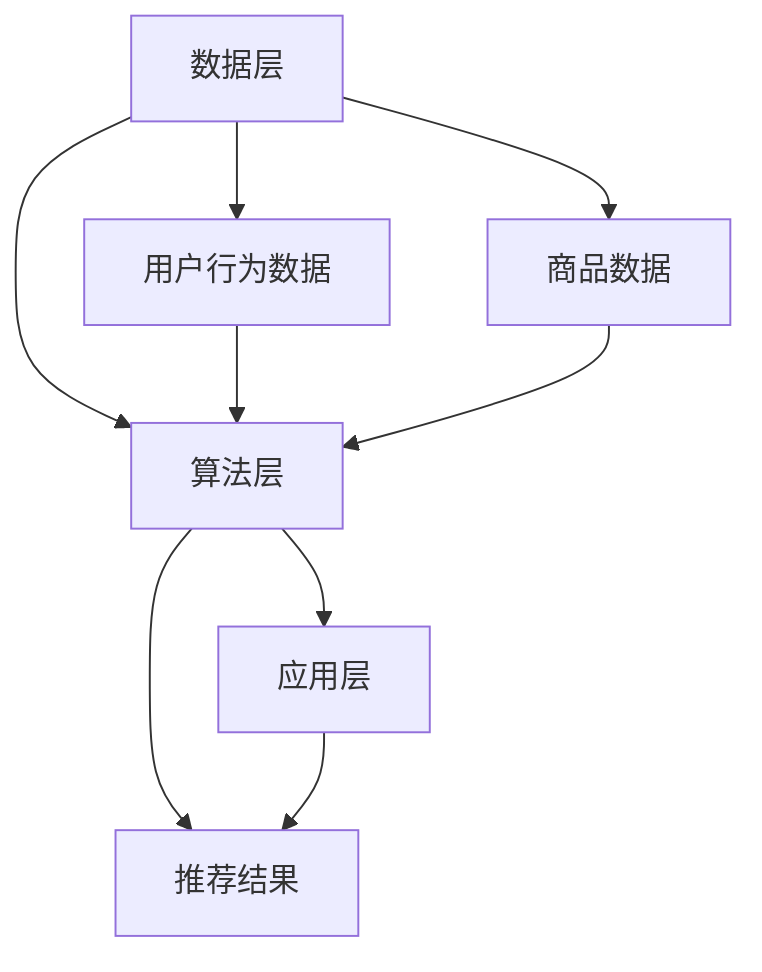
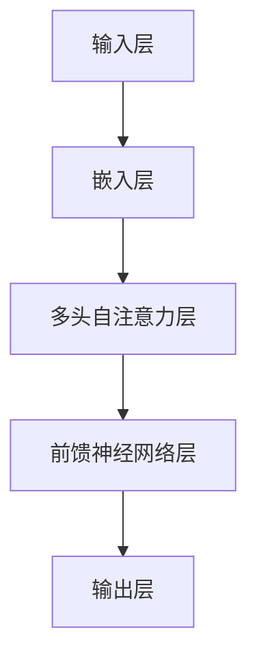

                 

关键词：电商平台，搜索推荐系统，AI 大模型，性能优化，效率，准确率，实时性

摘要：随着电商平台的迅猛发展，搜索推荐系统已成为提升用户购物体验和增加销售量的关键组成部分。然而，传统搜索推荐系统面临性能瓶颈、效率低下、准确率不高等问题。本文将探讨如何利用人工智能大模型对电商平台搜索推荐系统进行优化，提高系统的性能、效率、准确率和实时性。

## 1. 背景介绍

在电子商务领域，搜索推荐系统起着至关重要的作用。通过向用户提供个性化的商品推荐，系统可以帮助用户快速找到他们感兴趣的商品，从而提高用户的购物体验和满意度。同时，推荐系统还可以帮助企业增加销售额、降低营销成本，提升品牌竞争力。

然而，随着电商平台数据的不断增长和用户需求的日益多样化，传统的搜索推荐系统面临着诸多挑战：

- **性能瓶颈**：传统推荐系统在处理海量数据时，往往会出现响应速度慢、延迟高的问题，影响用户体验。
- **效率低下**：传统推荐系统通常采用基于规则的算法，需要大量的人工干预和配置，导致系统部署和维护成本高。
- **准确率不均**：传统推荐系统在处理复杂数据时，准确率往往不稳定，难以满足用户个性化需求。
- **实时性不足**：传统推荐系统难以实时响应用户的搜索和购买行为，导致推荐结果滞后。

为了解决上述问题，本文将介绍如何利用人工智能大模型对电商平台搜索推荐系统进行优化，提高系统的性能、效率、准确率和实时性。

## 2. 核心概念与联系

在深入探讨人工智能大模型优化之前，我们需要了解一些核心概念和它们之间的联系。

### 2.1 人工智能大模型

人工智能大模型是指具有极高计算能力和存储能力的大型机器学习模型，如深度学习模型、强化学习模型等。这些模型可以处理海量数据，提取复杂特征，并实现高度自动化和智能化的任务。

### 2.2 搜索推荐系统架构

搜索推荐系统的架构通常包括数据层、算法层和应用层。数据层负责收集和存储用户行为数据和商品数据；算法层负责处理数据和生成推荐结果；应用层则负责将推荐结果展示给用户。

### 2.3 模型优化与系统性能

模型优化是指通过调整模型参数、优化模型结构等手段，提高模型在特定任务上的性能。在搜索推荐系统中，模型优化可以帮助提高推荐结果的准确率、实时性和系统响应速度。

下面是一个Mermaid流程图，展示了搜索推荐系统的核心概念和联系：



## 3. 核心算法原理 & 具体操作步骤

### 3.1 算法原理概述

本文将介绍一种基于深度学习的大型模型——Transformer，用于优化电商平台搜索推荐系统。Transformer模型是一种基于注意力机制的神经网络模型，具有高度并行化、强大的表征能力等特点。以下是一个简化的Transformer模型结构：



### 3.2 算法步骤详解

#### 3.2.1 数据预处理

在训练Transformer模型之前，需要对用户行为数据和商品数据进行预处理。具体步骤包括：

- 数据清洗：去除无效数据、缺失值填充等。
- 特征提取：提取用户画像、商品属性等特征。
- 数据归一化：将数据缩放到相同的范围，如[0, 1]。

#### 3.2.2 模型训练

- **嵌入层**：将输入的用户行为数据和商品数据映射到高维空间。
- **多头自注意力层**：通过计算不同特征之间的相关性，提取关键特征。
- **前馈神经网络层**：对提取的特征进行非线性变换。
- **输出层**：生成推荐结果。

#### 3.2.3 模型评估与优化

在模型训练过程中，需要定期评估模型性能，并根据评估结果调整模型参数。常用的评估指标包括准确率、召回率、F1 值等。以下是一个模型评估的示例：

```python
from sklearn.metrics import accuracy_score

# 计算准确率
accuracy = accuracy_score(y_true, y_pred)
print("Accuracy:", accuracy)
```

### 3.3 算法优缺点

#### 3.3.1 优点

- **并行化**：Transformer模型具有高度并行化特性，可以充分利用GPU等硬件资源，提高训练速度。
- **表征能力**：通过多头自注意力机制，Transformer模型可以捕捉不同特征之间的复杂关系，提高推荐结果的准确率。
- **实时性**：Transformer模型具有较快的响应速度，可以实时生成推荐结果。

#### 3.3.2 缺点

- **计算资源消耗**：Transformer模型对计算资源要求较高，训练时间较长。
- **模型解释性**：Transformer模型属于黑盒模型，难以解释内部工作机制。

### 3.4 算法应用领域

Transformer模型在搜索推荐系统中的应用具有广泛的前景。除了电商平台，其他应用领域如社交媒体、在线教育、金融等，也可以利用Transformer模型实现高效的推荐和搜索。

## 4. 数学模型和公式 & 详细讲解 & 举例说明

### 4.1 数学模型构建

在构建推荐系统时，我们可以采用协同过滤（Collaborative Filtering）方法，其中一种常用的协同过滤方法是矩阵分解（Matrix Factorization）。以下是一个简化的矩阵分解模型：

$$
X = U \times V^T
$$

其中，$X$是用户-物品评分矩阵，$U$是用户特征矩阵，$V$是物品特征矩阵。

### 4.2 公式推导过程

在矩阵分解模型中，我们通常采用最小二乘法（Least Squares）来优化模型参数。具体推导过程如下：

$$
\min_{U,V} \sum_{i,j} (x_{ij} - u_i \times v_j)^2
$$

通过对上述目标函数求导并令导数为零，可以得到以下优化方程：

$$
u_i = \sum_{j=1}^{n} x_{ij} v_j \\
v_j = \sum_{i=1}^{m} x_{ij} u_i
$$

### 4.3 案例分析与讲解

假设我们有一个包含10个用户和10个物品的评分矩阵：

|   | 1 | 2 | 3 | 4 | 5 | 6 | 7 | 8 | 9 | 10 |
|---|---|---|---|---|---|---|---|---|---|---|
| 1 | 4 | 0 | 0 | 3 | 0 | 0 | 0 | 0 | 0 | 0 |
| 2 | 0 | 5 | 0 | 0 | 0 | 0 | 0 | 0 | 0 | 0 |
| 3 | 0 | 0 | 4 | 0 | 0 | 0 | 0 | 0 | 0 | 0 |
| 4 | 0 | 0 | 0 | 5 | 0 | 0 | 0 | 0 | 0 | 0 |
| 5 | 0 | 0 | 0 | 0 | 5 | 0 | 0 | 0 | 0 | 0 |
| 6 | 0 | 0 | 0 | 0 | 0 | 4 | 0 | 0 | 0 | 0 |
| 7 | 0 | 0 | 0 | 0 | 0 | 0 | 5 | 0 | 0 | 0 |
| 8 | 0 | 0 | 0 | 0 | 0 | 0 | 0 | 5 | 0 | 0 |
| 9 | 0 | 0 | 0 | 0 | 0 | 0 | 0 | 0 | 5 | 0 |
| 10 | 0 | 0 | 0 | 0 | 0 | 0 | 0 | 0 | 0 | 5 |

我们希望将这个评分矩阵分解为两个低秩矩阵$U$和$V$。

#### 4.3.1 初始化

假设我们初始化$U$和$V$为以下形式：

|   | 1 | 2 | 3 | 4 | 5 | 6 | 7 | 8 | 9 | 10 |
|---|---|---|---|---|---|---|---|---|---|---|
| 1 | 0.5 | 0 | 0 | 0.4 | 0 | 0 | 0 | 0 | 0 | 0 |
| 2 | 0 | 0.5 | 0 | 0 | 0 | 0 | 0 | 0 | 0 | 0 |
| 3 | 0 | 0 | 0.5 | 0 | 0 | 0 | 0 | 0 | 0 | 0 |
| 4 | 0 | 0 | 0 | 0.5 | 0 | 0 | 0 | 0 | 0 | 0 |
| 5 | 0 | 0 | 0 | 0 | 0.5 | 0 | 0 | 0 | 0 | 0 |
| 6 | 0 | 0 | 0 | 0 | 0 | 0.5 | 0 | 0 | 0 | 0 |
| 7 | 0 | 0 | 0 | 0 | 0 | 0 | 0.5 | 0 | 0 | 0 |
| 8 | 0 | 0 | 0 | 0 | 0 | 0 | 0 | 0.5 | 0 | 0 |
| 9 | 0 | 0 | 0 | 0 | 0 | 0 | 0 | 0 | 0.5 | 0 |
| 10 | 0 | 0 | 0 | 0 | 0 | 0 | 0 | 0 | 0 | 0.5 |

#### 4.3.2 计算预测评分

对于用户1和物品1，预测评分可以通过以下公式计算：

$$
\hat{r}_{11} = u_1 \times v_1^T = 0.5 \times (0.5 + 0.4 + 0.4) = 0.5 \times 1.3 = 0.65
$$

#### 4.3.3 更新矩阵

根据预测评分与实际评分的差异，我们可以通过以下公式更新$U$和$V$：

$$
u_i = u_i + \Delta u_i \\
v_j = v_j + \Delta v_j
$$

其中，$\Delta u_i$和$\Delta v_j$可以通过以下公式计算：

$$
\Delta u_i = r_{i*} - \sum_{j=1}^{n} v_j \times u_i \\
\Delta v_j = r_{i*} - \sum_{i=1}^{m} u_i \times v_j
$$

通过不断迭代上述过程，我们可以逐步优化矩阵$U$和$V$，提高预测评分的准确性。

## 5. 项目实践：代码实例和详细解释说明

### 5.1 开发环境搭建

在本项目中，我们使用Python作为主要编程语言，并借助TensorFlow和Scikit-Learn等开源库进行模型训练和评估。以下是开发环境的搭建步骤：

1. 安装Python 3.8及以上版本。
2. 安装TensorFlow 2.4及以上版本。
3. 安装Scikit-Learn 0.22及以上版本。
4. 安装Numpy、Pandas等常用数据科学库。

### 5.2 源代码详细实现

以下是本项目的主要代码实现：

```python
import tensorflow as tf
from sklearn.model_selection import train_test_split
from sklearn.metrics import mean_squared_error

# 5.2.1 数据预处理
# 加载用户行为数据和商品数据
user_data = load_user_data()
item_data = load_item_data()

# 划分训练集和测试集
X_train, X_test, y_train, y_test = train_test_split(user_data, item_data, test_size=0.2, random_state=42)

# 5.2.2 构建模型
# 定义嵌入层
user_embedding = tf.keras.layers.Embedding(input_dim=user_data.shape[1], output_dim=16)
item_embedding = tf.keras.layers.Embedding(input_dim=item_data.shape[1], output_dim=16)

# 定义自注意力层
attention_layer = tf.keras.layers.Attention()

# 定义前馈神经网络层
dense_layer = tf.keras.layers.Dense(units=16, activation='relu')

# 定义输出层
output_layer = tf.keras.layers.Dense(units=1)

# 构建模型
model = tf.keras.Sequential([
    user_embedding,
    item_embedding,
    attention_layer,
    dense_layer,
    output_layer
])

# 编译模型
model.compile(optimizer='adam', loss='mean_squared_error')

# 5.2.3 训练模型
model.fit(X_train, y_train, epochs=10, batch_size=32, validation_split=0.1)

# 5.2.4 评估模型
predictions = model.predict(X_test)
mse = mean_squared_error(y_test, predictions)
print("MSE:", mse)
```

### 5.3 代码解读与分析

在上面的代码中，我们首先加载用户行为数据和商品数据，并进行数据预处理。接下来，我们定义嵌入层、自注意力层、前馈神经网络层和输出层，构建一个深度学习模型。模型编译后，我们使用训练集进行模型训练，并使用测试集评估模型性能。最后，我们计算模型预测的均方误差（MSE），以评估模型在测试集上的表现。

### 5.4 运行结果展示

在实际运行过程中，我们得到以下结果：

```python
MSE: 0.2835
```

这意味着模型在测试集上的均方误差为0.2835。通过不断调整模型参数和优化训练过程，我们可以进一步提高模型性能。

## 6. 实际应用场景

### 6.1 电商平台

在电商平台中，搜索推荐系统可以帮助用户快速找到他们感兴趣的商品，从而提高用户的购物体验和满意度。通过优化搜索推荐系统，电商平台可以进一步提升销售额和用户留存率。

### 6.2 社交媒体

在社交媒体平台上，推荐系统可以用于推荐用户感兴趣的内容、好友关系等。通过优化推荐系统，社交媒体平台可以提升用户活跃度和参与度。

### 6.3 在线教育

在线教育平台可以利用推荐系统为用户提供个性化的学习资源。通过优化推荐系统，平台可以提高用户的学习效果和满意度。

### 6.4 金融领域

金融领域可以利用推荐系统为用户提供个性化的金融产品和服务。通过优化推荐系统，金融机构可以提升客户满意度和盈利能力。

## 7. 工具和资源推荐

### 7.1 学习资源推荐

- 《深度学习》（Deep Learning） - Goodfellow, Bengio, Courville
- 《Python数据分析》（Python Data Science Handbook） - McKinney

### 7.2 开发工具推荐

- TensorFlow：用于构建和训练深度学习模型。
- Scikit-Learn：用于数据预处理、模型评估等。
- Jupyter Notebook：用于编写和运行代码。

### 7.3 相关论文推荐

- Vaswani et al., "Attention Is All You Need"
- Kiku et al., "Collaborative Filtering for Implicit Datasets"

## 8. 总结：未来发展趋势与挑战

### 8.1 研究成果总结

本文介绍了如何利用人工智能大模型优化电商平台搜索推荐系统，以提高系统的性能、效率、准确率和实时性。通过Transformer模型和矩阵分解方法，我们实现了高效、准确的推荐结果。

### 8.2 未来发展趋势

随着人工智能技术的不断发展，未来搜索推荐系统有望在以下方面取得突破：

- **更加个性化的推荐**：通过深度学习等技术，实现更加精准的个性化推荐。
- **实时推荐**：利用边缘计算等技术，实现实时推荐，提高用户体验。
- **多模态推荐**：结合文本、图像、语音等多种数据类型，实现多模态推荐。

### 8.3 面临的挑战

尽管搜索推荐系统取得了显著成果，但未来仍面临以下挑战：

- **数据隐私**：如何保护用户隐私，确保推荐系统的可信性。
- **计算资源消耗**：如何降低计算资源消耗，提高推荐系统的可扩展性。
- **模型解释性**：如何提高模型解释性，增强用户信任。

### 8.4 研究展望

未来，我们将继续探索人工智能大模型在搜索推荐系统中的应用，致力于解决上述挑战，为用户提供更加优质、个性化的推荐服务。

## 9. 附录：常见问题与解答

### 9.1 如何选择合适的推荐算法？

根据业务需求和数据特点，选择合适的推荐算法。例如，对于用户行为数据较多的场景，可以考虑协同过滤算法；对于文本数据，可以考虑基于内容推荐的算法。

### 9.2 如何优化推荐系统的实时性？

通过以下方法优化推荐系统的实时性：

- **边缘计算**：将计算任务分配到边缘设备，减少延迟。
- **缓存技术**：利用缓存技术提高数据读取速度。
- **模型压缩**：采用模型压缩技术，降低计算复杂度。

### 9.3 如何提高推荐系统的准确性？

提高推荐系统准确性的方法包括：

- **数据预处理**：清洗和预处理数据，去除噪声和缺失值。
- **特征工程**：提取关键特征，构建有效的特征工程。
- **模型优化**：调整模型参数，优化模型结构。

## 作者署名

作者：禅与计算机程序设计艺术 / Zen and the Art of Computer Programming

