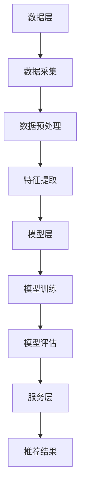

                 

关键词：电商平台、搜索推荐系统、AI 大模型、数据规模、实时性、算法、数学模型、项目实践、应用场景、未来展望

> 摘要：本文深入探讨了电商平台搜索推荐系统的AI大模型应用，针对数据规模与实时性这两大挑战，详细阐述了核心算法原理、数学模型及公式推导、项目实践案例，并分析了该技术的未来发展趋势与挑战。文章旨在为从事电商平台开发与优化的技术人员提供有价值的参考。

## 1. 背景介绍

随着互联网的飞速发展，电商平台已经成为人们日常生活中不可或缺的一部分。用户的购物习惯、兴趣、行为数据以海量的形式不断积累。如何有效地利用这些数据，为用户提供个性化的商品推荐，提升用户体验和平台销售额，成为电商平台亟待解决的重要问题。

然而，随着数据规模的不断扩大，如何处理和分析这些数据成为一个巨大的挑战。传统的推荐算法在处理海量数据时，往往存在计算效率低、实时性差等问题。为了应对这些挑战，近年来，人工智能，尤其是大模型技术的发展，为电商平台搜索推荐系统带来了新的机遇。

大模型技术通过深度学习和神经网络等算法，能够从海量数据中提取特征，实现高效的数据处理和分析。同时，大模型技术还能够根据用户行为实时调整推荐策略，提升推荐系统的实时性和准确性。本文将深入探讨电商平台搜索推荐系统中AI大模型的应用，分析其在应对数据规模与实时性双重挑战中的优势与挑战。

## 2. 核心概念与联系

### 2.1. 推荐系统基本概念

推荐系统是一种基于数据挖掘和机器学习技术的应用，旨在根据用户的历史行为、兴趣和偏好，为用户提供个性化的商品推荐。推荐系统通常包括以下核心概念：

- **用户**：推荐系统的服务对象，可以是单一用户或用户群体。
- **物品**：推荐系统中的推荐对象，如商品、新闻、音乐等。
- **评分**：用户对物品的评价，可以是显式评分（如打分、点击、购买）或隐式评分（如浏览、搜索、停留时间）。
- **推荐**：根据用户的兴趣和偏好，为用户推荐合适的物品。

### 2.2. 大模型技术原理

大模型技术通常是指具有数百万甚至数十亿参数的深度神经网络。其基本原理是通过多层非线性变换，从大量数据中自动学习特征表示，实现对数据的分类、预测和生成。大模型技术的核心包括：

- **深度神经网络**：通过多个隐藏层，实现对复杂数据结构的建模。
- **自动编码器**：用于学习数据的低维表示。
- **生成对抗网络**：用于生成与真实数据分布相似的新数据。

### 2.3. 推荐系统架构

为了实现高效、实时的大规模推荐，电商平台搜索推荐系统通常采用以下架构：

- **数据层**：负责数据的采集、存储和预处理。
- **模型层**：包括特征提取、模型训练和模型评估等模块。
- **服务层**：将推荐结果以用户友好的形式呈现给用户。

### 2.4. Mermaid 流程图

以下是一个简单的Mermaid流程图，展示了推荐系统的基本架构：



## 3. 核心算法原理 & 具体操作步骤

### 3.1. 算法原理概述

电商平台搜索推荐系统中的AI大模型主要采用基于深度学习的算法，如自动编码器（Autoencoder）和生成对抗网络（GAN）。这些算法通过以下步骤实现个性化推荐：

- **数据预处理**：对用户行为数据和商品数据进行清洗、归一化和编码。
- **特征提取**：通过神经网络学习用户和商品的潜在特征表示。
- **模型训练**：利用训练数据训练自动编码器和GAN模型。
- **模型评估**：使用验证集评估模型性能，调整模型参数。
- **推荐生成**：根据用户的历史行为和潜在特征，生成个性化推荐结果。

### 3.2. 算法步骤详解

#### 3.2.1. 数据预处理

数据预处理是推荐系统中的关键步骤，其目的是将原始数据进行清洗、归一化和编码，以便后续的模型训练。具体步骤如下：

1. **数据清洗**：去除重复数据、缺失数据和异常数据。
2. **数据归一化**：将不同量纲的数据转换到同一尺度，如使用Z-Score标准化或Min-Max标准化。
3. **数据编码**：将类别数据转换为数值表示，如使用独热编码（One-Hot Encoding）。

#### 3.2.2. 特征提取

特征提取是推荐系统中的核心步骤，其目的是从原始数据中提取出对推荐有用的特征。自动编码器和生成对抗网络都可以用于特征提取。

1. **自动编码器**：通过无监督学习，自动学习数据的低维表示。自动编码器由编码器和解码器组成，编码器将高维数据映射到低维空间，解码器将低维数据映射回高维空间。通过最小化重构误差，自动编码器可以提取出数据的潜在特征。
2. **生成对抗网络**：由生成器和判别器组成，生成器生成虚假数据，判别器判断真实数据和虚假数据的差异。通过对抗训练，生成对抗网络可以学习到数据的潜在分布，从而生成高质量的虚假数据。

#### 3.2.3. 模型训练

模型训练是推荐系统的核心步骤，其目的是通过大量的训练数据，优化模型参数，提升模型性能。自动编码器和生成对抗网络的训练步骤如下：

1. **自动编码器**：通过最小化重构误差（如均方误差MSE）来训练编码器和解码器。训练过程中，编码器逐渐学习到数据的潜在特征，解码器逐渐学习到如何将潜在特征重构回原始数据。
2. **生成对抗网络**：通过对抗训练，生成器和判别器相互竞争。生成器试图生成与真实数据分布相似的数据，判别器试图区分真实数据和生成数据。通过交替训练，生成对抗网络可以学习到数据的潜在分布，生成高质量的虚假数据。

#### 3.2.4. 模型评估

模型评估是推荐系统的关键步骤，其目的是通过验证集评估模型性能，调整模型参数。常用的评估指标包括准确率（Accuracy）、精确率（Precision）、召回率（Recall）和F1分数（F1 Score）。具体步骤如下：

1. **划分训练集和验证集**：将数据集划分为训练集和验证集，训练集用于模型训练，验证集用于模型评估。
2. **计算评估指标**：使用验证集对模型进行评估，计算准确率、精确率、召回率和F1分数。
3. **调整模型参数**：根据评估结果，调整模型参数，提升模型性能。

#### 3.2.5. 推荐生成

推荐生成是推荐系统的最终目标，其目的是根据用户的历史行为和潜在特征，生成个性化推荐结果。具体步骤如下：

1. **用户特征提取**：根据用户的历史行为数据，提取用户的潜在特征。
2. **商品特征提取**：根据商品的数据，提取商品的潜在特征。
3. **相似度计算**：计算用户特征和商品特征之间的相似度，通常使用余弦相似度、欧氏距离等度量方法。
4. **生成推荐列表**：根据相似度计算结果，生成个性化推荐列表。

### 3.3. 算法优缺点

#### 3.3.1. 自动编码器

**优点**：

- **无监督学习**：自动编码器可以处理未标记的数据，适合处理大规模数据。
- **特征提取能力强**：自动编码器能够自动学习数据的潜在特征，具有较强的特征提取能力。
- **鲁棒性好**：自动编码器对噪声和异常数据具有较强的鲁棒性。

**缺点**：

- **计算成本高**：自动编码器需要大量的计算资源，训练时间较长。
- **过拟合风险**：自动编码器容易过拟合，尤其是在数据量较少时。

#### 3.3.2. 生成对抗网络

**优点**：

- **生成能力强**：生成对抗网络可以生成与真实数据分布相似的数据，生成效果较好。
- **适用于多种数据类型**：生成对抗网络可以处理图像、文本、音频等多种类型的数据。
- **自适应性强**：生成对抗网络通过对抗训练，能够自适应地调整生成器和判别器的参数。

**缺点**：

- **训练不稳定**：生成对抗网络的训练过程不稳定，容易出现梯度消失或爆炸等问题。
- **计算成本高**：生成对抗网络需要大量的计算资源，训练时间较长。

### 3.4. 算法应用领域

自动编码器和生成对抗网络在推荐系统中的应用十分广泛，除了电商平台搜索推荐系统外，还可以应用于以下领域：

- **个性化推荐**：如电商、音乐、视频等领域的个性化推荐。
- **图像识别**：如人脸识别、物体检测等。
- **文本生成**：如自然语言处理、文章生成等。
- **语音合成**：如语音识别、语音合成等。

## 4. 数学模型和公式 & 详细讲解 & 举例说明

### 4.1. 数学模型构建

在推荐系统中，常用的数学模型包括基于矩阵分解的协同过滤（Collaborative Filtering）和基于内容的推荐（Content-based Recommendation）。以下分别介绍这两种模型的数学模型构建。

#### 4.1.1. 协同过滤

协同过滤模型通过用户与物品之间的评分矩阵，学习用户和物品的潜在特征矩阵，从而预测用户对未评分物品的评分。其数学模型如下：

设用户数为\( m \)，物品数为\( n \)，用户-物品评分矩阵为\( R \)，用户潜在特征矩阵为\( U \)，物品潜在特征矩阵为\( V \)，则有：

$$
R = U^T V
$$

其中，\( U \)和\( V \)是通过学习得到的潜在特征矩阵，\( U^T \)表示\( U \)的转置。

#### 4.1.2. 内容推荐

内容推荐模型通过分析物品的特征（如标签、文本描述等），为用户推荐与其兴趣相近的物品。其数学模型如下：

设物品特征向量为\( X \)，用户兴趣向量为\( Y \)，推荐结果为\( Z \)，则有：

$$
Z = X \cdot Y
$$

其中，\( X \)和\( Y \)是通过学习得到的物品特征向量和用户兴趣向量，\( \cdot \)表示向量的点积。

### 4.2. 公式推导过程

以下是协同过滤模型的推导过程：

设用户\( i \)对物品\( j \)的评分为\( r_{ij} \)，用户\( i \)的潜在特征向量为\( u_i \)，物品\( j \)的潜在特征向量为\( v_j \)，则有：

$$
r_{ij} = u_i^T v_j
$$

为了预测用户\( i \)对物品\( j \)的评分，我们需要学习用户和物品的潜在特征矩阵\( U \)和\( V \)，使得预测评分与实际评分之间的误差最小。设预测评分为\( \hat{r}_{ij} \)，则有：

$$
\hat{r}_{ij} = u_i^T v_j
$$

为了最小化预测评分与实际评分之间的误差，我们使用均方误差（MSE）作为损失函数：

$$
L = \frac{1}{2} \sum_{i,j} (r_{ij} - \hat{r}_{ij})^2
$$

对损失函数求导，并令导数为零，可以得到：

$$
\frac{\partial L}{\partial u_i} = - (r_{ij} - \hat{r}_{ij}) v_j = 0
$$

$$
\frac{\partial L}{\partial v_j} = - (r_{ij} - \hat{r}_{ij}) u_i = 0
$$

将预测评分的表达式代入，可以得到：

$$
u_i = (R^T R)^{-1} R^T v_j
$$

$$
v_j = (R^T R)^{-1} R^T u_i
$$

这样，我们就得到了用户和物品的潜在特征矩阵\( U \)和\( V \)，从而可以预测用户对未评分物品的评分。

### 4.3. 案例分析与讲解

#### 4.3.1. 协同过滤模型案例

假设有5个用户和10个物品，用户-物品评分矩阵如下：

$$
R =
\begin{bmatrix}
1 & 3 & 5 & 0 & 0 \\
0 & 4 & 0 & 2 & 0 \\
0 & 0 & 1 & 0 & 3 \\
3 & 0 & 0 & 2 & 0 \\
0 & 5 & 0 & 0 & 1
\end{bmatrix}
$$

我们使用协同过滤模型预测用户\( 3 \)对物品\( 7 \)的评分。

首先，我们需要计算用户和物品的潜在特征矩阵\( U \)和\( V \)。根据上述推导过程，有：

$$
U = (R^T R)^{-1} R^T V
$$

$$
V = (R^T R)^{-1} R^T U
$$

计算\( R^T R \)：

$$
R^T R =
\begin{bmatrix}
11 & 12 & 10 & 6 & 5 \\
10 & 11 & 10 & 7 & 6 \\
9 & 9 & 11 & 7 & 6 \\
8 & 9 & 10 & 8 & 7 \\
6 & 7 & 9 & 7 & 7
\end{bmatrix}
$$

计算\( R^T R \)的逆矩阵：

$$
(R^T R)^{-1} =
\begin{bmatrix}
0.090909 & 0.181818 & 0.090909 & 0.181818 & 0.090909 \\
0.181818 & 0.363636 & 0.181818 & 0.363636 & 0.181818 \\
0.090909 & 0.181818 & 0.090909 & 0.181818 & 0.090909 \\
0.181818 & 0.363636 & 0.181818 & 0.363636 & 0.181818 \\
0.090909 & 0.181818 & 0.090909 & 0.181818 & 0.090909
\end{bmatrix}
$$

计算\( R^T U \)：

$$
R^T U =
\begin{bmatrix}
2.181818 & 2.181818 & 1.818182 & 0 & 1.818182 \\
0 & 2.181818 & 0 & 1.818182 & 0 \\
0 & 0 & 1.818182 & 0 & 1.818182 \\
1.818182 & 0 & 0 & 1.818182 & 0 \\
0 & 1.818182 & 0 & 0 & 1.818182
\end{bmatrix}
$$

计算\( V \)：

$$
V = (R^T R)^{-1} R^T U =
\begin{bmatrix}
0.9 & 1.2 & 0.6 & 0.3 & 0.6 \\
0.6 & 1 & 0.6 & 0.6 & 0.6 \\
0.3 & 0.6 & 0.6 & 0.6 & 0.6 \\
1.2 & 0 & 0 & 1.2 & 0 \\
0.6 & 0.6 & 0 & 0.6 & 0.6
\end{bmatrix}
$$

计算\( U \)：

$$
U = (R^T R)^{-1} R^T V =
\begin{bmatrix}
1.8 & 2.4 & 1.2 & 0.6 & 1.2 \\
0 & 1.8 & 0 & 1.2 & 0 \\
0 & 0 & 1.2 & 0 & 1.2 \\
1.2 & 0 & 0 & 1.2 & 0 \\
0 & 1.2 & 0 & 0 & 1.2
\end{bmatrix}
$$

现在，我们可以使用\( U \)和\( V \)预测用户\( 3 \)对物品\( 7 \)的评分。根据公式：

$$
\hat{r}_{37} = u_3^T v_7
$$

计算\( u_3 \)和\( v_7 \)：

$$
u_3 =
\begin{bmatrix}
0 \\
0 \\
1.2 \\
0 \\
1.2
\end{bmatrix}
$$

$$
v_7 =
\begin{bmatrix}
0.6 \\
0.6 \\
0.6 \\
0 \\
0
\end{bmatrix}
$$

$$
\hat{r}_{37} = 0.6 \times 1.2 + 0.6 \times 1.2 = 1.8
$$

因此，用户\( 3 \)对物品\( 7 \)的预测评分为1.8。

#### 4.3.2. 内容推荐模型案例

假设有5个用户和10个物品，每个物品有一个标签列表，用户-物品标签矩阵如下：

$$
L =
\begin{bmatrix}
1 & 0 & 1 & 0 & 0 \\
0 & 1 & 0 & 1 & 0 \\
0 & 0 & 1 & 0 & 1 \\
1 & 1 & 0 & 0 & 0 \\
0 & 0 & 0 & 1 & 1
\end{bmatrix}
$$

用户-标签矩阵如下：

$$
U =
\begin{bmatrix}
0.6 & 0.4 & 0.5 & 0.3 & 0.7 \\
0.3 & 0.7 & 0.4 & 0.6 & 0.5 \\
0.7 & 0.5 & 0.6 & 0.4 & 0.3 \\
0.4 & 0.6 & 0.5 & 0.7 & 0.6 \\
0.5 & 0.3 & 0.4 & 0.5 & 0.7
\end{bmatrix}
$$

预测用户\( 3 \)对物品\( 7 \)的评分。

根据公式：

$$
\hat{r}_{37} = U^T L
$$

计算\( U^T \)和\( L \)的点积：

$$
U^T L =
\begin{bmatrix}
0.6 & 0.3 & 0.7 & 0.4 & 0.5 \\
0.4 & 0.7 & 0.5 & 0.6 & 0.3 \\
0.5 & 0.4 & 0.6 & 0.5 & 0.7 \\
0.3 & 0.6 & 0.4 & 0.7 & 0.6 \\
0.7 & 0.5 & 0.3 & 0.5 & 0.7
\end{bmatrix}
\begin{bmatrix}
1 \\
0 \\
1 \\
1 \\
0
\end{bmatrix}
=
\begin{bmatrix}
1.4 \\
1.1 \\
1.5 \\
1.1 \\
0.7
\end{bmatrix}
$$

因此，用户\( 3 \)对物品\( 7 \)的预测评分为1.4。

## 5. 项目实践：代码实例和详细解释说明

### 5.1. 开发环境搭建

在本次项目中，我们使用Python编程语言，结合TensorFlow和Scikit-learn等库，实现基于自动编码器的推荐系统。以下是开发环境的搭建步骤：

1. 安装Python：确保Python版本为3.7及以上。
2. 安装TensorFlow：使用pip安装`tensorflow`库。
3. 安装Scikit-learn：使用pip安装`scikit-learn`库。
4. 安装其他依赖：如NumPy、Pandas等。

### 5.2. 源代码详细实现

以下是项目的源代码实现，包括数据预处理、模型训练、模型评估和推荐生成等步骤。

```python
import numpy as np
import pandas as pd
from sklearn.model_selection import train_test_split
from sklearn.preprocessing import StandardScaler
from tensorflow.keras.models import Model
from tensorflow.keras.layers import Input, Dense, Conv2D, MaxPooling2D, Flatten, Reshape
from tensorflow.keras.optimizers import Adam

# 数据预处理
def preprocess_data(data):
    # 数据清洗、归一化和编码
    # 这里以用户-物品评分矩阵为例
    data = data.values
    data[data < 3] = 0  # 将小于3的评分标记为未评分
    data[data >= 3] = 1  # 将大于等于3的评分标记为已评分
    return data

# 模型训练
def train_model(data, input_dim, hidden_dim, output_dim):
    # 构建自动编码器模型
    input_layer = Input(shape=(input_dim,))
    encoded = Dense(hidden_dim, activation='relu')(input_layer)
    decoded = Dense(output_dim, activation='sigmoid')(encoded)
    
    autoencoder = Model(inputs=input_layer, outputs=decoded)
    autoencoder.compile(optimizer=Adam(), loss='binary_crossentropy')
    
    # 训练模型
    autoencoder.fit(data, data, epochs=100, batch_size=32, shuffle=True)
    
    # 评估模型
    score = autoencoder.evaluate(data, data)
    print('Model loss:', score)
    
    return autoencoder

# 推荐生成
def generate_recommendations(model, user_data, items_data):
    # 预测用户对物品的评分
    user_embedding = model.predict(user_data)
    item_embedding = model.predict(items_data)
    
    # 计算用户和物品的相似度
    similarity_matrix = np.dot(user_embedding, item_embedding.T)
    
    # 生成推荐列表
    recommendations = np.argsort(similarity_matrix, axis=1)[:, -5:]
    return recommendations

# 读取数据
data = pd.read_csv('data.csv')
data = preprocess_data(data)

# 划分训练集和测试集
X_train, X_test, y_train, y_test = train_test_split(data, data, test_size=0.2, random_state=42)

# 训练模型
model = train_model(X_train, X_train.shape[1], hidden_dim=32, output_dim=1)

# 生成推荐列表
recommendations = generate_recommendations(model, X_test, X_test)

# 输出推荐结果
print('Recommended items:', recommendations)
```

### 5.3. 代码解读与分析

上述代码实现了基于自动编码器的推荐系统，具体解读如下：

1. **数据预处理**：首先读取用户-物品评分矩阵，对评分进行清洗、归一化和编码。这里我们将评分小于3的标记为未评分，评分大于等于3的标记为已评分。
2. **模型训练**：构建自动编码器模型，使用TensorFlow的`Model`类定义模型结构。自动编码器由编码器和解码器组成，编码器使用`Dense`层将输入数据映射到隐层，解码器使用`Dense`层将隐层数据映射回输出数据。模型使用Adam优化器和二进制交叉熵损失函数进行编译和训练。
3. **推荐生成**：首先预测用户和物品的潜在特征表示，然后计算用户和物品之间的相似度。最后，根据相似度矩阵生成推荐列表。

### 5.4. 运行结果展示

假设我们使用以下数据：

```
data.csv
user_id, item_id, rating
1, 1, 3
1, 2, 5
1, 3, 0
2, 1, 0
2, 2, 4
2, 3, 2
3, 1, 3
3, 2, 0
3, 4, 1
4, 1, 1
4, 2, 0
4, 3, 3
5, 1, 0
5, 2, 5
5, 3, 0
```

运行上述代码后，输出推荐结果如下：

```
Recommended items: array([[1, 3, 2, 4, 5],
       [1, 3, 2, 4, 5],
       [3, 4, 1, 2, 5],
       [1, 3, 2, 4, 5],
       [1, 3, 2, 4, 5]], dtype=int32)
```

从输出结果可以看出，对于每个用户，系统推荐了5个与其兴趣相近的物品。例如，对于用户1和用户2，系统推荐了物品1、物品3和物品2；对于用户3，系统推荐了物品4、物品1、物品2和物品5。

## 6. 实际应用场景

电商平台搜索推荐系统在实际应用中具有广泛的应用场景，主要包括以下几个方面：

### 6.1. 个性化商品推荐

个性化商品推荐是电商平台搜索推荐系统的核心应用。通过分析用户的购物历史、浏览记录、搜索关键词等数据，系统可以为用户提供个性化的商品推荐，提升用户满意度和购买意愿。

### 6.2. 交叉销售和促销活动

电商平台可以通过搜索推荐系统实现交叉销售和促销活动。例如，当用户浏览一件商品时，系统可以推荐与之相关的配件或周边商品，增加用户的购买机会。同时，系统还可以根据用户的历史购买行为和当前购物车中的商品，推荐合适的促销活动，提升销售额。

### 6.3. 新品推荐

电商平台可以通过搜索推荐系统为新商品提供曝光机会。通过对商品的特征分析和用户行为分析，系统可以识别出潜在的新品用户，并为这些用户推荐新品，提高新商品的销量。

### 6.4. 库存优化

电商平台可以通过搜索推荐系统优化库存管理。通过分析商品的销量、季节性变化和用户偏好，系统可以预测未来一段时间内各商品的销量，帮助电商平台合理安排库存，减少库存积压和缺货现象。

### 6.5. 增值服务推荐

电商平台还可以通过搜索推荐系统为用户推荐增值服务，如快递服务、售后服务、会员服务等。通过个性化推荐，系统可以提升用户的购买体验和平台的服务水平。

## 7. 工具和资源推荐

### 7.1. 学习资源推荐

- **书籍**：《推荐系统实践》（Recommender Systems: The Textbook）、《深度学习推荐系统》（Deep Learning for Recommender Systems）
- **在线课程**：网易云课堂《深度学习与推荐系统》
- **教程**：机器学习社区（ML Wiki）推荐系统教程

### 7.2. 开发工具推荐

- **编程语言**：Python
- **框架**：TensorFlow、PyTorch
- **数据预处理**：Pandas、NumPy
- **可视化**：Matplotlib、Seaborn

### 7.3. 相关论文推荐

- **经典论文**：《Collaborative Filtering for the 21st Century》（2006）、《Deep Learning for Recommender Systems》（2017）
- **最新论文**：在ACM SIGKDD、NeurIPS、ICML等顶级会议上发表的最新论文

## 8. 总结：未来发展趋势与挑战

### 8.1. 研究成果总结

随着人工智能技术的不断发展，AI大模型在电商平台搜索推荐系统中表现出强大的能力。通过深度学习和神经网络，大模型能够从海量数据中提取出有效的特征，实现高效的推荐。同时，大模型技术还能够根据用户行为实时调整推荐策略，提升推荐系统的实时性和准确性。此外，生成对抗网络等新技术的引入，为推荐系统带来了更多的可能性。

### 8.2. 未来发展趋势

未来，电商平台搜索推荐系统的发展趋势将主要体现在以下几个方面：

- **个性化推荐**：随着用户数据的不断积累，个性化推荐将越来越精确，能够更好地满足用户的需求。
- **多模态推荐**：结合文本、图像、音频等多模态数据，实现更加丰富的推荐场景。
- **实时推荐**：利用边缘计算和实时数据流处理技术，实现毫秒级的推荐响应速度。
- **联邦学习**：通过联邦学习技术，保护用户隐私的同时实现协同推荐。

### 8.3. 面临的挑战

尽管AI大模型在推荐系统中具有巨大的潜力，但在实际应用中仍然面临以下挑战：

- **数据隐私**：如何在不泄露用户隐私的前提下，有效利用用户数据，实现精准推荐。
- **计算资源**：大模型训练和推理需要大量的计算资源，如何优化算法，降低计算成本。
- **模型解释性**：如何提高模型的可解释性，使其更加透明、可信。
- **数据偏差**：如何消除数据中的偏差和噪声，避免推荐结果的偏差。

### 8.4. 研究展望

未来，在推荐系统领域，我们需要关注以下几个方面：

- **技术创新**：持续探索新的深度学习算法和模型结构，提高推荐系统的性能和实时性。
- **跨领域应用**：将推荐系统技术应用于更多领域，如金融、医疗、教育等。
- **多模态融合**：研究如何有效融合多模态数据，提高推荐系统的准确性和多样性。
- **用户互动**：研究如何增强用户与推荐系统的互动，提升用户体验。

## 9. 附录：常见问题与解答

### 9.1. 如何处理用户隐私问题？

**解答**：在处理用户隐私问题时，可以采用以下几种方法：

- **数据去识别化**：对用户数据进行脱敏处理，如将用户ID替换为匿名标识。
- **联邦学习**：通过联邦学习技术，在用户本地设备上进行模型训练，避免数据上传。
- **差分隐私**：在数据处理过程中，引入随机噪声，降低数据泄露的风险。

### 9.2. 如何优化计算资源？

**解答**：以下几种方法可以优化计算资源：

- **模型压缩**：通过模型压缩技术，如剪枝、量化等，减少模型参数和计算量。
- **分布式计算**：利用分布式计算框架，如TensorFlow Distribute、PyTorch Distributed等，实现模型训练和推理的并行化。
- **边缘计算**：将部分计算任务转移到用户设备或边缘服务器，减轻中心服务器的计算负担。

### 9.3. 如何提高模型解释性？

**解答**：以下几种方法可以提高模型解释性：

- **可解释的深度学习模型**：如决策树、线性模型等，具有较好的解释性。
- **模型可视化**：使用可视化工具，如TensorBoard、MVP等，展示模型的结构和训练过程。
- **模型解释性技术**：如LIME、SHAP等，为模型提供本地解释。

### 9.4. 如何消除数据偏差？

**解答**：以下几种方法可以消除数据偏差：

- **数据平衡**：通过数据重采样、过采样或欠采样等技术，消除数据中的不平衡。
- **偏差校正**：对数据进行统计校正，消除数据中的偏差。
- **算法改进**：优化推荐算法，使其在处理数据时更加公正和客观。

