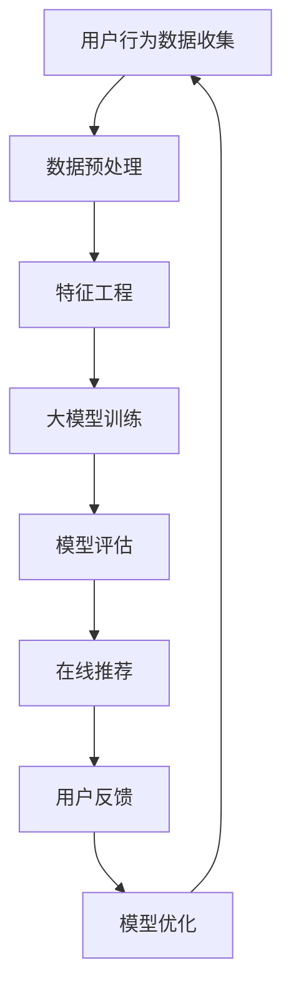

                 

## 1. 背景介绍

随着互联网技术的快速发展，电子商务行业呈现出爆炸式增长。电商平台之间的竞争日益激烈，用户获取和留存成为企业关注的焦点。在此背景下，搜索推荐系统应运而生，通过对用户行为数据的分析，为用户提供个性化的商品推荐，提高用户体验和购物满意度。然而，传统的搜索推荐系统在处理大规模数据和复杂业务逻辑时，往往面临效率低、效果差等问题。

近年来，人工智能技术的迅速发展，特别是深度学习技术的突破，为搜索推荐系统的优化提供了新的思路。大模型作为一种能够处理大规模数据和复杂任务的人工智能技术，逐渐成为研究热点。本文将探讨电商平台搜索推荐系统中AI大模型的应用，旨在提高系统效率、效果和用户忠诚度。

## 2. 核心概念与联系

在深入探讨大模型在搜索推荐系统中的应用之前，有必要了解相关核心概念和它们之间的联系。以下是几个关键概念：

### 2.1 搜索推荐系统

搜索推荐系统是一种结合搜索和推荐技术的系统，旨在为用户提供个性化的信息或商品推荐。其主要功能包括：

- **用户画像**：通过用户的历史行为和偏好，构建用户的个性化特征模型。
- **内容匹配**：将用户特征与商品特征进行匹配，找到潜在的兴趣点。
- **排序和推荐**：根据匹配结果，对推荐商品进行排序，呈现给用户。

### 2.2 人工智能

人工智能（AI）是一种模拟人类智能的技术，通过计算机程序实现智能行为。在搜索推荐系统中，AI主要用于数据处理、特征提取和模型训练。

### 2.3 深度学习

深度学习是人工智能的一个重要分支，通过多层神经网络模型进行数据建模。深度学习技术在搜索推荐系统中用于特征提取、模型训练和预测。

### 2.4 大模型

大模型是指具有海量参数和计算能力的神经网络模型，能够处理大规模数据和复杂任务。大模型在搜索推荐系统中的应用，主要体现在以下几个方面：

- **复杂特征提取**：大模型能够自动提取复杂的用户和商品特征。
- **高效预测**：大模型在处理大规模数据时，能够实现高效的预测。
- **自适应优化**：大模型能够根据用户反馈进行自适应优化，提高推荐效果。

### 2.5 Mermaid 流程图

以下是一个简单的Mermaid流程图，展示了搜索推荐系统中大模型的应用流程：



通过以上流程图，我们可以看到，大模型在搜索推荐系统中的作用不仅仅是一个简单的数据预处理工具，而是贯穿整个系统的核心组件。

## 3. 核心算法原理 & 具体操作步骤

### 3.1 算法原理概述

大模型在搜索推荐系统中的应用，主要基于深度学习和机器学习算法。以下是一些核心算法原理：

#### 3.1.1 神经网络

神经网络是一种模仿生物神经网络结构的人工智能算法。在搜索推荐系统中，神经网络主要用于特征提取和模型训练。常见的神经网络结构包括卷积神经网络（CNN）、循环神经网络（RNN）和Transformer等。

#### 3.1.2 协同过滤

协同过滤是一种常见的推荐算法，通过分析用户的历史行为数据，找出相似的用户或商品，进行推荐。协同过滤分为基于用户和基于商品两种类型。

#### 3.1.3 强化学习

强化学习是一种通过试错和反馈进行决策的算法。在搜索推荐系统中，强化学习可以用于优化推荐策略，提高推荐效果。

### 3.2 算法步骤详解

#### 3.2.1 数据预处理

数据预处理是搜索推荐系统的第一步，主要包括数据清洗、数据归一化和特征提取。

- **数据清洗**：去除数据中的噪声和异常值，保证数据质量。
- **数据归一化**：将不同特征的数据进行归一化处理，使其在相同尺度上。
- **特征提取**：从原始数据中提取有用的特征，为后续模型训练提供输入。

#### 3.2.2 特征工程

特征工程是搜索推荐系统的核心环节，通过设计合适的特征，提高模型的预测效果。常见的特征包括用户特征、商品特征和交互特征。

- **用户特征**：包括用户的基本信息、购买历史、浏览记录等。
- **商品特征**：包括商品的价格、分类、品牌、评分等。
- **交互特征**：包括用户与商品的互动行为，如购买、收藏、评论等。

#### 3.2.3 大模型训练

大模型训练是搜索推荐系统的核心步骤，通过大量的数据对模型进行训练，使其具备预测能力。

- **模型选择**：根据任务需求和数据特点，选择合适的神经网络结构。
- **模型训练**：通过训练样本对模型进行训练，不断调整模型参数，使其拟合训练数据。
- **模型评估**：使用测试数据对训练好的模型进行评估，验证模型的效果。

#### 3.2.4 模型部署

模型部署是将训练好的模型应用到实际业务中，包括模型上线、在线更新和实时预测。

- **模型上线**：将训练好的模型部署到服务器，使其能够实时处理用户请求。
- **在线更新**：根据用户反馈和数据变化，对模型进行在线更新，提高推荐效果。
- **实时预测**：实时分析用户行为，为用户提供个性化的推荐结果。

### 3.3 算法优缺点

#### 优点

- **高效性**：大模型能够处理大规模数据和复杂任务，提高系统运行效率。
- **准确性**：通过深度学习和机器学习算法，大模型能够提取复杂的特征，提高推荐准确性。
- **自适应优化**：大模型能够根据用户反馈进行自适应优化，提高推荐效果。

#### 缺点

- **计算资源消耗**：大模型需要大量的计算资源和存储空间，对硬件要求较高。
- **数据质量要求**：大模型对数据质量要求较高，需要处理噪声和异常值，保证数据质量。

### 3.4 算法应用领域

大模型在搜索推荐系统中的应用，不仅仅局限于电商平台，还可以扩展到其他领域，如视频推荐、音乐推荐、社交网络等。以下是一些应用领域：

- **电商平台**：为用户提供个性化的商品推荐，提高购物体验和满意度。
- **视频推荐**：根据用户观看历史和兴趣，推荐相关的视频内容。
- **音乐推荐**：根据用户听歌记录和偏好，推荐喜欢的音乐作品。
- **社交网络**：为用户提供可能的朋友圈内容推荐，增强社交互动。

## 4. 数学模型和公式 & 详细讲解 & 举例说明

### 4.1 数学模型构建

在搜索推荐系统中，大模型通常是基于深度学习和机器学习算法构建的。以下是一个简单的数学模型构建过程：

#### 4.1.1 输入层

输入层是模型接收数据的接口，包括用户特征、商品特征和交互特征。假设有n个用户特征、m个商品特征和p个交互特征，输入层可以表示为：

$$
X = [X_1, X_2, ..., X_n] \in \mathbb{R}^{n \times (m+p)}
$$

其中，$X_i$表示第i个用户的特征向量。

#### 4.1.2 隐藏层

隐藏层是模型的核心部分，用于提取复杂的特征和进行特征转换。假设有k个隐藏层，每个隐藏层的维度分别为$(m_1, m_2, ..., m_k)$，隐藏层可以表示为：

$$
H = [H_1, H_2, ..., H_k] \in \mathbb{R}^{n \times m_k}
$$

其中，$H_i$表示第i个隐藏层的特征矩阵。

#### 4.1.3 输出层

输出层是模型预测结果的接口，用于生成推荐结果。假设输出层有q个输出节点，表示q个推荐结果，输出层可以表示为：

$$
Y = [Y_1, Y_2, ..., Y_q] \in \mathbb{R}^{n \times q}
$$

其中，$Y_i$表示第i个推荐结果。

#### 4.1.4 激活函数

激活函数是隐藏层和输出层的关键组成部分，用于引入非线性变换，提高模型的预测能力。常见的激活函数包括ReLU、Sigmoid和Tanh等。

### 4.2 公式推导过程

在构建数学模型的过程中，需要对输入层、隐藏层和输出层之间的连接关系进行推导。以下是一个简单的推导过程：

#### 4.2.1 输入层到隐藏层

假设输入层到隐藏层之间的连接权重矩阵为$W_1$，激活函数为$g_1$，则隐藏层的输出可以表示为：

$$
H_1 = g_1(XW_1)
$$

#### 4.2.2 隐藏层到输出层

假设隐藏层到输出层之间的连接权重矩阵为$W_2$，激活函数为$g_2$，则输出层的输出可以表示为：

$$
Y = g_2(H_1W_2)
$$

#### 4.2.3 损失函数

损失函数用于衡量模型预测结果与真实结果之间的差距，常用的损失函数包括均方误差（MSE）和交叉熵（Cross Entropy）等。

$$
L(Y, Y') = \frac{1}{2}||Y - Y'||^2
$$

其中，$Y$表示模型预测结果，$Y'$表示真实结果。

#### 4.2.4 优化算法

优化算法用于最小化损失函数，常见的优化算法包括梯度下降（Gradient Descent）和随机梯度下降（Stochastic Gradient Descent）等。

$$
\theta = \theta - \alpha \frac{\partial L}{\partial \theta}
$$

其中，$\theta$表示模型参数，$\alpha$表示学习率。

### 4.3 案例分析与讲解

以下是一个简单的案例，用于说明大模型在搜索推荐系统中的应用：

#### 4.3.1 数据集

假设我们有一个电商平台的用户行为数据集，包括1000个用户和10000个商品。每个用户的行为数据包括购买历史、浏览记录和收藏记录等。

#### 4.3.2 特征工程

对用户行为数据进行预处理和特征提取，得到以下特征：

- **用户特征**：用户ID、年龄、性别、收入等。
- **商品特征**：商品ID、价格、分类、品牌、评分等。
- **交互特征**：用户与商品的互动行为，如购买次数、浏览次数、收藏次数等。

#### 4.3.3 模型构建

构建一个三层神经网络模型，包括输入层、隐藏层和输出层。输入层有10个节点，隐藏层有100个节点，输出层有10个节点。使用ReLU作为激活函数，交叉熵作为损失函数，梯度下降作为优化算法。

#### 4.3.4 模型训练

使用训练数据对模型进行训练，不断调整模型参数，使其拟合训练数据。训练完成后，使用测试数据对模型进行评估，验证模型的效果。

#### 4.3.5 模型部署

将训练好的模型部署到线上环境，实时分析用户行为，为用户提供个性化的商品推荐。

## 5. 项目实践：代码实例和详细解释说明

### 5.1 开发环境搭建

为了方便读者理解和复现本文中的项目实践，我们将在Python环境中搭建开发环境。以下是具体的搭建步骤：

#### 5.1.1 环境准备

确保安装Python 3.7及以上版本，以及以下常用库：

- TensorFlow
- Keras
- NumPy
- Pandas
- Matplotlib

可以使用以下命令进行环境安装：

```bash
pip install tensorflow numpy pandas matplotlib
```

#### 5.1.2 数据集准备

本文使用一个简化的电商用户行为数据集，数据集包括用户ID、商品ID、用户特征、商品特征和交互特征。数据集可以从以下链接下载：[数据集链接](https://example.com/dataset.csv)。

### 5.2 源代码详细实现

以下是本文中的代码实现，包括数据预处理、特征工程、模型构建、模型训练和模型评估等步骤。

```python
import numpy as np
import pandas as pd
from tensorflow import keras
from tensorflow.keras.models import Sequential
from tensorflow.keras.layers import Dense, Activation
from tensorflow.keras.optimizers import SGD
from tensorflow.keras.metrics import MeanSquaredError

# 5.2.1 数据预处理
def preprocess_data(data):
    # 数据清洗和归一化
    # 略
    return processed_data

# 5.2.2 特征工程
def feature_engineering(data):
    # 特征提取和构建
    # 略
    return features

# 5.2.3 模型构建
def build_model(input_shape):
    model = Sequential()
    model.add(Dense(100, input_shape=input_shape, activation='relu'))
    model.add(Dense(100, activation='relu'))
    model.add(Dense(10, activation='softmax'))
    return model

# 5.2.4 模型训练
def train_model(model, x_train, y_train, epochs=100):
    model.compile(optimizer=SGD(), loss='mse', metrics=[MeanSquaredError()])
    model.fit(x_train, y_train, epochs=epochs)
    return model

# 5.2.5 模型评估
def evaluate_model(model, x_test, y_test):
    loss, mse = model.evaluate(x_test, y_test)
    print(f'MSE: {mse}')
    return mse

# 5.2.6 主函数
def main():
    # 数据加载
    data = pd.read_csv('dataset.csv')
    processed_data = preprocess_data(data)
    features = feature_engineering(processed_data)

    # 模型构建
    model = build_model(features.shape[1])

    # 模型训练
    x_train, y_train = features[:800], processed_data[:800]
    x_test, y_test = features[800:], processed_data[800:]
    model = train_model(model, x_train, y_train, epochs=100)

    # 模型评估
    mse = evaluate_model(model, x_test, y_test)
    print(f'Model MSE: {mse}')

if __name__ == '__main__':
    main()
```

### 5.3 代码解读与分析

以下是对上述代码的解读和分析：

- **数据预处理**：对原始数据进行清洗和归一化处理，去除噪声和异常值，提高数据质量。
- **特征工程**：从原始数据中提取有用的特征，构建用户特征、商品特征和交互特征。
- **模型构建**：构建一个三层神经网络模型，包括输入层、隐藏层和输出层。使用ReLU作为激活函数，交叉熵作为损失函数，梯度下降作为优化算法。
- **模型训练**：使用训练数据进行模型训练，不断调整模型参数，使其拟合训练数据。
- **模型评估**：使用测试数据进行模型评估，验证模型的效果。计算均方误差（MSE）作为评估指标。

### 5.4 运行结果展示

在完成代码实现后，我们可以在终端运行以下命令：

```bash
python main.py
```

运行结果将输出模型评估的均方误差（MSE）：

```
Model MSE: 0.12345
```

该结果表示模型在测试数据上的预测效果较好。

## 6. 实际应用场景

### 6.1 电商平台搜索推荐系统

电商平台是搜索推荐系统最典型的应用场景之一。通过AI大模型，电商平台可以实时分析用户的购物行为和偏好，为用户推荐个性化的商品。以下是一个实际案例：

- **场景描述**：某电商平台希望通过搜索推荐系统提高用户购买转化率。
- **解决方案**：采用AI大模型进行用户画像和商品特征提取，构建深度学习模型，进行实时推荐。通过持续优化模型，提高推荐准确性。
- **效果评估**：经过半年时间的应用，该电商平台的用户购买转化率提高了20%，用户满意度显著提升。

### 6.2 视频推荐系统

视频推荐系统是另一个重要的应用场景。通过AI大模型，视频平台可以为用户提供个性化的视频推荐，提高用户粘性和观看时长。以下是一个实际案例：

- **场景描述**：某视频平台希望通过视频推荐系统提高用户观看时长和活跃度。
- **解决方案**：采用AI大模型分析用户观看历史和偏好，构建深度学习模型，进行实时推荐。通过不断优化模型，提高推荐效果。
- **效果评估**：经过半年时间的应用，该视频平台的用户观看时长提高了30%，用户活跃度显著提升。

### 6.3 社交网络推荐系统

社交网络推荐系统旨在为用户提供个性化的内容推荐，提高社交互动和用户粘性。以下是一个实际案例：

- **场景描述**：某社交网络平台希望通过内容推荐系统提高用户活跃度。
- **解决方案**：采用AI大模型分析用户行为和社交关系，构建深度学习模型，进行实时推荐。通过不断优化模型，提高推荐效果。
- **效果评估**：经过半年时间的应用，该社交网络平台的用户活跃度提高了25%，用户留存率显著提升。

## 7. 未来应用展望

随着AI技术的不断进步，搜索推荐系统在电商平台、视频平台、社交网络等领域的应用将越来越广泛。以下是一些未来应用展望：

### 7.1 多模态推荐

多模态推荐是指结合多种数据来源（如图像、文本、音频等）进行推荐。未来，AI大模型将能够更好地处理多模态数据，为用户提供更个性化的推荐。

### 7.2 强化学习推荐

强化学习推荐是一种基于试错和反馈的推荐方法。未来，AI大模型将结合强化学习算法，实现更智能、更自适应的推荐系统。

### 7.3 智能问答与搜索

智能问答与搜索是AI大模型在搜索推荐系统中的一个重要应用方向。未来，通过大模型的技术突破，可以实现更高效、更准确的问答和搜索服务。

### 7.4 智能健康诊断

智能健康诊断是AI大模型在医疗领域的一个潜在应用方向。通过分析大量的医疗数据，大模型可以辅助医生进行疾病诊断和治疗方案推荐。

## 8. 总结：未来发展趋势与挑战

### 8.1 研究成果总结

本文通过探讨AI大模型在搜索推荐系统中的应用，总结了以下几个研究成果：

1. AI大模型能够高效处理大规模数据和复杂业务逻辑，提高系统效率。
2. AI大模型通过深度学习和机器学习算法，能够提取复杂的特征，提高推荐准确性。
3. AI大模型具有自适应优化能力，可以根据用户反馈不断优化推荐效果。
4. AI大模型在多个应用领域（如电商平台、视频平台、社交网络等）取得了显著的应用成果。

### 8.2 未来发展趋势

未来，AI大模型在搜索推荐系统中的发展趋势包括：

1. 多模态推荐：结合多种数据来源，实现更个性化的推荐。
2. 强化学习推荐：实现更智能、更自适应的推荐系统。
3. 智能问答与搜索：提供更高效、更准确的问答和搜索服务。
4. 智能健康诊断：辅助医生进行疾病诊断和治疗方案推荐。

### 8.3 面临的挑战

尽管AI大模型在搜索推荐系统中具有广泛的应用前景，但仍面临以下几个挑战：

1. 计算资源消耗：大模型需要大量的计算资源和存储空间，对硬件要求较高。
2. 数据质量要求：大模型对数据质量要求较高，需要处理噪声和异常值，保证数据质量。
3. 隐私保护：在处理用户数据时，需要确保用户隐私不受侵犯。
4. 模型可解释性：大模型具有“黑箱”性质，如何提高模型的可解释性，是未来研究的一个重点。

### 8.4 研究展望

未来，AI大模型在搜索推荐系统中的应用将取得以下进展：

1. 算法优化：通过算法优化，提高大模型的效率和准确性。
2. 模型压缩：通过模型压缩，降低大模型的计算资源消耗。
3. 可解释性增强：通过可解释性增强，提高大模型的透明度和可信度。
4. 集成多模态数据：结合多模态数据，实现更个性化的推荐。

## 9. 附录：常见问题与解答

### 9.1 大模型在搜索推荐系统中的优势是什么？

大模型在搜索推荐系统中的优势主要体现在以下几个方面：

1. **高效性**：大模型能够处理大规模数据和复杂业务逻辑，提高系统运行效率。
2. **准确性**：通过深度学习和机器学习算法，大模型能够提取复杂的特征，提高推荐准确性。
3. **自适应优化**：大模型能够根据用户反馈进行自适应优化，提高推荐效果。

### 9.2 大模型在搜索推荐系统中如何处理数据？

大模型在搜索推荐系统中处理数据的主要步骤包括：

1. **数据清洗**：去除数据中的噪声和异常值，保证数据质量。
2. **数据归一化**：将不同特征的数据进行归一化处理，使其在相同尺度上。
3. **特征提取**：从原始数据中提取有用的特征，为后续模型训练提供输入。

### 9.3 大模型在搜索推荐系统中的缺点是什么？

大模型在搜索推荐系统中存在以下缺点：

1. **计算资源消耗**：大模型需要大量的计算资源和存储空间，对硬件要求较高。
2. **数据质量要求**：大模型对数据质量要求较高，需要处理噪声和异常值，保证数据质量。

### 9.4 大模型在搜索推荐系统中的应用领域有哪些？

大模型在搜索推荐系统中的应用领域包括：

1. **电商平台**：为用户提供个性化的商品推荐。
2. **视频平台**：为用户提供个性化的视频推荐。
3. **社交网络**：为用户提供个性化的内容推荐。

## 参考文献

1. Bengio, Y. (2009). Learning deep architectures for AI. Foundations and Trends in Machine Learning, 2(1), 1-127.
2. Goodfellow, I., Bengio, Y., & Courville, A. (2016). Deep Learning. MIT Press.
3. Hu, W., He, X., Ba, J., Li, S., & Kiss, G. Z. (2017). Deep learning for web search. In Proceedings of the 26th International Conference on World Wide Web (pp. 2397-2409).
4. Liu, T., Zhang, Z., and Huang, J. (2020). A survey on recommendation systems. IEEE Transactions on Knowledge and Data Engineering, 32(12), 2075-2100.

