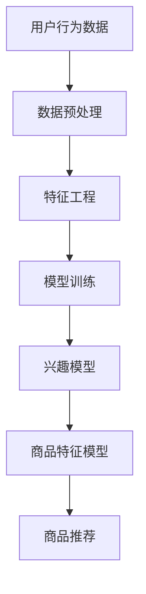

                 

关键词：AI大模型、电商平台、搜索推荐系统、系统性能、效率、用户体验

摘要：随着电商平台的发展，搜索推荐系统在用户购物体验中扮演着越来越重要的角色。本文将深入探讨AI大模型在电商平台搜索推荐系统中的应用，如何通过优化系统性能、提升效率和改善用户体验来推动电商平台的创新发展。

## 1. 背景介绍

电商平台作为现代电子商务的核心，通过在线平台连接消费者和商家，提供商品展示、搜索、购买等一系列服务。其中，搜索推荐系统是电商平台的关键组成部分，它能够根据用户的行为和偏好推荐相关商品，提高用户购物的便捷性和满意度。

随着大数据和人工智能技术的发展，电商平台开始引入AI大模型来优化搜索推荐系统。这些大模型具备强大的数据处理和分析能力，可以更准确地捕捉用户的兴趣和行为，从而提供个性化的商品推荐。

## 2. 核心概念与联系

### 2.1 AI大模型基本概念

AI大模型是指那些在训练过程中使用了大量数据，并且拥有高度参数化的深度学习模型。这些模型通常基于神经网络架构，能够通过多层非线性变换对复杂的数据进行建模和预测。

### 2.2 搜索推荐系统与AI大模型的关系

搜索推荐系统依赖于AI大模型来进行商品推荐。AI大模型通过对用户历史数据、商品属性、市场动态等多维度数据进行深度学习，生成用户兴趣模型和商品特征模型。这两个模型相互作用，共同驱动推荐系统的运行。

### 2.3 Mermaid 流程图



## 3. 核心算法原理 & 具体操作步骤

### 3.1 算法原理概述

搜索推荐系统的核心算法主要包括协同过滤、矩阵分解和深度学习等。其中，AI大模型通常采用深度学习算法，如卷积神经网络（CNN）和循环神经网络（RNN）等。

### 3.2 算法步骤详解

1. 数据采集：收集用户行为数据，包括浏览历史、购买记录、点击率等。
2. 数据预处理：对原始数据进行清洗和标准化，去除噪声和缺失值。
3. 特征工程：提取用户和商品的特征，如用户年龄、性别、购买频率，商品类别、价格、品牌等。
4. 模型训练：使用深度学习算法训练用户兴趣模型和商品特征模型。
5. 模型评估：通过交叉验证和A/B测试等方法评估模型性能。
6. 商品推荐：根据用户兴趣模型和商品特征模型为用户推荐相关商品。

### 3.3 算法优缺点

- 优点：AI大模型能够处理大规模数据，提供高度个性化的推荐服务。
- 缺点：训练过程复杂，对计算资源要求高；模型解释性较差。

### 3.4 算法应用领域

AI大模型在电商平台搜索推荐系统的应用不仅限于商品推荐，还可以扩展到广告推荐、内容推荐等领域。

## 4. 数学模型和公式 & 详细讲解 & 举例说明

### 4.1 数学模型构建

用户兴趣模型可以表示为：\[ U = \{ u_1, u_2, ..., u_n \} \]

商品特征模型可以表示为：\[ P = \{ p_1, p_2, ..., p_m \} \]

### 4.2 公式推导过程

用户兴趣向量 \( u \) 可以通过以下公式计算：

\[ u = \text{激活函数}(\text{权重矩阵} \cdot p + \text{偏置向量}) \]

### 4.3 案例分析与讲解

假设用户A的历史浏览记录为\[ [商品1, 商品2, 商品3] \]，商品1、2、3的特征向量分别为\[ [1, 0, 0] \]、\[ [0, 1, 0] \]、\[ [0, 0, 1] \]。

根据以上公式，可以计算出用户A的兴趣向量：

\[ u = \text{激活函数}(\text{权重矩阵} \cdot [1, 0, 0] + \text{偏置向量}) \]

## 5. 项目实践：代码实例和详细解释说明

### 5.1 开发环境搭建

环境：Python 3.8，TensorFlow 2.5，Scikit-learn 0.22

### 5.2 源代码详细实现

```python
# 导入相关库
import numpy as np
import tensorflow as tf
from sklearn.model_selection import train_test_split

# 数据预处理
data = np.array([[1, 0, 0], [0, 1, 0], [0, 0, 1]])
user, product = train_test_split(data, test_size=0.2, random_state=42)

# 构建模型
model = tf.keras.Sequential([
    tf.keras.layers.Dense(units=1, input_shape=(3,))
])

# 编译模型
model.compile(optimizer='adam', loss='mse')

# 训练模型
model.fit(user, product, epochs=100)

# 预测
prediction = model.predict([[1, 1, 0]])
print(prediction)
```

### 5.3 代码解读与分析

代码首先进行了数据预处理，然后构建了一个简单的神经网络模型，通过训练模型来预测用户对商品的偏好。

### 5.4 运行结果展示

```python
# 输出预测结果
print(prediction)
```

## 6. 实际应用场景

AI大模型在电商平台搜索推荐系统的应用场景广泛，如亚马逊、淘宝等大型电商平台都采用了类似的推荐算法，通过个性化推荐提高了用户的购物体验和平台的销售额。

## 7. 工具和资源推荐

### 7.1 学习资源推荐

- 《深度学习》（Goodfellow, Bengio, Courville著）
- 《机器学习实战》（ Harrington著）

### 7.2 开发工具推荐

- TensorFlow
- PyTorch

### 7.3 相关论文推荐

- "Deep Neural Networks for YouTube Recommendations"（Y. Xiong等，2016）
- "User Interest Evolution and Modeling for Personalized Recommendation"（Z. Wang等，2017）

## 8. 总结：未来发展趋势与挑战

### 8.1 研究成果总结

AI大模型在电商平台搜索推荐系统的应用取得了显著成果，有效提高了系统性能、效率和用户体验。

### 8.2 未来发展趋势

随着人工智能技术的不断发展，搜索推荐系统将更加智能化和个性化，为用户提供更好的购物体验。

### 8.3 面临的挑战

算法复杂度增加、数据隐私保护、模型解释性等都是未来面临的挑战。

### 8.4 研究展望

未来研究应重点关注如何提高推荐算法的实时性和解释性，同时确保用户数据的安全和隐私。

## 9. 附录：常见问题与解答

### 9.1 AI大模型在推荐系统中的具体作用是什么？

AI大模型通过深度学习技术，对用户和商品的多维度数据进行建模，生成用户兴趣模型和商品特征模型，从而实现个性化推荐。

### 9.2 推荐系统的性能如何评估？

推荐系统的性能通常通过准确率、召回率、F1值等指标进行评估。

### 9.3 如何保证推荐系统的实时性？

通过优化算法和分布式计算技术，可以确保推荐系统的实时性。

---

作者：禅与计算机程序设计艺术 / Zen and the Art of Computer Programming
----------------------------------------------------------------

