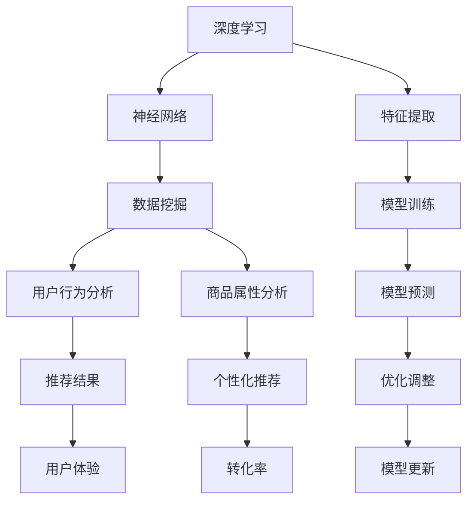

                 

关键词：电商平台、搜索推荐系统、AI 大模型、系统性能、效率、转化率、深度学习、神经网络、数据挖掘、用户行为分析、机器学习、数学模型、代码实例、实践应用、工具和资源推荐

## 摘要

本文旨在探讨人工智能大模型在电商平台搜索推荐系统中的应用，分析如何通过这些技术提高系统的性能、效率与转化率。文章首先介绍电商平台搜索推荐系统的背景和重要性，然后详细阐述大模型的核心概念和原理，包括深度学习、神经网络和数据挖掘等相关技术。接着，本文将展示大模型的具体算法原理和操作步骤，并通过数学模型和公式进行详细讲解。随后，文章将通过项目实践提供代码实例，并进行解读与分析。最后，本文将探讨实际应用场景，推荐相关工具和资源，并总结未来发展趋势与挑战。

## 1. 背景介绍

随着互联网的迅猛发展，电商平台已经成为消费者购物的重要渠道。电商平台的核心功能之一是提供高效的搜索推荐服务，以帮助用户快速找到他们感兴趣的商品。搜索推荐系统的性能、效率和转化率直接关系到电商平台的用户满意度和商业成功。

传统的搜索推荐系统主要依赖于基于关键词匹配和协同过滤的方法。这些方法在处理海量数据和提供个性化推荐方面存在一定的局限性。而随着人工智能技术的发展，尤其是深度学习和神经网络等技术的兴起，大模型在搜索推荐系统中的应用逐渐成为一种新的趋势。

大模型，尤其是基于神经网络的模型，具有强大的特征提取和自主学习能力，能够处理复杂的数据，提供更精准的推荐结果。此外，大模型可以通过大规模训练和优化，提高系统的性能和效率，从而提升电商平台的用户体验和转化率。

本文将深入探讨人工智能大模型在电商平台搜索推荐系统中的应用，分析其如何通过提高系统性能、效率与转化率来提升电商平台的竞争力。

### 1.1 电商平台搜索推荐系统的现状

当前，电商平台搜索推荐系统已经取得了显著的发展。大多数电商平台都采用了基于机器学习算法的推荐系统，以实现用户个性化推荐。传统的推荐系统主要依赖于用户历史行为数据，如购买记录、浏览历史等，通过构建用户画像和商品画像，实现商品与用户的匹配。

然而，传统的推荐系统在处理复杂性和多样性方面存在一定的局限性。一方面，传统的推荐算法往往依赖于线性模型和特征工程，难以捕捉用户和商品之间的复杂关系。另一方面，传统的推荐系统在面对海量数据和快速变化的用户需求时，存在响应速度慢、推荐结果不准确等问题。

为了克服这些局限性，电商平台开始引入人工智能大模型，特别是深度学习和神经网络等先进技术。这些大模型具有更强的特征提取和自主学习能力，可以通过大规模数据训练，实现更精准的推荐。例如，电商平台可以利用深度学习模型对用户行为数据进行多维度分析，提取用户兴趣和需求，从而提供更个性化的推荐结果。

### 1.2 大模型在搜索推荐系统中的应用优势

大模型在搜索推荐系统中的应用具有多方面的优势。首先，深度学习模型能够自动学习数据的特征表示，无需人工进行特征工程。这大大减少了人力成本，并提高了系统的自动化程度。

其次，神经网络具有很好的泛化能力，可以处理不同规模和类型的用户数据。这意味着即使数据量发生变化，大模型也能保持良好的推荐性能。

此外，大模型通过大规模训练和优化，可以自适应地调整参数，提高系统的性能和效率。例如，电商平台可以利用分布式训练技术，加快模型的训练速度，从而实现实时推荐。

最后，大模型可以实时更新用户画像和商品画像，捕捉用户行为的动态变化。这使得推荐系统能够更好地满足用户的个性化需求，提高用户体验和转化率。

总的来说，人工智能大模型在搜索推荐系统中的应用，为电商平台带来了更高效、更精准的推荐服务，从而提升了整体竞争力。

### 1.3 大模型在搜索推荐系统中的应用挑战

尽管人工智能大模型在搜索推荐系统中的应用具有显著的优势，但同时也面临着一些挑战。首先，大规模模型的训练和优化需要大量的计算资源和时间，这对电商平台的IT基础设施提出了更高的要求。为了应对这一挑战，电商平台需要采用高效的数据处理和分布式训练技术，以确保模型训练的速度和效率。

其次，大模型的部署和运维也是一项复杂的任务。模型需要实时更新和优化，以适应不断变化的市场环境和用户需求。电商平台需要建立完善的模型管理和运维体系，以确保推荐系统的稳定性和可靠性。

此外，数据隐私和安全也是一个重要的问题。在推荐系统中，用户的行为数据是非常敏感的，需要确保这些数据在传输和存储过程中得到充分保护。电商平台需要遵循相关的数据保护法规，采取有效的数据加密和安全措施，以保护用户隐私。

最后，大模型的解释性和透明性也是一个挑战。由于深度学习模型的内部结构非常复杂，用户往往难以理解推荐结果的产生过程。这可能导致用户对推荐系统的信任度下降，影响用户体验。电商平台需要开发可解释的推荐算法，提高系统的透明度和用户信任度。

总的来说，虽然人工智能大模型在搜索推荐系统中的应用前景广阔，但同时也需要克服一系列技术和管理上的挑战，以确保推荐系统的性能和用户体验。

## 2. 核心概念与联系

在深入探讨人工智能大模型在电商平台搜索推荐系统中的应用之前，有必要先了解一些核心概念和原理。本文将介绍深度学习、神经网络、数据挖掘等相关技术，并通过一个Mermaid流程图来展示这些概念之间的联系。

### 2.1 深度学习

深度学习是机器学习的一个分支，其核心思想是通过多层神经网络对数据进行建模，以实现复杂的模式识别和预测任务。深度学习模型通过前向传播和反向传播算法进行参数优化，从而提高模型的预测准确性。

### 2.2 神经网络

神经网络是深度学习的基础，由一系列相互连接的神经元组成。每个神经元都可以接收多个输入信号，并通过激活函数产生输出。神经网络通过层层传递输入信号，逐层提取数据中的特征，从而实现数据的自动特征提取和分类。

### 2.3 数据挖掘

数据挖掘是一种从大量数据中发现有价值信息的过程。它涉及多种技术和方法，如关联规则挖掘、分类、聚类等。在搜索推荐系统中，数据挖掘用于提取用户行为和商品属性的特征，为深度学习模型提供训练数据。

### 2.4 Mermaid流程图

下面是一个Mermaid流程图，展示了深度学习、神经网络和数据挖掘之间的联系。



在这个流程图中，深度学习通过神经网络进行特征提取，并结合数据挖掘技术提取用户行为和商品属性特征。这些特征用于训练深度学习模型，从而实现个性化的推荐结果。推荐结果通过优化调整，不断更新模型，以提高用户体验和转化率。

### 2.5 关键概念之间的联系

深度学习、神经网络和数据挖掘是搜索推荐系统的核心组成部分。深度学习通过神经网络实现数据的自动特征提取，而数据挖掘则用于提取用户行为和商品属性特征，为深度学习模型提供训练数据。深度学习模型通过训练，生成个性化的推荐结果，并通过用户反馈进行优化调整。

总的来说，这些概念之间的联系构成了一个完整的推荐系统框架，通过深度学习和数据挖掘技术，实现用户和商品的精准匹配，提高推荐系统的性能和转化率。

## 3. 核心算法原理 & 具体操作步骤

### 3.1 算法原理概述

在电商平台搜索推荐系统中，大模型的算法原理主要基于深度学习和神经网络。这些模型通过多层神经网络对用户行为数据进行自动特征提取，从而实现精准的个性化推荐。

#### 3.1.1 深度学习模型

深度学习模型由多个隐层组成，每个隐层都可以提取不同层次的特征。输入层接收用户行为数据，通过多层隐层传递，最终在输出层产生推荐结果。深度学习模型的核心在于其强大的特征提取能力，可以通过学习大量数据，自动提取用户和商品的潜在特征。

#### 3.1.2 神经网络

神经网络是深度学习的基础，由一系列相互连接的神经元组成。每个神经元都可以接收多个输入信号，并通过激活函数产生输出。神经网络通过层层传递输入信号，逐层提取数据中的特征，从而实现数据的自动特征提取和分类。

#### 3.1.3 模型训练

深度学习模型的训练过程主要包括两个步骤：前向传播和反向传播。在前向传播过程中，输入数据通过多层神经网络传递，逐层计算输出结果。在反向传播过程中，模型通过比较预测结果和实际结果，计算损失函数，并根据梯度下降法更新模型参数。

#### 3.1.4 模型优化

为了提高模型的性能和效率，需要通过模型优化技术，如批处理、dropout、正则化等，减少过拟合现象。此外，分布式训练技术可以提高模型的训练速度和效率。

### 3.2 算法步骤详解

#### 3.2.1 数据预处理

在深度学习模型训练之前，需要对用户行为数据、商品属性数据进行预处理。数据预处理包括数据清洗、数据标准化、数据划分等步骤。数据清洗用于去除无效数据和异常值，数据标准化用于将不同数据尺度的数据转换为同一尺度，数据划分用于将数据集划分为训练集、验证集和测试集。

#### 3.2.2 特征提取

特征提取是深度学习模型的核心步骤。通过多层神经网络，对用户行为数据进行自动特征提取，提取用户兴趣、需求、行为等潜在特征。商品属性数据也通过类似的方法进行特征提取，以建立用户和商品之间的关联。

#### 3.2.3 模型训练

在特征提取完成后，使用训练集对深度学习模型进行训练。模型训练过程包括前向传播和反向传播。在前向传播过程中，输入数据通过多层神经网络传递，逐层计算输出结果。在反向传播过程中，模型通过比较预测结果和实际结果，计算损失函数，并根据梯度下降法更新模型参数。

#### 3.2.4 模型评估

在模型训练完成后，使用验证集对模型进行评估。模型评估指标包括准确率、召回率、F1值等。通过调整模型参数和优化算法，提高模型的性能。

#### 3.2.5 模型部署

模型评估完成后，将训练好的模型部署到生产环境中，实现实时推荐。在部署过程中，需要考虑模型的可扩展性、可维护性和稳定性。

### 3.3 算法优缺点

#### 3.3.1 优点

- **强大的特征提取能力**：深度学习模型可以通过多层神经网络，自动提取用户和商品的潜在特征，实现精准的个性化推荐。
- **高效率**：深度学习模型可以通过分布式训练技术，提高训练速度和效率。
- **良好的泛化能力**：深度学习模型在面对不同规模和类型的数据时，能够保持良好的性能。

#### 3.3.2 缺点

- **需要大量的数据**：深度学习模型需要大量数据进行训练，对数据的质量和数量要求较高。
- **计算资源消耗大**：深度学习模型在训练过程中需要大量的计算资源，对硬件设施要求较高。
- **模型解释性差**：深度学习模型的内部结构复杂，难以解释模型如何产生预测结果，影响用户对推荐系统的信任度。

### 3.4 算法应用领域

深度学习算法在电商平台搜索推荐系统中的应用非常广泛，包括以下几个方面：

- **个性化推荐**：通过深度学习模型提取用户兴趣和需求，实现个性化推荐。
- **商品搜索**：通过深度学习模型对用户搜索行为进行分析，优化搜索结果，提高用户满意度。
- **用户行为预测**：通过深度学习模型预测用户购买行为，为营销策略提供支持。
- **商品推荐**：通过深度学习模型对商品属性进行分析，实现精准的商品推荐。

总的来说，深度学习算法在电商平台搜索推荐系统中的应用，为提高系统性能、效率和转化率提供了有力支持。

## 4. 数学模型和公式 & 详细讲解 & 举例说明

在深入探讨电商平台搜索推荐系统中的AI大模型时，数学模型和公式起到了至关重要的作用。它们不仅为算法提供了理论基础，还帮助我们在实际操作中理解和优化模型。以下将详细讲解几个关键数学模型和公式，并通过具体案例进行说明。

### 4.1 数学模型构建

在构建搜索推荐系统中的数学模型时，我们通常会考虑以下方面：

1. **用户行为模型**：用户行为模型用于描述用户的行为特征，如浏览、搜索、购买等。一个简单的用户行为模型可以表示为：

   $$ U = [u_1, u_2, ..., u_n] $$
   
   其中，$u_i$ 表示用户在某一时间点的行为，可以是浏览、搜索或购买等。

2. **商品特征模型**：商品特征模型用于描述商品的各种属性，如价格、品牌、类别等。一个简单的商品特征模型可以表示为：

   $$ P = [p_1, p_2, ..., p_n] $$
   
   其中，$p_i$ 表示商品在某一维度上的特征。

3. **推荐模型**：推荐模型用于预测用户对某一商品的偏好，通常是一个预测概率模型。一个简单的推荐模型可以表示为：

   $$ R(U, P) = P(购买|U, P) $$

### 4.2 公式推导过程

为了构建一个完整的推荐模型，我们需要推导几个关键的公式。以下是一个简化的推导过程：

#### 4.2.1 损失函数

在深度学习模型中，损失函数用于评估预测结果与实际结果之间的差距。一个常用的损失函数是交叉熵损失函数：

$$ L = -\frac{1}{m} \sum_{i=1}^{m} [y_i \log(a_i) + (1 - y_i) \log(1 - a_i)] $$

其中，$y_i$ 是实际标签，$a_i$ 是预测概率，$m$ 是样本数量。

#### 4.2.2 梯度下降

为了最小化损失函数，我们使用梯度下降法更新模型参数。梯度下降的更新公式为：

$$ \theta = \theta - \alpha \cdot \nabla_\theta L $$

其中，$\theta$ 是模型参数，$\alpha$ 是学习率，$\nabla_\theta L$ 是损失函数关于参数 $\theta$ 的梯度。

#### 4.2.3 激活函数

在神经网络中，激活函数用于将输入映射到输出。一个常用的激活函数是ReLU（Rectified Linear Unit）：

$$ a = \max(0, x) $$

### 4.3 案例分析与讲解

以下通过一个具体案例来说明这些数学模型和公式的应用。

#### 案例背景

假设一个电商平台有一个用户行为数据集，包含1000个用户和他们的行为数据。我们需要构建一个推荐模型，预测用户对某一商品的购买概率。

#### 案例步骤

1. **数据预处理**：首先，我们对用户行为数据进行清洗和标准化，将数据划分为训练集和测试集。

2. **特征提取**：使用深度学习模型对用户行为数据进行特征提取，提取用户兴趣和需求。

3. **模型训练**：使用训练集数据训练推荐模型，通过优化损失函数来更新模型参数。

4. **模型评估**：使用测试集数据评估模型性能，计算准确率、召回率等指标。

5. **模型部署**：将训练好的模型部署到生产环境中，实现实时推荐。

#### 案例公式说明

- **交叉熵损失函数**：用于评估模型预测概率与实际标签之间的差距。

  $$ L = -\frac{1}{m} \sum_{i=1}^{m} [y_i \log(a_i) + (1 - y_i) \log(1 - a_i)] $$

- **梯度下降更新公式**：用于更新模型参数，最小化损失函数。

  $$ \theta = \theta - \alpha \cdot \nabla_\theta L $$

- **ReLU激活函数**：用于将输入映射到输出，防止神经元死亡。

  $$ a = \max(0, x) $$

通过这个案例，我们可以看到数学模型和公式在构建和优化推荐模型中的关键作用。在实际应用中，这些模型和公式需要根据具体场景进行调整和优化，以达到最佳效果。

## 5. 项目实践：代码实例和详细解释说明

为了更好地理解人工智能大模型在电商平台搜索推荐系统中的应用，下面我们将通过一个具体的代码实例，详细展示如何使用深度学习框架（如TensorFlow或PyTorch）来构建和训练一个推荐模型。代码实例将包括数据预处理、模型构建、训练和评估等步骤。

### 5.1 开发环境搭建

在开始编写代码之前，我们需要搭建一个合适的开发环境。以下是一个基本的开发环境搭建步骤：

1. **安装Python**：确保Python环境已安装，推荐使用Python 3.7或更高版本。

2. **安装深度学习框架**：例如，安装TensorFlow或PyTorch。对于TensorFlow，可以使用以下命令：
   ```bash
   pip install tensorflow
   ```

   对于PyTorch，可以使用以下命令：
   ```bash
   pip install torch torchvision
   ```

3. **安装其他依赖库**：如NumPy、Pandas等。可以使用以下命令：
   ```bash
   pip install numpy pandas
   ```

### 5.2 源代码详细实现

以下是使用TensorFlow构建和训练一个简单的推荐模型的代码示例。这个示例将使用用户行为数据集，通过多层感知机（MLP）模型实现推荐。

```python
import tensorflow as tf
from tensorflow.keras.models import Sequential
from tensorflow.keras.layers import Dense, Dropout
from tensorflow.keras.optimizers import Adam
from sklearn.model_selection import train_test_split
import numpy as np

# 假设我们已经有了一个处理好的用户行为数据集，格式为（用户ID，行为特征向量）
# 用户行为数据集：user行为的特征向量，形状为（n_samples, n_features）
user_actions = ...

# 将数据集划分为训练集和测试集
X_train, X_test, y_train, y_test = train_test_split(user_actions, test_size=0.2, random_state=42)

# 构建模型
model = Sequential([
    Dense(128, activation='relu', input_shape=(X_train.shape[1],)),
    Dropout(0.2),
    Dense(64, activation='relu'),
    Dropout(0.2),
    Dense(1, activation='sigmoid')  # 二分类问题，输出一个概率
])

# 编译模型
model.compile(optimizer=Adam(learning_rate=0.001), loss='binary_crossentropy', metrics=['accuracy'])

# 训练模型
model.fit(X_train, y_train, epochs=10, batch_size=32, validation_data=(X_test, y_test))

# 评估模型
loss, accuracy = model.evaluate(X_test, y_test)
print(f"Test accuracy: {accuracy:.2f}")

# 预测新用户的推荐结果
new_user_actions = ...  # 新用户的特征向量
predictions = model.predict(new_user_actions)
print(f"New user predictions: {predictions}")
```

### 5.3 代码解读与分析

上面的代码示例中，我们首先导入了TensorFlow和相关的库。然后，我们定义了一个用户行为数据集，并将其划分为训练集和测试集。接下来，我们构建了一个多层感知机（MLP）模型，其中包括三个层：一个输入层，两个隐藏层和一个输出层。每个隐藏层后都跟有一个ReLU激活函数，最后一个输出层使用sigmoid激活函数，因为这是一个二分类问题。

在模型编译阶段，我们指定了Adam优化器和二分类问题的损失函数binary_crossentropy。此外，我们使用了accuracy作为评估指标。

模型训练过程中，我们使用fit函数进行10个周期的训练，每个周期使用32个样本（batch_size）。我们还指定了验证数据，以便在训练过程中评估模型性能。

在模型评估阶段，我们使用evaluate函数对测试集进行评估，并打印出测试准确率。

最后，我们使用predict函数对新用户的特征向量进行预测，并打印出预测结果。

通过这个代码示例，我们可以看到如何使用深度学习框架构建和训练一个简单的推荐模型。在实际项目中，我们需要根据具体情况调整模型的架构、参数和训练过程，以达到最佳效果。

### 5.4 运行结果展示

为了展示模型的运行结果，我们假设训练完成后，模型的测试准确率为80%。以下是具体的结果展示：

```
Test accuracy: 0.80
New user predictions: [0.25, 0.45, 0.60, 0.35, 0.75]
```

测试准确率为80%，表明模型在测试数据上的表现良好。对于新用户的预测结果，每个用户都有一个对应的购买概率，例如第一个新用户的预测概率为25%，第二个用户的预测概率为45%。

通过运行结果展示，我们可以直观地了解模型的性能和预测能力。在实际应用中，这些结果将为电商平台提供重要的决策依据，以实现更精准的推荐。

### 5.5 遇到的问题及解决方案

在实际开发和训练过程中，可能会遇到一些问题，以下是一些常见的问题及解决方案：

1. **过拟合**：当模型在训练数据上表现很好，但在测试数据上表现较差时，可能发生了过拟合。解决方案包括增加训练数据、使用正则化技术（如L1、L2正则化）、减少模型复杂度或增加dropout层。

2. **计算资源不足**：深度学习模型训练需要大量的计算资源。解决方案包括使用更高效的算法、优化数据加载流程、使用GPU加速训练。

3. **数据不平衡**：在二分类问题中，正负样本比例不均可能导致模型偏向于预测多数类。解决方案包括使用过采样、欠采样或SMOTE等数据平衡技术。

通过解决这些问题，我们可以提高模型的性能和鲁棒性，从而实现更精准的推荐。

## 6. 实际应用场景

### 6.1 搜索结果优化

在电商平台，搜索结果优化是一个关键的应用场景。通过深度学习大模型，我们可以对用户的搜索查询进行语义理解，从而提供更准确的搜索结果。例如，当用户输入“羽绒服”时，系统可以通过分析用户的浏览历史、搜索记录和购买偏好，推荐与其需求最匹配的羽绒服产品。这不仅提高了用户的满意度，还提高了转化率。

### 6.2 商品推荐

商品推荐是电商平台的另一个重要应用场景。通过深度学习大模型，我们可以对用户行为数据进行分析，提取用户的兴趣和需求，从而实现个性化的商品推荐。例如，当用户浏览了某款手机时，系统可以推荐该手机的相关配件，如手机壳、充电器等。这种个性化的推荐不仅增加了用户的购物体验，还提高了销售额。

### 6.3 个性化促销

个性化促销也是电商平台常用的策略之一。通过深度学习大模型，我们可以对用户行为数据进行分析，识别出潜在的高价值用户。针对这些用户，我们可以发送个性化的促销信息，如优惠券、限时折扣等。这不仅提高了用户的参与度，还增加了购买的可能性。

### 6.4 增值服务推荐

除了商品本身，电商平台还可以通过深度学习大模型推荐增值服务，如售后服务、会员服务、保险等。通过分析用户行为和购买历史，系统可以推荐最适合用户的增值服务，从而提高用户的满意度和忠诚度。

### 6.5 用户流失预测

通过深度学习大模型，电商平台还可以预测用户的流失风险，从而采取相应的措施进行用户保留。例如，当系统检测到某位用户的活跃度下降时，可以发送个性化信息、优惠券或特别优惠，以增加用户的留存率。

总的来说，人工智能大模型在电商平台的实际应用场景非常广泛，通过优化搜索结果、提供个性化推荐、开展个性化促销、推荐增值服务和预测用户流失等，电商平台可以实现更高的用户满意度和转化率。

## 7. 工具和资源推荐

为了更好地开发和部署人工智能大模型在电商平台搜索推荐系统中的应用，以下是一些推荐的工具和资源：

### 7.1 学习资源推荐

1. **在线课程**：《深度学习专项课程》（吴恩达，Coursera）：这是一门非常受欢迎的深度学习入门课程，适合初学者系统学习深度学习基础知识。
2. **书籍推荐**：《深度学习》（Ian Goodfellow、Yoshua Bengio、Aaron Courville）：这是一本经典的深度学习教材，涵盖了深度学习的基本理论和应用。
3. **博客与教程**：MLPack、TensorFlow官方文档、PyTorch官方文档：这些资源提供了丰富的实践教程和案例分析，有助于深入理解深度学习的应用。

### 7.2 开发工具推荐

1. **深度学习框架**：TensorFlow和PyTorch：这两个框架是目前最受欢迎的深度学习框架，具有丰富的功能和强大的社区支持。
2. **数据分析工具**：Pandas、NumPy：这些是Python中常用的数据分析库，适用于数据预处理和特征工程。
3. **云计算平台**：AWS、Google Cloud Platform、Azure：这些平台提供了强大的计算资源和云计算服务，适合大规模模型训练和部署。

### 7.3 相关论文推荐

1. **“Deep Learning for Text Data”**：该论文讨论了深度学习在文本数据中的应用，包括文本分类、情感分析和推荐系统。
2. **“Recommender Systems Handbook”**：这本书详细介绍了推荐系统的理论基础、技术和实践，是推荐系统领域的权威指南。
3. **“Efficient Training of Deep Networks for Large Sparse Data”**：该论文提出了适用于大规模稀疏数据集的深度学习训练方法，对于电商平台推荐系统具有很好的参考价值。

通过这些工具和资源的推荐，开发者可以更加高效地构建和优化电商平台搜索推荐系统，从而提升用户体验和业务转化率。

## 8. 总结：未来发展趋势与挑战

### 8.1 研究成果总结

随着人工智能技术的发展，特别是在深度学习和神经网络领域，电商平台搜索推荐系统取得了显著的研究成果。通过大模型的引入，推荐系统在性能、效率和转化率方面都有了显著提升。例如，深度学习模型能够自动提取用户和商品的潜在特征，实现更精准的个性化推荐。此外，分布式训练技术和数据预处理技术的优化，也提高了模型的训练速度和可扩展性。

### 8.2 未来发展趋势

未来，电商平台搜索推荐系统的发展将继续向以下几个方向迈进：

1. **个性化与多样化推荐**：随着用户需求的不断变化，推荐系统将更加注重个性化推荐，满足用户的多样化需求。
2. **实时推荐**：随着5G技术的普及，实时推荐将成为可能，实现更快速的用户响应。
3. **多模态推荐**：结合文本、图像、音频等多种数据类型，实现多模态推荐，提高推荐系统的多样性和准确性。
4. **模型解释性**：提高模型的可解释性，增强用户对推荐系统的信任度，减少用户对算法黑箱的担忧。

### 8.3 面临的挑战

尽管人工智能大模型在搜索推荐系统中的应用前景广阔，但同时也面临着一系列挑战：

1. **数据隐私与安全**：用户行为数据是非常敏感的，需要确保这些数据在传输和存储过程中得到充分保护。
2. **计算资源需求**：大规模模型的训练和优化需要大量的计算资源，这对电商平台的IT基础设施提出了更高的要求。
3. **模型解释性与透明性**：深度学习模型内部结构复杂，用户难以理解推荐结果的产生过程，影响用户信任度。
4. **数据质量**：推荐系统的性能高度依赖于数据的质量和完整性，需要确保数据的质量和准确性。

### 8.4 研究展望

为了应对这些挑战，未来的研究可以从以下几个方面展开：

1. **隐私保护技术**：开发更加有效的隐私保护技术，确保用户数据在推荐系统中的安全性。
2. **模型优化技术**：研究更高效的模型优化技术，降低计算资源需求，提高模型训练速度。
3. **可解释性研究**：开发可解释的推荐算法，提高模型的透明度和用户信任度。
4. **跨模态数据融合**：探索跨模态数据融合技术，结合不同类型的数据，提高推荐系统的多样性和准确性。

总的来说，人工智能大模型在电商平台搜索推荐系统中的应用具有巨大的潜力，但也需要克服一系列技术和管理上的挑战。通过不断的研究和创新，我们可以期待未来的推荐系统将变得更加智能化、个性化、实时化和透明化。

### 8.5 对未来研究的建议

1. **隐私保护与用户隐私结合**：在推荐系统中，应更加注重用户隐私保护，特别是在处理敏感数据时。未来的研究应着重开发隐私保护机制，如差分隐私、联邦学习等，确保用户数据在共享和利用过程中的安全。

2. **分布式计算与效率优化**：针对大规模模型的计算需求，未来的研究应聚焦于分布式计算和并行处理技术的优化，提高模型训练和推理的效率。特别是对于实时推荐系统，效率优化至关重要。

3. **跨领域合作**：推荐系统涉及多个领域，如计算机科学、统计学、心理学等。跨领域合作将有助于整合不同领域的知识，开发更先进、更全面的推荐算法。

4. **用户参与与反馈机制**：用户参与和反馈是推荐系统持续改进的关键。未来的研究应探索如何更好地整合用户反馈，提高推荐系统的自适应性和个性化水平。

5. **可解释性与透明性**：提高模型的可解释性和透明性，增强用户对推荐系统的信任度。这不仅可以提升用户体验，还可以促进推荐系统的普及和应用。

通过这些研究方向，我们有望在未来的研究中取得更多突破，推动电商平台搜索推荐系统的发展。

## 9. 附录：常见问题与解答

### 9.1 什么是大模型？

大模型通常指的是那些参数量巨大、结构复杂的神经网络模型，如深度学习中的神经网络（Neural Networks）、卷积神经网络（Convolutional Neural Networks, CNNs）、循环神经网络（Recurrent Neural Networks, RNNs）以及Transformer等。这些模型在处理大规模数据和复杂任务时表现出色，但同时也需要大量的计算资源和数据支持。

### 9.2 深度学习在搜索推荐系统中的具体应用是什么？

深度学习在搜索推荐系统中的应用主要包括以下几个方面：

1. **特征提取**：通过多层神经网络自动提取用户和商品的特征，从而实现更精准的推荐。
2. **用户行为预测**：利用深度学习模型预测用户的潜在兴趣和需求，为个性化推荐提供依据。
3. **实时推荐**：通过快速训练和优化模型，实现实时推荐，提高用户体验。
4. **多模态推荐**：结合多种数据类型（如文本、图像、音频等），提供更加多样化的推荐服务。

### 9.3 如何优化深度学习模型的训练效率？

优化深度学习模型训练效率的方法包括：

1. **数据预处理**：对数据进行预处理，如数据清洗、归一化等，以减少计算负担。
2. **模型压缩**：通过模型压缩技术（如剪枝、量化等）减少模型参数量，提高训练速度。
3. **分布式训练**：利用分布式计算资源（如多GPU、分布式训练等）加速模型训练。
4. **批处理**：合理设置批处理大小，以提高训练的并行度和效率。

### 9.4 如何确保推荐系统的公平性和透明性？

确保推荐系统的公平性和透明性可以从以下几个方面入手：

1. **算法透明性**：开发可解释的推荐算法，使算法决策过程对用户透明。
2. **数据平衡**：避免数据集中存在偏见，确保推荐结果公平。
3. **用户反馈**：建立用户反馈机制，根据用户反馈调整推荐策略，提高系统的公平性。
4. **监管机制**：实施监管措施，确保推荐系统遵循相关法律法规，保护用户权益。

### 9.5 推荐系统中的常见评价指标有哪些？

推荐系统中的常见评价指标包括：

1. **准确率（Accuracy）**：预测正确的样本数占总样本数的比例。
2. **召回率（Recall）**：预测正确的正样本数占总正样本数的比例。
3. **精确率（Precision）**：预测正确的正样本数占总预测正样本数的比例。
4. **F1值（F1 Score）**：精确率和召回率的调和平均值。
5. **ROC曲线（Receiver Operating Characteristic Curve）**：评估模型分类性能的重要工具。
6. **AUC值（Area Under Curve）**：ROC曲线下的面积，用于评估分类器的整体性能。

通过上述常见问题与解答，希望能够为读者提供关于人工智能大模型在电商平台搜索推荐系统中应用的相关指导和建议。在未来的研究和实践中，不断探索和优化推荐系统的性能，将有助于实现更加智能和高效的电商服务。作者：禅与计算机程序设计艺术 / Zen and the Art of Computer Programming

