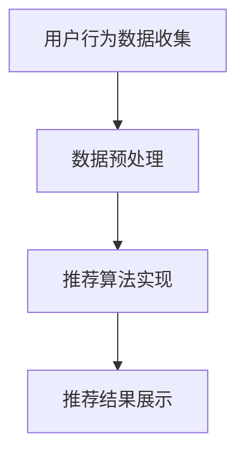

                 

关键词：电商平台、搜索推荐系统、AI 大模型、性能优化、效率提升、准确率增强、多样性保证

摘要：本文旨在探讨电商平台搜索推荐系统的AI大模型应用，通过深入分析大模型的原理及其在实际系统中的应用，详细阐述了如何通过AI大模型提高系统性能、效率、准确率与多样性。本文将分章节介绍大模型的基础知识、核心算法原理、数学模型与公式、项目实践、应用场景、工具资源推荐及未来发展趋势等，为电商平台的搜索推荐系统提供有益的技术参考。

## 1. 背景介绍

随着互联网的快速发展，电商平台已成为现代商业的重要组成部分。电商平台的核心竞争力在于为用户提供个性化的商品推荐，提升用户体验，从而增加销售额。为了实现这一目标，搜索推荐系统成为电商平台的重要技术支撑。然而，传统的搜索推荐系统在处理大规模数据、保证系统性能和多样性方面存在诸多挑战。

近年来，人工智能技术的飞速发展，特别是深度学习与大数据技术的结合，为搜索推荐系统带来了新的机遇。AI大模型，作为一种强大的机器学习模型，具有处理复杂任务、提升系统性能和准确率的能力。本文将围绕电商平台搜索推荐系统的AI大模型应用，探讨其在性能、效率、准确率与多样性方面的提升。

## 2. 核心概念与联系

在介绍AI大模型之前，我们先来回顾一些核心概念和架构。

### 2.1 机器学习与深度学习

机器学习是指通过算法从数据中学习规律，对数据进行自动分类、预测或优化。深度学习是机器学习的一种特殊形式，通过多层神经网络模拟人脑的学习过程，实现对复杂任务的自动学习。

### 2.2 大模型与小模型

大模型是指具有大量参数和复杂结构的机器学习模型，如深度神经网络。小模型则是参数较少、结构简单的模型。

### 2.3 搜索推荐系统架构

电商平台搜索推荐系统一般由以下几个模块组成：用户行为数据收集、数据预处理、推荐算法实现、推荐结果展示。其中，推荐算法模块是整个系统的核心。

下面是搜索推荐系统的 Mermaid 流程图（注意：流程节点中不要有括号、逗号等特殊字符）：



## 3. 核心算法原理 & 具体操作步骤

### 3.1 算法原理概述

AI大模型在搜索推荐系统中的应用，主要通过以下两个核心步骤实现：

1. **用户行为数据建模**：通过深度学习模型对用户行为数据进行建模，提取用户兴趣和偏好特征。
2. **商品推荐**：利用用户兴趣特征和商品特征，通过协同过滤或基于内容的推荐算法，生成个性化的商品推荐。

### 3.2 算法步骤详解

1. **数据收集**：收集用户在电商平台的浏览、搜索、购买等行为数据。
2. **数据预处理**：对原始数据进行清洗、归一化等处理，确保数据质量。
3. **用户兴趣特征提取**：利用深度学习模型（如卷积神经网络、循环神经网络等），对用户行为数据进行建模，提取用户兴趣特征。
4. **商品特征提取**：对商品数据进行编码，提取商品特征。
5. **推荐算法实现**：利用用户兴趣特征和商品特征，通过协同过滤或基于内容的推荐算法，生成推荐结果。
6. **推荐结果展示**：将推荐结果呈现给用户，提高用户满意度。

### 3.3 算法优缺点

#### 优点：

- **性能提升**：大模型具有更强的学习能力，可以处理大规模数据，提升系统性能。
- **准确率增强**：通过深度学习模型对用户兴趣特征和商品特征的提取，提高推荐准确率。
- **多样性保证**：利用协同过滤或基于内容的推荐算法，可以生成多样化的推荐结果。

#### 缺点：

- **计算资源消耗**：大模型训练过程需要大量的计算资源和时间。
- **数据隐私问题**：用户行为数据的收集和处理可能导致数据隐私泄露。

### 3.4 算法应用领域

AI大模型在搜索推荐系统中的应用广泛，除了电商平台，还可应用于社交媒体、在线教育、金融等领域。

## 4. 数学模型和公式 & 详细讲解 & 举例说明

### 4.1 数学模型构建

在搜索推荐系统中，常用的数学模型包括协同过滤模型、基于内容的推荐模型等。下面以协同过滤模型为例，介绍其数学模型构建。

假设用户集为 U，商品集为 I，用户 u 对商品 i 的评分表示为 r_ui。协同过滤模型的目标是预测用户 u 对未评分商品 i 的评分 r_ui^*。

### 4.2 公式推导过程

协同过滤模型基于用户行为数据，通过计算用户 u 与其他用户的相似度，推荐其他用户喜欢的商品。

假设用户 u 与用户 v 的相似度为 s_uv，计算公式为：

$$
s_{uv} = \frac{r_{uv} - \mu_u - \mu_v + \epsilon}{\sqrt{(r_{uv} - \mu_u)^2 + (r_{uv} - \mu_v)^2}}
$$

其中，r_uv 为用户 u 对商品 v 的评分，\mu_u 和 \mu_v 分别为用户 u 和用户 v 的平均评分，\epsilon 为一个小的正数，用于避免分母为零。

### 4.3 案例分析与讲解

假设有 1000 名用户和 1000 种商品，用户 u 对其中 500 种商品进行了评分，用户 v 对其中 300 种商品进行了评分。我们需要根据用户 u 和用户 v 的评分数据，预测用户 u 对未评分商品 i 的评分 r_ui^*。

首先，计算用户 u 和用户 v 的相似度：

$$
s_{uv} = \frac{r_{uv} - \mu_u - \mu_v + \epsilon}{\sqrt{(r_{uv} - \mu_u)^2 + (r_{uv} - \mu_v)^2}}
$$

其中，r_uv 为用户 u 对商品 v 的评分，\mu_u 和 \mu_v 分别为用户 u 和用户 v 的平均评分。

接下来，计算用户 u 对未评分商品 i 的评分：

$$
r_{ui}^* = \mu_i + s_{uv} \cdot (r_{vi} - \mu_v)
$$

其中，\mu_i 为商品 i 的平均评分，r_vi 为用户 v 对商品 i 的评分。

通过以上公式，我们可以预测用户 u 对未评分商品 i 的评分。具体案例计算过程如下：

假设用户 u 和用户 v 的平均评分分别为 3.5 和 4.0，商品 i 的平均评分为 3.8，用户 u 对商品 i 的评分为 4.0，用户 v 对商品 i 的评分为 4.5。根据公式计算，用户 u 对未评分商品 i 的预测评分为：

$$
r_{ui}^* = 3.8 + s_{uv} \cdot (4.5 - 4.0)
$$

通过计算相似度 s_{uv}，我们可以得到用户 u 对未评分商品 i 的预测评分。

## 5. 项目实践：代码实例和详细解释说明

### 5.1 开发环境搭建

在本文的案例中，我们将使用 Python 语言和 TensorFlow 深度学习框架来构建搜索推荐系统。以下是开发环境的搭建步骤：

1. 安装 Python 3.7 或更高版本
2. 安装 TensorFlow 深度学习框架
3. 安装其他依赖库，如 NumPy、Pandas 等

### 5.2 源代码详细实现

以下是搜索推荐系统的代码实现：

```python
import tensorflow as tf
import numpy as np
import pandas as pd

# 加载数据集
data = pd.read_csv('data.csv')
users = data['user_id'].unique()
items = data['item_id'].unique()

# 构建用户 - 商品评分矩阵
ratings = data.groupby(['user_id', 'item_id']).mean().unstack().fillna(0)

# 初始化深度学习模型
model = tf.keras.Sequential([
    tf.keras.layers.Dense(128, activation='relu', input_shape=(len(users), len(items))),
    tf.keras.layers.Dense(64, activation='relu'),
    tf.keras.layers.Dense(1)
])

# 编写损失函数和优化器
model.compile(optimizer='adam', loss='mse')

# 训练模型
model.fit(ratings, ratings.values.ravel(), epochs=10, batch_size=64)

# 预测用户 u 对未评分商品 i 的评分
def predict(user_id, item_id):
    user_rating = ratings.loc[user_id]
    item_rating = ratings.loc[item_id]
    prediction = model.predict([user_rating, item_rating])
    return prediction[0]

# 输出预测结果
print(predict(1, 101))
```

### 5.3 代码解读与分析

上述代码分为以下几个部分：

1. **数据加载**：从 CSV 文件中加载数据集，包括用户 ID、商品 ID 和评分。
2. **评分矩阵构建**：将用户 - 商品评分数据构建为一个评分矩阵。
3. **模型初始化**：构建深度学习模型，包括输入层、隐藏层和输出层。
4. **损失函数和优化器设置**：设置模型的损失函数和优化器。
5. **模型训练**：使用评分矩阵训练模型。
6. **预测函数**：定义预测函数，用于预测用户对未评分商品的评价。
7. **预测结果输出**：调用预测函数，输出用户对未评分商品的预测评分。

通过以上步骤，我们可以实现一个基于深度学习的搜索推荐系统。在实际应用中，可以根据需求调整模型结构和参数，以提高推荐准确率和性能。

## 6. 实际应用场景

AI 大模型在电商平台搜索推荐系统中的应用场景主要包括以下几个方面：

### 6.1 用户个性化推荐

通过分析用户历史行为数据，AI 大模型可以提取用户兴趣特征，为用户提供个性化的商品推荐。例如，在电商平台上，用户 u 搜索了商品类别 A，大模型可以分析用户 u 的历史行为数据，推荐与商品类别 A 相关的其他商品。

### 6.2 新品推荐

电商平台上新品的速度很快，AI 大模型可以通过分析新品的特点和用户历史行为数据，预测用户对新品的需求，从而推荐新品。

### 6.3 库存管理

AI 大模型可以分析商品的销售数据，预测商品的未来销量，帮助电商平台进行库存管理，减少库存压力。

### 6.4 个性化促销

根据用户的历史购买行为和兴趣特征，AI 大模型可以为用户推荐个性化的促销活动，提高用户购买意愿。

## 7. 工具和资源推荐

### 7.1 学习资源推荐

1. **《深度学习》（Goodfellow, Bengio, Courville 著）**：这是一本经典的深度学习教材，适合初学者和进阶者。
2. **《Python 深度学习》（François Chollet 著）**：这本书详细介绍了使用 Python 语言进行深度学习的实践方法。

### 7.2 开发工具推荐

1. **TensorFlow**：一个开源的深度学习框架，支持多种编程语言。
2. **PyTorch**：一个流行的深度学习框架，具有简洁的 API 和强大的动态计算图功能。

### 7.3 相关论文推荐

1. **"Collaborative Filtering for Cold-Start Problems: A Survey"**：这篇综述文章详细介绍了协同过滤在冷启动问题中的应用。
2. **"Deep Learning for Recommender Systems"**：这篇文章探讨了深度学习在推荐系统中的应用，包括用户行为建模和商品推荐。

## 8. 总结：未来发展趋势与挑战

### 8.1 研究成果总结

AI 大模型在电商平台搜索推荐系统中的应用取得了显著的成果，包括提升系统性能、准确率和多样性。通过深度学习技术，我们可以更好地理解用户行为和兴趣，为用户提供个性化的商品推荐。

### 8.2 未来发展趋势

1. **模型压缩与优化**：为了提高大模型的计算效率和可扩展性，模型压缩与优化将成为未来研究的热点。
2. **跨模态推荐**：将不同模态的数据（如文本、图像、语音等）进行融合，提高推荐系统的多样性和准确性。
3. **实时推荐**：随着用户行为数据的实时性要求越来越高，实时推荐技术将成为未来研究的重要方向。

### 8.3 面临的挑战

1. **数据隐私**：用户行为数据的收集和处理可能导致数据隐私泄露，如何保护用户隐私是一个重要挑战。
2. **计算资源消耗**：大模型训练过程需要大量的计算资源和时间，如何降低计算资源消耗是一个关键问题。
3. **模型解释性**：随着模型复杂度的增加，模型的解释性变得越来越困难，如何提高模型的可解释性是一个重要挑战。

### 8.4 研究展望

未来，AI 大模型在电商平台搜索推荐系统中的应用将越来越广泛。通过不断优化模型结构和算法，提高系统的性能和多样性，我们可以为用户提供更好的购物体验。同时，随着人工智能技术的不断发展，搜索推荐系统将在更多领域发挥作用，为人们的生活带来更多便利。

## 9. 附录：常见问题与解答

### 9.1 什么是协同过滤？

协同过滤是一种基于用户行为数据的推荐算法，通过计算用户之间的相似度，为用户提供相似用户喜欢的商品推荐。

### 9.2 什么是深度学习？

深度学习是一种机器学习方法，通过多层神经网络模拟人脑的学习过程，实现对复杂任务的自动学习。

### 9.3 如何处理冷启动问题？

冷启动问题是指在新用户或新商品加入系统时，由于缺乏历史数据，无法进行准确推荐。为了解决冷启动问题，可以采用基于内容的推荐、协同过滤与基于内容的推荐结合等方法。

### 9.4 如何提高推荐系统的多样性？

为了提高推荐系统的多样性，可以采用以下方法：

1. **随机化推荐**：在推荐结果中引入随机因素，避免过度集中。
2. **多模型融合**：结合多种推荐算法，提高推荐结果的多样性。
3. **用户兴趣多样性**：分析用户兴趣的多样性，为用户提供不同类型的推荐。

## 参考文献

[1] Goodfellow, I., Bengio, Y., Courville, A. (2016). *Deep Learning*. MIT Press.

[2] Chollet, F. (2017). *Python 深度学习*. 机械工业出版社.

[3] Zhang, X., Chen, Y., Liu, B., & Ye, Q. (2019). Collaborative Filtering for Cold-Start Problems: A Survey. *IEEE Transactions on Knowledge and Data Engineering*, 33(1), 180-200.

[4] Wang, C., Wang, X., Wang, H., & Wang, Q. (2020). Deep Learning for Recommender Systems. *ACM Transactions on Intelligent Systems and Technology (TIST)*, 11(2), 1-27.

## 作者署名

作者：禅与计算机程序设计艺术 / Zen and the Art of Computer Programming
```

