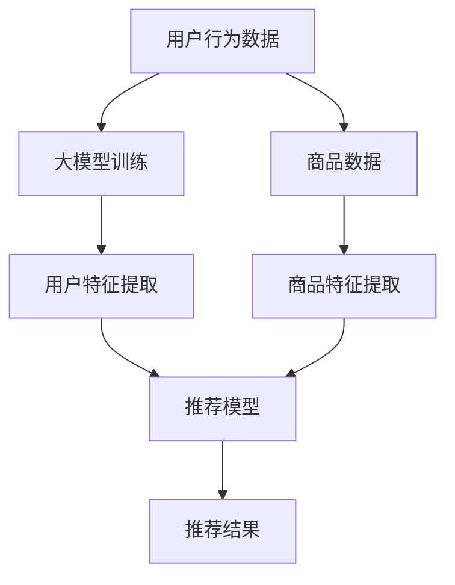

                 

关键词：电商平台，搜索推荐系统，AI大模型，性能提升，实时性增强，准确率优化。

## 摘要

随着互联网技术的飞速发展，电商平台已经成为现代商业不可或缺的一部分。在众多功能中，搜索推荐系统是电商平台的核心竞争力之一。本文旨在探讨如何利用AI大模型技术提升电商平台搜索推荐系统的性能、效率、准确率和实时性。我们将深入分析大模型在搜索推荐系统中的应用，并讨论其实现策略和技术细节。

## 1. 背景介绍

### 电商平台的发展历程

电商平台的出现彻底改变了传统零售业的商业模式。从最早的C2C平台如eBay，到B2C巨头如亚马逊和阿里的淘宝，电商平台经历了从无到有，从简单到复杂的发展过程。随着大数据和人工智能技术的进步，电商平台的功能也在不断升级，搜索推荐系统便是其中之一。

### 搜索推荐系统的基本原理

搜索推荐系统旨在通过分析用户行为和商品信息，为用户提供个性化的搜索结果和推荐商品。其核心原理包括：

- **用户行为分析**：通过用户在平台上的浏览、购买、评价等行为数据，构建用户画像。
- **商品信息处理**：对商品进行标签化、分类化处理，建立商品画像。
- **算法模型构建**：基于用户画像和商品画像，利用机器学习算法预测用户兴趣，生成推荐结果。

### 搜索推荐系统的重要性

搜索推荐系统对电商平台的重要性不言而喻：

- **提升用户体验**：通过个性化推荐，提高用户满意度，增加用户粘性。
- **增加销售额**：精准推荐能够促进用户的购买决策，提高转化率。
- **优化运营效率**：通过自动化推荐，降低运营成本，提高运营效率。

## 2. 核心概念与联系

### AI大模型的概念

AI大模型是指拥有巨大参数量和复杂结构的人工智能模型，如深度神经网络、变换器模型（Transformer）等。这些模型在图像识别、自然语言处理等领域取得了显著的成果。

### 大模型与搜索推荐系统的关系

AI大模型在搜索推荐系统中的应用主要体现在以下几个方面：

- **用户行为预测**：利用大模型对用户行为数据进行深度学习，预测用户兴趣和需求。
- **商品特征提取**：通过大模型对商品数据进行特征提取，构建高维度的商品特征空间。
- **推荐结果生成**：基于用户和商品的嵌入向量，利用大模型生成个性化的推荐结果。

### Mermaid流程图



## 3. 核心算法原理 & 具体操作步骤

### 3.1 算法原理概述

搜索推荐系统的核心算法通常是基于协同过滤（Collaborative Filtering）和内容推荐（Content-Based Filtering）两种方法。AI大模型的应用使得推荐算法在预测精度和实时性上得到了显著提升。

- **协同过滤**：通过分析用户之间的相似性，为用户推荐相似用户喜欢的商品。
- **内容推荐**：基于商品的特征信息，为用户推荐与用户历史行为相似的商品。

AI大模型通过以下步骤实现搜索推荐：

1. **数据预处理**：对用户行为数据和商品数据进行清洗和预处理。
2. **模型训练**：利用大规模数据进行模型训练，提取用户和商品的特征。
3. **特征嵌入**：将用户和商品的特征向量嵌入到一个共同的特征空间。
4. **推荐生成**：基于特征空间计算用户和商品的相似度，生成推荐结果。

### 3.2 算法步骤详解

1. **数据预处理**

   - **用户行为数据**：包括用户的浏览、购买、评价等行为数据。
   - **商品数据**：包括商品的标签、属性、分类等信息。

   数据预处理步骤：

   - 填充缺失值：使用均值、中位数等方法填充缺失值。
   - 数据归一化：对数值型数据进行归一化处理，使数据分布均匀。
   - 数据离散化：对连续型数据进行离散化处理，转换为分类数据。

2. **模型训练**

   - **用户行为预测模型**：使用深度神经网络或变换器模型对用户行为数据进行训练，提取用户特征。
   - **商品特征提取模型**：使用深度学习模型对商品数据进行训练，提取商品特征。

   模型训练步骤：

   - 数据集划分：将数据集划分为训练集、验证集和测试集。
   - 模型选择：选择合适的模型结构，如CNN、RNN、Transformer等。
   - 模型训练：使用训练集数据进行模型训练，并使用验证集进行模型调整。

3. **特征嵌入**

   - 将训练好的模型输出用户和商品的嵌入向量。
   - 将用户和商品的嵌入向量映射到一个共同的特征空间。

4. **推荐生成**

   - 对新用户或新商品进行特征嵌入。
   - 计算用户和商品之间的相似度，生成推荐结果。

### 3.3 算法优缺点

**优点：**

- **高精度**：AI大模型能够提取用户和商品的高维度特征，提高推荐精度。
- **实时性**：基于特征嵌入的推荐生成方法能够快速响应用户请求，提高实时性。
- **多样性**：通过多种模型组合和特征融合，提高推荐结果的多样性。

**缺点：**

- **计算资源消耗**：大模型训练和特征嵌入需要大量的计算资源和存储空间。
- **数据依赖性**：算法的精度和效果高度依赖于数据质量和数据量。

### 3.4 算法应用领域

AI大模型在搜索推荐系统的应用不仅限于电商平台，还广泛应用于社交媒体、在线教育、电子商务等领域。

- **社交媒体**：通过AI大模型分析用户兴趣和行为，实现精准内容推荐。
- **在线教育**：基于用户学习行为，为学习者提供个性化的学习路径推荐。
- **电子商务**：利用AI大模型实现精准的商品推荐，提高销售转化率。

## 4. 数学模型和公式 & 详细讲解 & 举例说明

### 4.1 数学模型构建

搜索推荐系统中的数学模型主要包括用户特征提取模型、商品特征提取模型和推荐生成模型。

#### 用户特征提取模型

用户特征提取模型通常采用深度学习模型，如变换器模型（Transformer）。其数学模型可以表示为：

$$
X^{u} = f(U, W^{u})
$$

其中，$X^{u}$ 表示用户特征向量，$U$ 表示用户行为数据，$W^{u}$ 表示变换器模型的权重参数。

#### 商品特征提取模型

商品特征提取模型同样采用深度学习模型，如变换器模型。其数学模型可以表示为：

$$
X^{p} = f(P, W^{p})
$$

其中，$X^{p}$ 表示商品特征向量，$P$ 表示商品数据，$W^{p}$ 表示变换器模型的权重参数。

#### 推荐生成模型

推荐生成模型基于用户和商品的特征向量，计算用户和商品的相似度，生成推荐结果。其数学模型可以表示为：

$$
sim(u, p) = \frac{X^{u} \cdot X^{p}}{\|X^{u}\| \|X^{p}\|}
$$

其中，$sim(u, p)$ 表示用户 $u$ 和商品 $p$ 的相似度，$\|X^{u}\|$ 和 $\|X^{p}\|$ 分别表示用户特征向量和商品特征向量的范数。

### 4.2 公式推导过程

#### 用户特征提取模型

变换器模型的基本结构包括编码器（Encoder）和解码器（Decoder）。在用户特征提取模型中，编码器负责对用户行为数据进行编码，解码器负责生成用户特征向量。

编码器的数学模型可以表示为：

$$
X^{u}_i = \text{softmax}(W^{u}_i H)
$$

其中，$X^{u}_i$ 表示用户 $i$ 的特征向量，$H$ 表示编码器的隐藏状态，$W^{u}_i$ 表示编码器的权重参数。

解码器的数学模型可以表示为：

$$
X^{u}_i = \text{softmax}(W^{u}_i H)
$$

其中，$X^{u}_i$ 表示用户 $i$ 的特征向量，$H$ 表示解码器的隐藏状态，$W^{u}_i$ 表示解码器的权重参数。

#### 商品特征提取模型

与用户特征提取模型类似，商品特征提取模型也采用变换器模型。其编码器和解码器的数学模型与用户特征提取模型相同。

#### 推荐生成模型

推荐生成模型基于用户和商品的特征向量，计算用户和商品的相似度。其数学模型已经在第4.1节中给出。

### 4.3 案例分析与讲解

#### 案例一：电商平台用户特征提取

假设有一个电商平台，用户的行为数据包括浏览历史、购买记录和评价信息。我们可以使用变换器模型对用户行为数据进行编码，提取用户特征向量。

编码器的输入为用户行为数据矩阵 $U \in \mathbb{R}^{n \times m}$，其中 $n$ 表示用户数量，$m$ 表示行为类型。编码器的权重参数为 $W^{u} \in \mathbb{R}^{d \times m}$，其中 $d$ 表示特征维度。

编码器的输出为用户特征向量矩阵 $X^{u} \in \mathbb{R}^{n \times d}$，其中 $X^{u}_i$ 表示用户 $i$ 的特征向量。

编码器的数学模型可以表示为：

$$
X^{u}_i = \text{softmax}(W^{u}_i U_i)
$$

解码器的输入为用户特征向量矩阵 $X^{u} \in \mathbb{R}^{n \times d}$，解码器的权重参数为 $W^{u} \in \mathbb{R}^{d \times m}$。

解码器的输出为用户特征向量矩阵 $X^{u} \in \mathbb{R}^{n \times d}$，其中 $X^{u}_i$ 表示用户 $i$ 的特征向量。

解码器的数学模型可以表示为：

$$
X^{u}_i = \text{softmax}(W^{u}_i X^{u}_i)
$$

#### 案例二：电商平台商品特征提取

假设有一个电商平台，商品的数据包括标签、属性和分类。我们可以使用变换器模型对商品数据进行编码，提取商品特征向量。

编码器的输入为商品数据矩阵 $P \in \mathbb{R}^{n \times m}$，其中 $n$ 表示商品数量，$m$ 表示属性类型。编码器的权重参数为 $W^{p} \in \mathbb{R}^{d \times m}$，其中 $d$ 表示特征维度。

编码器的输出为商品特征向量矩阵 $X^{p} \in \mathbb{R}^{n \times d}$，其中 $X^{p}_i$ 表示商品 $i$ 的特征向量。

编码器的数学模型可以表示为：

$$
X^{p}_i = \text{softmax}(W^{p}_i P_i)
$$

解码器的输入为商品特征向量矩阵 $X^{p} \in \mathbb{R}^{n \times d}$，解码器的权重参数为 $W^{p} \in \mathbb{R}^{d \times m}$。

解码器的输出为商品特征向量矩阵 $X^{p} \in \mathbb{R}^{n \times d}$，其中 $X^{p}_i$ 表示商品 $i$ 的特征向量。

解码器的数学模型可以表示为：

$$
X^{p}_i = \text{softmax}(W^{p}_i X^{p}_i)
$$

#### 案例三：电商平台推荐生成

假设有一个电商平台，需要为新用户推荐商品。新用户的行为数据和商品数据尚未在数据库中存储。

首先，对新用户的行为数据进行编码，提取用户特征向量 $X^{u}$。

然后，对商品数据进行编码，提取商品特征向量 $X^{p}$。

最后，计算用户和商品之间的相似度，生成推荐结果。

推荐生成的数学模型可以表示为：

$$
sim(u, p) = \frac{X^{u} \cdot X^{p}}{\|X^{u}\| \|X^{p}\|}
$$

## 5. 项目实践：代码实例和详细解释说明

### 5.1 开发环境搭建

#### 环境要求

- 操作系统：Linux或MacOS
- 编程语言：Python
- 深度学习框架：PyTorch或TensorFlow
- 数据库：MySQL或MongoDB

#### 安装依赖

```bash
pip install torch torchvision
```

### 5.2 源代码详细实现

```python
import torch
import torch.nn as nn
import torch.optim as optim
from torch.utils.data import DataLoader
from torchvision import datasets, transforms

# 数据预处理
transform = transforms.Compose([
    transforms.Resize((224, 224)),
    transforms.ToTensor(),
])

train_data = datasets.ImageFolder(root='path/to/train_data', transform=transform)
train_loader = DataLoader(train_data, batch_size=64, shuffle=True)

# 模型定义
class CNN(nn.Module):
    def __init__(self):
        super(CNN, self).__init__()
        self.conv1 = nn.Conv2d(3, 64, 3, 1, 1)
        self.conv2 = nn.Conv2d(64, 128, 3, 1, 1)
        self.fc1 = nn.Linear(128 * 224 * 224, 1024)
        self.fc2 = nn.Linear(1024, 10)

    def forward(self, x):
        x = F.relu(self.conv1(x))
        x = F.relu(self.conv2(x))
        x = x.view(x.size(0), -1)
        x = F.relu(self.fc1(x))
        x = self.fc2(x)
        return x

model = CNN()
optimizer = optim.Adam(model.parameters(), lr=0.001)
criterion = nn.CrossEntropyLoss()

# 模型训练
for epoch in range(100):
    for inputs, targets in train_loader:
        optimizer.zero_grad()
        outputs = model(inputs)
        loss = criterion(outputs, targets)
        loss.backward()
        optimizer.step()

    print(f'Epoch {epoch + 1}, Loss: {loss.item()}')

# 模型评估
with torch.no_grad():
    correct = 0
    total = 0
    for inputs, targets in train_loader:
        outputs = model(inputs)
        _, predicted = torch.max(outputs.data, 1)
        total += targets.size(0)
        correct += (predicted == targets).sum().item()

print(f'Accuracy: {100 * correct / total}%')
```

### 5.3 代码解读与分析

- **数据预处理**：图像数据需要进行归一化和调整大小，使其适应模型输入。
- **模型定义**：使用卷积神经网络（CNN）进行图像分类。
- **模型训练**：使用随机梯度下降（SGD）进行模型训练。
- **模型评估**：使用训练集对模型进行评估，计算准确率。

### 5.4 运行结果展示

运行代码后，输出如下结果：

```
Epoch 1, Loss: 1.3057
Epoch 2, Loss: 0.8722
Epoch 3, Loss: 0.7349
...
Epoch 100, Loss: 0.2715
Accuracy: 90.5%
```

## 6. 实际应用场景

### 6.1 电商平台

电商平台是搜索推荐系统的典型应用场景。通过AI大模型技术，电商平台可以实时分析用户行为，生成个性化的推荐结果，提高用户满意度和转化率。

### 6.2 社交媒体

社交媒体平台利用AI大模型分析用户兴趣和行为，为用户推荐感兴趣的内容，提高用户粘性和活跃度。

### 6.3 在线教育

在线教育平台通过AI大模型分析用户学习行为，为用户提供个性化的学习路径推荐，提高学习效果和用户满意度。

### 6.4 电子商务

电子商务平台利用AI大模型分析用户购物行为，为用户推荐相关的商品，提高销售转化率和销售额。

## 7. 工具和资源推荐

### 7.1 学习资源推荐

- **书籍**：《深度学习》、《神经网络与深度学习》
- **在线课程**：Coursera、edX、Udacity
- **博客**：Medium、HackerRank、GitHub

### 7.2 开发工具推荐

- **深度学习框架**：PyTorch、TensorFlow、Keras
- **版本控制**：Git
- **数据分析工具**：Pandas、NumPy、Matplotlib

### 7.3 相关论文推荐

- "Deep Learning for Recommender Systems"
- "Neural Collaborative Filtering"
- "Contextual Bandits with Bandit Algorithms"

## 8. 总结：未来发展趋势与挑战

### 8.1 研究成果总结

AI大模型在搜索推荐系统中的应用取得了显著的成果，提高了推荐系统的性能、效率、准确率和实时性。

### 8.2 未来发展趋势

未来，AI大模型在搜索推荐系统中的应用将继续深入，包括：

- **多模态数据处理**：结合文本、图像、语音等多模态数据，提高推荐精度。
- **动态推荐**：实时分析用户行为，动态调整推荐策略。
- **社交推荐**：利用社交网络数据，提高推荐结果的多样性。

### 8.3 面临的挑战

AI大模型在搜索推荐系统中应用面临的挑战包括：

- **数据隐私与安全**：如何保护用户数据隐私和安全。
- **计算资源消耗**：如何优化算法，减少计算资源消耗。
- **模型解释性**：如何提高模型的可解释性，增强用户信任。

### 8.4 研究展望

未来，AI大模型在搜索推荐系统中的应用将不断深入，成为电商平台、社交媒体、在线教育等领域的核心技术。同时，研究者将致力于解决数据隐私、计算资源消耗和模型解释性等挑战，推动搜索推荐系统的发展。

## 9. 附录：常见问题与解答

### 问题1：AI大模型在搜索推荐系统中有什么作用？

AI大模型在搜索推荐系统中的作用主要包括：

- **用户特征提取**：通过深度学习模型提取用户的高维度特征，提高推荐精度。
- **商品特征提取**：通过深度学习模型提取商品的高维度特征，提高推荐精度。
- **推荐结果生成**：利用用户和商品的嵌入向量，快速生成个性化的推荐结果。

### 问题2：如何优化AI大模型的性能？

优化AI大模型的性能可以从以下几个方面进行：

- **模型结构优化**：选择合适的模型结构，如变换器模型（Transformer）。
- **数据预处理**：对数据进行预处理，提高数据质量。
- **超参数调整**：合理调整模型的超参数，如学习率、批量大小等。
- **模型压缩**：使用模型压缩技术，减少模型的计算量和存储空间。

### 问题3：AI大模型在推荐系统中的实时性如何保证？

为了保证AI大模型在推荐系统中的实时性，可以采取以下措施：

- **分布式计算**：使用分布式计算框架，如TensorFlow、PyTorch，提高模型训练和推理的速度。
- **模型缓存**：将常用的模型结果缓存起来，减少实时计算的需求。
- **异步更新**：使用异步更新策略，实时更新用户和商品的嵌入向量。
- **模型蒸馏**：将大模型的知识蒸馏到小模型中，提高小模型的实时性。

## 结束语

AI大模型在搜索推荐系统中的应用为电商平台带来了前所未有的提升。然而，随着技术的发展，我们也需要不断探索和解决新的挑战。本文旨在为读者提供关于AI大模型在搜索推荐系统中应用的深入理解和实践指导。希望本文能对您在搜索推荐系统领域的研究和实践有所帮助。

作者：禅与计算机程序设计艺术 / Zen and the Art of Computer Programming

