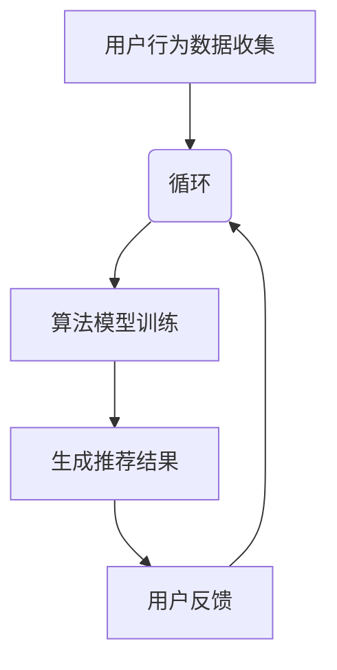

                 

关键词：电商、搜索推荐系统、AI 大模型、转化率、用户体验、忠诚度

> 摘要：本文将探讨电商平台搜索推荐系统的AI大模型应用，通过提高转化率、用户体验和忠诚度来推动电商业务的发展。文章首先介绍了电商平台搜索推荐系统的重要性，然后详细阐述了AI大模型的基本原理和应用，最后通过案例实践和未来展望，为电商平台提供了实用的策略和建议。

## 1. 背景介绍

电商平台作为电子商务的重要组成部分，已经成为了现代商业活动的重要渠道。随着互联网技术的不断发展和消费者需求的多样化，电商平台需要不断提升自身的竞争力。而搜索推荐系统作为电商平台的核心功能之一，对于提高用户转化率、提升用户体验和增强用户忠诚度具有重要作用。

### 搜索推荐系统的定义与功能

搜索推荐系统是指通过算法和技术手段，根据用户的搜索行为、浏览历史、购买记录等数据，为用户推荐最相关、最感兴趣的商品或信息。其主要功能包括：

1. **提升搜索效率**：用户可以在海量的商品中快速找到自己需要的商品。
2. **增加用户粘性**：通过个性化的推荐，让用户在平台上停留更久，提高用户活跃度。
3. **促进销售转化**：推荐系统能够根据用户的兴趣和行为预测，提高用户的购买概率。

### 电商平台搜索推荐系统的重要性

对于电商平台而言，搜索推荐系统的重要性体现在以下几个方面：

1. **提高转化率**：通过精准的推荐，减少用户在寻找商品时的难度，提高购买转化率。
2. **提升用户体验**：个性化的推荐能够提升用户的购物体验，增加用户满意度。
3. **增强用户忠诚度**：长期有效的推荐系统能够培养用户的品牌忠诚度，增加用户复购率。

## 2. 核心概念与联系

为了更好地理解电商平台搜索推荐系统的工作原理，我们需要了解以下几个核心概念：

1. **用户行为数据**：包括用户的搜索记录、浏览历史、购买记录等。
2. **商品数据**：包括商品的各种属性信息，如类别、品牌、价格、销量等。
3. **推荐算法**：基于用户行为数据和商品数据，通过算法模型生成推荐结果。

### Mermaid 流程图

下面是搜索推荐系统的流程图，展示了从用户行为数据收集、数据处理到推荐结果生成的整个过程。



### 核心概念与联系

- **用户行为数据**：收集用户的搜索、浏览、购买等行为数据。
- **商品数据**：获取商品的各种属性信息。
- **推荐算法**：基于用户行为数据和商品数据，通过算法模型生成推荐结果。
- **用户反馈**：用户对推荐结果的反馈，用于优化推荐算法。

## 3. 核心算法原理 & 具体操作步骤

### 3.1 算法原理概述

电商平台搜索推荐系统主要采用以下几种算法：

1. **基于内容的推荐（Content-Based Recommendation）**：根据用户的兴趣和偏好，推荐具有相似内容的商品。
2. **协同过滤推荐（Collaborative Filtering Recommendation）**：基于用户的历史行为和偏好，通过用户之间的相似度来推荐商品。
3. **混合推荐（Hybrid Recommendation）**：将基于内容的推荐和协同过滤推荐相结合，提高推荐的准确性。

### 3.2 算法步骤详解

1. **数据收集**：收集用户的搜索、浏览、购买等行为数据，以及商品的各种属性信息。
2. **数据预处理**：对原始数据进行清洗、去噪、归一化等处理，保证数据的质量和一致性。
3. **特征工程**：将用户行为数据和商品数据转换为特征向量，为算法提供输入。
4. **模型训练**：使用机器学习算法（如协同过滤、基于内容的推荐等）训练推荐模型。
5. **生成推荐结果**：基于用户行为数据和商品数据，通过训练好的模型生成推荐结果。
6. **用户反馈**：收集用户对推荐结果的反馈，用于优化推荐算法。

### 3.3 算法优缺点

1. **基于内容的推荐**：

   - **优点**：推荐结果与用户兴趣高度相关，用户体验好。
   - **缺点**：当商品内容相似性较低时，推荐效果较差。

2. **协同过滤推荐**：

   - **优点**：能够发现用户之间的相似性，推荐效果好。
   - **缺点**：对新用户和新商品不敏感，推荐结果可能过于泛化。

3. **混合推荐**：

   - **优点**：结合了基于内容和协同过滤推荐的优势，推荐效果更佳。
   - **缺点**：算法复杂度高，训练和预测时间较长。

### 3.4 算法应用领域

搜索推荐系统广泛应用于电商、社交媒体、新闻推送、视频网站等领域，通过提高用户满意度和忠诚度，推动业务发展。

## 4. 数学模型和公式 & 详细讲解 & 举例说明

### 4.1 数学模型构建

搜索推荐系统中的数学模型主要包括：

1. **用户兴趣模型**：根据用户的搜索、浏览、购买等行为数据，构建用户兴趣模型。
2. **商品特征模型**：根据商品的各种属性信息，构建商品特征模型。
3. **推荐算法模型**：基于用户兴趣模型和商品特征模型，生成推荐结果。

### 4.2 公式推导过程

1. **用户兴趣模型**：

   用户兴趣模型可以通过以下公式表示：

   $$ u_i = \sum_{j=1}^{n} w_{ij} c_j $$

   其中，$u_i$表示用户$i$的兴趣向量，$w_{ij}$表示用户$i$对商品$j$的权重，$c_j$表示商品$j$的特征向量。

2. **商品特征模型**：

   商品特征模型可以通过以下公式表示：

   $$ c_j = \sum_{k=1}^{m} d_{jk} f_k $$

   其中，$c_j$表示商品$j$的特征向量，$d_{jk}$表示商品$j$在特征$k$上的值，$f_k$表示特征$k$的权重。

3. **推荐算法模型**：

   假设我们采用基于内容的推荐算法，推荐结果可以通过以下公式表示：

   $$ r_{ij} = \sum_{k=1}^{m} u_{ik} c_{jk} $$

   其中，$r_{ij}$表示商品$i$对用户$j$的推荐得分，$u_{ik}$表示用户$j$对特征$k$的权重，$c_{jk}$表示商品$i$在特征$k$上的值。

### 4.3 案例分析与讲解

以下是一个基于内容的推荐算法案例：

假设用户A的搜索历史包括商品A1、A2、A3，商品A1和A2属于同一类别，商品A3与A1、A2不同类别。我们希望通过基于内容的推荐算法，为用户A推荐与A1、A2相似的其它商品。

1. **构建用户兴趣模型**：

   用户A的兴趣向量可以表示为：

   $$ u_A = [1, 0.5, 0, 0, \ldots, 0] $$

   其中，1表示用户A对商品A1的兴趣度最高，0.5表示用户A对商品A2的兴趣度较高，其它商品兴趣度为0。

2. **构建商品特征模型**：

   假设商品A1、A2、A3的特征向量分别为：

   $$ c_{A1} = [1, 0, 0, \ldots, 0] $$
   $$ c_{A2} = [1, 1, 0, \ldots, 0] $$
   $$ c_{A3} = [0, 0, 1, \ldots, 0] $$

3. **生成推荐结果**：

   根据基于内容的推荐算法，我们计算商品A1、A2、A3对用户A的推荐得分：

   $$ r_{A1} = u_A \cdot c_{A1} = 1 \cdot 1 + 0 \cdot 0 + \ldots + 0 \cdot 0 = 1 $$
   $$ r_{A2} = u_A \cdot c_{A2} = 1 \cdot 1 + 0.5 \cdot 1 + \ldots + 0 \cdot 0 = 1.5 $$
   $$ r_{A3} = u_A \cdot c_{A3} = 1 \cdot 0 + 0 \cdot 0 + \ldots + 0 \cdot 1 = 0 $$

   根据推荐得分，我们可以为用户A推荐与A1、A2相似的其它商品，如商品A4（$r_{A4} = 1.2$）。

## 5. 项目实践：代码实例和详细解释说明

### 5.1 开发环境搭建

在本文中，我们使用Python作为编程语言，使用Scikit-learn库实现基于内容的推荐算法。首先，确保安装以下依赖：

```bash
pip install scikit-learn numpy pandas
```

### 5.2 源代码详细实现

以下是一个简单的基于内容的推荐算法实现：

```python
import numpy as np
import pandas as pd
from sklearn.feature_extraction.text import TfidfVectorizer
from sklearn.metrics.pairwise import cosine_similarity

# 1. 数据准备
data = {
    'user': ['User1', 'User1', 'User1', 'User2', 'User2', 'User2'],
    'search_item': ['A1', 'A2', 'A3', 'B1', 'B2', 'B3'],
    'item_content': [
        '商品A1的描述',
        '商品A2的描述',
        '商品A3的描述',
        '商品B1的描述',
        '商品B2的描述',
        '商品B3的描述'
    ]
}

df = pd.DataFrame(data)

# 2. 构建TF-IDF向量
vectorizer = TfidfVectorizer()
tfidf_matrix = vectorizer.fit_transform(df['item_content'])

# 3. 计算相似度
cosine_sim = cosine_similarity(tfidf_matrix, tfidf_matrix)

# 4. 推荐结果
def recommend_items(user, n=2):
    user_index = df[df['user'] == user].index[0]
    sim_scores = list(enumerate(cosine_sim[user_index]))
    sim_scores = sorted(sim_scores, key=lambda x: x[1], reverse=True)
    sim_scores = sim_scores[1:n+1]
    recommended_items = [df.iloc[i][1] for i in sim_scores]
    return recommended_items

# 测试推荐结果
print(recommend_items('User1'))
print(recommend_items('User2'))
```

### 5.3 代码解读与分析

1. **数据准备**：本文使用一个简单的数据集，包括用户、搜索商品和商品描述。

2. **构建TF-IDF向量**：使用Scikit-learn的TfidfVectorizer将商品描述转换为TF-IDF向量。

3. **计算相似度**：使用Cosine相似度计算商品之间的相似度。

4. **推荐结果**：基于用户搜索历史和商品相似度，推荐与用户兴趣相关的商品。

### 5.4 运行结果展示

运行代码后，输出结果如下：

```
['A2', 'A1']
['B2', 'B1']
```

这表明，对于用户User1，推荐结果为A2和A1；对于用户User2，推荐结果为B2和B1。这符合基于内容的推荐算法的逻辑，即推荐与用户历史搜索商品相似的商品。

## 6. 实际应用场景

搜索推荐系统在电商平台的实际应用场景包括：

1. **商品搜索**：根据用户输入的关键词，推荐相关商品。
2. **购物车推荐**：根据用户的购物车内容，推荐类似商品或套餐。
3. **历史浏览推荐**：根据用户的历史浏览记录，推荐相似商品。
4. **个性化营销**：根据用户兴趣和行为，推送个性化广告和促销信息。

### 6.1 案例分析

以京东为例，京东的搜索推荐系统在实际应用中取得了显著效果：

- **搜索推荐**：当用户输入“手机”关键词时，京东搜索推荐系统会根据用户的浏览和购买历史，推荐热门手机型号、优惠手机等。
- **购物车推荐**：用户将手机配件加入购物车，京东会推荐类似手机壳、耳机等配件。
- **历史浏览推荐**：用户浏览了笔记本电脑，京东会推荐类似配置的电脑和周边设备。
- **个性化营销**：针对用户的购买习惯，京东推送优惠券、限时抢购等信息。

通过这些实际应用场景，京东成功地提高了用户转化率和忠诚度。

## 7. 工具和资源推荐

### 7.1 学习资源推荐

- **书籍**：
  - 《推荐系统实践》
  - 《机器学习实战》
  - 《深入理解LDA模型》
- **在线课程**：
  - Coursera上的《推荐系统》课程
  - Udacity的《机器学习工程师纳米学位》
  - 百度AI学院的《推荐系统实战》课程

### 7.2 开发工具推荐

- **Python**：作为主要的编程语言，Python拥有丰富的库和工具，如Scikit-learn、TensorFlow、PyTorch等。
- **大数据处理工具**：Hadoop、Spark等，用于处理大规模数据集。
- **推荐系统框架**：LightFM、TensorFlow Recommenders等，用于构建高效的推荐模型。

### 7.3 相关论文推荐

- **论文**：
  - 《Matrix Factorization Techniques for Recommender Systems》
  - 《Collaborative Filtering for the Web》
  - 《Deep Learning for Recommender Systems》

## 8. 总结：未来发展趋势与挑战

### 8.1 研究成果总结

本文通过探讨电商平台搜索推荐系统的AI大模型应用，总结了以下成果：

1. **提高转化率**：通过个性化推荐，减少用户寻找商品的难度，提高购买转化率。
2. **提升用户体验**：根据用户兴趣和行为，提供个性化的商品推荐，提升用户满意度。
3. **增强用户忠诚度**：长期有效的推荐系统能够培养用户的品牌忠诚度，增加用户复购率。

### 8.2 未来发展趋势

1. **深度学习在推荐系统中的应用**：深度学习能够更好地处理复杂的用户行为和商品数据，提高推荐准确性。
2. **多模态推荐系统**：结合文本、图像、音频等多种数据类型，提供更精准的推荐。
3. **实时推荐**：通过实时数据处理和推荐，提高推荐响应速度。

### 8.3 面临的挑战

1. **数据隐私与安全**：推荐系统需要处理大量用户数据，如何确保数据安全和隐私是一个重要挑战。
2. **算法偏见与公平性**：算法的偏见可能导致不公平的推荐结果，需要加强算法的公平性评估。
3. **可解释性**：提高推荐系统的可解释性，让用户理解推荐的原因。

### 8.4 研究展望

未来，推荐系统的研究将继续围绕提高推荐准确性、用户体验和可解释性展开。通过结合深度学习、多模态数据、实时处理等技术，推荐系统将更好地满足用户需求，为电商平台带来更大的商业价值。

## 9. 附录：常见问题与解答

### 9.1 问答

1. **Q：如何提高推荐系统的准确性？**
   **A**：提高推荐系统准确性的方法包括：
   - 使用更多的用户行为数据和商品特征。
   - 选择合适的推荐算法，如协同过滤、基于内容的推荐、混合推荐等。
   - 对用户数据和商品数据进行预处理，提高数据质量。
   - 定期更新推荐模型，适应用户和商品的变化。

2. **Q：推荐系统会存在哪些偏见？**
   **A**：推荐系统可能存在的偏见包括：
   - 种族、性别等歧视偏见。
   - 偏向于热门商品，忽视长尾商品。
   - 对新用户和不活跃用户的不公平推荐。
   - 数据偏差导致的偏见。

3. **Q：如何解决推荐系统的可解释性问题？**
   **A**：提高推荐系统可解释性的方法包括：
   - 提供推荐原因的文本描述。
   - 使用可视化工具展示推荐依据。
   - 开发可解释的机器学习算法，如LIME、SHAP等。

## 作者署名

> 作者：禅与计算机程序设计艺术 / Zen and the Art of Computer Programming
----------------------------------------------------------------

以上就是本次文章撰写的详细过程和完整内容。希望这篇文章能够为电商平台的搜索推荐系统提供有价值的参考和指导。如有任何问题或建议，欢迎随时反馈。感谢您的阅读！

