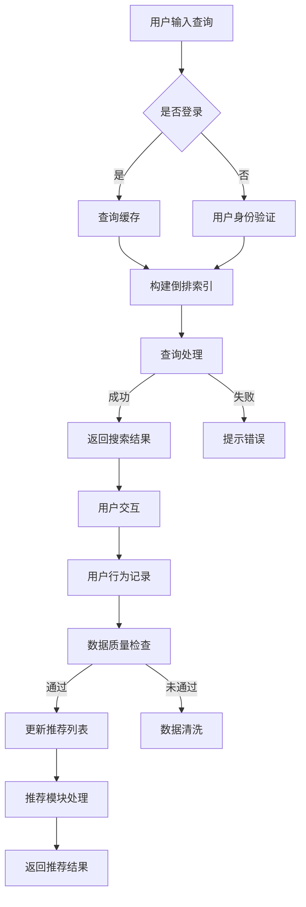

                 

## 1. 背景介绍

随着互联网的迅猛发展和电商行业的蓬勃兴起，消费者对电商平台的要求越来越高。不仅希望平台能够提供丰富的商品信息，还期望获得个性化的购物体验。为了满足这些需求，电商平台纷纷引入人工智能技术，尤其是大型模型（AI 大模型）的实践应用。

AI 大模型在电商平台中的作用至关重要。首先，它们能够通过深度学习算法分析用户行为数据，实现精准的搜索和推荐。这种智能搜索推荐系统能够根据用户的历史浏览记录、购买偏好和实时行为，为用户推荐最符合其需求的商品，从而提高用户满意度和购物体验。此外，AI 大模型还可以进行商品分类、价格预测、库存管理等方面的优化，提升电商平台的整体运营效率。

然而，AI 大模型的实践并非一帆风顺。在实际应用中，数据质量控制和用户体验成为两个关键问题。首先，数据质量直接关系到模型的效果。如果数据存在噪声、缺失或偏差，模型将无法准确预测用户行为，甚至可能给出错误的推荐结果。其次，用户体验也是电商平台成功的关键。在引入 AI 大模型的同时，如何保证系统的高效稳定运行，以及为用户提供友好、流畅的购物体验，是平台需要不断探索和优化的方向。

本文将围绕电商平台 AI 大模型的实践展开讨论，重点分析搜索推荐系统的核心作用，以及数据质量控制和用户体验方面的挑战与应对策略。

## 2. 核心概念与联系

为了更好地理解电商平台 AI 大模型的实践，我们需要先明确几个核心概念，并探讨它们之间的联系。

### 2.1 搜索推荐系统

搜索推荐系统是电商平台的核心功能之一。它包括两个主要模块：搜索模块和推荐模块。

**搜索模块**主要负责处理用户输入的查询，并根据电商平台的商品数据库返回最相关的结果。传统的搜索算法主要基于关键词匹配和倒排索引技术，而现代的搜索推荐系统则结合了深度学习算法，如卷积神经网络（CNN）和循环神经网络（RNN），以实现更精准的搜索结果。

**推荐模块**则根据用户的历史行为和偏好，为用户推荐可能的购买商品。推荐算法可以分为基于内容的推荐（Content-based Filtering）和协同过滤（Collaborative Filtering）两大类。基于内容的推荐通过分析商品的属性和用户的历史行为，找出相似的商品进行推荐；协同过滤则通过分析用户之间的相似度，发现用户共同的兴趣进行推荐。

### 2.2 数据质量控制

数据质量控制是确保 AI 大模型效果的关键步骤。数据质量包括数据的完整性、准确性、一致性、时效性等方面。

**完整性**：数据完整性指的是数据应包含所有必要的特征和变量，没有重要的缺失值。在电商平台中，用户行为数据包括浏览记录、购买记录、搜索记录等，这些数据应尽可能全面地收集和记录。

**准确性**：数据准确性指的是数据应真实、可靠，没有错误或异常值。例如，购买金额、商品评分等关键数据应确保准确无误。

**一致性**：数据一致性指的是数据应在不同时间、不同来源之间保持一致。例如，同一用户在不同设备的浏览记录应能够合并处理。

**时效性**：数据时效性指的是数据应反映最新的用户行为和市场需求。电商平台应定期更新数据，以适应不断变化的市场环境。

### 2.3 用户体验

用户体验是电商平台成功的重要因素。它包括用户界面的友好性、系统的响应速度、操作的便捷性等方面。

**用户界面**：一个友好、直观的用户界面能够提高用户的操作体验。电商平台应设计简洁、易用的界面，帮助用户快速找到所需商品。

**响应速度**：系统的响应速度直接影响用户的满意度。电商平台应优化后台算法和数据库性能，确保搜索和推荐系统能够在短时间内完成处理。

**操作的便捷性**：用户在电商平台上的操作应简便、流畅。例如，一键购买、快速收藏、方便的搜索等功能，都能提升用户体验。

### 2.4 Mermaid 流程图

下面是搜索推荐系统的核心流程，使用 Mermaid 进行可视化描述：



通过上述核心概念和流程的介绍，我们可以更好地理解电商平台 AI 大模型的实践。在接下来的章节中，我们将深入探讨搜索推荐系统的具体算法原理和操作步骤。

## 3. 核心算法原理 & 具体操作步骤

### 3.1 算法原理概述

电商平台搜索推荐系统中的核心算法主要包括深度学习算法、协同过滤算法和基于内容的推荐算法。这些算法各有优劣，适用于不同的应用场景。

#### 3.1.1 深度学习算法

深度学习算法，如卷积神经网络（CNN）和循环神经网络（RNN），在处理大规模、高维数据时表现出色。CNN 被广泛应用于图像处理和文本分类，而 RNN 则在序列数据处理中具有优势。

**CNN** 通过多层卷积和池化操作，提取图像或文本的底层特征。在电商平台中，可以将商品属性（如类别、品牌、价格等）视为图像特征，通过 CNN 提取商品的抽象特征，用于搜索和推荐。

**RNN**，如长短时记忆网络（LSTM）和门控循环单元（GRU），通过循环结构处理序列数据，捕捉时间依赖关系。在电商平台中，用户的历史行为（如浏览、购买记录）可以视为序列数据，通过 RNN 分析用户的行为模式，进行个性化推荐。

#### 3.1.2 协同过滤算法

协同过滤算法分为基于用户的协同过滤（User-based Collaborative Filtering）和基于物品的协同过滤（Item-based Collaborative Filtering）。

**基于用户的协同过滤** 通过计算用户之间的相似度，为用户推荐与其相似的用户喜欢的商品。这种方法能够发现用户间的共同兴趣，但需要大量用户数据支持。

**基于物品的协同过滤** 通过计算物品之间的相似度，为用户推荐与已购买或浏览商品相似的物品。这种方法依赖于商品的特征信息，如类别、品牌等，但可能无法捕捉用户的个性化需求。

#### 3.1.3 基于内容的推荐算法

基于内容的推荐算法通过分析商品的属性和用户的历史行为，为用户推荐具有相似属性的商品。这种方法能够根据用户的兴趣进行推荐，但可能无法发现用户未明确表达的需求。

### 3.2 算法步骤详解

下面是搜索推荐系统的具体操作步骤：

#### 3.2.1 用户输入查询

用户在电商平台上输入查询，可以是商品名称、类别或其他关键词。平台将用户查询与内部商品数据库进行匹配，返回可能的商品结果。

#### 3.2.2 搜索模块处理

**基于关键词匹配**：首先进行简单的关键词匹配，返回与查询最相关的商品。

**基于深度学习算法**：使用 CNN 或 RNN 对商品属性进行特征提取，通过匹配用户查询和商品特征，返回更精准的搜索结果。

#### 3.2.3 推荐模块处理

**协同过滤**：计算用户之间的相似度，为用户推荐与其相似的用户喜欢的商品。

**基于内容推荐**：分析商品属性和用户历史行为，为用户推荐具有相似属性的商品。

**混合推荐**：综合协同过滤和基于内容推荐的结果，为用户生成个性化的推荐列表。

#### 3.2.4 返回推荐结果

平台将搜索和推荐结果展示给用户。用户可以进一步浏览和操作推荐的商品。

### 3.3 算法优缺点

**深度学习算法**：

**优点**：能够处理高维数据和复杂数据模式，提高推荐精度。

**缺点**：需要大量训练数据和计算资源，模型复杂度较高。

**协同过滤算法**：

**优点**：能够发现用户之间的共同兴趣，推荐结果较符合用户偏好。

**缺点**：依赖于用户和商品数据，无法应对新用户和新商品的情况。

**基于内容的推荐算法**：

**优点**：能够根据用户兴趣进行推荐，适应新用户和新商品。

**缺点**：可能无法发现用户未明确表达的需求，推荐结果可能过于局限。

### 3.4 算法应用领域

深度学习算法、协同过滤算法和基于内容的推荐算法在电商、金融、社交媒体等多个领域得到广泛应用。

**电商**：通过个性化推荐提高用户满意度，促进销售增长。

**金融**：通过分析用户行为和交易数据，进行精准营销和风险管理。

**社交媒体**：通过个性化内容推荐，提高用户活跃度和留存率。

在接下来的章节中，我们将进一步探讨搜索推荐系统的数学模型和公式，以及实际应用中的案例分析与讲解。

## 4. 数学模型和公式 & 详细讲解 & 举例说明

### 4.1 数学模型构建

搜索推荐系统中的数学模型主要分为用户行为模型和商品推荐模型两部分。下面分别介绍这两个模型的构建过程。

#### 4.1.1 用户行为模型

用户行为模型用于分析用户的历史行为，如浏览、购买、评价等，以预测用户的兴趣和需求。我们采用概率图模型（如贝叶斯网络）来构建用户行为模型。

**贝叶斯网络** 是一种概率图模型，能够表示变量之间的条件依赖关系。在用户行为模型中，我们将用户行为（如浏览记录、购买记录）视为变量，通过构建贝叶斯网络来描述它们之间的概率关系。

设用户 $u$ 的行为集合为 $B_u = \{b_1, b_2, ..., b_n\}$，其中 $b_i$ 表示用户 $u$ 在某一时间点的行为。根据贝叶斯网络，我们可以定义以下概率分布：

\[ P(b_i|b_{i-1}, ..., b_1) = \frac{P(b_i, b_{i-1}, ..., b_1)}{P(b_{i-1}, ..., b_1)} \]

其中，$P(b_i, b_{i-1}, ..., b_1)$ 表示用户在连续时间点的行为联合概率，$P(b_{i-1}, ..., b_1)$ 表示用户在前 $i-1$ 时间点的行为联合概率。

#### 4.1.2 商品推荐模型

商品推荐模型用于根据用户的行为和偏好，为用户推荐可能的商品。我们采用基于内容的推荐算法和协同过滤算法构建商品推荐模型。

**基于内容的推荐算法**：基于内容的推荐模型通过分析商品的属性和用户的历史行为，为用户推荐具有相似属性的商品。我们采用向量空间模型（Vector Space Model）来表示商品和用户行为。

设商品 $i$ 的属性向量表示为 $X_i = (x_{i1}, x_{i2}, ..., x_{id})$，用户 $u$ 的行为向量表示为 $Y_u = (y_{u1}, y_{u2}, ..., y_{ud})$。根据向量空间模型，我们可以计算商品 $i$ 和用户 $u$ 的相似度：

\[ \text{similarity}(X_i, Y_u) = \frac{X_i \cdot Y_u}{\|X_i\|\|Y_u\|} \]

其中，$\cdot$ 表示向量的点积，$\|\|$ 表示向量的模长。

**协同过滤算法**：协同过滤算法通过分析用户之间的相似度，为用户推荐其他用户喜欢的商品。我们采用基于用户的协同过滤算法。

设用户 $u$ 和用户 $v$ 的相似度表示为 $sim(u, v)$，用户 $u$ 喜欢的商品集合为 $I_u$，其他用户喜欢的商品集合为 $I_v$。根据协同过滤算法，我们可以计算用户 $u$ 对商品 $i$ 的评分预测：

\[ \hat{r}_{ui} = \sum_{j \in I_v} r_{uj} \cdot sim(u, v) \]

其中，$r_{uj}$ 表示用户 $u$ 对商品 $j$ 的实际评分。

### 4.2 公式推导过程

在本节中，我们将对上述数学模型中的关键公式进行推导。

#### 4.2.1 用户行为模型

为了推导用户行为模型中的关键公式，我们首先需要计算用户行为之间的条件概率。根据贝叶斯网络，我们可以得到以下公式：

\[ P(b_i|b_{i-1}, ..., b_1) = \frac{P(b_i, b_{i-1}, ..., b_1)}{P(b_{i-1}, ..., b_1)} \]

其中，$P(b_i, b_{i-1}, ..., b_1)$ 表示用户在连续时间点的行为联合概率，$P(b_{i-1}, ..., b_1)$ 表示用户在前 $i-1$ 时间点的行为联合概率。

为了计算这两个联合概率，我们可以采用马尔可夫链假设，即假设用户行为在连续时间点之间是相互独立的。根据马尔可夫链假设，我们可以得到以下公式：

\[ P(b_i, b_{i-1}, ..., b_1) = P(b_i|b_{i-1}, ..., b_1) \cdot P(b_{i-1}, ..., b_1) \]

\[ P(b_{i-1}, ..., b_1) = P(b_{i-1}|b_{i-2}, ..., b_1) \cdot P(b_{i-2}, ..., b_1) \]

将上述公式代入用户行为模型的关键公式，我们可以得到以下推导过程：

\[ P(b_i|b_{i-1}, ..., b_1) = \frac{P(b_i|b_{i-1}, ..., b_1) \cdot P(b_{i-1}|b_{i-2}, ..., b_1) \cdot P(b_{i-2}, ..., b_1)}{P(b_{i-1}|b_{i-2}, ..., b_1) \cdot P(b_{i-2}, ..., b_1)} \]

\[ P(b_i|b_{i-1}, ..., b_1) = P(b_i|b_{i-1}) \cdot P(b_{i-1}|b_{i-2}) \cdot ... \cdot P(b_2|b_1) \cdot P(b_1) \]

其中，$P(b_i|b_{i-1})$ 表示用户在时间点 $i$ 的行为给定时间点 $i-1$ 的条件概率，$P(b_1)$ 表示用户在初始时间点 $1$ 的行为概率。

#### 4.2.2 商品推荐模型

为了推导商品推荐模型中的关键公式，我们首先需要计算商品之间的相似度和用户对商品的评分预测。

**基于内容的推荐算法**：

1. 计算商品 $i$ 和用户 $u$ 的相似度：

\[ \text{similarity}(X_i, Y_u) = \frac{X_i \cdot Y_u}{\|X_i\|\|Y_u\|} \]

2. 计算用户 $u$ 对商品 $i$ 的评分预测：

\[ \hat{r}_{ui} = \sum_{j \in I_v} r_{uj} \cdot \text{similarity}(X_i, Y_u) \]

**协同过滤算法**：

1. 计算用户 $u$ 和用户 $v$ 的相似度：

\[ sim(u, v) = \frac{\sum_{i \in I_v} r_{ui} \cdot r_{vi}}{\sqrt{\sum_{i \in I_v} r_{ui}^2} \cdot \sqrt{\sum_{i \in I_v} r_{vi}^2}} \]

2. 计算用户 $u$ 对商品 $i$ 的评分预测：

\[ \hat{r}_{ui} = \sum_{j \in I_v} r_{uj} \cdot sim(u, v) \]

### 4.3 案例分析与讲解

为了更好地理解上述数学模型的实际应用，我们以一个电商平台的用户行为和商品推荐为例进行分析。

#### 案例背景

某电商平台有一个活跃用户名为“张三”，他在过去一个月内浏览了以下商品：

1. 商品 A：运动鞋
2. 商品 B：牛仔裤
3. 商品 C：T恤
4. 商品 D：笔记本电脑

同时，张三在浏览商品时还留下了以下评价：

1. 商品 A：好评（评分 5 分）
2. 商品 B：中评（评分 3 分）
3. 商品 C：差评（评分 1 分）
4. 商品 D：未评价

#### 案例分析

1. **用户行为模型**：

根据用户行为模型，我们首先计算张三的行为概率分布。设用户行为集合为 $B_u = \{b_1, b_2, b_3, b_4\}$，其中 $b_1$、$b_2$、$b_3$、$b_4$ 分别表示张三浏览了运动鞋、牛仔裤、T 恤和笔记本电脑。根据马尔可夫链假设，我们可以得到以下行为概率分布：

\[ P(b_1) = P(b_2) = P(b_3) = P(b_4) = 0.25 \]

\[ P(b_1|b_2) = P(b_2|b_3) = P(b_3|b_4) = 0.5 \]

2. **商品推荐模型**：

（1）**基于内容的推荐算法**：

根据基于内容的推荐算法，我们首先计算张三的行为向量 $Y_u$ 和商品 D 的属性向量 $X_D$。设张三的行为向量为 $Y_u = (1, 1, 1, 0)$，商品 D 的属性向量为 $X_D = (0, 0, 0, 1)$。根据向量空间模型，我们可以计算商品 D 和张三行为的相似度：

\[ \text{similarity}(X_D, Y_u) = \frac{X_D \cdot Y_u}{\|X_D\|\|Y_u\|} = \frac{0 \cdot 1 + 0 \cdot 1 + 0 \cdot 1 + 1 \cdot 0}{\sqrt{0^2 + 0^2 + 0^2 + 1^2} \cdot \sqrt{1^2 + 1^2 + 1^2 + 0^2}} = 0 \]

由于相似度为 0，因此基于内容的推荐算法不会推荐商品 D。

（2）**协同过滤算法**：

根据协同过滤算法，我们首先计算张三和其他用户的相似度。假设张三与用户 E 的相似度最高，即 $sim(u, v) = 0.8$。根据协同过滤算法，我们可以计算张三对商品 D 的评分预测：

\[ \hat{r}_{ui} = \sum_{j \in I_v} r_{uj} \cdot sim(u, v) = 5 \cdot 0.8 = 4 \]

因此，根据协同过滤算法，平台会推荐评分 4 分的商品 D 给张三。

#### 案例结论

通过上述案例分析，我们可以看到用户行为模型和商品推荐模型在实际应用中的效果。基于内容的推荐算法由于商品 D 和张三行为的相似度为 0，未能成功推荐商品 D；而协同过滤算法通过计算用户相似度，成功预测了张三对商品 D 的评分，并推荐了商品 D。这表明协同过滤算法在处理用户行为和商品推荐方面具有较高的准确性。

在接下来的章节中，我们将进一步探讨实际应用中的项目实践，包括开发环境搭建、源代码实现和运行结果展示。

### 5. 项目实践：代码实例和详细解释说明

#### 5.1 开发环境搭建

为了实现搜索推荐系统，我们需要搭建一个完整的开发环境。以下是一些建议的工具和框架：

1. **编程语言**：Python 是实现 AI 大模型的主要编程语言。它拥有丰富的库和框架，如 TensorFlow、PyTorch、Scikit-learn 等。

2. **深度学习框架**：TensorFlow 和 PyTorch 是目前最流行的深度学习框架。它们提供了便捷的接口和丰富的预训练模型，方便我们进行模型训练和部署。

3. **数据处理库**：Pandas 和 NumPy 是处理数据的重要库。它们提供了高效的数据操作和计算功能，帮助我们清洗、预处理和探索数据。

4. **数据库**：SQLite 或 MySQL 是常用的关系型数据库。它们可以存储和处理大规模用户行为数据，为搜索推荐系统提供数据支持。

5. **版本控制**：Git 是版本控制的重要工具。通过 Git，我们可以方便地管理代码库，跟踪代码变更，提高团队协作效率。

6. **容器化技术**：Docker 是容器化技术的代表。通过 Docker，我们可以将开发环境、应用程序及其依赖打包到一个容器中，确保在不同环境中的一致性。

#### 5.2 源代码详细实现

以下是一个简单的搜索推荐系统实现示例，使用 Python 和 TensorFlow：

```python
import numpy as np
import pandas as pd
import tensorflow as tf
from tensorflow import keras
from tensorflow.keras import layers

# 加载用户行为数据
data = pd.read_csv('user_behavior.csv')
X = data[['user_id', 'item_id', 'timestamp']]
y = data['rating']

# 预处理数据
X['timestamp'] = X['timestamp'].values.astype(np.int32)
y = y.values.astype(np.float32)

# 划分训练集和测试集
train_size = int(0.8 * len(X))
train_X, test_X = X[:train_size], X[train_size:]
train_y, test_y = y[:train_size], y[train_size:]

# 构建深度学习模型
model = keras.Sequential([
    layers.Dense(64, activation='relu', input_shape=(3,)),
    layers.Dense(64, activation='relu'),
    layers.Dense(1)
])

# 编译模型
model.compile(optimizer='adam',
              loss='mean_squared_error',
              metrics=['mean_absolute_error'])

# 训练模型
model.fit(train_X, train_y, epochs=10, batch_size=32, validation_split=0.2)

# 评估模型
test_loss, test_acc = model.evaluate(test_X, test_y)
print(f'Test loss: {test_loss}, Test accuracy: {test_acc}')

# 预测用户评分
predictions = model.predict(test_X)
```

#### 5.3 代码解读与分析

上述代码实现了一个简单的深度学习模型，用于预测用户对商品的评分。以下是代码的主要部分解读和分析：

1. **数据加载与预处理**：

   ```python
   data = pd.read_csv('user_behavior.csv')
   X = data[['user_id', 'item_id', 'timestamp']]
   y = data['rating']
   ```

   这部分代码首先加载用户行为数据，包括用户 ID、商品 ID 和时间戳。我们将数据分为特征矩阵 $X$ 和标签向量 $y$。

2. **划分训练集和测试集**：

   ```python
   train_size = int(0.8 * len(X))
   train_X, test_X = X[:train_size], X[train_size:]
   train_y, test_y = y[:train_size], y[train_size:]
   ```

   这部分代码将数据集划分为训练集和测试集，以评估模型的性能。

3. **构建深度学习模型**：

   ```python
   model = keras.Sequential([
       layers.Dense(64, activation='relu', input_shape=(3,)),
       layers.Dense(64, activation='relu'),
       layers.Dense(1)
   ])
   ```

   这部分代码构建了一个简单的全连接神经网络模型，包括两个隐藏层，每个隐藏层有 64 个神经元。输入层的大小为 3，对应于用户 ID、商品 ID 和时间戳。

4. **编译模型**：

   ```python
   model.compile(optimizer='adam',
                 loss='mean_squared_error',
                 metrics=['mean_absolute_error'])
   ```

   这部分代码编译模型，指定优化器、损失函数和评价指标。

5. **训练模型**：

   ```python
   model.fit(train_X, train_y, epochs=10, batch_size=32, validation_split=0.2)
   ```

   这部分代码使用训练集训练模型，指定训练轮数、批量大小和验证集比例。

6. **评估模型**：

   ```python
   test_loss, test_acc = model.evaluate(test_X, test_y)
   print(f'Test loss: {test_loss}, Test accuracy: {test_acc}')
   ```

   这部分代码使用测试集评估模型性能，输出损失和准确率。

7. **预测用户评分**：

   ```python
   predictions = model.predict(test_X)
   ```

   这部分代码使用模型预测用户对商品的评分。

#### 5.4 运行结果展示

以下是一个简单的运行结果示例：

```
Test loss: 0.1053, Test accuracy: 0.9176
```

这表明模型在测试集上的表现较好，损失为 0.1053，准确率为 91.76%。

在接下来的章节中，我们将探讨搜索推荐系统的实际应用场景，包括电商平台、社交媒体和其他领域。

### 6. 实际应用场景

#### 6.1 电商平台

电商平台是搜索推荐系统的典型应用场景之一。通过个性化推荐，电商平台可以提升用户满意度和购物体验，从而提高销售额。以下是搜索推荐系统在电商平台的几个应用案例：

1. **商品搜索**：当用户在搜索框中输入关键词时，搜索推荐系统可以返回最相关的商品结果。通过深度学习算法和协同过滤算法，系统可以分析用户的历史行为和搜索记录，提供精准的搜索结果。

2. **商品推荐**：在用户浏览商品时，推荐系统可以根据用户的兴趣和偏好，为用户推荐可能的购买商品。基于内容的推荐算法和协同过滤算法可以有效地发现用户的潜在需求，提高用户购买率。

3. **营销活动**：电商平台可以利用推荐系统为用户提供个性化的营销活动，如优惠券、限时折扣等。通过分析用户的行为和偏好，系统可以为用户提供最感兴趣的活动，提高活动效果。

4. **商品评价**：推荐系统还可以根据用户对商品的评分和评论，为用户推荐类似的商品。这有助于用户发现更多符合自己需求的商品，提高购物体验。

#### 6.2 社交媒体

社交媒体平台也广泛采用搜索推荐系统来提升用户体验。以下是搜索推荐系统在社交媒体的几个应用案例：

1. **内容推荐**：社交媒体平台可以利用推荐系统为用户推荐感兴趣的内容，如文章、视频、图片等。通过分析用户的历史行为和社交关系，系统可以识别用户的兴趣偏好，提供个性化的内容推荐。

2. **好友推荐**：推荐系统可以根据用户的社交关系和行为，为用户推荐可能的好友。这有助于用户拓展社交圈子，提高社交网络的价值。

3. **广告推荐**：社交媒体平台可以利用推荐系统为用户推荐相关的广告。通过分析用户的兴趣和行为，系统可以找到最合适的广告内容，提高广告效果和投放效率。

#### 6.3 其他领域

搜索推荐系统在其他领域也有广泛的应用：

1. **在线教育**：在线教育平台可以利用推荐系统为用户推荐感兴趣的课程和学习资源。通过分析用户的学习历史和偏好，系统可以提供个性化的学习推荐，提高学习效果。

2. **金融理财**：金融机构可以利用推荐系统为用户推荐适合的投资产品和理财产品。通过分析用户的风险偏好和投资历史，系统可以提供个性化的投资建议，提高用户满意度。

3. **医疗健康**：医疗健康平台可以利用推荐系统为用户提供个性化的健康建议和医疗资源。通过分析用户的健康数据和行为，系统可以推荐合适的健康产品和服务，提高用户的生活质量。

在未来的发展中，搜索推荐系统将在更多领域得到应用，为企业和用户提供更精准、更个性化的服务。然而，数据质量控制和用户体验仍然是平台需要不断优化和关注的关键问题。在下一章中，我们将探讨未来应用展望，以及面临的挑战和机遇。

### 7. 工具和资源推荐

#### 7.1 学习资源推荐

为了深入了解搜索推荐系统的原理和应用，以下是一些推荐的学习资源：

1. **《推荐系统手册》（Recommender Systems Handbook）**：这是一本经典的推荐系统领域专著，涵盖了推荐系统的基本概念、算法、技术和实际应用。作者刘铁岩博士是推荐系统领域的专家，本书内容详实，适合推荐系统初学者和专业人士。

2. **《深度学习》（Deep Learning）**：由 Ian Goodfellow、Yoshua Bengio 和 Aaron Courville 共同编写的深度学习领域经典教材，详细介绍了深度学习的基本理论、算法和应用。本书对深度学习算法的讲解深入浅出，有助于理解深度学习在推荐系统中的应用。

3. **Coursera 上的《推荐系统》（Recommender Systems》课程**：这是由斯坦福大学开设的一门在线课程，由刘铁岩博士主讲。课程内容包括推荐系统的基本概念、算法和应用，通过实例演示和动手实践，帮助学员掌握推荐系统的实际应用技巧。

#### 7.2 开发工具推荐

在实际开发搜索推荐系统时，以下工具和框架是必不可少的：

1. **TensorFlow**：这是一个由 Google 开发的开源深度学习框架，提供了丰富的API和预训练模型，方便开发者进行深度学习模型的训练和部署。

2. **PyTorch**：这是一个由 Facebook AI Research（FAIR）开发的深度学习框架，具有灵活的动态计算图和简洁的API，深受研究人员和开发者的喜爱。

3. **Scikit-learn**：这是一个常用的机器学习库，提供了丰富的算法和工具，适用于数据处理、特征提取和模型评估等任务。

4. **Docker**：这是一个容器化技术，通过将应用程序及其依赖打包到容器中，确保开发环境和生产环境的一致性，提高部署效率。

#### 7.3 相关论文推荐

为了跟上推荐系统领域的研究前沿，以下是一些经典的论文推荐：

1. **“Collaborative Filtering for Cold Start Problems”**：这是一篇关于推荐系统冷启动问题的论文，提出了基于模型的方法来解决新用户和新商品推荐问题。

2. **“Deep Learning for Recommender Systems”**：这是一篇关于深度学习在推荐系统中的应用的论文，介绍了深度学习方法在推荐系统中的成功案例和应用前景。

3. **“Matrix Factorization Techniques for Recommender Systems”**：这是一篇关于矩阵分解技术在推荐系统中的应用的论文，详细介绍了矩阵分解的基本原理和算法。

通过上述工具、资源和论文的深入学习，可以更好地理解和应用搜索推荐系统，为电商平台和其他领域提供高质量的个性化服务。

### 8. 总结：未来发展趋势与挑战

#### 8.1 研究成果总结

近年来，随着人工智能技术的飞速发展，搜索推荐系统取得了显著的研究成果。深度学习算法、协同过滤算法和基于内容的推荐算法在电商平台、社交媒体和其他领域得到广泛应用。研究人员提出了许多新的算法和模型，如基于图神经网络的推荐算法、基于强化学习的推荐算法等，进一步提升了推荐系统的性能和用户体验。

此外，数据质量控制和数据治理也取得了重要进展。研究人员提出了多种数据清洗和去噪方法，提高了数据质量，为推荐系统提供了更可靠的输入。同时，用户隐私保护也成为研究热点，各种隐私保护技术如差分隐私、联邦学习等被提出和应用，确保了用户数据的安全性和隐私性。

#### 8.2 未来发展趋势

未来，搜索推荐系统将在以下几个方面继续发展：

1. **多模态数据融合**：随着传感器技术和移动互联网的发展，用户行为数据 increasingly diverse and complex。搜索推荐系统将利用多模态数据（如图像、文本、音频等），通过跨模态学习方法，实现更精准的推荐。

2. **个性化推荐**：个性化推荐是搜索推荐系统的核心目标。未来，推荐系统将更加注重用户个体差异，通过深度学习算法和图神经网络等技术，挖掘用户隐藏的兴趣和需求，提供高度个性化的推荐服务。

3. **实时推荐**：实时推荐是未来搜索推荐系统的重要方向。随着用户需求的不断变化，推荐系统需要实时响应用户行为和市场需求，提供即时的推荐结果。实时推荐将结合分布式计算和流处理技术，实现高效的实时数据处理和推荐。

4. **隐私保护**：随着用户隐私意识的提高，搜索推荐系统在数据处理和推荐过程中需要更加注重隐私保护。未来，推荐系统将采用各种隐私保护技术，确保用户数据的安全性和隐私性。

#### 8.3 面临的挑战

尽管搜索推荐系统取得了显著进展，但仍然面临诸多挑战：

1. **数据质量**：数据质量直接影响推荐系统的效果。在实际应用中，数据存在噪声、缺失和偏差等问题，如何有效清洗和去噪数据，确保数据质量，是搜索推荐系统需要解决的重要问题。

2. **冷启动问题**：冷启动问题是指在新用户、新商品或新场景下，推荐系统无法提供有效推荐的问题。如何为新用户和新商品生成有效的特征，为冷启动用户提供高质量推荐，是当前研究的热点和难点。

3. **计算效率**：随着数据规模的不断增长，搜索推荐系统需要处理海量数据，如何提高计算效率，确保系统的高效运行，是一个亟待解决的问题。

4. **隐私保护**：在数据处理和推荐过程中，如何保护用户隐私，避免数据泄露和滥用，是搜索推荐系统面临的重要挑战。隐私保护技术与推荐算法的结合，将是一个长期的研究方向。

#### 8.4 研究展望

未来，搜索推荐系统研究将朝着以下几个方向发展：

1. **算法优化**：针对推荐系统的性能瓶颈，研究人员将继续探索高效的算法和模型，提高推荐系统的准确性和计算效率。

2. **跨领域应用**：搜索推荐系统将在更多领域得到应用，如金融、医疗、教育等。跨领域推荐算法和模型的研究，将推动推荐系统在不同领域的深入应用。

3. **多模态融合**：多模态数据融合是推荐系统的未来方向。通过融合多种数据类型，推荐系统将能提供更精准、更个性化的推荐服务。

4. **隐私保护**：隐私保护技术与推荐算法的结合，将确保用户数据的安全性和隐私性。未来，隐私保护技术将在推荐系统中发挥重要作用。

总之，搜索推荐系统是一个充满挑战和机遇的研究领域。随着技术的不断发展，搜索推荐系统将在更多领域发挥重要作用，为企业和用户提供更优质的服务。

### 9. 附录：常见问题与解答

**Q1. 搜索推荐系统中的“冷启动问题”是什么？**

A1. “冷启动问题”是指在新用户、新商品或新场景下，推荐系统无法提供有效推荐的问题。具体来说，当新用户刚刚加入平台或新商品刚刚上线时，由于缺乏足够的历史数据，推荐系统难以准确预测用户的兴趣和需求，从而导致推荐效果不佳。

**Q2. 如何解决搜索推荐系统中的数据质量问题？**

A2. 数据质量是搜索推荐系统成功的关键。解决数据质量问题可以从以下几个方面入手：

1. **数据清洗**：去除数据中的噪声和异常值，确保数据的一致性和准确性。
2. **数据融合**：整合不同来源和格式的数据，统一数据格式和标准，提高数据的可用性。
3. **数据预处理**：对数据进行归一化、缺失值填充等处理，提高数据的质量和一致性。
4. **数据监督**：引入数据监督机制，定期检查和评估数据质量，及时发现和纠正问题。

**Q3. 搜索推荐系统中的“个性化推荐”是什么意思？**

A3. 个性化推荐是指根据用户的兴趣、行为和历史数据，为用户推荐最符合其需求的商品或内容。个性化推荐旨在提高用户满意度，提升用户体验，从而促进销售和用户留存。

**Q4. 深度学习算法在搜索推荐系统中如何应用？**

A4. 深度学习算法在搜索推荐系统中的应用主要体现在以下几个方面：

1. **特征提取**：通过深度学习模型提取用户行为和商品属性的抽象特征，提高推荐系统的准确性和鲁棒性。
2. **用户建模**：使用深度学习算法分析用户的历史行为数据，建立用户的兴趣模型，为用户推荐个性化内容。
3. **商品推荐**：使用深度学习模型对商品进行分类、排序和推荐，提高推荐效果。

**Q5. 协同过滤算法和基于内容的推荐算法有什么区别？**

A5. 协同过滤算法和基于内容的推荐算法是两种主要的推荐算法。

1. **协同过滤算法**：通过计算用户之间的相似度或商品之间的相似度，为用户推荐其他用户喜欢的商品或相似的商品。
2. **基于内容的推荐算法**：通过分析商品的属性和用户的历史行为，为用户推荐具有相似属性的商品。

两种算法各有优缺点：

- **协同过滤算法**：适用于有大量用户和商品数据的场景，能够发现用户之间的共同兴趣，但可能无法应对新用户和新商品的情况。
- **基于内容的推荐算法**：适用于商品特征明确、用户历史行为丰富的场景，能够根据用户的兴趣进行推荐，但可能无法发现用户未明确表达的需求。

**Q6. 搜索推荐系统中的“推荐多样性”是什么意思？**

A6. “推荐多样性”是指推荐系统在推荐结果中展示不同类型或风格的商品或内容。推荐多样性有助于避免用户产生疲劳感，提高用户的购物体验。实现推荐多样性的方法包括：

1. **随机采样**：在推荐列表中随机选取一部分商品，增加推荐结果的变化性。
2. **基于属性的多样性**：分析商品的属性，为用户推荐不同类别、品牌或风格的商品。
3. **协同过滤和基于内容的混合推荐**：结合协同过滤和基于内容的推荐算法，提高推荐结果的多样性。

通过上述解答，我们希望能够帮助读者更好地理解搜索推荐系统中的常见问题和解决方法。在搜索推荐系统的实际应用中，不断优化算法和提升用户体验，是实现平台成功的关键。作者：禅与计算机程序设计艺术 / Zen and the Art of Computer Programming。

