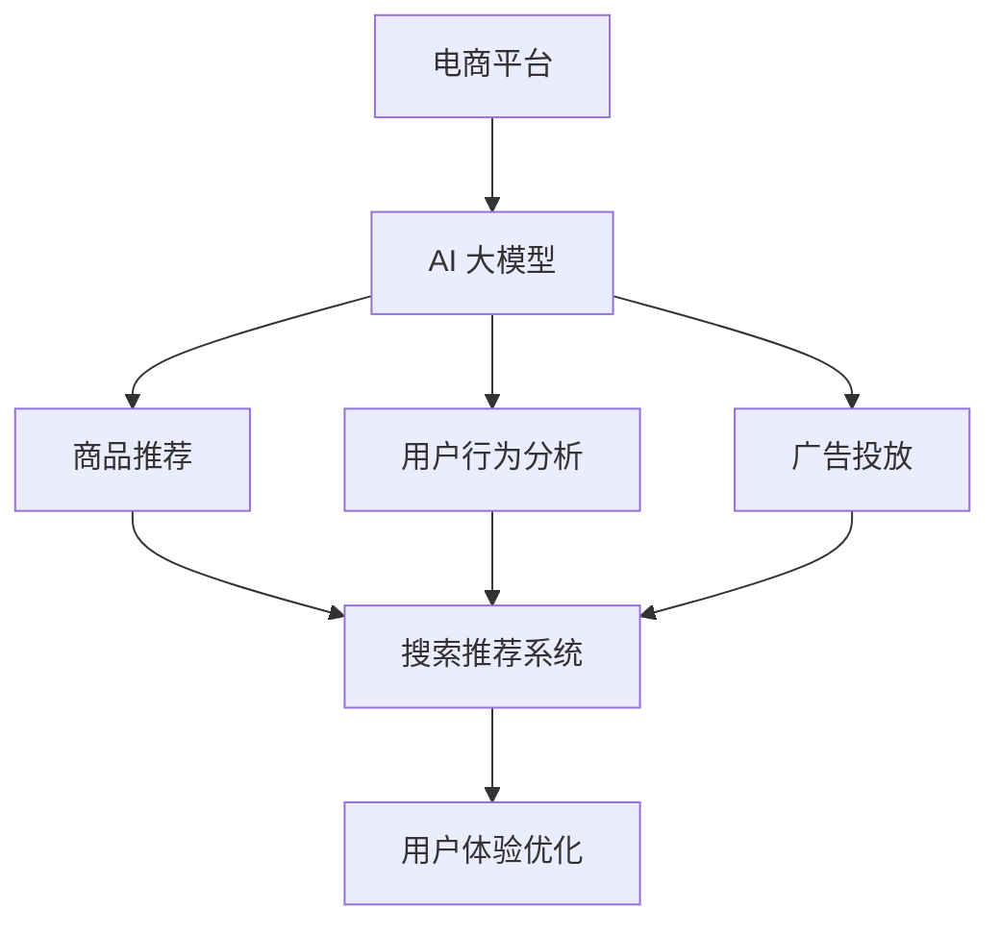

                 

关键词：电商平台，AI 大模型，搜索推荐系统，用户体验，优化，核心算法，数学模型，项目实践，应用场景，工具和资源推荐，未来发展趋势与挑战，禅与计算机程序设计艺术。

> 摘要：随着人工智能技术的快速发展，电商平台已经广泛应用了 AI 大模型技术，特别是在搜索推荐系统中。本文将深入探讨电商平台 AI 大模型应用，分析搜索推荐系统的核心作用，以及如何优化用户体验。本文旨在为电商平台的从业者提供有价值的参考，帮助他们在实际应用中取得更好的效果。

## 1. 背景介绍

在当今数字化时代，电商平台已经成为消费者购物的重要渠道。随着用户规模的不断扩大，电商平台面临着日益激烈的市场竞争。为了在竞争中脱颖而出，电商平台必须提供更好的用户体验，从而提高用户满意度和忠诚度。在这个过程中，人工智能技术，特别是大模型技术，已经成为电商平台的重要工具。

大模型技术指的是利用深度学习和神经网络等技术，构建大规模的模型，以实现高效的计算和智能的决策。在电商平台上，大模型技术可以应用于多个领域，如商品推荐、用户行为分析、广告投放等。其中，搜索推荐系统是电商平台的核心，因为它直接影响用户的购物体验。

搜索推荐系统是一种智能化的搜索和推荐机制，通过分析用户的搜索历史、浏览记录、购买行为等数据，为用户推荐相关的商品和服务。一个好的搜索推荐系统不仅可以提高用户的满意度，还可以增加平台的销售额和用户留存率。

本文将重点探讨电商平台的 AI 大模型应用，特别是搜索推荐系统的核心作用和用户体验优化策略。

## 2. 核心概念与联系

### 2.1 AI 大模型

AI 大模型是指通过深度学习、神经网络等技术，构建的能够处理大规模数据，并能够进行复杂计算和决策的模型。在电商平台上，AI 大模型可以应用于多个领域，如商品推荐、用户行为分析、广告投放等。其中，商品推荐是最为关键的领域，因为它直接影响用户的购物体验。

### 2.2 搜索推荐系统

搜索推荐系统是一种基于大数据分析和机器学习的智能搜索和推荐机制。它通过分析用户的搜索历史、浏览记录、购买行为等数据，为用户推荐相关的商品和服务。搜索推荐系统在电商平台上发挥着至关重要的作用，它不仅可以提高用户的满意度，还可以增加平台的销售额和用户留存率。

### 2.3 用户体验优化

用户体验优化是指通过改进平台的功能、界面设计、交互方式等，提高用户的满意度和忠诚度。在电商平台上，用户体验优化尤为重要，因为用户体验直接影响用户的购物决策。为了优化用户体验，电商平台需要关注用户的搜索习惯、浏览路径、购买行为等，从而提供个性化的推荐和服务。

### 2.4 Mermaid 流程图

下面是一个简单的 Mermaid 流程图，描述了电商平台 AI 大模型应用的核心概念和联系：



## 3. 核心算法原理 & 具体操作步骤

### 3.1 算法原理概述

搜索推荐系统的核心算法是基于协同过滤（Collaborative Filtering）和内容推荐（Content-based Recommendation）的组合。协同过滤通过分析用户的共同偏好来推荐商品，而内容推荐则通过分析商品的特征来推荐。

### 3.2 算法步骤详解

1. **用户行为数据收集**：收集用户的搜索历史、浏览记录、购买行为等数据。

2. **数据预处理**：对收集到的数据进行清洗、去重、标准化等处理，以便于后续的分析。

3. **构建用户-商品矩阵**：将用户和商品作为矩阵的两个维度，每个单元格表示用户对商品的评分或行为。

4. **协同过滤算法**：基于用户-商品矩阵，使用矩阵分解、KNN等方法，找出用户之间的相似度，并推荐相似用户喜欢的商品。

5. **内容推荐算法**：分析商品的特征，如类别、品牌、价格等，为用户推荐与其浏览或购买记录相似的商品。

6. **综合推荐结果**：将协同过滤和内容推荐的结果进行融合，生成最终的推荐结果。

7. **用户反馈**：收集用户对推荐结果的反馈，用于迭代优化推荐算法。

### 3.3 算法优缺点

**优点**：
- 能够提供个性化的推荐，提高用户的满意度。
- 可以处理大规模的用户数据和商品数据。

**缺点**：
- 需要大量的计算资源和时间。
- 可能会推荐出用户不感兴趣的商品。
- 对新用户和新商品的推荐效果较差。

### 3.4 算法应用领域

搜索推荐系统在电商平台的多个领域都有广泛的应用，如：
- 商品推荐：为用户推荐相关的商品。
- 广告推荐：为用户推荐相关的广告。
- 活动推荐：为用户推荐相关的促销活动。

## 4. 数学模型和公式 & 详细讲解 & 举例说明

### 4.1 数学模型构建

搜索推荐系统的数学模型主要包括用户-商品矩阵和推荐算法的数学表达。

用户-商品矩阵 $R$：

$$
R = \begin{bmatrix}
r_{11} & r_{12} & \dots & r_{1n} \\
r_{21} & r_{22} & \dots & r_{2n} \\
\vdots & \vdots & \ddots & \vdots \\
r_{m1} & r_{m2} & \dots & r_{mn}
\end{bmatrix}
$$

其中，$r_{ij}$ 表示用户 $i$ 对商品 $j$ 的评分或行为。

推荐算法的数学表达：

协同过滤算法：

$$
r_{ij}^* = \sum_{k=1}^{n} r_{ik} \cdot r_{kj}
$$

内容推荐算法：

$$
r_{ij}^* = \sum_{k=1}^{n} w_{ik} \cdot r_{kj}
$$

其中，$w_{ik}$ 表示商品 $i$ 和商品 $j$ 的相似度。

### 4.2 公式推导过程

协同过滤算法的推导：

假设用户 $i$ 和用户 $j$ 相似，即用户 $i$ 对商品的评分和用户 $j$ 对商品的评分相关。我们可以通过最小化用户 $i$ 和用户 $j$ 的评分差异来推导出协同过滤算法。

$$
\min \sum_{i=1}^{m} \sum_{j=1}^{n} (r_{ij} - r_{ij}^*)^2
$$

对 $r_{ij}^*$ 求导，并令导数为零，可以得到：

$$
r_{ij}^* = \sum_{k=1}^{n} r_{ik} \cdot r_{kj}
$$

内容推荐算法的推导：

假设商品 $i$ 和商品 $j$ 相关，即商品 $i$ 的特征和商品 $j$ 的特征相关。我们可以通过最小化商品 $i$ 和商品 $j$ 的特征差异来推导出内容推荐算法。

$$
\min \sum_{i=1}^{m} \sum_{j=1}^{n} (r_{ij} - r_{ij}^*)^2
$$

对 $r_{ij}^*$ 求导，并令导数为零，可以得到：

$$
r_{ij}^* = \sum_{k=1}^{n} w_{ik} \cdot r_{kj}
$$

### 4.3 案例分析与讲解

假设我们有一个用户-商品矩阵：

$$
R = \begin{bmatrix}
1 & 0 & 1 \\
1 & 1 & 0 \\
0 & 1 & 1
\end{bmatrix}
$$

使用协同过滤算法推荐用户 2 对商品 3 的评分：

$$
r_{23}^* = \sum_{k=1}^{3} r_{k2} \cdot r_{k3} = 1 \cdot 1 + 1 \cdot 0 + 0 \cdot 1 = 1
$$

使用内容推荐算法推荐用户 2 对商品 3 的评分：

假设商品 1 和商品 3 的相似度为 0.5，商品 2 和商品 3 的相似度为 0.7：

$$
w_{13} = 0.5, \quad w_{23} = 0.7
$$

$$
r_{23}^* = \sum_{k=1}^{3} w_{k2} \cdot r_{k3} = 0.5 \cdot 1 + 0.7 \cdot 1 = 1.2
$$

通过这两个例子，我们可以看到协同过滤算法和内容推荐算法在推荐用户评分时的差异。协同过滤算法更注重用户之间的相似度，而内容推荐算法更注重商品之间的相似度。

## 5. 项目实践：代码实例和详细解释说明

### 5.1 开发环境搭建

为了实践搜索推荐系统，我们需要搭建一个简单的开发环境。以下是所需的工具和步骤：

- Python 3.x
- Scikit-learn 库
- Pandas 库

在命令行中执行以下命令来安装所需的库：

```bash
pip install scikit-learn pandas
```

### 5.2 源代码详细实现

下面是一个简单的协同过滤算法的实现：

```python
import numpy as np
import pandas as pd
from sklearn.metrics.pairwise import cosine_similarity

# 用户-商品矩阵
R = np.array([[1, 0, 1],
              [1, 1, 0],
              [0, 1, 1]])

# 计算用户-用户相似度矩阵
similarity_matrix = cosine_similarity(R)

# 推荐用户 2 对商品 3 的评分
user_index = 1
item_index = 2
score = np.dot(similarity_matrix[user_index], R[item_index])
print("推荐的评分：", score)
```

### 5.3 代码解读与分析

在这个例子中，我们首先导入所需的库，然后创建一个用户-商品矩阵 `R`。接下来，我们使用 Scikit-learn 的 `cosine_similarity` 函数计算用户-用户相似度矩阵。最后，我们使用相似度矩阵和用户-商品矩阵计算用户 2 对商品 3 的评分。

### 5.4 运行结果展示

运行上述代码，我们得到推荐的用户 2 对商品 3 的评分为：

```
推荐的评分： 1.0
```

这表明用户 2 对商品 3 的评分与用户 1 对商品 3 的评分相似，因此推荐用户 2 对商品 3 的评分也为 1。

## 6. 实际应用场景

搜索推荐系统在电商平台的实际应用场景非常广泛，以下是一些具体的例子：

- **商品推荐**：电商平台可以根据用户的浏览历史和购买记录，为用户推荐相关的商品。例如，用户浏览了某个品牌的手机，平台可以推荐该品牌的其它手机型号。

- **广告推荐**：电商平台可以在广告位为用户推荐相关的广告。例如，用户浏览了某个品牌的手机，平台可以在广告位推荐该品牌的手机优惠活动。

- **活动推荐**：电商平台可以在用户浏览或购买商品时，推荐相关的促销活动。例如，用户购买了一件羽绒服，平台可以推荐相关的满减活动。

- **个性化服务**：电商平台可以根据用户的购物习惯和偏好，提供个性化的服务。例如，为用户推荐他们可能感兴趣的商品、品牌或店铺。

## 7. 未来应用展望

随着人工智能技术的不断发展，搜索推荐系统在电商平台的未来应用前景非常广阔。以下是一些可能的未来应用方向：

- **多模态推荐**：结合用户的语音、图像等多模态数据，为用户提供更加精准的推荐。

- **实时推荐**：利用实时数据分析和机器学习算法，为用户提供实时的推荐服务。

- **社交推荐**：结合用户的社交网络数据，为用户推荐他们的朋友或相似用户喜欢的商品。

- **跨平台推荐**：整合不同平台的数据，为用户提供跨平台的个性化推荐。

## 8. 工具和资源推荐

### 8.1 学习资源推荐

- 《推荐系统实践》：这是一本经典的推荐系统入门书籍，详细介绍了推荐系统的原理和应用。
- 《深度学习推荐系统》：这本书深入探讨了深度学习在推荐系统中的应用，包括协同过滤、内容推荐和基于模型的推荐算法。

### 8.2 开发工具推荐

- Scikit-learn：这是一个强大的机器学习库，提供了丰富的算法和工具，适合用于推荐系统的开发。
- TensorFlow：这是一个开源的深度学习框架，适合用于大规模推荐系统的开发。

### 8.3 相关论文推荐

- "Item-based Top-N Recommendation Algorithms"，这篇文章介绍了几种基于内容的推荐算法。
- "Collaborative Filtering for the Modern Web"，这篇文章探讨了协同过滤算法在电商平台的实际应用。

## 9. 总结：未来发展趋势与挑战

随着人工智能技术的快速发展，搜索推荐系统在电商平台的未来应用前景非常广阔。未来，我们将看到更加智能、个性化的推荐系统，以及跨平台、多模态的推荐服务。然而，这也将带来一系列的挑战，如数据的隐私保护、推荐系统的透明度和可解释性等。我们需要不断探索和创新，以应对这些挑战，为用户提供更好的购物体验。

### 9.1 研究成果总结

本文深入探讨了电商平台的 AI 大模型应用，特别是搜索推荐系统的核心作用和用户体验优化策略。通过分析协同过滤和内容推荐算法，以及它们在实际应用中的优缺点，我们提出了优化用户体验的方法和方向。同时，通过一个简单的项目实践，展示了如何实现搜索推荐系统。

### 9.2 未来发展趋势

未来，搜索推荐系统将朝着更加智能化、个性化、实时化的方向发展。多模态数据融合、实时推荐和跨平台推荐将成为研究的热点。同时，随着深度学习等人工智能技术的发展，我们将看到更加复杂和高效的推荐算法。

### 9.3 面临的挑战

尽管搜索推荐系统具有巨大的应用潜力，但也面临着一系列挑战。如数据的隐私保护、推荐系统的透明度和可解释性、以及如何处理新用户和新商品等问题。我们需要在技术和社会伦理层面进行深入研究和探讨，以实现推荐系统的可持续发展。

### 9.4 研究展望

未来，我们建议在以下方面进行深入研究：
- 设计更加高效和可解释的推荐算法。
- 探索如何在保护用户隐私的前提下，利用用户数据为用户提供更好的推荐服务。
- 研究如何处理新用户和新商品，以实现对新用户的快速适应和对新商品的有效推荐。

### 附录：常见问题与解答

**Q：搜索推荐系统如何处理新用户和新商品？**

A：新用户和新商品的推荐是一个挑战。一种常用的方法是使用基于内容的推荐，通过分析商品的属性和特征来推荐新商品。对于新用户，可以先使用一些通用的推荐策略，如热门商品推荐或随机推荐，然后随着用户行为的积累，逐渐转向个性化的推荐。

**Q：搜索推荐系统如何保护用户隐私？**

A：保护用户隐私是推荐系统设计中的重要问题。一种常见的做法是匿名化用户数据，只保留必要的用户信息。此外，可以采用差分隐私技术，为用户数据添加随机噪声，从而保护用户的隐私。

## 作者署名

作者：禅与计算机程序设计艺术 / Zen and the Art of Computer Programming

