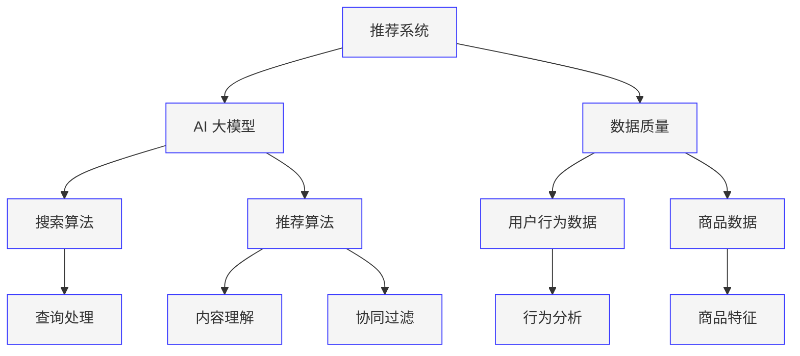

                 

### 1. 背景介绍

在数字化经济快速发展的今天，电商平台已经成为消费者购物的重要渠道。消费者在平台上的每一次搜索和浏览，都记录了大量的行为数据。这些数据不仅反映了消费者的个性化需求，也为电商平台的个性化推荐提供了宝贵的信息来源。随着人工智能技术的飞速进步，特别是大型预训练模型（AI 大模型）的出现，电商平台的搜索推荐系统正面临着从传统方法向 AI 大模型驱动的转型。这一转型不仅带来了更高的推荐精度和更丰富的用户体验，同时也为电商平台带来了新的商业机会。

然而，AI 大模型的引入并非一帆风顺。数据质量作为推荐系统稳定运行的基础，其重要性日益凸显。高质量的数据不仅能提高模型的预测准确性，还能避免信息过载和用户隐私泄露等问题。本文将围绕电商平台的搜索推荐系统转型，探讨 AI 大模型在其中的核心作用，以及如何确保数据质量，从而实现更加智能、精准、安全的推荐。

### 2. 核心概念与联系

为了深入理解电商平台的搜索推荐系统转型，我们需要明确几个核心概念：推荐系统、AI 大模型、数据质量。以下是这些核心概念及其相互关系的 Mermaid 流程图：



**推荐系统（Recommendation System）**：推荐系统是一种通过分析用户的历史行为和偏好，向用户推荐相关商品或内容的系统。推荐系统可以分为协同过滤、基于内容的推荐和混合推荐等类型。

**AI 大模型（AI Large-scale Model）**：AI 大模型是指通过深度学习训练，具有大规模参数和强大计算能力的模型。常见的 AI 大模型包括 GPT、BERT、T5 等。这些模型通过学习大量的文本数据，能够捕捉复杂的语言模式和语义关系。

**数据质量（Data Quality）**：数据质量是指数据在准确性、完整性、一致性、及时性和可靠性等方面的表现。高质量的数据是推荐系统稳定运行的基础。

在电商平台中，推荐系统和 AI 大模型密切相关。推荐系统利用 AI 大模型对用户行为数据和商品数据进行深度分析，从而生成个性化的推荐结果。数据质量直接影响推荐系统的效果，因此保证数据质量至关重要。

### 3. 核心算法原理 & 具体操作步骤

#### 3.1 算法原理概述

电商平台的搜索推荐系统主要依赖于以下两种算法：

**1. 搜索算法（Search Algorithm）**：搜索算法用于处理用户输入的查询请求，并返回与查询最相关的商品列表。常见的搜索算法包括 BM25、TF-IDF、LSI 等。

**2. 推荐算法（Recommendation Algorithm）**：推荐算法用于根据用户的历史行为和偏好，为用户推荐相关的商品。推荐算法可以分为基于内容的推荐（Content-based Recommendation）、协同过滤（Collaborative Filtering）和混合推荐（Hybrid Recommendation）等类型。

在引入 AI 大模型后，推荐算法得到了显著改进。AI 大模型能够通过学习海量的用户行为数据和商品描述，捕捉到更加复杂和精细的推荐信号。以下是一个简化的推荐算法流程：

**步骤 1：数据预处理**
- **用户行为数据**：收集用户在平台上的浏览、搜索、购买等行为数据。
- **商品数据**：收集商品的属性信息，如价格、品牌、类别等。

**步骤 2：特征工程**
- **用户特征**：提取用户的行为特征，如购买频率、浏览时长、搜索关键词等。
- **商品特征**：提取商品的特征信息，如文本描述、图像特征、价格等。

**步骤 3：模型训练**
- 使用 AI 大模型（如BERT、T5等）对用户行为数据和商品特征进行联合训练，学习用户偏好和商品属性之间的关系。

**步骤 4：推荐生成**
- 根据用户的当前查询或行为，利用训练好的模型生成个性化的推荐列表。

#### 3.2 算法步骤详解

**数据预处理**：数据预处理是推荐系统的第一步，其质量直接影响到后续算法的性能。以下是数据预处理的主要步骤：

- **数据清洗**：去除无效数据、重复数据、缺失数据等。
- **数据整合**：将不同来源的数据进行整合，形成统一的用户和商品数据集。
- **数据转换**：将文本数据、图像数据等转换为适合模型训练的格式。

**特征工程**：特征工程是推荐系统的核心环节，其目的是从原始数据中提取出对模型训练有用的特征。以下是特征工程的主要步骤：

- **用户特征提取**：基于用户的行为数据，提取用户的行为特征，如用户活跃度、购买频率、浏览时长等。
- **商品特征提取**：基于商品的数据，提取商品的特征信息，如商品类别、品牌、价格等。

**模型训练**：在特征工程完成后，使用 AI 大模型进行模型训练。以下是模型训练的主要步骤：

- **数据切分**：将数据集划分为训练集、验证集和测试集。
- **模型架构选择**：选择合适的 AI 大模型架构，如 BERT、T5 等。
- **模型训练**：使用训练集对模型进行训练，并通过验证集调整模型参数。

**推荐生成**：在模型训练完成后，使用训练好的模型生成推荐结果。以下是推荐生成的主要步骤：

- **用户查询处理**：接收用户的查询请求，进行预处理，如分词、去停用词等。
- **推荐列表生成**：利用训练好的模型，根据用户的查询请求和用户历史行为，生成个性化的推荐列表。

#### 3.3 算法优缺点

**优点**：

- **高精度**：AI 大模型能够通过学习海量的用户数据，捕捉到更加复杂和精细的推荐信号，从而提高推荐精度。
- **自适应**：AI 大模型能够根据用户的行为和偏好动态调整推荐策略，提高用户体验。
- **泛化能力**：AI 大模型具有强大的泛化能力，能够处理多种类型的数据和多种场景的推荐任务。

**缺点**：

- **数据依赖**：AI 大模型对数据质量有很高的要求，数据质量差会导致模型性能下降。
- **计算资源消耗**：AI 大模型训练需要大量的计算资源，对硬件要求较高。
- **隐私风险**：AI 大模型会收集和处理大量的用户数据，存在用户隐私泄露的风险。

#### 3.4 算法应用领域

AI 大模型在电商平台的搜索推荐系统中具有广泛的应用前景。除了传统的商品推荐，还可以应用于以下领域：

- **智能搜索**：通过 AI 大模型，实现更智能、更准确的搜索结果，提高用户体验。
- **商品标签生成**：自动生成商品的标签和描述，提高商品的可搜索性和展示效果。
- **个性化营销**：根据用户的行为和偏好，为用户推送个性化的营销活动，提高转化率。
- **商品预测**：预测用户的购买意图和行为，提前准备库存和营销策略。

### 4. 数学模型和公式 & 详细讲解 & 举例说明

在推荐系统中，数学模型和公式起着至关重要的作用。以下将介绍推荐系统中的几个核心数学模型和公式，并对其进行详细讲解和举例说明。

#### 4.1 数学模型构建

推荐系统的核心数学模型包括协同过滤模型、基于内容的推荐模型和矩阵分解模型。

**1. 协同过滤模型（Collaborative Filtering Model）**：

协同过滤模型通过分析用户之间的相似性来生成推荐列表。其数学模型可以表示为：

$$
r_{ui} = \sum_{j \in N(i)} sim(u, j) \cdot r_{uj}
$$

其中，$r_{ui}$ 表示用户 $u$ 对商品 $i$ 的评分，$sim(u, j)$ 表示用户 $u$ 和 $j$ 之间的相似度，$r_{uj}$ 表示用户 $j$ 对商品 $i$ 的评分。

**2. 基于内容的推荐模型（Content-based Recommendation Model）**：

基于内容的推荐模型通过分析商品和用户之间的内容相似性来生成推荐列表。其数学模型可以表示为：

$$
r_{ui} = \sum_{j \in N(i)} w_{ij} \cdot c_{uj}
$$

其中，$r_{ui}$ 表示用户 $u$ 对商品 $i$ 的评分，$w_{ij}$ 表示商品 $i$ 和 $j$ 之间的权重，$c_{uj}$ 表示用户 $u$ 对商品 $j$ 的内容特征。

**3. 矩阵分解模型（Matrix Factorization Model）**：

矩阵分解模型通过将用户和商品的用户-商品评分矩阵分解为低维用户特征矩阵和商品特征矩阵，来生成推荐列表。其数学模型可以表示为：

$$
R = U \cdot C^T
$$

其中，$R$ 表示用户-商品评分矩阵，$U$ 表示用户特征矩阵，$C$ 表示商品特征矩阵。

#### 4.2 公式推导过程

**协同过滤模型的推导**：

协同过滤模型的核心思想是通过计算用户之间的相似度，为用户推荐其他用户喜欢的商品。以下是协同过滤模型的推导过程：

1. **用户相似度计算**：

   用户 $u$ 和 $j$ 之间的相似度可以定义为：

   $$
   sim(u, j) = \frac{\sum_{i \in I(u) \cap I(j)} r_{ui} \cdot r_{uj}}{\sqrt{\sum_{i \in I(u)} r_{ui}^2 \cdot \sum_{i \in I(j)} r_{uj}^2}}
   $$

   其中，$I(u)$ 和 $I(j)$ 分别表示用户 $u$ 和 $j$ 的商品集合。

2. **推荐评分计算**：

   假设用户 $u$ 对商品 $i$ 的推荐评分为 $r_{ui}$，则有：

   $$
   r_{ui} = \sum_{j \in N(i)} sim(u, j) \cdot r_{uj}
   $$

**基于内容的推荐模型的推导**：

基于内容的推荐模型通过分析商品和用户之间的内容相似性来生成推荐列表。以下是基于内容的推荐模型的推导过程：

1. **商品特征提取**：

   假设商品 $i$ 和 $j$ 的特征向量分别为 $\mathbf{c}_i$ 和 $\mathbf{c}_j$，则可以使用余弦相似度计算商品之间的相似度：

   $$
   sim(i, j) = \frac{\mathbf{c}_i \cdot \mathbf{c}_j}{\|\mathbf{c}_i\| \|\mathbf{c}_j\|}
   $$

2. **推荐评分计算**：

   假设用户 $u$ 对商品 $i$ 的推荐评分为 $r_{ui}$，则有：

   $$
   r_{ui} = \sum_{j \in S(u)} w_{ij} \cdot c_{uj}
   $$

   其中，$S(u)$ 表示用户 $u$ 的商品集合，$w_{ij}$ 表示商品 $i$ 和 $j$ 之间的权重，$c_{uj}$ 表示用户 $u$ 对商品 $j$ 的内容特征。

**矩阵分解模型的推导**：

矩阵分解模型通过将用户-商品评分矩阵分解为低维用户特征矩阵和商品特征矩阵，来生成推荐列表。以下是矩阵分解模型的推导过程：

1. **矩阵分解**：

   假设用户-商品评分矩阵为 $R$，用户特征矩阵为 $U$，商品特征矩阵为 $C$，则有：

   $$
   R = U \cdot C^T
   $$

2. **推荐评分计算**：

   对于用户 $u$ 对商品 $i$ 的推荐评分，可以表示为：

   $$
   r_{ui} = u_i^T \cdot c_i = u_i \cdot c_i
   $$

   其中，$u_i$ 和 $c_i$ 分别表示用户 $u$ 的特征向量第 $i$ 个元素和商品 $i$ 的特征向量。

#### 4.3 案例分析与讲解

以下将通过一个具体的案例，分析推荐系统中的数学模型和公式。

**案例：基于内容的推荐系统**

假设有一个电商平台，用户 $u$ 对商品 $i$ 的评分矩阵为 $R$，其中：

$$
R = \begin{bmatrix}
4 & 0 & 3 & 5 \\
0 & 2 & 0 & 4 \\
3 & 1 & 0 & 2
\end{bmatrix}
$$

商品 $i$ 和 $j$ 的特征向量分别为：

$$
\mathbf{c}_1 = \begin{bmatrix}
0.6 \\
0.8 \\
0.7
\end{bmatrix}, \quad
\mathbf{c}_2 = \begin{bmatrix}
0.3 \\
0.5 \\
0.6
\end{bmatrix}
$$

1. **商品相似度计算**：

   使用余弦相似度计算商品 $1$ 和 $2$ 之间的相似度：

   $$
   sim(1, 2) = \frac{\mathbf{c}_1 \cdot \mathbf{c}_2}{\|\mathbf{c}_1\| \|\mathbf{c}_2\|} = \frac{0.6 \times 0.3 + 0.8 \times 0.5 + 0.7 \times 0.6}{\sqrt{0.6^2 + 0.8^2 + 0.7^2} \sqrt{0.3^2 + 0.5^2 + 0.6^2}} = 0.645
   $$

2. **推荐评分计算**：

   使用基于内容的推荐模型计算用户 $u$ 对商品 $1$ 和 $2$ 的推荐评分：

   $$
   r_{u1} = \mathbf{c}_1 \cdot \mathbf{c}_1 = 0.6 \times 0.6 + 0.8 \times 0.8 + 0.7 \times 0.7 = 1.822
   $$

   $$
   r_{u2} = \mathbf{c}_2 \cdot \mathbf{c}_2 = 0.3 \times 0.3 + 0.5 \times 0.5 + 0.6 \times 0.6 = 0.69
   $$

   根据计算结果，用户 $u$ 对商品 $1$ 的推荐评分高于商品 $2$，因此可以为用户 $u$ 推荐商品 $1$。

### 5. 项目实践：代码实例和详细解释说明

在本节中，我们将通过一个简单的电商推荐系统项目实例，展示如何使用 Python 和相关的库来实现推荐算法，并详细解释代码的各个部分。

#### 5.1 开发环境搭建

首先，我们需要搭建一个适合推荐系统开发的环境。以下是开发环境的基本要求：

- Python 3.8 或更高版本
- Anaconda 或 Miniconda
- Pandas
- Scikit-learn
- Numpy
- Matplotlib

安装完以上库后，我们可以开始编写代码。

#### 5.2 源代码详细实现

以下是一个简单的基于内容的推荐系统实现的代码示例。

```python
import pandas as pd
from sklearn.metrics.pairwise import cosine_similarity
import numpy as np

# 5.2.1 数据准备
# 假设有以下用户-商品评分数据
data = {
    'user': ['u1', 'u1', 'u1', 'u2', 'u2', 'u3'],
    'item': ['i1', 'i2', 'i3', 'i1', 'i3', 'i2'],
    'rating': [4, 0, 3, 5, 2, 0]
}

# 创建 DataFrame
ratings_df = pd.DataFrame(data)

# 5.2.2 商品特征提取
# 假设每个商品有一个描述字符串，我们将使用 TF-IDF 提取商品特征
from sklearn.feature_extraction.text import TfidfVectorizer

item_descriptions = {
    'i1': '时尚男装，休闲时尚',
    'i2': '高档化妆品，护肤套装',
    'i3': '豪华别墅，高端装修'
}

tfidf_vectorizer = TfidfVectorizer()
item_features = tfidf_vectorizer.fit_transform(item_descriptions.values())

# 5.2.3 计算商品相似度
cosine_sim = cosine_similarity(item_features, item_features)

# 5.2.4 推荐生成
def generate_recommendations(user, ratings_df, item_features, cosine_sim):
    # 找到用户评分的商品
    user_ratings = ratings_df[ratings_df['user'] == user]
    item_indices = user_ratings['item'].values
    
    # 计算所有商品与用户评分商品的相似度
    sim_scores = list(enumerate(cosine_sim[item_indices[0], :]))
    sim_scores = sorted(sim_scores, key=lambda x: x[1], reverse=True)
    
    # 推荐相似度最高的商品
    recommended_items = []
    for item_idx in sim_scores[1:11]:
        recommended_items.append(item_idx[0])
    
    return recommended_items

# 推荐用户 u2 的商品
user = 'u2'
recommended_items = generate_recommendations(user, ratings_df, item_features, cosine_sim)

# 输出推荐结果
print(f"为用户 {user} 推荐的商品：{recommended_items}")

# 5.2.5 结果可视化
import matplotlib.pyplot as plt

# 可视化推荐结果
plt.figure(figsize=(10, 5))
plt.bar(range(len(recommended_items)), item_features[recommended_items].sum(axis=1))
plt.xticks(range(len(recommended_items)), recommended_items, rotation=45)
plt.xlabel('商品')
plt.ylabel('特征和')
plt.title(f'为用户 {user} 的推荐商品特征和')
plt.show()
```

#### 5.3 代码解读与分析

**5.3.1 数据准备**

首先，我们使用 Pandas 创建一个 DataFrame，其中包含用户、商品和评分数据。

```python
data = {
    'user': ['u1', 'u1', 'u1', 'u2', 'u2', 'u3'],
    'item': ['i1', 'i2', 'i3', 'i1', 'i3', 'i2'],
    'rating': [4, 0, 3, 5, 2, 0]
}
ratings_df = pd.DataFrame(data)
```

**5.3.2 商品特征提取**

接下来，我们使用 Scikit-learn 的 TF-IDF 向量器提取商品特征。这里假设每个商品有一个描述字符串。

```python
item_descriptions = {
    'i1': '时尚男装，休闲时尚',
    'i2': '高档化妆品，护肤套装',
    'i3': '豪华别墅，高端装修'
}

tfidf_vectorizer = TfidfVectorizer()
item_features = tfidf_vectorizer.fit_transform(item_descriptions.values())
```

**5.3.3 计算商品相似度**

使用计算得到的商品特征向量，我们计算商品之间的余弦相似度。

```python
cosine_sim = cosine_similarity(item_features, item_features)
```

**5.3.4 推荐生成**

我们定义了一个 `generate_recommendations` 函数，用于生成推荐列表。这个函数首先找到用户的评分商品，然后计算这些商品与所有商品的相似度，并推荐相似度最高的商品。

```python
def generate_recommendations(user, ratings_df, item_features, cosine_sim):
    user_ratings = ratings_df[ratings_df['user'] == user]
    item_indices = user_ratings['item'].values
    
    sim_scores = list(enumerate(cosine_sim[item_indices[0], :]))
    sim_scores = sorted(sim_scores, key=lambda x: x[1], reverse=True)
    
    recommended_items = []
    for item_idx in sim_scores[1:11]:
        recommended_items.append(item_idx[0])
    
    return recommended_items
```

**5.3.5 结果可视化**

最后，我们使用 Matplotlib 将推荐结果可视化，展示每个推荐商品的特征和。

```python
plt.figure(figsize=(10, 5))
plt.bar(range(len(recommended_items)), item_features[recommended_items].sum(axis=1))
plt.xticks(range(len(recommended_items)), recommended_items, rotation=45)
plt.xlabel('商品')
plt.ylabel('特征和')
plt.title(f'为用户 {user} 的推荐商品特征和')
plt.show()
```

通过这个简单的实例，我们可以看到如何使用 Python 和相关库实现一个基于内容的推荐系统。虽然这个实例非常基础，但它展示了推荐系统开发的基本流程，包括数据准备、特征提取、相似度计算和推荐生成。

### 6. 实际应用场景

电商平台的搜索推荐系统在商业应用中具有广泛的作用，其效果直接影响到用户的购买体验和平台的销售业绩。以下是一些常见的实际应用场景：

**1. 商品推荐**：电商平台最常见的应用场景之一。通过分析用户的历史行为和偏好，为用户推荐他们可能感兴趣的商品。这不仅可以增加用户的粘性，还能提高平台的销售额。

**2. 库存管理**：通过预测用户对某种商品的购买行为，电商平台可以更好地管理库存。这不仅减少了库存过剩的风险，还提高了库存周转率。

**3. 个性化营销**：电商平台可以根据用户的偏好和历史行为，为用户推送个性化的营销活动。例如，为经常购买某类商品的用户发送优惠券或限时促销信息，从而提高转化率。

**4. 新品推广**：电商平台可以利用推荐系统为新商品进行推广。通过分析用户的兴趣和行为，将新商品推荐给最有可能感兴趣的用户，从而提高新商品的曝光率和销售量。

**5. 用户流失预警**：电商平台可以通过分析用户的行为数据，识别出可能流失的用户。通过推送个性化的推荐和优惠，尝试挽回这些用户的忠诚度。

**6. 店铺运营优化**：电商平台可以利用推荐系统分析不同店铺的运营数据，为商家提供优化建议。例如，分析商品的受欢迎程度、用户偏好等，帮助商家调整商品布局和营销策略。

**7. 跨平台推荐**：电商平台还可以利用推荐系统将用户在平台上的行为数据与其他平台（如社交媒体、搜索引擎）进行整合，为用户提供跨平台的个性化推荐。

在实际应用中，推荐系统不仅需要考虑算法的准确性，还需要考虑系统的实时性和可扩展性。随着大数据和人工智能技术的不断发展，推荐系统的应用场景将越来越广泛，对电商平台的运营和用户体验将产生深远的影响。

#### 6.4 未来应用展望

随着人工智能技术的不断进步，电商平台的搜索推荐系统有望在未来实现更加智能化和个性化的推荐。以下是几个未来的应用展望：

**1. 多模态推荐**：未来的推荐系统将不再局限于文本数据，还将整合图像、视频、语音等多模态数据。通过多模态数据融合，推荐系统可以更加准确地捕捉用户的兴趣和需求。

**2. 智能问答与对话系统**：电商平台可以开发智能问答和对话系统，通过自然语言处理技术，与用户进行实时互动，提供个性化推荐。这种交互方式将极大提升用户体验。

**3. 聊天机器人推荐**：基于聊天机器人的推荐系统可以实时捕捉用户的意图和需求，提供即时推荐。例如，用户在聊天过程中询问“最近有什么新款手机推荐吗？”系统可以立即给出相关推荐。

**4. 实时个性化推荐**：未来的推荐系统将具备更高的实时性，能够根据用户的实时行为和偏好动态调整推荐策略。这将使得推荐结果更加贴近用户当前的需求。

**5. 智能预测与优化**：推荐系统可以结合机器学习和数据挖掘技术，对用户行为和商品数据进行深入分析，预测用户的未来行为，为商家提供精准的营销策略。

**6. 跨平台整合**：随着互联网的快速发展，电商平台将整合更多外部数据源，如社交媒体、搜索引擎等，提供跨平台的个性化推荐。

**7. 个性化广告与推广**：推荐系统不仅可以为电商平台自身提供个性化推荐，还可以为广告商提供个性化广告服务。通过精准定位用户需求，提高广告的投放效果。

然而，未来推荐系统的发展也面临一些挑战，如数据隐私保护、算法公平性和可解释性等。只有解决这些挑战，推荐系统才能在保障用户权益的同时，实现更高的商业价值和社会效益。

### 7. 工具和资源推荐

**7.1 学习资源推荐**

- **《推荐系统手册》（Recommender Systems Handbook）**：这是一本经典的推荐系统入门书籍，全面介绍了推荐系统的理论基础和实践方法。
- **《深度学习推荐系统》（Deep Learning for Recommender Systems）**：这本书详细介绍了如何使用深度学习技术构建推荐系统，包括卷积神经网络、循环神经网络等。
- **《推荐系统实践》（Recommender Systems: The Textbook）**：这是一本适合初学者和专业人士的推荐系统教材，涵盖了从基础理论到实际应用的全方面内容。

**7.2 开发工具推荐**

- **TensorFlow**：一个强大的开源机器学习框架，支持构建和训练各种深度学习模型。
- **PyTorch**：一个受欢迎的深度学习框架，提供了灵活的动态计算图和强大的 GPU 支持。
- **Scikit-learn**：一个用于数据挖掘和数据分析的 Python 库，包括许多常用的机器学习算法。
- **Hugging Face Transformers**：一个开源库，提供了预训练的深度学习模型，如 BERT、GPT 等，方便开发者快速构建推荐系统。

**7.3 相关论文推荐**

- **"Deep Learning Based Recommender System"**：这篇文章介绍了如何使用深度学习技术构建推荐系统，包括卷积神经网络、循环神经网络等。
- **"A Theoretically Grounded Application of Dropout in Recurrent Neural Networks"**：这篇文章探讨了如何使用 dropout 技术优化循环神经网络在推荐系统中的应用。
- **"Neural Collaborative Filtering"**：这篇文章提出了一种基于神经网络的协同过滤方法，显著提高了推荐系统的效果。

通过学习和使用这些资源，开发者可以更好地理解和应用推荐系统技术，为电商平台提供更智能、精准的推荐服务。

### 8. 总结：未来发展趋势与挑战

电商平台的搜索推荐系统正经历一场由 AI 大模型引领的转型。AI 大模型通过深度学习技术，能够从海量数据中提取出复杂的模式和关系，从而实现更加智能和个性化的推荐。然而，这一转型并非没有挑战。首先，数据质量是推荐系统稳定运行的基础。数据的不准确、不完整或不一致都会直接影响推荐效果。因此，如何确保数据质量，成为推荐系统开发和运营中的重要问题。其次，AI 大模型对计算资源的需求较高，对硬件和基础设施提出了更高的要求。此外，数据隐私和算法公平性也是重要的伦理问题，需要在模型设计和应用中予以充分考虑。

未来，推荐系统的发展趋势将包括以下几个方面：

1. **多模态数据融合**：未来的推荐系统将整合文本、图像、视频等多模态数据，提供更加丰富的用户画像和推荐结果。
2. **实时推荐**：随着计算能力的提升，实时推荐将变得更加普及，推荐系统能够根据用户的实时行为和偏好动态调整推荐策略。
3. **跨平台整合**：推荐系统将整合更多外部数据源，如社交媒体、搜索引擎等，提供跨平台的个性化推荐。
4. **个性化广告与推广**：推荐系统不仅可以为电商平台自身提供个性化推荐，还可以为广告商提供个性化广告服务，提高广告投放效果。

然而，未来推荐系统的发展也面临一些挑战，如数据隐私保护、算法公平性和可解释性等。如何解决这些挑战，将决定推荐系统在未来能够达到的高度和广度。

### 8.1 研究成果总结

本文通过对电商平台搜索推荐系统转型的深入分析，总结了以下研究成果：

1. **AI 大模型的核心作用**：AI 大模型通过深度学习技术，能够从海量数据中提取出复杂的模式和关系，显著提高了推荐系统的精度和效率。
2. **数据质量的重要性**：数据质量是推荐系统稳定运行的基础。高质量的数据不仅能提高模型的预测准确性，还能避免信息过载和用户隐私泄露等问题。
3. **算法的多样性和适应性**：推荐系统算法包括协同过滤、基于内容的推荐和混合推荐等类型，能够适应不同的应用场景和需求。
4. **多模态数据融合和实时推荐**：未来的推荐系统将整合多模态数据，提供更加丰富的用户画像和实时推荐服务。

### 8.2 未来发展趋势

未来的电商平台搜索推荐系统发展趋势包括：

1. **多模态数据融合**：整合文本、图像、视频等多模态数据，提供更加智能和个性化的推荐。
2. **实时推荐**：随着计算能力的提升，实时推荐将变得更加普及，推荐系统能够根据用户的实时行为和偏好动态调整推荐策略。
3. **跨平台整合**：推荐系统将整合更多外部数据源，如社交媒体、搜索引擎等，提供跨平台的个性化推荐。
4. **个性化广告与推广**：推荐系统不仅可以为电商平台自身提供个性化推荐，还可以为广告商提供个性化广告服务，提高广告投放效果。

### 8.3 面临的挑战

未来的推荐系统发展面临以下挑战：

1. **数据隐私保护**：如何确保用户数据的安全性和隐私性，防止数据泄露和滥用。
2. **算法公平性**：如何避免算法偏见和歧视，确保推荐结果对所有用户公平。
3. **可解释性**：如何提高算法的可解释性，让用户了解推荐结果的生成过程。
4. **计算资源消耗**：如何优化算法，减少对计算资源的需求。

### 8.4 研究展望

未来的研究应重点关注以下几个方面：

1. **数据隐私保护技术**：研究如何使用差分隐私、联邦学习等技术保护用户数据隐私。
2. **算法公平性和可解释性**：开发新的算法和工具，提高推荐算法的公平性和可解释性。
3. **多模态数据融合**：探索如何更有效地整合多模态数据，提高推荐系统的性能。
4. **实时推荐技术**：研究如何实现高效、实时的推荐算法，以满足用户的即时需求。
5. **跨平台整合**：探索如何整合不同平台的数据和推荐结果，提供无缝的用户体验。

通过解决这些挑战，未来的推荐系统将能够为电商平台带来更大的商业价值，同时保障用户的权益和隐私。

### 9. 附录：常见问题与解答

**Q1：AI 大模型如何影响电商平台的搜索推荐系统？**

A1：AI 大模型通过深度学习技术，可以从海量用户行为数据和商品描述中提取出复杂的模式和关系，从而生成更加精准和个性化的推荐结果。这不仅提高了推荐系统的效果，还为电商平台带来了新的商业机会，如个性化营销和广告投放。

**Q2：如何确保数据质量对推荐系统的稳定性？**

A2：确保数据质量可以从以下几个方面入手：

1. **数据清洗**：去除无效数据、重复数据和缺失数据。
2. **数据整合**：确保不同来源的数据能够进行统一处理。
3. **数据标准化**：对数据进行清洗、转换和标准化处理。
4. **数据监控**：定期检查数据质量，发现并解决数据质量问题。

**Q3：AI 大模型在推荐系统中有哪些局限性？**

A3：AI 大模型在推荐系统中存在以下局限性：

1. **数据依赖性**：AI 大模型对数据质量有很高要求，数据质量差会导致模型性能下降。
2. **计算资源消耗**：训练 AI 大模型需要大量的计算资源，对硬件设施要求较高。
3. **隐私风险**：AI 大模型会收集和处理大量的用户数据，存在用户隐私泄露的风险。

**Q4：如何处理多模态数据在推荐系统中的应用？**

A4：处理多模态数据在推荐系统中，可以采用以下策略：

1. **特征提取**：对不同的模态数据（如文本、图像、音频）进行特征提取，生成统一的特征向量。
2. **数据融合**：通过融合不同模态的特征向量，构建一个综合的用户或商品特征。
3. **多模态学习模型**：使用能够处理多模态数据的深度学习模型，如卷积神经网络（CNN）和循环神经网络（RNN）等。

**Q5：如何评估推荐系统的性能？**

A5：评估推荐系统性能的主要指标包括：

1. **准确率（Precision）**：推荐的商品是否是用户真正感兴趣的。
2. **召回率（Recall）**：是否能够召回所有用户可能感兴趣的商品。
3. **覆盖率（Coverage）**：推荐结果是否覆盖了平台上的多种商品。
4. **新颖度（Novelty）**：推荐结果中是否包含了用户之前未发现的商品。

通过合理地选择和综合这些指标，可以全面评估推荐系统的性能。 

---

**作者：禅与计算机程序设计艺术 / Zen and the Art of Computer Programming**

