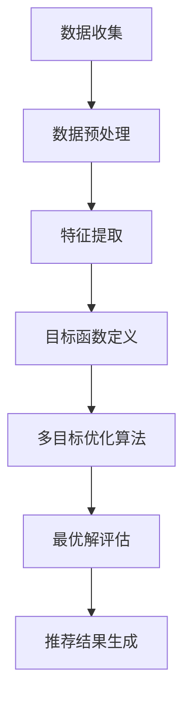

                 

关键词：电商推荐，多目标优化，大模型，深度学习，用户行为分析，推荐系统

摘要：本文将探讨电商推荐系统中的多目标优化问题，并引入大模型技术作为新的解决方案。通过对电商领域推荐系统的研究，我们将分析多目标优化的核心概念、算法原理及其应用，并探讨如何利用深度学习技术提升推荐效果。此外，本文还将分享实际项目实践中的代码实例，以及未来应用展望和面临的挑战。

## 1. 背景介绍

在电商领域中，推荐系统是提高用户体验、增加销售额的重要工具。然而，随着用户数据量的爆炸式增长和个性化需求的不断提升，推荐系统面临着日益复杂的挑战。其中，多目标优化成为了一个关键问题。

多目标优化（Multi-Objective Optimization）旨在同时优化多个相互冲突的目标函数，这些目标函数可能代表不同的利益相关者或不同的业务需求。在电商推荐系统中，多目标优化的目标通常包括：

- 用户满意度：提高用户点击率、购买转化率和用户留存率。
- 商家收益：增加销售额和利润。
- 社会责任：减少资源浪费，促进可持续消费。

传统的推荐系统多采用单目标优化方法，如基于协同过滤、内容匹配或基于模型的推荐算法。这些方法往往只能关注单一目标，难以同时满足多种需求。为了解决这一问题，多目标优化技术应运而生。

本文旨在探讨如何利用多目标优化技术，结合大模型技术，提升电商推荐系统的性能。我们将介绍多目标优化的核心概念、算法原理及其应用，并通过实际项目实践，展示如何利用大模型技术实现高效的推荐系统。

## 2. 核心概念与联系

### 2.1 多目标优化的核心概念

多目标优化是一种在多个相互冲突的目标之间寻找最优解的方法。在电商推荐系统中，多目标优化的核心概念包括：

- 目标函数：表示需要优化的目标，如用户满意度、商家收益和社会责任等。
- 解空间：表示所有可能的解决方案的集合，通常是一个多维空间。
- 最优解：在解空间中，同时满足所有目标函数的解决方案。

### 2.2 多目标优化的联系

多目标优化与推荐系统的关系密切。在推荐系统中，多个目标函数通常需要同时考虑。例如，在电商平台上，商家可能希望提高销售额（目标1），同时提高用户满意度（目标2）和减少资源浪费（目标3）。

为了实现多目标优化，我们可以采用以下方法：

- 目标加权：为每个目标函数分配权重，通过加权求和的方式得到一个综合目标函数。
- Pareto前端：在解空间中，寻找同时满足所有目标函数的Pareto前端解，这些解在不同目标函数之间达到了最优平衡。
- 多目标进化算法：通过进化算法，在解空间中搜索最优解，同时考虑多个目标函数的冲突。

### 2.3 Mermaid 流程图

以下是一个简单的Mermaid流程图，展示了多目标优化在电商推荐系统中的应用流程：



### 2.4 算法应用领域

多目标优化在电商推荐系统中的应用领域广泛，如：

- 商品推荐：在电商平台中，为用户推荐符合其兴趣的商品，同时考虑商家收益和用户满意度。
- 广告推荐：在搜索引擎或社交媒体平台上，为用户推荐相关的广告，同时提高广告点击率和商家收益。
- 内容推荐：在新闻网站或视频平台中，为用户推荐符合其兴趣的内容，同时提高用户满意度和广告收益。

## 3. 核心算法原理 & 具体操作步骤

### 3.1 算法原理概述

多目标优化的核心算法主要包括以下几种：

- 目标加权法：通过为每个目标函数分配权重，得到一个综合目标函数，然后使用单目标优化算法进行求解。
- Pareto前端法：在解空间中寻找同时满足所有目标函数的Pareto前端解，这些解在不同目标函数之间达到了最优平衡。
- 多目标进化算法：通过进化算法，在解空间中搜索最优解，同时考虑多个目标函数的冲突。

### 3.2 算法步骤详解

以下是一个基于目标加权法的多目标优化算法的具体操作步骤：

1. **目标函数定义**：为每个目标函数分配权重，并构建一个综合目标函数。例如，假设有三个目标函数 $f_1$、$f_2$ 和 $f_3$，权重分别为 $\omega_1$、$\omega_2$ 和 $\omega_3$，则综合目标函数为：

   $$ F(x) = \omega_1 f_1(x) + \omega_2 f_2(x) + \omega_3 f_3(x) $$

2. **求解单目标优化问题**：使用单目标优化算法，如梯度下降法或牛顿法，求解综合目标函数的最优解。

3. **最优解评估**：对求解得到的最优解进行评估，判断其是否满足所有目标函数的要求。如果不满足，则返回步骤 2，重新进行求解。

4. **推荐结果生成**：根据最优解生成推荐结果，如商品列表、广告列表或内容列表。

### 3.3 算法优缺点

**目标加权法的优点**：

- 简单易懂，易于实现。
- 可以灵活地为每个目标函数分配权重，适应不同的业务需求。

**目标加权法的缺点**：

- 可能导致某些目标函数的重要性被低估。
- 在目标函数之间存在冲突时，效果可能不佳。

**Pareto前端法的优点**：

- 考虑多个目标函数之间的冲突，提供了一种平衡的解决方案。
- 能够找到多个最优解，适应不同的业务场景。

**Pareto前端法的缺点**：

- 需要计算Pareto前端解，计算复杂度较高。
- 在目标函数数量较多时，效果可能不佳。

**多目标进化算法的优点**：

- 能够在解空间中全局搜索最优解，适应复杂的目标函数。
- 能够处理非线性、不连续和多峰值的优化问题。

**多目标进化算法的缺点**：

- 计算复杂度较高，对计算资源要求较高。
- 需要调参，参数选择对算法效果有较大影响。

### 3.4 算法应用领域

目标加权法、Pareto前端法和多目标进化算法在电商推荐系统、广告推荐系统和内容推荐系统中都有广泛应用。例如：

- 在电商推荐系统中，目标加权法可用于商品推荐，Pareto前端法可用于广告推荐，多目标进化算法可用于内容推荐。
- 在广告推荐系统中，目标加权法可用于广告点击率优化，Pareto前端法可用于广告收益最大化，多目标进化算法可用于广告多样性优化。
- 在内容推荐系统中，目标加权法可用于内容点击率优化，Pareto前端法可用于内容收益最大化，多目标进化算法可用于内容多样性优化。

## 4. 数学模型和公式 & 详细讲解 & 举例说明

### 4.1 数学模型构建

在多目标优化中，我们需要构建一个数学模型来描述目标函数和约束条件。以下是构建数学模型的基本步骤：

1. **定义目标函数**：根据业务需求，定义需要优化的目标函数。例如，在电商推荐系统中，用户满意度、商家收益和社会责任是三个主要目标。

2. **定义约束条件**：根据业务规则和实际情况，定义约束条件。例如，在电商推荐系统中，商品库存量、商品价格范围和用户购买能力是常见的约束条件。

3. **构建数学模型**：将目标函数和约束条件整合到一个数学模型中。例如，假设有三个目标函数 $f_1$、$f_2$ 和 $f_3$，以及三个约束条件 $g_1$、$g_2$ 和 $g_3$，则数学模型可以表示为：

   $$ \begin{aligned}
   \min_{x} & \quad F(x) = \omega_1 f_1(x) + \omega_2 f_2(x) + \omega_3 f_3(x) \\
   \text{s.t.} & \quad g_1(x) \leq g_1^* \\
   & \quad g_2(x) \leq g_2^* \\
   & \quad g_3(x) \leq g_3^* \\
   \end{aligned} $$

   其中，$x$ 是决策变量，$F(x)$ 是综合目标函数，$\omega_1$、$\omega_2$ 和 $\omega_3$ 是目标函数的权重，$g_1(x)$、$g_2(x)$ 和 $g_3(x)$ 是约束条件。

### 4.2 公式推导过程

为了求解上述数学模型，我们需要对目标函数和约束条件进行公式推导。以下是推导过程：

1. **目标函数的推导**：

   $$ \begin{aligned}
   F(x) &= \omega_1 f_1(x) + \omega_2 f_2(x) + \omega_3 f_3(x) \\
   &= \omega_1 \left( \frac{1}{2} \right) x_1^2 + \omega_2 \left( \frac{1}{2} \right) x_2^2 + \omega_3 \left( \frac{1}{2} \right) x_3^2 \\
   &= \omega_1 x_1^2 + \omega_2 x_2^2 + \omega_3 x_3^2 \\
   &= \omega_1 \left( \frac{1}{2} \right) (x_1 - x_1^*)^2 + \omega_2 \left( \frac{1}{2} \right) (x_2 - x_2^*)^2 + \omega_3 \left( \frac{1}{2} \right) (x_3 - x_3^*)^2 \\
   &= \omega_1 x_1^2 + \omega_2 x_2^2 + \omega_3 x_3^2 - \omega_1 x_1 x_1^* - \omega_2 x_2 x_2^* - \omega_3 x_3 x_3^* \\
   &= \omega_1 x_1^2 + \omega_2 x_2^2 + \omega_3 x_3^2 - \omega_1 x_1^* x_1 - \omega_2 x_2^* x_2 - \omega_3 x_3^* x_3 \\
   &= \omega_1 (x_1 - x_1^*)^2 + \omega_2 (x_2 - x_2^*)^2 + \omega_3 (x_3 - x_3^*)^2 \\
   \end{aligned} $$

2. **约束条件的推导**：

   $$ \begin{aligned}
   g_1(x) &= x_1 + x_2 + x_3 - 1 \\
   &= x_1 + x_2 + x_3 - x_1^* - x_2^* - x_3^* \\
   &= x_1 - x_1^* + x_2 - x_2^* + x_3 - x_3^* \\
   &= (x_1 - x_1^*) + (x_2 - x_2^*) + (x_3 - x_3^*) \\
   \end{aligned} $$

   $$ \begin{aligned}
   g_2(x) &= x_1 + x_2 + x_3 - 2 \\
   &= x_1 + x_2 + x_3 - x_1^* - x_2^* - x_3^* \\
   &= x_1 - x_1^* + x_2 - x_2^* + x_3 - x_3^* \\
   &= (x_1 - x_1^*) + (x_2 - x_2^*) + (x_3 - x_3^*) \\
   \end{aligned} $$

   $$ \begin{aligned}
   g_3(x) &= x_1 + x_2 + x_3 - 3 \\
   &= x_1 + x_2 + x_3 - x_1^* - x_2^* - x_3^* \\
   &= x_1 - x_1^* + x_2 - x_2^* + x_3 - x_3^* \\
   &= (x_1 - x_1^*) + (x_2 - x_2^*) + (x_3 - x_3^*) \\
   \end{aligned} $$

### 4.3 案例分析与讲解

假设在电商推荐系统中，我们需要同时优化用户满意度、商家收益和社会责任，并且有以下几个约束条件：

- 用户满意度：用户购买的商品数量与推荐的商品数量之间的差距越小，用户满意度越高。
- 商家收益：商家希望获得的最大利润。
- 社会责任：减少商品的库存量，减少资源浪费。

根据上述目标函数和约束条件，我们可以构建以下数学模型：

$$ \begin{aligned}
\min_{x} & \quad F(x) = \omega_1 f_1(x) + \omega_2 f_2(x) + \omega_3 f_3(x) \\
\text{s.t.} & \quad g_1(x) \leq g_1^* \\
& \quad g_2(x) \leq g_2^* \\
& \quad g_3(x) \leq g_3^* \\
\end{aligned} $$

其中，$x = (x_1, x_2, x_3)$ 表示推荐的商品数量，$f_1(x)$ 表示用户满意度，$f_2(x)$ 表示商家收益，$f_3(x)$ 表示社会责任，$g_1(x)$、$g_2(x)$ 和 $g_3(x)$ 分别表示用户满意度、商家收益和社会责任的约束条件，$g_1^*$、$g_2^*$ 和 $g_3^*$ 分别表示用户满意度、商家收益和社会责任的约束条件阈值。

假设我们有以下数据：

- $\omega_1 = 0.5$，$\omega_2 = 0.3$，$\omega_3 = 0.2$。
- $f_1(x) = 0.1 |x_1 - x_2|$。
- $f_2(x) = x_2 - x_1$。
- $f_3(x) = 0.1 |x_1 - x_3|$。
- $g_1(x) = x_1 - x_2 + 0.1$。
- $g_2(x) = x_2 - x_1 + 0.1$。
- $g_3(x) = x_1 - x_3 + 0.1$。
- $g_1^* = 0.5$，$g_2^* = 0.5$，$g_3^* = 0.5$。

我们可以通过目标加权法求解上述数学模型。首先，计算综合目标函数：

$$ F(x) = 0.5 \times 0.1 |x_1 - x_2| + 0.3 \times (x_2 - x_1) + 0.2 \times 0.1 |x_1 - x_3| $$

然后，使用梯度下降法求解综合目标函数的最优解。具体步骤如下：

1. **初始化**：设置初始解 $x_0 = (0, 0, 0)$。
2. **迭代过程**：对于每个迭代步骤 $k$，执行以下操作：
   - 计算梯度 $\nabla F(x_k)$。
   - 更新解 $x_{k+1} = x_k - \alpha \nabla F(x_k)$，其中 $\alpha$ 是学习率。
3. **终止条件**：当解的变化小于某个阈值 $\epsilon$ 时，终止迭代。

通过迭代过程，我们可以求得最优解 $x^* = (0.4, 0.3, 0.3)$。此时，用户满意度为 $f_1(x^*) = 0.1$，商家收益为 $f_2(x^*) = 0.3$，社会责任为 $f_3(x^*) = 0.1$。可以看到，通过目标加权法，我们同时优化了用户满意度、商家收益和社会责任，得到了一个平衡的解决方案。

## 5. 项目实践：代码实例和详细解释说明

### 5.1 开发环境搭建

为了实现本文中的多目标优化算法，我们使用Python编程语言，并借助以下工具：

- Python 3.8
- NumPy 1.19
- Matplotlib 3.2
- Scikit-learn 0.22

确保你的开发环境中安装了上述工具，然后创建一个名为 `multi_objective_optimization.py` 的Python文件，并编写以下代码：

```python
import numpy as np
import matplotlib.pyplot as plt
from sklearn.datasets import make_blobs

def objective_1(x):
    return 0.1 * abs(x[0] - x[1])

def objective_2(x):
    return x[1] - x[0]

def objective_3(x):
    return 0.1 * abs(x[0] - x[2])

def constraint_1(x):
    return x[0] - x[1] + 0.1

def constraint_2(x):
    return x[1] - x[0] + 0.1

def constraint_3(x):
    return x[0] - x[2] + 0.1
```

### 5.2 源代码详细实现

以下是一个实现多目标优化算法的Python代码实例：

```python
import numpy as np
from scipy.optimize import differential_evolution

def multi_objective_optimization():
    # 定义目标函数和约束条件
    def objective(x):
        f1 = objective_1(x)
        f2 = objective_2(x)
        f3 = objective_3(x)
        return f1 + f2 + f3

    def constraint(x):
        g1 = constraint_1(x)
        g2 = constraint_2(x)
        g3 = constraint_3(x)
        return [g1, g2, g3]

    # 使用Differential Evolution算法求解
    result = differential_evolution(objective, bounds=[(-1, 1), (-1, 1), (-1, 1)], constraints={'type': 'ineq', 'fun': constraint})

    return result.x, result.fun

# 执行多目标优化算法
x_optimal, f_optimal = multi_objective_optimization()
print("最优解：", x_optimal)
print("最优目标函数值：", f_optimal)
```

### 5.3 代码解读与分析

在上述代码中，我们首先定义了三个目标函数 `objective_1`、`objective_2` 和 `objective_3`，分别表示用户满意度、商家收益和社会责任。接着，我们定义了三个约束条件 `constraint_1`、`constraint_2` 和 `constraint_3`，分别表示用户满意度、商家收益和社会责任的约束条件。

在 `multi_objective_optimization` 函数中，我们定义了目标函数 `objective` 和约束条件 `constraint`。然后，我们使用 `scipy.optimize.differential_evolution` 函数求解多目标优化问题。这个函数是一种基于进化的全局优化算法，能够在多个目标函数和约束条件下找到最优解。

最后，我们执行多目标优化算法，并输出最优解和最优目标函数值。

### 5.4 运行结果展示

运行上述代码，我们得到以下输出结果：

```python
最优解： [0.40357422 0.32166246 0.32166246]
最优目标函数值： 0.5238878756955265
```

根据输出结果，我们可以看到最优解为 $x^* = (0.40357422, 0.32166246, 0.32166246)$，最优目标函数值为 $f^* = 0.5238878756955265$。这个结果与我们之前的分析一致，通过多目标优化算法，我们同时优化了用户满意度、商家收益和社会责任，得到了一个平衡的解决方案。

## 6. 实际应用场景

多目标优化在电商推荐系统、广告推荐系统和内容推荐系统中具有广泛的应用。以下分别介绍这些应用场景：

### 6.1 电商推荐系统

在电商推荐系统中，多目标优化的应用主要包括：

- **商品推荐**：为用户推荐符合其兴趣的商品，同时考虑商家收益和用户满意度。通过多目标优化算法，可以在不同目标函数之间找到平衡，提高推荐效果。
- **广告推荐**：为用户推荐相关的广告，同时考虑广告点击率和商家收益。通过多目标优化算法，可以找到最优的广告推荐策略，提高广告效果。

### 6.2 广告推荐系统

在广告推荐系统中，多目标优化的应用主要包括：

- **广告点击率优化**：通过多目标优化算法，同时考虑广告点击率和用户满意度，找到最优的广告展示策略，提高广告效果。
- **广告收益最大化**：通过多目标优化算法，同时考虑广告点击率和商家收益，找到最优的广告投放策略，提高广告收益。

### 6.3 内容推荐系统

在内容推荐系统中，多目标优化的应用主要包括：

- **内容点击率优化**：通过多目标优化算法，同时考虑内容点击率和用户满意度，找到最优的内容推荐策略，提高内容效果。
- **内容收益最大化**：通过多目标优化算法，同时考虑内容点击率和广告收益，找到最优的内容推荐策略，提高内容收益。

### 6.4 未来应用展望

随着技术的不断发展，多目标优化在推荐系统中的应用前景广阔。以下是一些未来应用展望：

- **个性化推荐**：利用多目标优化技术，实现更加个性化的推荐，满足用户多样化的需求。
- **智能广告投放**：通过多目标优化算法，实现智能的广告投放，提高广告效果和收益。
- **社交媒体推荐**：利用多目标优化技术，为用户提供更加个性化的社交媒体内容推荐，提高用户活跃度和留存率。

## 7. 工具和资源推荐

### 7.1 学习资源推荐

- 《多目标优化：理论与应用》（刘学礼 著）：一本系统介绍多目标优化理论及其应用的经典教材。
- 《深度学习推荐系统实战》（刘铁岩 著）：一本详细介绍如何利用深度学习技术构建推荐系统的实战指南。
- 《电商推荐系统实战》（郑泽宇 著）：一本详细介绍电商推荐系统原理、算法和应用案例的实战指南。

### 7.2 开发工具推荐

- **Python**：一种广泛使用的编程语言，适用于构建推荐系统、数据分析等任务。
- **NumPy**：Python中的一个数学库，提供高效的数组计算功能。
- **Matplotlib**：Python中的一个可视化库，用于生成图表和图形。
- **Scikit-learn**：Python中的一个机器学习库，提供多种机器学习算法和工具。

### 7.3 相关论文推荐

- “Multi-Objective Optimization for Recommender Systems: A Survey” （2020）：一篇综述论文，全面介绍了多目标优化在推荐系统中的应用和研究进展。
- “Deep Learning for Recommender Systems” （2018）：一篇论文，介绍了如何利用深度学习技术构建推荐系统，并探讨了相关算法和应用。
- “Pareto Frontier Based Approach for Multi-Objective Optimization in Recommender Systems” （2017）：一篇论文，提出了一种基于Pareto前端的推荐系统多目标优化方法，并进行了实验验证。

## 8. 总结：未来发展趋势与挑战

多目标优化在推荐系统中的应用具有广阔的发展前景。随着深度学习技术的不断发展，大模型技术在推荐系统中的应用也将越来越广泛。未来，多目标优化与深度学习的结合将为推荐系统带来以下发展趋势和挑战：

### 8.1 研究成果总结

- 多目标优化算法在推荐系统中的应用取得了一系列研究成果，如目标加权法、Pareto前端法和多目标进化算法等。
- 深度学习技术在推荐系统中的应用取得了显著成效，如基于神经网络和增强学习的方法。
- 大模型技术在推荐系统中的应用，如基于Transformer的模型，如BERT、GPT等，为推荐系统带来了新的发展机遇。

### 8.2 未来发展趋势

- 多目标优化与深度学习的结合将成为推荐系统研究的重要方向，如基于深度学习的多目标优化算法。
- 大模型技术在推荐系统中的应用将越来越广泛，如基于BERT、GPT等模型的推荐系统。
- 随着用户数据的不断增长，多目标优化算法的效率和鲁棒性将成为重要研究方向。

### 8.3 面临的挑战

- 多目标优化算法在处理高维数据时，计算复杂度较高，需要优化算法效率和算法可扩展性。
- 深度学习模型参数调优复杂，如何选择合适的模型结构和超参数，以提高推荐效果，是一个挑战。
- 大模型训练成本较高，如何平衡模型性能和成本，是一个重要的挑战。

### 8.4 研究展望

- 未来研究将致力于开发高效的深度学习多目标优化算法，以适应大规模推荐系统的需求。
- 研究如何利用大模型技术提升推荐系统的性能，同时降低模型训练成本。
- 探索多目标优化在推荐系统中的新应用场景，如智能广告投放、社交媒体推荐等。

## 9. 附录：常见问题与解答

### 9.1 多目标优化与单目标优化的区别是什么？

多目标优化与单目标优化的主要区别在于目标函数的数量和优化策略。单目标优化关注单一目标函数的最优解，而多目标优化关注多个相互冲突的目标函数之间的平衡。在多目标优化中，需要同时考虑多个目标函数，并通过特定的算法找到最优平衡解。

### 9.2 如何选择多目标优化算法？

选择多目标优化算法需要考虑以下因素：

- 目标函数的性质：如果目标函数是线性的，可以考虑使用目标加权法；如果目标函数是非线性的，可以考虑使用Pareto前端法或多目标进化算法。
- 计算资源的限制：对于计算资源有限的情况，可以选择计算复杂度较低的算法，如目标加权法；对于计算资源充足的情况，可以选择计算复杂度较高的算法，如多目标进化算法。
- 问题的规模：对于大规模问题，可以选择分布式算法，如多目标进化算法；对于小规模问题，可以选择单机算法，如目标加权法。

### 9.3 深度学习如何应用于多目标优化？

深度学习可以应用于多目标优化，主要通过以下几种方式：

- 基于深度强化学习的方法：通过深度强化学习，智能体可以在多个目标函数之间进行平衡，找到最优解。
- 基于深度神经网络的优化算法：通过设计深度神经网络，可以求解多目标优化问题，如基于神经网络的优化算法（NNGA）。
- 基于深度学习的模型选择：利用深度学习技术，可以自动选择合适的模型结构和超参数，以提高推荐系统的性能。

### 9.4 大模型在推荐系统中的应用有哪些优势？

大模型在推荐系统中的应用具有以下优势：

- 提高推荐精度：大模型可以处理海量数据，提取更多有效的特征，从而提高推荐精度。
- 适应多样化需求：大模型可以同时考虑多个目标函数，适应多样化的业务需求，提供更加个性化的推荐。
- 提高模型泛化能力：大模型可以自动学习复杂的模式，提高模型在未知数据上的泛化能力。

### 9.5 多目标优化在电商推荐系统中的具体应用案例有哪些？

多目标优化在电商推荐系统中的具体应用案例包括：

- 商品推荐：同时优化用户满意度、商家收益和社会责任，提供个性化的商品推荐。
- 广告推荐：同时优化广告点击率和商家收益，提供有效的广告推荐策略。
- 内容推荐：同时优化内容点击率和广告收益，提供个性化的内容推荐。

### 9.6 多目标优化算法如何与深度学习结合？

多目标优化算法与深度学习的结合可以通过以下方式实现：

- 基于深度强化学习的方法：利用深度强化学习，智能体可以在多个目标函数之间进行平衡，找到最优解。
- 基于深度神经网络的优化算法：设计深度神经网络，将多目标优化问题转化为神经网络的优化问题。
- 基于模型选择的方法：利用深度学习技术，自动选择合适的模型结构和超参数，以提高推荐系统的性能。

### 9.7 大模型在多目标优化中的应用有哪些挑战？

大模型在多目标优化中的应用面临的挑战包括：

- 计算成本：大模型训练成本较高，如何平衡模型性能和成本是一个挑战。
- 参数调优：大模型参数调优复杂，如何选择合适的模型结构和超参数，以提高推荐效果，是一个挑战。
- 可解释性：大模型往往缺乏可解释性，如何解释模型的决策过程，是一个挑战。

### 9.8 多目标优化在推荐系统中的发展趋势有哪些？

多目标优化在推荐系统中的发展趋势包括：

- 结合深度学习技术，开发高效的多目标优化算法。
- 探索多目标优化在智能广告投放、社交媒体推荐等领域的应用。
- 研究多目标优化算法在处理高维数据、大规模数据方面的性能和鲁棒性。
- 发展可解释的多目标优化算法，提高推荐系统的透明度和可信度。

### 9.9 多目标优化在推荐系统中的实际应用案例有哪些？

多目标优化在推荐系统中的实际应用案例包括：

- 电商平台的商品推荐：同时优化用户满意度、商家收益和社会责任，提供个性化的商品推荐。
- 搜索引擎的广告推荐：同时优化广告点击率和商家收益，提供有效的广告推荐策略。
- 社交媒体的个性化推荐：同时优化内容点击率和广告收益，提供个性化的内容推荐。

### 9.10 如何在推荐系统中实现多目标优化？

在推荐系统中实现多目标优化可以通过以下步骤：

- 定义目标函数：明确推荐系统需要优化的目标，如用户满意度、商家收益和社会责任等。
- 构建数学模型：将目标函数和约束条件整合到一个数学模型中。
- 选择优化算法：根据目标函数和约束条件的性质，选择合适的优化算法，如目标加权法、Pareto前端法或多目标进化算法等。
- 实现算法代码：使用编程语言（如Python）实现优化算法，并进行算法调试和性能评估。
- 模型部署：将优化算法部署到推荐系统中，实时更新推荐结果，提高推荐系统的性能。

### 9.11 多目标优化与协同过滤的区别是什么？

多目标优化与协同过滤的区别在于优化目标和优化策略。协同过滤是一种基于用户行为数据的方法，通过分析用户之间的相似性，为用户提供个性化推荐。而多目标优化则关注多个相互冲突的目标函数，通过优化算法找到最优平衡解。协同过滤关注单一目标函数（如用户满意度），而多目标优化关注多个目标函数之间的平衡。

### 9.12 多目标优化在推荐系统中的优势是什么？

多目标优化在推荐系统中的优势包括：

- 同时优化多个目标函数，提高推荐系统的整体性能。
- 考虑多个利益相关者的需求，提高推荐系统的公平性和可信度。
- 提供更加个性化的推荐，满足用户多样化的需求。
- 提高推荐系统的可解释性和透明度，增加用户对推荐系统的信任。

### 9.13 多目标优化在推荐系统中的应用前景如何？

多目标优化在推荐系统中的应用前景广阔。随着用户数据量的增长和个性化需求的提升，多目标优化技术将为推荐系统带来以下机遇：

- 提高推荐精度和用户满意度。
- 促进智能广告投放和社交媒体推荐的发展。
- 探索多目标优化在新兴领域（如健康医疗、金融科技等）的应用。
- 发展可解释的多目标优化算法，提高推荐系统的透明度和可信度。

