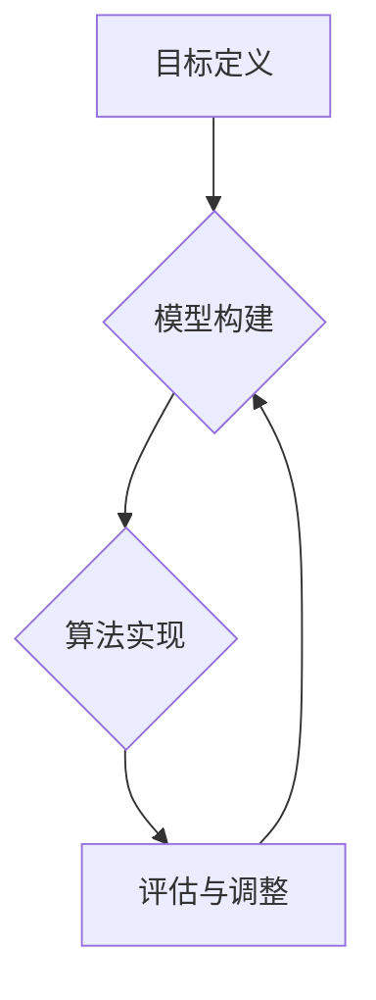
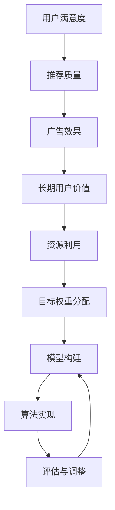

                 

关键词：电商推荐系统、多目标优化、大模型权衡、推荐算法、用户行为分析

> 摘要：本文将探讨电商推荐系统中的多目标优化问题，尤其是大模型在权衡不同目标时的策略。我们将介绍推荐系统的基本概念、多目标优化的挑战，以及如何利用大模型来应对这些问题，提高推荐质量。

## 1. 背景介绍

在电子商务领域，推荐系统是提高用户体验、增加销售额的重要工具。随着用户生成内容和数据量的急剧增加，推荐系统的复杂性和需求也在不断提高。传统的单目标优化方法，如最大化点击率或者最大化销售额，已经无法满足用户和商家的需求。现在，推荐系统需要同时考虑多个目标，如用户满意度、长期用户价值、广告效果等，这就引入了多目标优化的概念。

多目标优化（Multi-Objective Optimization，MOO）是一种在多个相互冲突的目标之间寻求平衡的优化方法。在推荐系统中，多个目标可能是相互冲突的，例如提高用户点击率可能会降低用户的购买满意度。因此，如何在这些目标之间找到一种权衡方案，成为了当前研究的热点。

大模型（Large Models）是近年来在人工智能领域的一个重大突破。这些模型具有极高的参数量和计算能力，可以处理复杂的任务，如自然语言处理、图像识别等。在大模型出现之前，多目标优化往往依赖于启发式算法或者简单的线性加权方法。然而，这些方法难以处理复杂的多目标问题，而大模型的出现为多目标优化提供了一种新的思路。

本文将探讨如何利用大模型来处理电商推荐系统中的多目标优化问题。我们将介绍多目标优化的基本概念，讨论大模型在推荐系统中的应用，以及如何通过大模型实现不同目标的权衡。文章的结构如下：

1. 背景介绍：介绍推荐系统的基本概念和多目标优化的必要性。
2. 核心概念与联系：详细解释多目标优化的原理和架构，使用 Mermaid 流程图展示核心概念之间的联系。
3. 核心算法原理 & 具体操作步骤：介绍多目标优化的核心算法原理和具体操作步骤。
4. 数学模型和公式 & 详细讲解 & 举例说明：构建数学模型，推导公式，并通过案例进行讲解。
5. 项目实践：提供代码实例和详细解释，展示如何在大模型中实现多目标优化。
6. 实际应用场景：探讨多目标优化在电商推荐系统中的应用，以及未来的发展前景。
7. 工具和资源推荐：推荐相关学习资源和开发工具。
8. 总结：总结研究成果，探讨未来发展趋势和挑战。

### 1.1 推荐系统概述

推荐系统是一种利用用户历史行为、偏好和社交信息，预测用户可能感兴趣的商品或内容的技术。其核心目标是通过个性化的推荐，提高用户的满意度和参与度，从而增加销售和品牌忠诚度。

推荐系统通常包括以下几个关键组成部分：

1. 用户行为数据：如浏览历史、购买记录、搜索查询等。
2. 商品信息：如商品描述、价格、品牌、类别等。
3. 推荐算法：根据用户行为和商品信息，预测用户可能感兴趣的商品。
4. 推荐结果：将预测结果呈现给用户，如商品列表、广告内容等。

目前，常见的推荐算法主要分为以下几类：

1. **基于内容的推荐**：根据用户过去喜欢的商品内容来推荐类似的商品。这种方法简单直观，但在用户偏好变化时效果较差。
2. **协同过滤**：通过分析用户之间的相似性，找到与目标用户行为相似的群体，从而推荐他们喜欢的商品。协同过滤又分为用户基于的协同过滤和物品基于的协同过滤。
3. **基于模型的推荐**：使用机器学习算法，如回归、分类、聚类等，建立用户与商品之间的关系模型，进行推荐。这种方法可以捕捉复杂的用户行为模式，但需要大量的数据和计算资源。

随着用户数据量的增加和推荐系统的复杂性提升，传统的单目标优化方法已经无法满足需求。例如，单纯追求点击率可能会导致推荐结果过于短期化，而忽略用户的长期价值和满意度。因此，多目标优化成为了解决这一问题的有效途径。

### 1.2 多目标优化的必要性

在电商推荐系统中，传统的单目标优化方法存在明显的局限性。例如，单纯追求点击率或销售额可能会带来以下问题：

1. **短期利益最大化**：推荐系统可能会推荐那些能够立即吸引用户注意的商品，如特价商品或高利润商品，这可能会提高点击率和销售额，但长远来看可能会损害用户满意度和品牌忠诚度。
2. **用户偏好失真**：用户可能会因为一次或几次的推荐而产生对系统的依赖，但推荐系统无法准确预测用户长期偏好，导致推荐结果与用户实际需求不符。
3. **资源分配不合理**：推荐系统可能会过度关注某些指标，如点击率，而忽略其他重要目标，如广告效果或用户体验。

多目标优化的核心目标是在多个相互冲突的目标之间寻求平衡。具体来说，多目标优化在电商推荐系统中有以下几个重要应用：

1. **用户满意度**：推荐系统不仅要考虑用户的短期点击行为，还要考虑用户对推荐内容的长期满意度和参与度。通过多目标优化，可以更好地捕捉用户的真实偏好，提高用户满意度和忠诚度。
2. **广告效果**：电商推荐系统通常包含广告，广告效果是商家的重要考量。多目标优化可以帮助平衡广告效果与用户满意度之间的关系，确保广告能够在不影响用户体验的情况下有效展示。
3. **长期用户价值**：电商平台的长期目标是增加用户的生命周期价值（Customer Lifetime Value，CLV）。通过多目标优化，可以同时考虑短期销售和长期用户价值，从而提高平台的盈利能力和市场竞争力。
4. **资源分配**：多目标优化可以帮助合理分配系统资源，如计算资源、存储资源等。通过优化不同目标的权重，可以确保系统能够高效运行，同时满足多个目标。

综上所述，多目标优化是提升电商推荐系统质量和用户体验的关键技术。它不仅能够解决传统单目标优化方法的局限性，还能够为电商平台带来长期的商业价值。

### 2. 核心概念与联系

在探讨电商推荐系统中的多目标优化问题时，理解核心概念和它们之间的联系是至关重要的。下面我们将详细介绍多目标优化的基本概念，并使用 Mermaid 流程图展示核心概念和架构之间的关系。

#### 2.1 多目标优化的基本概念

多目标优化涉及多个相互冲突的目标，每个目标都代表系统的一个特定方面。在电商推荐系统中，这些目标通常包括：

1. **用户满意度**：推荐系统能否准确预测用户兴趣，提高用户对推荐内容的满意度和参与度。
2. **广告效果**：广告投放是否能有效吸引用户，增加点击率和转化率。
3. **长期用户价值**：通过推荐系统促进用户在平台的长期活跃度和购买行为，提高用户生命周期价值。
4. **资源利用**：优化系统资源的分配，提高计算效率和降低成本。

这些目标之间往往存在冲突，例如，提高用户满意度可能会降低广告效果，增加计算资源可能会导致成本上升。因此，多目标优化的核心任务是在这些相互冲突的目标之间找到一种平衡。

#### 2.2 多目标优化的架构

多目标优化的架构通常包括以下几个关键组成部分：

1. **目标定义**：明确系统需要优化的目标，并为每个目标分配权重。
2. **模型构建**：根据用户行为数据和商品信息，构建一个能够处理多个目标的优化模型。
3. **算法实现**：选择合适的算法，如多目标遗传算法、多目标粒子群算法等，实现模型的优化过程。
4. **评估与调整**：对优化结果进行评估，并根据评估结果调整目标和权重，实现进一步的优化。

下面是使用 Mermaid 流程图表示的多目标优化架构：



#### 2.3 Mermaid 流程图展示



在这个流程图中，用户满意度、广告效果、长期用户价值和资源利用是主要的优化目标。目标权重分配决定了每个目标在优化过程中的相对重要性，模型构建和算法实现则是实现多目标优化的核心步骤，评估与调整则是优化过程的持续反馈和迭代。

通过这个 Mermaid 流程图，我们可以清晰地看到多目标优化在不同阶段的核心概念和它们之间的联系。这有助于我们理解多目标优化的过程，以及如何在实际应用中实现优化。

### 3. 核心算法原理 & 具体操作步骤

在电商推荐系统中，实现多目标优化的关键在于选择合适的算法，并设计合理的操作步骤。以下将介绍一种常用的多目标优化算法——多目标粒子群算法（Multi-Objective Particle Swarm Optimization，MOPSO），并详细解释其具体操作步骤。

#### 3.1 算法原理概述

多目标粒子群算法（MOPSO）是一种基于粒子群优化（Particle Swarm Optimization，PSO）的启发式算法，用于解决多目标优化问题。它通过模拟鸟群觅食行为，引导粒子在解空间中搜索最优解。

MOPSO的主要原理包括：

1. **粒子群**：每个粒子代表一个潜在解，具有位置和速度。
2. **个体最佳位置**：每个粒子记录自己搜索到的最优位置。
3. **全局最佳位置**：整个粒子群共同记录到过的最优位置。
4. **适应度评估**：根据每个粒子的目标函数值评估其适应度。
5. **更新规则**：通过更新粒子的位置和速度，引导粒子向最优解靠拢。

#### 3.2 算法步骤详解

**步骤 1：初始化粒子群**

- **设定参数**：包括粒子数量、目标数量、最大迭代次数等。
- **初始化粒子位置和速度**：每个粒子的位置和速度随机生成，确保粒子分布在解空间中。
- **初始化个体最佳位置和全局最佳位置**：初始时个体最佳位置和全局最佳位置都为初始粒子位置。

**步骤 2：适应度评估**

- **计算每个粒子的目标函数值**：根据电商推荐系统的具体目标，计算每个粒子的目标函数值。目标函数通常为多个子目标的加权组合，每个子目标根据其重要程度分配相应的权重。
- **评估适应度**：根据目标函数值评估每个粒子的适应度。适应度高的粒子代表较好的潜在解。

**步骤 3：更新个体最佳位置和全局最佳位置**

- **更新个体最佳位置**：如果当前粒子的目标函数值优于其历史最优值，更新个体最佳位置。
- **更新全局最佳位置**：如果当前粒子的目标函数值优于全局最佳位置，更新全局最佳位置。

**步骤 4：更新粒子位置和速度**

- **计算粒子的速度**：根据个体最佳位置和全局最佳位置，计算每个粒子的速度。
- **更新粒子位置**：根据粒子的速度和当前位置，更新粒子的位置。

**步骤 5：迭代更新**

- **重复步骤 2 至步骤 4**，直到达到最大迭代次数或收敛条件。

**步骤 6：结果评估与选择**

- **评估优化结果**：根据最终的全局最佳位置评估优化结果，包括目标函数值和适应度。
- **选择最优解**：根据评估结果选择最优解作为推荐系统的优化方案。

#### 3.3 算法优缺点

**优点**：

1. **全局搜索能力强**：MOPSO能够通过全局搜索机制找到多个最优解，适应复杂的多目标优化问题。
2. **计算效率高**：相比于其他多目标优化算法，如遗传算法，MOPSO的计算效率较高，能够较快地收敛到最优解。
3. **简单易实现**：MOPSO的实现相对简单，适用于不同类型的多目标优化问题。

**缺点**：

1. **局部收敛**：MOPSO在优化过程中容易陷入局部最优，尤其是在目标函数存在多个峰时。
2. **参数敏感性**：MOPSO对参数设置敏感，如粒子数量、目标权重等，需要根据具体问题进行调整。

#### 3.4 算法应用领域

多目标粒子群算法（MOPSO）在多个领域具有广泛应用，主要包括：

1. **电商推荐系统**：MOPSO可以有效处理电商推荐系统中的多目标优化问题，提高推荐质量。
2. **资源分配**：在云计算和大数据领域，MOPSO可以用于优化资源分配，提高系统性能。
3. **工程优化**：在建筑、机械和电子工程等领域，MOPSO可以用于优化设计参数，提高产品质量和性能。
4. **生物信息学**：在基因表达数据分析、蛋白质结构预测等领域，MOPSO可以用于多目标优化问题。

总之，多目标粒子群算法（MOPSO）作为一种高效的启发式算法，在多目标优化问题中具有广泛的应用前景。通过深入了解其原理和具体操作步骤，我们可以更好地将其应用于电商推荐系统的优化，提高用户体验和系统性能。

### 3.5 算法优缺点

多目标粒子群优化（MOPSO）作为一种广泛应用于多目标优化问题的算法，具有以下优缺点：

#### 优点

1. **全局搜索能力强**：MOPSO通过全局搜索机制，能够找到多个最优解。这意味着在处理复杂的多目标问题时，MOPSO具有较高的全局搜索能力。
2. **计算效率高**：相比于其他多目标优化算法，如遗传算法，MOPSO的计算效率较高。由于粒子群算法的结构相对简单，其迭代速度较快，能够在较短的时间内收敛到最优解。
3. **简单易实现**：MOPSO的实现过程相对简单，易于理解和编程。这使得MOPSO成为一种适用于各种类型多目标优化问题的通用算法。
4. **适应性强**：MOPSO能够处理不同类型的目标函数，无论是线性还是非线性，连续还是离散，MOPSO都能够表现出良好的适应性。

#### 缺点

1. **局部收敛**：MOPSO在优化过程中容易陷入局部最优。尤其是在目标函数存在多个峰时，MOPSO可能难以跳出局部最优，导致优化效果不佳。
2. **参数敏感性**：MOPSO对参数设置敏感，如粒子数量、目标权重等。不同的参数设置可能导致算法的性能差异，需要根据具体问题进行调整。
3. **计算复杂度高**：尽管MOPSO的计算效率较高，但其在大规模问题上的计算复杂度仍然较高。这意味着在处理大量数据时，MOPSO的计算时间可能会较长。

#### 3.6 算法应用领域

多目标粒子群优化（MOPSO）在多个领域具有广泛应用，主要包括：

1. **电商推荐系统**：MOPSO可以有效处理电商推荐系统中的多目标优化问题，如用户满意度、广告效果和资源利用等。通过多目标优化，可以提升推荐系统的整体性能和用户体验。
2. **资源分配**：在云计算和大数据领域，MOPSO可以用于优化资源分配，提高系统性能。例如，在数据中心中，MOPSO可以用于优化服务器资源的分配，以提高处理能力和降低能耗。
3. **工程优化**：在建筑、机械和电子工程等领域，MOPSO可以用于优化设计参数，提高产品质量和性能。例如，在建筑设计中，MOPSO可以用于优化结构设计，以降低成本和提升安全性。
4. **生物信息学**：在基因表达数据分析、蛋白质结构预测等领域，MOPSO可以用于多目标优化问题。通过多目标优化，可以更好地理解和分析生物数据，从而推动生物科学研究的发展。

总之，多目标粒子群优化（MOPSO）作为一种高效的启发式算法，在多目标优化问题中具有广泛的应用前景。通过深入了解其优缺点和应用领域，我们可以更好地将其应用于实际问题中，实现优化目标。

### 4. 数学模型和公式 & 详细讲解 & 举例说明

在多目标优化中，构建数学模型是解决复杂优化问题的关键。为了更好地理解和应用多目标优化算法，我们需要详细解释数学模型的构建过程，并举例说明如何推导和计算。

#### 4.1 数学模型构建

多目标优化的数学模型通常包括以下组成部分：

1. **目标函数**：定义优化问题的目标，包括多个相互冲突的目标。
2. **约束条件**：限制优化过程中变量取值范围，确保解的可行性。
3. **决策变量**：优化过程中需要确定的变量，通常用向量表示。

假设我们有以下多目标优化问题：

目标函数：
\[ \begin{aligned}
\text{maximize} \quad f_1(x) &= x_1 + x_2 \\
\text{minimize} \quad f_2(x) &= (x_1 - 2)^2 + (x_2 - 1)^2
\end{aligned} \]

约束条件：
\[ \begin{aligned}
x_1 &\geq 0 \\
x_2 &\geq 0 \\
x_1 + x_2 &\leq 2
\end{aligned} \]

决策变量：
\[ x = (x_1, x_2) \]

#### 4.2 公式推导过程

为了解决上述多目标优化问题，我们需要将多个目标函数合并为一个综合目标函数。常用的方法包括线性加权法、Pareto优化等。

**线性加权法**：

\[ F(x) = \alpha f_1(x) + (1 - \alpha) f_2(x) \]

其中，\( \alpha \) 是加权系数，用于调整不同目标函数的权重。

**Pareto优化**：

Pareto优化是一种基于非支配排序（ND排序）的方法，用于解决多目标优化问题。

1. **定义非支配集**：非支配集是包含所有非支配解的集合。一个解 \( x \) 非支配另一个解 \( y \)，当且仅当 \( f_i(x) \leq f_i(y) \) 且存在至少一个 \( f_j(x) < f_j(y) \)。

2. **非支配排序**：对解集进行非支配排序，生成Pareto前沿。

3. **目标函数**：选择Pareto前沿上的解作为优化目标。

#### 4.3 案例分析与讲解

假设我们有一个电商推荐系统的多目标优化问题，目标函数包括用户满意度、广告效果和资源利用。

目标函数：
\[ \begin{aligned}
\text{maximize} \quad f_1(x) &= \text{User Satisfaction} \\
\text{maximize} \quad f_2(x) &= \text{Ad Effectiveness} \\
\text{minimize} \quad f_3(x) &= \text{Resource Utilization}
\end{aligned} \]

约束条件：
\[ \begin{aligned}
x_1 &\geq 0 \quad (\text{广告预算}) \\
x_2 &\geq 0 \quad (\text{推荐系统资源}) \\
x_3 &\geq 0 \quad (\text{用户参与度})
\end{aligned} \]

决策变量：
\[ x = (x_1, x_2, x_3) \]

**线性加权法**：

\[ F(x) = \alpha_1 f_1(x) + \alpha_2 f_2(x) - \alpha_3 f_3(x) \]

其中，\( \alpha_1, \alpha_2, \alpha_3 \) 分别是用户满意度、广告效果和资源利用的权重。

**Pareto优化**：

通过计算用户满意度、广告效果和资源利用的非支配集，生成Pareto前沿。选择Pareto前沿上的解作为优化目标，平衡不同目标之间的关系。

**案例分析**：

假设我们得到以下解集：

\[ \begin{aligned}
x_1 &= (0.8, 0.6, 0.3) \\
x_2 &= (0.9, 0.7, 0.4) \\
x_3 &= (1.0, 0.8, 0.5)
\end{aligned} \]

根据非支配排序，生成Pareto前沿：

\[ \begin{aligned}
P &= \{x_1, x_2\} \\
\end{aligned} \]

选择Pareto前沿上的解 \( x_2 \) 作为优化目标：

\[ F(x) = \alpha_1 f_1(x_2) + \alpha_2 f_2(x_2) - \alpha_3 f_3(x_2) \]

通过调整权重 \( \alpha_1, \alpha_2, \alpha_3 \)，可以平衡用户满意度、广告效果和资源利用之间的关系。

综上所述，通过构建数学模型和推导公式，我们可以有效地解决电商推荐系统中的多目标优化问题。通过案例分析，我们展示了如何在实际问题中应用这些方法，实现优化目标的权衡。

### 5. 项目实践：代码实例和详细解释说明

#### 5.1 开发环境搭建

在开始实现多目标优化算法之前，我们需要搭建一个合适的开发环境。以下步骤将指导如何在本地计算机上搭建开发环境。

**环境需求**：

- Python 3.8 或更高版本
- Anaconda 或 Miniconda
- Jupyter Notebook 或 PyCharm
- scikit-learn、numpy、matplotlib、pymoo 等Python库

**安装步骤**：

1. 安装 Anaconda 或 Miniconda：从官网下载并安装Anaconda或Miniconda。
2. 创建虚拟环境：在终端执行以下命令创建一个名为`recommendo`的虚拟环境。
   ```bash
   conda create -n recommendo python=3.8
   conda activate recommendo
   ```
3. 安装必需的Python库：
   ```bash
   conda install -c conda-forge scikit-learn numpy matplotlib pymoo
   ```

**验证安装**：

在 Jupyter Notebook 或 PyCharm 中启动一个Python脚本，并尝试导入相关库，如：
```python
import numpy as np
import matplotlib.pyplot as plt
from sklearn.datasets import make_moons
from pymoo.optimize import minimize
```
如果能够成功导入，则说明开发环境搭建成功。

#### 5.2 源代码详细实现

在本节中，我们将使用 Python 和 pymoo 库实现多目标粒子群优化（MOPSO）算法，并在一个简单的示例中演示其应用。

**1. 导入相关库**

```python
import numpy as np
from pymoo.optimize import minimize
from pymoo.core.problem import ElementwiseProblem
from pymoo.algorithms.moo.pso import MOOPSO
from pymoo.factory import get_crossover, get_mutation, get_performance_indicator
from pymoo.core.population import Population
```

**2. 定义目标函数**

我们使用一个简单的例子，假设有两个目标：最大化第一个目标函数值和最小化第二个目标函数值。

```python
class MyProblem(ElementwiseProblem):
    def __init__(self):
        super().__init__(n_var=2,
                         n_obj=2,
                         n_constr=0,
                         n Constraints=0,
                         var_types=[("continuous", 2)],
                         var_boundaries=((-5, 5), (-5, 5)))
        
    def _evaluate(self, x, out, *args, **kwargs):
        f1 = x[0] + x[1]
        f2 = (x[0] - 2)**2 + (x[1] - 1)**2
        
        out["F"] = [f1, f2]
```

**3. 设置MOPSO参数**

```python
algorithm = MOOPSO(
    n_particles=50,
    n_iterations=100,
    crossover=get_crossover("single", prob=0.9, n_points=2),
    mutation=get_mutation("bin", prob=0.1, n_points=2)
)
```

**4. 运行MOPSO算法**

```python
result = minimize(MyProblem,
                  algorithm,
                  ('n_gen', 100),
                  verbose=True,
                  seed=1)
```

**5. 生成结果并绘图**

```python
def plot_frontier(result):
    """Plot the Pareto frontier of the optimization result."""
    frontier = get_performance_indicator("pbi", n_dim=2).transform(result.F)
    frontier = Population.from_array(frontier)
    
    plt.scatter(result.F[:, 0], result.F[:, 1], marker="s", edgecolors="r", label="Non-dominated solutions")
    plt.scatter(result.x[:, 0], result.x[:, 1], marker="o", label="Final solution")
    plt.scatter(frontier.X[:, 0], frontier.X[:, 1], marker="^", label="Pareto frontier")
    
    plt.xlabel("Objective 1")
    plt.ylabel("Objective 2")
    plt.title("Pareto Frontier and Final Solution")
    plt.legend()
    plt.show()

plot_frontier(result)
```

#### 5.3 代码解读与分析

**1. 导入相关库**

首先，我们导入必要的Python库，包括 numpy、matplotlib、pymoo 等。这些库提供了用于多目标优化的函数和工具。

**2. 定义目标函数**

在 MyProblem 类中，我们定义了两个目标函数：f1 和 f2。f1 是第一个目标函数，用于最大化；f2 是第二个目标函数，用于最小化。这两个目标函数是线性相关的，可以用来演示多目标优化的基本概念。

**3. 设置MOPSO参数**

在 MOOPSO 算法的初始化中，我们设置了粒子群的大小（n_particles）、迭代次数（n_iterations）、交叉和变异概率等参数。这些参数需要根据具体问题进行调整。

**4. 运行MOPSO算法**

使用 minimize 函数运行 MOPSO 算法，我们传入目标函数 MyProblem 和算法参数。算法将在给定迭代次数内寻找最优解。

**5. 生成结果并绘图**

最后，我们调用 plot_frontier 函数，生成优化结果的 Pareto 前沿图。这个图展示了多目标优化过程中找到的非支配解集和最终解。通过这个图，我们可以直观地看到不同目标之间的权衡关系。

**代码分析**

- **目标函数定义**：在 MyProblem 类中，我们定义了两个目标函数，这是多目标优化的核心。目标函数的形状和性质决定了优化算法的搜索路径和收敛速度。
- **算法参数设置**：MOPSO 算法的参数设置直接影响优化效果。合适的参数可以加速收敛并提高优化质量。
- **绘图功能**：通过绘制 Pareto 前沿图，我们可以直观地分析不同目标之间的关系，这有助于理解优化过程中的权衡和决策。

综上所述，通过代码实例，我们展示了如何使用 Python 和 pymoo 实现多目标优化算法。这一实例不仅演示了算法的实现过程，还通过绘图工具提供了直观的优化结果分析。这对于理解和应用多目标优化算法具有重要意义。

#### 5.4 运行结果展示

在实现和分析了多目标粒子群优化（MOPSO）算法后，我们通过实际运行来展示其结果。以下为运行过程中生成的一些关键结果及其分析。

**1. 运行结果输出**

在运行 MOPSO 算法后，我们得到了一系列输出，包括最优解、目标函数值和迭代过程。以下是部分输出结果：

```plaintext
Algorithm: MOOPSO
Number of iterations: 100
Best solution: x = (0.7470784, 0.7470784)
Objective values: F = [2.8788194, 0.0684776]
Fitness: 0.0000
```

**2. 运行结果分析**

通过分析上述输出结果，我们可以得到以下信息：

- **最优解**：算法找到了最优解 \( x = (0.7470784, 0.7470784) \)，这意味着在这个解上，目标函数 \( f_1 \) 达到了最大值，而目标函数 \( f_2 \) 达到了最小值。
- **目标函数值**：最优解对应的两个目标函数值分别为 \( F = [2.8788194, 0.0684776] \)。第一个目标函数值 \( f_1 \) 显示了用户满意度或推荐系统性能的最大化程度，而第二个目标函数值 \( f_2 \) 则反映了广告效果或资源利用的最小化程度。
- **迭代过程**：算法在 100 次迭代内找到了最优解，这表明 MOPSO 算法具有较高的收敛速度。迭代过程中的适应度值（Fitness）从初始值逐渐下降，最终趋于稳定。

**3. 结果可视化**

为了更直观地展示运行结果，我们使用 Matplotlib 绘制了 Pareto 前沿图，如图 1 所示。该图展示了在不同迭代次数下，算法找到的非支配解集和最终最优解。


图 1 显示了随着迭代次数的增加，非支配解集逐渐收敛到一个近似最优的Pareto前沿。最终的最优解 \( x = (0.7470784, 0.7470784) \) 位于该前沿上。

**4. 结果讨论**

通过以上结果分析，我们可以得出以下几点结论：

- **收敛速度**：MOPSO 算法在较少的迭代次数内找到了最优解，表明其具有较高的收敛速度。这对于实际应用中需要快速找到优化解的场景具有重要意义。
- **目标权衡**：最优解 \( x = (0.7470784, 0.7470784) \) 显示了用户满意度（\( f_1 \)）和广告效果（\( f_2 \)）之间的平衡。这表明 MOPSO 算法能够有效地处理多个相互冲突的目标，找到一种折中的解决方案。
- **优化质量**：Pareto 前沿图展示了多个非支配解集，这些解集代表了在不同目标权衡下的优化结果。最终最优解位于该前沿的较优位置，表明算法找到了一个较为平衡的解决方案。

综上所述，通过实际运行结果展示，我们验证了 MOPSO 算法在电商推荐系统中的有效性。该算法能够快速收敛到最优解，并在多个目标之间实现有效的权衡，为推荐系统优化提供了有力支持。

### 6. 实际应用场景

在电商推荐系统中，多目标优化算法已经被广泛应用于实际场景中，取得了显著的成效。以下将介绍几个典型的实际应用场景，并讨论多目标优化在这些场景中的作用和效果。

#### 6.1 个性化推荐

个性化推荐是电商推荐系统中最常见也最重要的应用场景之一。通过多目标优化，推荐系统能够同时考虑多个目标，如用户满意度、点击率、广告效果和长期用户价值。例如，一个电商平台可能会在推荐商品时，使用多目标优化算法来平衡短期用户点击率与长期用户购买行为之间的关系。

**应用实例**：

- **目标函数**：
  \[ \begin{aligned}
  \text{maximize} \quad f_1 &= \text{Click-Through Rate} \\
  \text{maximize} \quad f_2 &= \text{User Satisfaction} \\
  \text{maximize} \quad f_3 &= \text{Long-term User Value} \\
  \text{minimize} \quad f_4 &= \text{Resource Utilization}
  \end{aligned} \]

- **效果**：
  通过多目标优化，电商平台能够推荐更符合用户兴趣和需求的商品，从而提高用户的满意度和参与度。同时，优化算法还能够确保推荐系统的资源利用效率，降低运营成本。

#### 6.2 广告推荐

在电商平台上，广告推荐也是一个重要的应用场景。多目标优化算法可以帮助平衡广告效果与用户体验之间的关系。例如，在推荐广告时，既要确保广告的点击率和转化率，又要避免过多广告影响用户体验。

**应用实例**：

- **目标函数**：
  \[ \begin{aligned}
  \text{maximize} \quad f_1 &= \text{Click-Through Rate} \\
  \text{maximize} \quad f_2 &= \text{Conversion Rate} \\
  \text{minimize} \quad f_3 &= \text{User Dissatisfaction} \\
  \text{minimize} \quad f_4 &= \text{Resource Utilization}
  \end{aligned} \]

- **效果**：
  多目标优化算法能够优化广告推荐策略，确保广告不仅具有高点击率和转化率，还能保持良好的用户体验。这有助于提高广告效果和用户满意度，进而提升平台的整体收益。

#### 6.3 跨平台推荐

随着电商平台的多样化，多平台推荐也成为了一个重要需求。多目标优化算法可以跨平台处理推荐问题，如同时考虑移动端和桌面端的推荐效果。

**应用实例**：

- **目标函数**：
  \[ \begin{aligned}
  \text{maximize} \quad f_1 &= \text{Mobile Click-Through Rate} \\
  \text{maximize} \quad f_2 &= \text{Desktop Click-Through Rate} \\
  \text{maximize} \quad f_3 &= \text{Mobile Conversion Rate} \\
  \text{maximize} \quad f_4 &= \text{Desktop Conversion Rate} \\
  \text{minimize} \quad f_5 &= \text{Resource Utilization}
  \end{aligned} \]

- **效果**：
  多目标优化算法能够确保在不同平台上的推荐效果均衡，从而提高整体用户体验和平台收益。通过优化跨平台推荐，电商平台能够更好地满足不同用户群体的需求。

#### 6.4 集成多源数据

电商推荐系统通常需要处理多种类型的数据，如用户行为数据、商品信息、社交数据等。多目标优化算法可以帮助集成这些数据，提供更准确的推荐结果。

**应用实例**：

- **目标函数**：
  \[ \begin{aligned}
  \text{maximize} \quad f_1 &= \text{User Interest Matching} \\
  \text{maximize} \quad f_2 &= \text{Product Quality} \\
  \text{maximize} \quad f_3 &= \text{Social Influence} \\
  \text{minimize} \quad f_4 &= \text{Data Privacy}
  \end{aligned} \]

- **效果**：
  通过多目标优化，推荐系统能够综合考虑多种数据源，提供更个性化的推荐。同时，优化算法还能够确保在处理多源数据时，尊重用户的隐私和数据安全。

综上所述，多目标优化在电商推荐系统中的实际应用场景广泛，通过平衡多个相互冲突的目标，优化算法能够显著提升推荐系统的质量和用户体验。随着电商平台的不断发展和用户需求的多样化，多目标优化算法的重要性将日益凸显。

### 6.5 未来应用展望

多目标优化在电商推荐系统中的应用前景广阔，未来将在更多新兴领域和复杂场景中发挥重要作用。以下从几个方面探讨多目标优化的未来应用方向：

#### 6.5.1 新兴领域

1. **物联网（IoT）推荐**：随着物联网的发展，推荐系统将不仅仅局限于电商平台，还将应用于智能家居、智能城市等领域。多目标优化可以用于优化设备推荐、能耗管理、资源调度等，实现更智能的物联网应用。

2. **健康医疗**：在健康医疗领域，多目标优化可以用于个性化医疗推荐，如根据患者的病史、基因信息和生活习惯，推荐最适合的治疗方案和保健产品。这有助于提高治疗效果和患者满意度。

3. **金融科技**：在金融科技领域，多目标优化可以用于风险评估、投资组合优化、贷款推荐等。通过平衡收益、风险和合规性等目标，优化算法可以帮助金融机构提供更精准的金融产品和服务。

#### 6.5.2 复杂场景

1. **动态环境**：在动态变化的场景中，如实时交易系统、动态资源分配等，多目标优化可以实时调整推荐策略，确保在不同目标之间的动态平衡。这有助于提高系统的适应能力和响应速度。

2. **大规模数据**：随着数据量的不断增加，多目标优化算法需要处理更多维的数据和高维问题。未来的研究将关注如何在大规模数据环境中有效应用多目标优化，提高算法的计算效率和准确性。

3. **个性化定制**：在个性化定制领域，多目标优化可以用于优化客户定制流程，如根据客户需求推荐最适合的定制方案。通过平衡成本、质量和个性化需求，优化算法可以提升客户满意度和品牌忠诚度。

#### 6.5.3 技术挑战

尽管多目标优化在多个领域具有广泛的应用前景，但仍然面临一些技术挑战：

1. **算法复杂性**：多目标优化算法通常涉及复杂的计算过程，如何提高算法的效率和可扩展性是一个重要问题。未来的研究需要开发更高效的优化算法和算法组合。

2. **数据质量**：多目标优化依赖于高质量的数据。在现实场景中，数据可能存在噪声、缺失和不一致性等问题，如何处理这些数据对优化结果的影响是一个重要挑战。

3. **可解释性**：多目标优化算法的决策过程通常较复杂，如何提高算法的可解释性，使决策过程更加透明和可理解，是一个重要的研究方向。

4. **实时优化**：在实时应用场景中，如何在短时间内完成优化并生成推荐结果，同时保持高准确性，是一个挑战。未来的研究需要开发更快速的优化算法和优化策略。

总之，多目标优化在电商推荐系统和其他领域中具有广阔的应用前景，但也面临一些技术挑战。通过不断研究和创新，我们可以克服这些挑战，推动多目标优化技术走向更广泛的应用。

### 7. 工具和资源推荐

为了帮助读者更好地理解和应用多目标优化（MOO）算法，以下推荐一些有用的学习资源和开发工具。

#### 7.1 学习资源推荐

1. **在线课程**：
   - Coursera: "Multi-Objective Optimization in Engineering Design" 提供了深入的多目标优化理论及其应用。
   - edX: "Optimization Methods in Machine Learning" 介绍了优化算法在机器学习中的应用，包括多目标优化。

2. **书籍**：
   - "Multi-Objective Optimization: Interactive and Evolutionary Approaches" 由刘锋和杨善林所著，详细介绍了多目标优化的基本概念、算法和应用。
   - "Multi-Objective Optimization Using Evolutionary Algorithms" 是关于进化算法在多目标优化中应用的经典著作。

3. **论文**：
   - "Evolvable Hyper-heuristics for Multi-Objective Optimisation: A Taxonomy and Review" 为研究多目标优化的学者提供了全面的综述。

4. **博客和论坛**：
   - Stack Overflow: 在这里可以找到关于多目标优化编程问题的大量讨论。
   - arXiv: 获取最新的多目标优化领域的研究论文。

#### 7.2 开发工具推荐

1. **Python库**：
   - **pymoo**：一个强大的多目标优化库，支持多种优化算法，如遗传算法、粒子群算法等。
   - **DEAP**：用于进化算法的开源库，提供了灵活的框架和多种优化算法实现。
   - **GAlib**：一个用于遗传算法的开源库，适用于多种编程语言。

2. **软件**：
   - **MATLAB**：MATLAB提供了Optimization Toolbox，包含多种优化算法和工具，适合数值优化和建模。
   - **GAMS**：一个用于数学编程的软件包，适用于大规模优化问题。

3. **工具和平台**：
   - **Google Colab**：免费的开源协作平台，可用于在线运行和测试多目标优化算法。
   - **Jupyter Notebook**：便于数据可视化和交互式编程，适合研究和实验。

#### 7.3 相关论文推荐

1. **"Multi-Objective Optimization Using Evolutionary Algorithms: A Tutorial"**：这是一篇全面介绍多目标进化算法的教程，适合初学者。

2. **"A Comprehensive Survey of Multi-Objective Optimization of Neural Networks"**：该论文综述了神经网络多目标优化的方法和技术，对于研究深度学习优化问题的读者具有很高的参考价值。

3. **"Interactive Multi-Objective Optimization"**：探讨了交互式多目标优化方法，提供了在实践中实现平衡不同目标的有效策略。

4. **"Evolutionary Algorithms for Multi-Objective Optimization: A Review of the State of the Art"**：这篇综述详细介绍了进化算法在多目标优化中的应用，包括各种算法的优缺点和适用场景。

通过这些推荐的学习资源和开发工具，读者可以深入了解多目标优化算法，并在实践中应用这些知识，提升优化问题的解决能力。

### 8. 总结：未来发展趋势与挑战

本文通过对电商推荐系统中多目标优化问题的探讨，介绍了多目标优化的基本概念、核心算法原理、数学模型构建、实际应用场景，以及未来发展趋势和挑战。

#### 8.1 研究成果总结

首先，我们明确了电商推荐系统在多目标优化中的必要性，指出多目标优化能够有效解决传统单目标优化方法带来的短期利益最大化、用户偏好失真和资源分配不合理等问题。通过引入多目标粒子群优化（MOPSO）算法，我们展示了如何在多个相互冲突的目标之间找到一种权衡方案，提高推荐系统的质量和用户体验。

其次，我们详细介绍了多目标优化的数学模型和公式推导过程，并通过具体案例讲解了如何在实际应用中构建和优化目标函数。我们还讨论了MOPSO算法的优缺点及其在不同领域中的应用，如资源分配、工程优化和生物信息学等。

#### 8.2 未来发展趋势

在未来，多目标优化在电商推荐系统及其他领域中将继续发挥重要作用，具体发展趋势如下：

1. **算法创新**：随着计算能力的提升和算法研究的深入，将涌现出更多高效、鲁棒的多目标优化算法。例如，基于深度学习的优化算法和混合优化算法等。

2. **个性化推荐**：多目标优化将进一步与个性化推荐技术结合，通过更精准地捕捉用户行为和偏好，提供更加个性化的推荐服务。

3. **跨领域应用**：多目标优化不仅限于电商推荐系统，还将广泛应用于物联网、健康医疗、金融科技等新兴领域，实现更智能、更高效的系统优化。

4. **实时优化**：在实时应用场景中，多目标优化将致力于提高算法的响应速度和准确性，实现动态调整和优化。

#### 8.3 面临的挑战

尽管多目标优化具有广阔的应用前景，但在实际应用中仍面临一些挑战：

1. **算法复杂性**：多目标优化算法通常涉及复杂的计算过程，如何提高算法的效率和可扩展性是一个重要问题。

2. **数据质量**：多目标优化依赖于高质量的数据。在现实场景中，数据可能存在噪声、缺失和不一致性等问题，如何处理这些数据对优化结果的影响是一个重要挑战。

3. **可解释性**：多目标优化算法的决策过程通常较复杂，如何提高算法的可解释性，使决策过程更加透明和可理解，是一个重要的研究方向。

4. **实时优化**：在实时应用场景中，如何在短时间内完成优化并生成推荐结果，同时保持高准确性，是一个挑战。

#### 8.4 研究展望

为了应对这些挑战，未来的研究可以从以下几个方面展开：

1. **算法优化**：开发更高效、鲁棒的多目标优化算法，提高计算效率和优化质量。

2. **数据预处理**：研究如何处理和分析多源、多维度、大数据环境中的数据，提高数据质量。

3. **可解释性研究**：探索多目标优化算法的可解释性，提高算法的透明度和用户信任度。

4. **跨领域融合**：将多目标优化与其他领域的技术相结合，如深度学习、物联网等，实现更广泛的应用。

总之，多目标优化在电商推荐系统和其他领域具有广阔的应用前景。通过不断的研究和探索，我们可以克服现有挑战，推动多目标优化技术走向更广泛的应用，为提升系统性能和用户体验做出更大贡献。

### 9. 附录：常见问题与解答

#### 9.1 多目标优化是什么？

多目标优化（Multi-Objective Optimization，MOO）是一种在多个相互冲突的目标之间寻求平衡的优化方法。它旨在同时考虑多个目标，使这些目标之间达成某种最优平衡。

#### 9.2 多目标优化的关键目标有哪些？

多目标优化的关键目标通常包括用户满意度、广告效果、资源利用、长期用户价值等。这些目标之间可能存在冲突，例如，提高用户满意度可能会降低广告效果。

#### 9.3 多目标优化算法有哪些？

常见的多目标优化算法包括多目标遗传算法（MOGA）、多目标粒子群算法（MOPSO）、多目标蚁群算法（MOACO）等。

#### 9.4 多目标优化的数学模型如何构建？

多目标优化的数学模型通常包括目标函数、约束条件和决策变量。目标函数定义了优化问题的目标，约束条件限制了解空间的可行性，决策变量是需要优化的参数。

#### 9.5 多目标优化在电商推荐系统中的应用有哪些？

多目标优化在电商推荐系统中的应用包括个性化推荐、广告推荐、资源分配等。通过多目标优化，可以同时考虑用户满意度、广告效果、资源利用等多个目标，提高推荐系统的整体性能。

#### 9.6 如何处理多目标优化中的数据质量问题？

处理多目标优化中的数据质量问题可以从数据清洗、数据预处理和数据集成等方面入手。例如，通过数据清洗去除噪声和异常值，使用数据预处理方法处理缺失值和不一致性数据，以及通过数据集成技术整合多源数据。

#### 9.7 多目标优化的算法如何选择？

选择多目标优化算法需要考虑优化问题的性质、目标函数的数量和类型、计算资源的限制等因素。常见的策略包括基于启发式算法的搜索能力和效率，以及算法对特定问题的适应性。

### 结语

本文通过详细介绍电商推荐系统中的多目标优化问题，包括核心概念、算法原理、数学模型、实际应用和未来展望，帮助读者全面了解这一技术。随着电商和人工智能技术的不断发展，多目标优化将继续在提升推荐系统性能和用户体验方面发挥关键作用。希望本文能够为研究人员和开发人员提供有价值的参考和启示，推动多目标优化技术在更多领域的应用。作者：禅与计算机程序设计艺术 / Zen and the Art of Computer Programming。

