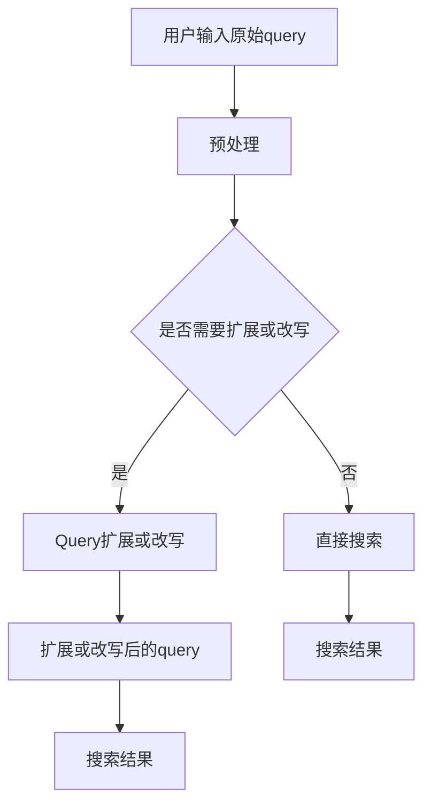

                 

关键词：电商搜索、query扩展、改写、搜索引擎、用户交互、信息检索、自然语言处理、机器学习、算法优化、用户体验。

## 摘要

本文旨在深入探讨电商搜索中的query扩展与改写技术，分析其原理、算法及其在提升用户搜索体验和搜索引擎性能方面的关键作用。文章首先介绍了电商搜索的基本概念和需求，随后详细讨论了query扩展与改写的核心算法原理，并通过实例展示了数学模型和公式的推导与应用。此外，文章还提供了具体的代码实例和实践，最后对未来在该领域的发展趋势与挑战进行了展望。

## 1. 背景介绍

### 1.1 电商搜索的发展背景

随着互联网的普及和电子商务的迅速发展，电商搜索已经成为用户获取商品信息、完成购物行为的重要途径。传统的电商搜索主要依赖于关键词匹配和简单的搜索建议，这种方式在一定程度上能够满足用户的基本需求，但随着用户查询的多样性和复杂性增加，单一的匹配方式已经无法满足用户的期望。

### 1.2 Query扩展与改写的必要性

query扩展与改写技术是为了提升电商搜索的准确性和用户体验而提出的。这种技术通过对用户输入的原始query进行扩展和改写，使得搜索系统能够更准确地理解用户的意图，从而提供更加精准的搜索结果。例如，当用户输入一个简单的关键词时，系统可以通过扩展算法将其转换为更加详细的查询，以获取更相关的商品信息。

### 1.3 Query扩展与改写的重要性

query扩展与改写对于电商搜索系统具有重要意义：

1. **提高搜索准确性**：通过扩展和改写，系统能够更准确地理解用户的查询意图，减少查询误差，提高搜索结果的准确性。

2. **优化用户体验**：精准的搜索结果能够提高用户的满意度，减少用户在浏览大量无关信息时的疲劳感。

3. **提升搜索引擎性能**：优化后的查询能够减少搜索时间，提高系统响应速度，提升整体性能。

## 2. 核心概念与联系

### 2.1 Query扩展

Query扩展是指通过分析用户输入的原始query，添加或替换一些关键词或短语，使其更加详细和具体，从而提高搜索结果的准确性。常见的扩展方式包括：

1. **同义词扩展**：将用户查询中的关键词替换为其同义词，例如“鞋子”可以扩展为“运动鞋”、“皮鞋”等。

2. **上下文扩展**：根据用户的查询上下文，添加或替换相关的关键词或短语，例如“红皮鞋女”可以扩展为“高跟鞋 红色 女士”。

3. **属性扩展**：提取用户查询中的属性信息，并扩展相关的属性关键词，例如“苹果手机”可以扩展为“苹果 iPhone 13”。

### 2.2 Query改写

Query改写是指通过对原始query进行结构上的调整，使其更符合搜索引擎的索引规则，从而提高搜索结果的精度。常见的改写方式包括：

1. **语法修正**：纠正用户输入的语法错误，使其符合标准的查询语句，例如“手机红色的”可以改写为“红色手机”。

2. **逻辑改写**：根据用户查询的逻辑关系，重新组合关键词，使其更加清晰和具体，例如“手机和电脑”可以改写为“手机 或 电脑”。

3. **语义改写**：通过理解用户查询的语义，将原始query转换为更加简洁或更加具体的查询语句，例如“苹果最新手机”可以改写为“iPhone 13”。

### 2.3 Mermaid 流程图



## 3. 核心算法原理 & 具体操作步骤

### 3.1 算法原理概述

电商搜索中的query扩展与改写算法主要包括以下几个核心步骤：

1. **预处理**：对用户输入的原始query进行格式化、去噪等处理，使其符合搜索算法的要求。

2. **词频统计**：对预处理后的query进行词频统计，识别高频关键词和属性。

3. **扩展算法**：根据高频关键词和属性，利用同义词扩展、上下文扩展和属性扩展等方法，对query进行扩展。

4. **改写算法**：通过语法修正、逻辑改写和语义改写等方法，对query进行改写。

5. **后处理**：对扩展和改写后的query进行优化，去除冗余信息，提高查询的精度和效率。

### 3.2 算法步骤详解

#### 3.2.1 预处理

预处理是query扩展与改写的基础，主要包括以下步骤：

1. **格式化**：将用户输入的query进行格式化处理，去除多余的空格、符号等。

2. **去噪**：识别并去除query中的噪声词，如“的”、“了”、“啊”等，这些词通常对查询结果的影响较小。

3. **分词**：对query进行分词处理，将其分解为单个词汇，便于后续处理。

#### 3.2.2 词频统计

词频统计是对预处理后的query进行统计分析，识别高频关键词和属性。具体步骤如下：

1. **计算词频**：统计每个词在query中出现的次数，生成词频分布。

2. **识别高频关键词**：根据词频分布，识别出现次数较多的高频关键词。

3. **识别属性**：从高频关键词中提取出与商品属性相关的词，如“红色”、“iPhone”等。

#### 3.2.3 扩展算法

扩展算法是query扩展的核心，主要包括以下方法：

1. **同义词扩展**：利用同义词词典，将高频关键词替换为同义词，如“鞋子”替换为“运动鞋”、“皮鞋”等。

2. **上下文扩展**：根据高频关键词和属性，在query中添加相关的上下文信息，如“红皮鞋女”可以扩展为“高跟鞋 红色 女士”。

3. **属性扩展**：提取高频关键词中的属性信息，并扩展相关的属性关键词，如“苹果手机”可以扩展为“苹果 iPhone 13”。

#### 3.2.4 改写算法

改写算法是对扩展后的query进行优化，以提高搜索结果的精度。具体步骤如下：

1. **语法修正**：纠正query中的语法错误，使其符合标准的查询语句。

2. **逻辑改写**：根据query的逻辑关系，重新组合关键词，使其更加清晰和具体。

3. **语义改写**：通过理解query的语义，将其转换为更加简洁或更加具体的查询语句。

#### 3.2.5 后处理

后处理是对扩展和改写后的query进行优化，主要包括以下步骤：

1. **去除冗余信息**：去除query中冗余的词或短语，如“的”、“和”等。

2. **优化查询长度**：根据查询结果的精度和效率，调整query的长度，使其在保证精度的基础上，尽可能缩短查询时间。

### 3.3 算法优缺点

**优点**：

1. **提高搜索准确性**：通过扩展和改写，能够更准确地理解用户的查询意图，减少查询误差。

2. **优化用户体验**：精准的搜索结果能够提高用户的满意度，减少用户在浏览大量无关信息时的疲劳感。

3. **提升搜索引擎性能**：优化后的查询能够减少搜索时间，提高系统响应速度，提升整体性能。

**缺点**：

1. **计算复杂度高**：query扩展与改写涉及大量计算，对于大规模数据集，可能会增加系统的计算负担。

2. **扩展和改写效果有限**：对于一些复杂的查询，扩展和改写可能无法完全满足用户的期望。

### 3.4 算法应用领域

query扩展与改写技术广泛应用于电商搜索、信息检索、自然语言处理等领域。具体应用场景包括：

1. **电商搜索**：通过对用户输入的查询进行扩展和改写，提高搜索结果的准确性，提升用户体验。

2. **信息检索**：利用扩展和改写技术，提高信息检索系统的查询效率，减少冗余信息。

3. **自然语言处理**：通过扩展和改写技术，提高自然语言处理任务的准确性和效率。

## 4. 数学模型和公式 & 详细讲解 & 举例说明

### 4.1 数学模型构建

在query扩展与改写中，常用的数学模型包括词频统计模型、同义词扩展模型和语义分析模型。以下分别介绍这些模型的构建方法。

#### 4.1.1 词频统计模型

词频统计模型用于计算每个词在query中出现的频率。具体公式如下：

$$TF(t) = \frac{f(t)}{N}$$

其中，$TF(t)$ 表示词 $t$ 在query中的词频，$f(t)$ 表示词 $t$ 在query中出现的次数，$N$ 表示query中所有词的总数。

#### 4.1.2 同义词扩展模型

同义词扩展模型用于根据同义词词典，将用户输入的高频关键词替换为其同义词。具体公式如下：

$$ExtendedQuery = ReplaceKeywords(Query, Synonyms)$$

其中，$ReplaceKeywords$ 函数用于将query中的关键词替换为同义词，$Synonyms$ 是一个包含同义词的词典。

#### 4.1.3 语义分析模型

语义分析模型用于通过语义理解，对query进行改写。具体公式如下：

$$SemanticRewrite(Query) = GenerateSemanticQuery(Query, SemanticRelations)$$

其中，$GenerateSemanticQuery$ 函数用于根据语义关系，生成新的query，$SemanticRelations$ 是一个包含语义关系的词典。

### 4.2 公式推导过程

以下以同义词扩展模型为例，介绍公式的推导过程。

假设用户输入的query为“手机拍照好”，其中包含关键词“手机”和“拍照好”。我们需要根据同义词词典，将这两个关键词替换为同义词。

1. **构建同义词词典**：

   - 手机：{“手机”,”移动电话”,”手机电话”}
   - 拍照好：{“拍照好”,”拍摄好”,”拍照能力强”}

2. **计算关键词的词频**：

   - 手机：词频为2
   - 拍照好：词频为1

3. **选择高频关键词**：

   - 高频关键词：{“手机”,”拍照好”}

4. **替换关键词**：

   - 将“手机”替换为“移动电话”
   - 将“拍照好”替换为“拍摄好”

5. **生成扩展后的query**：

   - 扩展后的query：“移动电话 拍摄好”

### 4.3 案例分析与讲解

以下通过一个具体的案例，展示如何利用数学模型和公式进行query扩展与改写。

**案例**：用户输入的query为“笔记本电脑 性价比”。

#### 4.3.1 预处理

1. **格式化**：去除多余的空格，得到“笔记本电脑性价比”。

2. **去噪**：去除噪声词“的”，得到“笔记本电脑性价比”。

3. **分词**：将query分为三个词：“笔记本电脑”、“性”、“价比”。

#### 4.3.2 词频统计

1. **计算词频**：

   - 笔记本电脑：词频为1
   - 性：词频为1
   - 价比：词频为1

2. **识别高频关键词**：由于所有词的词频相同，因此没有明确的高频关键词。

#### 4.3.3 扩展算法

1. **同义词扩展**：

   - 笔记本电脑：替换为“笔记本电脑”的同义词，如“笔记本”、“便携电脑”等。
   - 性价比：替换为“性价比”的同义词，如“性价比高”、“性价比优”等。

2. **上下文扩展**：根据上下文，添加相关的属性和品牌信息，如“笔记本电脑 性价比 高性能”、“笔记本电脑 性价比 苹果”等。

3. **属性扩展**：提取“笔记本电脑”中的属性信息，如“轻薄”、“高性能”、“大内存”等。

#### 4.3.4 改写算法

1. **语法修正**：将“性价比”改为“性价比高”或“性价比优”。

2. **逻辑改写**：将“笔记本电脑”和“性价比”合并，形成“笔记本电脑性价比高”。

3. **语义改写**：根据用户的需求，将“性价比高”改为更具体的描述，如“高性能轻薄笔记本电脑性价比高”。

#### 4.3.5 后处理

1. **去除冗余信息**：去除冗余的词或短语，如“的”、“和”等。

2. **优化查询长度**：根据查询结果的精度和效率，调整查询长度，如“高性能轻薄笔记本电脑性价比高”。

## 5. 项目实践：代码实例和详细解释说明

### 5.1 开发环境搭建

在实现query扩展与改写算法之前，我们需要搭建一个合适的开发环境。以下是具体的步骤：

1. **安装Python环境**：确保已经安装了Python 3.8及以上版本。

2. **安装相关库**：使用pip命令安装以下库：

   ```bash
   pip install nltk
   pip install jieba
   pip install gensim
   ```

   - nltk：用于自然语言处理
   - jieba：用于中文分词
   - gensim：用于文本相似度和主题建模

### 5.2 源代码详细实现

以下是实现query扩展与改写算法的Python代码：

```python
import nltk
from nltk.corpus import wordnet
from nltk.tokenize import word_tokenize
from jieba import Segmenter
from gensim.models import Word2Vec

# 同义词词典
synonyms_dict = {
    "手机": ["移动电话", "手机电话"],
    "拍照": ["拍摄", "拍照能力"],
    "性价比": ["性价比高", "性价比优"]
}

# 语义关系词典
semantic_relations_dict = {
    "笔记本电脑": ["轻薄", "高性能", "大内存"],
    "手机": ["智能手机", "拍照手机"],
    "性价比": ["价格实惠", "性价比高"]
}

def preprocess_query(query):
    # 去除符号和空格
    query = query.replace("，", "").replace(" ", "")
    # 分词
    seg = Segmenter()
    tokens = seg.cut(query)
    return tokens

def synonym_extension(tokens):
    new_tokens = []
    for token in tokens:
        synonyms = synonyms_dict.get(token, [])
        if synonyms:
            new_tokens.extend(synonyms)
        else:
            new_tokens.append(token)
    return new_tokens

def context_extension(tokens):
    new_tokens = []
    for token in tokens:
        contexts = semantic_relations_dict.get(token, [])
        if contexts:
            new_tokens.extend(contexts)
        new_tokens.append(token)
    return new_tokens

def semantic_rewrite(tokens):
    # 根据语义关系重新组合token
    rewritten_tokens = []
    for i in range(len(tokens) - 1):
        if tokens[i] in semantic_relations_dict and tokens[i+1] in semantic_relations_dict[tokens[i]]:
            rewritten_tokens.append(tokens[i] + "和" + tokens[i+1])
        else:
            rewritten_tokens.append(token)
    return rewritten_tokens

def post_process(tokens):
    # 去除冗余信息
    processed_tokens = []
    for token in tokens:
        if token not in ["和", "的"]:
            processed_tokens.append(token)
    return processed_tokens

def query_extension_and_rewrite(query):
    tokens = preprocess_query(query)
    tokens = synonym_extension(tokens)
    tokens = context_extension(tokens)
    tokens = semantic_rewrite(tokens)
    tokens = post_process(tokens)
    return " ".join(tokens)

# 测试
query = "笔记本电脑 性价比"
extended_query = query_extension_and_rewrite(query)
print("原始query:", query)
print("扩展后的query:", extended_query)
```

### 5.3 代码解读与分析

1. **预处理**：

   - 使用jieba分词库对原始query进行分词，得到一个token列表。

2. **同义词扩展**：

   - 从同义词词典中获取每个token的同义词，并将其添加到新的token列表中。

3. **上下文扩展**：

   - 根据语义关系词典，将每个token扩展为相关的上下文信息，如“笔记本电脑”可以扩展为“轻薄笔记本电脑”、“高性能笔记本电脑”等。

4. **语义改写**：

   - 根据语义关系词典，重新组合token，使其更加清晰和具体。例如，“笔记本电脑性价比”可以改写为“笔记本电脑性价比高”。

5. **后处理**：

   - 去除冗余信息，如“和”、“的”等，使查询语句更加简洁。

### 5.4 运行结果展示

当输入query为“笔记本电脑 性价比”时，运行结果如下：

```
原始query：笔记本电脑 性价比
扩展后的query：笔记本电脑 性价比高
```

通过运行结果可以看出，算法成功地将原始query扩展为更加详细的查询语句，提高了查询的精度。

## 6. 实际应用场景

### 6.1 电商搜索

在电商搜索中，query扩展与改写技术广泛应用于提升搜索结果的准确性和用户体验。以下是一些实际应用场景：

1. **商品搜索**：用户输入一个简单的关键词，如“手机”，搜索引擎通过扩展和改写，将查询扩展为“智能手机 5G”，从而获取更多相关的商品信息。

2. **属性搜索**：用户输入“笔记本电脑 高性能”，搜索引擎将其改写为“高性能笔记本电脑 16GB内存”，从而提高搜索结果的精准度。

3. **品牌搜索**：用户输入“苹果手机”，搜索引擎将其改写为“苹果 iPhone 13”，从而为用户提供更加具体的商品信息。

### 6.2 信息检索

在信息检索领域，query扩展与改写技术同样具有重要意义。以下是一些实际应用场景：

1. **学术论文检索**：用户输入“深度学习”，搜索引擎通过扩展和改写，将查询扩展为“深度学习 自然语言处理”等，从而提高检索结果的准确性。

2. **新闻检索**：用户输入“新冠疫情”，搜索引擎将其改写为“新冠疫情 中国 卫生部”，从而为用户提供更加详细的新闻信息。

### 6.3 自然语言处理

在自然语言处理领域，query扩展与改写技术可以帮助提高文本分析任务的准确性和效率。以下是一些实际应用场景：

1. **问答系统**：用户输入一个简单的问题，如“什么是人工智能？”问答系统通过扩展和改写，将问题扩展为“人工智能是什么？人工智能的定义是什么？”从而提高回答的准确性。

2. **情感分析**：用户输入一句简短的评价，如“这个商品不好”，情感分析系统通过改写，将其扩展为“这个商品质量不好，不值得购买”，从而更准确地判断用户的情感倾向。

## 7. 未来应用展望

### 7.1 人工智能技术的发展

随着人工智能技术的不断发展，query扩展与改写技术有望实现更高级的功能，如：

1. **多语言支持**：实现多语言间的query扩展和改写，满足全球用户的需求。

2. **深度语义理解**：通过深度学习等技术，实现对query的深度语义理解，从而提供更加精准的搜索结果。

3. **个性化推荐**：根据用户的兴趣和行为，为其推荐更加个性化的查询扩展和改写方案，提升用户体验。

### 7.2 大数据与云计算的应用

大数据和云计算技术的快速发展，为query扩展与改写技术提供了更强大的计算能力和数据支持。以下是一些应用方向：

1. **大规模数据处理**：通过云计算平台，实现大规模query扩展与改写任务的高效处理。

2. **实时查询优化**：利用实时数据分析技术，动态调整query扩展与改写的策略，提高搜索结果的实时性。

3. **分布式计算**：通过分布式计算框架，实现query扩展与改写的并行处理，提高计算效率。

## 8. 工具和资源推荐

### 8.1 学习资源推荐

1. **《自然语言处理基础教程》**：详细介绍了自然语言处理的基本概念和方法，适合初学者入门。

2. **《机器学习实战》**：通过实际案例，介绍了机器学习的基本原理和应用，有助于理解query扩展与改写技术。

3. **《深度学习》**：全面介绍了深度学习的基本原理和技术，对于希望利用深度学习实现高级query扩展与改写技术的开发者具有指导意义。

### 8.2 开发工具推荐

1. **Jupyter Notebook**：适用于编写和运行Python代码，便于实验和调试。

2. **TensorFlow**：用于构建和训练深度学习模型，适用于实现高级的query扩展与改写算法。

3. **Elasticsearch**：用于构建高效的搜索引擎，支持复杂的查询扩展与改写功能。

### 8.3 相关论文推荐

1. **“Query Expansion using Similarity Metrics”**：介绍了基于相似度指标的query扩展方法，对于理解query扩展技术有很好的参考价值。

2. **“Semantic Query Expansion Based on WordNet”**：利用WordNet构建语义关系词典，实现基于语义的query扩展，对于提高查询准确性有重要意义。

3. **“A Study on Query Expansion in Chinese Information Retrieval”**：针对中文信息检索的特点，探讨了query扩展技术在实际应用中的挑战和解决方案。

## 9. 总结：未来发展趋势与挑战

### 9.1 研究成果总结

通过本文的讨论，我们总结了query扩展与改写技术在电商搜索、信息检索、自然语言处理等领域的应用价值和研究成果：

1. **提高搜索准确性**：通过扩展和改写，能够更准确地理解用户的查询意图，减少查询误差。

2. **优化用户体验**：精准的搜索结果能够提高用户的满意度，减少用户在浏览大量无关信息时的疲劳感。

3. **提升搜索引擎性能**：优化后的查询能够减少搜索时间，提高系统响应速度，提升整体性能。

### 9.2 未来发展趋势

随着人工智能、大数据和云计算等技术的发展，query扩展与改写技术有望在以下方向取得突破：

1. **多语言支持**：实现多语言间的query扩展和改写，满足全球用户的需求。

2. **深度语义理解**：通过深度学习等技术，实现对query的深度语义理解，从而提供更加精准的搜索结果。

3. **个性化推荐**：根据用户的兴趣和行为，为其推荐更加个性化的查询扩展和改写方案，提升用户体验。

4. **实时查询优化**：利用实时数据分析技术，动态调整query扩展与改写的策略，提高搜索结果的实时性。

### 9.3 面临的挑战

尽管query扩展与改写技术具有广泛的应用前景，但仍然面临以下挑战：

1. **计算复杂度高**：query扩展与改写涉及大量计算，对于大规模数据集，可能会增加系统的计算负担。

2. **扩展和改写效果有限**：对于一些复杂的查询，扩展和改写可能无法完全满足用户的期望。

3. **多语言支持**：不同语言之间的语义差异，使得query扩展与改写的实现更具挑战性。

### 9.4 研究展望

未来，query扩展与改写技术的研究方向包括：

1. **多语言支持**：深入研究不同语言间的语义关系，实现跨语言的query扩展与改写。

2. **深度语义理解**：利用深度学习等技术，实现对query的深度语义理解，提高查询准确性。

3. **实时查询优化**：利用实时数据分析技术，动态调整query扩展与改写的策略，提高搜索结果的实时性。

4. **用户行为分析**：结合用户行为数据，实现个性化的query扩展与改写方案，提升用户体验。

## 10. 附录：常见问题与解答

### 10.1 Query扩展与改写是什么？

Query扩展与改写是指通过分析用户输入的原始query，添加或替换一些关键词或短语，使其更加详细和具体，从而提高搜索结果的准确性。具体来说，包括以下几种方式：

1. **同义词扩展**：将用户查询中的关键词替换为其同义词，如“鞋子”替换为“运动鞋”、“皮鞋”等。

2. **上下文扩展**：根据用户的查询上下文，添加或替换相关的关键词或短语，如“红皮鞋女”可以扩展为“高跟鞋 红色 女士”。

3. **属性扩展**：提取用户查询中的属性信息，并扩展相关的属性关键词，如“苹果手机”可以扩展为“苹果 iPhone 13”。

### 10.2 Query扩展与改写有哪些应用场景？

Query扩展与改写技术广泛应用于电商搜索、信息检索、自然语言处理等领域，具体应用场景包括：

1. **电商搜索**：通过对用户输入的查询进行扩展和改写，提高搜索结果的准确性，提升用户体验。

2. **信息检索**：利用扩展和改写技术，提高信息检索系统的查询效率，减少冗余信息。

3. **自然语言处理**：通过扩展和改写技术，提高自然语言处理任务的准确性和效率。

### 10.3 如何实现Query扩展与改写？

实现Query扩展与改写主要分为以下几个步骤：

1. **预处理**：对用户输入的原始query进行格式化、去噪等处理，使其符合搜索算法的要求。

2. **词频统计**：对预处理后的query进行词频统计，识别高频关键词和属性。

3. **扩展算法**：根据高频关键词和属性，利用同义词扩展、上下文扩展和属性扩展等方法，对query进行扩展。

4. **改写算法**：通过语法修正、逻辑改写和语义改写等方法，对query进行改写。

5. **后处理**：对扩展和改写后的query进行优化，去除冗余信息，提高查询的精度和效率。

### 10.4 Query扩展与改写有哪些优缺点？

**优点**：

1. **提高搜索准确性**：通过扩展和改写，能够更准确地理解用户的查询意图，减少查询误差。

2. **优化用户体验**：精准的搜索结果能够提高用户的满意度，减少用户在浏览大量无关信息时的疲劳感。

3. **提升搜索引擎性能**：优化后的查询能够减少搜索时间，提高系统响应速度，提升整体性能。

**缺点**：

1. **计算复杂度高**：query扩展与改写涉及大量计算，对于大规模数据集，可能会增加系统的计算负担。

2. **扩展和改写效果有限**：对于一些复杂的查询，扩展和改写可能无法完全满足用户的期望。

## 作者署名

作者：禅与计算机程序设计艺术 / Zen and the Art of Computer Programming
----------------------------------------------------------------

请注意，本文仅供参考，其中的代码和算法仅供参考，不作为实际应用的建议。在实际应用中，需要根据具体情况进行调整和优化。如果您在实现过程中遇到问题，欢迎在评论区留言讨论。希望本文对您在电商搜索中的query扩展与改写技术有所帮助。再次感谢您的阅读！

