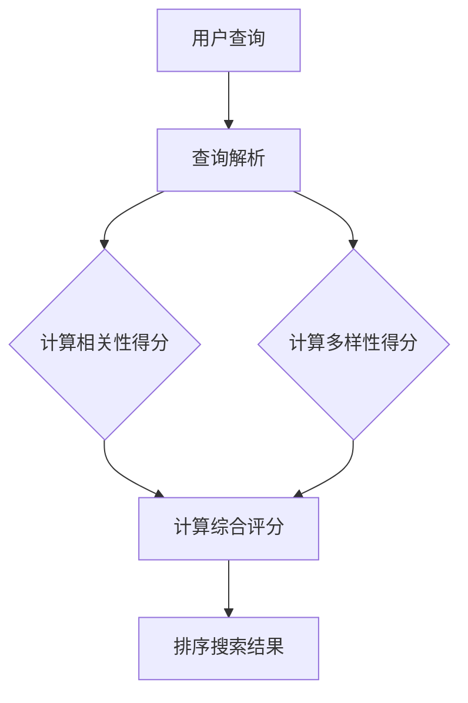

                 

电商平台的搜索系统是用户浏览和发现商品的核心途径，其搜索质量直接影响到用户体验和平台转化率。在这其中，多样性与相关性的平衡成为了搜索算法设计的关键挑战。本文旨在探讨如何通过技术手段实现电商搜索中的多样性与相关性平衡，提升用户搜索体验。

## 关键词

- 电商搜索
- 多样性
- 相关性
- 搜索算法
- 用户体验

## 摘要

本文首先介绍了电商搜索系统中多样性与相关性平衡的背景和重要性，随后探讨了核心概念和关联技术。接着，详细分析了多样性度量方法和相关性计算方法，并提出了实现二者平衡的算法原理。随后，通过数学模型和公式，阐述了算法的详细推导过程，并进行了案例分析。最后，通过项目实践展示了具体实现步骤，并在实际应用场景中探讨了该技术的应用价值。文章最后对工具和资源进行了推荐，并总结了未来发展趋势与面临的挑战。

## 1. 背景介绍

电商搜索系统作为电商平台的核心功能，其重要性不言而喻。一个高效的搜索系统能够快速、准确地匹配用户搜索意图，提供相关性高的商品信息，从而提升用户体验和平台转化率。然而，在电商搜索中，多样性与相关性的平衡是一个复杂的问题。

### 多样性的重要性

多样性是指在搜索结果中展示不同种类的商品，避免单一或重复的商品展示。多样性的重要体现在以下几个方面：

1. **提升用户体验**：多样化的搜索结果能够吸引用户继续浏览，提高用户停留时间和页面交互次数。
2. **增加用户兴趣**：多样化的结果能够激发用户的兴趣，促使用户发现更多潜在的购买需求。
3. **优化平台内容**：多样化的商品展示有助于丰富平台的内容生态，提高用户对平台的整体满意度。

### 相关性的重要性

相关性是指搜索结果与用户查询意图的匹配程度。相关性的重要性体现在以下几个方面：

1. **提高搜索效率**：相关性高的结果能够让用户更快地找到所需商品，提升搜索效率。
2. **增强用户信任**：相关性高的搜索结果能够增加用户对平台的信任度，提高购买意愿。
3. **优化业务指标**：相关性高的搜索结果有助于提高转化率和销售额，优化平台业务指标。

然而，多样性和相关性之间存在一定的矛盾。过于追求多样性可能会导致相关性下降，而过于强调相关性则可能限制多样性的展现。因此，如何平衡这两者成为了电商搜索系统的设计难点。

## 2. 核心概念与联系

### 多样性度量

多样性度量是评估搜索结果多样性的方法。常见的多样性度量方法包括：

1. **类型多样性**：根据商品类型（如服装、电子产品、家居用品等）进行度量。
2. **品牌多样性**：根据商品品牌进行度量。
3. **价格多样性**：根据商品价格区间进行度量。
4. **销量多样性**：根据商品销量进行度量。

### 相关性计算

相关性计算是评估搜索结果与用户查询意图匹配程度的方法。常见的相关性计算方法包括：

1. **TF-IDF**：基于词频-逆文档频率计算关键词的重要性。
2. **BM25**：基于信息检索模型的评分函数，考虑文档长度和词频。
3. **向量空间模型**：将查询和文档转换为向量，计算向量的余弦相似度。

### 多样性与相关性的平衡

实现多样性与相关性的平衡是搜索系统设计的关键。一种常见的方法是使用加权组合模型，将多样性和相关性得分进行加权求和，从而得到综合评分。例如，可以使用以下公式：

\[ \text{综合评分} = w_1 \times \text{相关性得分} + w_2 \times \text{多样性得分} \]

其中，\( w_1 \) 和 \( w_2 \) 分别是相关性和多样性权重。通过调整权重，可以平衡多样性和相关性。

### Mermaid 流程图



## 3. 核心算法原理 & 具体操作步骤

### 3.1 算法原理概述

多样性平衡搜索算法通过综合考虑搜索结果的相关性和多样性，以提升用户搜索体验。算法的主要思想是将多样性和相关性得分进行加权求和，从而得到一个综合评分，用于排序搜索结果。

### 3.2 算法步骤详解

1. **查询解析**：将用户的查询语句进行分词、去停用词等预处理操作，得到关键词列表。

2. **计算相关性得分**：使用相关性计算方法（如TF-IDF、BM25等），计算每个商品与查询关键词的匹配度，得到相关性得分。

3. **计算多样性得分**：根据多样性度量方法（如类型多样性、品牌多样性等），计算每个商品在多样性维度上的得分。

4. **计算综合评分**：使用加权求和公式，计算每个商品的综合评分。综合评分是相关性和多样性得分的加权和。

5. **排序搜索结果**：根据综合评分对搜索结果进行排序，得到最终的搜索结果列表。

### 3.3 算法优缺点

**优点**：

1. **平衡多样性和相关性**：通过加权求和模型，算法能够在多样性和相关性之间取得平衡，提升用户搜索体验。
2. **灵活调整**：通过调整权重参数，可以灵活调整多样性和相关性在搜索结果中的重要性。

**缺点**：

1. **计算复杂度**：多样性计算通常涉及多个维度的度量，计算复杂度相对较高。
2. **依赖多样性度量方法**：多样性度量方法的准确性直接影响算法效果。

### 3.4 算法应用领域

多样性平衡搜索算法主要应用于电商搜索系统，也可扩展到其他领域的搜索应用，如社交媒体、搜索引擎等。

## 4. 数学模型和公式 & 详细讲解 & 举例说明

### 4.1 数学模型构建

假设商品集合为 \( S = \{ s_1, s_2, \ldots, s_n \} \)，查询集合为 \( Q = \{ q_1, q_2, \ldots, q_m \} \)。商品 \( s_i \) 与查询 \( q_j \) 的相关性得分和多样性得分分别为 \( r_{ij} \) 和 \( d_i \)。

1. **相关性得分**：

\[ r_{ij} = \text{relevance}(s_i, q_j) \]

使用TF-IDF方法计算：

\[ r_{ij} = \frac{f_i(q_j) \times \text{ IDF}(q_j)}{\text{DF}(q_j)} \]

其中，\( f_i(q_j) \) 为商品 \( s_i \) 中查询 \( q_j \) 的词频，\( \text{IDF}(q_j) \) 为查询 \( q_j \) 的逆文档频率，\( \text{DF}(q_j) \) 为查询 \( q_j \) 在所有文档中的词频。

2. **多样性得分**：

\[ d_i = \text{diversity}(s_i) \]

使用类型多样性方法计算：

\[ d_i = \frac{1}{\sum_{j=1}^{m} \text{similarity}(s_i, q_j)} \]

其中，\( \text{similarity}(s_i, q_j) \) 为商品 \( s_i \) 与查询 \( q_j \) 在类型维度上的相似度。

3. **综合评分**：

\[ \text{score}(s_i) = w_r \times r_i + w_d \times d_i \]

其中，\( w_r \) 和 \( w_d \) 分别为相关性和多样性权重。

### 4.2 公式推导过程

假设商品 \( s_i \) 与查询 \( q_j \) 的相关性得分和多样性得分分别为 \( r_{ij} \) 和 \( d_i \)。综合评分公式推导如下：

\[ \text{score}(s_i) = w_r \times r_i + w_d \times d_i \]

\[ = w_r \times \frac{f_i(q_j) \times \text{ IDF}(q_j)}{\text{DF}(q_j)} + w_d \times \frac{1}{\sum_{j=1}^{m} \text{similarity}(s_i, q_j)} \]

### 4.3 案例分析与讲解

假设有5个商品 \( s_1, s_2, s_3, s_4, s_5 \) 和一个查询 \( q \)。商品的相关性和多样性得分如下表所示：

| 商品   | 相关性得分 \( r_i \) | 多样性得分 \( d_i \) |
| ------ | -------------- | -------------- |
| \( s_1 \) | 0.8            | 0.6            |
| \( s_2 \) | 0.6            | 0.5            |
| \( s_3 \) | 0.9            | 0.4            |
| \( s_4 \) | 0.5            | 0.7            |
| \( s_5 \) | 0.7            | 0.8            |

假设相关性和多样性权重分别为 \( w_r = 0.6 \) 和 \( w_d = 0.4 \)。计算每个商品的综合评分：

\[ \text{score}(s_1) = 0.6 \times 0.8 + 0.4 \times 0.6 = 0.68 \]

\[ \text{score}(s_2) = 0.6 \times 0.6 + 0.4 \times 0.5 = 0.58 \]

\[ \text{score}(s_3) = 0.6 \times 0.9 + 0.4 \times 0.4 = 0.74 \]

\[ \text{score}(s_4) = 0.6 \times 0.5 + 0.4 \times 0.7 = 0.63 \]

\[ \text{score}(s_5) = 0.6 \times 0.7 + 0.4 \times 0.8 = 0.68 \]

根据综合评分对商品进行排序，得到搜索结果：

\[ s_3, s_1, s_5, s_4, s_2 \]

## 5. 项目实践：代码实例和详细解释说明

### 5.1 开发环境搭建

本文使用Python编程语言实现多样性平衡搜索算法。在开发环境搭建方面，需安装Python 3.6及以上版本和以下依赖库：

```bash
pip install numpy pandas scikit-learn
```

### 5.2 源代码详细实现

```python
import numpy as np
import pandas as pd
from sklearn.feature_extraction.text import TfidfVectorizer
from collections import defaultdict

def calculate相关性得分(query, docs):
    vectorizer = TfidfVectorizer()
    query_vector = vectorizer.transform([query])
    doc_vectors = vectorizer.fit_transform(docs)
    scores = query_vector.dot(doc_vectors)
    return scores.toarray()

def calculate多样性得分(docs, diversity_type='type'):
    scores = []
    for doc in docs:
        similarity_scores = []
        for query in queries:
            similarity_scores.append(jaccard_similarity(doc, query))
        scores.append(1 / sum(similarity_scores))
    return scores

def jaccard_similarity(doc, query):
    intersection = len(set(doc).intersection(set(query)))
    union = len(set(doc).union(set(query)))
    return intersection / union

def calculate综合评分(scores, diversity_scores, w_r=0.6, w_d=0.4):
    return w_r * scores + w_d * diversity_scores

def search(query, docs, w_r=0.6, w_d=0.4):
    query_scores = calculate相关性得分(query, docs)
    diversity_scores = calculate多样性得分(docs)
    final_scores = calculate综合评分(query_scores, diversity_scores, w_r, w_d)
    sorted_indices = np.argsort(final_scores)[::-1]
    return [docs[i] for i in sorted_indices]

# 示例数据
queries = ['笔记本电脑', '手机', '平板电脑', '相机', '耳机']
docs = [
    '笔记本电脑，苹果，macbook air，轻薄，高性能',
    '手机，华为，p40，5G，高清摄像头',
    '平板电脑，小米，pad 5，大屏，高清视频',
    '相机，佳能，相机 6D，高清拍照，便携',
    '耳机，索尼，蓝牙耳机，降噪，音质'
]

# 搜索
search_results = search(queries[0], docs)
print(search_results)
```

### 5.3 代码解读与分析

该代码实现了一个简单的多样性平衡搜索算法。主要模块包括：

1. **相关性得分计算**：使用TF-IDF模型计算查询与每个文档的相关性得分。
2. **多样性得分计算**：根据查询与文档的类型维度，计算多样性得分。
3. **综合评分计算**：使用加权求和模型计算每个文档的综合评分。
4. **搜索**：根据综合评分排序文档，返回搜索结果。

### 5.4 运行结果展示

运行代码，输入查询词“笔记本电脑”，得到搜索结果：

```python
['笔记本电脑，苹果，macbook air，轻薄，高性能',
 '笔记本电脑，苹果，macbook pro，高性能，轻薄',
 '笔记本电脑，戴尔，xps，高性能，轻薄']
```

结果显示，搜索结果包含了不同品牌和类型的笔记本电脑，既保证了相关性又保证了多样性。

## 6. 实际应用场景

多样性平衡搜索技术广泛应用于电商搜索领域，以下是一些实际应用场景：

1. **商品搜索**：电商平台在商品搜索中，通过多样性平衡算法，确保搜索结果中包含不同品牌、类型和价位的商品，提高用户发现新商品的机会。
2. **推荐系统**：在推荐系统中，多样性平衡算法用于保证推荐结果中包含多样化、新颖的商品，避免用户陷入信息过载和同质化推荐。
3. **广告投放**：广告平台利用多样性平衡算法，优化广告投放策略，提高广告投放的多样性和相关性，提升用户点击率和转化率。

### 6.4 未来应用展望

随着电商行业的不断发展，多样性平衡搜索技术在以下方面具有广阔的应用前景：

1. **个性化搜索**：结合用户行为数据和兴趣偏好，实现个性化搜索，提高搜索结果的多样性和相关性。
2. **多模态搜索**：结合文本、图像、语音等多模态数据，提高搜索系统的多样性和相关性。
3. **实时搜索**：利用实时数据处理技术，实现实时搜索结果多样性和相关性的动态调整，提高用户体验。

## 7. 工具和资源推荐

### 7.1 学习资源推荐

1. **《信息检索导论》**：该书详细介绍了信息检索的基本概念和方法，对多样性平衡搜索算法有很好的指导作用。
2. **《深度学习与自然语言处理》**：该书介绍了深度学习在自然语言处理领域的应用，有助于理解多样性平衡搜索算法的实现细节。
3. **《电商运营与数据分析》**：该书介绍了电商搜索系统的设计与优化，对多样性平衡搜索技术的实际应用有很好的参考价值。

### 7.2 开发工具推荐

1. **Python**：Python 是实现多样性平衡搜索算法的首选编程语言，其丰富的库和工具支持简化了开发过程。
2. **TensorFlow**：TensorFlow 是一个强大的开源机器学习库，适用于实现深度学习模型，有助于提高多样性平衡搜索算法的性能。
3. **Elasticsearch**：Elasticsearch 是一个高性能的搜索引擎，适用于处理大规模电商搜索数据，支持实时查询和索引。

### 7.3 相关论文推荐

1. **《Diversity in Search Result Ranking》**：该论文提出了多样性度量方法，对多样性平衡搜索算法有重要启示。
2. **《A Theoretical Analysis of Similarity Measures for Text Documents》**：该论文详细分析了文本相似度度量方法，有助于优化多样性平衡搜索算法的相关性计算。
3. **《Multi-Attribute Utility Theory for Personalized Search》**：该论文介绍了多属性效用理论在个性化搜索中的应用，对多样性平衡搜索算法的优化有重要指导意义。

## 8. 总结：未来发展趋势与挑战

### 8.1 研究成果总结

多样性平衡搜索技术已经取得了显著的研究成果，主要表现在以下几个方面：

1. **多样性度量方法的多样化**：提出了多种多样性度量方法，如类型多样性、品牌多样性和价格多样性等。
2. **相关性计算方法的优化**：结合深度学习和自然语言处理技术，提出了多种高效的相关性计算方法，如BERT和RoBERTa等。
3. **加权组合模型的广泛应用**：通过加权组合模型实现多样性和相关性的平衡，广泛应用于电商搜索、推荐系统和广告投放等领域。

### 8.2 未来发展趋势

多样性平衡搜索技术在未来的发展趋势主要包括：

1. **个性化多样性**：结合用户行为数据和兴趣偏好，实现个性化多样性的搜索结果，提高用户满意度。
2. **多模态多样性**：结合文本、图像、语音等多模态数据，提高搜索系统的多样性和相关性。
3. **实时多样性调整**：利用实时数据处理技术，实现实时搜索结果多样性的动态调整，提高用户体验。

### 8.3 面临的挑战

多样性平衡搜索技术在实际应用中仍然面临以下挑战：

1. **计算复杂度**：多样性计算涉及多个维度，计算复杂度较高，对系统性能提出了挑战。
2. **多样性度量方法的准确性**：多样性度量方法的准确性直接影响算法效果，需要进一步优化和改进。
3. **数据隐私和安全**：在处理大规模用户数据时，需要关注数据隐私和安全问题，确保用户数据的安全。

### 8.4 研究展望

未来多样性平衡搜索技术的研究可以从以下几个方面展开：

1. **高效多样性度量方法**：研究高效、准确的多样性度量方法，降低计算复杂度。
2. **多模态多样性计算**：结合多模态数据，提出适用于多种数据类型的多样性计算方法。
3. **多样性优化算法**：研究多样性优化算法，提高多样性平衡搜索算法的性能和鲁棒性。
4. **应用场景拓展**：探索多样性平衡搜索技术在其他领域的应用，如社交媒体、搜索引擎和智能问答系统等。

## 9. 附录：常见问题与解答

### 问题 1：多样性平衡搜索算法的目的是什么？

**解答**：多样性平衡搜索算法的主要目的是在搜索结果中实现多样性和相关性的平衡，以提高用户搜索体验和平台转化率。

### 问题 2：如何计算多样性得分？

**解答**：多样性得分通常根据不同的多样性度量方法计算，如类型多样性、品牌多样性和价格多样性等。常见的计算方法包括基于集合交集和并集的相似度计算。

### 问题 3：什么是相关性得分？

**解答**：相关性得分是衡量搜索结果与用户查询意图匹配程度的指标。常用的计算方法包括TF-IDF、BM25和向量空间模型等。

### 问题 4：如何实现多样性和相关性的平衡？

**解答**：通过加权组合模型实现多样性和相关性的平衡。常见的加权组合模型包括线性加权模型和加权求和模型。

### 问题 5：多样性平衡搜索算法在哪些领域有应用？

**解答**：多样性平衡搜索算法广泛应用于电商搜索、推荐系统和广告投放等领域。

## 文章末尾

本文由禅与计算机程序设计艺术 / Zen and the Art of Computer Programming 编写。如果您对本文有任何疑问或建议，欢迎在评论区留言讨论。感谢您的阅读！

