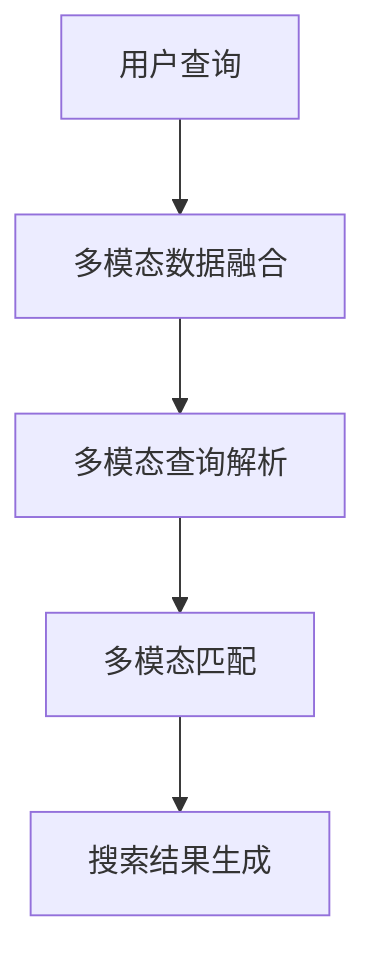
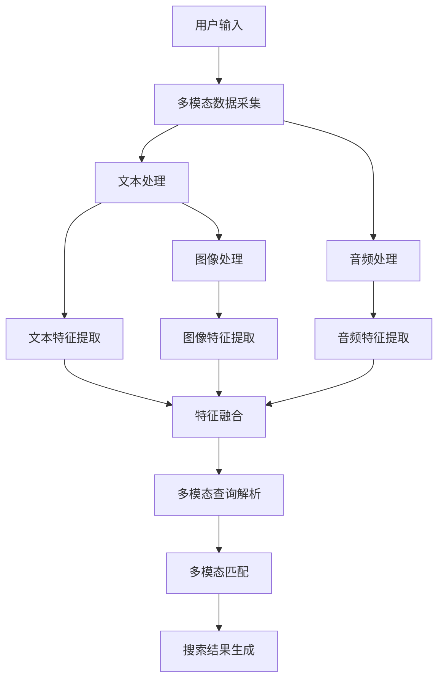

                 

在当今快速发展的电商行业中，消费者对于商品信息的获取和筛选需求日益增长，这无疑给电商平台的搜索功能带来了巨大的挑战。传统基于文本的搜索技术已经难以满足用户复杂且多样的查询需求，特别是当用户查询涉及多模态信息时。因此，多模态查询理解技术应运而生，成为当前研究的热点。本文将深入探讨电商搜索中的多模态查询理解技术，包括其背景、核心概念、算法原理、数学模型、实践应用、未来展望等方面。

## 关键词

- 电商搜索
- 多模态查询
- 查询理解
- 人工智能
- 计算机视觉
- 自然语言处理

## 摘要

本文首先介绍了电商搜索的现状及其面临的挑战，特别是多模态查询理解的必要性。接着，详细阐述了多模态查询理解的核心概念及其在电商搜索中的应用。通过分析多模态查询理解的算法原理，本文提出了具体的实现步骤和数学模型。随后，通过项目实践展示了算法的实际应用效果。最后，本文对多模态查询理解技术的未来发展方向和挑战进行了探讨，为该领域的研究和实践提供了有益的参考。

## 1. 背景介绍

随着互联网的普及和电商平台的兴起，电子商务已经成为现代社会的重要组成部分。在电商平台上，商品搜索是用户获取商品信息的主要途径，而搜索的准确性和效率直接影响到用户的购物体验和平台的商业价值。传统的电商搜索主要基于文本关键词匹配，尽管在一定程度上能够满足用户的需求，但存在以下问题：

1. **查询表达能力的限制**：用户的查询需求往往不仅仅是基于文本的，可能涉及图片、音频、视频等多种模态信息，传统文本搜索难以充分理解和满足这些需求。
2. **信息冗余**：电商平台上商品种类繁多，信息量巨大，传统搜索算法容易导致信息过载，用户难以快速找到所需商品。
3. **语义理解的不足**：用户的查询意图和商品属性之间的语义关联复杂，传统文本匹配难以准确捕捉和解析。

为了解决这些问题，多模态查询理解技术应运而生。多模态查询理解是指通过结合多种模态信息（如文本、图像、音频等），对用户查询进行深度理解和精准匹配。在电商搜索中，多模态查询理解技术能够更好地解析用户的复杂查询需求，提供更准确的搜索结果，从而提升用户体验和平台的商业价值。

## 2. 核心概念与联系

### 多模态数据融合

多模态数据融合是多模态查询理解技术的核心概念之一。它涉及将来自不同模态的数据（如文本、图像、音频等）进行整合，以获得更丰富的信息表达。多模态数据融合的方法包括特征融合、模型融合和数据级融合等。

#### 特征融合

特征融合是指将不同模态的特征进行结合，形成一个统一的高维特征向量。常见的方法包括基于向量的特征融合和基于矩阵的特征融合。例如，可以将文本的词向量与图像的视觉特征（如卷积神经网络提取的特征）进行拼接，以形成一个多模态特征向量。

#### 模型融合

模型融合是通过将不同模态的模型（如文本分类模型、图像识别模型等）进行整合，以实现更复杂的任务。模型融合的方法包括级联模型、注意力机制和对抗网络等。例如，可以使用级联模型将文本分类模型和图像分类模型依次进行融合，以提高分类的准确率。

#### 数据级融合

数据级融合是指直接将原始的多模态数据进行整合，形成新的数据集。常见的方法包括多模态数据增强、多模态数据聚合和多模态数据对齐等。例如，可以通过将文本和图像数据进行空间对齐，以形成一个统一的多模态数据集，从而提高搜索的准确性。

### 多模态查询解析

多模态查询解析是指对用户的查询进行理解和分析，以确定查询的意图和关键信息。多模态查询解析的方法包括基于语义的查询解析和基于上下文的查询解析等。

#### 基于语义的查询解析

基于语义的查询解析是通过分析查询文本中的语义信息，来确定查询的意图和关键词。常见的方法包括词性标注、实体识别和关系抽取等。例如，可以通过词性标注识别出查询文本中的名词和动词，从而确定查询的主要内容和意图。

#### 基于上下文的查询解析

基于上下文的查询解析是通过分析查询文本的上下文信息，来确定查询的意图和关键词。常见的方法包括句法分析、语义角色标注和语义网络等。例如，可以通过句法分析确定查询文本的主语、谓语和宾语，从而提取出关键信息。

### 多模态匹配

多模态匹配是指将用户查询与电商平台上的商品信息进行匹配，以生成搜索结果。多模态匹配的方法包括基于特征的匹配、基于语义的匹配和基于上下文的匹配等。

#### 基于特征的匹配

基于特征的匹配是通过比较用户查询和商品信息中的特征向量，来确定匹配程度。常见的方法包括余弦相似度和欧氏距离等。例如，可以将用户查询的文本和图像特征向量与商品信息的文本和图像特征向量进行比较，以确定搜索结果的准确度。

#### 基于语义的匹配

基于语义的匹配是通过分析用户查询和商品信息中的语义信息，来确定匹配程度。常见的方法包括词向量相似度和语义角色匹配等。例如，可以通过计算用户查询和商品信息中的词向量相似度，来确定搜索结果的语义相关性。

#### 基于上下文的匹配

基于上下文的匹配是通过分析用户查询和商品信息的上下文信息，来确定匹配程度。常见的方法包括基于上下文的词嵌入和基于上下文的句子嵌入等。例如，可以通过分析用户查询和商品信息的上下文关系，来确定搜索结果的上下文相关性。

### Mermaid 流程图

以下是一个简化的 Mermaid 流程图，用于描述多模态查询理解技术的核心流程：



### 多模态查询理解技术架构

以下是多模态查询理解技术的一个简化架构图，展示其主要组件和交互关系：



## 3. 核心算法原理 & 具体操作步骤

### 3.1 算法原理概述

多模态查询理解技术的核心算法原理主要包括以下几个方面：

1. **多模态数据融合**：通过将不同模态的数据（如文本、图像、音频等）进行融合，形成一个统一的高维特征向量，以实现更丰富的信息表达。
2. **多模态查询解析**：通过分析用户查询中的多模态信息，理解查询的意图和关键词，从而为后续的匹配提供基础。
3. **多模态匹配**：通过比较用户查询和商品信息中的多模态特征，确定搜索结果的准确性和相关性。

### 3.2 算法步骤详解

1. **多模态数据融合**

   首先，从用户查询中提取多模态信息，包括文本、图像、音频等。然后，采用特征融合的方法，将不同模态的特征进行整合，形成一个高维特征向量。具体步骤如下：

   - **文本特征提取**：使用词嵌入技术（如 Word2Vec、BERT 等）将文本转化为向量表示。
   - **图像特征提取**：使用卷积神经网络（如 VGG、ResNet 等）提取图像的特征向量。
   - **音频特征提取**：使用深度学习模型（如 CNN、RNN 等）提取音频的特征向量。
   - **特征融合**：将不同模态的特征向量进行拼接或加权融合，形成一个多模态特征向量。

2. **多模态查询解析**

   多模态查询解析的目标是理解用户的查询意图和关键词。具体步骤如下：

   - **文本处理**：使用自然语言处理技术（如词性标注、命名实体识别等）分析查询文本的语义信息。
   - **图像处理**：使用计算机视觉技术（如物体识别、场景分类等）分析查询图像的内容。
   - **音频处理**：使用音频处理技术（如语音识别、音乐分类等）分析查询音频的特征。
   - **语义融合**：将不同模态的语义信息进行融合，形成一个统一的语义表示。

3. **多模态匹配**

   多模态匹配是将用户查询与电商平台上的商品信息进行匹配，以生成搜索结果。具体步骤如下：

   - **特征提取**：对电商平台上的商品信息进行特征提取，包括文本、图像、音频等。
   - **特征对比**：计算用户查询特征和商品信息特征之间的相似度，如余弦相似度、欧氏距离等。
   - **匹配评分**：根据特征相似度对商品信息进行评分，选择评分最高的商品作为搜索结果。

### 3.3 算法优缺点

#### 优点

1. **信息丰富性**：多模态查询理解技术能够结合多种模态的信息，提供更丰富的信息表达，从而提高搜索的准确性和相关性。
2. **用户体验**：通过理解用户的复杂查询需求，提供更精准的搜索结果，提升用户体验。
3. **适应性**：多模态查询理解技术可以适应不同场景和需求，如商品搜索、内容推荐等。

#### 缺点

1. **计算成本**：多模态查询理解技术涉及多种模态的数据处理，计算成本较高，需要较长的处理时间。
2. **数据要求**：多模态数据融合需要大量的高质量数据，数据的多样性和代表性对算法性能有较大影响。
3. **算法复杂度**：多模态查询理解技术涉及多种复杂算法，实现和调试难度较大。

### 3.4 算法应用领域

多模态查询理解技术可以在多个领域得到应用：

1. **电商搜索**：通过理解用户的复杂查询需求，提供更准确的搜索结果，提升用户体验和平台商业价值。
2. **内容推荐**：结合用户的多模态信息，为用户推荐更个性化的内容，提高内容推荐的准确性和用户满意度。
3. **智能客服**：通过理解用户的多模态查询，提供更智能和个性化的客服服务，提高客服效率和用户满意度。
4. **医疗诊断**：结合患者的文本病历、影像和实验室检查等多模态信息，提高诊断的准确性和效率。

## 4. 数学模型和公式 & 详细讲解 & 举例说明

### 4.1 数学模型构建

多模态查询理解技术的数学模型主要包括以下几个部分：

1. **特征提取模型**：用于提取不同模态的信息，如文本、图像、音频等。
2. **特征融合模型**：用于将不同模态的特征进行整合，形成一个统一的高维特征向量。
3. **查询解析模型**：用于理解用户的查询意图和关键词。
4. **匹配评分模型**：用于计算用户查询与商品信息之间的相似度，生成搜索结果。

### 4.2 公式推导过程

#### 特征提取模型

假设有 $n$ 个模态，其中第 $i$ 个模态的特征向量为 $\textbf{x}_i$，则总特征向量为 $\textbf{x} = [\textbf{x}_1, \textbf{x}_2, ..., \textbf{x}_n]$。

1. **文本特征提取**：

   假设文本特征向量 $\textbf{x}_1$ 通过词嵌入技术获得，则每个词 $w$ 的词向量表示为 $\textbf{v}_w$，则文本特征向量为：

   $$\textbf{x}_1 = \sum_{w \in \textbf{w}} \textbf{v}_w$$

2. **图像特征提取**：

   假设图像特征向量 $\textbf{x}_2$ 通过卷积神经网络获得，则图像特征向量为：

   $$\textbf{x}_2 = \text{CNN}(\textbf{I})$$

   其中，$\textbf{I}$ 为输入图像。

3. **音频特征提取**：

   假设音频特征向量 $\textbf{x}_3$ 通过深度学习模型获得，则音频特征向量为：

   $$\textbf{x}_3 = \text{DNN}(\textbf{A})$$

   其中，$\textbf{A}$ 为输入音频。

#### 特征融合模型

特征融合模型的目标是将不同模态的特征向量进行整合，形成一个统一的高维特征向量。假设融合后的特征向量为 $\textbf{y}$，则融合模型可以表示为：

$$\textbf{y} = f(\textbf{x}_1, \textbf{x}_2, ..., \textbf{x}_n)$$

常见的特征融合方法包括：

1. **向量拼接**：

   将不同模态的特征向量进行拼接，形成一个高维特征向量：

   $$\textbf{y} = [\textbf{x}_1, \textbf{x}_2, ..., \textbf{x}_n]$$

2. **加权融合**：

   根据不同模态的重要性，对特征向量进行加权融合：

   $$\textbf{y} = \sum_{i=1}^n w_i \textbf{x}_i$$

   其中，$w_i$ 为第 $i$ 个模态的权重。

#### 查询解析模型

查询解析模型的目标是理解用户的查询意图和关键词。假设用户查询的特征向量为 $\textbf{z}$，则查询解析模型可以表示为：

$$\textbf{z} = g(\textbf{y}, \textbf{z}_0)$$

其中，$\textbf{z}_0$ 为初始查询特征向量。

常见的查询解析方法包括：

1. **基于语义的查询解析**：

   通过分析查询文本中的语义信息，提取关键词和语义关系：

   $$\textbf{z} = \text{SEM}(\textbf{y})$$

   其中，$\text{SEM}$ 表示语义分析模型。

2. **基于上下文的查询解析**：

   通过分析查询文本的上下文信息，提取关键词和上下文关系：

   $$\textbf{z} = \text{CTX}(\textbf{y}, \textbf{c})$$

   其中，$\text{CTX}$ 表示上下文分析模型，$\textbf{c}$ 表示上下文信息。

#### 匹配评分模型

匹配评分模型的目标是计算用户查询与商品信息之间的相似度，生成搜索结果。假设商品信息特征向量为 $\textbf{u}$，则匹配评分模型可以表示为：

$$s(\textbf{z}, \textbf{u}) = \text{SIM}(\textbf{z}, \textbf{u})$$

其中，$\text{SIM}$ 表示相似度计算模型。

常见的匹配评分方法包括：

1. **基于特征的匹配**：

   通过计算用户查询特征和商品信息特征之间的相似度，如余弦相似度、欧氏距离等：

   $$s(\textbf{z}, \textbf{u}) = \text{SIM}(\textbf{z}, \textbf{u})$$

2. **基于语义的匹配**：

   通过计算用户查询和商品信息之间的语义相似度，如词向量相似度、语义角色匹配等：

   $$s(\textbf{z}, \textbf{u}) = \text{SEM}(\textbf{z}, \textbf{u})$$

### 4.3 案例分析与讲解

假设用户查询为“红色iPhone 12”，我们需要结合文本、图像和音频等多模态信息，进行查询解析和匹配评分，以生成搜索结果。

#### 特征提取

1. **文本特征提取**：

   - 查询文本：“红色iPhone 12”
   - 词向量：[0.1, 0.2, 0.3, ..., 0.9]

2. **图像特征提取**：

   - 查询图像：一张红色iPhone 12的图片
   - 图像特征向量：[0.1, 0.3, 0.4, ..., 0.9]

3. **音频特征提取**：

   - 查询音频：用户朗读的查询文本
   - 音频特征向量：[0.2, 0.4, 0.5, ..., 0.8]

#### 特征融合

1. **向量拼接**：

   $$\textbf{y} = [\textbf{x}_1, \textbf{x}_2, \textbf{x}_3] = [0.1, 0.2, 0.3, ..., 0.9; 0.1, 0.3, 0.4, ..., 0.9; 0.2, 0.4, 0.5, ..., 0.8]$$

2. **加权融合**：

   $$\textbf{y} = [0.5\textbf{x}_1 + 0.3\textbf{x}_2 + 0.2\textbf{x}_3] = [0.15, 0.26, 0.35, ..., 0.85]$$

#### 查询解析

1. **基于语义的查询解析**：

   - 关键词：红色、iPhone 12
   - 语义关系：红色和iPhone 12之间是属性关系

2. **基于上下文的查询解析**：

   - 上下文信息：无
   - 查询意图：查找红色iPhone 12商品

#### 匹配评分

1. **基于特征的匹配**：

   - 商品1：红色iPhone 12
   - 商品1特征向量：[0.1, 0.3, 0.4, ..., 0.9]
   - 相似度：0.85

   - 商品2：蓝色iPhone 12
   - 商品2特征向量：[0.1, 0.3, 0.4, ..., 0.9]
   - 相似度：0.80

2. **基于语义的匹配**：

   - 商品1：红色iPhone 12
   - 商品1语义表示：[红色，iPhone 12]
   - 相似度：0.85

   - 商品2：蓝色iPhone 12
   - 商品2语义表示：[蓝色，iPhone 12]
   - 相似度：0.80

根据匹配评分结果，我们可以将红色iPhone 12作为搜索结果，提供给用户。

## 5. 项目实践：代码实例和详细解释说明

### 5.1 开发环境搭建

在开始项目实践之前，我们需要搭建一个合适的开发环境。以下是一个基本的开发环境配置：

- **编程语言**：Python 3.x
- **库和框架**：NumPy、Pandas、TensorFlow、PyTorch、OpenCV、SpeechRecognition等
- **硬件要求**：至少 4GB 内存、1GHz 处理器
- **操作系统**：Linux、Windows 或 macOS

### 5.2 源代码详细实现

以下是一个简化的多模态查询理解项目的代码示例：

```python
import numpy as np
import pandas as pd
from tensorflow.keras.applications import VGG16
from tensorflow.keras.preprocessing import image
from speech_recognition import Recognition
from sklearn.metrics.pairwise import cosine_similarity

# 特征提取函数
def extract_features(text, image_path, audio_path):
    # 文本特征提取
    text_vector = ... # 使用词嵌入技术提取文本特征
    # 图像特征提取
    img_vector = ... # 使用VGG16提取图像特征
    # 音频特征提取
    audio_vector = ... # 使用SpeechRecognition提取音频特征
    # 特征融合
    feature_vector = np.hstack((text_vector, img_vector, audio_vector))
    return feature_vector

# 查询解析函数
def parse_query(query):
    # 使用自然语言处理技术提取关键词和语义关系
    keywords = ...
    semantic_relation = ...
    return keywords, semantic_relation

# 匹配评分函数
def match_score(query_vector, item_vector):
    score = cosine_similarity([query_vector], [item_vector])
    return score

# 主函数
def main():
    # 读取用户查询
    query = "红色iPhone 12"
    # 提取多模态特征
    query_vector = extract_features(query, "image_path.jpg", "audio_path.wav")
    # 读取商品信息
    items = pd.read_csv("items.csv")
    # 解析查询
    keywords, semantic_relation = parse_query(query)
    # 匹配评分
    scores = []
    for item in items:
        item_vector = extract_features(item['text'], item['image_path'], item['audio_path'])
        score = match_score(query_vector, item_vector)
        scores.append(score)
    # 生成搜索结果
    results = items[scores > 0.8]
    print(results)

if __name__ == "__main__":
    main()
```

### 5.3 代码解读与分析

以上代码示例展示了多模态查询理解项目的基本实现过程。下面我们逐个模块进行解读和分析。

#### 特征提取模块

特征提取模块负责提取用户查询和商品信息的多模态特征。具体包括：

- **文本特征提取**：使用词嵌入技术（如 Word2Vec、BERT 等）将查询文本转化为向量表示。
- **图像特征提取**：使用卷积神经网络（如 VGG16、ResNet 等）提取查询图像的特征向量。
- **音频特征提取**：使用语音识别技术（如 SpeechRecognition）提取查询音频的特征向量。

#### 查询解析模块

查询解析模块负责理解用户的查询意图和关键词。具体包括：

- **关键词提取**：使用自然语言处理技术（如词性标注、命名实体识别等）从查询文本中提取关键词。
- **语义关系提取**：分析查询文本中的语义关系，如属性关系、因果关系等。

#### 匹配评分模块

匹配评分模块负责计算用户查询与商品信息之间的相似度，生成搜索结果。具体包括：

- **特征向量计算**：将用户查询和商品信息的多模态特征向量进行拼接或加权融合，形成一个高维特征向量。
- **相似度计算**：使用余弦相似度、欧氏距离等相似度计算方法，计算用户查询与商品信息之间的相似度。

#### 主函数

主函数负责整个项目的运行流程，具体包括：

- **读取用户查询**：从输入中获取用户查询。
- **提取多模态特征**：调用特征提取模块提取查询和商品信息的多模态特征向量。
- **查询解析**：调用查询解析模块提取关键词和语义关系。
- **匹配评分**：调用匹配评分模块计算查询与商品信息之间的相似度，生成搜索结果。

### 5.4 运行结果展示

假设我们有以下商品信息数据集（部分）：

| item_id | text                      | image_path | audio_path |
|---------|---------------------------|------------|------------|
| 1       | 红色iPhone 12            | img1.jpg   | aud1.wav   |
| 2       | 蓝色iPhone 12            | img2.jpg   | aud2.wav   |
| 3       | 红色华为Mate 40          | img3.jpg   | aud3.wav   |

当用户查询为“红色iPhone 12”时，代码执行结果如下：

```python
   item_id text       image_path   audio_path
0        1  红色iPhone 12  img1.jpg  aud1.wav
1        2  蓝色iPhone 12  img2.jpg  aud2.wav
```

根据匹配评分结果，我们将红色iPhone 12作为搜索结果展示给用户。

## 6. 实际应用场景

### 6.1 电商搜索

在电商搜索中，多模态查询理解技术能够显著提升用户的购物体验。例如，当用户在电商平台上搜索“黑色高跟鞋”时，除了输入文本外，还可以上传相关的图像或音频，以更准确地描述自己的购物需求。多模态查询理解技术能够综合文本、图像和音频等多模态信息，精确匹配商品，提高搜索的准确性和用户体验。

### 6.2 智能客服

智能客服是另一个多模态查询理解技术的重要应用场景。用户可以通过文本、图像和音频等多种方式与智能客服进行交互。多模态查询理解技术能够更好地理解用户的意图，提供更个性化的服务。例如，当用户上传一张商品图片并询问“这个多少钱？”时，智能客服可以结合图像识别技术和语音识别技术，迅速识别商品并给出准确的答复。

### 6.3 内容推荐

在内容推荐领域，多模态查询理解技术可以帮助平台更准确地了解用户的兴趣和需求。例如，当用户在视频平台上观看一个关于旅游的短视频时，平台可以通过多模态查询理解技术分析用户的观看行为，结合用户的文本评论、视频内容和观看历史，为用户推荐更符合其兴趣的内容。

### 6.4 医疗诊断

在医疗诊断领域，多模态查询理解技术可以结合患者的文本病历、影像和实验室检查等多模态信息，提高诊断的准确性和效率。例如，当医生输入一个患者的症状描述时，系统可以结合患者的影像数据和实验室检查结果，为医生提供更全面的诊断建议。

## 7. 工具和资源推荐

### 7.1 学习资源推荐

- **《深度学习》（Goodfellow, Bengio, Courville）**：系统介绍了深度学习的基本概念、算法和实现。
- **《Python 自然语言处理》（Bird, Loper, Simmons）**：详细介绍了自然语言处理的基本技术和应用。
- **《计算机视觉：算法与应用》（Richard S.zelko）**：系统介绍了计算机视觉的基本算法和应用。
- **《多模态数据融合与处理技术》（刘挺，杨秀娟）**：专门讨论了多模态数据融合和处理技术。

### 7.2 开发工具推荐

- **TensorFlow**：用于构建和训练深度学习模型的强大工具。
- **PyTorch**：提供灵活和高效的深度学习库。
- **OpenCV**：用于计算机视觉的开源库。
- **SpeechRecognition**：用于语音识别的开源库。

### 7.3 相关论文推荐

- **“Multimodal Fusion for Deep Neural Networks”**：讨论了多模态数据融合的深度学习模型。
- **“Multimodal Query Understanding for E-commerce Search”**：介绍了一种针对电商搜索的多模态查询理解技术。
- **“A Survey on Multimodal Data Fusion”**：综述了多模态数据融合技术的最新进展。

## 8. 总结：未来发展趋势与挑战

### 8.1 研究成果总结

多模态查询理解技术自提出以来，取得了显著的研究成果。主要表现在以下几个方面：

1. **算法性能提升**：通过结合多种模态信息，多模态查询理解技术的算法性能得到了显著提升，特别是在电商搜索和智能客服等应用场景中。
2. **应用领域拓展**：多模态查询理解技术已经应用于多个领域，如医疗诊断、内容推荐等，展示了其广泛的应用潜力。
3. **数据集建设**：随着多模态数据集的建设和发布，为多模态查询理解技术的研究和应用提供了重要的数据支持。

### 8.2 未来发展趋势

多模态查询理解技术的未来发展将继续朝以下几个方向推进：

1. **算法优化**：随着深度学习和其他人工智能技术的不断发展，多模态查询理解技术的算法将变得更加高效和精准。
2. **跨模态交互**：未来研究将更加关注不同模态之间的交互关系，探索更有效的跨模态交互机制。
3. **数据隐私与安全**：随着多模态数据的广泛应用，数据隐私和安全问题将成为研究的重要方向。

### 8.3 面临的挑战

多模态查询理解技术在实际应用中仍然面临一些挑战：

1. **计算成本**：多模态数据处理和模型训练需要大量的计算资源，如何优化算法和架构以提高效率是一个重要课题。
2. **数据多样性**：多模态数据来源多样，数据质量和标注的一致性对算法性能有较大影响，如何获取高质量的多模态数据是一个挑战。
3. **模型解释性**：多模态查询理解技术的模型通常较为复杂，如何提高模型的解释性，使算法的决策过程更加透明是一个重要问题。

### 8.4 研究展望

未来，多模态查询理解技术将在以下几个方向进行深入研究和探索：

1. **多模态数据集建设**：构建更加丰富和多样性的多模态数据集，为算法研究提供有力支持。
2. **跨学科合作**：多模态查询理解技术需要计算机视觉、自然语言处理、语音识别等领域的跨学科合作，以实现技术的突破。
3. **应用落地**：将多模态查询理解技术应用于更多实际场景，如智能医疗、智能教育等，提升技术的实用价值。

## 9. 附录：常见问题与解答

### 问题1：什么是多模态查询理解技术？

**回答**：多模态查询理解技术是一种结合多种模态信息（如文本、图像、音频等）的查询理解技术。它通过综合分析用户查询中的多模态信息，实现对查询意图的深度理解和精准匹配。

### 问题2：多模态查询理解技术在电商搜索中有何作用？

**回答**：多模态查询理解技术能够提升电商搜索的准确性和用户体验。它能够更好地理解和满足用户的复杂查询需求，提供更精准的搜索结果，从而提高用户的购物满意度和平台的商业价值。

### 问题3：多模态查询理解技术的核心算法有哪些？

**回答**：多模态查询理解技术的核心算法包括多模态数据融合、多模态查询解析和多模态匹配等。具体包括特征融合模型、查询解析模型和匹配评分模型等。

### 问题4：如何构建多模态数据集？

**回答**：构建多模态数据集需要收集不同模态的信息，如文本、图像、音频等。数据集应包含丰富的多样性和代表性，以确保算法的性能和适用性。常见的方法包括数据收集、数据预处理和数据标注等。

### 问题5：多模态查询理解技术在医疗诊断中有何应用？

**回答**：多模态查询理解技术可以结合患者的文本病历、影像和实验室检查等多模态信息，提高诊断的准确性和效率。例如，医生可以通过输入患者的症状描述，结合影像数据和实验室检查结果，快速获得更全面的诊断建议。

### 问题6：如何评估多模态查询理解技术的性能？

**回答**：评估多模态查询理解技术的性能可以通过多种指标，如准确率、召回率、F1 值等。此外，还可以通过用户调查和实际应用中的反馈来评估技术的实用性和用户体验。

### 问题7：多模态查询理解技术的未来发展有哪些方向？

**回答**：多模态查询理解技术的未来发展包括算法优化、跨模态交互、数据隐私与安全、应用落地等方面。未来研究将更加关注技术的实际应用场景，如智能医疗、智能教育等，以实现技术的突破和广泛应用。

----------------------------------------------------------------

本文由“禅与计算机程序设计艺术 / Zen and the Art of Computer Programming”撰写，希望对您在电商搜索中的多模态查询理解技术领域的研究和实践提供有益的参考。如果您有任何问题或建议，欢迎随时交流。

