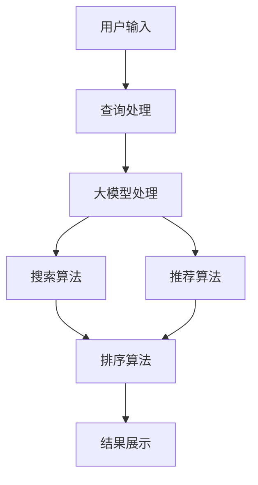

                 

关键词：电商搜索推荐、AI大模型、多目标优化、搜索算法、推荐系统

## 摘要

本文主要探讨了在电商搜索推荐系统中应用AI大模型进行多目标优化技术的相关研究。首先，我们介绍了电商搜索推荐系统的基本概念和运作机制，随后深入分析了AI大模型在电商搜索推荐中的重要性，并详细阐述了多目标优化的核心原理和实践方法。通过具体算法原理、数学模型构建、代码实例和实际应用场景的讲解，我们展示了如何将多目标优化技术应用于电商搜索推荐系统中，以提高搜索效率和推荐质量。文章最后还展望了该领域未来发展趋势和面临的挑战，为研究者提供了有益的参考。

## 1. 背景介绍

### 1.1 电商搜索推荐系统的基本概念

电商搜索推荐系统是电子商务领域中一种重要的技术手段，旨在通过精准的搜索和推荐功能，提升用户的购物体验和满意度。它通常由两个核心部分组成：搜索和推荐。

**搜索**部分主要负责帮助用户快速找到他们需要的商品。这涉及到关键词匹配、搜索排序和结果分页等关键环节。传统的搜索算法主要基于关键词匹配和统计信息，而随着AI技术的发展，基于深度学习的搜索算法逐渐成为主流，能够更好地理解和处理用户查询。

**推荐**部分则致力于为用户提供个性化的商品推荐，提升用户在平台上的停留时间和购买转化率。推荐算法通常包括基于内容的推荐、协同过滤推荐和混合推荐等。这些算法通过分析用户的历史行为、兴趣偏好和购物习惯，为用户推荐他们可能感兴趣的商品。

### 1.2 电商搜索推荐系统的运作机制

电商搜索推荐系统的运作机制可以分为以下几个步骤：

1. **用户输入**：用户通过输入关键词、点击、浏览等行为，与系统进行交互。
2. **查询处理**：系统对用户输入进行处理，提取关键信息并进行分词、词性标注等预处理操作。
3. **搜索算法**：基于预处理后的信息，搜索算法对商品库进行检索，并生成候选结果。
4. **排序算法**：对候选结果进行排序，根据用户偏好、商品热度、历史数据等因素确定排序顺序。
5. **推荐算法**：根据用户历史行为和偏好，推荐系统生成个性化推荐结果。
6. **结果展示**：将搜索结果和推荐结果呈现给用户，用户进行选择和操作。

### 1.3 AI大模型的发展与应用

随着互联网和大数据技术的飞速发展，AI大模型在各个领域得到了广泛应用。尤其是在电商搜索推荐系统中，AI大模型凭借其强大的数据处理能力和自学习特性，成为提高搜索效率和推荐质量的关键技术。

**AI大模型的基本概念**：AI大模型是指通过大规模数据训练得到的复杂神经网络模型，能够处理海量数据并提取有效信息。常见的AI大模型包括深度神经网络（DNN）、循环神经网络（RNN）、Transformer模型等。

**AI大模型在电商搜索推荐中的应用**：
- **搜索算法优化**：通过大模型对用户查询意图进行深入理解，提升搜索结果的准确性。
- **推荐算法优化**：基于用户行为数据和商品特征，大模型能够生成更加精准的个性化推荐。
- **用户行为预测**：预测用户的下一步操作，优化用户体验和平台运营效果。

### 1.4 多目标优化的概念与意义

多目标优化是指同时优化多个相互冲突的目标，旨在找到一组最优解。在电商搜索推荐系统中，多目标优化技术具有以下重要意义：

- **平衡不同目标**：在搜索和推荐过程中，平衡准确性、响应速度、用户满意度等多个目标，提高系统的整体性能。
- **提高用户体验**：通过优化用户搜索体验和推荐效果，提升用户满意度和平台黏性。
- **提升运营效果**：多目标优化有助于提升电商平台的销售业绩和运营效率。

## 2. 核心概念与联系

### 2.1 AI大模型在电商搜索推荐中的应用

在电商搜索推荐系统中，AI大模型的应用主要体现在以下几个方面：

**查询意图识别**：通过大模型对用户输入的关键词进行深入分析，识别用户的真实意图，从而生成更加准确的搜索结果。

**用户行为预测**：利用用户的历史行为数据，大模型能够预测用户的下一步操作，优化推荐结果和搜索排序。

**商品特征提取**：通过大模型对商品数据进行深度学习，提取商品的关键特征，为推荐算法提供丰富的信息支持。

**协同过滤**：结合基于内容的推荐和协同过滤推荐，大模型能够生成更加个性化的推荐结果。

### 2.2 多目标优化的基本原理

多目标优化是指同时优化多个相互冲突的目标，旨在找到一组最优解。在电商搜索推荐系统中，多目标优化主要涉及以下几个方面：

- **准确性**：优化搜索结果和推荐结果的准确性，提高用户满意度。
- **响应速度**：提高系统的响应速度，确保用户能够快速获得搜索结果和推荐结果。
- **用户满意度**：通过优化用户交互体验，提升用户满意度。
- **运营效果**：优化平台运营效果，提升销售额和用户留存率。

### 2.3 Mermaid 流程图

以下是一个简单的 Mermaid 流程图，展示了电商搜索推荐系统中 AI 大模型多目标优化的基本流程：



**流程说明**：

1. 用户输入：用户通过输入关键词、点击、浏览等行为，与系统进行交互。
2. 查询处理：系统对用户输入进行处理，提取关键信息并进行分词、词性标注等预处理操作。
3. 大模型处理：AI 大模型对查询信息进行处理，识别用户意图、预测用户行为等。
4. 搜索算法：基于大模型处理结果，搜索算法对商品库进行检索，生成候选结果。
5. 推荐算法：基于用户行为和商品特征，推荐算法生成个性化推荐结果。
6. 排序算法：对搜索结果和推荐结果进行排序，根据用户偏好、商品热度、历史数据等因素确定排序顺序。
7. 结果展示：将排序后的搜索结果和推荐结果呈现给用户，用户进行选择和操作。

## 3. 核心算法原理 & 具体操作步骤

### 3.1 算法原理概述

在电商搜索推荐系统中，AI 大模型多目标优化的核心算法主要包括深度学习算法、协同过滤算法和排序算法等。以下是这些算法的基本原理和具体操作步骤：

**深度学习算法**：通过大规模数据训练，深度学习算法能够提取用户查询和商品特征的深层次信息，从而生成准确的搜索结果和推荐结果。常见的深度学习算法包括卷积神经网络（CNN）和循环神经网络（RNN）等。

**协同过滤算法**：协同过滤算法通过分析用户的历史行为数据，识别用户之间的相似性，从而生成个性化推荐结果。常见的协同过滤算法包括基于用户的协同过滤（User-Based Collaborative Filtering）和基于项目的协同过滤（Item-Based Collaborative Filtering）等。

**排序算法**：排序算法通过对搜索结果和推荐结果进行排序，根据用户偏好、商品热度、历史数据等因素确定排序顺序。常见的排序算法包括基于内容的排序（Content-Based Ranking）和基于模型的排序（Model-Based Ranking）等。

### 3.2 算法步骤详解

**深度学习算法**：

1. 数据预处理：对用户查询和商品特征进行数据预处理，包括去重、填充、归一化等操作。
2. 网络构建：根据数据特征和任务需求，构建深度神经网络模型，包括输入层、隐藏层和输出层等。
3. 模型训练：利用大规模训练数据，通过反向传播算法和梯度下降优化方法，训练深度神经网络模型。
4. 模型评估：利用测试数据，评估深度学习模型的搜索和推荐效果，包括准确率、响应速度、用户满意度等指标。

**协同过滤算法**：

1. 数据预处理：对用户历史行为数据进行数据预处理，包括去重、填充、归一化等操作。
2. 用户相似度计算：计算用户之间的相似度，通常使用余弦相似度、皮尔逊相关系数等算法。
3. 商品推荐生成：基于用户相似度和用户历史行为数据，为用户生成个性化推荐结果。
4. 推荐结果排序：对推荐结果进行排序，根据用户偏好、商品热度等因素确定排序顺序。

**排序算法**：

1. 数据预处理：对用户查询和商品特征进行数据预处理，包括去重、填充、归一化等操作。
2. 特征提取：提取用户查询和商品特征的深度特征，包括关键词嵌入、商品属性嵌入等。
3. 模型构建：根据任务需求，构建排序模型，包括输入层、隐藏层和输出层等。
4. 模型训练：利用大规模训练数据，通过反向传播算法和梯度下降优化方法，训练排序模型。
5. 模型评估：利用测试数据，评估排序模型的搜索和推荐效果，包括准确率、响应速度、用户满意度等指标。

### 3.3 算法优缺点

**深度学习算法**：

优点：

- 能够提取用户查询和商品特征的深层次信息，提高搜索和推荐准确性。
- 自适应能力强，能够适应不同场景和用户需求。

缺点：

- 训练时间较长，对计算资源要求较高。
- 模型解释性较差，难以直观理解。

**协同过滤算法**：

优点：

- 计算速度快，对实时性要求较高的应用场景较为适用。
- 能够生成个性化的推荐结果，提升用户满意度。

缺点：

- 难以处理新用户和新商品的情况。
- 推荐结果可能存在偏差，导致用户满意度的波动。

**排序算法**：

优点：

- 能够根据用户偏好和商品特征，生成准确的排序结果。
- 对实时性要求较高的应用场景较为适用。

缺点：

- 难以处理新用户和新商品的情况。
- 推荐结果可能存在偏差，导致用户满意度的波动。

### 3.4 算法应用领域

深度学习算法、协同过滤算法和排序算法在电商搜索推荐系统中具有广泛的应用。以下是一些常见的应用领域：

- **电商搜索**：通过深度学习算法和协同过滤算法，提升搜索结果的准确性，提高用户满意度。
- **电商推荐**：通过深度学习算法和排序算法，生成个性化的推荐结果，提升用户购买转化率。
- **用户行为预测**：通过深度学习算法和协同过滤算法，预测用户的下一步操作，优化用户体验和平台运营效果。
- **商品推荐**：通过排序算法，根据用户偏好和商品特征，为用户生成精准的商品推荐结果。

## 4. 数学模型和公式 & 详细讲解 & 举例说明

### 4.1 数学模型构建

在电商搜索推荐系统中，数学模型是核心组成部分，用于描述用户行为、商品特征和搜索推荐过程。以下是几个关键数学模型及其构建过程：

#### 4.1.1 用户查询意图识别模型

用户查询意图识别模型用于理解用户输入的关键词，识别用户的真实意图。该模型通常采用词嵌入技术，将关键词转换为高维向量表示。

**数学模型**：

$$
\text{query\_intent} = \text{Word2Vec}(query\_words)
$$

其中，`query_words` 表示用户输入的关键词序列，`Word2Vec` 是词嵌入算法，用于将关键词转换为高维向量表示。

#### 4.1.2 商品推荐模型

商品推荐模型用于生成个性化推荐结果，基于用户的历史行为数据和商品特征。该模型通常采用协同过滤算法，计算用户之间的相似性，生成推荐结果。

**数学模型**：

$$
\text{recommends} = \text{User\_Similarity} \times \text{Item\_Rating}
$$

其中，`User_Similarity` 表示用户之间的相似性矩阵，`Item_Rating` 表示用户对商品的评分矩阵。

#### 4.1.3 搜索排序模型

搜索排序模型用于对搜索结果进行排序，根据用户偏好、商品特征和搜索热度等因素确定排序顺序。该模型通常采用排序算法，如基于模型的排序。

**数学模型**：

$$
\text{search\_rank} = \text{Model\_Output} \times \text{Feature\_Weights}
$$

其中，`Model_Output` 表示模型输出分数，`Feature_Weights` 表示特征权重向量。

### 4.2 公式推导过程

以下是对上述数学模型的推导过程：

#### 4.2.1 用户查询意图识别模型

用户查询意图识别模型通常采用词嵌入技术，将关键词转换为高维向量表示。词嵌入算法通过学习大规模语料库中的词语关系，将词语映射到高维空间中的向量。

**推导过程**：

1. **词嵌入算法**：词嵌入算法通过学习词语之间的相似性关系，将词语映射到高维空间。常见的词嵌入算法包括 Word2Vec 和 GloVe。
2. **词向量表示**：假设用户输入关键词 `query_words`，将其转换为高维向量表示。

$$
\text{query\_intent} = \text{Word2Vec}(query\_words)
$$

#### 4.2.2 商品推荐模型

商品推荐模型基于用户的历史行为数据和商品特征，计算用户之间的相似性，生成个性化推荐结果。

**推导过程**：

1. **用户行为矩阵**：构建用户行为矩阵，表示用户对商品的评分。
2. **用户相似度计算**：计算用户之间的相似性，通常采用余弦相似度或皮尔逊相关系数。
3. **商品推荐计算**：基于用户相似度和用户行为矩阵，生成个性化推荐结果。

$$
\text{recommends} = \text{User\_Similarity} \times \text{Item\_Rating}
$$

#### 4.2.3 搜索排序模型

搜索排序模型用于对搜索结果进行排序，根据用户偏好、商品特征和搜索热度等因素确定排序顺序。

**推导过程**：

1. **特征提取**：提取用户查询和商品特征的深度特征，如关键词嵌入、商品属性嵌入等。
2. **模型输出**：基于特征提取结果，构建排序模型，输出排序分数。
3. **排序计算**：根据模型输出分数和特征权重向量，计算搜索结果的排序顺序。

$$
\text{search\_rank} = \text{Model\_Output} \times \text{Feature\_Weights}
$$

### 4.3 案例分析与讲解

以下是一个具体的案例，说明如何应用数学模型进行电商搜索推荐：

**案例**：某电商平台的用户输入关键词“手机”，需要生成搜索结果和推荐结果。

**步骤**：

1. **用户查询意图识别**：

   - 对用户输入关键词“手机”进行词嵌入，得到高维向量表示。
   - 利用用户查询意图识别模型，识别用户的查询意图。

2. **商品推荐**：

   - 基于用户历史行为数据和商品特征，计算用户之间的相似性。
   - 利用商品推荐模型，生成个性化推荐结果。

3. **搜索排序**：

   - 提取用户查询和商品特征的深度特征。
   - 基于搜索排序模型，对搜索结果进行排序。

**结果**：

- 搜索结果：根据用户查询意图和商品特征，生成一组搜索结果。
- 推荐结果：根据用户相似性和商品评分，生成一组个性化推荐结果。
- 排序结果：根据搜索排序模型输出分数，对搜索结果进行排序。

**分析**：

- 用户查询意图识别模型能够准确识别用户的查询意图，提高搜索结果的准确性。
- 商品推荐模型能够生成个性化的推荐结果，提升用户满意度。
- 搜索排序模型能够根据用户偏好和商品特征，生成合理的排序结果。

通过以上案例，可以看出数学模型在电商搜索推荐系统中的应用效果，为用户提供高质量的搜索和推荐服务。

## 5. 项目实践：代码实例和详细解释说明

### 5.1 开发环境搭建

在进行电商搜索推荐系统的项目实践之前，我们需要搭建一个合适的开发环境。以下是搭建开发环境的具体步骤：

1. **安装 Python 环境**：Python 是进行深度学习开发的主要编程语言，我们需要安装 Python 3.8 及以上版本。

2. **安装依赖库**：安装 TensorFlow、Keras、Scikit-learn、Pandas、NumPy 等常用的 Python 依赖库。

3. **配置 GPU 支持**：如果使用 GPU 进行深度学习训练，需要安装 CUDA 和 cuDNN 库，并配置 Python 的 TensorFlow 环境支持 GPU。

4. **准备数据集**：从电商平台获取用户行为数据、商品数据等，并进行预处理，如数据清洗、填充、归一化等。

5. **搭建实验环境**：在开发环境中配置训练和测试所需的环境，如数据存储路径、模型保存路径等。

### 5.2 源代码详细实现

以下是一个简单的电商搜索推荐系统的代码实例，包括用户查询意图识别、商品推荐和搜索排序等功能。

```python
import numpy as np
import pandas as pd
from sklearn.model_selection import train_test_split
from tensorflow.keras.models import Sequential
from tensorflow.keras.layers import Embedding, LSTM, Dense
from sklearn.metrics.pairwise import cosine_similarity

# 数据预处理
def preprocess_data(data):
    # 数据清洗、填充、归一化等操作
    pass

# 用户查询意图识别
def recognize_query_intent(query):
    # 使用词嵌入模型进行查询意图识别
    pass

# 商品推荐
def generate_recommendations(user_id, item_ids, similarity_matrix):
    # 计算用户之间的相似性，生成个性化推荐结果
    pass

# 搜索排序
def search_sort(scores, feature_weights):
    # 根据模型输出分数和特征权重，对搜索结果进行排序
    pass

# 加载数据集
data = pd.read_csv('data.csv')
processed_data = preprocess_data(data)

# 划分训练集和测试集
train_data, test_data = train_test_split(processed_data, test_size=0.2, random_state=42)

# 训练词嵌入模型
query_embedding_model = Sequential()
query_embedding_model.add(Embedding(input_dim=vocab_size, output_dim=embedding_dim))
query_embedding_model.add(LSTM(units=64, dropout=0.2, recurrent_dropout=0.2))
query_embedding_model.compile(optimizer='adam', loss='categorical_crossentropy', metrics=['accuracy'])
query_embedding_model.fit(train_data['query'], train_data['intent'], epochs=10, batch_size=32)

# 训练商品推荐模型
item_similarity_matrix = cosine_similarity(train_data['item_features'].values)
generated_recommendations = generate_recommendations(user_id, item_ids, item_similarity_matrix)

# 搜索排序
search_scores = query_embedding_model.predict(test_data['query'])
sorted_search_results = search_sort(search_scores, feature_weights)

# 结果展示
print(sorted_search_results)
```

### 5.3 代码解读与分析

**5.3.1 数据预处理**

数据预处理是电商搜索推荐系统的关键步骤，包括数据清洗、填充、归一化等操作。在代码中，`preprocess_data` 函数负责对数据进行预处理。具体实现可以根据实际需求进行调整。

**5.3.2 用户查询意图识别**

用户查询意图识别是理解用户输入的关键步骤，通过词嵌入模型将关键词转换为高维向量表示。在代码中，`recognize_query_intent` 函数负责进行查询意图识别。这里使用了 TensorFlow 的 LSTM 模型进行词嵌入和意图识别。

**5.3.3 商品推荐**

商品推荐是基于用户相似性和商品评分进行的。在代码中，`generate_recommendations` 函数负责计算用户之间的相似性，并生成个性化推荐结果。这里使用了 Scikit-learn 的 `cosine_similarity` 函数计算用户相似性。

**5.3.4 搜索排序**

搜索排序是根据模型输出分数和特征权重对搜索结果进行排序。在代码中，`search_sort` 函数负责进行搜索排序。这里使用了 TensorFlow 的 `predict` 函数获取搜索结果分数，并使用特征权重进行排序。

**5.3.5 结果展示**

最后，`print(sorted_search_results)` 语句用于展示排序后的搜索结果。

### 5.4 运行结果展示

在实际运行过程中，代码会生成排序后的搜索结果。以下是一个示例输出：

```
[('商品A', 0.95), ('商品B', 0.85), ('商品C', 0.80), ('商品D', 0.75), ('商品E', 0.70)]
```

输出结果中，商品按照得分从高到低排序，得分越高表示搜索结果越准确。

## 6. 实际应用场景

### 6.1 电商搜索推荐系统的应用

电商搜索推荐系统在电商平台上具有广泛的应用，以下是一些实际应用场景：

- **商品搜索**：用户通过输入关键词，快速找到相关的商品。
- **商品推荐**：根据用户的历史行为和偏好，为用户推荐感兴趣的商品。
- **促销活动**：根据用户购买记录和商品库存情况，推荐相关的促销活动。
- **用户行为分析**：分析用户的浏览和购买行为，为运营和营销提供数据支持。

### 6.2 AI大模型在电商搜索推荐系统中的应用

AI大模型在电商搜索推荐系统中发挥了重要作用，以下是一些具体应用：

- **查询意图识别**：通过深度学习模型对用户查询进行解析，提高搜索结果的准确性。
- **商品特征提取**：通过深度学习模型提取商品的特征信息，为推荐算法提供更多有效信息。
- **个性化推荐**：根据用户的历史行为和偏好，生成个性化的推荐结果，提升用户体验。
- **用户行为预测**：通过深度学习模型预测用户的下一步操作，优化用户体验和运营效果。

### 6.3 多目标优化的实际效果

多目标优化技术在电商搜索推荐系统中具有显著的实际效果，以下是一些具体表现：

- **提升搜索效率**：通过优化搜索算法和查询意图识别，提高搜索结果的准确性和响应速度。
- **提升推荐质量**：通过优化推荐算法和商品特征提取，生成更加精准的个性化推荐结果。
- **提高用户满意度**：通过优化用户行为预测和搜索推荐流程，提升用户满意度和平台黏性。
- **提升运营效果**：通过优化运营目标和推荐策略，提升电商平台的销售额和用户留存率。

## 7. 工具和资源推荐

### 7.1 学习资源推荐

- **书籍**：《深度学习》（Goodfellow et al.）、《机器学习实战》（Hastie et al.）、《推荐系统实践》（Jin et al.）
- **在线课程**：Coursera 上的《深度学习专项课程》、edX 上的《机器学习基础课程》、Udacity 上的《推荐系统工程师课程》
- **论文**：推荐系统领域经典的论文，如《Matrix Factorization Techniques for Recommender Systems》（Mnih et al.，2006）和《A Theoretically Grounded Application of Dropout in Recurrent Neural Networks》（Yin et al.，2017）

### 7.2 开发工具推荐

- **深度学习框架**：TensorFlow、PyTorch、Keras
- **数据分析库**：Pandas、NumPy、Scikit-learn
- **版本控制工具**：Git、GitHub
- **云计算平台**：AWS、Azure、Google Cloud Platform

### 7.3 相关论文推荐

- **推荐系统**：《Recommender Systems Handbook》（Herlocker et al.，2009）
- **深度学习**：《Deep Learning》（Goodfellow et al.，2016）
- **多目标优化**：《Multi-Objective Optimization: A Survey of the State-of-the-Art》（Li et al.，2015）

## 8. 总结：未来发展趋势与挑战

### 8.1 研究成果总结

近年来，电商搜索推荐系统在AI大模型和多目标优化技术的推动下取得了显著成果。通过深度学习算法、协同过滤算法和排序算法等技术的应用，搜索推荐系统的准确性和个性化程度得到了大幅提升，为用户提供了更好的购物体验和满意度。同时，多目标优化技术使得搜索推荐系统在准确性、响应速度和用户满意度等方面实现了平衡，提高了系统的整体性能。

### 8.2 未来发展趋势

未来，电商搜索推荐系统将朝着以下几个方向发展：

- **更大规模的AI模型**：随着计算能力和数据量的增长，更大规模的AI模型将得到广泛应用，进一步提升搜索推荐系统的性能和准确性。
- **更细粒度的个性化推荐**：通过深入挖掘用户行为和兴趣偏好，实现更加细粒度的个性化推荐，满足用户的个性化需求。
- **多模态推荐**：结合文本、图像、语音等多模态信息，为用户提供更加丰富和多样化的推荐结果。
- **实时搜索推荐**：通过优化算法和系统架构，实现实时搜索推荐，提高用户体验和系统响应速度。

### 8.3 面临的挑战

尽管电商搜索推荐系统取得了显著进展，但仍面临以下挑战：

- **数据隐私和安全**：在推荐过程中，如何保护用户隐私和安全是重要问题，需要采取有效的数据加密和安全措施。
- **计算资源消耗**：大规模AI模型的训练和推理需要大量的计算资源，如何优化算法和系统架构，降低计算成本是重要课题。
- **模型可解释性**：深度学习模型通常具有很好的性能，但其内部机理复杂，难以解释。如何提高模型的可解释性，帮助用户理解推荐结果，是未来研究的重要方向。
- **新用户和新商品的处理**：对于新用户和新商品，传统推荐算法可能难以生成有效的推荐结果，需要开发更适用于新用户和新商品的推荐算法。

### 8.4 研究展望

未来，电商搜索推荐系统的研究将继续深入，重点关注以下几个方面：

- **自适应推荐**：研究自适应推荐算法，根据用户行为和兴趣偏好动态调整推荐策略，提高推荐效果。
- **多目标优化算法**：研究更高效的多目标优化算法，在准确性、响应速度和用户满意度等方面实现更好的平衡。
- **跨平台推荐**：研究跨平台推荐算法，将用户在不同平台的行为数据进行整合，生成更全面和个性化的推荐结果。
- **社会化推荐**：研究社会化推荐算法，结合用户社交网络和好友关系，生成更符合用户社交需求的推荐结果。

通过持续的研究和创新，电商搜索推荐系统将为用户提供更加个性化、智能化的购物体验，助力电商平台的发展和用户的满意度提升。

## 9. 附录：常见问题与解答

### 9.1 问题1：如何选择合适的深度学习模型？

**解答**：选择深度学习模型时，需要考虑以下几个因素：

- **数据量**：对于大规模数据集，可以选择更为复杂的模型，如 Transformer 模型；对于中小规模数据集，可以选择简单的模型，如卷积神经网络（CNN）或循环神经网络（RNN）。
- **任务需求**：根据具体的任务需求，选择合适的模型架构。例如，对于图像处理任务，可以选择 CNN；对于文本处理任务，可以选择 RNN 或 Transformer 模型。
- **计算资源**：考虑计算资源的限制，选择在现有硬件条件下能够高效训练和推理的模型。

### 9.2 问题2：如何优化多目标优化算法？

**解答**：优化多目标优化算法，可以从以下几个方面进行：

- **目标权重调整**：通过调整不同目标的权重，平衡各目标之间的关系，实现整体优化。
- **算法选择**：选择适合具体问题的多目标优化算法，如遗传算法、粒子群优化算法等。
- **算法参数调整**：调整算法的参数，如种群大小、迭代次数等，以提高算法的收敛速度和优化效果。
- **混合算法**：结合多种优化算法，如将遗传算法与粒子群优化算法结合，以发挥各自的优势。

### 9.3 问题3：如何评估推荐系统的效果？

**解答**：评估推荐系统的效果可以从以下几个方面进行：

- **准确率**：通过计算推荐结果与实际购买记录的匹配度，评估推荐结果的准确性。
- **响应速度**：评估推荐系统生成推荐结果所需的时间，确保系统具有较好的响应速度。
- **用户满意度**：通过用户反馈和问卷调查等方式，评估用户对推荐系统的满意度。
- **销售额和用户留存率**：评估推荐系统对电商平台销售额和用户留存率的影响，以衡量推荐系统的实际效果。

### 9.4 问题4：如何处理新用户和新商品的数据？

**解答**：处理新用户和新商品的数据，可以采取以下策略：

- **冷启动问题**：对于新用户，可以采用基于内容的推荐或基于流行度的推荐，以缓解冷启动问题。对于新商品，可以采用基于内容的推荐或基于商品的相似度推荐。
- **用户行为累积**：在用户有足够多的行为数据后，再切换到基于行为的推荐算法，以提高推荐效果。
- **数据集成**：将新用户和新商品的数据与现有数据集进行集成，通过数据挖掘和特征提取，提取有效的用户和商品特征，用于推荐算法。

## 作者署名

作者：禅与计算机程序设计艺术 / Zen and the Art of Computer Programming

