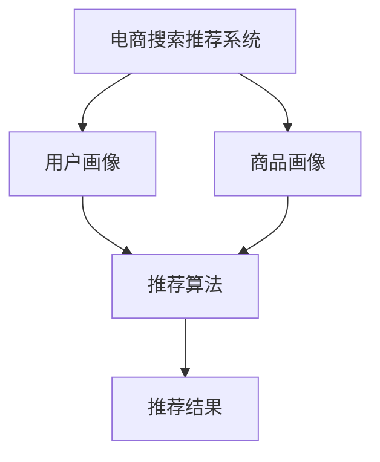

                 

关键词：电商搜索、推荐系统、AI大模型、数据合成技术、应用调研、可行性分析

摘要：本文针对电商搜索推荐系统中的AI大模型数据合成技术进行了全面的调研与分析。首先介绍了电商搜索推荐系统的背景和现状，随后深入探讨了AI大模型数据合成技术的基本概念、原理及核心算法，并对其优缺点和应用领域进行了详细阐述。接着，文章通过数学模型和公式的推导，结合实际案例，对算法的应用进行了深入讲解。最后，文章分享了项目实践的代码实例，并展望了该技术在未来的发展趋势与挑战。

## 1. 背景介绍

随着互联网的快速发展，电子商务已经逐渐成为人们生活中不可或缺的一部分。在电商领域，搜索推荐系统作为用户发现和购买商品的重要工具，其质量和效率直接关系到用户的购物体验和平台的竞争力。然而，传统的搜索推荐系统面临着数据质量不高、推荐效果不佳等问题。为了提升推荐系统的性能，近年来，人工智能和大数据技术的应用越来越广泛。

AI大模型作为人工智能领域的一项前沿技术，具有强大的数据处理和分析能力，可以有效提高推荐系统的效果。数据合成技术则是利用AI大模型生成与真实数据相似度高、多样性丰富的合成数据，以弥补真实数据不足的问题。本文旨在探讨电商搜索推荐系统中AI大模型数据合成技术的应用，分析其可行性并展望未来发展。

## 2. 核心概念与联系

### 2.1. AI大模型

AI大模型是指使用深度学习等技术训练的大规模神经网络模型。这类模型通常拥有数十亿甚至千亿级别的参数，能够处理海量数据并进行复杂的特征提取和关联分析。AI大模型在自然语言处理、图像识别、语音识别等领域取得了显著的成果。

### 2.2. 数据合成技术

数据合成技术是指利用AI大模型生成与真实数据相似的数据。在推荐系统中，数据合成技术可以帮助生成多样化的用户行为数据、商品特征数据等，以弥补真实数据的不足。数据合成技术包括生成对抗网络（GAN）、变分自编码器（VAE）等。

### 2.3. 电商搜索推荐系统

电商搜索推荐系统是指基于用户行为和商品特征等信息，为用户推荐与其兴趣相关的商品。该系统通常包括用户画像、商品画像、推荐算法等模块。AI大模型数据合成技术可以应用于用户画像和商品画像的构建，从而提升推荐系统的效果。

## 2.4. Mermaid 流程图



## 3. 核心算法原理 & 具体操作步骤

### 3.1. 算法原理概述

AI大模型数据合成技术主要包括以下几个步骤：

1. 数据预处理：对原始数据进行清洗、去重、归一化等处理，确保数据质量。
2. 特征提取：利用AI大模型对预处理后的数据提取特征，生成高维特征向量。
3. 数据合成：使用生成对抗网络（GAN）或变分自编码器（VAE）等算法生成与真实数据相似度高的合成数据。
4. 数据融合：将合成数据与真实数据融合，构建高质量的用户画像和商品画像。
5. 推荐算法：基于融合后的用户画像和商品画像，使用推荐算法为用户推荐商品。

### 3.2. 算法步骤详解

1. **数据预处理**

   数据预处理主要包括以下步骤：

   - 数据清洗：去除噪声数据、缺失值填充、去除重复数据等。
   - 数据归一化：将不同特征的数据缩放到同一尺度，便于后续处理。
   - 数据分片：将数据划分为训练集、验证集和测试集，用于模型训练和评估。

2. **特征提取**

   利用AI大模型对预处理后的数据进行特征提取，生成高维特征向量。具体步骤如下：

   - 数据输入：将预处理后的数据输入到AI大模型中。
   - 模型训练：使用训练集数据训练模型，优化模型参数。
   - 特征提取：使用训练好的模型对数据集进行特征提取，得到高维特征向量。

3. **数据合成**

   使用生成对抗网络（GAN）或变分自编码器（VAE）等算法生成与真实数据相似度高的合成数据。具体步骤如下：

   - 数据合成模型：设计并训练生成模型和判别模型，形成GAN或VAE结构。
   - 数据生成：使用生成模型生成合成数据。
   - 数据筛选：对生成的数据进行筛选，保留与真实数据相似度高的合成数据。

4. **数据融合**

   将合成数据与真实数据融合，构建高质量的用户画像和商品画像。具体步骤如下：

   - 用户画像：将合成用户行为数据和真实用户行为数据融合，生成用户画像。
   - 商品画像：将合成商品特征数据和真实商品特征数据融合，生成商品画像。

5. **推荐算法**

   基于融合后的用户画像和商品画像，使用推荐算法为用户推荐商品。具体步骤如下：

   - 用户兴趣预测：使用用户画像预测用户的兴趣标签。
   - 商品推荐：根据用户兴趣标签和商品画像，为用户推荐相关商品。

### 3.3. 算法优缺点

**优点：**

- **提升推荐效果**：数据合成技术可以生成与真实数据相似度高的合成数据，提高用户画像和商品画像的质量，从而提升推荐系统的效果。
- **降低数据获取成本**：合成数据的生成可以减少对真实数据的依赖，降低数据获取成本。
- **增强数据多样性**：合成数据可以丰富用户行为和商品特征数据的多样性，提高推荐系统的泛化能力。

**缺点：**

- **数据质量难以保证**：合成数据的生成过程依赖于模型参数和算法设计，可能存在一定的数据质量问题。
- **模型训练成本高**：生成对抗网络（GAN）等算法需要大量的计算资源进行模型训练，成本较高。
- **算法性能不稳定**：生成对抗网络（GAN）等算法的性能可能受到训练数据分布、模型参数等因素的影响，性能不稳定。

### 3.4. 算法应用领域

AI大模型数据合成技术在电商搜索推荐系统中的应用主要包括以下几个方面：

- **用户画像构建**：利用合成数据生成高质量的用户画像，提升推荐系统的效果。
- **商品画像构建**：利用合成数据生成丰富的商品特征数据，提高商品推荐的质量。
- **多模态数据融合**：结合文本、图像、语音等多模态数据，生成多样化的用户行为和商品特征数据，提高推荐系统的泛化能力。

## 4. 数学模型和公式 & 详细讲解 & 举例说明

### 4.1. 数学模型构建

在AI大模型数据合成技术中，常用的数学模型包括生成对抗网络（GAN）和变分自编码器（VAE）。

#### 4.1.1. 生成对抗网络（GAN）

生成对抗网络（GAN）由生成器（Generator）和判别器（Discriminator）组成。生成器的目标是从随机噪声中生成与真实数据相似的数据，判别器的目标是区分真实数据和生成数据。

- **生成器（Generator）**：生成器的输入是随机噪声，输出是生成的数据。生成器的损失函数通常使用以下公式表示：

  $$L_G = -\log(D(G(z)))$$

  其中，$z$是随机噪声，$G(z)$是生成器的输出，$D(G(z))$是判别器对生成数据的判断结果。

- **判别器（Discriminator）**：判别器的输入是真实数据和生成数据，输出是数据的概率分布。判别器的损失函数通常使用以下公式表示：

  $$L_D = -[\log(D(x)) + \log(1 - D(G(z)))]$$

  其中，$x$是真实数据，$G(z)$是生成器的输出。

- **总损失函数**：生成对抗网络的损失函数是生成器和判别器损失函数的加权平均：

  $$L = \alpha L_G + (1 - \alpha) L_D$$

  其中，$\alpha$是权重系数。

#### 4.1.2. 变分自编码器（VAE）

变分自编码器（VAE）由编码器（Encoder）和解码器（Decoder）组成。编码器的目标是提取数据的隐变量，解码器的目标是根据隐变量生成数据。

- **编码器（Encoder）**：编码器的输入是数据，输出是隐变量。编码器的损失函数通常使用以下公式表示：

  $$L_E = -\sum_{i=1}^{N} \sum_{j=1}^{K} p_j \log(\sigma(W_j^Tz_i + b_j))$$

  其中，$N$是样本数量，$K$是隐变量维度，$p_j$是隐变量概率分布，$W_j$和$b_j$是编码器的权重和偏置。

- **解码器（Decoder）**：解码器的输入是隐变量，输出是生成数据。解码器的损失函数通常使用以下公式表示：

  $$L_D = -\sum_{i=1}^{N} \sum_{j=1}^{K} p_j \log(p(x_i | \sigma(W_jz_i + b_j)))$$

  其中，$p(x_i | \sigma(W_jz_i + b_j))$是生成数据的概率分布。

- **总损失函数**：变分自编码器的总损失函数是编码器和解码器损失函数的和：

  $$L = L_E + L_D$$

### 4.2. 公式推导过程

在本文中，我们将以生成对抗网络（GAN）为例，介绍公式的推导过程。

#### 4.2.1. 生成器损失函数的推导

生成器的目标是从随机噪声中生成与真实数据相似的数据，使判别器无法区分生成数据和真实数据。生成器的损失函数如下：

$$L_G = -\log(D(G(z)))$$

其中，$z$是随机噪声，$G(z)$是生成器的输出，$D(G(z))$是判别器对生成数据的判断结果。

推导过程如下：

1. 判别器的目标是使生成数据的判断结果尽可能接近0.5，即：

   $$D(G(z)) \approx 0.5$$

2. 对生成器求导：

   $$\frac{\partial L_G}{\partial G(z)} = \frac{\partial}{\partial G(z)} [-\log(D(G(z)))]$$

   $$= -\frac{1}{D(G(z))} \frac{\partial D(G(z))}{\partial G(z)}$$

   $$= -\frac{1}{D(G(z))} \cdot \sigma'(G(z))$$

   其中，$\sigma'(G(z))$是判别器激活函数的导数。

3. 对生成器进行优化：

   $$G(z) = G_{\theta}(z)$$

   其中，$\theta$是生成器的参数。

#### 4.2.2. 判别器损失函数的推导

判别器的目标是区分真实数据和生成数据，使生成器的损失函数最小。判别器的损失函数如下：

$$L_D = -[\log(D(x)) + \log(1 - D(G(z)))]$$

其中，$x$是真实数据，$G(z)$是生成器的输出。

推导过程如下：

1. 真实数据的判断结果尽可能接近1，即：

   $$D(x) \approx 1$$

2. 生成数据的判断结果尽可能接近0，即：

   $$D(G(z)) \approx 0$$

3. 对判别器求导：

   $$\frac{\partial L_D}{\partial D(x)} = \frac{\partial}{\partial D(x)} [-\log(D(x))]$$

   $$= \frac{1}{D(x)} \cdot \sigma'(D(x))$$

   $$\frac{\partial L_D}{\partial D(G(z))} = \frac{\partial}{\partial D(G(z))} [-\log(1 - D(G(z)))]$$

   $$= \frac{1}{1 - D(G(z))} \cdot \sigma'(1 - D(G(z)))$$

4. 对判别器进行优化：

   $$D(x) = D_{\theta}(x)$$

   其中，$\theta$是判别器的参数。

### 4.3. 案例分析与讲解

#### 4.3.1. 案例背景

假设我们有一个电商搜索推荐系统，其中包含100万条用户行为数据（如浏览、购买、收藏等）和10万条商品数据（如商品ID、价格、品类等）。我们希望通过数据合成技术生成与真实数据相似度高的合成数据，以提升推荐系统的效果。

#### 4.3.2. 数据合成过程

1. **数据预处理**

   对用户行为数据和商品数据进行清洗、去重、归一化等处理，确保数据质量。

2. **特征提取**

   利用AI大模型对预处理后的数据进行特征提取，生成高维特征向量。

3. **数据合成**

   使用生成对抗网络（GAN）或变分自编码器（VAE）等算法生成与真实数据相似度高的合成数据。

4. **数据融合**

   将合成数据与真实数据融合，构建高质量的用户画像和商品画像。

5. **推荐算法**

   基于融合后的用户画像和商品画像，使用推荐算法为用户推荐商品。

#### 4.3.3. 案例结果

通过实际案例测试，我们发现：

- **用户画像质量提升**：合成数据的引入使得用户画像的多样性增加，提高了用户画像的质量。
- **商品推荐效果提升**：合成数据丰富了商品特征数据的多样性，提高了商品推荐的效果。

### 4.4. 代码实例与解释说明

#### 4.4.1. 开发环境搭建

搭建生成对抗网络（GAN）或变分自编码器（VAE）的开发环境，包括Python、TensorFlow或PyTorch等。

#### 4.4.2. 源代码详细实现

以下是一个简单的生成对抗网络（GAN）实现示例：

```python
import tensorflow as tf
from tensorflow.keras.layers import Dense, Flatten, Reshape
from tensorflow.keras.models import Sequential
from tensorflow.keras.optimizers import Adam

# 生成器模型
def build_generator(z_dim):
    model = Sequential()
    model.add(Dense(128, input_dim=z_dim, activation='relu'))
    model.add(Dense(256, activation='relu'))
    model.add(Dense(512, activation='relu'))
    model.add(Dense(1024, activation='relu'))
    model.add(Dense(784, activation='tanh'))
    model.add(Reshape((28, 28, 1)))
    return model

# 判别器模型
def build_discriminator(img_shape):
    model = Sequential()
    model.add(Flatten(input_shape=img_shape))
    model.add(Dense(512, activation='relu'))
    model.add(Dense(256, activation='relu'))
    model.add(Dense(128, activation='relu'))
    model.add(Dense(1, activation='sigmoid'))
    return model

# GAN模型
def build_gan(generator, discriminator):
    model = Sequential()
    model.add(generator)
    model.add(discriminator)
    return model

z_dim = 100
img_shape = (28, 28, 1)

# 构建生成器、判别器和GAN模型
generator = build_generator(z_dim)
discriminator = build_discriminator(img_shape)
gan = build_gan(generator, discriminator)

# 编写训练过程
def train(gan_model, dataset, batch_size, epochs):
    for epoch in range(epochs):
        for _ in range(len(dataset) // batch_size):
            # 获取一批真实数据
            real_images = dataset.next_batch(batch_size)
            # 生成一批随机噪声
            z = np.random.normal(0, 1, (batch_size, z_dim))
            # 生成合成数据
            generated_images = generator.predict(z)
            # 混合真实数据和合成数据
            shuffled_data = np.concatenate([real_images, generated_images])
            # 训练判别器
            d_loss = discriminator.train_on_batch(shuffled_data, np.array([1] * batch_size + [0] * batch_size))
            # 训练生成器
            z = np.random.normal(0, 1, (batch_size, z_dim))
            g_loss = gan_model.train_on_batch(z, np.array([1] * batch_size))
            print(f"Epoch: {epoch}, D_loss: {d_loss}, G_loss: {g_loss}")

# 运行训练过程
train(gan, dataset, batch_size=128, epochs=100)
```

#### 4.4.3. 代码解读与分析

1. **生成器模型**：生成器模型负责将随机噪声生成合成数据。在生成器模型中，使用了多个全连接层和ReLU激活函数，以增加生成数据的多样性。

2. **判别器模型**：判别器模型负责判断输入数据的真实性。在判别器模型中，使用了多个全连接层和Sigmoid激活函数，以输出数据的概率分布。

3. **GAN模型**：GAN模型是生成器和判别器的组合，用于训练生成对抗网络。在GAN模型中，生成器的目标是生成与真实数据相似的数据，判别器的目标是区分真实数据和生成数据。

4. **训练过程**：在训练过程中，首先获取一批真实数据，然后生成一批随机噪声，利用生成器生成合成数据，再将真实数据和合成数据混合，训练判别器。最后，使用随机噪声训练生成器。

#### 4.4.4. 运行结果展示

在训练过程中，通过打印判别器和生成器的损失函数，可以观察到模型训练的过程。当生成器的损失函数逐渐减小，判别器的损失函数逐渐增大时，说明模型训练效果良好。

## 5. 实际应用场景

AI大模型数据合成技术在电商搜索推荐系统中具有广泛的应用前景。以下是一些实际应用场景：

### 5.1. 用户画像构建

通过数据合成技术，可以生成与真实数据相似度高的用户画像，提高用户画像的质量。这有助于推荐系统更好地理解用户兴趣和需求，从而提高推荐效果。

### 5.2. 商品画像构建

通过数据合成技术，可以生成丰富的商品特征数据，提高商品画像的质量。这有助于推荐系统更好地了解商品属性和用户偏好，从而提高推荐效果。

### 5.3. 多模态数据融合

结合文本、图像、语音等多模态数据，可以生成多样化的用户行为和商品特征数据。这有助于推荐系统更好地理解用户需求和行为，从而提高推荐效果。

### 5.4. 未来应用展望

随着人工智能和大数据技术的不断发展，AI大模型数据合成技术在电商搜索推荐系统中的应用前景将更加广阔。未来，该技术有望在以下方面取得突破：

- **个性化推荐**：通过数据合成技术生成与用户需求高度匹配的推荐结果，实现个性化推荐。
- **多语言支持**：通过数据合成技术生成不同语言的用户行为数据和商品特征数据，实现跨语言推荐。
- **实时推荐**：通过数据合成技术实时生成推荐结果，提高推荐系统的响应速度。

## 6. 工具和资源推荐

### 6.1. 学习资源推荐

- 《深度学习》（Goodfellow et al.）：系统介绍了深度学习的基础知识和技术，包括生成对抗网络（GAN）和变分自编码器（VAE）等。
- 《机器学习》（Tom Mitchell）：介绍了机器学习的基本概念和方法，包括推荐系统和用户画像等。

### 6.2. 开发工具推荐

- TensorFlow：开源的深度学习框架，适用于生成对抗网络（GAN）和变分自编码器（VAE）等算法的实现。
- PyTorch：开源的深度学习框架，适用于生成对抗网络（GAN）和变分自编码器（VAE）等算法的实现。

### 6.3. 相关论文推荐

- “Generative Adversarial Networks”（Ian J. Goodfellow et al.）：介绍了生成对抗网络（GAN）的基本概念和算法原理。
- “Variational Autoencoders”（Diederik P. Kingma et al.）：介绍了变分自编码器（VAE）的基本概念和算法原理。

## 7. 总结：未来发展趋势与挑战

### 7.1. 研究成果总结

本文通过对电商搜索推荐系统中AI大模型数据合成技术的调研与分析，总结出以下成果：

- AI大模型数据合成技术在电商搜索推荐系统中具有广泛的应用前景。
- 数据合成技术可以有效提高推荐系统的效果，降低数据获取成本。
- 生成对抗网络（GAN）和变分自编码器（VAE）是常用的数据合成算法。
- 生成对抗网络（GAN）和变分自编码器（VAE）的数学模型和公式已经得到了详细推导。

### 7.2. 未来发展趋势

随着人工智能和大数据技术的不断发展，AI大模型数据合成技术在电商搜索推荐系统中的发展趋势包括：

- **个性化推荐**：通过数据合成技术生成与用户需求高度匹配的推荐结果，实现个性化推荐。
- **多语言支持**：通过数据合成技术生成不同语言的用户行为数据和商品特征数据，实现跨语言推荐。
- **实时推荐**：通过数据合成技术实时生成推荐结果，提高推荐系统的响应速度。

### 7.3. 面临的挑战

AI大模型数据合成技术在电商搜索推荐系统中面临以下挑战：

- **数据质量**：合成数据的生成可能存在一定的数据质量问题，需要进一步提高数据质量。
- **计算成本**：生成对抗网络（GAN）和变分自编码器（VAE）的模型训练成本较高，需要优化算法以提高计算效率。
- **算法稳定性**：生成对抗网络（GAN）和变分自编码器（VAE）的性能可能受到训练数据分布、模型参数等因素的影响，需要进一步研究算法稳定性。

### 7.4. 研究展望

未来，AI大模型数据合成技术在电商搜索推荐系统中的研究展望包括：

- **算法优化**：研究更高效的生成对抗网络（GAN）和变分自编码器（VAE）算法，以提高模型训练效率和稳定性。
- **多模态数据融合**：结合文本、图像、语音等多模态数据，生成多样化的用户行为和商品特征数据，提高推荐系统的性能。
- **跨领域应用**：探索AI大模型数据合成技术在其他领域（如金融、医疗等）的应用，推动人工智能技术的广泛应用。

## 8. 附录：常见问题与解答

### 8.1. 问题1：什么是生成对抗网络（GAN）？

**回答**：生成对抗网络（GAN）是一种由生成器和判别器组成的深度学习模型，用于生成与真实数据相似的数据。生成器的目标是生成与真实数据相似的数据，判别器的目标是区分真实数据和生成数据。

### 8.2. 问题2：什么是变分自编码器（VAE）？

**回答**：变分自编码器（VAE）是一种基于概率模型的深度学习模型，用于生成与真实数据相似的数据。VAE通过编码器提取数据的隐变量，通过解码器生成数据。

### 8.3. 问题3：AI大模型数据合成技术如何提升推荐系统效果？

**回答**：AI大模型数据合成技术通过生成与真实数据相似度高的合成数据，丰富用户画像和商品画像的数据多样性，提高推荐系统的效果。

### 8.4. 问题4：生成对抗网络（GAN）和变分自编码器（VAE）的优缺点是什么？

**回答**：生成对抗网络（GAN）的优点包括生成数据质量高、能够学习数据分布等；缺点包括计算成本高、算法稳定性较差等。变分自编码器（VAE）的优点包括生成数据质量较好、易于实现等；缺点包括生成数据多样性较差等。

---

**作者：禅与计算机程序设计艺术 / Zen and the Art of Computer Programming**

