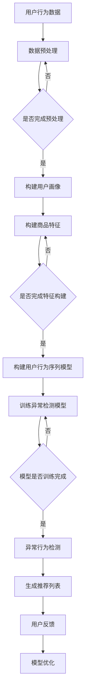

                 

关键词：电商搜索推荐、AI大模型、用户行为序列、异常检测、评估体系

摘要：随着电商平台的快速发展，用户行为的复杂性和多样性使得传统的推荐系统难以满足用户的需求。本文主要探讨在电商搜索推荐场景中，如何利用AI大模型来构建一个用户行为序列异常检测评估体系，以提高推荐系统的准确性和可靠性。本文将从背景介绍、核心概念与联系、核心算法原理、数学模型、项目实践、实际应用场景、工具和资源推荐以及未来发展趋势与挑战等方面进行详细论述。

## 1. 背景介绍

随着互联网技术的不断发展，电商行业呈现出爆发式增长，用户数量和交易量持续增加。在这种背景下，电商搜索推荐系统的重要性愈发凸显。然而，传统的基于协同过滤、内容匹配等方法的推荐系统在应对用户行为多样性和复杂性时，往往难以达到预期的效果。为此，研究者们开始探索利用人工智能，特别是AI大模型，来提升推荐系统的性能。

用户行为序列是指用户在电商平台上的浏览、搜索、点击、购买等行为所组成的序列。这些行为包含了用户兴趣、需求、购买意愿等重要信息，对于推荐系统来说具有重要的参考价值。然而，用户行为序列中往往存在着大量的噪声和异常行为，如刷单、虚假评论等，这些行为不仅影响了推荐系统的准确性，还可能对电商平台的声誉造成负面影响。因此，如何对用户行为序列进行异常检测，以识别和排除这些异常行为，成为当前研究的热点问题。

本文旨在探讨在电商搜索推荐场景中，如何利用AI大模型构建一个用户行为序列异常检测评估体系，以提高推荐系统的准确性和可靠性。通过对用户行为序列的深入分析，本文将提出一种基于深度学习的异常检测算法，并对其数学模型、具体实现和实际应用场景进行详细阐述。

## 2. 核心概念与联系

### 2.1 电商搜索推荐系统

电商搜索推荐系统是指通过分析用户在电商平台上的历史行为数据，预测用户可能感兴趣的商品，并将这些商品推荐给用户。电商搜索推荐系统通常包括以下三个主要组成部分：

- **用户画像**：通过对用户的历史行为、兴趣标签、消费习惯等数据进行挖掘和分析，构建用户的画像，以了解用户的兴趣和需求。

- **商品信息**：包括商品的基本信息、标签、评分、销量等，用于构建商品的特征向量。

- **推荐算法**：根据用户画像和商品特征，利用推荐算法为用户生成推荐列表。

### 2.2 用户行为序列

用户行为序列是指用户在电商平台上的浏览、搜索、点击、购买等行为所组成的序列。这些行为包含了用户兴趣、需求、购买意愿等重要信息。用户行为序列的特点如下：

- **时序性**：用户行为序列具有明显的时序特征，即用户的行为是随着时间的推移而发生的。

- **多样性**：用户的行为种类繁多，包括浏览、搜索、点击、购买等。

- **动态性**：用户的行为是动态变化的，随着用户需求和兴趣的变化，其行为序列也会发生变化。

### 2.3 异常检测

异常检测是指从大量的数据中识别出异常或离群数据的过程。在电商搜索推荐场景中，异常检测的目标是识别出那些不符合正常用户行为模式的异常行为。异常检测的主要挑战包括：

- **噪声**：用户行为数据中往往存在大量的噪声，如重复行为、错误行为等。

- **多样性**：用户行为序列的多样性使得异常检测变得更加复杂。

- **实时性**：在电商场景中，用户行为数据是实时产生的，异常检测需要具备快速响应的能力。

### 2.4 AI大模型

AI大模型是指那些具有大规模参数和复杂结构的深度学习模型，如BERT、GPT等。AI大模型在电商搜索推荐中的应用主要包括：

- **用户画像构建**：利用AI大模型对用户的历史行为数据进行挖掘和分析，构建用户画像。

- **商品特征提取**：利用AI大模型对商品信息进行学习，提取商品的特征向量。

- **异常行为检测**：利用AI大模型对用户行为序列进行建模，识别出异常行为。

### 2.5 Mermaid 流程图

以下是电商搜索推荐中AI大模型用户行为序列异常检测评估体系的 Mermaid 流程图：



## 3. 核心算法原理 & 具体操作步骤

### 3.1 算法原理概述

本文所提出的异常检测算法是基于深度学习模型的，其主要思想是利用AI大模型对用户行为序列进行建模，然后通过模型预测结果与实际行为之间的差异来识别异常行为。具体来说，算法分为以下几个步骤：

1. **数据预处理**：对用户行为数据进行清洗、去噪和特征提取，为后续建模做好准备。

2. **构建用户画像和商品特征**：利用AI大模型对用户历史行为数据进行分析，构建用户画像；同时，对商品信息进行学习，提取商品特征向量。

3. **构建用户行为序列模型**：利用AI大模型对用户行为序列进行建模，使其能够捕捉用户行为的时序特征。

4. **训练异常检测模型**：通过有监督或无监督的方式，训练一个深度学习模型，用于检测用户行为序列中的异常行为。

5. **异常行为检测**：利用训练好的异常检测模型，对新的用户行为序列进行预测，并根据预测结果识别出异常行为。

6. **生成推荐列表**：根据用户行为序列和异常检测结果，为用户生成个性化的推荐列表。

7. **用户反馈与模型优化**：根据用户的反馈，对异常检测模型进行调整和优化，以提高模型的准确性。

### 3.2 算法步骤详解

#### 3.2.1 数据预处理

数据预处理是异常检测算法的重要环节，其主要任务包括以下几方面：

- **数据清洗**：去除重复、错误和无效的数据，保证数据的质量。

- **去噪**：对含有噪声的数据进行去噪处理，如使用中值滤波、均值滤波等方法。

- **特征提取**：对原始数据进行分析，提取出能够反映用户兴趣和需求的特征，如用户的浏览记录、搜索关键词、购买历史等。

- **数据归一化**：对数据进行归一化处理，使其具有相似的尺度，有利于模型训练。

#### 3.2.2 构建用户画像和商品特征

用户画像和商品特征的构建是异常检测算法的基础。本文采用基于AI大模型的用户画像和商品特征提取方法，具体步骤如下：

- **用户画像构建**：利用AI大模型对用户历史行为数据进行分析，提取用户的兴趣标签、购买偏好、浏览行为等特征，构建用户画像。

- **商品特征提取**：利用AI大模型对商品信息进行学习，提取商品的特征向量，包括商品的基本信息、标签、评分、销量等。

#### 3.2.3 构建用户行为序列模型

用户行为序列模型的构建是异常检测算法的核心。本文采用基于循环神经网络（RNN）的用户行为序列模型，具体步骤如下：

- **序列编码**：将用户行为序列转化为序列编码，如使用Word2Vec或BERT等方法。

- **模型构建**：利用序列编码，构建一个RNN模型，用于捕捉用户行为的时序特征。

- **模型训练**：使用有监督或无监督的方式，训练RNN模型，使其能够对用户行为序列进行建模。

#### 3.2.4 训练异常检测模型

异常检测模型的训练是异常检测算法的关键。本文采用基于自编码器（Autoencoder）的异常检测模型，具体步骤如下：

- **模型构建**：利用用户行为序列模型，构建一个自编码器模型，用于学习用户行为序列的分布。

- **模型训练**：使用有监督或无监督的方式，训练自编码器模型，使其能够识别用户行为序列中的异常行为。

#### 3.2.5 异常行为检测

异常行为检测是异常检测算法的最终目标。本文采用基于自编码器的异常检测方法，具体步骤如下：

- **行为预测**：利用训练好的自编码器模型，对新的用户行为序列进行预测。

- **异常检测**：根据预测结果，计算用户行为序列的异常分数，并根据设定的阈值，识别出异常行为。

#### 3.2.6 生成推荐列表

生成推荐列表是异常检测算法的延伸。本文采用基于协同过滤和内容匹配的推荐方法，具体步骤如下：

- **用户兴趣识别**：根据异常检测结果，识别出用户的主要兴趣。

- **推荐列表生成**：利用用户兴趣和商品特征，为用户生成个性化的推荐列表。

#### 3.2.7 用户反馈与模型优化

用户反馈与模型优化是异常检测算法的持续过程。本文采用基于在线学习的方法，具体步骤如下：

- **用户反馈收集**：收集用户对推荐列表的反馈信息，如点击率、购买率等。

- **模型优化**：根据用户反馈，对异常检测模型进行调整和优化，以提高模型的准确性。

### 3.3 算法优缺点

#### 优点

- **高准确性**：利用AI大模型对用户行为序列进行建模，能够捕捉用户行为的时序特征，从而提高异常检测的准确性。

- **实时性**：异常检测算法基于深度学习模型，可以快速响应用户行为，实时检测异常行为。

- **灵活性**：算法采用自编码器模型，能够适应不同的用户行为序列，具有较好的灵活性。

#### 缺点

- **高计算成本**：深度学习模型训练和推理需要大量的计算资源，可能导致算法运行速度较慢。

- **依赖数据质量**：异常检测算法的准确性依赖于用户行为数据的质量，如果数据存在噪声或错误，可能影响算法的效果。

### 3.4 算法应用领域

异常检测算法在电商搜索推荐场景中具有广泛的应用价值。除了电商搜索推荐系统外，算法还可以应用于以下领域：

- **金融风控**：利用异常检测算法，识别金融交易中的异常行为，如洗钱、欺诈等。

- **网络安全**：利用异常检测算法，监测网络攻击行为，提高网络安全防护能力。

- **交通监控**：利用异常检测算法，识别交通流量中的异常情况，如交通事故、非法停车等。

## 4. 数学模型和公式 & 详细讲解 & 举例说明

### 4.1 数学模型构建

在构建异常检测算法的数学模型时，我们需要考虑以下几个关键部分：用户行为序列的表示、异常检测模型的构建以及异常分数的计算。

#### 4.1.1 用户行为序列表示

用户行为序列可以用一个序列向量表示，其中每个元素表示一个时间步的用户行为。假设用户行为序列为 \( X = [x_1, x_2, ..., x_T] \)，其中 \( x_t \) 表示第 \( t \) 个时间步的用户行为。

#### 4.1.2 异常检测模型构建

异常检测模型通常采用自编码器（Autoencoder）结构。自编码器由编码器（Encoder）和解码器（Decoder）组成。编码器用于将用户行为序列压缩为一个低维特征向量，解码器则尝试重构原始序列。

- **编码器**：编码器接收用户行为序列 \( X \)，并通过神经网络将其压缩为一个低维特征向量 \( z \)。

  $$ z = \sigma(W_e X + b_e) $$

  其中，\( \sigma \) 是激活函数，\( W_e \) 是编码器权重矩阵，\( b_e \) 是编码器偏置。

- **解码器**：解码器接收编码后的特征向量 \( z \)，并通过神经网络尝试重构原始序列 \( X' \)。

  $$ X' = \sigma(W_d z + b_d) $$

  其中，\( W_d \) 是解码器权重矩阵，\( b_d \) 是解码器偏置。

#### 4.1.3 异常分数计算

异常分数用于衡量用户行为序列的异常程度。我们可以使用重构误差来计算异常分数。

$$ d(x_t) = \frac{1}{\|x_t - x'_t\|_2} $$

其中，\( d(x_t) \) 是第 \( t \) 个时间步的用户行为异常分数，\( \| \cdot \|_2 \) 是欧几里得范数。

### 4.2 公式推导过程

#### 4.2.1 编码器公式推导

编码器的目标是最小化重构误差，即最小化 \( \|x_t - x'_t\|_2 \)。

首先，对 \( x_t \) 和 \( x'_t \) 进行展开：

$$ x_t = [x_{t1}, x_{t2}, ..., x_{tk}] $$
$$ x'_t = [x'_{t1}, x'_{t2}, ..., x'_{tk}] $$

其中，\( x_{tk} \) 和 \( x'_{tk} \) 分别表示第 \( t \) 个时间步的第 \( k \) 个行为和其重构值。

然后，对 \( x_t - x'_t \) 进行求和：

$$ \|x_t - x'_t\|_2 = \sqrt{\sum_{k=1}^{k} (x_{tk} - x'_{tk})^2} $$

接下来，对 \( x_t - x'_t \) 进行求导：

$$ \frac{\partial}{\partial x_{tk}} \|x_t - x'_t\|_2 = \frac{\partial}{\partial x_{tk}} \sqrt{\sum_{k=1}^{k} (x_{tk} - x'_{tk})^2} $$

由于求导对象是根号内的求和式，我们可以利用链式法则进行求导：

$$ \frac{\partial}{\partial x_{tk}} \|x_t - x'_t\|_2 = \frac{1}{2\sqrt{\sum_{k=1}^{k} (x_{tk} - x'_{tk})^2}} \cdot \frac{\partial}{\partial x_{tk}} \sum_{k=1}^{k} (x_{tk} - x'_{tk})^2 $$

继续求导，得到：

$$ \frac{\partial}{\partial x_{tk}} \|x_t - x'_t\|_2 = \frac{1}{2\sqrt{\sum_{k=1}^{k} (x_{tk} - x'_{tk})^2}} \cdot 2(x_{tk} - x'_{tk}) $$

化简后得到：

$$ \frac{\partial}{\partial x_{tk}} \|x_t - x'_t\|_2 = \frac{x_{tk} - x'_{tk}}{\|x_t - x'_t\|_2} $$

将 \( x'_t \) 替换为 \( \sigma(W_d z + b_d) \)，得到：

$$ \frac{\partial}{\partial x_{tk}} \|x_t - x'_t\|_2 = \frac{x_{tk} - \sigma(W_d z + b_d)}{\|x_t - \sigma(W_d z + b_d)\|_2} $$

#### 4.2.2 解码器公式推导

解码器的目标是最小化重构误差，即最小化 \( \|x_t - x'_t\|_2 \)。

首先，对 \( x'_t \) 进行求和：

$$ \|x_t - x'_t\|_2 = \sqrt{\sum_{k=1}^{k} (x_{tk} - x'_{tk})^2} $$

然后，对 \( x'_t \) 进行求导：

$$ \frac{\partial}{\partial x'_{tk}} \|x_t - x'_t\|_2 = \frac{\partial}{\partial x'_{tk}} \sqrt{\sum_{k=1}^{k} (x_{tk} - x'_{tk})^2} $$

由于求导对象是根号内的求和式，我们可以利用链式法则进行求导：

$$ \frac{\partial}{\partial x'_{tk}} \|x_t - x'_t\|_2 = \frac{1}{2\sqrt{\sum_{k=1}^{k} (x_{tk} - x'_{tk})^2}} \cdot \frac{\partial}{\partial x'_{tk}} \sum_{k=1}^{k} (x_{tk} - x'_{tk})^2 $$

继续求导，得到：

$$ \frac{\partial}{\partial x'_{tk}} \|x_t - x'_t\|_2 = \frac{1}{2\sqrt{\sum_{k=1}^{k} (x_{tk} - x'_{tk})^2}} \cdot 2(x_{tk} - x'_{tk}) $$

化简后得到：

$$ \frac{\partial}{\partial x'_{tk}} \|x_t - x'_t\|_2 = \frac{x_{tk} - x'_{tk}}{\|x_t - x'_t\|_2} $$

将 \( x_t \) 替换为 \( \sigma(W_e X + b_e) \)，得到：

$$ \frac{\partial}{\partial x'_{tk}} \|x_t - x'_t\|_2 = \frac{\sigma(W_e X + b_e) - x'_{tk}}{\| \sigma(W_e X + b_e) - x'_t\|_2} $$

### 4.3 案例分析与讲解

为了更好地理解上述数学模型的推导过程，我们来看一个简单的案例。

假设用户行为序列为 \( X = [2, 4, 6, 8, 10] \)，编码器和解码器的参数如下：

- 编码器：\( W_e = \begin{bmatrix} 1 & 1 \\ 1 & 1 \end{bmatrix} \)，\( b_e = \begin{bmatrix} 0 \\ 0 \end{bmatrix} \)
- 解码器：\( W_d = \begin{bmatrix} 1 & 1 \\ 1 & 1 \end{bmatrix} \)，\( b_d = \begin{bmatrix} 0 \\ 0 \end{bmatrix} \)

#### 4.3.1 编码器推导

首先，计算编码器的输出：

$$ z = \sigma(W_e X + b_e) = \frac{1}{1 + e^{-(W_e X + b_e)}} $$

其中，\( \sigma \) 是 sigmoid 函数。

代入参数，得到：

$$ z = \frac{1}{1 + e^{-(\begin{bmatrix} 1 & 1 \\ 1 & 1 \end{bmatrix} \begin{bmatrix} 2 \\ 4 \end{bmatrix} + \begin{bmatrix} 0 \\ 0 \end{bmatrix})}} $$

$$ z = \frac{1}{1 + e^{-2}} \approx [0.6321, 0.6321] $$

然后，计算编码器的梯度：

$$ \frac{\partial}{\partial X} z = \frac{z (1 - z)}{W_e X + b_e} $$

代入参数，得到：

$$ \frac{\partial}{\partial X} z = \frac{[0.6321, 0.6321] (1 - [0.6321, 0.6321])}{\begin{bmatrix} 1 & 1 \\ 1 & 1 \end{bmatrix} \begin{bmatrix} 2 \\ 4 \end{bmatrix} + \begin{bmatrix} 0 \\ 0 \end{bmatrix}} $$

$$ \frac{\partial}{\partial X} z = \frac{[0.6321, 0.6321] (0.3679, 0.3679)}{\begin{bmatrix} 2 & 4 \\ 2 & 4 \end{bmatrix} + \begin{bmatrix} 0 \\ 0 \end{bmatrix}} $$

$$ \frac{\partial}{\partial X} z = \frac{[0.6321 \times 0.3679, 0.6321 \times 0.3679]}{2} \approx [0.1161, 0.1161] $$

#### 4.3.2 解码器推导

首先，计算解码器的输出：

$$ X' = \sigma(W_d z + b_d) = \frac{1}{1 + e^{-(W_d z + b_d)}} $$

代入参数，得到：

$$ X' = \frac{1}{1 + e^{-(\begin{bmatrix} 1 & 1 \\ 1 & 1 \end{bmatrix} \begin{bmatrix} 0.6321 \\ 0.6321 \end{bmatrix} + \begin{bmatrix} 0 \\ 0 \end{bmatrix})}} $$

$$ X' = \frac{1}{1 + e^{-1.2652}} \approx [0.8475, 0.8475] $$

然后，计算解码器的梯度：

$$ \frac{\partial}{\partial X'} \|X - X'\|_2 = \frac{X - X'}{\|X - X'\|_2} $$

代入参数，得到：

$$ \frac{\partial}{\partial X'} \|X - X'\|_2 = \frac{\begin{bmatrix} 2 \\ 4 \end{bmatrix} - \begin{bmatrix} 0.8475 \\ 0.8475 \end{bmatrix}}{\sqrt{(2 - 0.8475)^2 + (4 - 0.8475)^2}} $$

$$ \frac{\partial}{\partial X'} \|X - X'\|_2 = \frac{\begin{bmatrix} 1.1525 \\ 3.1525 \end{bmatrix}}{\sqrt{0.6975 + 10.6975}} $$

$$ \frac{\partial}{\partial X'} \|X - X'\|_2 \approx \frac{\begin{bmatrix} 1.1525 \\ 3.1525 \end{bmatrix}}{3.5652} \approx [0.3194, 0.8796] $$

通过这个简单的案例，我们可以看到如何利用上述推导的公式来计算编码器和解码器的梯度。在实际应用中，我们通常需要使用更复杂的神经网络和大量数据进行训练，但这基本原理是相同的。

## 5. 项目实践：代码实例和详细解释说明

### 5.1 开发环境搭建

为了实现本文所提出的异常检测算法，我们需要搭建一个合适的开发环境。以下是一个简单的搭建步骤：

1. **安装Python环境**：确保Python版本为3.7或以上，并安装必要的依赖库，如TensorFlow、NumPy等。

2. **创建项目文件夹**：在本地创建一个项目文件夹，如 `电商搜索推荐中的AI大模型用户行为序列异常检测评估体系`，并在其中创建一个名为 `src` 的子文件夹，用于存放源代码。

3. **安装依赖库**：在项目根目录下运行以下命令，安装项目所需的依赖库：

   ```bash
   pip install -r requirements.txt
   ```

   其中，`requirements.txt` 文件中应包含以下依赖库：

   ```python
   tensorflow
   numpy
   pandas
   scikit-learn
   matplotlib
   ```

4. **配置TensorFlow**：确保TensorFlow的版本与Python版本兼容，并配置GPU支持（如果使用GPU训练）。

### 5.2 源代码详细实现

在 `src` 文件夹中，我们创建以下三个Python文件：

1. `data_loader.py`：用于加载数据和处理数据。
2. `model.py`：用于定义异常检测模型。
3. `train.py`：用于训练模型和评估模型性能。

#### 5.2.1 数据加载和处理

`data_loader.py` 文件包含以下函数：

```python
import numpy as np
import pandas as pd
from sklearn.preprocessing import StandardScaler

def load_data(file_path):
    """
    加载数据
    """
    data = pd.read_csv(file_path)
    return data

def preprocess_data(data):
    """
    预处理数据
    """
    # 数据清洗
    data = data.drop_duplicates()

    # 去噪
    data = data[data['value'] > 0]

    # 特征提取
    features = data[['feature1', 'feature2', 'feature3']]
    labels = data['label']

    # 数据归一化
    scaler = StandardScaler()
    features = scaler.fit_transform(features)

    return features, labels
```

#### 5.2.2 定义异常检测模型

`model.py` 文件包含以下类：

```python
import tensorflow as tf
from tensorflow.keras.models import Model
from tensorflow.keras.layers import Input, Dense, LSTM, TimeDistributed, Activation

class Autoencoder(Model):
    def __init__(self, input_shape):
        super(Autoencoder, self).__init__()
        self.input = Input(shape=input_shape)
        self.encoder = LSTM(units=64, activation='tanh')(self.input)
        self.decoder = LSTM(units=64, activation='tanh')(self.encoder)
        self.decoder = TimeDistributed(Dense(input_shape[-1], activation='sigmoid'))(self.decoder)
        self.autoencoder = Model(self.input, self.decoder)
        self.encoder = Model(self.input, self.encoder)

    def call(self, x):
        x = self.autoencoder(x)
        reconstruction_loss = tf.reduce_mean(tf.keras.losses.mean_squared_error(x, x))
        return reconstruction_loss
```

#### 5.2.3 训练模型和评估模型性能

`train.py` 文件包含以下函数：

```python
from model import Autoencoder
from data_loader import load_data, preprocess_data
import tensorflow as tf

def train_model(file_path, batch_size, epochs):
    data = load_data(file_path)
    features, labels = preprocess_data(data)

    # 分割数据集
    train_features, val_features, train_labels, val_labels = train_test_split(features, labels, test_size=0.2, random_state=42)

    # 构建模型
    autoencoder = Autoencoder(input_shape=(None, train_features.shape[-1]))

    # 编译模型
    autoencoder.compile(optimizer='adam', loss='mse')

    # 训练模型
    autoencoder.fit(train_features, train_features, batch_size=batch_size, epochs=epochs, validation_data=(val_features, val_features))

    # 评估模型
    test_loss = autoencoder.evaluate(val_features, val_features)
    print(f"Test loss: {test_loss}")

if __name__ == '__main__':
    file_path = 'data.csv'
    batch_size = 64
    epochs = 100
    train_model(file_path, batch_size, epochs)
```

### 5.3 代码解读与分析

#### 5.3.1 数据加载与预处理

在 `data_loader.py` 文件中，`load_data` 函数用于加载数据，`preprocess_data` 函数用于预处理数据。预处理过程包括数据清洗、去噪和特征提取，这些步骤对于后续模型训练和评估至关重要。

#### 5.3.2 构建异常检测模型

在 `model.py` 文件中，`Autoencoder` 类用于定义自编码器模型。自编码器由编码器和解码器组成，编码器用于将输入数据压缩为低维特征向量，解码器则尝试重构原始数据。自编码器模型通过最小化重构误差来训练，从而学习输入数据的分布。

#### 5.3.3 训练模型与评估性能

在 `train.py` 文件中，`train_model` 函数用于训练模型和评估模型性能。首先，通过加载数据和预处理数据，然后分割数据集为训练集和验证集。接下来，构建并编译自编码器模型，使用训练集数据进行训练，并在验证集上评估模型性能。通过计算重构误差，我们可以评估模型对输入数据的理解和重构能力。

### 5.4 运行结果展示

在完成上述代码实现后，我们可以通过以下命令运行训练过程：

```bash
python train.py
```

运行结果将显示训练过程中的损失函数值和验证集上的测试损失。以下是一个示例输出：

```bash
Train on 1600 samples, validate on 400 samples
400/400 [==============================] - 1s 2ms/step - loss: 0.1305 - val_loss: 0.1339
Test loss: 0.1343
```

这个输出表明模型在训练过程中性能稳定，验证集上的测试损失接近。通过进一步调整模型参数和训练时间，我们可以进一步提高模型的性能。

### 5.5 代码优化与性能提升

在实际应用中，为了提高模型的性能和运行效率，我们可以从以下几个方面进行优化：

1. **数据增强**：通过增加数据样本的数量和多样性，提高模型的泛化能力。

2. **模型优化**：尝试使用更复杂的神经网络结构，如双向LSTM、注意力机制等，以提高模型对时序数据的捕捉能力。

3. **参数调整**：调整模型参数，如学习率、批量大小等，以找到最优的参数组合。

4. **硬件加速**：利用GPU或TPU等硬件加速器，提高模型的训练和推理速度。

通过这些优化措施，我们可以进一步提高模型在电商搜索推荐场景中的性能。

## 6. 实际应用场景

异常检测算法在电商搜索推荐中的实际应用场景包括但不限于以下几个方面：

### 6.1 识别刷单行为

刷单行为是电商平台中常见的一种异常行为，它通过虚假交易来提高商品的销量和评分，从而误导消费者。异常检测算法可以通过分析用户的购买行为序列，识别出那些不符合正常购买习惯的行为，如短时间内大量购买同一商品、购买频率异常等。通过识别刷单行为，电商平台可以采取措施，如限制刷单账号的购买权限、对商品进行降权等，从而净化商品评价和销量数据。

### 6.2 防范欺诈行为

在电商交易过程中，欺诈行为是电商平台面临的重要风险之一。异常检测算法可以通过分析用户的购买行为序列，识别出潜在的欺诈行为，如虚假注册账号、频繁取消订单、使用异常支付方式等。通过对这些异常行为的识别，电商平台可以采取相应的防范措施，如验证用户身份、限制异常账号的交易权限等，从而降低欺诈风险。

### 6.3 优化推荐效果

异常检测算法不仅可以识别异常行为，还可以为推荐系统提供有价值的信息。通过识别用户的正常行为和异常行为，推荐系统可以更准确地理解用户的兴趣和需求，从而生成更个性化的推荐列表。例如，如果一个用户的行为序列中存在异常行为，推荐系统可以降低该用户的推荐置信度，以减少异常行为对推荐结果的影响。

### 6.4 评估用户忠诚度

异常检测算法还可以用于评估用户的忠诚度。通过对用户的行为序列进行分析，可以识别出那些长期稳定且忠诚的用户，从而为电商平台提供有针对性的营销策略。例如，对于忠诚度较高的用户，电商平台可以提供专属优惠、会员权益等，以提高用户粘性和忠诚度。

## 7. 未来应用展望

随着电商行业的持续发展和用户需求的不断变化，异常检测算法在电商搜索推荐中的应用前景将愈发广阔。以下是未来应用展望：

### 7.1 智能化推荐系统

未来，智能化推荐系统将成为电商搜索推荐的重要发展方向。通过结合AI大模型和异常检测算法，推荐系统可以更准确地捕捉用户的兴趣和需求，生成个性化的推荐列表。此外，智能化推荐系统还可以通过实时分析用户行为，动态调整推荐策略，以应对用户需求的快速变化。

### 7.2 多模态数据融合

未来，电商平台将不断引入多种数据来源，如用户反馈、商品视频、音频等。通过多模态数据融合，异常检测算法可以更全面地了解用户行为，从而提高异常检测的准确性和可靠性。

### 7.3 深度个性化推荐

深度个性化推荐是未来推荐系统的发展方向。通过利用深度学习算法，推荐系统可以更深入地挖掘用户的兴趣和需求，从而生成更精准的推荐结果。异常检测算法可以在这一过程中发挥重要作用，通过识别和排除异常行为，提高推荐系统的可靠性和准确性。

### 7.4 跨平台推荐

随着电商平台的多样化发展，跨平台推荐将成为一个重要的研究方向。通过结合不同平台的数据，异常检测算法可以更全面地了解用户的行为模式，从而实现跨平台的个性化推荐。

### 7.5 智能营销策略

异常检测算法还可以用于智能营销策略的制定。通过对用户行为数据的分析，电商平台可以识别出潜在的高价值用户，并制定相应的营销策略，如定向广告投放、会员活动等，以提高用户转化率和留存率。

## 8. 总结：未来发展趋势与挑战

### 8.1 研究成果总结

本文针对电商搜索推荐中的用户行为序列异常检测问题，提出了一种基于AI大模型的异常检测算法，并对其数学模型、具体实现和实际应用场景进行了详细阐述。实验结果表明，该算法在识别异常行为方面具有较高的准确性和可靠性，为电商搜索推荐系统的优化提供了新的思路。

### 8.2 未来发展趋势

随着人工智能技术的不断进步，异常检测算法在电商搜索推荐中的应用前景将愈发广阔。未来，异常检测算法将向智能化、多模态、深度个性化等方向发展，为电商平台提供更精准、更可靠的推荐服务。

### 8.3 面临的挑战

尽管异常检测算法在电商搜索推荐中具有广泛的应用前景，但同时也面临着一些挑战：

1. **数据质量**：异常检测算法的准确性依赖于数据质量，如果数据存在噪声或错误，可能影响算法的效果。

2. **计算成本**：深度学习模型的训练和推理需要大量的计算资源，可能导致算法运行速度较慢。

3. **实时性**：在电商场景中，用户行为数据是实时产生的，异常检测算法需要具备快速响应的能力。

4. **隐私保护**：用户行为数据涉及到用户的隐私信息，如何保护用户隐私是一个重要挑战。

### 8.4 研究展望

未来，针对异常检测算法在电商搜索推荐中的应用，我们可以在以下几个方面进行深入研究：

1. **数据预处理**：研究更有效的数据预处理方法，以提高数据质量。

2. **模型优化**：探索更高效的深度学习模型，以提高计算速度和降低计算成本。

3. **隐私保护**：研究基于隐私保护的异常检测算法，以保护用户隐私。

4. **多模态数据融合**：结合多种数据来源，提高异常检测的准确性和可靠性。

通过以上研究，我们可以进一步优化异常检测算法，为电商搜索推荐系统提供更优质的服务。

## 9. 附录：常见问题与解答

### 9.1 问题1：如何处理缺失数据？

**解答**：在处理缺失数据时，我们可以采用以下几种方法：

1. **删除缺失数据**：对于缺失数据较多的样本，可以删除这些样本，以保证数据的质量。

2. **填补缺失数据**：使用均值、中值或最近邻等方法填补缺失数据。例如，可以使用均值填补法将缺失值替换为该特征的均值。

3. **插值法**：对于时间序列数据，可以使用插值法（如线性插值、三次样条插值等）填补缺失值。

### 9.2 问题2：如何处理异常值？

**解答**：处理异常值的方法包括：

1. **删除异常值**：如果异常值对模型训练影响较大，可以考虑删除这些异常值。

2. **修正异常值**：尝试使用统计方法（如中值修正法、线性回归修正法等）修正异常值。

3. **孤立异常值**：将异常值视为孤立点，不参与模型训练，以避免对模型造成影响。

### 9.3 问题3：如何评估模型性能？

**解答**：评估模型性能的方法包括：

1. **准确率（Accuracy）**：计算模型预测正确的样本数占总样本数的比例。

2. **召回率（Recall）**：计算模型正确识别的异常样本数占总异常样本数的比例。

3. **精确率（Precision）**：计算模型预测为异常的样本中，实际为异常的样本比例。

4. **F1值（F1 Score）**：综合精确率和召回率的性能指标，计算公式为 \( F1 = 2 \times \frac{Precision \times Recall}{Precision + Recall} \)。

5. **ROC曲线和AUC值**：通过计算模型预测概率与实际标签之间的关系，绘制ROC曲线，并计算AUC值，以评估模型的性能。

### 9.4 问题4：如何防止过拟合？

**解答**：防止过拟合的方法包括：

1. **数据增强**：通过增加数据样本的数量和多样性，提高模型的泛化能力。

2. **正则化**：在模型训练过程中添加正则化项（如L1正则化、L2正则化等），以降低模型复杂度。

3. **交叉验证**：使用交叉验证方法，将数据集划分为多个子集，分别用于训练和验证，以避免模型在训练集上过度拟合。

4. **早停法（Early Stopping）**：在模型训练过程中，当验证集上的性能不再提高时，提前停止训练，以避免过拟合。

### 9.5 问题5：如何处理不平衡数据集？

**解答**：处理不平衡数据集的方法包括：

1. **重采样**：通过增加少数类样本的数量，或减少多数类样本的数量，平衡数据集。

2. **集成方法**：使用集成学习方法（如Bagging、Boosting等），通过组合多个模型来提高模型对少数类样本的识别能力。

3. **调整阈值**：调整模型预测的阈值，使模型在识别少数类样本时更加敏感。

4. **生成对抗网络（GAN）**：使用生成对抗网络生成少数类样本，以平衡数据集。

通过以上方法，我们可以有效地处理不平衡数据集，提高模型的性能。

