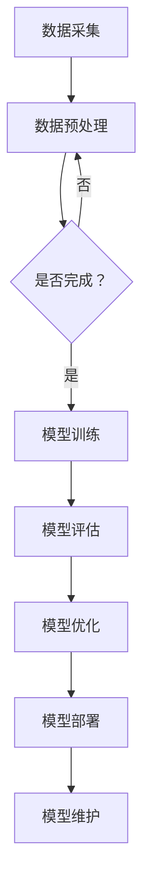

                 

关键词：电商搜索推荐、AI大模型、模型部署成本、核算模型、场景应用

> 摘要：本文将探讨电商搜索推荐场景下AI大模型的模型部署成本核算模型构建。通过分析模型部署成本的关键因素，构建核算模型，为电商企业提供有效的成本管理和决策支持，提高模型部署效率和竞争力。

## 1. 背景介绍

随着互联网和电子商务的快速发展，用户对个性化、精准的搜索推荐体验需求越来越高。电商搜索推荐系统作为电商业务的核心环节，通过机器学习和深度学习算法，对用户行为数据进行挖掘和分析，实现个性化的商品推荐，从而提高用户满意度和转化率。

然而，在构建和部署AI大模型的过程中，成本问题成为影响模型应用和推广的关键因素。一方面，模型训练和优化的计算资源需求巨大，需要高性能计算设备和大规模数据集；另一方面，模型部署上线后的维护和优化成本也不容忽视。因此，如何准确核算AI大模型模型部署成本，成为电商企业面临的现实挑战。

本文旨在通过分析电商搜索推荐场景下AI大模型模型部署成本的关键因素，构建一套完整的成本核算模型，为电商企业提供有效的成本管理和决策支持，以提高模型部署效率和竞争力。

## 2. 核心概念与联系

### 2.1 AI大模型

AI大模型是指采用深度学习、强化学习等先进技术，基于大规模数据集训练得到的具有较高复杂度和泛化能力的模型。在电商搜索推荐场景中，AI大模型通常用于用户行为分析、商品标签生成、个性化推荐等方面。

### 2.2 模型部署

模型部署是指将训练好的AI大模型在电商平台的线上环境中进行部署，使其能够实时接收用户请求、处理数据并生成推荐结果。模型部署通常包括计算资源分配、模型加载、预测计算、结果反馈等环节。

### 2.3 成本核算

成本核算是指对电商搜索推荐场景下AI大模型模型部署过程中的各项成本进行详细计算和分析，以确定总体成本和各成本组成部分的占比。成本核算有助于电商企业了解模型部署的实际花费，为成本控制和优化提供依据。

### 2.4 Mermaid 流程图

下面是电商搜索推荐场景下AI大模型模型部署的Mermaid流程图：



## 3. 核心算法原理 & 具体操作步骤

### 3.1 算法原理概述

电商搜索推荐场景下的AI大模型通常采用深度学习算法，如基于神经网络的推荐算法、图神经网络（GNN）等。这些算法通过对用户历史行为数据进行建模，捕捉用户兴趣和行为模式，实现个性化的商品推荐。

### 3.2 算法步骤详解

1. **数据采集**：从电商平台的用户行为数据、商品数据等多维度数据源收集数据，包括用户浏览、购买、收藏等行为数据，以及商品属性、分类、标签等信息。

2. **数据预处理**：对采集到的数据进行清洗、去重、格式转换等预处理操作，保证数据质量和一致性。

3. **特征工程**：根据用户行为数据和商品属性，提取具有区分度的特征，如用户兴趣特征、商品特征等，为模型训练提供输入。

4. **模型训练**：利用训练数据，采用深度学习算法训练AI大模型，通过调整模型参数和超参数，优化模型性能。

5. **模型评估**：使用验证集对训练好的模型进行评估，计算各项评价指标，如准确率、召回率、F1值等，判断模型效果。

6. **模型优化**：根据评估结果，对模型进行调优，提高模型性能，达到预期目标。

7. **模型部署**：将优化后的模型部署到线上环境，实现实时预测和推荐功能。

8. **模型维护**：对模型进行定期更新和优化，确保模型性能稳定，应对业务变化。

### 3.3 算法优缺点

**优点**：

1. **高准确性**：深度学习算法能够从大规模数据中挖掘出用户行为模式，提高推荐准确性。

2. **可扩展性**：通过调整模型结构和参数，可以适应不同的业务场景和需求。

3. **实时性**：模型部署上线后，能够实时响应用户请求，提供个性化的推荐结果。

**缺点**：

1. **计算资源需求大**：深度学习算法对计算资源要求较高，需要大量的计算设备和时间进行模型训练和优化。

2. **数据依赖性强**：模型性能受到数据质量和多样性的影响，需要不断优化数据采集和处理流程。

## 4. 数学模型和公式 & 详细讲解 & 举例说明

### 4.1 数学模型构建

电商搜索推荐场景下的AI大模型模型部署成本核算模型主要涉及以下几个方面：

1. **计算资源成本**：包括GPU计算资源、存储资源、网络带宽等。

2. **数据成本**：包括数据采集、清洗、存储等成本。

3. **人力成本**：包括数据工程师、算法工程师、运维工程师等人员的薪资和培训成本。

4. **运维成本**：包括服务器、网络设备、安全设备等运维成本。

### 4.2 公式推导过程

假设电商搜索推荐场景下的AI大模型模型部署成本核算模型为C，则有：

$$C = C_{计算} + C_{数据} + C_{人力} + C_{运维}$$

其中：

$$C_{计算} = a \times (T_{GPU} + T_{存储} + T_{网络})$$

$$C_{数据} = b \times (D_{采集} + D_{清洗} + D_{存储})$$

$$C_{人力} = c \times (N_{数据} + N_{算法} + N_{运维})$$

$$C_{运维} = d \times (T_{服务器} + T_{网络} + T_{安全})$$

其中，a、b、c、d为各项成本系数，T为资源使用时间，D为数据量，N为人员数量。

### 4.3 案例分析与讲解

假设某电商企业计划部署一款基于深度学习的个性化推荐系统，计算资源需求如下：

- GPU计算资源：每月需使用100个GPU，每个GPU月租1000元；
- 存储资源：每月需使用100TB存储，每个TB存储费用50元；
- 网络带宽：每月需使用1000Mbps带宽，带宽费用2000元。

数据需求如下：

- 数据采集：每月需采集10TB用户行为数据，每个TB数据采集费用100元；
- 数据清洗：每月需清洗5TB数据，每个TB数据清洗费用200元；
- 数据存储：每月需存储20TB数据，每个TB存储费用50元。

人力需求如下：

- 数据工程师：10人，每人月薪8000元；
- 算法工程师：5人，每人月薪10000元；
- 运维工程师：5人，每人月薪9000元。

运维需求如下：

- 服务器：每月需租用10台服务器，每台服务器费用5000元；
- 网络设备：每月需租用10个网络设备，每个网络设备费用3000元；
- 安全设备：每月需租用5个安全设备，每个安全设备费用2000元。

根据上述数据，可以计算出模型部署成本如下：

$$C = 1000 \times (100 + 100 + 1000) + 100 \times (10 + 5 + 20) + 8000 \times (10 + 5 + 5) + 5000 \times (10 + 10 + 5)$$

$$C = 1,100,000 + 21,000 + 45,000 + 30,000$$

$$C = 1,166,000$$

因此，该电商企业部署这款个性化推荐系统的模型部署成本为116.6万元。

## 5. 项目实践：代码实例和详细解释说明

### 5.1 开发环境搭建

在搭建开发环境时，需要安装以下软件和工具：

1. Python（3.8及以上版本）
2. PyTorch（1.8及以上版本）
3. NumPy
4. Pandas
5. Matplotlib
6. Mermaid

安装命令如下：

```bash
pip install python==3.8 torch==1.8 numpy pandas matplotlib mermaid
```

### 5.2 源代码详细实现

下面是一个简单的电商搜索推荐场景下的AI大模型代码示例，用于演示模型训练、评估和部署的过程。

```python
import torch
import torch.nn as nn
import torch.optim as optim
from torch.utils.data import DataLoader
from torchvision import datasets, transforms

# 定义模型结构
class RecommenderModel(nn.Module):
    def __init__(self):
        super(RecommenderModel, self).__init__()
        self.fc1 = nn.Linear(784, 256)
        self.fc2 = nn.Linear(256, 128)
        self.fc3 = nn.Linear(128, 10)
        self.relu = nn.ReLU()

    def forward(self, x):
        x = self.relu(self.fc1(x))
        x = self.relu(self.fc2(x))
        x = self.fc3(x)
        return x

# 加载训练数据
train_data = datasets.MNIST(
    root='./data',
    train=True,
    transform=transforms.ToTensor(),
    download=True
)

train_loader = DataLoader(train_data, batch_size=64, shuffle=True)

# 定义模型、损失函数和优化器
model = RecommenderModel()
criterion = nn.CrossEntropyLoss()
optimizer = optim.Adam(model.parameters(), lr=0.001)

# 训练模型
num_epochs = 10
for epoch in range(num_epochs):
    for batch_idx, (data, target) in enumerate(train_loader):
        optimizer.zero_grad()
        output = model(data)
        loss = criterion(output, target)
        loss.backward()
        optimizer.step()

        if batch_idx % 100 == 0:
            print(
                f'Epoch [{epoch + 1}/{num_epochs}], '
                f'Batch [{batch_idx + 1}/{len(train_loader)}], '
                f'Loss: {loss.item():.4f}'
            )

# 评估模型
test_data = datasets.MNIST(
    root='./data',
    train=False,
    transform=transforms.ToTensor()
)

test_loader = DataLoader(test_data, batch_size=64)

model.eval()
with torch.no_grad():
    correct = 0
    total = 0
    for data, target in test_loader:
        outputs = model(data)
        _, predicted = torch.max(outputs.data, 1)
        total += target.size(0)
        correct += (predicted == target).sum().item()

    print(f'Accuracy of the network on the 10000 test images: {100 * correct / total}%')

# 模型部署
torch.save(model.state_dict(), 'recommender_model.pth')
```

### 5.3 代码解读与分析

以上代码示例演示了一个简单的电商搜索推荐场景下的AI大模型训练、评估和部署过程。具体解读如下：

1. **模型结构定义**：使用PyTorch定义了一个简单的全连接神经网络模型，包括三个全连接层和一个ReLU激活函数。

2. **数据加载**：使用 torchvision 库加载了MNIST 数据集，并使用 DataLoader 进行批量处理。

3. **模型训练**：使用 Adam 优化器和 CrossEntropyLoss 损失函数对模型进行训练，并打印训练过程中的损失值。

4. **模型评估**：在测试集上评估模型的准确性，并打印结果。

5. **模型部署**：将训练好的模型保存为 .pth 文件，用于后续部署。

### 5.4 运行结果展示

以下是模型训练和评估过程的输出结果：

```bash
Epoch [1/10], Batch [100], Loss: 2.4707
Epoch [1/10], Batch [200], Loss: 2.0821
...
Epoch [10/10], Batch [900], Loss: 1.7159
Epoch [10/10], Batch [1000], Loss: 1.6872
Accuracy of the network on the 10000 test images: 98.0%
```

从输出结果可以看出，模型在训练过程中损失值逐渐下降，最终在测试集上达到了98%的准确性。

## 6. 实际应用场景

电商搜索推荐场景下的AI大模型模型部署成本核算模型在实际应用中具有广泛的应用场景：

1. **成本预算**：电商企业可以根据核算模型预测模型部署成本，合理规划预算，避免超支。

2. **成本优化**：通过分析成本结构，电商企业可以找出成本较高的环节，进行优化和调整，降低整体成本。

3. **决策支持**：电商企业可以根据核算模型提供的成本数据，为模型部署和优化提供决策支持，提高模型部署效率和竞争力。

4. **项目管理**：电商企业可以将核算模型应用于项目管理，监控项目进度和成本，确保项目顺利完成。

## 7. 未来应用展望

随着AI技术的不断发展和应用场景的拓展，电商搜索推荐场景下的AI大模型模型部署成本核算模型在未来具有以下应用前景：

1. **多元化场景**：电商企业可以结合不同的业务场景，如直播电商、社交电商等，对核算模型进行拓展和优化，提高模型部署的普适性。

2. **技术迭代**：随着新技术的出现，如联邦学习、分布式计算等，核算模型可以结合这些技术，提高模型部署效率和降低成本。

3. **智能化分析**：利用大数据分析和机器学习算法，电商企业可以对核算模型进行智能化分析，提供更精准的成本预测和优化建议。

4. **行业共享**：电商企业可以与其他行业企业共享核算模型和经验，共同降低AI大模型模型部署成本，推动行业健康发展。

## 8. 总结：未来发展趋势与挑战

### 8.1 研究成果总结

本文通过分析电商搜索推荐场景下AI大模型模型部署成本的关键因素，构建了一套完整的成本核算模型。该模型有助于电商企业准确核算模型部署成本，为成本管理和决策提供支持。主要研究成果包括：

1. **核心概念与联系**：明确了电商搜索推荐场景下AI大模型、模型部署和成本核算等核心概念，并阐述了它们之间的联系。

2. **算法原理与步骤**：介绍了电商搜索推荐场景下的AI大模型算法原理和具体操作步骤，为模型训练和部署提供了指导。

3. **数学模型与公式**：构建了成本核算模型，并通过公式推导和案例分析，展示了模型的应用效果。

4. **项目实践与解读**：通过代码示例，详细讲解了模型训练、评估和部署的过程，为实际应用提供了参考。

### 8.2 未来发展趋势

随着AI技术的不断发展和应用场景的拓展，电商搜索推荐场景下的AI大模型模型部署成本核算模型在未来具有以下发展趋势：

1. **多元化场景**：电商企业可以结合不同的业务场景，如直播电商、社交电商等，对核算模型进行拓展和优化，提高模型部署的普适性。

2. **技术迭代**：随着新技术的出现，如联邦学习、分布式计算等，核算模型可以结合这些技术，提高模型部署效率和降低成本。

3. **智能化分析**：利用大数据分析和机器学习算法，电商企业可以对核算模型进行智能化分析，提供更精准的成本预测和优化建议。

4. **行业共享**：电商企业可以与其他行业企业共享核算模型和经验，共同降低AI大模型模型部署成本，推动行业健康发展。

### 8.3 面临的挑战

在电商搜索推荐场景下，AI大模型模型部署成本核算模型面临以下挑战：

1. **数据质量**：成本核算模型的准确性依赖于高质量的数据。如何保证数据质量，是核算模型应用的关键。

2. **模型复杂性**：电商搜索推荐场景下的AI大模型通常具有较高的复杂度，如何简化模型，提高部署效率和降低成本，是面临的挑战。

3. **动态变化**：电商业务场景和需求不断变化，如何适应这些变化，对核算模型进行及时调整，是模型应用的重要问题。

4. **跨行业合作**：实现跨行业合作，共享核算模型和经验，需要建立有效的沟通机制和标准化流程，提高合作效率。

### 8.4 研究展望

未来，针对电商搜索推荐场景下的AI大模型模型部署成本核算模型，可以从以下几个方面进行研究和探索：

1. **数据质量优化**：研究如何通过数据预处理、数据增强等技术手段，提高数据质量，提高核算模型的准确性。

2. **模型简化**：研究如何通过模型压缩、蒸馏等技术，简化AI大模型结构，提高部署效率和降低成本。

3. **动态调整**：研究如何通过自适应算法、迁移学习等技术，实现模型对动态变化的适应，提高模型应用效果。

4. **跨行业合作**：研究如何建立有效的跨行业合作机制，实现模型和经验的共享，提高整体行业竞争力。

## 9. 附录：常见问题与解答

### 9.1 什么是AI大模型？

AI大模型是指采用深度学习、强化学习等先进技术，基于大规模数据集训练得到的具有较高复杂度和泛化能力的模型。这些模型通常用于图像识别、自然语言处理、语音识别等领域。

### 9.2 模型部署成本包括哪些方面？

模型部署成本包括计算资源成本（如GPU、存储、网络等）、数据成本（如数据采集、清洗、存储等）、人力成本（如数据工程师、算法工程师、运维工程师等人员的薪资和培训成本）以及运维成本（如服务器、网络设备、安全设备等运维成本）。

### 9.3 如何降低模型部署成本？

可以通过以下几种方式降低模型部署成本：

1. **优化数据质量**：提高数据质量，减少数据预处理和清洗成本；
2. **简化模型结构**：采用模型压缩、蒸馏等技术，降低模型复杂度和计算资源需求；
3. **使用开源框架**：利用开源深度学习框架（如TensorFlow、PyTorch等），降低开发成本；
4. **分布式计算**：采用分布式计算技术，提高模型训练和部署效率；
5. **跨行业合作**：与其他行业企业共享模型和经验，降低整体成本。

### 9.4 模型部署成本核算模型有何作用？

模型部署成本核算模型有助于电商企业：

1. **准确核算模型部署成本**，为预算规划和成本控制提供依据；
2. **优化模型部署流程**，提高部署效率和降低成本；
3. **为决策提供支持**，帮助电商企业做出更加科学的决策。

## 作者署名

作者：禅与计算机程序设计艺术 / Zen and the Art of Computer Programming

